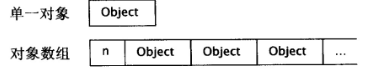
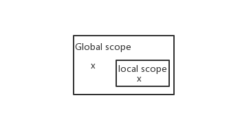
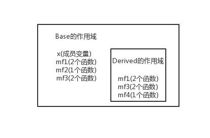

# 《Effective C++》学习总结

## 让自己习惯C++

<details>
<summary>条款01：视c++为一个语言联邦</summary>

# 条款01：视C++为一个语言联邦

  今天的C++已经是个 **多重泛型编程语言(multiparadigm programming language)** ，一个同时支持 **过程形式(procedural)** 、 **面向对象形式(object-oriented)** 、 **函数形式(functional)** 、 **泛型形式(generic)** 、 **元编程形式(metaprogramming)** 的语言。


  为了理解C++，最简单的办法是**将C++视为一个由相关语言组成的联邦而非单一语言**，在其某个次语言(sublanguage)中，各种守则与通例都倾向于简单、直观易懂，并且容易记住，C++的次语言有四种：

  - **C** ：
  
    区块(block)、语句(statements)、预处理(preprocessor)、内置数据类型(built-in data types)、数组(arrays)、指针(pointers)等等来自于C
 
  - **Object-Oriented C++** ：
  
    classes、封装(encapsulation)、继承(inheritance)、多态(polymorphism)、virtual函数(动态绑定)等等面向对象设计守则
  
  - **Template C++** ：
  
    C++的泛型编程(generic programming)部分，template metaprogramming(TMP, 模板元编程)
  
  - **STL** ：
  
    STL是个template程序库，拥有容器(containers)、迭代器(iterators)、算法(algorithms)等非常有用的工具

</details>


<details>
<summary>条款02：尽量以const, enum, inline替换#define</summary>

# 条款02：尽量以const、enum、inline替换#define

  或者说“尽量以编译器替换预处理器”
  
## 为什么不使用#define？
  * 首先，#define不被视为语言的一部分，当你定义`#define ASPECT_RATIO 1.653`时，ASPECT_RATIO不会被编译器看见，所以也不会进入记号表中，因此当因为此常量得到一个便宜错误时，错误信息中会提及1.653而不是ASPECT_RATIO，在调试时追踪它将会浪费时间
  * 而且，使用#define定义宏时，宏的简单替换原则会导致无法预计的错误

## 怎么做？

1. 以const代替#define常量
    * #define PI 3.14  => const double Pi = 3.14;
    * #define NAME "Scott Metyers" => const char* name = "Scott Metyers";
    * ```
       class GamePlayer {
        private:
            static const double n;  //声明式
       }
       const double GamePlayer::n = 1.35;   //定义式
       ```

2. 以enum代替#define

    enum的行为某方面来说更像#define而不像const
    ```
    class GamePlayer {
    private:
        enum{ NumTurns = 5 };
        int scores[NumTurns];  //数组的大小必须在编译时确定
    }
    ```

3. 以inline代替#define宏

    * 宏：
       - 优点：看起来像函数，但不会招致函数调用带来的额外开销
       - 缺点：宏的简单替换原则会导致无法预计的错误
      
    * 以inline函数代替宏更加安全

</details>

<details>
<summary>条款03：尽可能使用const</summary>

# 条款03：尽可能使用const

## 为什么要尽可能使用const？
  const允许你对某个对象指定“不该被改动”的约束，编译器会强制实施这个约束，帮助你确保该变量不会被其他代码或程序员改动。


## 怎么做？

### 1、const基本用法：

    char greeting[] = "Hello"; 
    char *p = greeting;         //non-const pointer, non-const data
    const char* p = greeting;   //non-const pointer, const data
    char* const p = greeting;   //const pointer, non-const data
    const char* const p = greeting; //const pointer, const data

    
**总结** ：const在 * 号左边，表示被指物是常量；const在 * 号右边，表示指针自身是常量
    
**Note** ：`const char *`和`char const *`这两种写法意义相同


### 2、STL:iterator和const_iterator
    
* ```
  const std::vector<int>::iterator iter <==> T* const iter   
  *iter = 10;  //Ok,改变iter所指之物
  iter++;  //Error，iter本身不可变
  ```
    
* ```
  std::vector<int>::const_iterator cIter <==> const T* cIter
  *cIter = 10;  //Error, *cIter是const
  cIter++;  //Ok，cIter可变
  ```
    
    
### 3、函数返回值尽量声明为const常量，可以在编译阶段发现错误：
  例：
  
    class Rational{...};
    const Rational operator * (const Rational& lhs, const Rational& rhs);
    Rational a, b, c;
    
  如果手误将if (a*b == c)写成 if (a*b = c) (这样的事情经常发生)，因为返回值为const而无法编译通过
    
    
### 4、const成员函数：
- class接口中使用const使得接口更容易理解；
- const成员函数可以操作const对象，c++通过reference-to-const方式传递对象来改善程序运行效率，运用此技术的前提是有const成员函数来处理取得的const对象
    
    **Note:两个成员函数如果只是常量性不同，可以被重载**
   
    ```
    class TextBlock{
    public:
        const char& operator[] (std::size_t position) const //const对象版本的operator[]函数
        {return text[position];}
        char& operator[] (std::size_t position) //非const对象版本的operator[]函数
        {return text[position];}
    }
    void printf(const TextBlock& ctb)   //此处ctb为const
    {
        std::cout << ctb[0];    //调用const TextBlock::operator[]
        //ctb[0] = 'x';         //错误，不能对写一个const对象
    }     
    ```
    
    const成员函数的两个流行概念：`bitwise constness` 和 `logical constness`
    
    * **bitwise constness** ：const成员函数必须不更改对象之内任何成员变量(static除外),即是不更改对象内的任何一个bit
        
        缺点：许多成员函数虽然不十足具备const性质但却能通过bitwise测试，例：
        ```
        char& operator[](std::size_t position) const    //函数内未修改对象的任何non-static成员变量
        {return pText[position];}                       //但是返回一个成员变量的引用导致外界可能对该对象进行更改
        ```
    
    * **logical constness**：const成员函数可以修改它所处理的对象内的某些bits，但只有在客户端侦测不出的情况下才能如此
        此时需要使用mutable(可变的)关键字修饰可以在const函数中修改的成员变量，例：
        
        ```
        class CTextBloxk{
        public:
            std::size_t length() const;
        private:
            char* pText;
            mutable std::size_t textLength; //这些成员函数可能总是会被更改，即使在const成员函数中
            mutable bool lengthIsValid; //不加mutable在const成员函数中直接修改会导致编译错误
        };
        std::size_t CTextBloxk::length() const{
            if (!lengthIsValid){
                textLength = std::strlen(pText);
                lengthIsValid = true;
            }
            return textLength;
        }
        ```
    
    编译器强制实施bitwise constness，但你编写程序时应该尽可能使用logical constness.


### 5、在const和non-const成员函数中避免重复：
当const和non-const成员函数有着实质等价的实现时，令non-const版本调用const版本可避免代码重复，例：

```
class TextBlock {
public:
const char& operator[](std::size_t position) const 
{ ... ... ... return text[position]; }
};
char& operator[](std::size_t position){
    return const_case<char&>(       //将op[]返回值的const移除
        static_case<const TextBlock&>(*this)    //为*this加上const
            [position]              //调用const op[]
        );
}
```

注意必须使用non-const版本调用const版本，而非const版本调用non-const版本，因为const成员函数本身承诺并不会调用任何非const成员函数

</details>

<details>
<summary>条款04：确定对象被使用前已先被初始化</summary>

# 条款04：确定对象被使用前已被初始化

c++对于"将对象初始化"这件事上总是反复无常，所以最简单有效的处理办法就是：永远在对象使用之前先将它初始化

**1、使用类构造函数的初始化列表为类的成员变量进行初始化**

规则：
  - 应该总在初始化列表中列出所有的成员变量

    对于需要使用default构造函数构造成员变量时，可以使用nothing作为初始化实参，例：
    ```
    ABEntry::ABEntry()
        :theName(), //调用theName的default构造函数
    {}
    ```
   - 成员是const或者references，必须使用初始化
   - 在拥有多个构造函数，每个构造函数有自己的成员初值列。
    这多少会导致一部分重复工作，所以可以适当的在初值列中“遗漏”那些”赋值表现的像初始化一样好“的成员变量，改用他们的赋值操作，并将那些赋值操作移往某个函数(通常是private)中


**2、类成员变量初始化次序**

c++有着固定的成员初始化次序：
  - base classes更早于其derived classes被初始化 
  - class的成员变量总是以其声明次序被初始化，与成员变量在初值列中出现的顺序无关，所以为了避免误会，当你在成员初值列中条列各个成员时，最好总是以其声明次序为次序


**3、“不同编译单元内定义的non-local static 对象”的初始化次序**

**概念：**
  - **static:**
  
    static对象，其寿命从被构造出来直到程序结束为止，包括*global对象*、定义于*namespace作用域内的对象*、在class内、函数内、以及在file作用域内*被声明为static的对象*
    
    已初始化的全局和静态C变量保存在`.data`段，未初始化的全局和静态C变量保存在`.bss`(Batter Save Space)段
    
  - **local static:**
  
    函数内的static对象被称为local static对象，local static对象会在”该函数被调用期间“”首次遇上该对象之定义式“时被初始化
    
  - **non-local static:**
  
    其他不在函数中定义的static对象成为non-local static对象
    
  - **编译单元：**
  
    指产出单一目标文件(single object file)的那些源码，基本上它是单一源码文件加上其所含入的头文件(#include file)

**提出问题：**

***如果某编译单元内的某个non-local static对象的初始化动作使用了另一个编译单元内的某个non-local static对象，它所用到的这个对象可能尚未被初始化，因为C++对”定义于不同编译单元内的non-local static对象“的初始化次序并无明确定义所以应该如何保证当前编译单元中的non-local static对象初始化时，所依赖的另一个编译单元的non-local static对象已经被初始化？***

  举例：

  ```
  //编译单元A.obj
  class FileSystem {
  public:
      ...
      std::size_t numDisks() const;
      ...
  };
  extern FileSystem tfs;

  //编译单元B.obj
  class Directory {
  public:
      Directory( params );
      ...
  };
  Directory::Directory( params ) {
      ...
      std::size_t disks = tfs.numDisks();
      ...
  }

  Directory tempDir( params ); //除非tfs在tempDir之前被初始化，否则tempDir的构造函数会用到未初始化的tfs
  ```
    
**解决办法：** 

**Singleton模式：** 将每个non-local static对象搬到自己的专属函数内(该对象在此函数内被声明为static)。 这些函数返回一个reference指向它所含的对象，然后用户调用这些函数，而不直接指涉这些对象。换句话说：non-local static对象被local static对象替换了

```
//编译单元A.obj
class FileSystem { ... };
FileSystem& tfs() {
    static FileSystem fs;
    return fs;
}

//编译单元B.obj
class Directory { ... };
Directory::Directory( params ) {
    ...
    std::size_t disks = tfs().numDisks();
    ...
}
Directory& tempDir() {
    static Directory td;
    return td;
} 
```

**仍然会存在的问题：**

”内含static对象“的函数在多线程系统中带有不确定性。

**处理这个麻烦的一种做法是：** 在程序的单线程启动阶段(single-threaded startup portion)手工调用所有(reference-returning)函数，这可以消除与初始化有关的"竞速形势(rate conditions)"
</details>

## 构造/析构/赋值运算

<details>
<summary>条款05：了解C++默默编写并调用哪些函数</summary>

# 条款05：了解C++默默编写并调用哪些函数

> 需要重写

- 写一个空类，如果你自己没声明，编译器就会为这个类声明(只有当这些函数被调用时才创建)一个**copy构造函数**，一个**copy assignment操作符**和一个**析构函数**，此外如果你没有声明任何构造函数，编译器也会为你声明一个**default构造函数**，所有这些函数都是public和inline的。

- 编译器版本的copy构造函数和copy assignment操作符只是单纯的将来源对象的每一个non-static成员变量拷贝到目标对象

- 编译器拒绝为“内含reference成员”和“内含const成员”的classes中声明默认copy assignment操作符，如果需要赋值操作，必须自己定义copy assignment操作符

- 如果某个base classes将copy assignment操作符声明为private，编译器将拒绝为其derived classes生成一个copy assignment操作符
</details>
<details>
<summary>条款06：若不想使用编译器自动生成的函数，就该明确拒绝</summary>

# 条款06：若不想使用编译器自动生成的函数，就该明确拒绝


不希望类支持copy构造函数和copy assignment操作符，则可以：

- 将copy构造函数和copy assignment声明为私有并且只定义不声明，只定义不声明是为了防止友元函数或者成员函数调用它(调用一个只定义未声明的函数会获得一个链接错误)

- 构造一个uncopyable类，然后将你不希望支持copy构造和copy assignment操作符的类继承于uncopyable类

  **原理：**
  uncopyable类的copy构造函数和copy assignment操作符声明为私有，编译器在调用一个“编译器版本”的copy构造函数和copy assignment操作符时，会尝试调用其base class的对应函数，这些调用会被拒绝

  ```
  class uncopyable {
  protected:
      uncopyable() {}
      ~uncopyable() {}
  private:
      uncopyable(const uncopyable&);
      uncopyable operator=(const uncopyable&);
  };
  ```
  参考：Boost库中的noncopyable
</details>
<details>
<summary>条款07：为多态基类声明virtual析构函数</summary>

# 条款07：为多态基类声明virtual析构函数

**问题：**

```
class Base{
public:
    Base();
    ~Base();
};
class Derived : public Base { ... };

Base *ptk = new Derived();
delete ptk;
```

如上所示，delete ptk会导致程序只调用Base的析构函数，导致Derived部分占用的内存泄漏

**解决：**

- polymorphic(带多态性质的) base classes应该声明一个virtual析构函数。如果class带有任何virtual函数，它就应该拥有一个virtual析构函数

- classes的设计目的如果不是作为base classes使用，或不是为了具备多态性(polymorphically)，就不该声明virtual析构函数

**Note：** 针对上述的第二点，滥用virtual析构函数可能会导致类的size变大，因为使用virtual函数会导致类中多出来虚表和虚指针

**其他：**

- 有时候你希望拥有抽象class，但手上又没有任何pure virtual函数，可以为该抽象class声明一个pure virtual析构函数，但是你同时还必须为这个pure virtual析构函数提供一份定义。
因为析构函数的运作方式是，最深层派生的那个class其析构函数最先被调用，然后其每一个base class的析构函数被调用。
  ```
  class AbstractClass {
  public:
      virtual ~AbstractClass() = 0;
  }
  AbstractClass::~AbstractClass() {}  //析构函数的定义
  ```
  
- 当你企图继承所有STL容器如vector, list, set, tr1::unordered_map等或任何其他“带有non-virtual析构函数”的class时，放弃吧，因为当调用析构函数会导致一些不明确的行为。
</details>
<details>
<summary>条款08：别让异常逃离析构函数</summary>

# 条款08：别让异常逃离析构函数

## 为什么说“别让异常逃离析构函数”？

**让异常逃离析构函数可能使程序出现`过早结束`或`不明确行为`的风险**

```
class Widget {
public:
    ...
    ~Widget() { ... }   //假设这里可能产生一个异常
};
void doSomething() {
    std::vector<Widget> v;
    ...   //v在这里自动销毁，v中包含多个Widget
            //如果析构第一个Widget时发生异常，那么程序会过早结束，其余的Widget不会被释放
}
```

## 怎么做？

```
//这个class用来管理DBConnection对象
class DBConn {
public:
    ...
    ~DBConn() {   //确保数据库连接总是会被关闭
        db.close();  //调用close可能会发生异常
    }
private:
    DBConnection db;
};
```

- **析构函数可以捕捉异常，然后吞下它们（不传播）或结束程序**

  - close()抛出异常就使用abort()结束异常
  
    ```
    DBConn::~DBConn() {
        try { db.close(); }
        catch (...) {
            记录close调用失败
            std::abort();
        }
    }
    ```
    适用于异常对于程序是致命的，发生该异常程序将无法继续执行，强迫程序强制结束是比程序继续运行导致不明确行为更好的选择。
  
  - 吞下因调用close()而发生的异常
  
    ```
    DBConn::~DBConn() {
        try { db.close(); }
        catch (...) {
            记录close调用失败
        }
    }
    ```
    适用于发生该异常程序还是可以可靠的运行下去，好于程序“过早退出”或“发生不明确行为”

- **提供一个普通函数执行可能会发生异常的操作**

  一个更加好的策略是重新设计DBConn的接口，使其调用者有机会对可能出现的问题做出反应，
  例如DBConn自己可以提供一个close函数，调用者就有机会处理数据库关闭可能遇到的异常，
  如果调用者未主动调用close关闭数据库，说明调用者对于数据库关闭发生的异常并不感兴趣，
  所以关闭动作交给DBConn的析构函数并且使用上面两个方法处理可能发生的异常
  
  ```
  class DBConn {
  public:
      ...
      void close() {  //提供给调用者的新函数
          db.close();
          closed = true;
      }
      ~DBConn() {
          if (!closed) {
              try {
                  db.close();   //关闭连接(如果调用者未关闭的话)
              }
              catch (...) {
                  处理并记录close的调用失败
                  ...
              }
          }
      }
  private:
      DBConnection db;
      bool closed;
  };
  ```

**总结：**

- 析构函数绝对不要吐出异常。如果一个被析构函数调用的函数可能抛出异常，析构函数应该捕捉任何异常，然后吞下它们（不传播）或结束程序

- 如果客户需要对某个操作函数运行期间抛出的异常做出反应，那么class应该提供一个普通函数（而非在析构函数中）执行该操作
</details>
<details>
<summary>条款09：绝不在构造和析构过程中调用virtual函数</summary>

# 条款09：绝不在构造和析构过程中调用virtual函数

```
class Transaction {
public:
    Transaction() {
        ...
        logTransaction();
    }
    virtual void logTransaction() const = 0;
    ...
};
class BuyTransaction : public Transaction {
public:
    virtual void logTransaction() const {...}
    ...
};
class SellTransaction : public Transaction {
public:
    virtual void logTransaction() const {...}
    ...
};

BuyTransaction b;
```

写出上面代码的本意是希望**构造b的时候，在父类Transaction的构造函数中调用BuyTransaction版本的logTransaction函数**

然而，事与愿违，因为此时在基类中调用的logTransaction函数并非BuyTransaction版本，而是父类版本中的，
而父类中的logTransaction只有声明没有定义，所以会引发类似“对象未初始化”的错误

显然，通过上面的例子我们了解到**base classes构造期间，virtual函数绝不会下降到derived classes阶层**

原因：

  - 一个好的理由是由于base class构造函数的执行更早于derived class构造函数，当base class构造函数执行时derived class的成员变量尚未初始化，
  如果此期间调用的virtual函数下降至derived classes阶层，要知道derived class的函数几乎必然取用local成员变量，而那些成员变量尚未初始化，
  这将会引起“要求使用对象内部尚未初始化的成分”的错误
  - 更根本的原因：在derived class对象的base class构造期间，对象的类型是base class而不是derived class。
  不只是virtual函数会被编译器解析至(resolve to)base class，若使用运行期类型信息(runtime type information,例如dynamic_cast和typeid)，
  也会把对象视为base class类型。
     
    本例中，当Transaction构造函数正执行起来打算初始化"BuyTransaction对象内的base class成分"时，该对象的类型是Transaction。
    那是一个c++次成分(条款01)的态度，这样对待是合理的：这个对象内的"BuyTransaction专属成分"尚未被初始化，
    所以面对它们，最安全的做法就是视它们不存在，对象在derived class构造函数开始执行前不会成为一个derived class对象。

同样的道理也适用于析构函数：**一旦derived class析构函数开始执行，对象内的derived class成员变量便呈现未定义值，所以C++视它们仿佛不再存在。
进入base class析构函数后对象就成为一个base class对象，而C++的任何部分包括virtual函数、dynamic_casts等等也就那么看待它。**

确保避免程序在构造函数中直接或者间接调用virtual函数(间接调用例如：在构造函数中调用init函数，init函数为non-virtual函数，init函数中调用virtual函数logTransaction()，这种情况下编译器无法察觉)

问题：
  ***如何避免在构造函数中调用virtual函数并且确保每次一有Transaction继承体系上的对象被创建时，就会有适当版本的logTransaction被调用？***

**可行的方案：**
在class Transaction内将logTransaction函数改为non-virtual，然后要求derived class构造函数传递必要信息给Transaction构造函数，而后那个构造函数便可安全的调用non-virtua logTransaction
</details>
<details>
<summary>条款10：令operator=返回一个reference to *this</summary>

# 条款10：令operator=返回一个reference to *this

- 令赋值(assignment)操作符返回一个reference to *this以实现连锁赋值：x = y = z = 15

- 赋值操作符包括但不限于：operator=、operator+=、operator-=、...

```
class Widget {
public:
    ...
    Widget& operator=(const Widget& rhs) {
        ...
        return *this;
    }
    ...
};
```

</details>
<details>
<summary>条款11：在operator=中处理“自我赋值”</summary>

# 条款11：在operator=中处理“自我赋值”


自我赋值可能发生的时机：

```
Widget w; w = w;
a[i] = a[j];    //有可能i==j
*px = *py;      //px == py
```

## 方法：

假设建立一个class用来保存一个指针指向一块动态分配的位图(bitmap):

```
class Bitmap { ... };
class Widget {
    ...
private:
    Bitmap* pb;
};
```

- 版本一：不具备“自我赋值安全性”和“异常安全性”的版本
  ```
  Widget& Widget::operator=(const Widget& rhs) {
      delete pb;
      pb = new Bitmap(*rhs.pb);
      return *this;
  }
  ```
  
  不具备“自我赋值安全性”：如果rhs和*this是同一个对象，那么delete pb不止销毁当前对象的bitmap，它也销毁了rhs的bitmap

- 版本二：证同测试来具备“自我赋值安全性”
  ```
  Widget& Widget::operator=(const Widget& rhs) {
      if (this == &rhs) return *this;     //证同测试
          delete pb;
      pb = new Bitmap(*rhs.pb);
      return *this;
  }
  ```
  具备“自我赋值安全性”但不具备“异常安全性”：如果new Bitmap失败导致异常(内存不足或copy 构造函数抛出异常)，pb将指向一块删除的内存地址，这样的指针有害

- 版本三：让operator=具备“异常安全性”往往自动获得“自我赋值安全性的”回报，因此对“自我赋值”的态度是倾向于不去管它，把焦点放在实现“异常安全性”上
  ```
  Widget& Widget::operator=(const Widget& rhs) {
      Bitmap* pOrig = pb;
      pb = new Bitmap(*rhs.pb);
      delete pOrig;
      return *this;
  }
  ```

- 版本四：copy and swap手法
  ```
  void Widget::swap(Widget& rhs); //交换*this和rhs的数据
  Widget& Widget::operator=(const Widget& rhs) {
      Widget temp(rhs);
      swap(temp);
      return *this;
  }
  ```
</details>
<details>
<summary>条款12：复制对象时勿忘每一个成分</summary>

# 条款12：复制对象时勿忘每一个成分

> 需要重写

- copy构造函数和copy assignment函数等copying函数应保证对所有的成员变量进行拷贝，
  如果遗漏某些成员变量，编译器不会产生任何错误或警告，同时如果你为class添加一个成员变量，必须记得同时修改copying函数

- 当为一个子类编写copying函数时，确保调用所有base classes内的适当的copying函数

- 不要尝试以某个copying函数实现另一个copying函数，应该将共同机能放进第三个函数中，并有两个copying函数共同调用
</details>

## 资源管理

<details>
<summary>条款13：以对象管理资源</summary>

# 条款13：以对象管理资源

## 问题：

```
class Investment { ... };
Investment* createInvestment(); //工厂函数返回Investment指针
void f()
{
    Investment* pInv = createInvestment();  //调用factory函数
    ...
    delete pInv;    //通过factory函数返回的Investment*要自己释放
}
```

**可能发生内存泄漏的情况：**

- 如果...区域内一个过早的return语句被执行，程序将不会执行最后的delete pInv，导致内存泄漏

- 软件的后期维护中，可能会有某些人添加return语句或者控制流发生变化的语句导致delete语句无法执行

因此，单纯依赖“f总是会执行delete语句”是行不通的

## 解决：

**解决想法：** 把资源放进对象内，我们便可倚赖C++的“析构函数自动调用机制”确保资源被释放

具体解决办法例子：

- **auto_ptr** ：特性：若通过copy构造函数或copy assignment操作符复制它们，它们就变成null，而复制所得的指针将取得资源的唯一拥有权

  ```
  std::auto_ptr<Investment> pInv(createInvestment()); //使用auto_ptr

  std::auto_ptr<Investment> pInv1(pInv);      //使用pInv拷贝构造pInv1，导致pInv1指向对象而pInv指向null
  std::auto_ptr<Investment> pInv2 = pInv1;    //pInv2指向对象，而pInv指向null
  ```

  缺点：auto_ptr保证受auto_ptr管理的资源必须绝对没有一个以上的auto_ptr同时指向它，这并非普通指针的正常行为，所以并非管理动态分配资源的神兵利器

- auto_ptr的替代方案“ **引用计数型智慧指针** (reference-counting smart pointer:RCSP)”:

  ```
  tr1::shared_ptr：tr1:shared_ptr支持追踪共有多少对象指向某笔资源，并在无人指向它时自动删除该资源
  std::tr1::shared_ptr<Investment> pInv(createInvestment());
  ```

  缺点：无法打破环状引用(cycle of reference, 例如两个其实已经没被使用的对象彼此互指，因此双方好像还处在“被使用”状态)

- auto_ptr和tr1::shared_ptr两者都在其析构函数内做delete而不是delete[]动作，这意味着在动态分配而来的array上不能使用auto_ptr或tr1::shared_ptr，然而这种错误的用法仍然能通过编译
针对数组的、类似于auto_ptr和tr1::shared_ptr的智能指针有 **boost::scoped_array和boost::shared_array**

## 结论：

- 获得资源后立刻放进管理对象中，如auto_ptr或tr1::shared_ptr

- 管理对象运行析构函数确保资源释放

## 相关

- [智能指针总结](../C++/SmartPointer.md)
</details>

<details>
<summary>条款14：在资源管理类中小心coping行为</summary>

# 条款14：在资源管理类中小心coping行为

**coping函数(包括copy构造函数和copy assignment操作符)有可能会被编译器自动创建出来，除非编译器版本做了你想做的事，否则必须自己编写它们**

资源管理类中出现复制行为的四种解决方案：

- **禁止复制：** 将copying函数声明为private

- **对底层资源使用“引用计数法”：** 如tr1::shared_ptr

- **复制底部资源：** 实行深拷贝机制，对每一份资源都重新构造一份副本

- **转移底部资源拥有权：** 如auto_ptr：复制会使资源的拥有权从被复制物转移到目标物
</details>

<details>
<summary>条款15：在资源管理类中提供对原始资源的访问</summary>

# 条款15：在资源管理类中提供对原始资源的访问

  使用资源管理类如智能指针管理指针时，常常需要直接访问原始资源，这时候需要一个函数将资源管理对象转换为其所内含的原始资源，
有两种做法达到此目的： **显式转换** 和 **隐式转换**

## 以智能指针为例：

- **显式转换：** tr1::shared_ptr和auto_ptr中都提供get函数来返回智能指针内部的原始指针

  缺点：每次需要原始指针时都需要调用API接口，频繁的调用是一个不太友好的设计
  
  例：类Font为一个资源管理类，其中的原始资源为FontHandle类
  
  ```
  class Font {
  public:
      explicit Font(FontHandle fh) : f(fh) {}     //获得资源
      ~Font() { releaseFont(f); }     //释放资源
  private:
      FontHandle f;
  };
  为Font添加一个get函数来提供显式转换：
  class Font {
  public:
      ...
      FontHandle get() const { return f; }    //显式转换函数
      ...
  };
  ```
  
- **隐式转换：** 在资源管理类中提供与底层原始资源对应的类型转换函数
  
  例：为Font类添加一个FontHandle转换函数
  
  ```
  class Font {
  public:
      ...
      operator FontHandle() const { return f; }   //隐式转换函数
      ...
  };
  ```
  
  优点：相对于显式转换使用起来更加自然
  
  缺点：隐式转换可能在不被期望发生的情况下发生，而且很难察觉到，如下：
  
  ```
  FontHandle getFont() { return FontHandle(); }
  Font f1( getFont() );
  ...
  FontHandle f2 = f1;     //原意是要拷贝一个Font对象，现在反而先将f1隐式转换为FontHandle然后才复制它
  ```
  
## 选择：

选择 **显式转换函数** 还是 **隐式转换函数** 取决于该资源管理类被设计执行的特定工作，以及它被使用的情况：
    
- 接口的一个设计理念是“使接口更容易被正确使用，而不容易被误用”，从这个角度而言，显式转换是一个更好的选择；

- 然而，如果从使用起来更加自然友好，那么隐式转换是一个更好的选择

## 总结：

显式转换更安全，隐式转换更方便
</details>

<details>
<summary>条款16：成对使用new和delete时要采取相同形式</summary>

# 条款16：成对使用new和delete时要采取相同形式

**核心：如果你在new表达式中使用[]，必须在相应的delete表达式中也使用[]。如果你在new表达式中不使用[]，一定不要在相应的delete表达式中使用[]**

使用new创建单个对象或者使用new []创建对象数组的内存结构通常如下图：



```
std::string* stringPtr1 = new std::string;
std::string* stringPtr2 = new std::string[100];
...
delete stringPtr1;      //删除一个对象
delete [] stringPtr2;   //删除一个由对象组成的数组
```

- 如果对stringPtr1调用delete []：结果未定义，但如果内存布局如上图，delete会读取若干内存并将它解释为"数组大小"，然后开始多次调用析构函数，浑然不知它所处理的那块内存不但不是个数组，也或许它正在销毁自己并未持有的某种类型的对象

- 如果对stringPtr2调用delete：结果未定义，但即有可能导致太少的析构函数被调用

编码过程中要清楚的知道某个指针构造时采用的new形式，并且使用相匹配的delete来析构：

但是如果使用typedef常常会使得这个问题很难明白，例：

```
typedef std::string AddressLines[4];
//使用了typedef, new AddressLines等价于 new std::string[4]
std::string* pa1 = new AddressLines;    
//必须使用匹配“数组形式”的delete：
delete pa1;     //行为未定义
delete [] pa1;  //good
```

上述情况容易引起混淆，为避免这种不清晰的情况，尽量不要对数组形式采用typedef动作
</details>

<details>
<summary>条款17：以独立语句将newed对象置入智能指针</summary>

# 条款17：以独立语句将newed对象置入智能指针

假设有个函数用来揭示处理程序的优先级，另一个函数用来在某动态分配所得的widget上进行某些带有优先级的处理：

```
int priority();
void processWidget(std::tr1::shared_ptr<Widget> pw, int priority);
```

**错误的调用方式：**

```
processWidget(new Widget, priority());
```

应该使用：

```
processWidget(std::tr1::shared_ptr<Widget>(new Widget), priority()); //相对较好的调用方式，但仍可能发生内存泄漏问题
```

**C++函数参数初始化顺序不确定导致可能发生内存泄漏问题：**

在调用：

```
processWidget(std::tr1::shared_ptr<Widget>(new Widget), priority());
```
中，C++对参数的核算需要经过三个部分：**new Widget**，**调用tr1::shared_ptr的构造函数**，**调用priority()**

C++仅保证new Widget操作先于调用tr1::shared_ptr的构造函数，对于具体顺序并不做要求：

所以存在一种顺序：

  1. 执行new Widget
  2. 调用priority
  3. 调用tr1::shared_ptr的构造函数
  
这个时候，一旦在对priority调用期间发生异常，new Widget返回的指针将遗失，因为它还没有被交由智能指针管理

综上，导致内存泄漏的原因是在“资源被创建”和“资源被转换为资源管理对象”两个时间点之间有可能发生异常干扰

**解决方案：**

使用分离语句：

```
std::tr1::shared_ptr<Widget> pw(new Widget);    //在单独语句中完成“资源创建”并且“将资源交由资源管理对象管理”
processWidget( pw, priority() );    //绝对不会导致内存泄漏
```
</details>

## 设计与生命

<details>
<summary>条款18：让接口容易被正确使用，不易被误用</summary>

# 条款18：让接口容易被正确使用，不易被误用

- 好的接口很容易被正确使用，不容易被误用。你应该在你的所有接口中努力达成这些性质

- “促进正确使用”的办法包括接口的一致性，以及与内置类型的行为兼容

- “阻止误用”的办法包括建立新类型、限制类型上的操作，束缚对象值，以及消除客户的资源管理责任

- tr1::shared_ptr支持定制删除器(custom deleter)，这可防范DLL问题，可被用来自动解除互斥锁
</details>

<details>
<summary>条款19：设计class犹如设计type</summary>

# 条款19：设计class犹如设计type

当你定义一个新class时，也就新定义了一个type，因此你应该带着和“语言设计者当初设计语言内置类型时”一样的谨慎来研讨class的设计
设计一个新type之前，确保你已经考虑好以下讨论主题：

- **新的type的对象应该如何被创建和销毁？**
  
  确定是否需要重写内存分配函数operator new, operator new[], operator delete, operator delete[]以及class的构造函数和析构函数的编写

- **对象的初始化和赋值的差别？**
  
  对象的初始化和赋值分别对应的函数调用为构造函数和operator=，确保这两个调用的行为

- **新type的对象被pass by value时的行为？**

  copy构造函数用来定义一个type的pass by value该如何实现

- **新type的合法值？**

  新type的对象可以取到的合法值的数值集要明确，而且必须在成员函数(特别是构造函数、赋值操作符、"setter"函数)中进行错误检查工作

- **新type是否继承于其他type或者允许其他type继承？**

  如果新class继承于已有的class，那么就会受到原有class的设计的束缚，特别是受到“它们的函数是virtual或non-virtual”的影响
  
  如果你允许其他class继承于你的class，那会影响你所声明的函数——尤其是析构函数——是否为virtual

- **新type需要什么样的转换？**

  如果你希望允许类型T1之物隐式转换为类型T2之物，就必须在class T1内写一个类型转换函数(operator T2)或在class T2内写一个non-explicit-one-argument(可被单一实参调用)的构造函数

- **什么样的操作符和函数对此新type是合理的？**

  你将为你的class声明哪些member函数

- **什么样的标准函数应该驳回？**

  将不支持的标准函数设为private，例如：如不支持拷贝构造，便将拷贝构造函数设为private

- **谁该取用新type的成员？**

  想好新type的哪些成员是public，哪些是protected，哪些是private
  
  哪些class或functions应该是friend的

- **什么是新type的未声明接口(undeclared interface)?它对效率、异常安全性以及资源运用(如多任务锁定和动态内存)提供何种保证？你在这些方面提供的保证将为你的class实现代码加上相应的约束条件**

- **你的新type有多么一般化？**

  或许你其实并非定义一个新type，而是定义一整个type家族，果真如此你就不该定义一个新class，而是应该定义一个新的class template

- **你真的需要一个新type吗？**
</details>

<details>
<summary>条款20：宁以pass-by-reference-to-const替代pass-by-value</summary>

# 条款20：宁以pass-by-reference-to-const替代pass-by-value

- 尽量以pass-by-reference-to-const替换pass-by-value。前者通常比较高效，并可避免切割问题(slicing problem)
  
  切割问题(slicing problem)：当一个derived class对象以by value方式传递并被视为一个base class对象，base class的copy构造函数会被调用，
  而造成此对象的行为像个“derived class对象”的哪些特化性质全被切割掉了，仅仅留下一个base class对象

- 以上规则并不适用于内置类型，以及STL的迭代器和函数对象。对它们而言，pass-by-value往往比较适当
</details>

<details>
<summary>条款21：必须返回对象时，别妄想返回其reference</summary>

# 条款21：必须返回对象时，别妄想返回其reference

- 绝不要返回pointer或reference指向一个local stack对象；

- 绝不要返回reference指向一个heap-allocated对象

- 绝不要返回pointer或reference指向一个local static对象而有可能同时需要多个这样的对象

当你必须在“返回一个reference和返回一个object”之间抉择时，你的工作就是挑出行为正确的那个，
就让编译器厂商为“尽可能降低成本”鞠躬尽瘁吧，你可以享受你的生活
</details>

<details>
<summary>条款22：将成员变量声明为private</summary>

# 条款22：将成员变量声明为private

**不采用public成员变量的理由：**

- **语法一致性原理：** 如果成员变量不是public，那客户访问对象的唯一办法就是成员函数，如果public接口内每样东西都是函数，
  客户使用时就不会迷糊地试着记住是否该使用小括号
  
- **外部无法直接修改成员变量的值可以使你对成员变量进行更加细致的访问控制**

- **封装。**

  如果你通过函数访问某个成员变量，那么日后可改以某个计算替换这个成员变量，而class客户一点也不会知道class的内部实现已经起了变化，
  将成员变量隐藏在函数接口的背后，可以为“所有可能的实现”提供弹性。
        
  一般来说，成员变量的封装性与“成员变量的内容改变时所破坏的代码数量”成反比。所谓改变，也许是从class中移除它
         
  - 假设有一个public成员变量，当我们取消了它，所有使用它的客户代码都会被破坏，所以public完全没有封装性；
         
  - 假设有一个protect成员变量，当我们取消了它，所有使用它的derived classes都会被破坏，所以protected成员变量就像public成员变量一样缺乏封装性。
         
  从封装的角度来看，其实只有两种访问权限：private(提供封装)和其他(不提供封装)


**请记住：**

* 切记将成员变量声明为private。这可赋予客户访问数据的一致性、可细微划分访问控制、允诺约束条件得到保证，并提供class作者以充分的实现弹性

* protected并不比public更具封装性
</details>

<details>
<summary>条款23：宁以non-member、non-friend替换member函数</summary>

# 条款23：宁以non-member、non-friend替换member函数

想象有个class用来表示浏览器。该class可能提供的众多函数中，有一些用来清除下载元素高速缓存区(cache of downloaded elements)、
清除访问过的URLs的历史记录(history of visited URLs)，以及移除系统中的所有cookies

```
class WebBrowser
{
public:
    ...
    void clearCache();
    void clearHistory();
    void removeCookies();
    ...
};
```

许多客户会想一整个执行所有这些动作，因此WebBrowser也提供一个member函数clearEverything()：

```
class WebBrowser
{
public:
    ...
    void clearEverything(); //调用clearCache,clearHistory,removeCookies
};
```

当然，这一机能也可由一个non-member函数调用适当的member函数而提供出来：

```
void clearBrower(WebBrowser& wb)
{
    wb.clearCache();
    wb.clearHistory();
    wb.removeCookies();
}
```

non-member函数clearBrowser优于member函数的clearEverything，原因如下：

从封装的角度来看：面向对象的守则要求数据应该尽可能被封装，对象内，如果有越少的代码可以看到数据，那说明越多的数据被封装，
对于封装的数据我们可以有很大的弹性去改变它，良好的封装性可以使我们拥有尽可能大的改变事物的能力而只影响有限客户
如果一个member函数并不需要访问类的private变量，那它就可以改写为non-member函数来提高封装性，因为在两者提供相同功能的情况下，
可以带来较大封装性的是non-member non-friend函数，因为它并不增加“能够访问class内之private成分”的函数数量
所以non-member non-friend函数相对于member函数具有更加好的封装性

**non-member函数放置的位置：**

- 一般来说，因为在意封装性而让函数“成为class的non-member”并不意味着它“不可以是另一个class的member”，
我们可以令clearBrowser成为某工具(utility class)的一个static member函数，只要它不是WebBrowser的一部分(或成为其friend)，
就不会影响WebBrowser的private成员封装性

- C++中可以将clearBrowser成为一个non-member函数并且位于WebBrowser所在的同一namespac(命名空间)内：

```
namespace WebBrowserStuff
{
    class WebBrowser( ... );
    void clearBrowser( WebBrowser& wb );
}
```

因为namespace和classes不同，前者可以跨越多个源码文件而后者不能，所以可以将类的核心机能与类的各种其他功能的便利函数相互分离，使其脱离编译相依，如：
一个像WebBrowser这样的class可能拥有大量便利函数，某些与书签有关，某些与打印有关，还有一些与cookie的管理有关...，通常大多数用户只对其中某些感兴趣，
没有道理一个只对书签相关便利函数感兴趣的用户却与例如一个cookie相关便利函数发生编译相依关系。分离它们的最直接的办法就是
将书签相关便利函数声明于一个头文件，将cookie相关便利函数声明于另一个头文件，再将打印相关便利函数声明于第三个头文件，依此类推：

```
//头文件"webbrowser.h" —— 这个头文件针对class WebBrowser自身及WebBrowser核心机能
namespace WebBrowserStuff
{
    class WebBrowser{ ... };
    ...     //核心机能，例如几乎所有客户都需要的non-member函数
}

//头文件"webbrowserbookmarks.h"
namespace WebBrowserStuff
{
    ...     //与书签相关的便利函数
}

//头文件"webbrowsercookies.h"
namespace WebBrowserStuff
{
    ...     //与cookies相关的遍历函数
}
```

**Remember：**

宁可拿non-member non-friend函数替换member函数，这样做可以增加封装性、包裹弹性(packaging flexibility)和机能扩充性
</details>

<details>
<summary>条款24：若所有参数皆需类型转换，请为此采用non-member函数</summary>

# 条款24：若所有参数皆需类型转换，请为此采用non-member函数

假如你有下面的表示分数的类：

```
class Rational
{
public:
    Rational(int numerator = 0,     //构造函数刻意不为explicit，允许int-to-Rational隐式转换
            int denominator = 1);
    int numerator() const;      //分子和分母的访问函数
    int denominator() const;
private:
    ...
};
```

你想为这个表示分数的类增加算术运算，以乘法为例，但是你不确定增加的operator*函数是定义为member函数还是non-member函数：

先研究一下将operator*写成Rational成员函数的写法：

```
class Rational
{
public:
    ...
    const Rational operator* (const Rational& rhs) const;
};
```

这个设计可以满足大多数情况下的乘法：

```
Rational oneEighth(1, 8);
Rational oneHalf(1, 2);
Rational result = oneHalf * oneEighth;  //很好
result = result * oneEighth;            //很好
```

然而当你尝试混合算术时，发现只有一半行得通：

```
result = oneHalf * 2;   //很好
result = 2 * oneHalf;   //错误
```

上面的例子需要我们将2强转类型为Rational才能编译成功，这时我们可以将member函数写为non-member函数：

```
class Rational
{
    ...
};
const Rational operator*(const Rational& lhs, const Rational& rhs);
{
    return Rational(lhs.numerator() * rhs.numerator(), lhs.denominator()*rhs.denominator());
}
```

```
result = oneHalf * 2;   //没问题
result = 2 * oneHalf;   //没问题
```

**Remember：**

如果你需要为某个函数的所有参数(包括被this指针所指的那个隐喻参数)进行类型转换，那么这个函数必须是个non-member.
</details>

<details>
<summary>条款25：考虑写出一个不抛异常的swap函数</summary>

# 条款25：考虑写出一个不抛异常的swap函数

如果swap的缺省实现码对你的class或class template提供可接受的效率，你不需要额外做任何事。任何尝试置换(swap)那种对象的人都会取得缺省版本，
而那将有良好的运作。

如果swap缺省实现版的效率不足(几乎总是意味着你的class或template使用了某种pimpl手法)，试着做以下事情：

- 提供一个public swap成员函数，让它高效地置换你的类型的两个对象值，这个函数绝对不该抛出异常

- 在你的class或template所在的命名空间内提供一个non-member swap，并令它调用上述swap成员函数

- 如果你正编写一个class(非class template)，为你的class特化std::swap。并令它调用你的swap成员函数

最后，如果你调用swap，请确认包含一个using声明式，以便让std::swap在你的函数内曝光可见，然后不加任何namespace修饰符，赤裸裸地调用swap

```
namespace WidgetStuff
{
    ...
    template<typename T>
    class Widget { ... };       //内含swap成员函数
    ...
    template<typename T>
    void swap(Widget<T>& a, Widget<T>& b)
    { a.swap(b); }     //non-member swap函数，这里并不属于std命名空间
    ...
}
template<typename T>
void doSomething(T& obj1, T& obj2)
{
    using std::swap;        //令std::swap在此函数内可用
    ...
    swap(obj1, obj2);       //为T型对象调用最佳swap版本
}
```

编译器看到对swap的调用，会按照C++名称查找法则找到swap函数的定义：

1. 首先会查找global作用域或者T所在命名空间内的任何为类型T特化的swap：
2. 如果T是Widget并位于命名空间WidgetStuff内，编译器会使用"实参取决之查找规则"找出WidgetStuff内的swap。
3. 如果没有T专属之swap存在，编译器就使用std内的swap，这得感谢using声明式让std::swap在函数内曝光，即使如此编译器还是比较喜欢std::swap的T专属特化版，而非一般化的那个templae，所以如果你已针对T将std::swap特化，特化版会被编译器挑中
  
</details>

## 实现

<details>
<summary>条款26：尽可能延后变量定义式的出现时间</summary>

# 条款26：尽可能延后变量定义式的出现时间

只要你定义了一个变量而其类型带有一个构造函数或析构函数，那么当程序控制流(control flow)到达这个变量定义式时，你便得承受构造成本；
当这个变量离开其作用域时，你便得承受析构成本。即使这个变量最终并未被使用，仍需耗费这些成本，所以你应该尽可能避免这种情形

例：

```
//过早定义变量"encrypted"
std::string encryptPassword(const std::string& password)
{
    using namespace std;
    string encrypted;   //如果下面发生异常，encrypted在函数就没有被使用，却仍然付出了构造成本和析构成本
    if (password.length() < MinPasswordLength)
    {
        throw logic_error("Password is too short");
    }
    ...     //使用encrypted
    return encrypted;
}
```

```
//延后"encrypted"的定义，直到真正需要它
std::string encryptPassword(const std::string& password)
{
    using namespace std;
    if (password.length() < MinPasswordLength)
    {
        throw logic_error("Password is too short");
    }
    string encrypted; 
    ...     //使用encrypted
    return encrypted;
}
```

尽可能延后：你不只应该延后变量的定义，直到非得使用该变量的前一刻为止，甚至应该尝试延后这份定义直到能够给它初值实参为止。
   如果这样，不仅能够避免构造(和析构)非必要对象，还可以避免无意义的default构造行为

例：

```
//该函数延后了"encrypted"的定义，但无意义的构造行为使得它仍然效率低落
std::string encryptPassword(const std::string& password)
{
    ...
    std::string encrypted;  //无意义的构造行为
    encrypted = password;   //赋值行为
    encrypt(encrypted);
    return encrypted;
}

//跳过毫无意义的default构造过程，
std::string encryptPassword(const std::string& password)
{
    ...
    std::string encrypted(password);  
    encrypt(encrypted);
    return encrypted;
}
```

循环：如果变量只在循环内使用，那么把它定义于循环外并每次循环迭代时赋值好还是把它定义于循环内好？

```
//方法A：定义于循环外
Widget w;
for (int i = 0; i < n; ++i)
{
    w = ...;
    ...
}
//方法B：定义于循环内
for (int i = 0; i < n; ++i)
{
    Widget w(...);
    ...
}
```

两种方法各自的代价分析：

- 方法A：1个构造函数 + 1个析构函数 + n个赋值操作

- 方法B：n个构造函数 + n个析构函数

选用A：

(1)赋值成本低于"构造+析构"

(2)正在处理代码效率高敏感的部分

否则，选用B
</details>

<details>
<summary>条款27：尽量少做转型动作</summary>

# 条款27：尽量少做转型动作

**通常有三种不同的形式可以写出相同转型动作：**

- C风格的转型动作看起来像是这样：

  ```
  (T)expression     //将expression转型为T
  ```

- 函数风格的转型动作：

  ```
  T(expression)     //将expression转型为T
  ```

  这两种形式并无差别，纯粹只是小括号摆放位置不同而已，称此二种形式为"旧式转换"(old-style casts)

- C++提供四种新式转型(new-style or C++-style casts)

  ```
  const_cast<T>(expression)
  dynamic_casst<T>(expression)
  reinterpret_cast<T>(expression)
  static_cast<T>(expression)
  ```

  这四种转型各有其不同的用处：
  - const_cast被用来做对象的常量性移除。也是唯一有此能力的C++-style转型操作符

  - dynamic_casst主要用来执行"安全向下转型"(safe downcasting)，也就是用来决定某对象是否归属继承体系中的某个类型。唯一无法用旧式语法执行的动作，也是唯一可能耗费重大运行成本的转型动作

  - reinterpret_cast意图执行低级转型，实际动作可能取决于编译器，这也就表示它不可移植，例如将一个pointer to int转型为int，这一类转型在低级代码以外很少见

  - static_cast强迫隐式转换，例如将non-const对象转为const对象，或将int转换为double等。也可以用来执行上述多种转换的反向转换，例如将void*指针转为typed指针，将pointer-to-base转为pointer-to-derived，但它无法将const转为non-const——这个只有const_cast才能办到

  旧式转换仍旧合法，但是新式转换更受欢迎。原因：

  - 很容易在代码中辨识出来，因而得以简化“找出类型系统在哪个地点被破坏”的过程
  - 各转型动作的目标越窄化，编译器越可能诊断出错误的运用，举例：如果你打算将常量性去掉，除非使用新式转型中的const_cast否则无法编译

**Note:**

- **错误的观念：转型其实什么都没做，只是告诉编译器把某种类型看作另一种类型**

  任何一个类型转换(不论是通过转型操作而进行的显式转换，或通过编译器完成的隐式转换)往往真的令编译器编译出运行期间执行的代码。

  例1：

  ```
  int x, y;
  ...
  double d = static_cast<double>(x) / y;  //x除以y，使用浮点数乘法
  ```

  将int转型为double几乎肯定会产生一些代码，因为在大部分计算器体系结构种，int的底层描述不同于double的底层表述。

  例2：

  ```
  class Base { ... };
  class Derived : public Base { ... };
  Derived d;
  Base* pb = &d;      //隐式将Derived* 转换为Base*
  ```

  这里表面来看我们不过是建立一个base class指针指向一个derived class对象，但有时候上述的两个指针值并不相同。这种情况下会有一个偏移量(offset)在运行期间被施行于Derived*指针上，用以取得正确的Base*指针值

- **尽可能避免转型动作，转型容易导致我们写出某些似是而非的代码**

  例：

  ```
  class Window 
  {
  public:
      virtual void onResize() { ... }
      ...
  };
  class SpecialWindow : public Window
  {
  public:
      virtual void onResize()     //子类的onResize执行时要求先执行基类的onResize方法 
      {
          static_cast<Window>(*this).onResize();  //企图将this指针转换为Window来调用onResize，这不可行
          ...
      }
      ...
  };
  ```

  上述代码的预期行为是：将*this转型为Window，对函数onResize的调用也因此调用了Window::onResize()。
  但是，这恰恰带来了问题static_cast<Window>(*this)的行为与预想的不同，这个转型等价于Window(*this)，
  这相当于调用Window基类的拷贝构造函数生成了一个基类的临时对象，对这个临时对象调用onResize函数，
  而并非对this指针指向的对象身上执行基类的onResize操作

  解决办法就是拿掉转型操作，代之以你真正想说的话

- **注重效率的代码中避免使用dynamic_cast**

  dynamic_cast的许多实现版本执行速度非常慢。通常你之所以要使用dynamic_cast，是因为你想在一个你认定为derived class对象
  身上执行derived class操作函数，但你的手上却只有一个“指向base”的pointer或reference，你只能靠它们来处理对象

  有两个办法可以解决这种情况来代替使用dynamic_cast：

  - 使用容器并在其中存储直接指向derived class对象的指针(如智能指针)

    例：

    ```
    //错误的做法
    class Window { ... };
    class SpecialWindow : public Window 
    {
    public:
        void blink();
        ...
    };
    typedef std::vector<std::tr1::shared_ptr<Window> > VPW;
    VPW winPtrs;
    ...
    for (VPW::iterator iter = winPtrs.begin(); iter != winPtrs.end(); ++iter)
    {
        if (SpecialWindow* psw = dynamic_casst<SpecialWindow>(iter->get()))
            psw->blink();
    }
    ```

    ```
    //正确的写法：
    typedef std::vector<std::tr1::shared_ptr<SpecialWindow> > VPSW;
    VPSW winPtrs;
    ...
    for (VPSW::iterator iter = winPtrs.begin(); iter != winPtrs.end(); ++iter)
        (*iter)->blink();
    ```

  - 另一种做法可让你通过base class接口处理"所有可能之各种Window派生类"，那就是在base class内提供virtual函数做你想对各个Window派生类做的事。

    例：

    ```
    class Window
    {
    public:
        virtual void blink() {  }
        ...
    };
    class SpecialWindow : public Window
    {
    public:
        virtual void blink() { ... }
        ...
    };
    typedef std::vector<std::tr1::shared_ptr<Window> > VPW;
    VPW winPtrs;
    ...
    for (VPSW::iterator iter = winPtrs.begin(); iter != winPtrs.end(); ++iter)
        (*iter)->blink();
    ```

    绝对避免所谓的“连串dynamic_cast”，如：

    ```
    class Window { ... };
    typedef std::vector<std::tr1::shared_ptr<Window> > VPW;
    VPW winPtrs;
    ...
    for (VPSW::iterator iter = winPtrs.begin(); iter != winPtrs.end(); ++iter)
    {
        if (SpecialWindow1 *psw1 = dynamic_casst<SpecialWindow1*>(iter->get())) 
        { ... }
        else if (SpecialWindow1 *psw1 = dynamic_casst<SpecialWindow1*>(iter->get())) 
        { ... }
        else if (SpecialWindow1 *psw1 = dynamic_casst<SpecialWindow1*>(iter->get())) 
        { ... }
        ...
    }
    ```

    这样产生的代码又大又慢，而且基础不稳。

**Remember：**

  优良的C++代码很少使用转型
</details>

<details>
<summary>条款28：避免返回handles指向对象内部成分</summary>

# 条款28：避免返回handles指向对象内部成分

成员函数返回指向对象内部成分(类的protected、private成员)的hanldes(pointer或reference)带来的问题：

- 破坏封装性：会导致成员变量的封装性最多只等于"返回其reference"的函数的访问级别

- handles所指向的成员变量会在外部被改变，如果const成员函数传出一个reference，后者所指数据与对象自身有关联，
  而它又被存储于对象之外，那么这个函数的调用者可以修改那笔数据，这是bitwise constness的附带结果

  例：

  ```
  class Point { ... };
  struct RectData
  {
      Point ulhc;     //ulhc = "upper left-hand corner"左上角
      Point lrhc;     //lrhc = "lower right-hand corner"右下角
  };
  class Rectangle
  {
  public:
      ...
      Point& upperLeft() const { return pData->ulhc; }    //可以通过编译但是是错误的
      Point& lowerRight() const { return pData->lrhc; }   //可以通过编译但是是错误的
      ...
  private:
      std::tr1::shared_ptr<RectData> pData;
  };
  ```

  upperLeft和lowerRight函数被声明为const成员函数，本意是提供给客户一个得知Rectangle相关坐标点的方法，
  而不是让客户修改Rectangle，但是这两个函数却都返回reference和pointer内部数据，调用者可以通过这些reference更改内部数据

- 令成员函数返回一个指针指向“访问级别较低”的成员函数，如果这么做，后者的实际访问级别就会提高的如前者一样，
  因为客户可以取得一个指针指向哪个“访问级别较低”函数，然后通过哪个指针调用它

  例：一个public成员函数返回一个private成员函数的指针，外界可以通过这个函数指针调用类的private成员函数

- 可能导致dangling handles(虚吊句柄)的情况
  
  针对2中的问题可以为两个const函数的返回类型加上const解决，如：
  
  ```
  class Rectangle
  {
  public:
      ...
      const Point& upperLeft() const { return pData->ulhc; }
      const Point& lowerRight() const { return pData->lrhc; }
      ...
  };
  ```
  
  但这样还是会存在问题，例如：
  
  ```
  class GUIObject { ... };
  //以by value方式返回一个矩形
  const Rectangle boundingBox( const GUIObject& obj );
  ```
  
  如果这样使用该函数：
  
  ```
  GUIObject* pgo;
  ...
  const Point* pUpperLeft = &(boundingBox(*pgo).upperLeft());
  ```
  
  上面对boundingBox的调用将获得一个新的、暂时的Rectangle对象，然后对临时对象调用upperLeft函数，返回临时对象内部的成分交给pUpperLeft，
  然而，在本行语句分号结束之后，这个临时Rectangle对象就会被销毁，返回的对象内部的成分也会消失，pUpperLeft将变成野指针，
  也即是空悬、虚吊的(dangling)!
  
  总之，一旦有可能“handle比其所指对象更长寿”，那么这个handle就有虚吊的危险

**Remember：**

  尽量避免返回handles(包括pointer、reference、迭代器)指向对象内部
</details>

<details>
<summary>条款29：为“异常安全”而努力是值得的</summary>

# 条款29：为“异常安全”而努力是值得的

假如有一个拥有背景图片的GUI菜单类，class中有一个用于改变背景图片的方法，并且希望这个class用于多线程环境，所以它有个互斥锁(mutex)作为并发控制之用：

```
class PrettyMenu
{
public:
    ...
    void changeBackground(std::istream& imgSrc);    //改变背景图像
    ...
private:
    Mutex mutex;    //互斥锁
    Image* bgImage; //目前的背景图像
    int imageChanges;   //背景图片被改变次数
};
```

一个PrettyMenu的changeBackground的可能实现：

```
void PrettyMenu::changeBackground(std::istream& imgSrc)
{
    lock(&mutex);       //取得互斥锁
    delete bgImage;     //摆脱旧的背景图片
    ++imageChanges;     //修改图像修改次数
    bgImage = new Image(imgSrc);    //安装新的背景图像
    unlock(&mutex);     //释放互斥锁
}
```

这个函数不具备“异常安全性”，异常安全的两个条件，这个函数没有满足任何一个：

- 不泄露任何资源。

  一旦“new Image(imgSrc)”发生异常，对unlock的调用就绝不会执行，于是互斥锁被永远被锁，changeBackground函数没有做到这点

- 不允许数据败坏。

  如果“new Image(imgSrc)”抛出异常，bgImage就是指向一个已被删除的对象，imageChhuanges也已被累加，而其实并没有新的图像被成功安装起来
  
资源泄露的问题可以通过资源管理类来解决，如使用Lock类：

```
void PrettyMenu::changeBackground(std::istream& imgSrc)
{
    Lock ml(&mutex);    条款14：获得互斥锁并确保它稍后被释放
    delete bgImage;
    ++imageChanges;
    bgImage = new Image(imgSrc);
}
```

对于数据败坏的问题：

首先，异常安全函数(Exception-safe function)提供以下三个保证之一：

- 基本承诺：

  如果异常被抛出，程序内的任何事物仍然保持在有效状态下。没有任何对象或数据结构会因此而败坏，所有对象都处于一种
  内部前后一致的状态(例如所有的class约束条件都继续获得满足)。然而程序的现实状态(exact state)恐怕不可预料。
  
  举例：我们可以撰写changeBackground使得一旦有异常被抛出时，PrettyMenu对象可以继续拥有原背景图像，或是令它们拥有某个缺省背景图像，
  但客户无法预期哪一种情况，如果想知道，它们恐怕必须调用某个成员函数以得知当时的背景图像是什么。

- 强烈保证：

  如果异常被抛出，程序状态不改变。调用这样的函数需有这样的认知：如果函数成功，就是完全成功，如果函数失败，程序会回复到“调用函数之前”的状态。
  
  在调用一个提供强烈保证的函数后，程序状态只有两种可能：如预期般地到达函数成功执行后地状态，或回到函数被调用前地状态。与此成对比地是，如果调用一个只提供基本承诺地函数，而真的出现异常，程序有可能处于任何状态——只要那是个合法状态

- 不抛出异常(nothrow)保证：
  
  承诺绝不抛出异常，因为它们总是能够完成它们原先承诺地功能，作用于内置类型(如int，指针等)身上地所有操作都提供nothrow保证。

对changeBackground提供强烈保证：

- 通过资源管理类：

  ```
  class PrettyMenu
  {
      ...
      //智能指针代替普通Image指针
      std::tr1::shared_ptr<Image> bgImage;
      ...
  };
  void PrettyMenu::changeBackground(std::istream& imgSrc)
  {
      Lock ml(&mutex);
      //以"new Image"的执行结果设定bgImage内部指针
      bgImage.reset(new Image(imgSrc));   
      ++imageChanges;
  }
  ```

  首先，这里不再需要手动delete旧图像，因为这个动作已经由智能指针内部处理掉了。

  然后，删除动作只发生在新图像被成功创建之后。更正确的说，tr1::shared_ptr::reset函数只有在其参数(也就是“new Image(imgSrc)”)被
  成功生成之后才会被调用。delete只在reset函数内被使用，所以如果从未进入那个函数也就绝不会使用delete
  这两个改变几乎足够让changeBackground提供强烈的异常安全保证，美中不足的是参数imgSrc，imgSrc参数在传递过程中
  会发生异常，在解决这个问题之前该函数只能提供最基本的异常安全保证，可以通过将参数imgSrc的类型，从istream改为一个内含图像数据的文件
  名称来解决这个问题，使其达到强烈异常安全保证

- 通过copy and swap策略：

  copy and swap：为你打算修改的对象做一份副本，然后在那副本身上做一切必要修改，若有任何修改动作抛出异常，原对象仍保持未改变状态，
  待所有改变都成功后，再将修改过的那个副本和原对象在一个不抛出异常的操作中置换(swap)

  实现上通常是将所有"隶属对象的数据"从原对象放进另一个对象内，然后赋予原对象一个指针，
  指向那个所谓的实现对象(implementation object，即副本)这种手法常被成为pimpl idiom

  例：

  ```
  struct PMImpl
  {
      std::tr1::shared_ptr<Image> bgImage;
      int imageChanges;
  };
  class PrettyMenu
  {
      ...
  private:
      Mutex mutex;
      std::tr1::shared_ptr<PMImpl> pImpl;
  };
  void PrettyMenu::changeBackground(std::istream& imgSrc)
  {
      using std::swap;
      Lock ml(&mutex);
      std::tr1::shared_ptr<PMImpl> pNew(new PMImpl(*pImpl));

      pNew->bgImage.reset(new Image(imgSrc);
      ++pNew->imageChanges;

      swap(pImpl, pNew);
  }
  ```

  - "copy-and-swap"策略是对对象状态“全有或全无”改变的一个很好的办法，但一般而言它并不保证整个函数有强烈的异常安全性。
  
    考虑changeBackground的一个抽象概念：someFunc，它使用copy-and-swap策略，但函数内还包括对两外两个函数f1和f2的调用：

    ```
    void someFunc()
    {
        ...     //对local状态做一份副本
        f1();
        f2();
        ...     //将修改后的状态置换过来
    }
    ```

    问题：


    (1)如果f1或f2的异常安全性比“强烈保证”低，就很难让someFunc成为“强烈异常安全”。举例，假设f1只提供基本保证，那么为了让someFunc提供强烈保证，
    我们必须写出代码获得调用f1之前的整个程序状态、捕捉f1的所有可能异常、然后恢复原状态

    (2)如果f1和f2都是“强烈异常安全”，情况并不就此好转。毕竟如果f1圆满结束，程序状态在任何方面都可能有所改变，因此如果f2随后抛出异常，
    程序状态和someFunc被调用前并不相同，甚至当f2没有改变任何东西时也是如此。

    出现上述问题的原因是“连带影响(side effects)”，如果函数只操作局部性状态(local state,例如someFunc只影响其“调用者对象”的状态)，
    便相对容易地提供强烈保证。但是当函数对“非局部性数据”(non-local data)有连带影响时，提供强烈保证就困难的多

  - "copy-and-swap"策略存在的另一个问题是效率：
  
    copy and swap的关键在于“修改对象数据的副本，然后在一个不抛异常的函数中将修改后的数据和原件置换”，因此必须为每一个即将被改动的对象做出一个副本，那得牺牲一部分运行时间和空间。

  上述得两个问题为我们带来启示：“强烈保证”并非在任何时刻都显得实际，当提供“强烈保证”不切实际或者很困难时，就必须提供“基本保证”

**Remember：**

- 异常安全函数(Exception-safe function)即使发生异常亦不会泄露资源或允许数据结构败坏，这样的函数区分为三种可能的保证：基本型、强烈型、不抛异常型

- “强烈保证”往往能够以copy-and-swap实现出来，但“强烈保证”并非对所有函数都可实现或具备现实意义

- 函数提供的“异常安全保证”通常最高只等于其所调用之各个函数的“异常安全保证”中的最弱者
</details>

<details>
<summary>条款30：透彻了解inlining的里里外外</summary>

# 条款30：透彻了解inlining的里里外外

- inline只是对编译器的一个申请，不是强制命令，这项申请可以隐喻提出，也可以明确提出，隐喻方式是将函数定义于class定义式中，
  明确声明是在其定义式前加关键字inline

- inline的代价：
  inline函数背后的整体观念是，将"对此函数的每一个调用"都以函数本体替换之，这样做可能增加你的目标码(object code)大小。
  在一台内存有限的机器上，过度热衷inlining会造成程序体积太大，即使拥有虚内存，inline造成的代码膨胀亦会导致额外的换页行为，
  降低指令高速缓存装置的命中率
  
  换个角度，如果inline函数的本体很小，编译器针对"函数本体"所产出的码可能比针对"函数调用"所产出的码更小。
  果真如此，将函数inling确实可能导致较小的目标码和较高的指令高速缓存装置命中率

- inline函数通常一定被置于头文件中，因为大多数建置环境(build environments)在编译过程中进行inlining，
  而为了将一个“函数调用”替换为"被调用函数的本体"，编译器必须知道那个函数的样子，C++的Inlining在编译期进行

- 将一个template声明为inline，则由该tempalte具现出现的所有函数都是inlined，如果你无法理由要求你写的template所具现出现的
  每个函数都是inlined的，应该避免将这个template声明为inline

- inline是个申请，编译器可以加以忽略：编译器拒绝将太过复杂(带有循环或递归)的函数inlining，也不会对virtual函数的调用inlining，
  因为virtual意味着"等待，直到运行期才确定调用哪个函数"，而inline意味着"执行前，先将调用动作替换为被调用函数的本体"，两者矛盾

- 有时候虽然编译器有意愿inlining某个函数，还是可能为该函数生成一个函数本体，例如：如果程序要取某个inline函数的地址，
  编译器通常必须为此函数生成一个outlined函数本体，编译器通常不对"通过函数指针而进行的调用"实施inlining，
  这意味对inline函数的调用有可能被inlined，也可能不被inlined，取决于该调用的实施方式：
  
  ```
  inline void f( ) { ... }
  void ( *pf )() = f;     //pf执行f
  ...
  f();        //此调用将被inlined
  pf();       //通过函数指针调用，此调用不被inlined
  ```

- 不要试图将构造函数和析构函数inlining

  一个空的构造函数看起来是inlining的绝佳候选人，因为它看起来根本不含任何代码，但是事实并非如此
  
  C++对于"对象被创建和被销毁时发生什么事情"做了各式各样的保证：当你使用new，动态创建的对象被其构造函数自动初始化，
  当你使用delete，对应的析构函数会被调用，当你创建一个对象，其每一个base class及每一个成员变量都会被自动构造；
  当你销毁一个对象，反向程序的析构行为亦会自动发生。如果有个异常在对象构造期间被抛出，该对象已构造好的那一部分会被自动销毁。
  而保证这些事情发生的代码有时候就放在构造函数和析构函数中，所以表面上看起来为空的Derived构造函数所产生的代码并且为空
  
  相同的理由也适用于Base构造函数，如果它被inlined，所有替换"Base构造函数调用"而插入的代码也都会被插入
  到"Derived构造函数调用"内(因为Derived构造函数调用了Base构造函数)

- inline函数无法随着程序库的升级而升级：如果f是程序库内的一个inline函数，客户将"f函数本体"编进其程序中，一旦程序库设计者决定改变f，
  所有用到f的客户端程序都必须重新编译，然后如果f是non-inline函数，一旦它有任何修改，客户端只需重新连接就好，远比重新编译的负担少很多

- 从纯粹使用的角度出发：大部分调试器面对inline函数都束手无策，毕竟你无法在一个并不存在的函数内设置断点

任何时候在决定哪些函数被声明为inline而哪些函数不该时，要考虑到上面的9条考虑
</details>

<details>
<summary>条款31：将文件间的编译依存关系降至最低</summary>

# 条款31：将文件间的编译依存关系降至最低

## 问题：

```
#include <string>

//编译器必须在编译期间知道对象大小，只有访问到定义式才能得到对象大小，所有需要包含头文件
#include "date.h" 
#include "address.h"

class Person {
public:
    Person(const std::string& name, const Date& birthday, const Address& addr);
    std::string name() const;
    std::string birthDate() const;
    std::string address() const;
    ...
private:
  std::string theName;  //实现细目
  Date theBirthDate;    //实现细目
  Address theAddress;   //实现细目
}；
```
如上，Person定义文件和其包含的头文件date.h,address.h之间形成了一种编译依存关系(compilation dependency).如果这些头文件中有任何一个被改变，或这些头文件所依赖的其他头文件有任何改变，那么每一个包含Person class的文件就的重新编译，任何使用Person class的文件也必须重新编译。这样的连串编译依存关系(cascading compilation dependencies)会对许多项目造成难以形容的灾难。

## 解决方案一：前置声明+用pimpl手法将对象实现细目隐藏于指针背后

把Person分割为两个class，一个只提供接口，另一个负责实现该接口。将负责实现的implementation class取名为PersonImpl，Person将定义如下：
```
#include <string>   //标准程序库组建不该被前置声明，标准库头文件一般不会成为编译瓶颈
#include <memory>

//前置声明
class PersonImpl;
class Date;
class Address;

class Person {
public:
    //class作为函数声明的参数或返回值时，不需要该class定义式
    Person(const std::string& name, const Date& birthday, const Address& addr);
    std::string name() const /*{ pImpl->name(); }*/;
    std::string birthDate() const;
    std::string address() const;
    ...
private:
    std::tr1::shared_ptr<PersonImpl> pImpl;   //pImpl指针指向Person的实现类PersonImpl
};
```

这样的设计之下，Person的客户就完全与Dates，Address以及Persons的实现细目分离了。那些class的任何实现修改都不需要Person客户端重新编译。此外由于客户无法看到Person的实现细目，也就不可能写出什么“取决于那些细目”的代码，这是真正的“接口与实现分离”！

### 规则

- **如果使用 object references 或 object pointers 可以完成任务，那就不要使用 object. **
  
  你可以只靠一个类型声明式就定义出指向该类型的reference和pointer；但如果定义某类型的object，就需要用到该类型的定义式

- **尽量以class声明式替换class定义式**

  当你声明一个函数而它用到某个class时，你并不需要该class的定义；纵使函数以by value方式传递该类型的参数或返回值亦然

- **为声明式和定义式提供不同的头文件**

  ```
  #include "datefwd.h"  //头文件内声明(但未定义)class Date
  Date today();
  void clearAppointments(Date d);
  ```

## 解决方案二：抽象基类作为接口类

针对Person而写的interface class如下：

```
class Person {
public:
    virtual ~Person();
    virtual std::string birthDate() const = 0;
    virtual std::string address() const = 0;
    ...
};
```

支持Person接口类的具体类RealPerson如下：

```
class RealPerson : public Person {
public:
    RealPerson(const std::string& name, const Date& birthday, const Address& addr)
      : theName(name), theBirthDate(birthday), theAddress(addr)
    {}
    virtual ~RealPerson() { }
    std::string name() const;
    std::string birthDate() const;
    std::string address() const;
private:
    std::string theName;
    Date theBirthDate;
    Address theAddress;
};
```

用户使用如下：

```
std::string name;
Date dateOfBirth;
Address address;
...
std::tr1::shared_ptr<Person> pp(Person::Create(name, dateOfBirth, address));
...
std::cout << pp->name();
...
```
除非interface class的接口被修改否则其客户不需要重新编译
</details>

## 继承与面向对象设计

<details>
<summary>条款32：确定你的public继承塑模出is-a关系</summary>

# 条款32：确定你的public塑模出is-a关系

- “public继承” 意味 **is-a** ,适用于base class身上的每一件事一定也适用于derived class身上，因为每一个derived class对象也都是一个base class对象
</details>

<details>
<summary>条款33：避免遮掩继承而来的名称</summary>

# 条款33：避免遮掩继承而来的名称

## 问题：C++的名称遮掩规则

```
int x;            //global变量
void someFunc() {
  double x;       //local变量
  std::cin >> x;  //此处为local变量x
}
```
上面例子的作用域形势如下：



C++内层作用域的名称会遮掩外层作用域的名称，C++的名称遮掩规则(name-hiding rules)所做的唯一事情就是：遮掩名称。至于类型是否相同并不重要，
本例中一个名为x的double遮掩了名为x的int

## 考虑：导入继承之后的名称遮掩规则

当某个derived class继承了声明于base class内的所有东西时，实际的运作方式是，derived class作用域被嵌套在base class作用域内，名称遮掩中唯一强调的就是名称，和其他无关

```
class Base {
private:
    int x;
public:
    virtual void mf1() = 0;
    virtual void mf1(int);
    virtual void mf2();
    void mf3();
    void mf3(double);
    ...
};
class Derived : public Base {
public:
    virtual void mf1();
    void mf3();
    void mf4();
    ...
};

```


上例中，base class内所有名为mf1和mf3的函数都被derived class内的mf1和mf3函数遮掩掉了。从名称查找观点来看，
Base::mf1(), Base::mf1(int), Base::mf3(), Base::mf3(double)都不再被Derived继承

```
Derived d;
int x;
...
d.mf1();    //没问题，调用Derived::mf1
d.mf1(x);   //错误，Derived::mf1遮掩了Base::mf1(int)
d.mf2();    //没问题，调用Base::mf2
d.mf3();    //没问题，调用Derived::mf3
d.mf3(x);   //错误，Derived::mf3遮掩了Base::mf3(double)
```

之所以要设计成这样，背后的理由是为了防止你在程序库或应用框架内建立新的Derived class时附带地从疏远的Base class继承重载函数。

### 两种方法继承被“命名遮掩规则”遮掩掉的Base class的函数
- using 声明式
  ```
  class Base {
  private:
      int x;
  public:
      virtual void mf1() = 0;
      virtual void mf1(int);
      virtual void mf2();
      void mf3();
      void mf3(double);
      ...
  };
  class Derived : public Base {
  public:
      using Base::mf1;  //让Base class内名为mf1和mf3的所有东西
      using Base::mf3;  //在Derived作用域内都可见(并且public)
      virtual void mf1();
      void mf3();
      void mf4();
      ...
  };
  ```

  

  ```
  Derived d;
  int x;
  ...
  d.mf1();  //没问题，Derived::mf1()
  d.mf1(x); //没问题，Base::mf1(x)
  d.mf2();  //没问题，Base::mf2()
  d.mf3(x); //没问题，Derived::mf3(x)
  d.mf3();  //没问题，Base::mf3()
  ```
- 转交函数

  using声明式会令继承而来的某给定名称之所有同名函数在Derived class中都可见。如果仅需要同名函数中某个版本在Derived class中可见，则需要使用转交函数。

  ```
  class Base {
  public:
      virtual void mf1() = 0;
      virtual void mf1(int);
      ...
  };
  class Derived : private Base {
  public:
      virtual void mf1()  //转交函数
      {   Base::mf1();  }
  };
  ```

  ```
  Derived d;
  int x;
  d.mf1();  //good,Derived::mf1()
  d.mf1(x); //error,Base::mf1()被遮掩
  ```

</details>

<details>
<summary>条款34：区分接口继承和实现继承</summary>

# 条款43：区分接口继承和实现继承

public继承由两部分组成：函数接口继承和函数实现继承

- ## 声明一个pure virtual函数的目的是为了让derived class只继承函数接口

- ## 声明(非纯)impure virtual函数的目的，是让derived class继承该函数的接口和缺省实现

  允许impure virtual函数同时指定函数声明和函数缺省行为，会有可能造成危险。

  例如：某航空公司有A型和B型两种飞机，两者以相同的方式飞行，因此设计出这样的继承体系：

  ```
  class Airport { ... };
  class Airplane {
  public:
      virtual void fly(const Airport& destination);
      ...
  };
  void Airplane::fly(const Airport& destination)
  {
      缺省代码，将飞机飞至指定的目的地
  }

  class ModelA : public Airplane { ... };
  class ModelB : public Airplane { ... };
  ```
  为了表示所有飞机都一定能飞，并阐明“不同型飞机原则上需要不同的fly实现”，Airplane::fly被声明为virtual。然而为了避免在ModelA和ModelB中撰写相同代码，缺省飞行行为由Airplane::fly提供，它同时被ModelA和ModelB继承。

  现在假设，该航空公司又新购一种新式C型飞机，C型的飞行方式和A型、B型不同，假设在设计时，因为着急让新飞机上线，竟忘记了重新定义其fly函数：
  ```
  class ModelC : public Airplane {
      ...   //未声明fly函数
  };
  ```
  此时，调用ModelC.fly()时，将采用和A型、B型相同的飞行模式飞行，这将酿成大灾难。

  **问题不在于Airplane::fly有缺省行为，而在于ModelC在未明白说出“我要”的情况下就继承了该缺省行为**，所以我们最好做到**在Derived class明确要求时提供缺省实现，否则免谈**，使用***为纯虚函数增加缺省实现**可以解决这个问题：
  
  ```
  
  class Airplane {
  public:
      virtual void fly(const Airport& destination) = 0;
      ...
  };

  void Airplane::fly(const Airport& destination)  //pure virtual函数实现
  {
      缺省实现，将飞机飞至指定目的地
  }

  class ModelA : public Airplane {
  public:
      virtual void fly(const Airport& destination)
      { Airplane::fly(destination); }
      ...
  };

  class ModelB : public Airplane {
  public:
      virtual void fly(const Airport& destination)
      { Airplane::fly(destination); }
      ...
  };


  class ModelC : public Airplane {
  public:
      virtual void fly(const Airport& destination)
      ...
  };
  void ModelC::fly(const Airport& destination)
  {
      将C型飞机飞至指定目的地
  }
  
  ```

- ## 声明non-virtual函数的目的是为了令derived class继承函数的接口及一份强制性实现
</details>

<details>
<summary>条款35：考虑virtual函数以外的其他选择</summary>

# 条款35：考虑virtual函数以外的其他选择

virtual函数意味着运行时绑定，GameCharacter是一个游戏内的角色基类，每个角色拥有成员函数healthValue，表示人物的健康程度，由于每个人物的健康指数有不同的计算方式，所以将healthValue声明为virtual是非常简单普遍的做法：

```
class GameCharacter {
public:
    //返回人物健康指数，derived class可重新定义
    virtual int healthValue() const;  
};
```
下面考虑用virtual函数以外的其他选择实现这种效果：

- ## 藉由Non-virtual Interface手法实现[Template Method模式]()

**Non-virtual Interface**指保留healthValue为public成员函数，但让它成为non-virtual，并调用一个private virtual函数（如doHealthValue）进行实际工作：
```
class GameCharacter {
public:
    //derived class不能重新定义healthValue
    int healthValue() const {
        ...     //处理事前工作
        int retVal = doHealthValue();
        ...     //处理事后工作
        return retVal;
    }
private:
    //derived class可重新定义doHealthValue
    virtual int doHealthValue() const;
};
```

这种“令客户通过public non-virtual成员函数间接调用private virtual函数”的设计称为**non-virtual interface(NVI)手法**，它是**Template Method设计模式**的一种实现，这个non-virtual函数(headlthValue)称为virtual函数的外覆器(wrapper)。

需要注意：

  - **NVI手法优点：** non-virtual成员函数可以在virtual函数被调用前和调用后处理一些事前工作和时候工作，外覆器headlthValue确保在一个virtual函数被调用之前设定好适当场景，并在调用结束之后清理场景。

    **事前工作**包括：锁定互斥器、制造运转日志记录项、验证class约束条件、验证函数先决条件等。

    **事后工作**包括：互斥器解除锁定、验证函数的事后条件、再次验证class约束条件等。
    
  - NVI手法允许derived class重新定义private virtual函数，从而赋予它们“如何实现机能”的控制能力，但base class保留诉说“函数何时被调用的权利”
  
  - NVI手法下没有必要让virtual函数一定是private，也可以是protected，视具体情况而定。有时候virtual函数必须定义为public，如具备多态性质的base class的析构函数，这时候就不能实施NVI手法了


- ## 藉由Function Pointer实现[Strategy模式]()

这种设计主张“人物健康指数的计算与人物类型无关”，这样的计算完全不需要“人物”这个成分，例如我们可能会要求每个人物的构造函数接受一个指针，指向一个健康计算函数，而我们可以调用该函数进行实际计算：

```
class GameCharacter;
//计算健康指数的缺省算法
int defaultHealthCalc( const GameCharacter );
class GameCharacter {
public:
    typedef int (*HealthCalcFunc)(const GameCharacter&);
    explicit GameCharacter(HealthCalcFunc hcf = defaultHealthCalc)
      : healthFunc(hcf)
    {}
    int healthValue() const
    { return healthFunc(*this); }
    ...
private:
    HealthCalcFunc healthFunc;
};
```
这个做法是**Strategy设计模式**的简单应用，拿它和“植基于GameCharacter继承体系内之virtual函数”的做法比较，有以下**弹性**：

  - **同一人物类型之不同实体可以有不同的健康计算函数**，如：
    
    ```
    class EvilBadGuy : public GameCharacter {
    public:
        explicit EvilBadyGuy(HealthCalcFunc hcf = defaultHealthCalc)
          : GameCharacter(hcf)
        {...}
        ...
    };
    int loseHealthQuickly(const GameCharacter&);  //健康计算函数1
    int loseHealthSlowly(const GameCharacter&);  //健康计算函数2
    
    EvilBadyGuy ebg1(loseHealthQuickly);  //相同类型的人物搭配
    EvilBadGuy ebg2(loseHealthSlowly);  //不同的健康计算方式
    ```
  
  - **某已知人物之健康指数计算函数可在运行期变更**，如：
  
    GameCharacter可提供一个成员函数setHealthCalculator，用来替换当前的健康计算函数
  
同时，这个做法相较之virtual函数也有一些**问题**：

  - 如果计算该人物的健康必须依靠人物的某些non-public信息，这个做法就不太完美，解决之法是通过弱化class的封装，或将健康计算函数声明为class的friend函数，或者为class中的non-public信息提供public访问方式，这会**降低class的封装性**

- ## 藉由[tr1:function]()完成Strategy模式

可以将前例中的healthFunc函数指针改为一个类型为tr1::function的对象，这样的对象可持有任何可调用物(callable entity，也就是函数指针、函数对象、或成员函数指针)，只要其签名式兼容于需求端，将上例的设计改为使用tr1::function:

```
class GameCharacter; 
int defaultHealthCalc(const GameCharacter& gc);
class GameCharacter {
public:
    //HealthCalcFunc可以是任何"可调用物"(callable entity)，可被调用并接受
    //任何兼容于GameCharacter之物，返回任何兼容于int的东西
    typedef std::tr1::function<int (const GameCharacter&)> HealthCalcFunc;
    explicit GameCharacter(HealthCalcFunc hcf = defaultHealthCalc)
      : healthFunc(hcf)
    {}
    int healthValue() const
    { return healthFunc(*this); }
    ...
private:
    HealthCalcFunc healthFunc;
};
```
和前一个设计相比，这个设计唯一的不同是GameCharacter如今持有一个tr1::function对象，相当于一个指向函数的泛化指针，这个改变如此细小以至于这两个设计几乎相同，这个设计在“指定健康计算函数”这件事上有惊人的弹性

```
short calcHealth(const GameCharacter&);  //健康计算函数，返回non-int

struct HealthCalcultor {    //为计算健康而设计的函数对象
    int operator()(const GameCharacter&) const 
    { ... }
};

class GameLevel {
public:
    //成员函数，用以计算健康
    float health(const GameCharacter&) const;  //注意其返回non-int
};

//一个具体的人物类型
class EvilBadGuy : public GameCharacter {
    ...
};

//另一个人物类型
class EyeCandyCharacter : public GameCharacter {
    ...
};

//人物1使用calcHealth函数计算健康函数
EvilBadGuy ebg1(calcHealth);    

//人物2使用某个函数对象计算健康指数
EyeCandyCharacter eccl(HealthCalculator());  

//人物3使用某个成员函数计算健康指数
GameLevel currentLevel;
...
EvilBadGuy ebg2(
  std::tr1::bind(&GameLevel::health, currentLevel, _1)
);
```
[C++11：std::tr1::bind函数]()

解释如何计算ebg2的健康指数：为了计算ebg2的健康指数，应该使用GameLevel class的成员函数health，GameLevel::health虽然宣称自己接受一个参数const GameCharacter&，但是实际使用中它其实接受两个参数，有一个隐式参数this，但是GameCharacters的健康计算函数只接受一个参数，不能直接使用GameLevel::health初始化ebg2，所以必须对其进行转化，让它不再接受两个参数，转而接受单一参数，bind函数来完成这个任务，就本例来说我们将currentLevel绑定为GameLevel对象，让它在“每次GameLevel::health被调用以计算ebg2的健康”时替换this的位置，它指出ebg2的健康计算函数应该总是以currentLevel作为GameLevel对象

- ## 古典的Strategy模式

传统的strategy模式的做法会将健康计算函数做成一个分离的继承体系中的virtual成员函数。设计结果如下：

缺图，后补

```
class GameCharacter;
class HealthCalcFunc {
public:
    ...
    virtual int calc(const GameCharacter& gc) const
    { ... }
    ...
};

HealthCalcFunc defaultHealthCalc;

class GameCharacter {
public:
    explicit GameCharacter(HealthCalcFunc *phcf = &defaultHealthCalc)
      : pHealthCalc(phcf)
    {}
    int healthValue() const
    { return pHealthCalc->calc(*this); }
    ...
private:
    HealthCalcFunc *pHealthCalc;
};
```
优点：

 - 熟悉标准Strategy模式的人很容易辨认它
 - 提供“将一个即有的健康算法纳入使用”的可能性——只需为HealthCalcFunc继承体系添加一个derived class
</details>

<details>
<summary>条款36：绝不重定义继承而来的non-virtual函数</summary>

# 条款36：绝不重新定义继承而来的non-virtual函数


## 重定义继承的non-virtual函数的问题

- ### 会导致不一致行为

  若有以下继承体系，class B定义了public non-virtual成员函数mf，class D由Class B以public派生而来，并且重定义了mf()，如下：
  ```
  class B {
  public:
      void mf();
      ...
  };

  clclass D : public B {
  public:
      void mf();  //遮掩了B::mf()
      ...
  };
  ```

  则，使用对象指针或引用调用mf()时，可能会引发不一致行为：

  ```
  D x;

  B *pB = &x;
  D *pD = &x;

  pB->mf(); //调用B::mf()
  pD->mf(); //调用D::mf()
  ```
  你可能会对此惊讶，因为两者都是通过对象x调用成员函数mf。由于两者所调用的函数都相同，凭借的对象也相同，所以行为也应该相同。
  但是真实的情况是发生这种不一致行为，这种行为更准确地说，当mf被调用，任何一个D对象都可能表现出B或D的行为；
  决定因素不再对象自身，而在于“指向该对象之指针”当初的声明类型。reference也会展现和指针一样难以理解的行径。

  但是事实并非如此，之所以会出现行为不一致，**主要原因**是：由于pB被声明为一个pointer-to-B，同过pB调用的non-virtual函数永远是B所定义的版本，
  即使pB指向一个类型为“B派生之class”的对象。

  另一方面，virtual函数却是动态绑定的，如果mf是个virtual函数，那么不论通过pB或pD调用mf，都会导致调用D::mf()，因为pB和pD真正指的是同一个类型为D的对象


- ### 违反public继承的"is-a"关系

  public继承意味着"is-a"关系，D以public方式继承了class B，意味着：

  - 适用于B对象的每一件事，也适用于D对象，因为每个D对象都是一个B对象
  - B的derived class一定会继承mf的接口和实现，因为mf是B的一个non-virtual函数

  自定义继承而来的non-virtual函数违反了这个规则

  和本条款息息相关的一条开发准则是：具有多态性的base class内的析构函数应该是virtual函数，因为derived class绝对不该
  重定义一个继承而来的non-virtual函数（base class析构函数）。
  需要注意的是，即使不为base class声明析构函数，编译器也会自动生成一个，所以谨记要为具有多态性的base class声明virtual析构函数
</details>

<details>
<summary>条款37：绝不重新定义继承而来的缺省参数值</summary>

# 条款37：绝不重新定义继承而来的缺省参数值

条款36已经说了，重新定义一个继承而来的non-virtual函数永远是错误的，所以本条款的讨论局限于“继承一个带有缺省参数值的virtual函数”

```
class Shape {
public:
  enum ShapeColor {Red, Green, Blue};
  virtual void draw(ShapeColor color = Red) const = 0;
};

class Rectangle : public Shape {
public:
  //重定义了缺省参数值，错误
  virtual void draw(ShapeColor color = Green) const,
};

class Circle : public Shape {
public:
  //
  virtual void draw(ShapeColor color) const;
};

```

```
Shape* ps;
Shape* pc = new Circle;
Shape* pr = new Rectangle;

pc->draw();
pr->draw();

Circle* pcc = new Circle;
Rectangle* prr = new Rectangle;

pcc->draw();
prr->draw();
```

上例中，pa，pc，pr都被声明为pointer-to-Shape类型，所以它们的 **静态类型** 都为Shape * ，所谓静态类型，就是对象在程序中被声明时的类型

对象的 **动态类型(dynamic type)** 是指目前所指对象类型，以上例来说，pc的动态类型为`Circle*`，pr的的动态类型为`Rectangle*`，ps没有动态类型

virtual函数系动态绑定而来，意思是调用一个virtual函数时，究竟调用哪一份函数实现代码，取决于发出调用的那个对象的动态类型，如下：
```
pc->draw(Shape::Red);  //调用Circle::draw(Shape::Red)
pr->draw(Shape::Red);  //调用Rectangle::draw(Shape::Red)
```

这些都是再平常不过的virtual函数的特性，但是，当考虑到带有缺省参数值的virtual函数时，由于virtual函数是动态绑定，而缺省参数值却是静态绑定，意思是你可能会在**调用一个定义于derived class内的virtual函数的同时，却使用base class为它所指定的缺省参数值**
```
pr->draw();   //调用Rectangle::draw(Shape::Red)
```

## 问题

上例中，pr的动态类型是Rectangle* ，调用的是Rectangle的virtual函数，从代码中看，Rectangle::draw函数的缺省参数值应该是GREEN，但由于pr的静态类型是Shape* ，所以 **此调用的缺省参数值来自于Shape class而不是Rectangle class** ，这个结果绝对出乎意料，而且这种情况不仅局限于指针，再reference下问题同样存在

C++之后会出现这种令人费解的运行结果，原因是为了保证运行期效率，C++使用虚表的结构保证了virtual函数动态绑定，这在一定程度上使得程序的执行速度变慢，而如果编译器使用某种方法也使得缺省参数值动态绑定，这将比目前的"在编译器决定"的机制更慢更复杂

## 解决方案

如果有时我们必须为某个virtual函数指定默认参数，同时又不想让derived class发生"重定义继承而来的的缺省参数值"，可以参考[条款35]()来考虑为virtual函数寻找一个替代设计

如可以采用NVI(non-virtual interface)手法：令base class内的一个public non-virtual函数调用private virtual函数，后者可被derived classes重新定义，例：
```
class Shape {
public:
    enum ShapeColor { Red, Green, Blue };
    //non-virtual
    void draw(ShapeColor color = Red) const
    {
        doDraw(color);  //调用virtual
    }
    ...
private:
    virtual void doDraw(ShapeColor color) const = 0;
};

class Rectangle : public Shape {
public:
    ...
private:
    //不须指定缺省参数值
    virtual void doDraw(ShapeColor color) const;
};
```
这个设计很清楚的使得draw函数的color缺省参数值总是为Red

</details>

<details>
<summary>条款38：通过符合塑模出has-a或"根据某物实现出"</summary>

# 条款38：通过复合塑模出has-a或"根据某物实现出"

- 复合(composition)的意义和public继承完全不同

- 在应用域(application domain)，复合意味着has-a(有一个)。在实现域(implementation domain)，复合意味is-implemented-terms-of(根据某物实现出)
</details>

<details>
<summary>条款39：明智而审慎地使用private继承</summary>

# 条款39：明智而审慎地使用private继承

我们已经知道，public继承意味着is-a关系。public继承下，编译器会自动将一个derived class对象转换为一个base class对象，
任何base class被使用的情况都可以使用它derived class替换

但private继承并非如此，private继承意味着implemented-in-terms-of(根据某物实现出)，private继承意味只有实现部分被继承，接口部分被略去。
private继承纯粹只是一种实现技术，其在软件设计层面上没有意义，其意义只及于软件实现层面

所以，总结private继承的两条规则：

- 如果class之间的继承关系是private，编译器不会自动将derived class对象转换为一个base class对象
- 由private base class继承而来的所有成员，在derived class中都会变成private属性，纵使它们在base class中原本是protected或public属性


## 1. 问题

[条款38](content/terms38.md)中指出了复合的意义也是implemented-in-terms-of(根据某物实现出)，那在private和复合之间该如何取舍？

## 2. 答案

答案很简单： **尽可能使用复合，必要时才使用private继承** 


需要考虑使用private继承的两种情况：

- 当protected成员或virtual函数牵扯进来时

  需要调用protected成员或重写virtual函数，单靠复合无法实现，不过可以通过"复合+继承"的技术来重定义virtual函数，参见第三部分例子

- 当程序在空间上由一种激进的要求时，可以考虑使用private继承

  当你所处理的class中不带任何数据，即没有non-static成员变量，没有virtual函数(vptr)，没有virtual base class，于是这种所谓的`empty class`对象不适用任何空间，
  因为没有任何隶属对象的数据需要存储。然而由于技术上的理由，C++规定凡是独立(非附属)对象都必须有非零大小。所以：
  
  ```
  class Empty {  };   //没有数据
  
  class HoldsAnInt {
  private:
      int x;
      Empty e;  //这里应该不需要内存
  };
  ```
  
  按理说，Empty不占用空间，那么sizeof(HoldsAnInt)应该等于sizeof(int)，但是通过实际测试，会发现：sizeof(HoldsAnInt) > sizeof(int)，
  这主要使因为在大多数编译器中sizeof(Empty)等于1，因为面对"大小为零之独立(非附属)对象"，通常C++官方规定令默默安插一个char到空对象内，
  然而根据内存补齐(alignment，见[条款50](content/terms50.md))规则，HoldsAnInt对象不只获得一个char大小，也许实际上被放大到足够又存放一个int
  
  但是这个约束并不适用于derived class对象的base class成分，因为其并非独立(非附属)，如果你继承Empty，而不是内含一个Empty的对象：
  ```
  class HoldsAnInt : private Empty {
  private:
      int x;
  };
  ```
  几乎可以确定sizeof(HoldsAnInt) == sizeof(int)，这是所谓的**EBO**(empty base optimization：空白基类最优化)，这对致力于"对象尺寸最小化"的程序库开发者而言，可能会很重要

## 3. 例子

先通过一个例子来说明复合和private继承的优劣：

假设我们有一个定时器Timer类，如下：
```
class Timer {
public:
    explicit Timer(int tickFrequency);
    virtual void onTick() const;   //定时器每滴答一次，此函数就自动调用一次
};
```

我们还有一个Widget类，现在要求我们记录Widget类中每个成员函数的调用次数，并且在运行时期统计调用情况

- 一种解决方案是：让Widget以private继承自Timer，然后我们就可以重写onTick()函数，当每次时钟到达时，我们就可以取出Widget的当前统计情况
  ```
  class Widget : private Timer {
  private:
      virtual void onTick() const;  //重写onTick()，查看Widget统计数据
  };
  ```
 
- 上述解决方案完全没必要使用private继承实现，因为复用完全可以将其取而代之
  ```
  class Widget {
  private:
      class WidgetTimer : public Timer {
      public:
          virtual void onTick() const;
          ...
      };
      WidgetTimer timer;
      ...
  };
  ```
  本例中使用复用代替private继承的优点在于：
  
  - 如果你想重新设计Widget使其拥有derived class，但你又不想其derived class重新定义onTick，使用private继承则无法满足这点要求，但复用可以轻松实现
    
    这种做法使得C++可以做到"阻止derived class重新定义virtual函数"(类似于java的final和C#的sealed)
  
  - 复用可以使Widget的编译依存性降至最低。如果Widget继承Timer，当Widget被编译时Timer的定义必须可见，所以定义Widget的那个文件必须#include "Timer.h"
    但如果WidgetTimer移出Widget之外而Widget内涵指针指向一个WidgetTimer，Widget可以只带着一个简单的WidgetTimer声明式，不再需要#include任何与Timer相关的东西
    

  
  
</details>

<details>
<summary>条款40：明智而审慎地使用多重继承</summary>

# 条款40：明智而审慎的使用多继承

多重继承比单一继承复杂，可能导致新的歧义性，以及对virtual继承的需要，但是在某些场景下，多重继承却有着正当的用途。
所以，任何时候都要明智审慎的使用多继承，保证以下规则： **如果解决一个问题，单一继承和多重继承都是比较好的解决方案，那应该优先选择单一继承，
如果某些情况下，多重继承的确是解决问题最简洁、最合理、最易维护的做法，那就选择多重继承**


## 1. 多重继承带来的问题

### 1.1 多重继承导致较多的歧义机会

当使用多重继承时，程序有可能从一个以上的base class继承相同名称(函数、typedef等)，那会导致歧义性，如：

```
//图书馆可借之物
class BorrowableItem {
public:
    void checkOut(  );  //离开时进行检查
};

class ElectronicGadget {
private:
    bool checkOut() const;  //电子设备自测程序
};

class MP3Player :   //多重继承
  public BorrowableItem,  //某些图书馆可借出MP3
  public ElectronicGadget
{ ... };

MP3Player mp;
mp.checkOut();    //产生歧义!!
```

上例中mp调用checkOut()函数会产生歧义，即使checkOut()函数在ElectronicGadget中是private.因为C++首先确认这个函数对此调用时最佳匹配，
找出最佳匹配函数后才检验其可取用性

你可以明确指出你要调用那个base class内的函数来消除这个歧义：
```
mp.BorrowableItem::checkOut();  //指明调用BorrowableItem中的checkOut函数
```


### 1.1 多重继承可能导致"钻石型多重继承"

"钻石型多重继承"如下例所示：

```
class File { ... };
class InputFile : public File { ... };
class OutputFile : public File { ... };
class IOFile : public InputFile,
               public OutputFile
{ ... };
```

[钻石型多重继承示意图]()

上例"钻石型多重继承"带来的问题是：假如基类File有个成员变量fileName，那么IOFile内应该有多少个这个名称的数据？

从某个角度来说，IOFile从其每一个base class中继承一份，所以其对象内应该有两份fileName成员变量。但从另一个角度来说，简单的逻辑告诉我们，
IOFile对象只该有一个文件名称，所以它继承自两个base class而来的fileName不该重复

事实是：C++同时支持两种方案，但是其缺省行为是执行复制，也就是第一种方案。如果要执行第二种方案，就必须令基类File成为一个virtual base class，如下：

```
class File { ... };
class InputFile : virtual public File { ... };
class OutputFile : virtual public File { ... };
class IOFile : public InputFile,
               public OutputFile
{ ... };
```

[虚继承之后的钻石型多重继承示意图]()

单单从正确行为的角度来看，似乎我们的public继承应该总是virtual，但是，你要明白，virtual继承往往意味着你要付出更多代价，
编译器为virtual继承提供了许多幕后操作，也导致了virtual继承带来了更多的效率成本：

- 使用virtual继承的那些class所产生的对象往往比使用non-virtual继承的class体积大，访问virtual base class的成员变量时，
  也比访问non-virtual base class的成员变量速度慢
- virtual继承的成本还包括"virtual base class初始化"，因为virtual继承下，virtual base的初始化是由继承体系中最底层(most derived)class负责，
  这暗示了：
  
  - class若派生自virtual base而需要初始化，必须认知其virtual base，不论那些base距离多远
  - 当一个新的derived class加入继承体系中，它必须承担其virtual base(不论直接还是间接)的初始化责任
  
所以，有两个对于virtual继承的忠告：

- 非必要不使用virtual base class，平时请使用non-virtual继承
- 如果必须使用virtual base class，尽可能避免在其中放置数据，这样一来可以避免"virtual base class初始化"的成本


## 2. 多重继承正确的使用场景

多重继承确有正当用途，其中一个情节是"public继承某个Interface class"和"private继承某个协助实现的class"的两者结合

### 2.1 示例

```
class IPerson {
public:
    virtual ~IPerson();
    virtual std::string name() const = 0;
    virtual std::string birthDate() const = 0;
};
```


```
class PersonInfo {
public:
    explicit PersonInfo(DatabaseId pid);
    virtual ~PersonInfo();
    virtual const char* theName() const;
    virtual const char* theBirthDate() const;
private:
    virtual const char* valueDelimOpen() const 
    { return "["; }
    virtual const char* valueDelimClose() const 
    { return "]"; }
};
```

```
class CPerson : public IPerson, private PersonInfo {
public:
    explicit CPerson(DatabaseID pid) : PersonInfo(pid) {}
    
    //底层依托PersonInfo实现name()、birthDate()这两个接口
    virtual std::string name() const
    { return PersonInfo::theName(); }
    
    virtual std::string birthDate() const
    { return PersonInfo::theBirthDate(); }
private:
    //重新定义从PersonInfo继承而来的virtual函数
    const char* valueDelimOpen() const { return ""; }  
    const char* valueDelimClose() const { return ""; }
};
```
</details>

## 模板与泛型编程

<details>

<summary>条款41：了解隐式接口和编译器多态</summary>

</details>
<details>
<summary>条款42：了解typename的双重意义</summary>
</details>
<details>
<summary>条款43：学习处理模板化基类内的名称</summary>
</details>
<details>
<summary>条款44：将与参数无关的代码抽离templates</summary>
</details>
<details>
<summary>条款45：运用成员函数模板接收所有兼容类型</summary>
</details>
<details>
<summary>条款46：需要类型装换时轻微模板定义非成员函数</summary>
</details>
<details>
<summary>条款47：请使用traits classes表现类型信息</summary>
</details>
<details>
<summary>条款48：认识template元编程</summary>
</details>

## 定制new和delete

<details>
<summary>条款49：了解new-handler的行为</summary>
</details>
<details>
<summary>条款50：了解new和delete的合理替换时机</summary>
</details>
<details>
<summary>条款51：编写new和delete时需固守常规</summary>
</details>
<details>
<summary>条款52：写了placement new也要写placement delete</summary>
</details>

## 杂项讨论

<details>
<summary>条款53：不要轻忽编译器的警告</summary>
</details>
<details>
<summary>条款54：让自己熟悉包括TR1在内的标准程序库</summary>
</details>
<details>
<summary>条款55：让自己熟悉Boost</summary>
</details>
