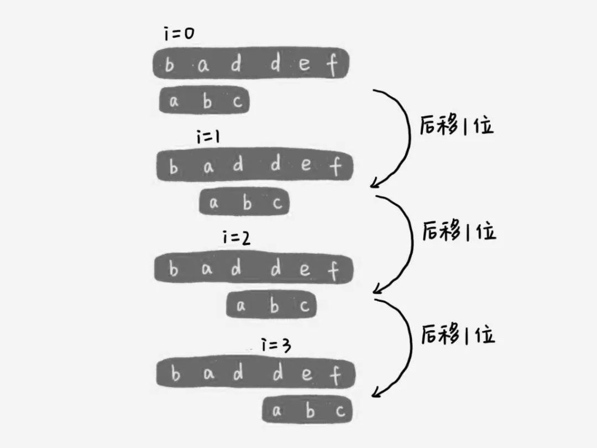

# 暴力子字符串查找算法(BF算法)

子字符串查找的一个最显而易见的方法就是在文本中模式可能出现匹配的任何地方检查匹配是否存在。

暴力子字符串查找的过程如下：




### 代码实现

```
//pat模式，txt文本
int search(string pat, string txt)
{
    int M = pat.size();
    int N = txt.size();
    for (int i = 0; i <= N-M; i++)
    {
        int j;
        for (j = 0; j < M; j++)
        {
            if (txt[i+j] != pat[j])
                break;
        }
        if (j == M)
            return i;   //找到匹配
    }
    return N;   //未找到匹配
}
```

### 另一种实现――显式回退

暴力法的另一种实现对后面KMP算法的诞生具有一定的指导意义：

> 和前面一样，程序使用一个指针i跟踪文本，另一个指针j跟踪模式。在i和j指向的字符相匹配时，代码进行的字符比较和上一个实现相同。注意：这段代码中的i值相当于上一段代码中的i+j：它指向的是文本中已经匹配过的字符序列的末端(i以前指向的是这个序列的开头)。如果i和j指向的字符不匹配了，那么需要回退这两个指针的值：将j重新指向模式的开头，将i指向本次匹配的开始位置的下一个字符

```
int search(string pat, string txt)
{
    int j, M = pat.size();
    int i, N = txt.size();
    for (i = 0, j = 0; i < N && j < M; i++)
    {
        if (txt[i] == pat[j])
        {
            j++;
        }
        else
        {
            i -= j;
            j = 0;
        }
    }
    if (j == M)
        return i - M;   //找到匹配
    else
        return N;   //未找到匹配
}
```

在最坏的情况下(每次字符串比较都比较M次，并且每次都不匹配)，暴力子字符串查找算法在长度为N的文本中查找长度为M的模式需要`NM`次字符比较