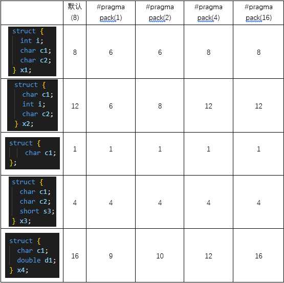

- [C/C++内存对齐详解](https://zhuanlan.zhihu.com/p/30007037)
- [关于内存对齐](https://blog.csdn.net/lgouc/article/details/8235616)
- [为什么要内存对齐 Data alignment: Straighten up and fly right](https://blog.csdn.net/lgouc/article/details/8235471)
- [深入理解C语言内存对齐](https://www.jb51.net/article/44221.htm)

