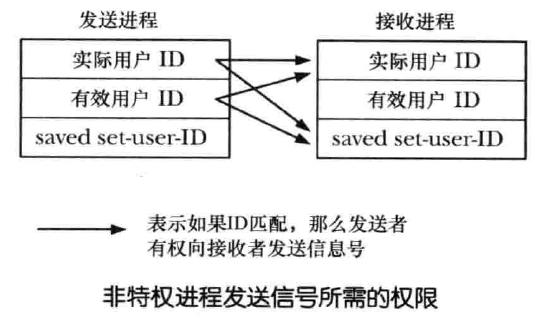

# 信号

<!-- TOC -->

- [一、原理](#一原理)
- [二、信号概述](#二信号概述)
    - [1. 信号的产生](#1-信号的产生)
    - [2. 信号分类](#2-信号分类)
    - [3. 信号处理](#3-信号处理)
    - [4. 标准信号介绍](#4-标准信号介绍)
- [三、信号 API](#三信号-api)
    - [1. 设置信号处理函数](#1-设置信号处理函数)
        - [1.1 signal()](#11-signal)
        - [1.2 sigaction()](#12-sigaction)
    - [2. 发送信号](#2-发送信号)
        - [2.1 kill()](#21-kill)
        - [2.2 raise()](#22-raise)
        - [2.3 killpg()](#23-killpg)
    - [3. 信号集](#3-信号集)
        - [3.1 sigemptyset()、sigfillset()](#31-sigemptysetsigfillset)
        - [3.2 sigaddset()、sigdelset()](#32-sigaddsetsigdelset)
        - [3.3 sigismember()](#33-sigismember)
        - [3.4 sigandset()、sigorset()、sigisemptyset()](#34-sigandsetsigorsetsigisemptyset)
    - [4. 信号掩码](#4-信号掩码)
        - [4.1 sigprocmask()](#41-sigprocmask)
        - [4.2 sigpending()](#42-sigpending)
- [四、信号处理函数](#四信号处理函数)
    - [1. 信号处理函数的设计](#1-信号处理函数的设计)
        - [1.1 两种常见的设计方式](#11-两种常见的设计方式)
        - [1.2 信号的非队列化处理](#12-信号的非队列化处理)
        - [1.3 可重入函数和异步信号安全函数](#13-可重入函数和异步信号安全函数)
    - [2. 信号处理函数的终止](#2-信号处理函数的终止)
        - [2.1 在信号处理器函数中执行非本地跳转](#21-在信号处理器函数中执行非本地跳转)
        - [2.2 异常终止进程：abort()](#22-异常终止进程abort)
    - [3. 在备选栈中处理信号：sigaltstack()](#3-在备选栈中处理信号sigaltstack)
    - [4. 系统调用的中断和重启](#4-系统调用的中断和重启)
- [五、实时信号](#五实时信号)
    - [1. 实时信号介绍](#1-实时信号介绍)
        - [1.1 实时信号优点](#11-实时信号优点)
        - [1.2 实时信号的定义](#12-实时信号的定义)
        - [1.3 实时信号的使用](#13-实时信号的使用)
    - [2. 发送实时信号：sigqueue()](#2-发送实时信号sigqueue)
    - [3. 处理实时信号](#3-处理实时信号)
- [六、定时器与休眠](#六定时器与休眠)
    - [1. 间隔定时器](#1-间隔定时器)
        - [1.1 设置定时器：setitimer()](#11-设置定时器setitimer)
        - [1.2 获取定时器：getitimer()](#12-获取定时器getitimer)
    - [2. 休眠函数](#2-休眠函数)
        - [2.1 低分辨率休眠：sleep()](#21-低分辨率休眠sleep)
        - [2.2 高分辨率休眠：nanosleep()](#22-高分辨率休眠nanosleep)
    - [3. POSIX 时钟](#3-posix-时钟)
        - [3.1 POSIX 时钟 API](#31-posix-时钟-api)
        - [3.2 POSIX 间隔式定时器](#32-posix-间隔式定时器)
    - [4. timerfd API](#4-timerfd-api)
        - [4.1 创建定时器：timerfd_create()](#41-创建定时器timerfd_create)
        - [4.2 配备定时器：timerfd_settime()](#42-配备定时器timerfd_settime)
        - [4.3 查看定时器当前值：timerfd_gettime()](#43-查看定时器当前值timerfd_gettime)
        - [4.4 使用 timerfd](#44-使用-timerfd)
- [七、其他](#七其他)
    - [1. 核心转储文件](#1-核心转储文件)
    - [](#)

<!-- /TOC -->

## 一、原理

## 二、信号概述

### 1. 信号的产生

进程间可相互发送信号，进程也可给自身发送信号，但是发送进程的诸多信号，通常都是源于内核，内核会在以下事件发生时为进程产生信号：

1. 硬件异常：即硬件检测到一个错误条件并通知内核，随即再由内核发送相应信号给相关进程
2. 用户键入能产生信号的终端特殊字符：如中断字符 `C-c`、暂停字符 `C-z`
3. 发送了软件事件：如定时器到期、子进程退出、阻塞的文件描述符读写有效等

### 2. 信号分类

信号分为两大类：

1. 第一组称为传统或标准信号，用于内核向进程通知事件，Linux中标准信号的编号范围为 `1~31`
2. 第二组是实时信号

### 3. 信号处理

对信号的处理分为三种情况：

1. 采取默认行为
2. 忽略信号
3. 执行信号处理器程序

### 4. 标准信号介绍

| 名称 | 编号 | 描述 | 默认行为 | 特性 |
| --- | --- | --- | --- | --- | --- |
| SIGHUP | 1 | 当终端断开（挂机）时，将发送该信号给终端控制进程 | term | 许多守护进程会在收到 SIGHUP 信号时会重新初始化并重新读取配置文件 |
| SIGINT | 2 | 用户键入终端中断字符 C-c 时，将发送该信号给前台进程组 | term |  |
| SIGQUIT | 3 | 用户键入终端退出字符 C-\ 时，将发送该信号给前台进程组 | core | 该信号终止进程并产生可用于调试的核心转储文件，当进程陷入无限循环时，可利用该信号杀死进程并对 core 文件进行分析调试 |
| SIGILL | 4 | 当进程试图执行非法的机器语言指令时，系统将向进程发送该信号 | core |  |
| SIGTRAP | 5 | 该信号用来实现断点调试功能以及 strace 命令所执行的跟踪系统调用功能 | core |  |
| SIGABRT | 6 | 进程调用 abort() 函数，系统向进程发送该信号 | core |  |
| SIGBUS | 7 | 发送某种内存访问错误时产生该信号 | core |  |
| SIGFPE | 8 | 该信号因特定类型的算术错误而产生，比如除以 0 | core |  |
| SIGKILL | 9 | “必杀” 信号，总能终止进程 | term | 该信号无法阻塞、忽略或捕获，该信号总是生效，即使进程目前处于停止状态 |
| SIGUSR1 | 10 | 用户自定义信号 1，内核绝不会为进程产生该信号，进程可以使用这些信号来相互通知事件的发生或彼此同步 | term |  |
| SIGSEGV | 11 | 当应用程序对内存的引用无效时，产生该信号 | core | 发生该错误常常是解引用的指针里包含了错误地址，如未初始化的指针等 |
| SIGUSR2 | 12 | 用户自定义信号 2，同 SIGUSR1 | term |  |
| SIGPIPE | 13 | 当某一进程试图向管道、FIFO或套接字写入信息时，如果这些设备并无相应的阅读进程，那么系统将产生该信号 | term |  |
| SIGALRM | 14 | 经 alarm() 或 setitimer() 设置的实时定时器到期，内核将产生该信号 | term |  |
| SIGTERM | 15 | 终止进程的标准信号，是 kill 和 killall 命令发送的默认信号 | term | 精心设计的应用程序应当为 SIGTERM 信号设置信号处理程序，在退出前能够预先清除临时文件和释放其他资源，从而全身而退，所以，应该总是首先尝试使用 SIGTERM 信号来终止进程，而把 SIGKILL 信号作为处理那些不响应 SIGTERM 信号的失控进程的最后手段 |
| SIGSTKFLT | 16 | 协处理器栈错误 | term |  |
| SIGCHLD | 17 | 当父进程的某个子进程终止时，内核将向父进程发送该信号 | ignore |  |
| SIGCONT | 18 | 发送给已停止进程时，进程将恢复运行，否则忽略该信号 | cont | 进程可捕获该信号以便在进程恢复时执行某些操作，即使该信号正在阻塞或忽略该信号，SIGCONT 信号也会将处于停止状态的进程恢复运行，但只有取消了对 SIGCONT 的阻塞时，进程才会去调用相应的处理器函数；</br> 每当进程收到 SIGCONT 信号时，会将处于等待状态的停止信号丢弃，因此，如果任一其他信号发送给了一个已停止的进程，那么在进程收到 SIGCONT 信号而恢复运行之前，信号实际上并未传递，SIGKILL 信号除外；相反，如果任何停止信号传递给进程，那么进程将自动丢弃任何处于等待状态的 SIGCONT 信号，这种处理意在防止之前发送的一个停止信号会在随后撤销 SIGCONT 信号的行为 |
| SIGSTOP | 19 | “必停” 信号，总能停止进程 | stop | 该信号无法阻塞、忽略或捕获 |
| SIGTSTP | 20 | 作业控制的停止信号，用户键入终端停止字符 C-z 时，将发送该信号给前台进程组 | stop |  |
| SIGTTIN | 21 | 作业控制 shell 下运行时，若后台进程组试图对终端进行 read() 操作，终端驱动程序则将向进程组发送此信号 |  stop |  |
| SIGTTOU | 22 | 与 SIGTTIN 类似，但针对的是后台作业的终端输出 | stop |  |
| SIGURG | 23 | 系统发送该信号给一个进程，表示套接字上存在紧急数据 | ignore |  |
| SIGXCPU | 24 | 进程的 CPU 时间超出对应的资源限制时将发送此信号给进程 | core |  |
| SIGXFSZ | 25 | 进程因试图增大文件而突破对进程文件大小的资源限制时将发送此信号给进程 | core |  |
| SIGVTALRM | 26 | 由 setitimer() 设置的虚拟定时器过期时，内核将产生该信号 | term |  |
| SIGPROF | 27 | 由 setitimer() 调用设置的性能分析定时器过期时，内核将产生该信号 | term |  |
| SIGWINCH | 28 | 终端窗口尺寸发生变化时，会向前台进程组发送该信号 | ignore |  |
| SIGIO | 29 | 利用 fcntl() 系统调用，即可于特定类型（终端和套接字）的打开文件描述符发生 I/O 事件时产生信号 | term |  |
| SIGPWR | 30 | 电量行将耗尽 | term |  |
| SIGSYS | 31 | 无效的系统调用，意味着系统将进程指向的指令视为一个系统调用，但相关的系统调用编号是无效的 | core |  |

1. term：终止当前进程
2. core：终止当前进程并产生核心转储文件
3. ignore：忽略该信号
4. stop：停止当前进程
5. cont：继续执行先前停止的进程

## 三、信号 API

有两种方法来改变信号处置：`signal()` 和 `sigaction()`

- `signal()` 系统调用，是设置信号处置的原始 API，所提供的接口比 sigaction() 简单，signal() 的行为在不同 UNIX 实现间存在差异，因此，这意味着对可移植性有所追求的程序绝不能使用此调用来建立信号处理器函数，因此，`sigaction()` 是建立信号处理器的首选 API
- `sigaction()` 提供了比 signal() 更多的功能：sigaction() 允许在获取信号处置的同时无需将其改变，并且，还可设置各种属性对调用信号处理器程序时的行为施以更加精准的控制，同时可移植性更佳

### 1. 设置信号处理函数

#### 1.1 signal()

```
#include <signal.h>

void ( *signal(int sig, void (*handler)(int)) )(int);
```

- 参数 `sig` 标识希望修改处置的信号编号
- 参数 `handler` 标识信号抵达时所调用函数的地址，该函数无返回值，并接收一个整型参数

  可以使用下面的宏代替函数地址：

  1. `SIG_DFL` 将信号处理还原为默认值
  2. `SIG_IGN` 忽略该信号

- `signal` 成功返回之间的信号处置，失败返回 `SIG_ERR`

如下代码，使用 `signal` 暂时为信号建立一个处理器函数，然后再将信号处置重置为其本来面目：

```
void (*oldHandler)(int);

oldHandler = signal(SIGINT, newHandler);
if (oldHandler == SIG_ERR)
    errExit("signal");

/* Do something else here, During this time, if SIGINT is delivered, 
   newHandler will be used to handle the signal. */

if (signal(SIGINT, oldHandler) == SIG_ERR)
    errExit("signal");
```

TODO: 下面代码是使用 sigaction() 实现 signal()：

22.7

```c

```

#### 1.2 sigaction()

```
#include <signal.h>

int sigaction(int sig, const struct sigaction *act, struct sigaction *oldact);

struct sigaction {
    void     (*sa_handler)(int);
    void     (*sa_sigaction)(int, siginfo_t *, void *);
    sigset_t   sa_mask;
    int        sa_flags;
    void     (*sa_restorer)(void);
};
```

- 参数 `sig` 标识想获取或改变处置的信号编号，可以是除 `SIGKILL` 和 `SIGSTOP` 外的任何信号
- `act` 描述信号新处置函数的数据结构，`oldact` 用来返回之前信号处置的信息，可将两者之一设为 NULL，表示对相应信息不感兴趣，`act` 和 `oldact` 指向的数据类型都为 `sigaction`
- `sigaction` 结构各字段说明如下：

  1. `sa_handler`：早期的捕获函数，其值可为信号处理器函数的地址或常量 SIG_IGN、SIG_DFL 之一，仅当 sa_handler 是信号处理器函数的地址时，才会对 sa_mask 和 sa_flags 字段加以处理
  2. `sa_sigaction`：sa_flags 设置 SA_SIGINFO 标志时，捕获函数将使用这种方式：
     
     ```
     void handler(int signo, siginfo_t *info, void *context);
     ```

  3. `sa_mask` 定义了一组信号，当调用信号处理程序时，会在调用信号处理器之前，将该组信号自动添加到进程掩码中，直至信号处理器函数返回，届时将自动删除这些信号，因此，利用 sa_mask 字段可指定一组信号，不允许它们中断此处理器程序的执行
     
     此外，引发对处理器程序调用的信号将自动添加到进程信号掩码中，这意味着，当正在执行处理器程序时，如果同一个信号实例第二次抵达，信号处理器程序将不会递归中断自己，由于不会对遭阻塞的信号进行排队处理，如果在处理器程序执行过程中重复产生这些信号的任何信号，对信号的传递将是一次性的

  4. `sa_flags` 字段是一个位掩码，用于控制信号处理过程的各种选项，该字段值可为下列值的或(|)：
     
     - `SA_NOCLDSTOP`：若 sig 为 SIGCHLD 信号，则当因接受一信号而停止或恢复某一子进程时，将不会产生此信号
     - `SA_NOCLDWAIT`：若 sig 为 SIGCHLD 信号，则当子进程终止时不会将其转化为僵尸进程
     - `SA_NODEFER`：捕获该信号时，不会在执行处理器程序时将信号自动添加到进程掩码中
     - `SA_ONSTACK`：针对此信号调用处理器函数时，使用了由 sigaltstack() 安装的备选栈
     - `SA_RESETHAND`：当捕获该信号时，会在调用处理器函数之前将信号处置重置为默认值（SIG_DFL）
     - `SA_RESTART`：自动重启由信号处理器程序中断的系统调用
     - `SA_SIGINFO`：若设置该标志，则处理器函数将使用 sa_sigaction


### 2. 发送信号

#### 2.1 kill()

一个进程可以使用 `kill()` 系统调用向另一个进程发送信号

```
#include <signal.h>

int kill(pid_t pid, int sig);
```

- `sig` 指定了要发送的信号
- `pid` 标识了一个或多个目标进程：

  1. 如果 `pid > 0`，会发送信号到由 pid 指定的进程
  2. 如果 `pid == 0`，会发送信号到与调用进程同组的每个进程，包括调用进程自身
  3. 如果 `pid < -1`，会向组 ID 等于该 pid 绝对值的进程组内所有下属进程发送信号
  4. 如果 `pid == -1`，信号的发送范围是：调用进程有权将信号发往的每个目标进程，除去 init（进程 ID 为 1）和调用进程自身，如果特权进程发起这一调用，那么会发送信号给系统中的所有进程，所以这种信号发送方式称之为广播信号
- 返回值：
  1. 若并无进程与指定的 pid 相匹配，那么 kill() 调用失败，同时将 errno 置为 `ESRCH`
  2. 若进程无权发送信号给所请求的 pid，kill() 将调用失败，并将 errno 置为 `EPERM`
  3. 若 pid 所指为一系列进程，只要可以向其中之一发送信号，则 kill() 调用成功

要给另一个进程发送信号，需要满足一定的权限要求：

1. 特权级进程可以向任何进程发送信号
2. 以 root 用户和组运行的 init 进程（1 号进程），仅能接收已安装了处理器函数的信号，这样可以防止系统管理员意外杀死 init 进程
3. 如果发送者的实际或有效用户 ID 匹配于接受者的实际用户 ID或者保存设置用户 ID（saved set-user-id），那么非特权进程也可以向另一个进程发送信号，这样，用户可以向由他们启动的 set-user-ID 程序发送信号，而无需考虑目标进程有效用户 ID 的当前设置

   <div align="center"></div>

4. SIGCONT 信号要特殊处理，无论对用户 ID 的检查结果如何，非特权进程可以向同一会话中的任何其他进程发送 SIGCONT 信号，这样运行作业控制的 shell 可以重启已经停止的作业

TODO: 下面代码是使用 `kill()` 系统调用的例子：

```

```

##### 2.1.1 检查进程的存在

#### 2.2 raise()

`raise()` 函数向进程自身发送信号

```
#include <signal.h>

int raise(int sig);
```

- 在单线程程序中，调用 `raise()` 相当于对 `kill()` 的如下调用：

  ```
  kill(getpid(), sig);
  ```

- 多线程系统中，`raise()` 的实现为：

  ```
  pthread_kill(pthread_self(), sig);
  ```

- 当进程使用 `raise()`（或 kill()）向自身发送信号时，信号将立即传递（在 raise() 返回调用者之前）
- raise() 出错将返回非 0 值，调用 raise() 唯一可能发生的错误为 `EINVAL`，即 sig 无效


#### 2.3 killpg()

`killpg()` 函数向某一进程组的所有成员发送一个信号

```
#include <signal.h>

int killpg(pid_t pgrp, int sig);
```

- `killpg()` 调用相当于对 `kill()` 的如下调用：

  ```
  kill(-pgrp, sig);
  ```

- 若 pgrp 指定为 0，那么会向调用者所属进程组的所有进程发送此信号

### 3. 信号集

多个信号可使用一个称之为信号集的数据结构来表示，其系统数据类型为 `sigset_t`，sigset_t 数据类型在 Linux 中是一个位掩码

#### 3.1 sigemptyset()、sigfillset()

```
#include <signal.h>

int sigemptyset(sigset_t *set);
int sigfillset(sigset_t *set);
```
- `sigemptyset()` 函数初始化一个未包含任何成员的信号集
- `sigfillset()` 函数则初始化一个信号集，其包含所有信号（包括所有实时信号）
- 为程序可移植性考虑，必须使用 `sigemptyset()` 或 `sigfillset()` 来初始化信号集

#### 3.2 sigaddset()、sigdelset()

```
#include <signal.h>

int sigaddset(sigset_t *set, int sig);
int sigdelset(sigset_t *set, int sig);
```

- `sigaddset()` 和 `sigdelset()` 分别向一个集合中添加或移除单个信号


#### 3.3 sigismember()

```
#include <signal.h>

int sigismember(const sigset_t *set, int sig);
```

- `sigismember()` 测试信号 sig 是否是信号集 set 的成员

#### 3.4 sigandset()、sigorset()、sigisemptyset()

```
#define _GNU_SOURCE
#include <signal.h>

int sigandset(sigset_t *dest, sigset_t *left, sigset_t *right);
int sigorset(sigset_t *dest, sigset_t *left, sigset_t *right);

int sigisemptyset(const sigset_t *set);
```

- `sigandset()` 将 left 集和 right 集的交集置于 dest 集
- `sigorset()` 将 left 集和 right 集的并集置于 dest 集
- 若 set 集内未包含信号，则 `sigisemptyset()` 返回 true

TODO: 下面代码使用本节介绍的信号集函数实现了三个用于显示信号集的函数：printSigset() 函数显示执行信号集的成员信号，printSigMask() 函数显示进程的信号掩码，printPendingSigs() 函数显示进程当前处于等待状态的信号集：

```

```

### 4. 信号掩码

#### 4.1 sigprocmask()

内核会为每个进程维护一个信号掩码，即一组信号，并将阻塞其针对该进程的传递，如果将遭阻塞的信号发送给某进程，那么对该信号的传递将延后，直至从进程信号掩码中移除该信号，从而解除阻塞为止，信号掩码实际属于线程属性，在多线程进程中，每个线程都可使用 pthread_sigmask() 函数来独立检查和修改其信号掩码

向信号掩码中添加信号的方式：

1. 当调用信号处理器程序时，可将引发调用的信号自动添加到信号掩码中，`sigaction()` 函数可设置是否如此处理
2. 使用 `sigaction()` 函数建立信号处理程序时，可以指定一组额外信号，当调用该处理器程序时会将其阻塞
3. 使用 `sigprocmask()` 系统调用，随时可以显式向信号掩码中添加或移除信号

`sigprocmask()` 函数既可修改进程的信号掩码，又可获取现有掩码

```
#include <signal.h>

int sigprocmask(int how, const sigset_t *set, sigset_t *oldset);
```

- 参数 `how` 可取以下值：

  1. `SIG_BLOCK`：将 set 指向信号集内的指定信号添加到信号掩码中
  2. `SIG_UNBLOCK`：将 set 指向信号集中的信号从信号掩码中移除，即使要解除阻塞的信号当前并未处于阻塞状态，也不会返回错误
  3. `SIG_SETMASK`：将 set 指向的信号集赋给信号掩码

- 若 `old_set` 参数不为空，则其指向一个 sigset_t 结构缓冲区，用于返回之前的信号掩码
- `set` 参数为空时，将忽略 how 参数，可仅用于获取信号掩码

- 如果有任何等待信号因对 `sigprocmask()` 的调用而解除了锁定，那么在此调用返回前至少会传递一个信号
- 系统将忽略试图阻塞 `SIGKILL` 和 `SIGSTOP` 信号的请求，可以使用下面代码阻塞除 `SIGKILL` 和 `SIGSTOP` 外的所有信号：

  ```
  sigfillset(&blockset);
  if (sigprocmask(SIG_BLOCK, &blockset, NULL) == -1)
      errExit("sigprocmask");
  ```

TODO: 下面代码是暂时阻塞信号传递的例子：

```

```

#### 4.2 sigpending()

如果某进程接受了一个该进程正在阻塞的信号，会将该信号添加到进程的等待信号集中，当之后解除了对该信号的锁定时，会随之将信号传递给此进程，`sigpending()` 函数为调用进程返回处于等待状态的信号集，并将其置于 set 指向的 sigset_t 结构中

```
#include <signal.h>

int sigpending(sigset_t *set);
```

- `sigpending()` 成功返回 0，失败返回 -1

- 如果修改了对等待信号的处置，那么后来解除对信号的锁定时，将根据新的处置来处理信号

  可以将等待状态信号的处置置为 SIG_IGN 或 SIG_DFL（如果信号默认行为为忽略），从而阻止传递处于等待状态的信号，因此，会将信号从进程的等待信号集中移除，从而不传递该信号

## 四、信号处理函数

### 1. 信号处理函数的设计

#### 1.1 两种常见的设计方式

信号处理器函数设计得越简单越好，这会降低引发竞争条件的风险，两种常见的设计方案：

1. 信号处理器函数设置全局性标志变量并退出，主程序对此标志进行周期性检查，一旦置位随即采取相应动作

   > 主程序若因监控一个或多个文件描述符的 I/O 状态而无法进行这种周期性的检查时，则可令信号处理器函数向一专用管道写入一个字节的数据，同时将该管道的读取端置于主程序所监控的文件描述符范围之内

   主程序和信号处理器之间共享全局变量时，应该总是在声明变量时使用 volatile 关键字，并且使用原子操作类型 sig_atomic_t 保证读写的原子性：

   ```
   volatile sig_atomic_t flag;
   ```

2. 信号处理器函数执行某种类型的清理动作，接着终止进程或使用非本地跳转将栈解开并将控制返回到主程序中的预定位置

#### 1.2 信号的非队列化处理

前文说到，在执行某信号的处理器函数时会阻塞同类信号的传递（除非调用 sigaction() 时指定了 SA_NODEFER 标志），如果在执行处理器函数时多次产生同类信号，那么稍后仅传递一次

在编写信号处理器函数时需要考虑处理同类信号多次产生的情况（例如 SIGCHLD 信号）

#### 1.3 可重入函数和异步信号安全函数

##### 1.3.1 可重入和不可重入函数

如果同一个进程的多条线程可以同时安全地调用某一函数，那么该函数就是可重入的，“安全”意味着：不论其他线程调用该函数的执行状态如何，函数均可产生预期结果

1. 更新全局变量或静态数据结构的函数可能时不可重入的，如 malloc()、free() 等
2. 使用了经静态分配的内存来返回信息的函数不可重入，如 gethostbyname()、getservbyname() 等
3. 将静态数据结构用于内部记账的函数是不可重入的，如 stdio 函数库

##### 1.3.2 异步信号安全函数

异步信号安全的函数是指当从信号处理器函数调用时，可以保证其实现是安全的，如果某一函数是可重入的，又或者信号处理器函数无法将其中断时，就称该函数是异步信号安全的

##### 1.3.3 信号处理器函数内部对 errno 的使用

信号处理器函数内部可能会更新 errno，因此可在其入口处保存 errno 值，并在其出口处恢复 errno 的旧有值：

```c
void handler(int sig)
{
    int savedErrno;

    savedErrno = errno;

    // Now we can execute a function that might modify errno

    errno = savedErrno;
}
```

### 2. 信号处理函数的终止

信号处理函数可以有多种终止方式：

1. 简单的从信号处理函数返回到主程序
2. 使用 `_exit()` 终止进程（不能使用 exit() 终止信号处理函数，该函数是不安全的，因为它会在调用 _exit() 之前刷新 stdio 缓冲区）
3. 使用 `kill()` 发送信号来杀掉进程
4. 从信号处理器函数中执行 **非本地跳转**
5. 使用 `abort()` 函数终止进程，并产生核心转储

#### 2.1 在信号处理器函数中执行非本地跳转

可以在信号处理函数中使用 setjmp() 和 longjmp() 执行非本地跳转，从一个函数跳转至该函数的某个调用者。这种技术可以用作因硬件异常（如内存访问错误）而导致信号传递之后的一条恢复途径，允许将信号捕获并把控制返回到程序中某个特定位置

但是，使用标准 longjmp() 函数从处理器函数退出存在一个问题，前文说到，在进入信号处理函数时，内核会将 act.sa_mask 中指定的信号集添加到进程的信号掩码中，并在处理器函数正常返回时再将它们清除，如果直接使用标准 longjmp() 从处理器函数跳转到其他函数，信号掩码的值无法得到控制

因此，针对上述问题定义了一对新函数：`sigsetjmp()` 和 `siglongjmp()`，可以针对执行非本地跳转时的信号掩码进行显式控制：

```
#include <setjmp.h>

int sigsetjmp(sigjmp_buf env, int savesigs);

void siglongjmp(sigjmp_buf env, int val);
```

- 函数 sigsetjmp() 和 siglongjmp() 的操作与 setjmp() 和 longjmp() 类似
- 如果参数 `savesigs` 为非 0，则会将调用 sigsetjmp() 时进程的当前信号掩码保存于 env 中，之后通过指定相同 env 参数的 siglongjmp() 调用进行恢复；如果 `savesigs` 为 0，则不会保存和恢复进程的信号掩码

- 如果信号处理函数中断了正在更新数据结构的主程序，那么执行非本地跳转退出处理器函数后，这种不完整的更新动作很可能会将数据结构置于不一致状态，因为可以在程序对敏感数据进行更新时，借助于 sigprocmask() 临时将信号阻塞起来

TODO: 下面的代码展示了两种类型的非本地跳转在处理信号掩码上的差异：

```c

```

#### 2.2 异常终止进程：abort()

函数 `abort()` 通过产生 `SIGABRT` 信号来终止调用进程，对 SIGABRT 的默认动作是产生核心转储文件并终止进程：

```
#include <stdlib.h>

void abort(void);
```

- 无论阻塞或者忽略 SIGABRT 信号，abort() 调用均不受影响
- 除非进程捕获 SIGABRT 信号后信号处理器函数尚未返回，否则 abort() 必须终止进程，这意味如果使用非本地跳转退出处理器函数，abort() 的效果无法发挥出来，否则 abort() 将总是终止进程
- 终止可确保发生如下事件：若进程在发出一次 SIGABRT 信号后仍未终止（即处理器捕获信号并返回，以便恢复执行 abort()），则 abort() 会将对 SIGABRT 信号的处理重置为 SIG_DFL，并再度发出 SIGABRT 信号，从而确保将进程杀死
- 如果 abort() 成功终止了进程，那么还将刷新 stdio 流并将其关闭

### 3. 在备选栈中处理信号：sigaltstack()

在调用信号处理器函数时，内核通常会在进程栈中为其创建一帧。不过，如果此时进程对栈的拓展突破了对栈大小的限制时，信号处理器函数就没法调用了

上述场景的典型例子是 SIGSEGV 信号：当进程对栈的拓展试图突破其上限时，内核将为该进程产生 SIGSEGV 信号，不过，因为栈空间已然耗尽，内核就无法为进程已经安装的 SIGSEGV 处理器函数创建栈帧，结果是，处理器函数得不到调用，而进程也就终止了（SIGSEGV 的默认动作）

如果希望在这种情况下确保对 SIGSEGV 信号处理器函数的调用，需要做以下工作：

1. 分配一块被称为 “备选信号栈” 的内存区域，作为信号处理器函数的栈帧
2. 调用 sigaltstack()，告知内核该备选信号栈的存在
3. 在创建信号处理器函数时指定 SA_ONSTACK 标志，即通知内核在备选栈上为处理器函数创建栈帧

系统调用 `sigaltstack()`，既可以创建一个备选信号栈，也可以将已创建备选信号栈的相关信息返回：

```c
#include <signal.h>

int sigaltstack(const stack_t *sigstack, stack_t *old_sigstack);

typedef struct {
    void *ss_sp;
    int ss_flags;
    size_t ss_size;
} stack_t;
```

- 参数 `sigstack` 所指向的数据结构描述了新备选信号栈的位置及属性
- 参数 `old_sigstack` 指向的结构用于返回上一备选信号栈的相关信息（如果存在），这两个参数之一均可为 NULL

- `stack_t.ss_sp` 和 `stack_t.ss_size` 分别指定了备选信号栈的位置和大小
- `stack_t.ss_flags` 可取下列值之一：

  1. `SS_ONSTACK`

     在返回的 old_sigstack 中如果该标志置位，表明进程正在备选信号栈上执行，如果进程已经在备选信号栈上运行时，试图调用 sigaltstack() 创建一个新的备选信号栈将会产生一个错误（EPERM）

  2. `SS_DISABLE`

     在 old_sigstack 中返回，表示当前不存在已创建的备选信号栈，如果在 sigstack 中指定，则会禁用当前已创建的备选信号栈

- 备选信号栈通常可以静态分配，也可以在堆上动态分配，常量 SIGSTKSZ 为划分备选栈大小的典型值，而 MINSSIGSTKSZ 是调用信号处理器函数所需的最小值

TODO: 下面代码演示了备选信号栈的创建和使用：

```

```

### 4. 系统调用的中断和重启

有两种情况可使得信号中断正在阻塞得系统调用：

1. 当系统调用遭到阻塞时，之前创建了处理器函数得信号传递了过来，随即引发对处理器函数的调用
2. 如果系统调用遭到阻塞，并且进程因信号（SIGSTOP、SIGTSTP、SIGTTIN、SIGTTOU）而停止，之后又因收到 SIGCONT 信号而恢复执行时，就会发生中断

被中断的系统调用默认情况下会调用失败，并将 errno 置为 EINTR

通常我们希望遭到中断的系统调用能够继续运行，有两种使中断系统调用继续运行的方法：

1. 手动重启系统调用

   ```c
   while ( (cnt = read(fd, buf, BUF_SIZE)) == -1 && errno == EINTR )
      continue;
   ```

   也可将重启代码定义为宏:

   ```c
   #define NO_EINTR(stmt) while ((stmt) == -1 && errno == EINTR);

   NO_EINTR(cnt = read(fd, buf, BUF_SIZE));
   ```

2. SA_RESTART 标志

   还可以调用指定了 SA_RESTART 标志的 sigaction() 来创建信号处理器函数，从而令内核代表进程自动重启系统调用，还无需处理系统调用可能返回的 EINTR 错误

   但是要注意，并非所有的系统调用都可以通过指定 `SA_RESTART` 达到自动重启的目的，具体情况参见 《UNIX系统编程手册上》21.5

## 五、实时信号

### 1. 实时信号介绍

#### 1.1 实时信号优点

实时信号较之标志信号，有以下优点：

1. 实时信号的信号范围有所扩大，可应用于应用程序自定义的目的，而标准信号中可供应用随意使用的信号仅有两个：SIGUSR1 和 SIGUSR2
2. 对实时信号所采取的是队列化管理

   如果将某一实时信号的多个实例发送给一进程，那么将会多次传递该信号

3. 当发送一个实时信号时，可为信号指定伴随数据，供接收进程的信号处理器获取
4. 不同实时信号的传递顺序又保障
   
   如果有多个不同的实时信号处于等待状态，那么将率先传递具有最小编号的信号；如果是同一类型的多个信号在排队，那么信号的传递顺序与信号发送来时的顺序保持一致

#### 1.2 实时信号的定义

Linux 内核中定义了 32 个不同的实时信号，编号范围为 32~63，内核对排队实时信号的数量设置了限制

在 <signal.h> 中定义了 `RTSIG_MAX` 常量表示实时信号的可用数量，常量 `SIGRTMIN` 和 `SIGRTMAX` 分别表示可用实时信号编号的最小值和最大值

指代实时信号的方式和标志信号不同，实时信号的编号采用 `SIGRTMIN+x` 的形式，如表达式 `SIGRTMIN+1` 表示第二个实时信号

#### 1.3 实时信号的使用

- 发送进程使用 sigqueue() 系统调用来发送信号及其伴随数据
- 接收进程为实时信号建立处理器函数时，应在调用 sigaction() 时设置 SA_SIGINFO 标志

### 2. 发送实时信号：sigqueue()

```c
#define _POSIX_C_SOURCE 199309
#include <signal.h>

int sigqueue(pid_t pid, int sig, const union sigval value);
```

- sigqueue() 发送信号所需权限和 kill() 一致
- sigqueue() 可以发送信号 0，其语义和 kill() 相同，但是不能通过将 pid 设为负值而向整个进程组发送信号
- sigqueue() 成功返回 0，失败返回 -1，若实时信号的排队数量达到了限制，则 sigqueue() 调用失败，同时 errno 置为 EAGAIN


TODO: 下面是使用 sigqueue() 发送实时信号的例子：

```

```

### 3. 处理实时信号

- 可以像标准信号一样使用常规信号处理器来处理实时信号，但是这样无法发送伴随数据
- 也可以用带有 3 个参数的信号处理器函数来处理实时信号，其建立会用到 SA_SIGINFO 标志
- 使用 SA_SIGINFO 标志时，信号处理器函数第二个参数是 siginfo_t 结构，其中内含实时信号的附加信息，对于一个实时信号而言，会在 siginfo_t 结构中设置如下字段：

  1. `si_signo` 字段，其值与传递给信号处理器函数的第一个参数相同
  2. `si_code` 字段，表示信号来源，由 sigqueue() 发送的实时信号来说，该字段值总是为 SI_QUEUE
  3. `si_value` 字段包含数据，对该数据的解释由应用程序决定
  4. `si_pid` 和 `si_uid` 字段分别包含信号发送进程的进程 ID 和实际用户 ID

下面代码是处理实时信号的一个例子：

```c

```

## 六、定时器与休眠

### 1. 间隔定时器

#### 1.1 设置定时器：setitimer()

`setitimer()` 可以创建一个间隔式定时器（interval timer），这种定时器会在未来某个时间点到期，并于此后（可选择的）每隔一段时间到期一次

```
#include <sys/time.h>

int setitimer(int which, const struct itimerval *new_value, struct itimerval *old_value)

struct itimerval {
    struct timeval it_interval;
    struct timeval it_value;
}

struct timeval {
    time_t      tv_sec;   // Seconds
    suseconds_t tv_usec;  // Microseconds (long int)
}
```

- 参数 `which` 可以指定 3 种不同类型的定时器：

  1. `ITIMER_REAL`：创建以 **真实时间** 倒计时的定时器，到期会为进程产生信号 `SIGALARM`
  2. `ITIMER_VIRTUAL`：创建以 **进程虚拟时间（用户模式下的 CPU 时间）** 倒计时的定时器，到期会为进程产生信号 `SIGVTALRM`
  3. `ITIMER_PROF`：创建一个 profiling 定时器，以 **进程时间（用户态与内核态 CPU 时间的总和）** 倒计时，到期会为进程产生信号 `SIGPROF`

  对这些信号的默认处置均会终止进程，可以重新为其定义处理器函数

- 参数 `new_value` 为指向 `itimerval` 结构的指针，new_value 中定义了新定时器属性：

  - `new_value.it_value` 指定了举例定时器到期的延迟时间，如果设置时将 it_value 中两个字段值均置为 0，那么会屏蔽任何已有的定时器
  - `new_value.it_interval` 说明了该定时器是否为周期性定时器：如果 it_interval 的两个字段值均为 0，那么该定时器就属于在 it_value 所指定的时间间隔后到期的一次性定时器；只要 it_interval 中的任一字段非 0，那么在每次定时器到期之后，都会将定时器重置为在指定间隔后再次到期

- 参数 `old_value` 不为 NULL 时，其会返回定时器的前一设置

#### 1.2 获取定时器：getitimer()

可以通过调用 `getitimer()` 了解定时器的当前状态、距离下次到期的剩余时间

```
#include <sys/time.h>

int getitimer(int which, struct itimerval *curr_value);
```

- getitimer() 返回由 which 指定定时器的当前状态，并置于由 curr_value 所指向的缓冲区中
- 子结构 `curr_value.it_value` 返回距离下一次到期所剩余的总时间，该值会随定时器倒计时而变化


下面代码演示了实时定时器的使用：

```c

```

虽然 setitimer() 使用的 timeval 结构提供有微秒级精度，但是传统意义上定时器精度还是受制于软件时钟频率，如果定时器值未能于软件时钟间隔的倍数严格匹配，那么定时器值则会向上取整

实时定时器的用途之一是为某个阻塞系统调用设置其处于阻塞状态的时间上限：

下面代码使用 alarm() 对阻塞的 read() 操作设置了超时时间：

```c

```

### 2. 休眠函数

#### 2.1 低分辨率休眠：sleep()

`sleep()` 可以暂停调用进程的执行达数秒之久，或者在捕获信号（从而中断调用）后恢复进程的运行

```c
#include <unistd.h>

unsigned int sleep(unsigned int seconds);
```

- 如果休眠正常结束，sleep() 返回 0，如果因信号而中断休眠，sleep() 将返回剩余（未休眠）的秒数
- Linux 中 sleep() 的实现为对 nanosleep() 的调用，nanosleep() 函数的实现没有使用信号，因此 Linux 下将 sleep() 和 alarm() 及 setitimer() 混用并不影响，但是 sleep() 如何实现在不同系统中可能有不同实现，为可移植性考虑，尽量不要将 sleep() 和 alarm() 及 setitimer() 混用


#### 2.2 高分辨率休眠：nanosleep()

```c
#define _POSIX_C_SOURCE 199309
#include <time.h>

int nanosleep(const struct timespec *request, struct timespec *remain);

struct timespec {
    time_t  tv_sec;   // Seconds
    long    tv_nsec;  // Nanoseconds
};
```

nanosleep() 功能与 sleep() 类似，但更具有优势：

1. nanosleep() 提供了更高分辨率的休眠时间，参数 `request` 指定了休眠的持续时间
2. nanosleep() 函数的实现明确规定不能使用信号来实现该函数，因此可以将 nanosleep() 与 alarm() 或 setitimer() 混用，且不会危及程序的可移植性

- nanosleep() 成功返回 0，失败返回 -1，并设置 errno 为 EINTR，若参数 remain 不为 NULL，则该指针所指向的缓冲区将返回剩余的休眠时间，可利用这一返回值重启该系统调用以完成休眠

TODO: 下面代码演示了 nanosleep() 函数的用法：

```

```

### 3. POSIX 时钟

#### 3.1 POSIX 时钟 API

##### 3.1.1 获取时钟的值：clock_gettime()

系统调用 `clock_gettime()` 针对参数 clockid 所指定的时钟返回时间
系统调用 `clock_getres()` 针对参数 clockid 所指定的时钟返回时钟的分辨率

```
#define _POSIX_C_SOURCE 199309
#include <time.h>

int clock_gettime(clockid_t clockid, struct timespec *tp);
int clock_getres(clockid_t clockid, struct timespec *res);
```

- 系统中预设的 `clockid_t` 有以下几种取值：

  1. `CLOCK_REALTIME`：是系统级实时时钟，用于度量真实时间
  2. `CLOCK_MONOTONIC`：该时钟对时间的度量始于过去的某个时间点，在系统启动后就不会发生改变，手动更改系统时间无法影响该时间，Linux 中，该时钟对时间的测量始于系统启动
  3. `CLOCK_PROCESS_CPUTIME_ID`：该时钟测量调用进程所消耗的用户和系统 CPU 时间
  4. `CLOCK_THREAD_CPUTIME_ID`：该时钟测量进程中单条线程所消耗的用户和系统 CPU 时间

##### 3.1.2 设置时钟的值：clock_settime()

系统调用 `clock_settime()` 利用参数 tp 所指向缓冲区中的时间来设置由 clockid 指定的时钟

```
#define _POSIX_C_SOURCE 199309
#include <time.h>

int clock_settime(clockid_t clockid, const struct timespec *tp);
```

- 若由 tp 指定的时间并非由 clock_getres() 所返回时钟分辨率的整数倍，时间会向下取整
- 特权级进程可以设置 CLOCK_REALTIME 时钟，其它时钟均不可更改

##### 3.1.3 获取特定进程和线程的时钟 ID

函数 `clock_getcpuclockid()` 会将隶属于 pid 进程的 CPU 时间时钟的标识符置于 clockid 指针所指向的缓冲区中，之后就可以利用 `clock_gettime()` 得到进程或线程耗费的 CPU 时间

```
#define _XOPEN_SOURCE 600
#include <time.h>

int clock_getcpuclockid(pid_t pid, clockid_t *clockid);
```

- 参数 `pid` 为 0 时，clock_getcpuclockid() 返回的是调用进程的 CPU 时间时钟 ID


函数 `pthread_getcpuclockid()` 是 `clock_getcpuclockid()` 的 POSIX 线程版，返回的标识符所标识的时钟用于度量调用进程中指定线程消耗的 CPU 时间

```
#define _XOPEN_SOURCE 600
#include <pthread.h>
#include <time.h>

int pthread_getcpuclockid(pthread_t thread, clockid_t *clockid);
```

- 参数 `thread` 是 POSIX 线程 ID，用于指定希望获取的 CPU 时钟 ID 所从属的线程

##### 3.1.4 高分辨率休眠的改进版：clock_nanosleep()

`clock_nanosleep()` 是 Linux 特有的系统调用，它可以暂停调用进程，直到历经一段指定的时间间隔后，亦或是收到信号才恢复运行

```
#define _XOPEN_SOURCE 600
#include <time.h>

int clock_nanosleep(clockid_t clockid, int flags, const struct timespec *request, struct timespec *remain);
```

- 参数 `request` 和 `remain` 同 nanosleep() 中的对应参数目的相似
- 参数 `flags`：
  - flags 为 0，即默认情况下，由 request 指定的休眠间隔时间是相对时间，此时和 nanosleep() 相同
  - flags 为 TIMER_ABSTIME 时，request 表示 clockid 时钟所测量的绝对时间，即时钟达到某个确定的绝对时间再到期，此时，remain 参数不再使用
  > 使用绝对时间定时是为了避免嗜睡问题：如果只是先获取当前时间，计算与目标时间的差距，再以相对时间进行休眠，那么如果休眠期间因为信号导致定时器中断，中断完成再恢复休眠，这样会导致休眠时间比预期的要久

- clock_nanosleep() 和 nanosleep() 的另一个区别是，前者可以根据 clockid 选择不同的时钟来测量休眠间隔时间

下面代码展示了如何使用 clock_nanosleep()：

```

```

#### 3.2 POSIX 间隔式定时器

##### 3.2.1 创建定时器：timer_create()

`timer_create()` 创建一个定时器，并以由 clockid 指定的时钟来进行时间度量

```
#define _POSIX_C_SOURCE 199309
#include <signal.h>
#include <time.h>

int timer_create(clockid_t clockid, struct sigevent *evp, timer_t *timerid);

union sigval {
    int sival_int;
    void *sival_ptr;
};

struct sigevent {
    int sigev_notify;
    int sigev_signo;
    union sigval sigev_value;

    union {
        pid_t _tid;
        struct {
            void (*_function)(union sigval);
            void *_attribute;
        } _sigev_thread;
    } _sigev_un;
};
```

- 参数 `clockid` 可取 CLOCK_REALTIME、CLOCK_MONOTONIC、CLOCK_PROCESS_CPUTIME_ID、CLOCK_THREAD_CPUTIME_ID，也可以取 clock_getcpuclocid() 或 pthread_getcpuclockid() 返回的 clockid 值
- 函数返回时，参数 `timerid` 指定了新创建的定时器的句柄，供后续调用中指代该定时器使用
- 参数 `evp` 决定定时器到期时对应用程序的通知方式，sigevent 结构中的 `sigev_notify` 字段定义了以下几种定时通知方式：
  1. `SIGEV_NONE`：不提供定时器到期通知，进程通过 `timer_gettime()` 来监控定时器的运转情况
  2. `SIGEV_SIGNAL`：定时器到期时，为进程生成指定于 sigev_signo 中的信号，如果 sigev_signal 为实时信号，那么 sigev_value 字段则指定了信号的伴随数据，通过 siginfo_t 结构的 si_value 可获取这一数据，siginfo_t 结构既可以直接传递给该信号的处理器函数，也可以由调用 sigwaitinfo() 或 sigtimerdwait() 返回
  3. `SIGEV_THREAD`：定时器到达时，会调用由 sigev_notify_function 字段指定的函数
  4. `SIGEV_THREAD_ID`：


##### 3.2.2 配备和解除定时器：timer_settime()

使用 `timer_settime()` 对定时器进行配备或解除

```
#define _POSIX_C_SOURCE 199309
#include <time.h>

int timer_settime(timer_t timerid, int flags, const struct itimerspec *value, struct itimerspec *old_value);

struct itimerspec {
    struct timespec it_interval;
    struct timespec it_value;
}

struct timespec {
    time_t  tv_sec;
    long    tv_nsec; 
}
```

- 参数 `timerid` 是函数 `timer_create()` 创建出的定时器句柄
- 参数 `value` 中包含定时器的新设置，`old_value` 用于返回定时器的前一设置，可为 NULL
- `it_value` 指定了定时器首次到期的时间，如果 `it_interval` 的任一子字段非 0，那么这就是一个周期性定时器
- 参数 `flags`：
  1. `flags` 为 0 时，会将 `value.it_value` 视为始于 timer_settime() 调用时间点的相对值
  2. `flags` 为 TIMER_ABSTIME 时，那么 `value.it_value` 则是一个绝对时间

- 如果曾经配备过定时器，timer_settime() 会将之前的设置替换掉，要解除定时器，需要在调用 timer_settime() 时将 value.it_value 的所有字段指定为 0


##### 3.2.3 获取定时器的当前值：timer_gettime()

系统调用 `timer_gettime()` 返回由 timerid 指定的 POSIX 定时器的间隔以及剩余时间

```
#define _POSIX_C_SOURCE 199309
#include <time.h>

int timer_gettime(timer_t timerid, struct itimerspec *curr_value);
```

- `curr_value` 指针所指向的 itimerspec 结构中返回的是时间间隔以及距离下次定时器到期的时间
- 若返回结构 `curr_value.it_value` 中的两个字段均为 0，那么定时器当前处于停止状态


##### 3.2.4 删除定时器：timer_delete()

每个 POSIX 定时器都会消耗一定系统资源，可以使用 `timer_delete()` 来移除定时器并释放这些资源

```
#define _POSIX_C_SOURCE 199309
#include <time.h>

int timer_delete(timer_t timerid);
```

- 参数 `timerid` 是调用 timer_create() 时返回的句柄，对于已启动的定时器，会在移除前自动将其停止

### 4. timerfd API

Linux 中提供了特有的 timerfd API，可从文件描述符中读取其所创建定时器的到期通知，可以使用 select()、poll() 和 epoll() 将这种文件描述符会同其他描述符一同进行监控

#### 4.1 创建定时器：timerfd_create()

系统调用 `timerfd_create()` 会创建一个新的定时器对象，并返回一个指代该对象的文件描述符

```c
#include <sys/timerfd.h>

int timerfd_create(int clockid, int flags);
```

- 参数 `clockid` 可设置为 `CLOCK_REALTIME` 或 `CLOCK_MONOTONIC`
- 参数 `flags` 可取以下值：
  1. `TFD_CLOEXEC`：为新的文件描述符设置运行时关闭标志（FD_CLOEXEC）
  2. `TFD_NONBLOCK`：为顶层的打开文件描述符设置 O_NONBLOCK 标志，随后的读操作是非阻塞的
- 可以使用 `close()` 关闭 timerfd_create() 创建的文件描述符，以便内核能够释放与定时器有关的资源

#### 4.2 配备定时器：timerfd_settime()

系统调用 `timerfd_settime()` 可以配备或解除由文件描述符 fd 所指代的定时器

```
#include <sys/timerfd.h>

int timerfd_settime(int fd, int flags, const struct itimerspec *new_value, struct itimerspec *old_value);
```

- 参数 `fd` 为 timerfd_create() 返回的文件描述符
- 参数 `new_value` 和 `old_value` 用法和 timer_settime() 相同
- 参数 `flags`：
  1. flags 取 `0` 时，此时 `new_value.it_value` 的值视为相对于调用 `timerfd_settime()` 时间点的相对时间
  2. flags 为 `TFD_TIMER_ABSTIME` 时，将其视为一个绝对时间

#### 4.3 查看定时器当前值：timerfd_gettime()

系统调用 `timerfd_gettime()` 返回文件描述符 fd 所标识定时器的间隔及剩余时间

```
#include <sys/timerfd.h>

int timerfd_gettime(int fd, struct itimerspec *curr_value);
```

- `curr_value` 的意义和 timer_gettime() 函数参数相同

#### 4.4 使用 timerfd

调用 fork() 期间，子进程会继承 timerfd_create() 所继承文件描述符的拷贝，timerfd_create() 创建的文件描述符能跨越 exec() 得以保存（除非指定运行时关闭标志），已配备的定时器在 exec() 之后会继续生成到期通知

当使用 `timerfd_settime()` 启动定时器之后，就可以从相应文件描述符中调用 `read()` 来读取定时器的到期信息，如果此时发生了一起或多次定时器到期事件，那么 read() 会立即返回，且返回的缓冲区中包含了以发生的到期次数，因此传给 read() 的缓冲区必须足够容纳一个无符号 8 字节整型数

TODO：下面代码展示了 timerfd API 的使用：

1. 程序调用 timerfd_create() 创建了一个定时器，并通过 timerfd_settime() 将其启动
2. 进入循环，从文件描述符中读取定时器到期通知，直至达到指定的定时器到期次数
3. 每次 read() 之后，程序都会显示定时器启动以来的逝去时间、读取到的到期次数以及至今为止的到期总数

```

```


## 七、其他

### 1. 核心转储文件

### 