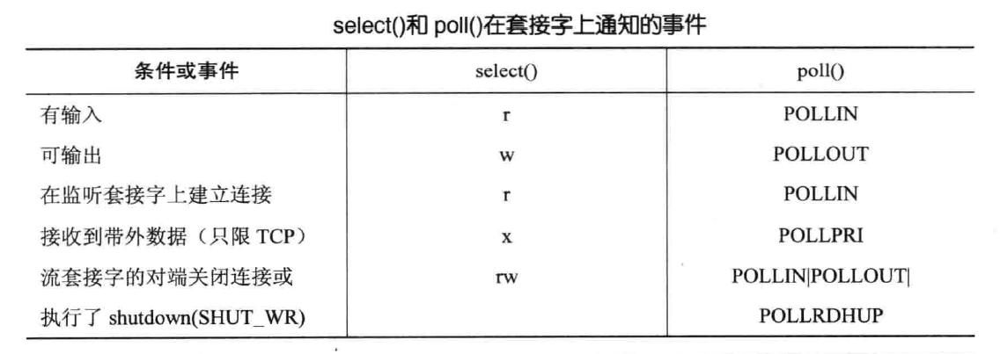

# 文件操作

<!-- TOC -->

- [一、原理](#一原理)
    - [1. Linux 文件系统](#1-linux-文件系统)
    - [2. 内核管理打开文件模型](#2-内核管理打开文件模型)
    - [3. 文件 I/O 缓冲](#3-文件-io-缓冲)
- [二. 文件 I/O](#二-文件-io)
    - [1. open](#1-open)
    - [2. creat](#2-creat)
    - [3. close](#3-close)
    - [4. lseek](#4-lseek)
    - [5. read](#5-read)
    - [6. write](#6-write)
    - [7. 与文件 I/O 有关的原子操作](#7-与文件-io-有关的原子操作)
- [三、与文件表项有关的文件属性](#三与文件表项有关的文件属性)
    - [1. dup 和 dup2](#1-dup-和-dup2)
    - [2. fcntl](#2-fcntl)
    - [3. ioctl](#3-ioctl)
- [四、与 inode 有关的文件属性](#四与-inode-有关的文件属性)
    - [1. stat](#1-stat)
    - [2. stat.st_mode 之文件类型](#2-statst_mode-之文件类型)
    - [3. stat.st_mode 之设置用户 ID 和设置组 ID 以及 文件所有者 ID(stat.st_uid) 和 所属组 ID(stat.st_gid)](#3-statst_mode-之设置用户-id-和设置组-id-以及-文件所有者-idstatst_uid-和-所属组-idstatst_gid)
        - [3.1 文件所有者和所属组](#31-文件所有者和所属组)
        - [3.2 设置用户 ID 和设置组 ID](#32-设置用户-id-和设置组-id)
        - [3.3 新文件的用户 ID 和组 ID](#33-新文件的用户-id-和组-id)
        - [3.4 chown](#34-chown)
    - [4. stat.st_mode 之文件访问权限](#4-statst_mode-之文件访问权限)
        - [4.1 文件访问权限](#41-文件访问权限)
        - [4.2 access](#42-access)
        - [4.3 umask](#43-umask)
        - [4.4 chmod](#44-chmod)
    - [5. stat.st_mode 之粘着位](#5-statst_mode-之粘着位)
    - [6. stat.st_size 文件长度](#6-statst_size-文件长度)
        - [6.1 stat.st_size](#61-statst_size)
        - [6.2 文件截断 truncate](#62-文件截断-truncate)
    - [7. 硬链接](#7-硬链接)
        - [7.1 硬链接](#71-硬链接)
        - [7.2 link](#72-link)
        - [7.3 unlink](#73-unlink)
        - [7.4 remove](#74-remove)
    - [8. 符号链接](#8-符号链接)
        - [8.1 符号链接](#81-符号链接)
        - [8.2 链接引起的文件系统循环](#82-链接引起的文件系统循环)
        - [8.3 symlink](#83-symlink)
        - [8.4 readlink](#84-readlink)
    - [9. 文件时间 st_atim、st_mtim、st_ctim](#9-文件时间-st_atimst_mtimst_ctim)
        - [9.1 最后访问时间、最后修改时间、最后状态更改时间](#91-最后访问时间最后修改时间最后状态更改时间)
        - [9.2 futimens、utimensat、utimes](#92-futimensutimensatutimes)
- [五、目录](#五目录)
    - [1. 创建和删除目录](#1-创建和删除目录)
        - [1.1 mkdir](#11-mkdir)
        - [1.2 rmdir](#12-rmdir)
    - [2. 读目录](#2-读目录)
        - [2.1 DIR 结构和相关目录操作函数](#21-dir-结构和相关目录操作函数)
        - [2.2 遍历文件层次结构的例程](#22-遍历文件层次结构的例程)
    - [3. 进程工作目录](#3-进程工作目录)
        - [3.1 chdir](#31-chdir)
        - [3.2 getcwd](#32-getcwd)
- [六、标准 I/O 库](#六标准-io-库)
- [七、非阻塞 I/O](#七非阻塞-io)
    - [1. 阻塞 I/O](#1-阻塞-io)
    - [2. 非阻塞 I/O](#2-非阻塞-io)
- [八、备选 I/O 模型](#八备选-io-模型)
    - [1. 概述](#1-概述)
        - [1.2 水平触发和边缘触发](#12-水平触发和边缘触发)
        - [1.3 使用非阻塞 I/O](#13-使用非阻塞-io)
    - [2. `select()`](#2-select)
    - [3. `poll()`](#3-poll)
        - [3.1 `poll()` 使用](#31-poll-使用)
        - [3.2 文件描述符何时就绪](#32-文件描述符何时就绪)
    - [4. 信号驱动 I/O](#4-信号驱动-io)
        - [4.1 信号驱动 I/O 的使用](#41-信号驱动-io-的使用)
        - [4.2 信号驱动 I/O 的优化](#42-信号驱动-io-的优化)
        - [4.3 何时发送 I/O 就绪信号](#43-何时发送-io-就绪信号)
    - [5. `epoll API`](#5-epoll-api)
        - [5.1 概述](#51-概述)
        - [5.2 `epoll_create()`](#52-epoll_create)
        - [5.3 `epoll_ctl()`](#53-epoll_ctl)
        - [5.4 `epoll_wait()`](#54-epoll_wait)
        - [5.6 边缘触发通知 `EPOLLET`](#56-边缘触发通知-epollet)
        - [5.5 深入探究 epoll 语义](#55-深入探究-epoll-语义)
    - [6. 备选 I/O 模型对比](#6-备选-io-模型对比)
        - [6.1 select 和 poll 对比](#61-select-和-poll-对比)
        - [6.2 select 和 poll 存在的问题](#62-select-和-poll-存在的问题)
        - [6.3 epoll 同其他 I/O 多路复用的性能对比](#63-epoll-同其他-io-多路复用的性能对比)
        - [6.4 epoll 与信号驱动 I/O 对比](#64-epoll-与信号驱动-io-对比)
- [十、异步 I/O](#十异步-io)
- [十一、其他高级 I/O](#十一其他高级-io)
    - [1. 记录锁](#1-记录锁)
    - [2. readv 和 writev](#2-readv-和-writev)
    - [3. readn 和 writen](#3-readn-和-writen)

<!-- /TOC -->

## 一、原理

### 1. Linux 文件系统

更详细的 [Linux文件系统描述]()

把一个磁盘分成一个或多个分区，每个分区可以包含一个文件系统，下图是一个典型的 Linux 文件系统：

<div align="center"></img></div>


图中 i 节点是固定长度的记录项，其中包含了有关文件的大部分信息，i 节点所维护的信息如下所示：

1. 文件类型（如，常规文件、目录、符号链接、字符设备等）
2. 文件所有者（用户 ID 或 UID）
3. 文件所属组（组 ID 或 GID）
4. 3 类用户的访问权限：所有者、所属组、其他人
5. 3 个时间戳：文件最后访问时间、最后修改时间、文件状态最后更改时间
6. 指向文件的硬链接数量
7. 文件的大小，以字节为单位
8. 实际分配给文件的块数量，一般以 512 字节块为单位
9. 指向文件数据块的指针

下图描述了 i 节点、数据块、目录块之间的关系：

<div align="center"></img></div>

可以发现：

1. 图中有两个目录项指向同一个 i 节点，每个 i 节点都有一个链接计数，其值是指向该 i 节点的目录项数，只有当链接数减少为 0 时，才可删除该文件（也就是可以释放该文件所占的数据块），因此删除一个目录项的函数被称为 unlink 而不是 delete，在 stat 结构中，链接计数包含在 `st_nlink` 成员中，其基本系统数据类型为 nlink_t，这种链接称为 **硬链接**，常量 `LINK_MAX` 指定了一个文件链接数的最大值

2. 另一种链接类型为 **符号链接（symbolic link）**，符号链接文件的实际内容（在数据块中）包含了该符号链接所指向的文件的名字，所以符号链接可以跨文件系统，符号链接文件的 i 节点中的文件类型为 S_IFLNK

3. i 节点中包含了文件有关的所有信息：文件类型、文件访问权限位、文件长度、指向文件实际数据块的指针等，stat 结构的大多数信息都取自 i 节点，只有两项重要数据放在目录项中：文件名和 i 节点编号

4. 因为目录项中的 i 节点编号指向同一文件系统中相应 i 节点，所以一个目录项不能指向另一个文件系统的 i 节点，这也是硬链接不能跨文件系统的原因

5. 当在不更换文件系统的情况下为一个文件重命名时，该文件的实际内容并未移动，只需构造一个指向现有 i 节点的新目录项，并删除老的目录项，链接计数不会改变

6. 任何一个叶目录（不包含其他目录的目录）的链接计数总是 2，数值 2 来自于命名该目录的的目录项以及在该目录中的 `.` 项

   以创建新目录 testdir 为例：`mkdir testdir`，下图为创建了目录 testdir 后的文件系统结构：

   <div align="center"></img></div>

   - 编号为 2549 的 i 节点，其类型字段表示其为目录，其链接计数为 2，分别来自本目录的 `.` 项以及父目录中的目录项，从父目录的目录项可以看出该目录名为 testdir
   - 编号为 1267 的 i 节点，其类型字段表示其为目录，其链接计数至少为 3，一个是命名它的父目录的目录项，第二个是在该目录的 `.` 项，第三个是其子目录 testdir 的 `..` 项

### 2. 内核管理打开文件模型

对于内核而言，所有打开的文件都通过文件描述符引用，文件描述符是一个非负整数，当打开一个现有文件或创建一个新文件时，内核向进程返回一个文件描述符。读写操作文件都通过操作该文件描述符完成。

- 每个进程在内核进程表中都有一个记录项，记录项中包含一张打开文件描述符表，每个打开的文件描述符占用一项，与每个文件描述符相关联的是：

  1. 文件描述符状态（close_on_exec）
  2. 指向一个文件表项的指针

- 内核为所有打开文件维持一张文件表，每个文件表项包含：

  1. 文件状态标志（读、写、追加、同步、非阻塞等）
  2. 当前文件偏移量
  3. 指向该文件 v 节点表项的指针

- 每个打开文件（或设备）都有一个 v 节点（v-node）结构。v 节点包含了文件类型和对此文件进行各种操作函数的指针，对于大多数文件，v 节点还包含了该文件的 i 节点(i-node，索引节点)，i 节点中包含了文件的所有者、文件长度、文件实际数据块指针等，这些信息是在打开文件时从磁盘读入内存的，所以

每当运行一个新程序时，系统为其打开 3 个文件描述符，即 **标准输入（STDIN_FILENO, 0）、标准输出（STDOUT_FILENO, 1）、标准错误（STDERR_FILENO, 2）**，文件描述符的变化范围为 `0~OPEN_MAX-1`

<div align="center"></img></div>

当两个独立进程打开同一个文件，每个进程都有各自的文件表项，但是一个打开只有一个 v 节点表项。这样每个进程都有自己对该文件的当前偏移量和文件打开状态

<div align="center"></img></div>

可能有多个文件描述符指向同一个文件表项：

1. 使用 `dup` 函数
2. `fork` 之后，父进程、子进程各自的每一个打开文件描述符共享同一个文件表项

文件描述符标志和文件状态标志在作用范围方面有区别：前者只用于一个进程的一个描述符，后者则应用于指向给定文件表项的任何进程的所有描述符

### 3. 文件 I/O 缓冲

出于效率考虑，系统 I/O 调用（即内核）和标准 C 语言库 I/O 函数（即 stdio 函数）在操作磁盘文件时会对数据进行缓冲，通常以有无 stdio 缓冲区将 I/O 函数分为 **带缓冲 I/O** 和 **不带缓冲 I/O**，带缓冲 I/O 即 printf()、fputc() 等 stdio 函数库调用，不带缓冲 I/O 即 read()、write() 等使用文件描述符的系统调用

<div align="center"></img></div>

如上图，文件 I/O 的两道缓冲：

1. 文件 I/O 的内核缓冲：缓冲区高速缓存

   read() 和 write() 系统调用在操作磁盘文件时不会直接发起磁盘访问，而是仅仅在用户空间缓冲区与内核缓冲区高速缓存（kernel buffer cache）之间复制数据

   - 对输出而言，write() 会将数据从用户空间内存传递到内核空间的缓冲区中，在后续的某个时刻，内核会将其缓冲区中的数据写入磁盘，在此期间，若另一个进程试图读取该文件的内容，则内核将自动从缓冲区高速缓存中提供这些数据，而不是从文件中读取过期的内容

   - 对输入而言，内核从磁盘中读取数据并存储到内核缓冲区中，read() 调用将从该缓冲区中读取数据，直至把缓冲区中的数据取完，这时，内核会将文件的下一段内容读入缓冲区高速缓存

   Linux 内核对缓冲区高速缓存的大小上限受制于两个因素：可用的物理内存总量以及出于其他目的对物理内存的需求

   使用 fsync()/fdatasync()/sync() 可以强制将内核缓冲区内容同步到磁盘

2. stdio 库的缓冲

   C 语言函数的 I/O 函数在操作磁盘文件时，缓冲大块数据以减少系统调用次数，使用 stdio 库可以使编程者免于自行处理对数据的缓冲，任何时候都可以使用 fflush() 库函数强制将 stdio 输出流中的数据通过 write() 刷新到内核缓冲区中


## 二. 文件 I/O

### 1. open

```
#include <sys/types.h>
#include <sys/stat.h>
#include <fcntl.h>

int open(const char *path, int aflag, .../* mode_t mode */);
int openat(int fd, const char *path, int aflag, .../* mode_t mode */);
```

- `pathname` 参数是要打开或创建的文件名，既可以是相对路径也可以是绝对路径，若路径指向符号链接，则跟随符号链接
- `flags` 参数有一系列常数值可供选择，可以同时选择多个常数用按位或运算符连接起来，所以这些常数的宏定义都以 O_开头，表示 or

  有三个必选项：以下三个常数中必须指定一个，且仅允许指定一个

  1. `O_RDONLY` 只读打开
  2. `O_WRONLY` 只写打开
  3. `O_RDWR`   可读可写打开
  4. `O_EXEC`   只执行打开
  5. `O_SEARCH` 只搜索打开（应用于目录）

  以下可选项可以同时指定 0 个或多个，和必选项按位或起来作为 flags 参数。可选项有很多，这里只介绍一部分，其它选项可参考 `open(2)` 的 Man Page：

  - `O_APPEND`    

    每次写时都追加到文件的尾端

  - `O_CLOEXEC`   

    把 `FD_CLOEXEC` 常量设置为文件描述符状态

  - `O_CREAT`     

    若此文件不存在则创建它。使用此选项时需要提供参数 mode，表示该文件的访问权限

  - `O_DIRECTORY` 

    如果 path 引用的不是目录，则出错

  - `O_EXCL`      

    如果同时指定了 O_CREAT，并且文件已存在，则出错返回，可以用此测试一个文件是否存在，如果不存在，则创建此文件，这使测试和创建两者成为一个原子操作

  - `O_NOFOLLOW`  

    如果 path 引用的是一个符号链接，则出错

  - `O_NONBLOCK`  

    如果 path 引用的是一个 FIFO、块特殊文件或者字特殊文件，则此选项为文件的本次打开操作和后续 I/O 操作设置非阻塞方式

  - `O_TRUNC`     

    如果文件已存在，并且以只写或读-写方式打开，则将其长度截断（Truncate）为 0 字节

  - `O_SYNC`      

    使每次 write 等待物理 I/O 操作完成，包括由该 write 操作引起的文件属性更新所需的 I/O

  - `O_DSYNC`     

    使每次 write 等待物理 I/O 操作完成，但是如果该写操作并不影响读取刚写入的数据，则不需要等待文件属性被更新

  - `O_RSYNC`     
  
    使每一个以文件描述符作为参数进行的 read 操作等待，直至所有对文件同一部分挂起的写操作都完成

- `mode` 参数指定文件权限，可以用八进制数表示，比如 0644 表示 -rw-r-r–，也可以用 S_IRUSR、S_IWUSR 等宏定义按位或起来表示，详见 open(2) 的 Man Page。要注意的是，文件权限由 open 的 mode 参数和当前进程的 umask 掩码共同决定。

  ```
  S_IRWXU  00700 user (file owner) has read, write, and execute permission
  S_IRUSR  00400 user has read permission
  S_IWUSR  00200 user has write permission
  S_IXUSR  00100 user has execute permission
  S_IRWXG  00070 group has read, write, and execute permission
  S_IRGRP  00040 group has read permission
  S_IWGRP  00020 group has write permission
  S_IXGRP  00010 group has execute permission
  S_IRWXO  00007 others have read, write, and execute permission
  S_IROTH  00004 others have read permission
  S_IWOTH  00002 others have write permission
  S_IXOTH  00001 others have execute permission
  S_ISUID  0004000 set-user-ID bit
  S_ISGID  0002000 set-group-ID bit
  S_ISVTX  0001000 sticky bit
  ```

- 返回值：两函数成功都返回新分配的文件描述符，出错返回 -1 并设置 errno

open 和 openat 返回的文件描述符一定是最小的未用描述符数值，这点被用来在标准输入、标准输出或标准错误上打开新文件

fd 参数把 open 和 openat 函数区分开，共有 3 种可能性：

1. path 参数指定的是绝对路径名，这种情况下，fd 参数被忽略， openat 就相当于 open
2. path 参数指定的是相对路径名，fd 参数指出了相对路径名在文件系统种的开始地址，fd 参数是通过打开相对路径名所在目录来获取
3. path 参数指定了相对路径名，fd 参数具有特殊值 AT_FDCWD。这种情况下，路径名在当前工作目录中获取，openat 函数在操作上

> 后续的 xxx 函数和 xxxat 函数的区别与此类似

openat 函数可以解决两个问题：

1. 让线程可以使用相对路径名打开目录中的文件，而不再只能打开当前工作目录
2. 可以避免 time-of-check-to-time-of-use（TOCTTOU）错误

   > TOCTTOU 错误的基本思想是：如果有两个基本文件的函数调用，其中第二个调用依赖于第一个调用的结果，那么程序是脆弱的。因为两个调用并不是原子操作，在两个函数调用之间文件可能改变了，这样也就造成了第一个调用的结果就不再有效，使得程序最终的结果是错误的。文件系统命名空间中的 TOCTTOU 错误通常处理的就是那些颠覆文件系统权限的小把戏，这些小把戏通过骗取特权程序降低特权文件的权限控制或者让特权文件打开一个安全漏洞等方式进行

### 2. creat

```
#include <fcntl.h>

int creat(const char *path, mode_t mode);
```

- 成功返回新文件的 fd，失败返回 -1 并设置 errno

creat 函数等效于：

```
open(path, O_WRONLY | O_CREAT | O_TRUNC, mode);
```

creat 的问题在于它以只写方式打开所创建的文件，如果要创建一个临时文件，先写后读该临时文件，则需要先调用 creat、close，然后调用 open。现在这个过程可以用一行 open 实现：

```
open(path, O_RDWR | O_CREAT | O_TRUNC, mode);
```

### 3. close

```
#include <unistd.h>

int close(int fd);
```
- close 成功返回 0，出错返回 -1 并设置 errno
- 关闭一个文件时会释放该进程加在该文件上的所有记录锁
- 当一个进程终止时，内核自动关闭它打开的所有文件

### 4. lseek

每个打开文件都有一个 **当前文件偏移量（current file offset）**，偏移量通常是一个非负整数，用以度量从文件开始处计算的字节数，通常，读、写操作都从当前文件偏移量处开始，并使偏移量增加所读写的字节数，系统默认当打开一个文件时，除非指定 O_APPEND 选项，否则该偏移量设置为 0

```
#include <unistd.h>

off_t lseek(int fd, off_t offset, int whence);
```

- whence 有三种情况：
  1. 若 whence 是 `SEEK_SET`，则将偏移量设置为距文件开始处 offset 个字节
  2. 若 whence 是 `SEEK_CUR`，则将偏移量的当前值加 offset，offset 可正可负
  3. 若 whence 是 `SEEK_END`，则将偏移量设置为文件当前长度加 offset，offset 可正可负
- lseek 成功返回新的偏移量，失败返回 -1 并设置 errno

  ```
  off_t currpos;
  currpos = lseek(fd, 0, SEEK_CUR);
  ```

  1. 上述代码可以确定当前文件的当前偏移量
  2. 上述方法还可以用来确定所设计的文件是否可以设置偏移量：如果文件描述符指向的是一个管道、FIFO或网络套接字，则 lseek 返回 -1，并将 errno 设置为 ESPIPE
  3. 测试 lseek 返回值时，不要测试它是否小于 0，而要测试它是否等于 -1，因为某些设备可能允许负的偏移量

- lseek 将当前文件偏移量记录在内核的打开文件表中（见一.1. 内核管理打开文件模型），因此修改偏移量并不引起 I/O 操作
- 当文件偏移量设为大于文件当前长度时，下次写将加长该文件，形成文件空洞，空洞内的内容都被读为 0，只有在空洞中写入内容时才分配磁盘块

  例如：下面代码用于创建一个具有空洞的文件：

  ```c
  #include <sys/types.h>
  #include <sys/stat.h>
  #include <fcntl.h>
  #include <string.h>
  #include <unistd.h>
  #include <errno.h>
  #include <stdio.h>
  #include <stdlib.h>

  char buf1[] = "abcdefghij";
  char buf2[] = "ABCDEFGHIJ";

  int main(void)
  {
    int fd;
    if ( (fd = open("file.hole", O_WRONLY | O_CREAT | O_TRUNC, 00777)) < 0)
    {
        printf("open file failed: %s\n", strerror(errno));
    }
    if (write(fd, buf1, strlen(buf1)) != strlen(buf1))
    {
        printf("write file failed: %s\n", strerror(errno));
    }
    // offset now = 10

    if (lseek(fd, 16384, SEEK_SET) == -1)
    {
        printf("lseek failed: %s\n", strerror(errno));
    }
    // offset now = 16384

    if (write(fd, buf2, strlen(buf2)) != strlen(buf2))
    {
        printf("write failed: %s\n", strerror(errno));
    }
    // offset now = 16394

    exit(0);
  }
  ```

  使用 `od -c` 可以查看该空洞文件的实际内容，从 `ls -ls` 的输出可以看到虽然 file.hole 和 file.nohole 的文件大小相同，但是 file.hole 只占用了 8 个磁盘块，而 file.nohole 占用了 20 个磁盘块：

  ```
  $ od -c file.hole
  0000000   a   b   c   d   e   f   g   h   i   j  \0  \0  \0  \0  \0  \0
  0000020  \0  \0  \0  \0  \0  \0  \0  \0  \0  \0  \0  \0  \0  \0  \0  \0
  *
  0040000   A   B   C   D   E   F   G   H   I   J
  0040012
  
  $ ls -ls file.hole file.nohole
   8 -rwxrwxr-x 1 lhg lhg 16394 8月  10 17:09 file.hole
  20 -rwxrwxr-x 1 lhg lhg 16394 8月  10 17:09 file.nohole
  ```

### 5. read

```
#include <unistd.h>

ssize_t read(int fd, void *buf, size_t nbytes);
```

- read 成功，则返回读到的字节数；到达文件末尾，返回 0，出错返回 -1
- nbytes 指定 buf 的大小

有以下几种情况可使实际读到的字节数少于要求读的字节数：

1. 读普通文件时，在读到要求字节数之前已到达了文件尾端，此时返回实际读到的字节数
2. 当从终端设备读时，通常一次最多读一行
3. 当从网络读时，网络中的缓冲机制可能造成返回值小于所要求读的字节数
4. 当从管道或 FIFO 读时，若管道中包含的字节少于所需的数量，则 read 只返回实际可用的字节数
5. 当某些面向记录的设备（如磁带）读时，一次最多返回一个记录
6. 当一信号造成中断，而已经读了部分数据量时，返回已经读到的字节数

### 6. write

```
#include <unistd.h>

ssize_t write(int fd, const void *buf, size_t nbytes);
```

- wirte 成功，返回已写的字节数，返回字节数通常与参数 nbytes 相同，否则表示出错；失败返回 -1 并设置 errno
- nbytes 指示 buf 中要写入的内容的长度

对磁盘文件来说，如果 write() 调用返回的字节数小于 nbytes 时，可能的原因有：

1. 磁盘已满
2. 进程资源对文件大小的限制

因为内核缓冲区的存在，write() 调用成功并不能保证数据已经写入磁盘

### 7. 与文件 I/O 有关的原子操作

## 三、与文件表项有关的文件属性

### 1. dup 和 dup2 

```
#include <unistd.h>

int dup(int fd);
int dup2(int fd, int fd2);
```

dup 和 dup2 都用来复制一个现有的文件描述符：

- 由 dup 返回的新文件描述符一定是当前可用的文件描述符中的最小数值
- dup2 使用 fd2 指定新描述符的值：
  - 如果 fd2 已经打开，则先将其关闭
  - 如果 fd2 == fd，则 dup2 直接 fd2，而不关闭再重新打开，否则 fd2 原来的 FD_CLOEXEC 文件描述符标志就被清除了

dup 和 dup2 函数返回的新文件描述符和参数 fd 共享同一个文件表项：

<div align="center"></img></div>

由上图可以看出：dup 后的两个描述符指向同一个文件表项，所以它们共享同一文件状态标志（读、写、追加等）以及同一当前文件偏移量

还可以通过 fcntl 函数复制文件描述符：

- 调用 `dup(fd)` 等效于 `fcntl(fd, F_DUPFD, 0)`
- 调用 `dup2(fd, fd2)` 等效于 

  ```
  close(fd2); 
  fcntl(fd, F_DUPFD, fd2)
  ```

  dup2() 和 fcntl() 以下不同：
  1. dup2 是一个原子操作
  2. dup2 和 fcntl 有一些不同的 errno

下面的程序是使用 dup 实现一个基本的 CGI 服务器：

```c
#include <sys/socket.h>
#include <netinet/in.h>
#include <arpa/inet.h>
#include <assert.h>
#include <stdio.h>
#include <unistd.h>
#include <stdlib.h>
#include <errno.h>
#include <string.h>

int main(int argc, char* argv[]) {
    if (argc <= 2) {
        printf("usage: %s ip port\n", basename(argv[0]));
        return 1;
    }
    const char* ip = argv[1];
    int port = atoi(argv[2]);

    struct sockaddr_in address;
    bzero(&address, sizeof(address));
    address.sin_family = AF_INET;
    inet_pton(AF_INET, ip, &address.sin_addr.s_addr);
    address.sin_port = htons(port);

    int sockfd = socket(AF_INET, SOCK_STREAM, 0);
    assert(sockfd >= 0);

    int ret = bind(sockfd, (struct sockaddr*)&address, sizeof(address));
    assert(ret != -1);

    ret = listen(sockfd, 5);
    assert(ret != -1);

    struct sockaddr_in client;
    socklen_t client_addrlen = sizeof(client);
    int connfd = accept(sockfd, (struct sockaddr*)&client, &client_addrlen);
    if (connfd < 0) {
        printf("errno is: %d\n", errno);
    } else {
        close(STDOUT_FILENO);
        dup(connfd);
        printf("abcd\n");
        close(connfd);
    }
    close(sockfd);
    return 0;
}
```

### 2. fcntl

fcntl 函数可以改变已打开文件的属性：

```c
#include <fcntl.h>

int fcntl(int fd, int cmd, ... /* int arg */);
```

fcntl 函数有以下 5 种功能：

1. 复制一个已有的描述符（cmd = F_DUPFD 或 F_DUPFD_CLOEXEC）
2. 获取/设置文件描述符标志（cmd = F_GETFD 或 F_SETFD）
3. 获取/设置文件状态标志（cmd = F_GETFL 或 F_SETFL）
4. 获取/设置异步 I/O 所有权（cmd = F_GETOWN 或 F_SETOWN）
5. 获取/设置记录锁（cmd = F_GETLK、F_SETLK 或 F_SETLKW）

fcntl 的返回值跟 cmd 相关，如果出错，所有命令都返回 -1，如果成功则返回跟 cmd 相关的值

cmd 可取以下值之一：

- `F_DUPFD`

  复制文件描述符 fd，返回尚未打开的描述符中大于或等于第三个参数值的最小值，新描述符有自己的一套文件描述符标志，其 FD_CLOEXEC 文件描述符标志被清除

- `F_DUPFD_CLOEXEC`

  复制文件描述符，设置与新描述符关联的 FD_CLOEXEC 文件描述符标志的值，返回新文件描述符

- `F_GETFD`

  返回 fd 的文件描述符标志（目前只有一个文件描述符标志 FD_CLOEXEC）

- `F_SETFD`

  按照第三个参数的值设置 fd 的文件描述符标志

- `F_GETFL`

  返回 fd 的文件状态标志，open 函数中指定了文件的状态标志：

  <div align="center"></img></div>

  由于 5 个访问方式标志（O_RDONLY、O_WRONLY、O_RDWR、O_EXEC、O_SEARCH）并不各占一位，因此这 5 个值互斥，因此必须用屏蔽字 `O_ACCMODE` 取得访问方式位，然后将结果与这 5 个值中的每一个比较

  下面的程序用于打印指定文件的状态标志描述：

  ```c
  #include <fcntl.h>
  #include <stdio.h>
  #include <stdlib.h>

  int main(int argc, char *argv[])
  {
      int val;

      if (argc != 2)
      {
          printf("usage: a.out <argument>\n");
          return 0;
      }

      if ((val = fcntl(atoi(argv[1]), F_GETFL, 0)) < 0)
      {
          perror("fcntl failed");
          return 0;
      }

      switch (val & O_ACCMODE)
      {
      case O_RDONLY:
          printf("read only\n");
          break;
      case O_WRONLY:
          printf("write only\n");
          break;
      case O_RDWR:
          printf("read write\n");
          break;
    
      default:
          printf("unknown access mode\n");
          return 0;
      }

      if (val & O_APPEND)
          printf(", append\n");
      if (val & O_NONBLOCK)
          printf(", nonblocking\n");
      if (val & O_SYNC)
          printf(", synchronous writes\n");
    
      return 0;
  }
  ```

- `F_SETFL`

  将文件状态标志设置为第 3 个参数的值，可以更改的几个标志是：O_APPEND、O_NONBLOCK、O_SYNC、O_DSYNC、O_RSYNC、O_FSYNC 和 O_ASYNC

  在修改文件描述符标志或文件状态标志时必须谨慎，先要获得现在的标志值，然后按照期望修改它，最后设置新标志值，下面是一个文件描述符设置一个或多个文件状态标志的函数：

  ```c
  #include <fcntl.h>
  #include <stdio.h>

  void set_fl(int fd, int flags)
  {
      int val;

      if ((val = fcntl(fd, F_GETFL, 0)) < 0)
      {
          perror("fcntl getfl failed");
          return ;
      }

      val |= flags;   // 设置 flags
      //val &= ~flags; // 清除 flags

      if (fcntl(fd, F_SETFL, val) < 0)
      {
          perror("fcntl setfl failed");
          return ;
      }
  }
  ```

- `F_GETOWN`

  获取当前接收 SIGIO 和 SIGURG 信号的进程 ID 或进程组 ID，返回值为一个正的进程 ID 或负的进程组 ID

- `F_SETOWN`

  设置接收 SIGIO 和 SIGURG 信号的进程 ID 或进程组 ID，正的 arg 指定一个进程 ID，负的 arg ，其绝对值表示进程组 ID

### 3. ioctl

## 四、与 inode 有关的文件属性

### 1. stat

```c
#include <sys/stat.h>

int stat(const char *restrict pathname, struct stat *restrict buf);
int fstat(int fd, struct stat *buf);
int lstat(const char *restrict pathname, struct stat *restrict buf);
int fstatat(int fd, const char *restrict pathname, struct stat *restrict buf, int flag);
```

- `stat` 返回给定 pathname 文件有关的信息结构
- `fstat` 返回在描述符 fd 上打开文件的有关信息
- `lstat` lstat 类似 stat，当命令的文件是一个符号链接时，lstat 返回该符号链接的有关信息，而不是由该符号链接引用的文件的信息
- `fstatat` 为一个相对于 fd 指向的打开目录的路径名返回文件信息，flag 控制着是否跟随着一个符号链接，当 `AT_SYMLINK_NOFOLLOW` 标志设置时，fstatat 不会跟随符号链接，而是返回符号链接本身的信息，否则，默认情况下，返回的是符号链接指向的实际文件的信息

buf 指向的 stat 文件信息结构定义如下：

```c
struct stat {
    dev_t st_dev; /* ID of device containing file */
    ino_t st_ino; /* inode number */
    mode_t st_mode; /* protection */
    nlink_t st_nlink; /* number of hard links */
    uid_t st_uid; /* user ID of owner */
    gid_t st_gid; /* group ID of owner */
    dev_t st_rdev; /* device ID (if special file) */
    off_t st_size; /* total size, in bytes */
    blksize_t st_blksize; /* blocksize for file system I/O */
    blkcnt_t st_blocks; /* number of 512B blocks allocated */
    time_t st_atime; /* time of last access */
    time_t st_mtime; /* time of last modification */
    time_t st_ctime; /* time of last status change */
};
```

### 2. stat.st_mode 之文件类型

Linux 中有其中文件类型：

1. 普通文件（regular file）
2. 目录文件（directory file）：目录文件中包含了其他文件的名字以及指向与这些文件有关信息的指针。对一个目录文件具有读权限的任一进程都可以读该目录的内容，但只有内核可以直接写目录文件
3. 块特殊文件（block special file）：提供对设备（如磁盘）带缓冲的访问，每次访问以固定长度为单位进行
4. 字符特殊文件（character special file）：提供对设备不带缓冲的访问，每次访问长度可变，系统中的设备要么是字符特殊文件，要么是块特殊文件
5. FIFO，命名管道文件，用于进程间通信
6. 套接字（socket）：用户进程间的网络通信
7. 符号链接（symbolic link）：符号链接指向另一个文件

文件类型信息包含在 stat 结构的 `st_mode` 成员中，可用下面的宏确定文件类型，宏的参数为 `st_mode` 成员：

| 宏 | 文件类型 |
| --- | --- |
| S_ISREG() | 普通文件 |
| S_ISDIR() | 目录文件 |
| S_ISCHR() | 字符特殊文件 |
| S_ISBLK() | 块特殊文件 |
| S_ISFIFO() | 管道或 FIFO |
| S_ISLNK() | 符号链接 |
| S_ISSOCK() | 套接字 |

还可以用下面的宏确定文件是否为 IPC 对象（如消息队列和信号量等），它们的参数不是 `st_mode`，而是指向 `stat` 结构的指针：

| 宏 | 对象的类型 |
| --- | --- |
| S_TYPEISMQ() | 消息队列 |
| S_TYPEISSEM() | 信号量 |
| S_TYPEISSHM() | 共享存储对象 |

下面的程序针对每一个命令行参数打印其文件类型：

```c

```

### 3. stat.st_mode 之设置用户 ID 和设置组 ID 以及 文件所有者 ID(stat.st_uid) 和 所属组 ID(stat.st_gid)

#### 3.1 文件所有者和所属组

每个文件都有一个所有者和所属组，所有者由 stat 结构中的 `st_uid` 指定，所属组由 `st_gid` 指定

#### 3.2 设置用户 ID 和设置组 ID

当执行一个程序文件时，进程的有效用户 ID 通常就是实际用户 ID，有效组 ID 通常是实际组 ID。在 `st_mode` 中可以设置一个特殊标志，其含义是当执行此文件时，将进程的有效用户 ID 设置为文件所有者的 ID（即 st_uid）与此类似，在 `st_mode` 中还可以设置另一位，它将执行此文件的进程的有效组 ID 设置为文件的组所有 ID（即 st_gid），`st_mode` 中的这两位分别被称为 **设置用户 ID（set-user-id）** 和 **设置组 ID（set-group-id）**，可用下面两个常量测试：

1. `S_ISUID`

    测试是否设置用户 ID 位

2. `S_ISGID`

    测试是否设置组 ID 位 

可以在命令行用 `chmod` 命令为文件设置这两个属性：

```
$ chmod u+s file
$ chmod g+s file
```


#### 3.3 新文件的用户 ID 和组 ID

当使用 `open` 或 `creat` 创建新文件时，新文件的用户 ID 往往设置为进程的有效用户 ID，而组 ID 有两个设置方法：

1. 新文件的组 ID 可以是进程的有效组 ID
2. 新文件的组 ID 可以是它所在目录的组 ID

Linux 下，新文件的组 ID 取决于它所在目录的设置组 ID 位是否被设置，如果该目录的这一位已被设置，则新文件的组 ID 设置为目录的组 ID，否则新文件的组 ID 设置为进程的有效组 ID

#### 3.4 chown

```
#include <unistd.h>

int chown(const char *pathname, uid_t owner, gid_t group);
int fchown(int fd, uid_t owner, gid_t group);
int fchownat(int fd, const char *pathname, uid_t owner, gid_t group);
int lchown(const char *pathname, uid_t owner, gid_t group);
```

- 参数 `owner` 和 参数 `group` 指定要更改的用户 ID 和组 ID，如果两个参数中任意一个是 -1，则对应的 ID 不变

- `lchown` 和 `fchownat` (`flag` 设置了 `AT_SYMLINK_NOFOLLOW` 标志) 符号链接情况下，更改符号链接本身的所有者，而不是符号链接指向的文件的所有者

- 只有超级用户可以修改文件所有者属性


### 4. stat.st_mode 之文件访问权限

#### 4.1 文件访问权限

`st_mode` 中包含了对文件的访问权限位，每种文件类型都有 9 个访问权限位（access permission）：

| st_mode 屏蔽 | 含义 |
| --- | --- |
| S_IRUSR | 用户读 |
| S_IWUSR | 用户写 |
| S_IXUSR | 用户执行 |
| S_IRGRP | 组读 |
| S_IWGRP | 组写 |
| S_IXGRP | 组执行 |
| S_IROTH | 其他读 |
| S_IWOTH | 其他写 |
| S_IXOTH | 其他执行 |

这 9 个权限访问位在不同函数中使用需要注意的点：

- 当我们用名字打开任一类型的文件时，对该名字中包含的每一个目录，包括它可能隐含的当前工作目录都应具有执行权限，这就是为什么对于目录其执行权限位常被称为搜索位的原因，对于目录的读权限和执行权限的意义是不同的，读权限允许我们读目录，获得在该目录中所有文件名的列表，而对该目录的执行权限使我们可通过该目录（也就是搜索该目录）寻找一个特定的文件名
- 对一个文件的读/写权限决定了我们是否能够打开现有文件进行读/写操作
- 在 `open` 函数中指定 `O_TRUNC` 标志时，必须对该文件具有写权限
- 在一个目录中创建新文件时，必须对该目录具有写权限和执行权限
- 删除一个现有文件时，必须对包含该文件的目录具有写权限和执行权限，对该文件本身则不需要读、写权限
- 如果用 `exec` 系列函数执行某个文件，都必须该文件具有执行权限，且该文件必须是一个普通文件

进程每次打开、创建或删除一个文件时，内核就要进行文件访问权限测试，测试内容如下：

1. 若进程的有效用户 ID 是 0（超级用户），则允许访问，超级用户拥有对整个文件系统最大的访问权限
2. 若进程的有效用户 ID 等于文件的所有者 ID（即进程拥有此文件），那么如果所有者相对应的读写执行位被设置时，则允许访问，否则拒绝访问
3. 若进程的有效组 ID 或进程的附属组 ID 之一等于文件的组 ID，那么如果组适当的访问权限位被设置时，则允许访问，否则拒绝访问
4. 若其他用户适当的访问权限位被设置，则允许访问，否则拒绝访问

#### 4.2 access

上面说到，内核是根据有效用户 ID 和有效组 ID 对进程的访问权限进行测试的，但是有时候我们也需要根据进程的实际用户 ID 和实际组 ID 来进行访问权限测试，`access` 函数和 `faccessat` 就可以提供这种测试：

```
#include <unistd.h>

int access(const char *pathname, int mode);
int faccessat(int fd, const char *pathname, int mode, int flag);
```

- `mode` 参数可取以下值：

  | mode | 说明 |
  | --- | --- |
  | F_OK | 测试文件是否已经存在 |
  | R_OK | 测试读权限 |
  | W_OK | 测试写权限 |
  | X_OK | 测试可执行权限 |

- `flag` 参数如果设置为 `AT_EACCESS`，访问检查用的是调用进程的有效用户 ID 和有效组 ID，而不是实际用户 ID 和实际组 ID

#### 4.3 umask

`umask` 函数为进程设置文件模式创建屏蔽字，并返回之前的值

```
#include <sys/stat.h>

mode_t umask(mode_t cmask);
```

- `cmask` 参数的设置方法和 `open` 或 `creat` 函数中的 `mode` 相同

使用 `open` 或 `creat` 创建新文件时指定的 mode，并非最终的文件权限，`mode & ~cmask` 才是最终创建出的文件的访问权限

更改进程的 umask 并不影响其父进程的屏蔽字，所有 shell 都有内置 `umask` 命令，可以用该命令设置和打印当前 shell 的 umask 值

#### 4.4 chmod

`chmod` 函数可以更改现有文件的权限位：

```
#include <sys/stat.h>

int chmod(const char *pathname, mode_t mode);
int fchmod(int fd, mode_t mode);
int fchmodat(int fd, const char *pathname, mode_t mode, int flag);
```

- `fchmodat` 函数中 `flag` 参数可以更改 `fchmodat` 的行为，若设置了 `AT_SYMLINK_NOFOLLOW` 标志时，fchmodat 并不会跟随符号链接
- `mode` 参数的取值和 `open` 函数的 `mode` 相同

- `chmod` 修改的是 i 节点中的信息，因此 chmod 函数更新的只是 i 节点最近一次被更新的时间，即状态更改时间

- 如果新文件的组 ID 不等于进程的有效组 ID 或者进程附属组 ID 中的一个，而且进程没有超级用户权限，那么设置组 ID 位会被自动关闭，这防止了用户创建一个设置组 ID 文件，而该文件是由并非该用户所属的组拥有的

  > 如果没有超级用户权限的进程写一个文件，则设置用户 ID 位和设置组 ID 位会被自动清除


### 5. stat.st_mode 之粘着位

粘着位 `S_ISVTX` 对文件来说已经没有用处了

对目录而言，如果对一个目录设置了粘着位，只有对该目录具有写权限的用户并且满足下列条件之一，才能删除或重命名该目录下的文件：

- 拥有此文件
- 拥有此目录
- 是超级用户

`/tmp` 和 `/var/tmp` 目录是设置粘着位的典型候选者：任何用户都可在这两个目录中创建文件，任一用户（用户、组和其他）对这两个目录的权限通常都是读、写和执行，但是用户不应能删除或重命名属于其他人的文件。

### 6. stat.st_size 文件长度

#### 6.1 stat.st_size

`stat` 结构成员 `st_size` 表示以字节为单位的文件的长度，此字段仅对普通文件、目录文件和符号链接有意义：

- 对于普通文件，其文件长度可以为 0，在读这种文件时，将得到文件结束（end-of-file）指示
- 对于目录，文件长度通常是一个数（16 或 512）的整倍数
- 对于符号链接，文件长度是文件名中的实际字节数

#### 6.2 文件截断 truncate

可以使用 `truncate` 和 `ftruncate` 对文件长度进行截断：

```
#include <unistd.h>

int truncate(const char *pathname, off_t length);
int ftruncate(int fd, off_t length);
```

这两个函数将现有文件长度截断为 length：

- 如果文件长度大于 length，则 length 以外的数据不能再访问
- 如果文件长度小于 length，则文件长度增加至 length，增加的部分文件内容为 0（也就是创建了文件空洞）

### 7. 硬链接

#### 7.1 硬链接

创建文件的 **硬链接** 即创建一个指向相同 i 节点的目录项，任何一个文件可以有多个目录项指向其 i 节点

- 硬链接通常要求位于同一文件系统中
- 通常不允许创建目录的硬链接，因为这有可能在文件系统中形成循环，某些 unix 系统下超级用户可以创建目录的硬链接
- 创建硬链接和增加链接计数应当是一个原子操作

#### 7.2 link

创建一个指向现有文件的硬链接的方法是 `link` 函数：

```
#include <unistd.h>

int link(const char *existingpath, const char *newpath);
int linkat(int efd, const char *existingpath, const char *newpath, int flag);
```

- 两个函数成功返回 0，出错返回 -1
- 这两个函数创建一个目录项 newpath，它引用现有文件 existingpath
- 如果 newpath 已经存在，则出错返回，只创建 newpath 中的最后一个分量，路径中的其他部分应当已经存在
- 当现有文件是符号链接时，`link` 和 `linkat` 默认创建符号链接文件本身的链接，当 `flag` 参数设置为 `AT_SYMLINK_FOLLOW` 创建的是符号链接指向的文件的链接

#### 7.3 unlink

使用 `unlink` 删除一个现有的目录项：

```
#include <unistd.h>

int unlink(const char *pathname);
int unlinkat(int fd, const char *pathname, int flag);
```

- `unlink` 删除当前目录项，并将由 pathname 引用的文件的硬链接计数减 1，当硬链接计数为 0 时，才可以删除该文件
- 如果文件硬链接数为 0，但有进程已打开该文件，并持有文件描述符，则等该进程关闭该文件时，kernel才真正删除该文件
- 为了解除对文件的链接，必须对包含该目录项的目录具有写和执行权限，且还需注意该目录是否被设置了粘着位
- 若 `pathname` 是符号链接，unlink 删除该符号链接，而不是符号链接指向的文件，没有任何一个函数可以通过符号链接删除其指向的文件
- 当 `unlinkat` 中 `flag` 被设置了 `AT_REMOVEDIR` 时，unlinkat 函数类似 `rmdir` 一样删除目录

可以利用 `unlink` 创建进程的临时文件：进程先用 `open` 或 `creat` 创建一个文件，然后立即调用 `unlink`，这种情况下，只有进程关闭该文件或者终止时，该文件才会被删除：

```c

```

#### 7.4 remove

可以用 `remove` 函数解除一个文件或目录的链接：

```
#include <stdio.h>

int remove(const char *pathname);
```

- 对于文件，remove 的功能与 `unlink` 相同
- 对于目录，remove 的功能与 `rmdir` 相同

### 8. 符号链接

#### 8.1 符号链接

符号链接是对一个文件的间接指针，一般用于将一个文件或目录结构移到系统的另一个位置，引入符号链接的原因是为了避开硬链接的一些限制：

- 硬链接通常要求链接和文件处于同一文件系统
- 不能或只有超级用户才能创建指向目录的硬链接

open 函数打开文件时跟随符号链接，但是有一种特殊情况：同时用 `O_CREAT` 和 `O_EXCL` 调用 open 函数，此时若参数路径名引用符号链接，则 open 将出错返回并设置 errno 为 EEXIST，这种处理是为了赌赛一个安全漏洞，防止具有特权的进程被诱骗写错误的文件

#### 8.2 链接引起的文件系统循环

上面说到不允许创建指向目录的硬链接，因为这会导致文件系统种产生循环。

其实，使用符号链接也有可能在文件系统种引入循环：若在某个目录下创建一个符号链接，其指向本身路径中的某个目录，则会在文件系统中引入循环，大多数查找路径名的函数在这种情况发生时都将出错返回，errno 设为 ELOOP

因为 `unlink` 并不跟随符号链接，所以可以 unlink 该文件以消除这种循环，但是如果创建了一个构成这种循环的硬链接，则很难消除它，因此不允许创建指向目录的硬链接


#### 8.3 symlink

使用 `symlink` 创建一个符号链接：

```
#include <unistd.h>

int symlink(const char *actualpath, const char *sympath);
int symlinkat(const char *actualpath, int fd, const char *sympath);
```

- `symlink` 函数创建一个指向 actualpath 的新目录项 sympath
- 创建符号链接时，并不要求 `actualpath` 已经存在，`actualpath` 和 `sympath` 并不要求位于同一文件系统中

#### 8.4 readlink

上文说到，`open` 函数跟随符号链接，所以使用 `readlink` 读取符号链接本身内容：

```
#include <unistd.h>

ssize_t readlink(const char *restrict pathname, char *restrict buf, size_t bufsize);
ssize_t readlinkat(int fd, const char *restrict pathname, char *restrict buf, size_t bufsize);
```

- `readlink` 函数组合了 `open`、`read`、`close` 的所有操作
- 函数成功返回读入 buf 的字节数，失败返回 -1

### 9. 文件时间 st_atim、st_mtim、st_ctim

#### 9.1 最后访问时间、最后修改时间、最后状态更改时间

`stat` 结构中保存了三个跟文件相关的时间：

| 字段 | 说明 |
| --- | --- |
| st_atim | 文件内容的最后访问时间 |
| st_mtim | 文件内容的最后修改时间 |
| st_ctim | i 节点状态的最后更改时间 |

- `st_mtim` 和 `st_ctim` 之间的区别是：`st_mtim` 是文件内容最后一次被修改的时间，`st_ctim` 是该文件的 i 节点最后一次被修改的时间
- 系统并不维护 i 节点的最后一次访问时间，因此 `access` 和 `stat` 函数并不更改这 3 个时间中的任一个
- 目录是包含目录项（文件名和相关的 i 节点编号）的文件，增加、删除、修改目录项会影响到它所在目录相关的 3 个时间

#### 9.2 futimens、utimensat、utimes

```
#include <sys/stat.h>

int futimens(int fd, const struct timespec times[2]);
int utimensat(int fd, const char *path, const struct timespec times[2, int flag]);
```

`futimens` 和 `utimensat` 可以指定纳秒精度的时间戳：

```
#include <sys/time.h>

int utimes(const char *pathname, const struct timeval times[2]);
```

## 五、目录

### 1. 创建和删除目录

#### 1.1 mkdir 

#### 1.2 rmdir

### 2. 读目录

#### 2.1 DIR 结构和相关目录操作函数

#### 2.2 遍历文件层次结构的例程

### 3. 进程工作目录

#### 3.1 chdir

#### 3.2 getcwd

## 六、标准 I/O 库

## 七、非阻塞 I/O

### 1. 阻塞 I/O

### 2. 非阻塞 I/O

## 八、备选 I/O 模型

### 1. 概述

传统的 I/O 模型都是单个进程每次只在一个文件描述符上执行O操作，每次 I/O 操作系统调用都会阻塞直到完成数据传输。而更多时候，我们需要同时处理以下两种事务：

- 如果可能的话，以非阻塞的方式检査文件描述符上是否可进行 I/O 操作
- 同时检査多个文件描述符，看它们中的任何一个是否可以执行 I/O 操作

可以使用非阻塞 I/O + 多进程或多线程的方式实现，但是这种实现方式不仅导致编程设计复杂而且会导致大量不必要的 CPU 开销，因此可以使用 `select()`、`poll()`、`epoll()` 等 I/O 多路复用技术和信号驱动 I/O 技术实现该需求

#### 1.2 水平触发和边缘触发

- 水平触发通知：如果文件描述符上可以非阻塞地执行 I/O 系统调用，此时认为它已经就绪
- 边缘触发通知：如果文件描述符自上次状态检查依赖有了新的 I/O 活动，此时需要触发通知

`epoll API` 同其他两种 I/O 模型的区别在于它对于水平触发和边缘模式都支持 

| I/O 模式 | 水平模式 | 边缘模式 |
| --- | :---: | :---: |
| `select(), poll()` | √ |  |
| `信号驱动 I/O` |  | √ |
| `epoll()` | √ | √ |

- 采用 **水平触发通知** 时，我们可以在任意时刻检査文件描述符的就绪状态

  这表示当我们确定了文件描述符处于就绪态时，就可以对其执行一些 I/O 操作，然后重复检査文件描述符，看看是否仍然处于就绪态，此时我们就能执行更多的 I/O，以此类准。换句话说，由于水平触发模式允许我们在任意时刻重复检查 I/O 状态，没有必要每次当文件描述符就绪后需要尽可能多地执行 I/O

- 与之相反当我们釆用 **边缘触发** 时，只有当 I/O 事件发生时我们才会收到通知，在另一个 I/O 事件到来前我们不会收到任何新的通知。另外，当文件描述符收到 I/O 事件通知时，通常我们并不知道要处理多少 I/O。因此，采用边缘触发通知的程序通常要按照如下规则来设计：

  - 在接收到一个 I/O 事件通知后，程序在某个时刻应该在相应的文件描述符上尽可能多地执行 I/O。如果程序没这么做，那么就可能失去执行 I/O 的机会。因为直到产生另一个 I/O 事件为止，在此之前程序都不会再接收到通知了，因此也就不知道此时是否应该执行 I/O 操作，这将导致数据丢失或者程序中岀现阻塞

  - 如果程序采用循环来对文件描述符执行尽可能多的O，而文件描述符又被置为可阻塞的，那么最终当没有更多的 I/O 可执行时，I/O 系统调用就会阻塞。基于这个原因，每个被检查的文件描述符通常都应该置为非阻塞模式，在得到 I/O 事件通知后重复执行 I/O 操作，直到相应的系统调用（如 `read()`, `write()`）以错误码 `EAGAIN` 或 `EWOULDBLOCK` 的形式失败

#### 1.3 使用非阻塞 I/O

在备选 I/O 模型中都需要使用 **非阻塞 I/O**，有以下原因：

- 非阻塞 I/O 通常和提供有边缘触发通知机制的 I/O 模型一起使用

- 如果多个进程（或线程）在同一个打开的文件描述符上执行 I/O 操作，那么从某个特定进程的角度来看，文件描述符的就绪状态可能会在通知就绪和执行后续 I/O 调用之间发生改变。结果就是一个阻塞式的 I/O 调用将阻塞，从而防止进程检查其他的文件描述符

- 尽管水平触发模式的 API 比如 `select()` 或 `poll()` 通知我们流式套接字的文件描述符已经写就绪了，如果我们在单个 `write()` 或 `send()` 调用中写入足够大块的数据，那么该调用将阻塞

- 在非常罕见的情况下，水平触发型的 API 比如 `select()` 和 `poll()`，会返回虚假的就绪通知它们会错误地通知我们文件描述符已经就绪了。这可能是由内核bug造成的，或非普通情况下的设计方案所期望的行为


### 2. `select()`

系统调用 `select()` 会一直阻塞，直到一个或多个文件描述符集合称为就绪态

```c
#include <sys/time.h>
#include <sys/select.h>

int select(int nfds, fd_set *readfds, fd_set *writefds, fd_set *exceptfds,
           struct timeval *timeout);

// Return number of ready file descriptors, 0 on timeout, or -1 on error
```

- 参数 `nfds` 必须设为比 `readfds`、`writefds`、`exceptfds` 这 3 个文件描述符集合中所包含的最大文件描述符号还要大 1，该参数让 `select()` 变得更有效率，因为此时内核就不用去检查大于这个值的文件描述符号是否属于这些文件描述符集合
  > 文件描述符集合通常有个最大容量限制，由常量 `FD_SETSIZE` 决定，Linux 其值为 1024
  

- 参数 `readfds`、`writefds`、`exceptfds` 都是 `fd_set` 结构的，它们指定了就绪文件描述符集合，其中：
  - `readfds` 是用来检测 **输入是否就绪** 的文件描述符集合
  - `writefds` 是用来检测 **输岀是否就绪** 的文件描述符集合
  - `exceptfds` 是用来检测 **异常情况是否发生** 的文件描述符集合，Linux 下异常情况会在下面两种情况下发生：
    - 连接到处于信包模式下的伪终端主设备上的从设备状态发生了改变
    - 流式套接字上接收到了 **带外数据**

  其中，数据类型 `fd_set` 以位掩码的形式实现，对该类型结构进行操作需要以下四个宏：

  ```c
  #include <sys/select.h>

  void FD_ZERO(fd_set *fdset);
  void FD_SET(int fd, fd_set *fdset);
  void FD_CLR(int fd, fd_set *fdset);

  int FD_ISSET(int fd, fd_set *fdset);
  // Return true(1) if fd is in fdset, or false(0) otherwise
  ```

  - `FD ZERO()` 将 `fdset` 所指向的集合初始化为空
  - `FD_SET()` 将文件描述符 fd 添加到由 `fdset` 所指向的集合中
  - `FD_CLR()`将文件描述符 fd 从 `fdset` 所指向的集合中移除
  - 如果文件描述符 fd 是 `fdset` 所指向的集合中的成员，`FD_ISSET()` 返回 true

  在使用 `select()` 需要注意以下问题：

  - 在调用 `select()` 之前，这些参数指向的结构必须初始化，以包含我们感兴趣的文件描述符集合，之后 `select()` 调用会修改这些结构体，当 `select()` 返回时，它们包含的就是已处于就绪态的文件描述符集合了

    如果要在循环中重复调用 `select()`，我们必须保证每次都要重新初始化它们
  - 如果我们对某一类型的事件不感兴趣，那么相应的 `fd_set` 参数可以指定为 NULL

- 参数 `timeout` 控制着 `select()` 的阻塞行为，其为一个指向 `timeval` 结构体的指针：

  ```c
  struct timeval {
      time_t      tv_sec;     // Seconds
      suseconds_t tv_usec;    // Microseconds
  };
  ```

  - 若 `timeout` 中两个域都为 0，此时 `select()` 不会阻塞，它只是简单地轮循指定地文件描述符集合，看看其中是否有就绪的文件描述符并立即返回
  - 若 `timeout` 为 NULL，或其指向的结构体字段非零时，此时 `select()` 会一直阻塞直到有以下就绪事件发生：
    - `readfds`、`writefds`、`exceptfds` 中指定的文件描述符中至少有一个成为就绪态
    - 该调用被信号处理例程中断
    - `timeout` 中指定的时间上限已超时

  Linux 下使用 `select()` 要注意 `timeout` 参数的以下问题：

  - 如果 `select()` 因为有一个或多个文件描述符成为就绪态而返回，且如果参数 `timeout` 非空，那么 `select()` 会更新 `timeout` 所指向的结构体以此来表示剩余的超时时间
  - 如果 `select()` 被一个信号处理例程中断的话，那么该结构体也会被修改以表示剩余的超时时间（其作用相当于 `select()` 成功返回）

- `select()` 的返回值有如下情况：

  - 返回 `-1` 表示有错误发生。可能的错误码包括 `EBADE` 和 `EINTR`：
    - `EBADE`：表示 `readfds`、`writefds`、`exceptfds` 中有一个文件描述符是非法的，如文件描述符未打开
    - `EINTR`：表示该调用被信号处理例程中断了
  - 返回 `0` 表示在任何文件描述符成为就绪态之前 `select()` 调用已经超时
  
    在这种情况下，每个返回的文件描述符集合将被清空

  - 返回一个 `正整数` 表示有 1 个或多个文件描述符已达到就绪态，返回值表示处于就绪态的文件描述符个数
  
    此时，每个返回的文件描述符集合都需要检査（通过 `FD_ISSET()`），以此找出发生的 IO 事件是什么。如果同一个文件描述符在 `readfds`、`writefd`、`exceptfds` 中同时被指定，且它对于多个 IO 事件都处于就绪态的话，那么就会被统计多次。换句话说，**`select()` 返回所有在 3 个集合中被标记为就绪态的文件描述符总数**

TODO：下面的代码说明了 `select()` 的用法：

```c

```

### 3. `poll()`

#### 3.1 `poll()` 使用

`poll()` 与 `select()` 的区别在于：在 `poll()` 中我们提供了一列文件描述符，并在每个文件描述符上标明了我们感兴趣的事件

```c
#include <poll.h>

int poll(struct pollfd fds[], nfds_t nfds, int timeout);

// Return number of ready file descriptors, 0 on timeout, or -1 on error

struct pollfd {
    int   fd;
    short events;
    short revents;
};
```

- `nfds` 指定了数组 fds 中元素的个数
- `fds[]` 为 `pollfd` 结构的数组，其中列出了我们感兴趣的文件描述符

  `pollfd` 结构体中的 `events` 和 `revents` 字段都是 **位掩码**。调用者初始化 `events` 来指定需要为描述符 fd 做检查的事件，当 `poll()` 返回时，`revents` 被设定以此来表示该文件描述符上实际发生的事件

  | 位掩码 | `events` 中的输入 | 返回到 `revents` | 描述 |
  | --- | :---: | :---: | --- |
  | `POLLIN`、`POLLRDNORM` | √ | √ | 可读取非高优先级的数据 |
  | `POLLPRI` | √ |  √ | 可读取高优先级数据（带外数据） |
  | `POLLRDHUP` | √ | √ | 对端套接字关闭 |
  | `POLLOUT`、`POLLWRNORM` | √ | √ | 普通数据可写 |
  | `POLLERR` |  | √ | 有错误发生 |
  | `POLLHUP` |  | √ | 出现挂断 |
  | `POLLNVAL` |  | √ | 文件描述符未打开 |

  - `POLLIN` 和 `POLLRDNORM`、`POLLOUT` 和 `POLLWRNORM` 是两组同义词
  - `POLLIN`、`POLLPRI`、`POLLRDHUP` 同输入事件有关，`POLLOUT` 同输出事件有关，`POLLERR`、`POLLHUP`、`POLLNVAL` 是设定在 `revents` 字段中用来返回有关文件描述符的附加信息

- `timeout` 参数决定了 `poll()` 的阻塞行为：

  - 若 `timeout = -1`，`poll()` 会一直阻塞直到 `fds` 数组中列出的文件描述符有一个达到就绪态或者捕获到一个信号
  - 若 `timeout = θ`，`poll()` 不会阻塞——只是执行一次检查看看哪个文件描述符处于就绪态
  - 若 `timeout > 0`，`poll()` 至多阻塞 `timeout` 毫秒，直到 fds 列出的文件描述符中有一个达到就绪态，或者直到捕获到一个信号为止

- `poll()` 的返回值有以下情况：

  - 返回 `-1` 表示有错误发生，`EINTR` 错误表示该调用被一个信号处理例程中断
  - 返回 0 表示该调用在任意一个文件描述符成为就绪态之前就超时了
  - 返回正整数表示有 1 个或多个文件描述符处于就绪态了，返回值表示数组 `fds` 中拥有非零 `revents` 字段的 `polled` 结构体数量

TODO：下面代码展示了如何使用 `poll()`

```c

```

#### 3.2 文件描述符何时就绪

使用 `select()` 和 `poll()`时，如果对 I/O 函数的调用不会阻塞，而不论该函数是否能够实际传输数据，此时文件描述符（未指定 O NONBLOCK标志）被认为是就绪的。`select()` 和 `poll()` 只会告诉我们 I/O 操作是否会阻塞，而不是告诉我们到底能否成功传输数据

`select()` 和 `poll()` 在对待不同文件时就绪的情况不同：

- 普通文件

  普通文件的文件描述符总是被 `select()` 标记为可读和可写。对于 `poll()` 来说，则会在 `revents` 字段中返回 `POLLIN` 和 `POLLOUT` 标志。原因如下：

  - `read()` 总是会立刻返回数据、文件结尾符或者错误（例如，文件并没有因为读操作而打开）
  - `write()` 总是会立刻传输数据或者因出现某些错误而失败

- 管道

<div align="center"></img></div>

<div align="center"></img></div>

- 套接字

<div align="center"></img></div>


### 4. 信号驱动 I/O

#### 4.1 信号驱动 I/O 的使用

在信号驱动 I/O 中，当文件描述符上可执行 I/O 操作时，进程请求内核为自己发送一个信号，之后进程就可以执行任何其他的任务直到 I/O 就绪为止，此时内核会发送信号给进程

程序需执行以下步骤以使用信号驱动 I/O：

1. 为内核发送的通知信号 **安装信号处理例程**，默认情况下这个通知信号为 `SIGIO`
2. **设定文件描述符的属主**，即当文件描述符上可执行 I/O 时会接收到通知信号的进程或进程组。通常会让调用进程成为属主。

   可通过 `fcntl()` 的 `F_SETOWN` 操作来设定文件属主：

   ```
   fcntl(fd, F_SETOWN, pid);
   ```

3. 通过设定 `O_NONBLOCK` 标志使能 **非阻塞 I/O**
4. 通过 **打开 `O_ASYNO`** 标志使能信号驱动 IO
 
   ```
   flags = fcntl(fd, F_GETFL);      // Get current flags
   fcntl(fd, F_SETFL, flags | 0_ASYNC | 0_NONBLOCK);
   ```

5. 调用进程现在可以执行其他的任务了。当 I/O 操作就绪时，内核为进程发送一个信号，然后调用在第 1 步中安装好的信号处理例程
6. 信号驱动 I/O 提供的是 **边缘触发** 通知

   这表示一旦进程被通知 I/O 就绪，它就应该尽可能多地执行 I/O。假设文件描述符是非阻塞式的，这表示需要在循环中执行 I/O 系统调用直到失败为止，此时错误码为 `EAGAIN` 或 `EWOULDBLOCK`

使用信号驱动 I/O 时要 **注意以下问题**：

- 由于接收到 `SIGIO` 信号的默认行为是终止进程运行，因此我们应该 **在启动信号驱动 I/O 前先为 `SIGIO` 信号安装处理例程**，否则可能发生竞争条件

- **设定文件描述符属主**时，要注意以下两个问题：

  1. 使用 `fcntl(fd, F_SETOWN, pid)` 设定文件描述符属主时，**可以指定一个单独的进程或者进程组中的所有进程** 在文件描述符 I/O 就绪时收到信号通知：
     - 如果 `pid` 为正整数，为进程 ID 号
     - 如果 `pid` 为负数，那么它的绝对值就指定了进程组的 ID 号
  2. `fcntl()` 的 `F_GETOWN` 操作会 **返回接收到信号的进程或进程组 ID 号**：
     
     ```
     id = fcntl(fd, F_GETOWN);
     if (id == -1)
         errExit("fcntl");
     ```

     进程组 ID 号将以负数的形式由该调用返回

     **存在的问题** 是：glibc 将系统调用返回的 -1 到 -4095 之间的负数解释为出现错误，将它们的值（以绝对值的形式）拷贝到 errno 中，然后返回 -1 作为函数结果，在 Linux 支持的某些架构中，如果文件描述符由一个进程组 ID 小于 4096 的进程所持有，那么 `fcntl()` 的 `F_GETOWN` 操作不会以负数形式返回这个ID号，gibc会错误地认为这是一个系统调用错误。结果就是，`fcntl()` 的包装函数会返回 -1，同时 errno 中会包含该进程组，这个限制意味着 **使用进程组来接收 “I/O 就绪” 信号的应用程序无法可靠地通过 `F_GETOWN` 来获知进程组是否拥有一个文件描述符**，不过这种情况并不常见

TODO：下面是一个使用信号驱动 I/O 的简单例子：

```c

```

#### 4.2 信号驱动 I/O 的优化

在需要同时检查大量文件描述符的应用程序中，同 `select()` 和 `poll()` 相比，信号驱动 I/O 能提供显著的性能优势，这主要是因为内核可以“记住”要检査的文件描述符，且仅当 I/O 事件实际发生在这些文件描述符上时才会向程序发送信号。结果就是采用信号驱动 I/O 的程序性能可以根据发生的 I/O 事件的数量来扩展，而与被检查的文件描述符的数量无关

要想全部利用信号驱动 I/O 的优点，我们必须执行下面两个步骤：

1. 使用 Linux 的 `fcntl() F_SETSIG` 操作来指定一个实时信号，当文件描述符上的 I/O 就绪时，这个实时信号应该取代 `SIGIO` 被发送

   - `fcntl()` 的 `F_SETSIG` 操作指定了一个可选的信号，当文件描述符上的 I/O 就绪时会取代 `SIGIO` 信号被发送

     ```c
     if (fcntl(fd, F_SETSIG, sig) == -1)
         errExit("fcntl");
     ```

   - 可以使用 `fcntl() F_GETSIG` 取回当前为文件描述符指定的信号

     ```c
     sig = fcntl(fd, F_GETSIG);
     if (sig == -1)
         errExit("fcntl");
     ```

2. 使用 `sigaction()` 安装信号处理例程时，为前一步中使用的实时信号指定 `SA_SIGINFO` 标记

使用 `F_SETSIG` 来改变用于通知 “I/O就绪” 的信号的 **原因** 在于：

- 默认的 “I/O就绪” 信号，`SIGIO` 是标准的非排队信号之一。如果有多个 I/O 事件发送了信号，而 `SIGIO` 因调用 `SIGIO` 处理器被阻塞，那么除了第一个通知外，其他后序的通知都会丢失。如果我们通过 `F_SETSIG` 来指定一个实时信号作为 “I/O 就绪” 的通知信号，那么多个通知就能排队处理

- 如果信号处理例程是通过 `sigaction` 来安装，且在 `sa.sa_flags` 字段中指定了 `SA_SIGINFO` 标志，那么结构体 `siginfo_t` 会作为第二个参数传递给信号处理例程，这个结构体包含的字段标识了在哪个文件描述符上发生了事件，以及事件的类型

  注意，需要同时使用 `F_SETSIG` 以及 `SA_SIGINFO` 才能将一个合法的  `siginfo_t` 结构体传递到信号处理例程中去

  如果在 `F_SETSIG` 操作时将参数 `sig` 指定为 0，那么将导致退回到默认的行为：发送的信号仍然是 `SIGIO`，而且结构体 `siginfo_t` 将不会传递给信号处理例程

使用信号驱动 I/O 时要注意的问题：

1. 信号队列溢出的处理

   我们直到，可以排队的实时信号的数量是有上限的。如果达到这个上限，内核对于 “IO就绪” 的通知将恢复为默认的 `SIGIO` 信号。这时表示产生信号队列溢出

   出现这种情况时，我们将失去有关文件描述符上发生 I/O 事件的信息，因为 `SIGIO` 信号是不会排队的

   有两种解决方法：

   - 可以通过增加可排队的实时信号数量的限制来减小信号队列溢出的可能性，但是这并不能完全消除溢出的可能
   - 在采用 `F_SETSIG` 建立实时信号来通知 “IO就绪” 时也应该为信号 `SIGIO` 安装处理例程，如果发送了 `SIGIO` 信号，说明发生了信号队列溢出现象，那么应用程序可以先通过 `sigwaitinfo()` 将队列中的实时信号全部获取，然后临时切换到 `select()` 或 `poll()`，通过它们获取剩余的发生 I/O 事件的文件描述符列表

2. 在多线程程序中使用信号驱动 I/O

   Linux 提供了两个非标准的 `fcntl()` 操作 `F_SETOWN_EX` 和 `F_GETOWN_EX`，可以指定一个线程作为 “I/O 就绪” 信号的目标

#### 4.3 何时发送 I/O 就绪信号


管道和FIFO：

- 对管道读端，信号会在下列情况中产生：

  - 数据写入到管道中（即使已经有未读取的输入存在）
  - 管道的写端关闭

- 对于管道或FIFO的写端，信号会在下列情况中产生：

  - 对管道的读操作增加了管道中的空余空间大小，因此现在可以写入 `PIPE_BUF` 个字节而不被阻塞
  - 管道的读端关闭
  
套接字信号驱动 I/O 可适用于 UNIX 和 Internet 域下的数据报套接字。信号会在下列情况中产生：

- 一个输入数据报到达套接字（即使已经有未读取的数据报正等待读取）
- 套接字上发生了异步错误

信号驱动 I/O 可适用于 UNIX 和 Internet 域下的流式套接字。信号会在下列情况中产生：

- 监听套接字上接收到了新的连接
- TCP `connect()` 请求完成，也就是 TCP 连接的主动端进入 `ESTABLISHED` 状态
- 套接字上接收到了新的输入（即使已经有未读取的输入存在）
- 套接字对端使用 `shutdown()` 关闭了写连接（半关闭），或者通过 `close()` 完全关闭
- 套接字上输出就绪（例如套接字发送缓冲区中有了空间）
- 套接字上发生了异步错误

### 5. `epoll API`

#### 5.1 概述

`epoll API` 是 Linux 专用的高效 I/O 多路复用实现

同 `select()` 和 `poll()` 相比，`epoll API` 的优点如下：

- 当检査大量的文件描述符时，`epoll` 的 **性能延展性** 比 `select()` 和 `poll()` 高很多
- `epoll API` **既支持水平触发也支持边缘触发**

同信号驱动 I/O 相比，`epoll API` 的优点如下：

- 可以 **避免复杂的信号处理流程**，如信号队列溢出时的处理
- **灵活性高**，可以指定我们希望检査的事件类型，如检査套接字文件描述符的读就绪、写就绪或者两者同时指定

`epoll API` 的核心数据结构称作 **`epoll` 实例**，它和一个打开的文件描述符相关联。这个文件描述符是 **内核数据结构的句柄**，这些内核数据结构实现了两个目的：

- 记录了在进程中声明过的感兴趣的文件描述符列表—— `interest list`（兴趣列表）
- 维护了处于 I/O 就绪态的文件描述符列表—— `ready list`（就绪列表）

其中，`ready list` 中的成员是 `interest list` 的子集

`epoll API` 由以下 3 个系统调用组成：

- 系统调用 `epoll_create()` 创建一个 epoll 实例，返回代表该实例的文件描述符
- 系统调用 `epoll_ctl()` 操作同 epoll 实例相关联的兴趣列表。通过 `epoll_ctl()`，我们可以增加新的描述符到列表中，将已有的文件描述符从该列表中移除，以及修改代表文件描述符上事件类型的位掩码
- 系统调用 `epoll_wait()` 返回与 epoll 实例相关联的就绪列表中的成员

#### 5.2 `epoll_create()`

系统调用 `epoll_create()` 创建了一个新的 epoll 实例，其对应的兴趣列表初始化为空

```c
#include <sys/epoll.h>

int epoll_create(int size);

// Return file descriptor on success, or -1 on error
```

- 参数 `size` 指定了我们想要通过 epoll 实例来检查的文件描述符个数，新版内核该参数已被忽略不用
- `epoll_create()` 返回了代表新创建的 epoll 实例的文件描述符，当这个文件描述符不再需要时，应该通过 `close()` 来关闭，当所有与 epoll 实例相关的文件描述符都被关闭时，实例被销毁，相关的资源都返还给系统

#### 5.3 `epoll_ctl()`

系统调用 `epoll_ctl()` 能够修改由文件描述符 epfd 所代表的 epoll 实例中的兴趣列表：

```c
#include <sys/epoll.h>

int epoll_ctl(int epfd, int op, int fd, struct epoll_event *ev);

// Return 0 on success, or -1 on error
```

- 参数 `fd` 指明了要修改兴趣列表中的哪一个文件描述符的设定
  
  该参数可以是代表管道 FIFO、套接字、 POSIX 消息队列、 inotify 实例、终端、设备，甚至是另一个 epoll 实例的文件描述符，但是，这里 fd 不能作为普通文件或目录的文件描述符（否则会出现 `EPERM` 错误）

- 参数 `op` 指定了需要执行的操作：

  - `EPOLL_CTL_ADD`：将描述符 fd 添加到 epoll 实例 `epfd` 中的兴趣列表中去
    
    试图向兴趣列表中添加一个已存在的文件描述符， `epoll_ctl()` 将出现 `EEXIST` 错误

  - `EPOLL_CTL_MOD`：修改描述符 fd 上设定的事件
  
    试图修改不在兴趣列表中的文件描述符， `epoll_ctl()` 将出现 `ENOENT` 错误

  - `EPOLL_CTL_DEL`：将文件描述符 fd 从 `epfd` 的兴趣列表中移除，该操作忽略参数 `ev`
  
    试图移除一个不在 `epfd` 的兴趣列表中的文件描述符，`epoll_ctl` 将出现 `ENOENT` 错误，彻底关闭一个文件描述符后会自动将其从所有的 epoll 实例的兴趣列表中移除

- 参数 `ev` 是指向结构体 `epoll_event` 的指针：

  ```
  struct epoll_event {
      uint32_t      events;
      epoll_data_t  data;
  };

  typedef union epoll_data {
      void          *ptr;
      int           fd;
      uint32_t      u32;
      uint64_t      u64;
  }
  ```

  - 结构体 `epoll_event` 中的 `events` 字段是一个位掩码，它指定了我们为待检查的描述符 fd 上所感兴趣的事件集合
  - `data` 字段是一个联合体，当描述符 fd 成为就绪态时，联合体的成员可用来指定传回给调用进程的信息

- `max_user_watches` 上限：
  
  因为每个注册到 epoll 实例上的文件描述符需要占用一小段不能被交换的内核内存空间，因此内核提供了一个接口用来定义每个用户可以注册到epo实例上的文件描述符总数。这个上限值可以通过 `max_user_watches` 来查看和修改。 `max_user_watches` 是专属于 Linux 系统的 `proc/sys/fd/epoll` 目录下的一个文件。默认的上限值根据可用的系统内存来计算得出


#### 5.4 `epoll_wait()`

系统调用 `epoll_wait()` 返回 epoll 实例中处于就绪状态的文件描述符信息

```c
#include <sys/epoll.h>

int epoll_wait(int epfd, struct epoll_event *evlist, int maxevents, int timeout);

// Returns number of ready file descriptors, 0 on timeout, or -1 on error
```

- 参数 `evlist` 所指向的结构体数组中返回的是有关就绪态文件描述符的信息，数组 `evlist` 的空间由调用者负责申请，所包含的元素个数在参数 `maxevents` 中指定

  在数组 `evlist` 中，每个元素返回的都是单个就绪态文件描述符的信息。`events` 字段返回了在该描述符上已经发生的事件掩码。`data` 字段返回的是我们在描述符上使用 `poll_ctl()` 注册感兴趣的事件时在 `ev. data` 中所指定的值
  > 注意，`data` 字段是唯一可获知同这个事件相关的文件描述符号的途径。因此，当我们调用 `epoll_ctl()` 将文件描述符添加到兴趣列表中时，应该要么将 `ev.data.fd` 设为文件描述符号，要么将 `ev.data.ptr` 设为指向包含文件描述符号的结构体

- 参数 `timeout` 用来确定 `epoll_wait()` 的阻塞行为，有如下几种：

  - `timeout = -1`，调用将一直阻塞，直到兴趣列表中的文件描述符上有事件产生，或者捕获到一个信号为止
  - `timeout = 0`，执行一次非阻塞式的检査，看兴趣列表中的文件描述符上产生了哪个事件
  - `timeout > 0`，调用将阻塞至多 `timeout` 毫秒，直到文件描述符上有事件发生，或者直到捕获到一个信号为止

- 调用成功后，`epoll_wait()` 返回数组 `evlist` 中的元素个数
  
  如果在 `timeout` 超时间隔内没有任何文件描述符处于就绪态的话返回 0，出错时返回 -1，并在 errno 中设定错误码以表示错误原因

- `epoll_event` 中 `events` 字段上的位掩码值：

| 位掩码 | 作为 `epoll_ctl` 的输入 | 由 `epoll_wait()` 返回 | 描述 |
| --- | :---: | :---: | --- |
| `EPOLLIN` | √ | √ | 可读取非高优先级的数据 |
| `EPOLLPRI` | √ | √ | 可读取高优先级数据 |
| `EPOLLRDHUP` | √ | √ | 套接字对端关闭 |
| `EPOLLOUT` | √ | √ | 采用边缘触发事件通知 |
| `EPOLLET` | √ |  | 采用边缘触发事件通知 |
| `EPOLLONESHOT` | √ |  | 在完成事件通知之后禁用检查 |
| `EPOLLERR` |  | √ | 有错误发生 |
| `EPOLLHUP` |  | √ | 出现挂断 |

- `EPOLLONESHOT` 标志：

  默认情况下，一旦通过 `epoll_ctl()` 的 `EPOLL_CTL_ADD` 操作将文件描述符添加到 epoll 实例的兴趣列表中后，它会保持激活状态（即：之后对 `epoll_wait()` 的调用会在描述符处于就绪态时通知我们）直到我们显式地通过 `epoll_ctl()`（的 `EPOLL_CTL_DEL` 操作将其从列表中移除

  如果我们希望 **在某个特定的文件描述符上只得到一次通知**，那么可以在传给 `epoll_ctl()` 的 `ev. events` 中指定 `EPOLLONESHOT` 标志。如果指定了这个标志，那么在下一个 `epoll_wait()` 调用通知我们对应的文件描述符处于就绪态之后，这个描述符就会在兴趣列表中被标记为非激活态，之后的 `epoll_wait()` 调用都不会再通知我们有关这个描述符的状态了
  
  如果需要，我们可以稍后通过 `epoll_ctl()` 的 `EPOLL_CTL_MOD` 操作重新激活对这个文件描述符的检查

TODO：下面代码展示了如何使用 `epoll API`：

```c

```

#### 5.6 边缘触发通知 `EPOLLET`

默认情况下 `epoll` 提供的是水平触发通知，这表示 epoll 会告诉我们何时能在文件描述符上以非阻塞的方式执行 IO 操作

`epoll API` 还能以边缘触发方式进行通知，也就是说：会告诉我们自从上一次调用 `epoll_wait()` 以来文件描述符上是否已经有 I/O 活动了。使用 epoll 的边缘触发通知在语义上类似于信号驱动 I/O，只是如果有多个 I/O 事件发生的话，`epoll` 会将它们合并成一次单独的通知通过 `epoll_wait()` 返回，而在信号驱动 I/O 中则可能会产生多个信号

要使用边缘触发通知，需要在调用 `epoll_ctl()` 时在 `ev.events` 字段中指定 `EPOLLET` 标志：

```c
struct epoll_event ev;
ev.data.fd = fd;
ev.events = EPOLLIN | EPOLLET;
if (epoll_ctl(epfd, EPOLL_CTL_ADD, fd, ev) == -1)
    errExit("epoll_ctl");
```

通过一个例子来说明 `epoll` 的水平触发和边缘触发通知之间的区别：

假设我们使用 epoll 来监视一个套接字上的输入（EPOLLIN），接下来会发生如下的事件：

1. 套接字上有输入到来
2. 调用一次 `epoll_wait()`，此时无论是水平触发还是边缘触发，该调用都会通知我们该套接字处于就绪态
3. 再次调用 `epoll_wait()`

- 如果采用的是 **水平触发** 通知，那么第二个 `epoll_wait()` 调用将告诉我们套接字处于就绪态，因为第一次 `epoll_wait()` 检测到套接字就绪后，我们并没有读取输入的数据
- 而如果采用 **边缘触发** 通知，那么第二个 `epoll_wait()` 调用将阻塞，因为自从上一次调用 `epoll_ wait()` 以来并没有新的输入到来

边缘触发通知通常和非阻塞的文件描述符结合使用。因此采用 `epoll` 的边缘触发通知机制的程序基本框架如下：
1. 让所有待监视的文件描述符都成为非阻塞的
2. 通过 `epoll_ctl()` 构建 `epoll` 的兴趣列表
3. 通过如下的循环处理IO事件
   - 通过 `epoll_wait()` 取得处于就绪态的描述符列表
   - 针对每一个处于就绪态的文件描述符，不断进行 I/O 处理直到相关的系统调用（如 `read()`、`write()`、`recv()`、`send()` 或 `accept()`）返回 `EAGAIN` 或 `EWOULDBLOCK` 错误

采用边缘触发通知时 **避免出现文件描述符饥饿现象**：

如果釆用边缘触发通知监视多个文件描述符，其中一个处于就绪态的文件描述符上有着大量的输入存在（可能是一个不间断的输入流），那么此时就会有使其他的文件描述符处于饥饿状态的风险存在（即，在我们再次检査这些文件描述符是否处于就绪态并执行 I/O 操作前会有很长的一段处理时间）

该问题的一种解决方案是：让应用程序维护一个列表，列表中存放着已经被通知为就绪态的文件描述符，通过一个循环按照如下方式不断处理：

1. 调用 `epoll_wait()` 监视文件描述符，并将处于就绪态的描述符添加到应用程序维护的列表中。如果这个文件描述符已经注册到应用程序维护的列表中了，那么这次监视操作的超时时间应该设为较小的值或者是 0。这样如果没有新的文件描述符成为就绪态，应用程序就可以迅速进行到下一步，去处理那些已经处于就绪态的文件描述符了

2. 在应用程序维护的列表中，只在那些已经注册为就绪态的文件描述符上进行一定限度的 I/O 操作（可能是以轮转调度（round-robin）方式循环处理，而不是每次 `epoll_wait()` 调用后都从列表头开始处理）。当相关的非阻塞 I/O 系统调用出现 `EAGAIN` 或 `EWOULDBLOCK` 错误时，文件描述符就可以从应用程序维护的列表中移除了

因为信号驱动 I/O 也是采用的边缘触发通知机制，因此也需要考虑文件描述符饥饿的情况

#### 5.5 深入探究 epoll 语义

当我们通过 `epoll_create()` 创建一个 epoll 实例时，内核在内存中创建了一个新的 i-node 并打开为文件描述，随后在调用进程中为打开的这个文件描述分配一个新的文件描述符

> 文件描述表示的是一个打开文件的上下文信息（大小、内容、编码等与文件有关的信息），这部分内容由内核管理，而用户空间通过文件描述符引用内核打开的文件描述，而我们就是通过 epoll 的文件描述符来管理 epoll 的

同 epoll 实例的兴趣列表相关联的是打开的文件描述，而不是 epoll 文件描述符，这将产生下列结果：

- 若使用 `dup()` 等函数复制一个 epoll 文件描述符，那么被复制的描述符所指代的 epoll 兴趣列表和就绪列表同原始的 epoll 文件描述符相同。若要修改兴趣列表，在 `epoll_ctl()` 的参数 epfd 上设定文件描述符可以是原始的也可以是复制的

- 通过 `fork()` 使子进程继承并复制了父进程的 epoll 文件描述符同样适用于上面的情况

当我们执行 `epoll_ctl()` 的 `EPOLL_CTL_ADD` 操作时，内核在 epoll 兴趣列表中添加了一个元素，这个元素同时记录了需要检査的文件描述符数量以及对应的打开文件描述的引用

`epoll_wait()` 调用的目的就是让内核负责监视打开的文件描述，这意味着：一旦所有指向打开的文件描述的文件描述符都被关闭后，这个打开的文件描述将从 epoll 的兴趣列表中移除。这表示如果我们通过 `dup()` 函数或者 `fork()` 为打开的文件创建了描述符副本，那么这个打开的文件只会在原始的描述符以及所有其他的副本都被关闭时才会移除

TODO：这些语义可导致某些令人惊讶的行为：

```c

```

### 6. 备选 I/O 模型对比

#### 6.1 select 和 poll 对比

`select()` 和 `poll()` **相似性**：

- 从 **实现细节** 来看：在 Linux 内核层面，`select()` 和 `poll()` 都使用了相同的内核 `poll` 例程集合

`select()` 和 `poll()` **不同点**：

- `select()` 对于被检查的文件描述符数量有一个上限限制，而 `poll()` 对于被检查的文件描述符数量本质上是没有限制的

- 由于 `select()` 的参数 `fd_set` 同时也是保存调用结果的地方，如果要在循环中重复调用 `select()` 的话，必须每次都要重新初始化 `fd_set` 而 `poll()` 通过独立的两个字段 `events` 和 `revents`来处理，从而避免每次都要重新初始化参数

- `select()` 提供的超时精度（微秒）比 `poll()` 提供的超时精度（毫秒）高

- 如果其中一个被检查的文件描述符关闭了，通过在对应的 `revents` 字段中设定 `POLLNVAL` 标记，`poll()` 会准确告诉我们是哪一个文件描述符关闭了。与之相反，`select()` 只会返回 -1，并设错误码为 `EBADF`，需要通过在描述符上执行 I/O 系统调用并检查错误码，让我们自己来判断哪个文件描述符关闭了

`select()` 和 `poll()` 的 **性能对比**：

在以下情况中，`poll()` 和 `select()` 具有相似的性能表现：

- 待检査的文件描述符范围较小
- 有大量的文件描述符待检査，但是它们分布得很密集

然而，如果被检査的文件描述符集合很稀疏的话，如：最大文件描述符 N 是个很大的整数，但在 0 到 N 之间只有 1 个或几个文件描述符要被检查，此时，`poll()` 的性能要优于 `select()`

#### 6.2 select 和 poll 存在的问题

使用 `select()` 和 `poll()` 检查大量文件描述符时会遇到下面问题：

- 每次调用 `select()` 或 `poll()` 时，内核都必须检査所有被指定的文件描述符，看它们是否处于就绪态

- 每次调用 `select()` 或 `poll()` 时，程序都必须传递一个表示所有需要被检査的文件描述符的数据结构到内核，内核检査过描述符后，修改这个数据结构并返回给程序。对于 `select()` 来说，还必须在每次调用前初始化这个数据结构。

  因此，当检査大量文件描述符时，从用户空间到内核空间来回拷贝这个数据结构将占用大量的 CPU 时间

- `select()` 或 `poll()` 调用完成后，程序必须检査返回的数据结构中的每个元素，以此査明哪个文件描述符处于就绪态了

由于上述问题，随着待检査的文件描述符数量的增加， `select()` 和 `poll()` 所占用的CPU时间也会随之增加，对于需要检查大量文件描述符的程序来说，这就产生了问题。

而信号驱动 I/O 以及 `epoll` 都可以使内核记录下进程中感兴趣的文件描述符，这种机制可以消除 `select()` 和 `poll()` 的性能延展问题

#### 6.3 epoll 同其他 I/O 多路复用的性能对比

随着被监视的文件描述符数量的上升，`poll()` 和 `select()` 的性能表现越来越差。与之相反，当 N 增长到很大的值时，`epoll` 的性能表现几乎不会降低

<div align="center"></img></div>

`epoll` 的性能好的原因：

- 与 `select()` 和 `poll()` 不同，当通过 `epoll_ctl()` 指定了需要监视的文件描述符时，内核会在与打开的文件描述上下文相关联的列表中记录该描述符。之后每当执行 I/O 操作使得文件描述符成为就绪态时，内核就在 epoll 描述符的就绪列表中添加一个元素，之后的 `epoll_wait()` 调用会从就绪列表中简单地取出这些元素

- 与 `select()` 和 `poll()` 不同，在 `epoll` 中我们使用 `epoll_ctl()` 在内核空间中建立一个数据结构，该数据结构会将待监视的文件描述符都记录下来。一旦这个数据结构建立完成，稍后每毎次调用 `epoll_ wait()` 时就不需要再传递仼何与文件描述符有关的信息给内核了，而调用返回的信息中只包含那些已经处于就绪态的描述符

通过分析，我们发现：`epoll` 的性能会根据发生 I/O 事件的数量而扩展（呈线性），常见的能够高效使用  `epoll API` 的应用场景就是需要同时处理许多客户端的服务器：需要监视大量的文件描述符，但大部分处于空闲状态，只有少数文件描述符处于就绪态

#### 6.4 epoll 与信号驱动 I/O 对比

同 `epoll` 样，信号驱动 I/O 可以让应用程序髙效地检查大量的文件描述符，但是 `epoll` 有一些信号驱动 I/O 所没有的优点：

- 避免了处理信号的复杂性
- 我们可以指定想要检査的事件类型（即读就绪或者写就绪）
- 我们可以选择以水平触发或边缘触发的形式来通知进程

另外，要完全利用信号 I/O 的优点需要用到不可移植的 Linux 专有的特性，而如果我们这么做了，那么信号驱动I/O 的可移植性也不会比 `epoll` 更好

## 十、异步 I/O

## 十一、其他高级 I/O

### 1. 记录锁

### 2. readv 和 writev

### 3. readn 和 writen


 三、最大打开文件个数

查看当前系统允许打开最大文件个数（硬限制）：

```
cat /proc/sys/fs/file-max
```

当前默认设置最大打开文件个数 1024（软限制）：

```
ulimit -a
```

修改默认设置最大打开文件个数为 4096：

```
ulimit -n 4096
```


 三、阻塞和非阻塞

 1. 阻塞

阻塞（Block）即当进程调用一个阻塞的系统函数时，该进程被置于睡眠（Sleep）状态，这时内核调度其它进程运行，直到该进程等待的事件发生了（比如网络上接收到数据包，或者调用sleep指定的睡眠时间到了）它才有可能继续运行。

读/写常规文件是不会阻塞的，不管读多少字节，read 一定会在有限的时间内返回。而从终端设备或网络读则不一定，如果从终端输入的数据没有换行符，调用 read 读终端设备就会阻塞，如果网络上没有接收到数据包，调用 read 从网络读就会阻塞，至于会阻塞多长时间也是不确定的，如果一直没有数据到达就一直阻塞在那里。

 1.1 阻塞读终端

```c
#include <unistd.h>
#include <stdlib.h>

int main(void)
{
    char buf[10];
    int n;
    n = read(STDIN_FILENO, buf, 10);
    if (n < 0) {
        perror("read STDIN_FILENO");
        exit(1);
    }

    write(STDOUT_FILENO, buf, n);
    return 0;
}
```

执行结果：

```
$ ./a.out
hello（回车）
hello

$ ./a.out
hello world（回车）
hello worl$ d
bash: d: command not found
```

第一次执行 a.out 的结果很正常，而第二次执行的过程有点特殊，现在分析一下： 

a.out 调用 read 时睡眠等待，直到终端设备输入了换行符才从 read 返回，read 只读走 10 个字符，剩下的字符仍然保存在内核的终端设备输入缓冲区中。a.out 进程打印并退出，这时 Shell 进程恢复运行，Shell 继续从终端读取用户输入的命令，于是读走了终端设备输入缓冲区中剩下的字符 d 和换行符，把它当成一条命令解释执行，结果发现执行不了，没有 d 这个命令。

 2. 非阻塞


如果在open一个设备时指定了O_NONBLOCK标志，read/write就不会阻塞。

以read为例，如果设备暂时没有数据可读就返回-1，同时置errno为EWOULDBLOCK（或者EAGAIN，这两个宏定义的值相同），表示本来应该阻塞在这里（would block，虚拟语气），事实上并没有阻塞而是直接返回错误，调用者应该试着再读一次（again）。这种行为方式称为轮询（Poll），调用者只是查询一下，而不是阻塞在这里死等，这样可以同时监视多个设备：

```
while(1) {
    非阻塞read(设备1);
    if(设备1有数据到达)
        处理数据;
    非阻塞read(设备2);
    if(设备2有数据到达)
        处理数据;
    ...
}
```

后面可以通过 IO 服用函数来管理非阻塞 IO

 2.1 非阻塞读终端

```c
#include <unistd.h>
#include <fcntl.h>
#include <errno.h>
#include <string.h>
#include <stdlib.h>

#define MSG_TRY "try again\n"

int main(void)
{
    char buf[10];
    int fd, n;
    fd = open("/dev/tty", O_RDONLY|O_NONBLOCK);
    if(fd<0) {
        perror("open /dev/tty");
        exit(1);
    }
    tryagain:
    n = read(fd, buf, 10);
    if (n < 0) {
        if (errno == EAGAIN) {
            sleep(1);
            write(STDOUT_FILENO, MSG_TRY, strlen(MSG_TRY));
            goto tryagain;
        }
        perror("read /dev/tty");
        exit(1);
    }
    write(STDOUT_FILENO, buf, n);
    close(fd);
    return 0;
}
```

八、递归遍历目录

递归列出目录中的文件列表

```c
#include <sys/types.h>
#include <sys/stat.h>
#include <unistd.h>
#include <dirent.h>
#include <stdio.h>
#include <string.h>

#define MAX_PATH 1024

/* dirwalk: apply fcn to all files in dir */
void dirwalk(char *dir, void (*fcn)(char *))
{
    char name[MAX_PATH];
    struct dirent *dp;
    DIR *dfd;
    if ((dfd = opendir(dir)) == NULL) {
        fprintf(stderr, "dirwalk: can't open %s\n", dir);
        return;
    }
    while ((dp = readdir(dfd)) != NULL) {
        if (strcmp(dp->d_name, ".") == 0
        || strcmp(dp->d_name, "..") == 0)
            continue; /* skip self and parent */
        if (strlen(dir)+strlen(dp->d_name)+2 > sizeof(name))
            fprintf(stderr, "dirwalk: name %s %s too long\n", dir, dp->d_name);
        else {
            sprintf(name, "%s/%s", dir, dp->d_name);
            (*fcn)(name);
        }
    }
    closedir(dfd);
}
/* fsize: print the size and name of file "name" */
void fsize(char *name)
{
    struct stat stbuf;
    if (stat(name, &stbuf) == -1) {
        fprintf(stderr, "fsize: can't access %s\n", name);
        return;
    }
    if ((stbuf.st_mode & S_IFMT) == S_IFDIR)
        dirwalk(name, fsize);
    printf("%8ld %s\n", stbuf.st_size, name);
}
int main(int argc, char **argv)
{
    if (argc == 1) /* default: current directory */
        fsize(".");
    else
        while (--argc > 0)
            fsize(*++argv);
    return 0;
}
```


缓冲IO
不带缓冲IO
阻塞IO
非阻塞IO
IO复用
信号驱动IO
异步IO

参考：

- 《APUE》第三、四章
