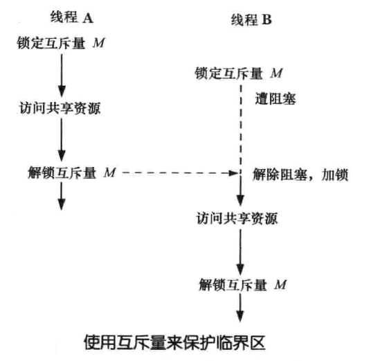
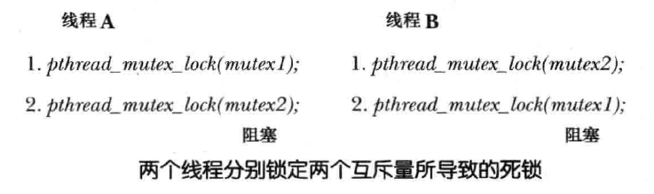

# 线程

<!-- TOC -->

- [一、线程原理](#一线程原理)
    - [1. 线程模型](#1-线程模型)
    - [2. 线程栈](#2-线程栈)
    - [3. 线程 VS 进程](#3-线程-vs-进程)
    - [4. 线程与信号](#4-线程与信号)
- [二、线程 API](#二线程-api)
    - [1. 线程 ID `pthread_t`](#1-线程-id-pthread_t)
    - [2. 线程创建 `pthread_create()`](#2-线程创建-pthread_create)
    - [3. 线程终止 `pthread_exit()`](#3-线程终止-pthread_exit)
    - [3. 线程的连接与分离](#3-线程的连接与分离)
        - [3.1 连接 `pthread_join()`](#31-连接-pthread_join)
        - [3.2 分离 `pthread_detach()`](#32-分离-pthread_detach)
    - [4. 线程取消](#4-线程取消)
        - [4.1 发送取消请求 `pthread_cancel()`](#41-发送取消请求-pthread_cancel)
        - [4.2 取消状态和类型 `pthread_setcancelstate()` 和 `pthread_setcanceltype()`](#42-取消状态和类型-pthread_setcancelstate-和-pthread_setcanceltype)
        - [4.3 取消点](#43-取消点)
        - [4.4 线程可取消性的检测 `pthread_testcancel()`](#44-线程可取消性的检测-pthread_testcancel)
        - [4.5 清理函数 `pthread_cleanup_push()` 和 `pthread_cleanup_pop()`](#45-清理函数-pthread_cleanup_push-和-pthread_cleanup_pop)
        - [4.6 异步取消](#46-异步取消)
    - [5. 线程属性](#5-线程属性)
        - [5.1 初始化和反初始化线程属性](#51-初始化和反初始化线程属性)
        - [5.2 设置和获取线程分离属性](#52-设置和获取线程分离属性)
        - [5.3 设置和获取线程栈属性](#53-设置和获取线程栈属性)
        - [5.4 设置和获取线程 guardsize 属性](#54-设置和获取线程-guardsize-属性)
- [三、线程同步](#三线程同步)
    - [1. 互斥量](#1-互斥量)
        - [1.1 创建互斥量](#11-创建互斥量)
        - [1.2 互斥量属性](#12-互斥量属性)
        - [1.3 加锁和解锁互斥量](#13-加锁和解锁互斥量)
        - [1.4 避免死锁](#14-避免死锁)
        - [1.5 互斥锁性能](#15-互斥锁性能)
    - [2. 条件变量](#2-条件变量)
        - [2.1 创建和销毁条件变量](#21-创建和销毁条件变量)
        - [2.2 条件变量属性](#22-条件变量属性)
        - [2.3 通知和等待条件变量](#23-通知和等待条件变量)
        - [2.4 测试条件变量的判断条件（predicate）](#24-测试条件变量的判断条件predicate)
        - [2.4 示例程序：利用条件变量连接任意已终止线程](#24-示例程序利用条件变量连接任意已终止线程)
    - [3. 读写锁](#3-读写锁)
        - [3.1 创建和销毁读写锁](#31-创建和销毁读写锁)
        - [3.2 加锁与解锁](#32-加锁与解锁)
    - [4. 自旋锁](#4-自旋锁)
    - [5. 屏障](#5-屏障)
- [四、线程安全](#四线程安全)
    - [1. 什么是线程安全？](#1-什么是线程安全)
    - [2.](#2)

<!-- /TOC -->

## 一、线程原理

### 1. 线程模型

线程实现有三种不同的模型，这 3 种实现模型的差异主要集中在线程如何与内核调度实体（`KSE, Kernel Scheduling Entity`）相映射。
> KSE 是内核分配 CPU 以及其他系统资源的（对象）单位，在早于线程而出现的传统 UNIX 中，KSE等同于进程

1. 多对一（M:1）实现（用户级线程）

   在 M:1 线程实现中，关乎线程创建、调度以及同步（互斥量的锁定，条件变量的等待等）的所有细节全部由进程内用户空间（ user-space）的线程库来处理。对于进程中存在的多个线程，内核一无所知。

   M:l 最大的 **优点** 在于：

   - 许多线程操作（例如线程的创建和终止、线程上下文间的切换、互斥量以及条件变量操作）速度都很快，因为无需切换到内核模式
   - 由于线程库无需内核支持，所以 M:l 实现在系统间的移植相对要容易一些

   M:1 实现也存在一些 **严重缺陷**：

   - 当一线程发起系统调用（如 `read()`）时，控制由用户空间的线程库转交给内核。这意味着，如果 `read()` 调用遭到阻塞，那么所有的线程都会被阻塞
   - 内核无法调度进程中的这些线程。因为内核并不知晓进程中存在这些线程，也就无法在多处理器平台上将各线程调度给不同的处理器
   - 另外，也不可能将一进程中某线程的优先级调整为高于其他进程中的线程，这是没有意义的，因为对线程的调度完全在进程中处理

2. 一对一（1:1）实现（内核级线程）

   在 1:1 线程实现中，每一线程映射一个单独的 KSE。内核分别对每个线程做调度处理，线程同步操作通过内核系统调用实现

   1:1 实现消除了 M:1 实现的种种弊端：
   - 遭阻塞的系统调用不会导致进程的所有线程被阻塞
   - 在多处理器硬件平台上，内核还可以将进程中的多个线程调度到不同的CPU上
   
   不过，还有以下问题：

   - 因为霈要切换到内核模式，所以诸如线程创建、上下文切换以及同步操作就要慢一些
   - 另外，为每个线程分别维护一个 KSE 也需要开销，如果应用程序包含大量线程，则可能对内核调度器造成严重的负担，降低系统的整体性能

   尽管有这些缺点，1:1 实现通常更胜于 M:l 实现。Linux Threads 和 NPIL 都采用 1:1 模型

3. 多对多（M:N）实现（两级模型）

   M:N 实现旨在结合 1:1 和 M:1 模型的优点，避免二者的缺点，在 M:N 模型中，每个进程都可拥有多个与之相关的 KSE，并且也可以把多个线程映射到一个 KSE。这种设计允许内核将同一应用的线程调度到不同的 CPU 上运行，同时也解决了随线程数量而放大的性能问题

   M:N 模型的最大问题是过于复杂：线程调度任务由内核及用户空间的线程库共同承担

Linux 下的线程库有两种实现：

1. `Linux Threads`：这是最初的 Linux 线程库实现

2. `NPTL(Native POSIX Threads Library)`：是 Linux 线程实现的现代版，`NPTL` 的性能优于 `Linux Threads`，也更加符合标准，目前 Linux 下所有的线程库开发都基于 `NPTL`

   通过下面的命令来查看当前 Linux 所用的线程库版本：

   ```
   $ getconf GNU_LIBPTHREAD_VERSION
   NPTL 2.31
   ```

### 2. 线程栈

### 3. 线程 VS 进程

### 4. 线程与信号

## 二、线程 API

### 1. 线程 ID `pthread_t`

进程内部的每个线程都有一个唯一标识，称为 **线程 ID**

新线程的 ID 会通过 `pthread_create()` 返回给其创建者，一个线程可以通过 `pthread_self()` 来获取自己的线程 ID：

```
#include <pthread.h>

pthread_t pthread_self(void);
```

- Linux 中，线程 ID 在系统所有进程中都是唯一的，但在其他 UNIX 实现中未必如此

函数 `pthread_equal()` 可检测两个线程的 ID 是否相同：

```
#include <pthread.h>

int pthread_equal(pthread_t t1, pthread_t t2);
```

- 线程 ID `t1` 和 线程 ID `t2` 相同返回非 0 值，否则返回 0


### 2. 线程创建 `pthread_create()`

启动程序时，产生的进程只有单条线程，称之为初始或主线程

函数 `pthread_create()` 负责创建一条新线程：

```c
#include <pthread.h>

int pthread_create(pthread_t *thread, const pthread_attr_t *attr, void *(*start)(void *), void *arg);
```
新线程通过调用函数 `start(arg)` 开始执行，调用 `pthread_create` 的线程会继续执行该调用之后的语句

- 参数 `thread` 指向 `pthread_t` 类型的缓冲区，在 `pthread_create` 返回前，会在此保存一个该线程的唯一标识，后续的 Pthreads 函数将使用该标识来引用此线程

- 参数 `attr` 是指向 `pthread_attr_t` 对象的指针，该对象指定了新线程的各种属性

  如果将 `attr` 设置为 NULL，那么创建新线程时将使用各种默认属性。新线程被创建后，应用程序不应该隐式依赖新旧线程的某种执行顺序

- 参数 `start` 为新线程的执行函数，`arg` 为为该函数提供的参数：

  - 将参数 `arg` 声明为 `void*` 类型，意味着可以将指向任意对象的指针传递给 `start` 函数
  
    一般情况下，`arg` 指向一个全局或堆变量，也可将其置为 NULL。如果需要向 `start` 传递多个参数，可以将 `arg` 指向一个结构，该结构的各个字段则对应于待传递的参数

  - `start` 的返回值类型为 `void*`，对其使用方式与参数 `arg` 相同

    > 注意：取消线程时的返回值 `PTHREAD_CANCELED`，通常是由实现所定义的整型值，再经强制转换为 `void*`。若正常终止的线程甲的 `start` 函数将此整型值返回给正在执行 `pthread_join()` 操作的线程乙，乙会误认为甲遭到了取消
    > 
    > 因此，如果应用如果采用了线程取消技术并选择将 `start` 函数的返回值强制转换为整型，那么就必须确保线程正常结束时的返回值与当前 Pthreads 实现中的 `PTHREAD_CANCELED` 不同

- `pthread_create()` 成功返回 0，失败返回 errno

### 3. 线程终止 `pthread_exit()`

可以如下方式终止线程的运行线程：

- `start` 函数执行 `return` 语句并返回指定值
- 线程调用 `pthread_exit()`
- 调用 `pthread_cancel()` 取消线程
- 任意线程调用了 `exit()`，或者主线程执行了 `return` 语句（在 `main()` 函数中），都会导致进程中的所有线程立即终止

`pthread_exit()` 函数将终止调用线程，且其返回值可由另一线程通过调用 `pthread_join()` 来获取：

```c
#include <pthread.h>

void pthread_exit(void *retval);
```

在任意线程（包括主线程）中执行 `pthread_exit()` 都将仅终止当前线程，其他线程将继续运行，这与在 `start()` 函数中执行 `return` 效果相同

- 参数 `retval` 指定了线程的返回值

  `retval` 所指向的内容不应分配于线程栈中，因为线程终止后，将无法确定线程栈的内容是否有效，同理，也不应在线程栈中分配线程 `start` 函数的返回值。


### 3. 线程的连接与分离

线程有分离和连接属性，它控制了线程结束后的行为：

- 默认情况下，线程是可连接 `joinable` 的，当线程退出时，其他线程可以通过调用 `pthread_join()` 获取其返回状态，如果未能连接，那么线程终止时将产生 **僵尸线程**，除了浪费资源之外，僵尸线程若累积过多，应用将再也无法创建新的线程
- 若线程分离，表示程序员并不关心线程的返回状态，可以使用 `pthread_detach()` 将线程标记为处于分离 `detached` 状态

#### 3.1 连接 `pthread_join()`

函数 `pthread_join()` 等待由 thread 标识的线程终止，如果线程已经终止，`pthread_join()` 会立即返回

```c
#include <pthread.h>

int pthread_join(pthread_t thread, void **retval);
```

- `retval`：非空时，将会保存线程终止时返回值的拷贝，该返回值亦即线程调用 `return` 或 `pthread_exit()` 所指定的值

`pthread_join()` 所执行的功能类似于 `waitpid()` 调用，不过二者有以下差异：

1. 线程之间的关系是对等的，进程中的任意线程均可以调用 `pthread_join()` 与该进程的任何其他线程连接起来
2. 线程仅可以根据具体线程 ID 进行连接，并且也不能以非阻塞的方式进行连接，不过可以通过条件变量实现类似阻塞连接的功能

TODO：下面代码创建了一个线程并与之连接：

```c

```

#### 3.2 分离 `pthread_detach()`

```c
#include <pthread.h>

int pthread_detach(pthread_t thread);
```

- 成功返回 0，失败返回错误编号

- 使用下面的方式，可以使线程自行分离：

  ```
  pthread_detach(pthread_self());
  ```

- 一旦线程处于分离状态，就不能再使用 `pthread_join()` 来获取其状态，也无法使其重返 “可连接” 状态


### 4. 线程取消

#### 4.1 发送取消请求 `pthread_cancel()`

函数 `pthread_cancel` 向由 `thread` 指定的线程发送一个取消请求

```c
#include <pthread.h>

int pthread_cancel(pthread_t thread);
```

- 成功返回 0，失败返回错误 error
- 发出取消请求后，函数 `pthread_cancel()` 立即返回，不会等待目标线程的退出

#### 4.2 取消状态和类型 `pthread_setcancelstate()` 和 `pthread_setcanceltype()`

```
#include <pthread.h>

int pthread_setcancelstate(int state, int *oldstate);
int pthread_setcanceltype(int type, int *oldtype);
```

`pthread_setcancelstate()` 用于设置调用进程的取消性状态：

- 参数 `state` 可取：

  - `PTHREAD_CANCEL_DISABLE`：线程不可取消
    
    如果此类线程收到取消请求，则会将请求挂起，直至将线程的取消状态置为启用

  - `PTHREAD_CANCEL_ENABLE`线程可以取消
  
    这是新建线程取消性状态的默认值

- 参数 `oldstate` 用于获取线程的前一取消状态，可设为 NULL

如果线程的取消性状态为启用 `PTHREAD_CANCEL_ENABLE`，那么对取消请求的处理则取决于线程的取消性类型，`pthread_setcanceltype()` 用于设置调用进程的取消性类型：

- 参数 `type` 可取：

  - `PTHREAD_CANCEL_ASYNCHRONOUS`：异步取消
  
    可能会在任何时点（也许是立即取消，但不一定）取消线程。异步取消的应用场景很少

  - `PTHREAD_CANCEL_DEFERED`
    
    取消请求保持挂起状态，直至到达取消点（`cancellation point`）。这也是新建线程的缺省类型

- 参数 `oldtype` 用于获取线程原有的取消类型，可设为 NULL

当某线程调用 `forκ()` 时，子进程会继承调用线程的取消性类型及状态。而当某线程调用 `exec()` 时，会将新程序主线程的取消性类型及状态分别重置为默认值 `PTHREAD_CANCEL_NABLE` 和 `PTHREAD_CANCEL_DEFERRED`

#### 4.3 取消点

#### 4.4 线程可取消性的检测 `pthread_testcancel()`

假设线程执行的是一个不含取消点的循环(计算密集型），这时，线程永远也不会响应取消请求。 

函数 `pthread_testcancel()` 的目的很简单，就是产生一个取消点。线程如果已有处于挂起状态的取消请求，那么只要调用该函数，线程就会随之终止

```
#include <pthread.h>

void pthread_testcancel(void);
```

当线程执行的代码未包含取消点时，可以周期性地调用 `pthread_testcancel()`，以确保对其他线程向其发送的取消请求做出及时响应

#### 4.5 清理函数 `pthread_cleanup_push()` 和 `pthread_cleanup_pop()`

```
#include <pthread.h>

void pthread_cleanup_push(void (*routine)(void*), void *arg);
void pthread_cleanup_pop(int execute);
```

#### 4.6 异步取消

### 5. 线程属性

Linux 下支持如下线程属性：

| 属性 | 描述 |
| --- | --- |
| `detachstate` | 线程的分离状态属性 |
| `guardsize` | 线程栈末尾的警戒缓冲区大小（字节数） |
| `stackaddr` | 线程栈的最低地址 |
| `stacksize` | 线程栈的最小长度（字节数） |

#### 5.1 初始化和反初始化线程属性

```
#include <pthread.h>

int pthread_attr_init(pthread_attr_t *attr);
int pthread_attr_destroy(pthread_attr_t *attr);
```

- `pthread_attr_init()` 用于将线程属性 `attr` 初始化为系统默认属性，
- `pthread_attr_destroy()` 用于反初始化线程属性，它会将 `pthread_attr_init()` 中为属性对象动态开辟的空间释放，并且为其他属性对象赋予无效值
- ``

#### 5.2 设置和获取线程分离属性

```
#include <pthread.h>

int pthread_attr_getdetachstate(const pthread_attr_t *restrict attr, int *detachstate);
int pthread_attr_setdetachstate(pthread_attr_t *attr, int *detachstate);
```

- `pthread_attr_getdetachstate()`：获取线程的 `detachstate` 属性
- `pthread_attr_setdetachstate()`：设置线程的 `detachstate` 属性

- `detachstate` 参数可取：
  - `PTHREAD_CREATE_DETACHED`：以分离状态启动线程
  - `PTHREAD_CREATE_JOINABLE`：正常启动线程

- 两函数成功返回 0，失败返回错误编号

- 如果在创建线程时就不需要了解线程的终止状态，可以利用 `pthread_attr_setdetachstate()` 修改线程的 `detachstate` 属性

TODO：下面代码给出了一个以分离状态创建线程的函数：

```c

```

#### 5.3 设置和获取线程栈属性

对于进程来说，虚地址空间的大小是固定的。因为进程中只有一个栈，所以它的大小通常不是问题

但对于线程来说，同样大小的虚地址空间必须被所有的线程栈共享：

- 如果应用程序使用了许多线程，以致这些线程栈的累计大小超过了可用的虚地址空间，就需要减少默认的线程栈大小
- 另一方面，如果线程调用的函数分配了大量的自动变量，或者调用的函数涉及许多很深的栈帧（stack frame），那么需要的栈大小可能要比默认的大

`pthread_attr_getstack()` 和 `pthread_attr_setstack()` 可用于读取和设置线程栈属性 `stacksize`：

```
#include <pthread.h>

int pthread_attr_getstack(const pthread_attr_t *restrict attr, void **restrict stackaddr, 
                                                               size_t *restrict stacksize);

int pthread_attr_setstack(pthread_attr_t *attr, void *stackaddr, size_t stacksize);
```
- `stackaddr` 参数指定的地址可以用作线程栈的内存范围中的最低可寻址地址

  如果线程栈的虚地址空间都用完了，那可以使用 `ma1loc` 或者 `mmap` 来为可替代的栈分配空间，并用 `pthread_attr_setstack` 函数来改变新建线程的栈位置和大小

- `stacksize` 指定进程栈的大小

- 两函数成功都返回 0，失败返回错误编号

也可以使用 `pthread_attr_getstacksize()` 和 `pthread_attr_setstacksize()` 仅获取和设置线程栈的大小：

```
#include <pthread.h>

int pthread_attr_getstacksize(const pthread_attr_t *restrict attr, size_t *restrict stacksize);
int pthread_attr_setstacksize(pthread_attr_t *attr, size_t stacksize);
```

- 如果希望改变默认的栈大小，但又不想自己处理线程栈的分配问题，这时使用 `pthread_attr_setstacksize` 函数就非常有用
- 设置 `stacksize` 属性时，选择的 `stacksize` 不能小于 `PTHREAD_STACK_MIN`
- 两函数成功都返回 0，失败返回错误编号


#### 5.4 设置和获取线程 guardsize 属性

线程属性 `guardsize` 控制着线程栈末尾之后用以避免栈溢出的扩展内存的大小。这个属性默认值是由具体实现来定义的，但常用值是系统页大小

可以把 `guardsize` 线程属性设置为 0，在这种情况下，系统将不会提供警戒缓冲区。同样，如果修改了线程属性 `stackaddr`，系统就认为我们将自己管理栈，进而使栈警戒缓冲区机制无效，这等同于把 `guardsize` 线程属性设置为 0

函数 `pthread_attr_getguardsize()` 和 `pthread_attr_setguardsize()` 用来获取和设置线程的 `guardsize` 属性：

```
#include <pthread.h>

int pthread_attr_getguardsize(const pthread_attr_t *restrict attr, size_t *restrict guardsize);
int pthread_attr_setguardsize(pthread_attr_t *attr, size_t guardsize);
```

- 两函数成功返回 0，失败返回错误编号

- 如果 guardsize线程属性被修改了，操作系统可能会把它取为页大小的整数倍。如果线程的栈指针溢出到警戒区域，应用程序就可能通过信号接收到出错信息


## 三、线程同步

### 1. 互斥量

线程的主要优势在于，能够通过全局变量来共享信息。不过必须确保多个线程不会同时修改同一变量，或者某一线程不会读取正由其他线程修改的变量。术语临界区（`critical section`）是指访问某一共享资源的代码片段，并且这段代码的执行应为原子（`atomic`） 操作，亦即，同时访问同一共享资源的其他线程不应中断该片段的执行

可以使用互斥量（`mutex` `mutual exclusion`）来保证对任意共享资源的原子访问，而保护共享变量是其最常见的用法

互斥量有两种状态：已锁定（ locked）和未锁定（ unlocked）。任何时候，至多只有一个线程可以锁定该互斥量。试图对已经锁定的某一互斥量再次加锁，将可能阻塞线程或者报错

一旦线程锁定互斥量，随即成为该互斥量的所有者，只有所有者才能给互斥量解锁

一般情况下，对每一共享资源（可能由多个相关变量组成）会使用不同的互斥量，每一线程在访问同一资源时将采用如下协议：

1. 针对共享资源锁定互斥量
2. 访问共享资源
3. 对互斥量解锁

<div align="center"></div>

#### 1.1 创建互斥量

互斥量是属于 `pthread_mutex_t` 类型的变量，使用前必须初始化，互斥量有两种创建方式，**静态分配互斥量** 和 **动态初始化互斥量**

##### 1.1.1 静态分配互斥量

```c
static pthread_mutex_t mtx = PTHREAD_MUTEX_INITIALIZER;
```

- 由静态分配的互斥量携带了默认属性，若想自定义互斥量属性，必须对互斥量使用动态初始化

##### 1.1.2 动态初始化互斥量

```c
#include <pthread.h>

int pthread_mutex_init(pthread_mutex_t *mutex, const pthread_mutexattr_t *attr);
```

- 参数 `mutex` 指定函数执行初始化操作的目标互斥量
- 参数 `attr` 是指向 `pthread_mutexattr_ t` 类型对象的指针，该对象在函数调用之前已经过了初始化处理，用于定义互斥量的属性。若将atr参数置为NULL，则该互斥量的各种属性会取默认值
- 成功返回 0，失败返回错误编号

- 初始化一个已被初始化的互斥量将导致未定义行为

下面情况下，必须使用函数 `pthread_mutex_init()`，而非静态初始化互斥量：

- 动态分配于堆中的互斥量
- 互斥量是在栈中分配的自动变量
- 初始化经由静态分配，且不使用默认属性的互斥量

当不再需要经由自动或动态分配的互斥量时，应使用 `pthread_mutex_destroy()` 将其销毁：

```c
#include <pthread.h>

int pthread_mutex_destroy(pthread_mutex_t *mutex);
```

- 成功返回 0，失败返回错误编号

- 只有当互斥量处于未锁定状态，且后续也无任何线程企图锁定它时，将其销毁才是安全的
- 若互斥量驻留于动态分配的一片内存区域中，应在释放（`free()`）此内存区域前将其销毁
- 对于自动分配的互斥量，应在宿主函数返回前将其销毁
- 经由 `pthread_mutex_destroy()` 销毁的互斥量，可调用 `pthread_mutex_init()` 对其重新初始化

#### 1.2 互斥量属性

##### 1.2.1 初始化和反初始化互斥量属性

互斥量属性是用 `pthread_mutexattr_t` 结构表示的，可以用 `pthread_mutexattr_init` 初始化该结构，用 `pthread_mutexattr_destroy` 来反初始化

```
#include <pthread.h>

int pthread_mutexattr_init(pthread_mutexattr_t *attr);
int pthread_mutexattr_destroy(pthread_mutexattr_t *attr);
```

- `pthread_mutexattr_init()` 函数将用默认的互斥量属性初始化 `pthread_mutexattr_t` 结构。其中值得注意的 3 个属性是：
  1. 进程共享属性
  2. 健壮属性
  3. 类型属性

##### 1.2.2 互斥量进程共享属性

可以使用 pthread_mutexattr getpshared函数查询 pthread_mutexattr_t结构，得到它的进程共享属性，使用 pthread muteκ attr_ setpshareα函数修改进程共享属性。

```c
#include <pthread.h>

int pthread_mutexattr_getpshared(const pthread_mutexattr_t *restrict attr, int *restrict pshared);
int pthread_mutexattr_setpshared(pthread_mutexattr_t *attr, int pshared);
```

- 参数 `pshared` 可取值：

  1. `PTHREAD_PROCESS_PRIVATE`：这是多线程应用程序中互斥量的默认行为，表示互斥量在同一进程的多个线程间共享
  2. `PTHREAD_PROCESS_SHARED`：允许互斥量在多个进程间共享

     我们说到，允许相互独立的多个进程把同一个内存数据块映射到它们各自独立的地址空间中。就像多个线程访问共享数据一样，多个进程访问共享数据通常也需要同步。如果进程共享互斥量属性设置为进程共享的，从多个进程彼此之间共享的内存数据块中分配的互斥量就可以用于这些进程的同步

##### 1.2.3 互斥量健壮属性

互斥量健壮属性与在多个进程间共享的互斥量有关。这意味着，当持有互斥量的进程终止时，需要解决互斥量状态恢复的问题。这种情况发生时，互斥量处于锁定状态，恢复起来很困难。其他阻塞在这个锁的进程将会一直阻塞下去

可以使用 `pthread_mutexattr_getrobust()` 函数获取健壮的互斥量属性的值，使用 `pthread_mutexattr_setrobust()` 函数设置健壮的互斥量属性的值

```c
#include <pthread.h>

int pthread_mutexattr_getrobust(const pthread_mutexattr_t *restrict attr, int *restrict robust);
int pthread_mutexattr_setrobust(pthread_mutexattr_t *attr, int robust);
```

健壮属性 `robust` 有两种取值可能：

- `PTHREAD_MUTEX_STALLED`：这是默认行为，意味着持有互斥量的进程终止时不需要采取特别的动作。这种情况下，使用互斥量后的行为是未定义的，等待该互斥量解锁的应用程序会被有效地 “拖住”

- `PTHREAD_MUTEX_ROBUST`：该值将导致线程调用 `pthread_mutex_lock` 获取锁，而该锁被另一个进程持有，但它终止时并没有对该锁进行解锁，此时线程会阻塞，从 `pthread_mutex_lock` 返回的值为 `EOWNERDEAD` 而不是 0

应用程序可以通过这个特殊的返回值知悉互斥量的当前状态以便对其进行恢复

如果应用状态无法恢复，在线程对互斥量解锁以后，该互斥量将处于永久不可用状态。为了避免这样的问题，线程可以调用 `pthread_mutex_consistent` 函数，指明与该互斥量相关的状态在互斥量解锁之前是一致的

```c
#include <pthread.h>

int pthread_mutex_consistent(pthread_mutex_t *mutex);
```

- 如果线程没有先调用 `pthread_mutex_consistent` 就对互斥量进行了解锁，那么其他试图获取该互斥量的阻塞线程就会得到错误码 `ENOTRECOVERABLE`。如果发生这种情况，互斥量将不再可用。线程通过提前调用 `pthread_mutex_consistent`，能让互斥量正常工作，这样它就可以持续被使用

##### 1.2.4 互斥量类型

使用 `pthread_mutexattr_gettype()` 得到互斥量类型属性，用 `pthread_mutexattr_settype` 函数修改互斥量类型属性

```c
#include <pthread.h>

int pthread_mutexattr_gettype(const pthread_mutexattr_t *restrict attr, int *restrict type);
int pthread_mutexattr_settype(pthread_mutexattr_t *attr, int type);
```

互斥量行为规范：

1. 同一线程不应对同一互斥量加锁两次
2. 线程不应对不为自己所拥有的互斥量解锁
3. 线程不应对一尚未锁定的互斥量做解锁动作

- 参数 `type` 可取值：

  1. `PTHREAD_MUTEX_NORMAL`：标准互斥量类型。
  
    不做任何的特殊的错误检查或死锁检测，即：

    - 若线程试图对已由自己锁定的互斥量加锁，则发生死锁
    - 互斥量处于未锁定状态，或者已由其他线程锁定，对其解锁将会导致不确定结果

  2. `PTHREAD_MUTEX_ERRORCHECK`：此互斥量类型提供错误检查

    上述 3 中互斥量行为都会导致该类型互斥量返回错误，这类互斥量执行起来比一般类型慢，不过可将其其作为调试工具

  3. `PTHREAD_MUTEX_RECURSIVE`：递归互斥量维护有一个锁计数器
  
     当线程第一次取得互斥量时，会将锁计数器置 1。后续由同一线程执行的每次加锁操作会递增锁计数器的数值，而解锁操作则递减计数器计数。只有当锁计数器值降至0时，才会释放该互斥量。解锁时如目标互斥量处于未锁定状态，或是已由其他线程锁定，操作都会失败

     递归互斥量不可用于条件变量，在应用程序中使用递归互斥量需要慎重

  4. `PTHREAD_MUTEX_DEFAULT`：此互斥量类型可以提供默认特性和行为。操作系统在实现它的时候可以把这种类型自由地映射到其他互斥量类型中的一种，Linux 下，该类型被映射为与 `PTHREAD_MUTEX_NORMAL` 相同

#### 1.3 加锁和解锁互斥量

函数 `pthread_mutex_lock()` 可以锁定某一互斥量，而函数 `pthread_mutex_unlock()` 则可以将一个互斥量解锁

```
#include <pthread.h>

int pthread_mutex_lock(pthread_mutex_t *mutex);
int pthread_mutex_unlock(pthread_mutex_t *mutex);
```

- 如果互斥量当前处于未锁定状态，该调用将锁定互斥量并立即返回。
- 如果其他线程已经锁定了这一互斥量，那么 `pthread_mutex_lock()` 调用会一直堵塞，直至该互斥量被解锁，到那时，调用将锁定互斥量并返回
- 如果发起 `pthread_mutex_lock()` 调用的线程自身之前已然将目标互斥量锁定，在 Linux上，默认情况下线程会发生死锁（deadlock），因试图锁定已为自己所持有的互斥量而遭到阻塞
- 函数 `pthread_mutex_unlock()` 将解锁之前已遭调用线程锁定的互斥量。以下行为均属错误：

  - 对处于未锁定状态的互斥量进行解锁
  - 解锁由其他线程锁定的互斥量

TODO：下面的代码展示了使用互斥量保护对全局变量的访问：

```c

```
  
#### 1.4 避免死锁

有时，一个线程需要同时访问两个或更多不同的共享资源，而每个资源又都由不同的互斥量管理。当超过一个线程加锁同一组互斥量时，就有可能发生死锁

下图展示了一个死锁的情况：

<div align="center"></div>

如何避免死锁问题：

1. 最简单的方法是 **定义互斥量的层级关系**：

   当多个线程对一组互斥量操作时，总是应该以相同顺序对该组互斥量进行锁定。
   
   例如，在上图所示场景中，如果两个线程总是先锁定 mutex1 再锁定 mutex2，死锁就不会出现。有时，互斥量间的层级关系逻辑清晰。不过，即便没有，依然可以设计出所有线程都必须遵循的强制层级顺序

2. 另一种方案的使用频率较低，就是“尝试一下，然后恢复”。

   在这种方案中，线程先使用函数 `pthread_ mutex_lock` 锁定第 1 个互斥量，然后使用函数 `pthread_mutex_trylock()` 来锁定其余互斥量。如果任一 `pthread_mutex_trylock()` 调用失败（返回 `EBUSY`），那么该线程将释放所有互斥量，经过一段时间间隔，从头再试
   
   较之于按锁的层级关系来规避死锁，这种方法效率要低一些，因为可能需要历经多次循环。另一方面，由于无需受制于严格的互斥量层级关系，该方法也更为灵活

#### 1.5 互斥锁性能

在通常情况下，线程会花费更多时间去做其他工作，对互斥量的加锁和解锁操作相对要少得多，因此使用互斥量对于大部分应用程序的性能并无显著影响

文件锁和信号量的问题在于，其锁定和解锁总是需要发起系统调用（system call），而每个系统调用的开销虽小但颇为可观。与之相反，**互斥量的实现采用了机器语言级的原子操作（在内存中执行，对所有线程可见），只有发生锁的争用时才会执行系统调用**

> Linux上，互斥量的实现釆用了 `futex`（快速用户空间互斥量，`fast user space mutex`），而对锁争用的处理则使用了 `futex()` 系统调用

### 2. 条件变量

互斥量防止多个线程同时访问同一共享变量，条件变量允许一个线程就某个共享变量（或其他共享资源）的状态变化通知其他线程，并让其他线程阻塞等待这一通过

#### 2.1 创建和销毁条件变量

条件变量的数据类型是 `pthread_count_t`，使用条件变量前必须对其进行初始化，其初始化分为静态分配初始化和动态分配初始化

##### 2.1.1 静态分配初始化

```
static pthread_cond_t cond = PTHREAD_COND_INITALIZER;
```


##### 2.1.2 动态分配初始化

使用函数 `pthread_cond_init()` 对条件变量进行动态初始化，以下情况必须使用动态分配初始化：

- 对自动或动态分配的条件变量进行初始化时
- 或是对未釆用默认属性经由静态分配的条件变量进行初始化时

当不再需要一个经由自动或动态分配的条件变量时，应调用 `pthread_cond_destroy()` 函数予以销毁

```c
#include <pthread.h>

int pthread_cond_init(pthread_cond_t *cond, const pthread_condattr_t *attr);
int pthread_cond_destroy(pthread_cond_t *cond);
```

- 参数 `cond` 表示将要初始化的目标条件变量
- 参数 `attr` 指定条件变量的属性，置 NULL 表示使用默认属性
- 两函数成功返回 0，失败返回错误编号
- 对已初始化的条件变量再次初始化将导致未定义行为

- 对某个条件变量而言，仅当没有任何线程在等待它时，将其销毁才是安全的。如果条件变量驻留于某片动态创建的内存区域，那么应在释放该内存区域前就将其销毁，经由自动分配的条件变量应在宿主函数返回前予以销毁
- 经 `pthread_cond_destroy()` 销毁的条件变量，之后可再次调用 `pthread_cond_init()` 对其进行重新初始化

#### 2.2 条件变量属性

条件变量拥有两个属性：**进程共享属性** 和 **时钟属性**

有一对函数用于初始化和反初始化条件变量属性：

```c
#include <pthread.h>

int pthread_condattr_init(pthread_condattr_t *attr);
int pthread_condattr_destroy(pthread_condattr_t *attr);
```

- 条件变量的 **进程共享属性** 控制着条件变量是可以被单进程的多个线程使用，还是可以被多进程的线程使用

  要获取进程共享属性的当前值，可以用 `pthread_condattr_getpshared()` 函数。设置该值可以用 `pthread_condattr_ setpshared()` 函数。

  ```c
  #include <pthread.h>

  int pthread_condattr_getpshared(const pthread_condattr_t* restrict attr, int *restrict pshared);
  int pthread_condattr_setpshared(pthread_condattr_t *attr, int pshared);
  ```

- **时钟属性** 控制计算 `pthread_cond_timedwait()` 函数的超时参数（rspm）时采用的是哪个时钟

  可以使用 `pthread_condattr_getclock()` 函数获取可被用于 `pthread_cond_timedwait()` 函数的时钟 ID，在使用  `pthread_cond_timedwait()` 函数前需要用 `pthread_condattr_t` 对象对条件变量进行初始化
  
  可以使用 `pthread_condattr_setclock()` 函数对时钟 ID 进行修改

  ```c
  #include <pthread.h>

  int pthread_condattr_getclock(const pthread_condattr_t* restrict attr, clockid_t *restrict clock_id);
  int pthread_condattr_setclock(pthread_condattr_t *attr, clockid_t clock_id);
  ```

#### 2.3 通知和等待条件变量

条件变量的主要操作是发送信号（signal）和等待（wait）：
- 发送信号操作即通知一个或多个处于等待状态的线程，某个共享变量的状态已经改变
- 等待操作是指在收到一个通知前一直处于阻塞状态。

函数 `pthread_cond_signal()` 和 `pthread_cond_broadcast()` 均可针对由参数 `cond` 所指定的条件变量而发送信号。 `pthread_cond_wait()` 函数将阻塞一线程，直至收到条件变量 `cond` 的通知

```c
#include <pthread.h>

int pthread_cond_signal(pthread_cond_t *cond);
int pthread_cond_broadcast(pthread_cond_t *cond);
int pthread_cond_wait(pthread_cond_t *cond, pthread_mutex_t *mutex);
// All return 0 on success, or a positive error number on error
```

函数 `pthread_cond_signal()` 和 `pthread_cond_broadcast()` 之间的差别在于：`pthread_cond_signal()` 函数只保证唤醒至少一条遭到阻塞的线程，而 `pthread_cond_broadcast()` 则会唤醒所有遭阻塞的线程：

- `pthread_cond signal()` 的应用场景是：所有等待线程都在执行完全相同的任务，每次只需唤醒一条（且无论是其中哪条）等待线程来处理共享变量的状态变化即可，此时使用 `pthread_cond_signal()` 会比 `pthread_cond_broadcast()` 更具效率，因为这可以避免发生线程全部唤醒并相互竞争的情况

- 相比之下，函数 `pthread_cond_broadcast()` 所处理的情况是：处于等待状态的所有线程执行的任务不同（即各线程关联于条件变量的判定条件不同）

条件变量并不保存状态信息，只是传递应用程序状态信息的一种通讯机制。发送信号时若无任何线程在等待该条件变量，这个信号也就会不了了之。线程如在此后等待该条件变量，只有当再次收到此变量的下一信号时，方可解除阻塞状态

函数 `pthread_cond_ timedwait()` 与函数 `pthread_cond_wait()` 功能相同，唯一的区别在于：由参数 `abstime` 来指定一个线程等待条件变量通知时休眠时间的上限：

```c
#include <pthread.h>

int pthread_cond_timedwait(pthread_cond_t *cond, pthread_mutex_t *mutex, const struct timespec *abstime);

// return 0 on success, or a positive error number on error
```

- 若 `abstime` 指定的时间间隔到期且无相关条件变量的通知，则返回 `ETIMEOUT` 错误

TODO：下面以一个生产者——消费者的例子说明条件变量：

```

```

#### 2.4 测试条件变量的判断条件（predicate）

**必须由一个 while 循环，而不是 if 语句，来控制对 `pthread_cond_wait()` 的调用** 这是因为：当代码从 `pthread_ cond_wait()` 返回时，并不能确定判断条件的状态，所以应该立即重新检查判断条件，在条件不满足的情况下继续休眠等待

之所以不能确定判断条件的状态，是因为：

1. 其他线程可能会率先醒来。也许有多个线程在等待获取与条件变量相关的互斥量。即使就互斥量发出通知的线程将判断条件置为预期状态，其他线程依然有可能率先获取互斥量并改变相关共享变量的状态，进而改变判断条件的状态

2. 设计时设置 “宽松的” 判断条件更为简单。有时，**用条件变量来表征可能性而非确定性**，在设计应用程序时会更为简单

3. 可能会发生 **虚假唤醒** 的情况。在一些实现中，即使没有任何其他线程真地就条件变量发出信号，等待此条件变量的线程仍有可能醒来，如信号中断等。在一些多处理器系统上，为确保高效实现而采用的技术会导致此类虚假唤醒

#### 2.4 示例程序：利用条件变量连接任意已终止线程

TODO:利用条件变量连接任意已终止线程

### 3. 读写锁

读写锁（reader-writer lock）与互斥量类似，不过读写锁允许更高的并行性。读写锁有 3 种状态：**读模式下加锁状态，写模式下加锁状态，不加锁状态**。一次只有一个线程可以占有写模式的读写锁，但是多个线程可以同时占有读模式的读写锁。读写锁非常适合于对数据结构读的次数远大于写的情况

- 当读写锁是写加锁状态时，在写锁被解锁之前，所有试图对这个锁加任何锁的线程都会被阻塞
- 当读写锁在读加锁状态时，所有试图对它加读锁的线程都可以得到访问权，但是任何希望以写模式对此锁进行加锁的线程都会阻塞，直到所有的线程释放它们的读锁为止。

  虽然各操作系统对读写锁的实现各不相同，但当读写锁处于读模式锁住的状态，而这时有一个线程试图以与模式获取锁时，读写锁通常会阻塞臃后的读模式锁请求。这样可以避免读模式锁长期占用，而等待的写模式锁请求一直得不到满足
  
#### 3.1 创建和销毁读写锁

读写锁在使用前必须初始化：

##### 3.1.1 静态分配初始化

可以对静态分配的读写锁进行初始化：

```c
static pthread_rwlock_t rwlock = PTHREAD_RWLOCK_INITIALIZER;
```

##### 3.1.2 动态分配初始化

也可使用 `pthread_rwlock_init()` 对自动或动态分配的读写锁进行初始化：

```c
#include <pthread.h>

int pthread_rwlock_init(pthread_rwlock_t *restrict rwlock, const pthread_rwlockattr_t *restrict attr);
int pthread_rwlock_destroy(pthread_rwlock_t *rwlock);

// All return 0 on success, or a positive error number on error
```

- 参数 `attr` 指定读写锁属性，设为 NULL 则使用默认属性，读写锁目前仅有进程共享属性

- 在释放读写锁占用的内存之前，需要调用 `pthread_rwlock_destroy()` 做清理工作。如果 `pthread_rwlock_init()` 为读写锁分配了资源，`pthread_rwlock_destroy()` 将释放这些资源

#### 3.2 加锁与解锁

要在读模式下锁定读写锁，需要调用 `pthread_relocκ_relock()`。要在写模式下锁定读写锁，需要调用 `pthread_rwlock_wrlock()`。不管以何种方式锁住读写锁，都可以调用 `pthread_relock_unlock()` 进行解锁

```c
#include <pthread.h>

int pthread_rwlock_rdlock(pthread_rwlock_t *rwlock);
int pthread_rwlock_wrlock(pthread_rwlock_t *rwlock);
int pthread_rwlock_unlock(pthread_rwlock_t *rwlock);

// All return 0 on success, or a positive error number on error
```

下面是读写锁的条件版本：

```c
#include <pthread.h>

int pthread_rwlock_tryrdlock(pthread_rwlock_t *rwlock);
int pthread_rwlock_trywrlock(pthread_rwlock_t *rwlock);
```

- 可以获取锁时，这两个函数返回 0，否则，它们返回错误 `EBUSY`

下面是带有超时的读写锁加锁函数，使应用程序在获取读写锁时避免陷入永久阻塞状态：

```c
#include <pthread.h>

int pthread_rwlock_timedrdlock(pthread_rwlock_t *restrict rwlock, const struct timespec *restrict tsptr);
int pthread_rwlock_timedwrlock(pthread_rwlock_t *restrict rwlock, const struct timespec *restrict tsptr);
```

- 如果在指定阻塞时间内不能获取锁，就返回 `ETIMEDOUT` 错误


TODO：下面代码展示了读写锁的使用：

```c

```

### 4. 自旋锁

自旋锁与互斥量类似，但它不是通过休眠使进程阻塞，而是在获取锁之前一直处于忙等（自旋）阻塞状态。自旋锁可用于以下情况：**锁被持有的时间短，而且线程并不希望在重新调度上花费太多的成本**

自旋锁作用：

- 自旋锁通常作为底层原语用于实现其他类型的锁

- 当自旋锁用在非抢占式内核中时是非常有用的：除了提供互斥机制以外，它们会阻塞中断，这样中断处理程序就不会让系统陷入死锁状态，因为它需要获取已被加锁的自旋锁（把中断想成是另一种抢占）。在这种类型的内核中，中断处理程序不能休眠，因此它们能用的同步原语只能是自旋锁。

### 5. 屏障

屏障（barrier）是用户协调多个线程并行工作的同步机制。屏障允许毎个线程等待，直到所有的合作线程都到达某一点，然后从该点继续执行， `pthread_join()` 函数就是一种屏障，允许一个线程等待，直到另一个线程退出

屏障对象的概念更广，它允许任意数量的线程等待，直到所有的线程完成处理工作，而线程不需要退出。所有线程达到屏障后可以接着工作。

可以使用 `pthread_barrier_init()` 函数对屏障进行初始化，用 `pthread_barrier_destroy()` 函数反初始化：

```c
#include <pthread.h>

int pthread_barrier_init(pthread_barrier_t *restrict barrier, 
                         const pthread_barrierattr_t *restrict attr, unsigned int count);
int pthread_barrier_destroy(pthread_barrier_t *barrier);

// All return 0 on success, or a positive error number on error
```

- 初始化屏障时，可以使用 `coun` 参数指定，在允许所有线程继续运行之前，必须到达屏障的线程数目

- 使用 `attr` 参数指定屏障对象的属性，设置 `attr` 为NULL，用默认属性初始化屏障，屏障目前只有进程共享属性

- 如果使用 `pthread_barrier_init()` 函数为屏障分配资源，那么在反初始化屏障时可以调用 `pthread_barrier_destroy()` 函数释放相应的资源

使用 `pthread_barrier_wait()` 函数来表明，线程已完成工作，准备等所有其他线程赶上来

```c
#include <pthread.h>

int pthread_barrier_wait(pthread_barrier_t *barrier);
```

- 调用 `pthread_barrier_wait()` 的线程在屏障计数未满足条件时，会进入休眠状态。如果该线程是最后一个调用 `pthread_barrier_wait()` 的线程，就满足了屏障计数，所有的线程都被唤醒
- 对于一个任意线程，`pthread_barrier_wait()` 函数返回了 `PTHREAD_BARRIER_SERLAL_THREAD`。剩下的线程看到的返回值是0 ，这使得一个线程可以作为主线程，它可以工作在其他所有线程已完成的工作结果上
- 一旦达到屏障计数值，而且线程处于非阻塞状态，屏障就可以被重用。但是除非在调用了 `pthread_barrier_destroy()` 函数之后，又调用了 `pthread_barrier_init()` 函数对计数用另外的数进行初始化，否则屏障计数不会改变

TODO：下面代码展示了一个任务合作的多个线程之间如何用屏障进行同步：

```c

```

## 四、线程安全

### 1. 什么是线程安全？

若函数可同时供多个线程安全调用，则称之为安全函数；反之，如果函数不是线程安全的，则不能并发调用，通常导致函数线程不安全的典型原因是：**使用了在所有线程之间共享的全局或静态变量**

实现线程安全的方法：

1. 将函数与互斥量关联使用
2. 将共享变量与互斥量关联使用，需要程序员确定代码中使用了共享变量的临界区，并且仅在执行到临界区时去获取和释放互斥量
3. 使用可重入函数无需使用互斥量即可实现线程安全

可重入函数的要点在于避免对全局和静态变量的使用，需要返回给调用者的任何信息，亦或是需要在对函数的历次调用间加以维护的信息，都存储于由调用者分配的缓冲区内。不过，并非所有函数都可以实现为可重入，通常的原因如下：

1. 有些函数必须访问全局数据结构。如 `malloc` 函数库中的函数
2. 一些函数的接口本身就定义为不可重入，要么返回指针，指向由函数自身静态分配的存储空间，要么利用静态存储对该函数（或相关函数）历次调用间的信息加以维护

### 2. 
