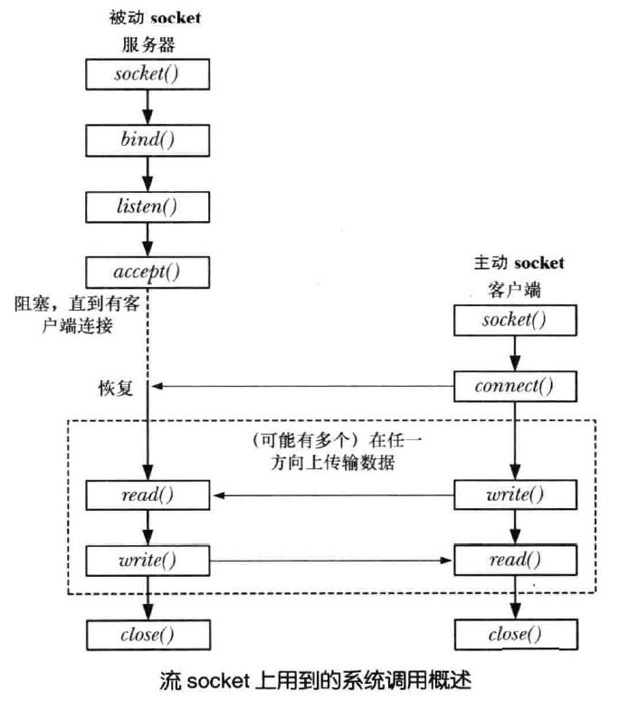
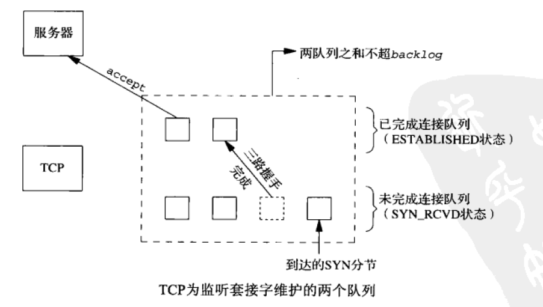
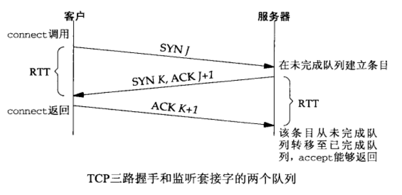
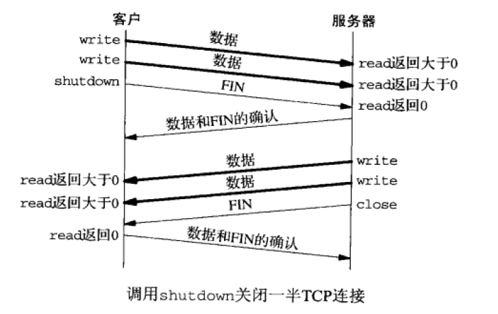
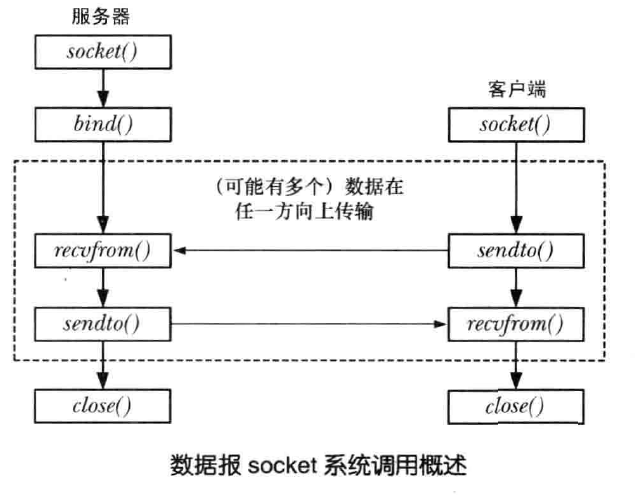
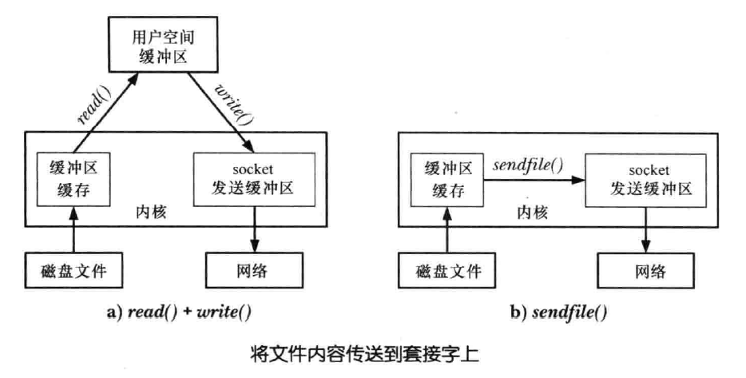
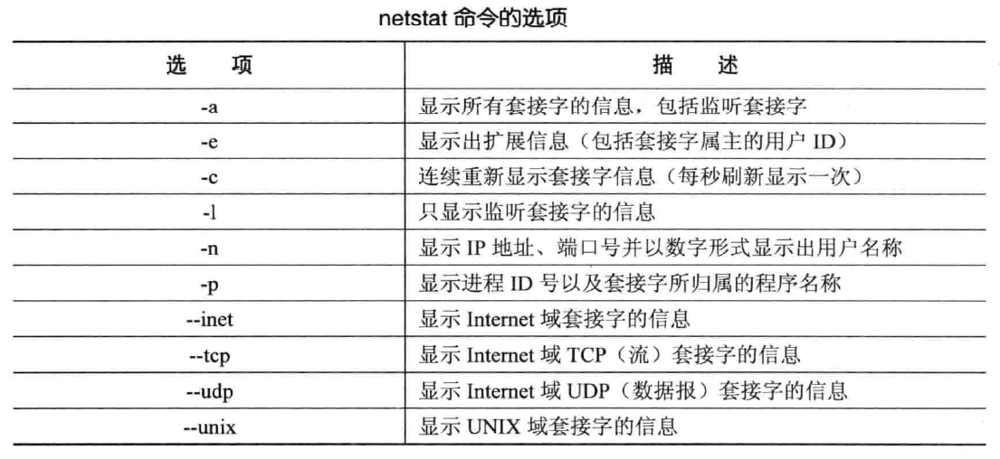
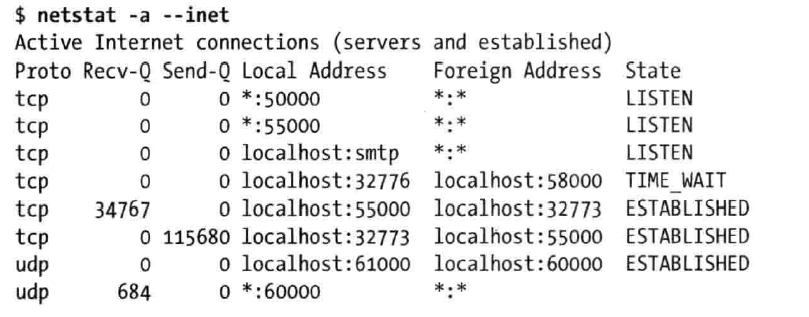

# 网络编程
<!-- TOC -->

- [一、概述](#一概述)
- [二、SOCKET](#二socket)
    - [1. 创建 socket `socket()`](#1-创建-socket-socket)
    - [2. socket 地址结构](#2-socket-地址结构)
        - [2.1 通用地址结构：`struct sockaddr`](#21-通用地址结构struct-sockaddr)
        - [2.2 UNIX domain socket 地址： `struct sockaddr_un`](#22-unix-domain-socket-地址-struct-sockaddr_un)
        - [2.3 Internet socket 地址](#23-internet-socket-地址)
    - [3. 为 socket 绑定地址 `bind()`](#3-为-socket-绑定地址-bind)
    - [4. 流 socket](#4-流-socket)
        - [4.1 流 socket 流程](#41-流-socket-流程)
        - [4.2 监听连接：`listen()`](#42-监听连接listen)
        - [4.3 接受连接：`accept()`](#43-接受连接accept)
        - [4.4 连接 socket：`connect()`](#44-连接-socketconnect)
        - [4.5 收发数据：`recv()` 和 `send()`](#45-收发数据recv-和-send)
        - [4.6 关闭连接：`close()` 和 `shutdown()`](#46-关闭连接close-和-shutdown)
    - [5. 数据报 socket](#5-数据报-socket)
        - [5.1 数据报 socket 流程](#51-数据报-socket-流程)
        - [5.2 接收数据报：`recvfrom()` 和 `sendto()`](#52-接收数据报recvfrom-和-sendto)
        - [5.3 数据报上使用 `connect()`](#53-数据报上使用-connect)
- [三、SOCKET：UNIX Domain](#三socketunix-domain)
    - [1. UNIX domain socket 权限](#1-unix-domain-socket-权限)
    - [2. 创建 socket 对：`socketpair()`](#2-创建-socket-对socketpair)
    - [3. Linux 抽象 socket 名空间](#3-linux-抽象-socket-名空间)
    - [4. UNIX domain 中的流 socket](#4-unix-domain-中的流-socket)
    - [5. UNIX domain 中的数据报 socket](#5-unix-domain-中的数据报-socket)
- [四、SOCKET：internet Domain](#四socketinternet-domain)
    - [1. 网络字节序](#1-网络字节序)
    - [2. 域名系统（DNS）](#2-域名系统dns)
    - [3. 端口号](#3-端口号)
    - [2. 主机和服务转换函数](#2-主机和服务转换函数)
        - [2.1 `inet_ntop()` 和 `inet_pton()`](#21-inet_ntop-和-inet_pton)
        - [2.2 `getaddrinfo()`](#22-getaddrinfo)
        - [2.3 `getnameinfo()`](#23-getnameinfo)
        - [2.4](#24)
- [五、SOCKET：高级](#五socket高级)
    - [1. 流式套机字上的部分读和部分写](#1-流式套机字上的部分读和部分写)
    - [2. `sendfile()` 系统调用](#2-sendfile-系统调用)
    - [3. 获取套接字地址 `getsockname()` 和 `getpeername()`](#3-获取套接字地址-getsockname-和-getpeername)
    - [4. 监视套接字 `netstat`](#4-监视套接字-netstat)
    - [5. 套接字选项](#5-套接字选项)
    - [6. `SO_REUSEADDR` 套接字选项](#6-so_reuseaddr-套接字选项)
    - [7. 在 `accept()` 中继承标记和选项](#7-在-accept-中继承标记和选项)
    - [8. TCP 和 UDP 对比](#8-tcp-和-udp-对比)
    - [9. 带外数据](#9-带外数据)
    - [10. `sendmsg()` 和 `recvmsg()` 系统调用](#10-sendmsg-和-recvmsg-系统调用)
    - [11. 传送文件描述符](#11-传送文件描述符)

<!-- /TOC -->


## 一、概述

## 二、SOCKET

### 1. 创建 socket `socket()`

`socket()` 系统调用创建一个新 socket

```c
#include <sys/socket.h>

int socket(int domain, int type, int protocol);

// Return file descriptor on success, or -1 on error
```

- 参数 `domain`（域）指定通信的特性：

  - `AF_INET`：IPv4 因特网域
  - `AF_INET6`：IPv6 因特网域
  - `AF_UNIX`：UNIX 域
  - `AF_UPSPEC`：未指定，可以表示任何域

- 参数 `type` 确定套接字类型：

  - `SOCK_STREAM`：有序的、可靠的、双向的、面向连接的字节流
  - `SOCK_DGRAM`：固定长度的、无连接的、不可靠的报文传递
  - `SOCK_RAW`：IP 协议的数据报接口
  - `SOCK_SEQPACKET`：固定长度的、有序的、可靠的、面向连接的报文传递

- 参数 `protocol` 通常为 0

### 2. socket 地址结构

#### 2.1 通用地址结构：`struct sockaddr`

socket API 中定义了通用的地址结构 `struct sockaddr`。这个类型的唯一用途是将各种 domain 特定的地址结构转换成单个类型以供 socket 系统调用中的各个参数使用，`sockaddr` 结构通常被定义成如下所示的结构：

```c
struct sockaddr {
    sa_family_t sa_family;
    char        sa_data[14];
}
```

#### 2.2 UNIX domain socket 地址： `struct sockaddr_un`

在 `UNIX domain` 中，socket 地址以路径名来表示，domain 特定的 socket 地址结构如下：

```c
struct sockaddr_un {
    sa_family_t sun_family;
    char sun_path[108];
}
```

TODO：下面代码展示了绑定一个 `UNIX domain socket` 的例子：

```c

```

TODO：完善

#### 2.3 Internet socket 地址

Internet domain socket 地址有两种：IPv4 和 IPv6

- IPv4 socket 地址：`struct sockaddr_in`

  `sockaddr_in` 结构被定义于 `<netinet/in.h>` 文件中：

  ```c
  struct in_addr {
      in_addr_t         s_addr;
  };

  struct sockaddr_in {
      sa_family_t       sin_family;
      in_port_t         sin_port;
      struct in_addr    sin_addr;
      unsigned char     __pad[X];
  };
  ```

- IPv6 socket 地址：`struct sockaddr_in6`

  `sockaddr_in6` 结构被定义于 `<netinet/in.h>` 文件中：

  ```c
  struct in6_addr {
      unit8_t           s6_addr[16];
  }

  struct sockaddr_in6 {
      sa_family_t       sin6_family;
      in_port_t         sin6_port;
      uint32_t          sin6_flowinfo;
      struct in6_addr   sin6_addr;
      uint32_t          sin6_scope_id;
  };
  ```


### 3. 为 socket 绑定地址 `bind()`

`bind()` 系统调用将一个 socket 绑定到一个地址上

```c
#include <sys/socket.h>

int bind(int sockfd, const struct sockaddr *addr, socklen_t addrlen);

// Return 0 on success, or -1 on error
```

- 参数 `sockfd` 是 `socket()` 中创建的 socket 文件描述符
- 参数 `addr` 指定了绑定到该 socket 的地址的结构，该结构的类型由 socket domain 决定
- `addrlen` 指定了 `addr` 结构的大小
- `bind()` 常见的错误是 `EADDRINUSE`（Address already in use，地址已使用）

### 4. 流 socket

#### 4.1 流 socket 流程

<div align="center"></div>

流 socket 的运作流程如下：

1. 通信双方都需要通过 `socket()` 系统调用创建通信 socket
2. 流 socket 通信前需要对通信双方的 socket 进行连接，连接过程如下：

   - 服务端需要调用 `bind()` 以将 socket 绑定到一个众所周知的地址上，然后调用 `listen()` 通知内核它接受接入连接的意愿

   - 客户端通过调用 `connect()` 建立连接，同时指定需连接的 socket 的地址

   - 待客户端连接请求发出后，服务端使用 `accept()` 接受连接客户端连接

3. 一旦建立了一个连接之后就可以在应用程序之间进行双向数据传输直到其中一个使用 `close()` 关闭连接为止，通信过程可以通过传统的 `read()`、`write()` 完成或者通过 socket 特定调用 `send()`、`recv()` 完成

主动和被动 socket：

流 socket 通常可以分为主动和被动两种：

- 默认情况下，使用 `socket()` 创建的 socket 是主动的。一个主动的 socket 可用在 `connect()` 调用中来建立到一个被动 socket 的连接，这种行为被称为执行一个主动的打开

- 被动 socket（也被称为监听 socket）是一个通过调用 `listen()` 以被标记成允许接入连接的 socket，接受一个接入连接通常被称为执行一个被动的打开

在大多数使用流 socket 的应用程序中，服务器会执行被动式打开，而客户端会执行主动式打开


#### 4.2 监听连接：`listen()`

`listen()` 系统调用将文件描述符 sockfd 引用的流 socket 标记为被动，这个 socket 后面会被用来接受来自其他（主动的）socket 的连接

```c
#include <sys/socket.h>

int listen(int sockfd, int backlog);

// Return 0 on success, or -1 on error
```

- `sockfd`：指定被监听的socket

- `backlog`：内核监听队列的最大长度。表示处于完全连接状态 `ESTABLISHED` 的 socket 的上限，典型值为 5（实际监听队列中完整连接的上限通常比 backlog 值略大），Linux 中 `/proc/sys/net/core/somaxconn` 规定了 backlog 可取的最大值
  > 处于半连接状态 `SYN_RCVD` 的sock上限则由 `/proc/sys/net/ipv4/tcp_max_syn_backlog` 内核参数定义


- 如何理解 `backlog` 参数？

  为了理解 `listen()` 中的 `backlog` 参数，必须认识到 **内核为任何一个给定的监听套接字维护两个队列**：

  1. **未完成连接队列（incomplete connection queue）**：每个这样的 `SYN` 分节对应其中一项：已由某个客户发出并到达服务器，而服务器正在等待完成相应的 TCP 三路握手过程，这些套接字处于 `SYN_RCVD` 状态
  2. **已完成连接队列（completed connection queue）**：每个已完成 TCP 三路握手过程的客户对应其中一项，这些套接字处于 `ESTABLISHED` 状态

  这两个监听套接字的队列如下图所示：

  <div align="center"></div>

  下图展示了这两个队列建立连接时所交换的分组：

  <div align="center"></div>

  - 当来自客户的 `SYN` 到达时，TCP 在未完成连接队列中创建一个新项，然后响应以三路握手的第二个分节：服务器的 `SYN` 响应，其中捎带对客户 `SYN` 的 `ACK`。这一项一直保留在未完成连接队列中，直到三路握手的第三个分节（客户对服务器 `SYN` 的 `ACK`）到达或者该项超时为止

  - 如果三路握手正常完成，该项就从未完成连接队列移到已完成连接队列的队尾。当进程调用 `accept()` 时，已完成连接队列中的队头项将返回给进程，或者如果该队列为空，那么进程将被投入睡眠，直到 TCP 在该队列中放入一项才唤醒它

  - 当一个客户 `SYN` 到达时，若这些队列是满的，TCP 就忽略该分节，也就是不发送 `RST`。这么做是因为：这种情况是暂时的，客户 `TCP` 将重发 `SYN`，期望不久就能在这些队列中找到可用空间。要是服务器 TCP 立即响应以一个 `RST`，客户的 `connect()` 调用就会立即返回一个错误，强制应用进程处理这种情况，而不是让 TCP 的正常重传机制来处理。另外，客户无法区别响应 `SYN` 的 `RST` 究竟意味着“该端口没有服务器在监听”，还是意味着“该端口有服务器在监听，不过它的队列满了”

  通过下面命令可以查看某个端口号的连接：

  ```
  $ netstat -nt | grep port
  ```


#### 4.3 接受连接：`accept()`

`accept()` 系统调用在文件描述符 sockfd 引用的监听流 socket 上接受一个接入连接，如果在调用 `accept()` 时不存在未决的连接，那么调用就会阻塞直到有连接请求到达为止

```c
#include <sys/socket.h>

int accept(int sockfd, struct sockaddr *addr, socklen_t *addrlen);

// Return file descriptor on success, or -1 on error
```

- `sockfd` 参数是 `listen()` 返回的监听 socket
- `addr` 指向一个返回对端 socket 地址的结构，参数的类型取决于 socket domain
- `addrlen` 参数为一个整数：在调用被执行之前要将这个整数初始化为 `addr` 指向的缓冲区的大小，这样内核就知道有多少空间可用于返回 socket 地址了，当 `accept()` 返回之后，这个整数会被设置成实际被复制进缓冲区中的数据的字节数

   若不关心对端 socket 的地址，可将 `addr` 和 `addrlen` 分别设置为 NULL 和 0

- 如何理解 `accept()`？

  `accept()` 会创建一个新 socket，并且正是这个新 socket 会与执行 `connect()` 的对等 socket 进行连接。`accept()` 调用返回的函数结果是已连接的 socket 的文件描述符。监听 socket 会保持打开状态，并且可以被用来接受后续的连接

#### 4.4 连接 socket：`connect()`

`connect()` 系统调用将文件描述符 sockfd 引用的主动 socket 连接到地址通过 `addr` 和 `addrlen` 指定的监听 socket 上

```c
#include <sys/socket.h>

int connect(int sockfd, const struct sockaddr *addr, socklen_t addrlen);

// Return 0 on success, or -1 on error
```

- `addr` 和 `addrlen` 分别表示要连接到的地址和地址长度
- 客户在调用函数 `connect()` 前不必非得调用 `bind()` 函数，因为如果需要的话，内核会确定源 IP 地址，并选择一个临时端口作为源端口
- 如果是 TCP 套接字，调用 `connect()` 函数将激发 TCP 的三次握手过程，而且仅在连接建立成功或出错时才返回，其中出错返回可能有以下几种情况：

  1. 若 TCP 客户没有收到 `SYN` 分节的响应，则返回 `ETIMEDOUT` 错误

  2. 若对客户的 `SYN` 的响应是 `RST`（表示复位），则表明该服务器主机在我们指定的端口上没有进程在等待与之连接（例如服务器进程也许没在运行），这是一种 **硬错误（hard error）**，客户一接收到 `RST` 就马上返回 `ECONNREFUSE` 错误

     > 三种情况下会受到 RST：
     > - 目的地为某端口的SYN到达，然而该端口上没有正在监听的服务器
     > - TCP想取消一个已有连接
     > - TCP接收到一个根本不存在的连接上的分节

  3. 若客户发出的 `SYN` 在中间的某个路由器上引发了一个“destination unreachable”（目的地不可达）`ICMP` 错误，则认为是一种 **软错误（soft error）**。客户主机内核保存该消息，并按一定的时间间隔继续发送 SYN。若在某个规定的时间后仍未收到响应，将把保存的消息（即 `ICMP` 错误）作为 `EHOSTUNREACH` 或 `ENETUNREACH` 错误返回给进程

#### 4.5 收发数据：`recv()` 和 `send()`

`recv()` 和 `send()` 系统调用可在已连接的套接字上执行 I/O 操作。它们提供了专属于套接字的功能，而这些功能在传统的 `read()` 和 `write()` 系统调用中是没有的

```c
#include <sys/socket.h>

ssize_t recv(int sockfd, void *buffer, size_t length, int flags);
// Return number of bytes received, 0 on EOF, or -1 on error

ssize_t send(int sockfd, const void *buffer, size_t length, int flags);
// Return number of bytes sent, or -1 on error
```

- `recv()` 和 `send()` 的返回值以及前 3 个参数同 `read()` 和 `write()` 一样

参数 `flags` 是个位掩码，用来修改 I/O 操作的行为：

- 对于 `recv()` 来说，该参数为下列值相或的结果：

  - `MSG_DONTWAIT`：`recv()` 以非阻塞的方式执行
  - `MSG_OOB`：在套接字上接收带外数据
  - `MSG_PEEK`：从套接字缓冲区中获取一份请求字节的副本，但不会将请求的字节从缓冲区中实际移除
  - `MSG_WAITALL`：指定了该标记后将导致系统调用阻塞，直到成功接收到 length 个字节
    
    但是，就算指定了这个标记，当岀现如下情况时，该调用返回的字节数可能还是会少于请求的字节

    - 捕获到一个信号
    - 流式套接字的对端终止了连接
    - 遇到了带外数据字节
    - 从数据报套接字接收到的消息长度小于 length 个字节
    - 套接字上出现了错误

    `MSG_WAITALL` 可以代替 `readn()` 函数，区别在于我们实现的 `readn()` 函数会在被信号处理函数中断后重新得到调用

- 对于 `send()` 来说，该参数为下列值相或的结果：

  - `MSG_DONTWAIT`：`send()` 以非阻塞的方式执行
TODO：完善 - `MSG_MORE`：效果等同套接字选项 `TCP_CORK`
  - `MSG_NOSIGNAL`：在已连接的流式套接字上发送数据时，如果连接的另一端已经关闭了，指定该标记后将不会产生 `SIGPIPE` 信号，相反，`send()` 调用会失败，错误码为 `EPIPE`
  - `MSG_OOB`：在流式套接字上发送带外数据

#### 4.6 关闭连接：`close()` 和 `shutdown()`

##### 4.6.1 `close()`

```c
#include <unistd.h>

int close(int fd);

// Return 0 on success, or -1 on error
```

- 如果多个文件描述符引用了同一个 socket，那么当所有描述符被关闭之后连接就会终止

##### 4.6.2 `shutdown()`

使用 `shutdown()` 关闭套接字可以避免 `close()` 的两个限制：

1. `close()` 使用引用计数关闭套接字描述符，仅在引用计数为 0 时才真正关闭套接字；而 `shutdown()` 可以无视引用计数立即关闭套接字连接

2. `close()` 终止读和写两个方向的数据传送，`shutdown()` 可以仅关闭连接一端

   > 既然 TCP 连接是全双工的，有时候我们需要告知对端我们已经完成了数据发送，即使对端仍有数据要发送给我们

   下图展示了调用 `shutdown()` 关闭一半 TCP 连接的过程：

   <div align="center"></div>

```c
#include <sys/socket.h>

int shutdown(int sockfd, int how);
```

- 参数 `how` 指示关闭套接字通道的一端还是两端：

  - `SHUT_RD`：关闭连接的读端
  
    套接字接收缓冲区中的现有数据都被丢弃，进程不能再对这样的套接字调用任何读函数，之后的读操作将返回文件结尾（0），不过数据仍然可以写入到套接字上

    - 对一个 TCP 套接字执行 `SHUT_RD` 操作后，由该套接字接收的来自对端的任何数据都被确认，然后悄然丢弃

    - 在 UNIX 域流式套接字上执行了 `SHUT_RD` 操作后，对端应用程序将接收到一个 `SIGPIPE` 信号，如果继续尝试在对端套接字上做写操作的话将产生 `EPIPE` 错误

  - `SHUT_WR`：关闭连接的写端

    对于 `TCP` 套接字，这称为半关闭（half-close）套接字。当前留在套接字发送缓冲区中的数据将被发送掉，后跟 TCP 的正常连接终止序列，一旦对端的应用程序已经将所有剩余的数据读取完毕，它就会检测到文件结尾。而由对端写入的数据仍然可以在套接字上读取。换句话说，这个操作允许我们在仍然能读取对端发回给我们的数据时，通过文件结尾来通知对端应用程序本地的写端已经关闭了
  
    进程不能再对这样的套接字调用任何写函数，后续对 UNIX 本地套接字的写操作将产生 SIGPIPE信号以及 EPIPE错误

  - `SHUT_RDWR`：将连接的读端和写端都关闭，这等同于执行 `shutdown()` 两次，先执行 `SHUT_RD`，再执行 `SHUT_WR`

- 注意：`shutdown()` 仅会关闭连接，并不会关闭文件描述符，要关闭文件描述符，只能另外再调用 `close()`


TODO：下面的代码展示了如何使用 `shutdown()` 的 `SHUT_WR` 操作：

```c

```

### 5. 数据报 socket

#### 5.1 数据报 socket 流程

<div align="center"></div>

数据报 socket 的运作流程如下：

1. 所有需要发送和接收数据报的应用程序都需要首先使用 `socket()` 创建一个数据报 socket
2. 一般服务器程序需要使用 `bind()` 将其 socket 绑定到一个众所周知的地址上
3. 为发送数据报，应用程序要调用 `sendto()`
4. 为接收数据报，应用程序要调用 `recvfrom()`，在没有数据报到达时会阻塞
5. 当不再需要 socket 时，需要调用 `close()` 关闭 socket

#### 5.2 接收数据报：`recvfrom()` 和 `sendto()`

```c
#include <sys/socket.h>

ssize_t recvfrom(int sockfd, void *buf, size_t nbytes, int flags, 
                             struct sockaddr *from, socklen_t *addrlen);

ssize_t sendto(int sockfd, void *buf, size_t nbytes, int flags, 
                             const struct sockaddr *to, socklen_t *addrlen);
```

- `recvfrom()` 和 `sendto()` 的返回值和前三个参数与 `read()` 和 `write()` 中的返回值和相应参数是一样的
- `flags` 是一个位掩码，控制着 socket 特定的 I/O 特性，其可取值与 `recv()` 和 `send()` 中的相同，可置为 0 表示不使用其中任何一种特性
- 对 `recvfrom()` 来说，`from` 和 `addrlen` 会返回用来发送数据报的远程 socket 的地址，在调用之前应将 `addrlen` 初始化为 `src_addr` 指向的结构的大小，在返回之后，它包含了实际写入这个结构的字节数

  若不关心发送者的地址，可将 `src_addr` 和 `addrlen` 都指定为 NULL，这时，`recvfrom()` 等价于使用 `recf()` 来接收一个数据报，也可以使用 `read()` 读取一个数据报，这相当于在使用 `recv()` 时将 flags 参数指定为 0

  不论 nbytes 的参数值是什么，`recvfrom()` 只会从一个数据报 socket 中读取一条消息，如果消息的大小超过了 nbytes 字节，那么消息会被截断为 nbytes 字节

- 对 `sendto()` 来说，`dest_addr` 和 `addrlen` 参数指定了数据报发送到的 socket

  写一个长度为 0 的数据报是可行的。在 UDP 情况下，这会形成一个只包含一个 IP 首部（对于 IPV4 通常为 20 个字节，对于 IPv6 通常为40个字节）和一个 8 字节 UDP 首部而没有数据的 IP 数据报

  这也意味着对于数据报协议，`recvfrom()` 返回 0 值是可接受的：它并不像 TCP 套接字上 `read()` 返回 0 值那样表示对端已关闭连接

#### 5.3 数据报上使用 `connect()`

在数据报 socket 上调用 `connect()` 会导致内核记录这个 socket 的对等 socket 的地址。术语 **已连接的数据报 socket** 就是指此种 socket。术语 **非连接的数据报 socket** 是指那些没有调用 `connect()` 的数据报 socket（即新数据报 socket的默认行为）

当一个数据报 socket 已连接之后：

- 数据报的发送可在 socket 上使用 `write()`（或 `send()`）来完成并且会自动被发送到同样的对等 socket 上。与 `sendto()`一样，每个 `write()` 调用会发送一个独立的数据报
- 在这个 socket 上只能读取由对等 socket 发送的数据报注意 `connect()` 的作用对数据报 socket 是不对称的。上面的论断只适用于调用了 `connect()` 的数据报 socket，并不适用于它连接的远程 socket（除非对等应用程序在其 socket 上也调用了 `connect()`）

通过再发起一个 `connect()` 调用可以修改一个已连接的数据报 socket 的对等 socket。此外，通过指定一个地址族（如 UNIX domain 中的 `sun_family` 字段）为 `AF_UNSPEC` 的地址结构还可以解除对等关联关系

为一个数据报 socket 设置一个对等 socket，这种做法的一个明显优势是在该 socket 上传输数据时可以使用更简单的IO系统调用，即无需使用指定了 dest_addr 和 addrlen 参数的 `sendto()`，而只需要使用 `write()` 即可，设置一个对等 socket 主要对那些需要向单个对等 socket

## 三、SOCKET：UNIX Domain

### 1. UNIX domain socket 权限

socket 文件的所有权和权限决定了哪些进程能够与这个 socket 进行通信：

- 要连接一个 UNIX domain 流 socket 需要在该 socket 文件上拥有写权限
- 要通过一个 UNIX domain 数据报 socket 发送一个数据报需要在该 socket 文件上拥有写权限
- 需要在存放 socket路径名的所有目录上都拥有执行（搜索）权限。

在默认情况下，创建 socket（通过 `bind()`）时会给所有者（用户）、组以及 other 用户赋予所有的权限。要改变这种行为可以在调用 `bind()`之前先调用 `umask()` 来禁用不希望赋予的权限

### 2. 创建 socket 对：`socketpair()`

`socketpair()` 为单个进程创建一对 socket 并将它们连接起来提供了一个快捷方式

```c
#include <sys/socket.h>

int socketpair(int domain, int type, int protocol, int sockfd[2]);

// Return 0 on success, or -1 on error
```

- `socketpair()` 只能用于 UNIX domain 中，即 `domain` 参数必须被指定为 `AF_UNIX`
- `type` 参数可为：`SOCK_DGRAM` 或 `SOCK_STREAM`

  当 `type` 指定为 `SOCK_STREAM` 时相当于创建了一个双向管道（也被称为流管道），每个 socket 都可以用来读取和写入，并且这两个 socket 之间每个方向上的数据信道是分开的

  socket 对的使用方式与管道的使用方式类似，一般用于相关进程间的通信

- `protocol` 参数必须为 0
- `sockfd[2]` 返回了两个相互连接的 socket 的文件描述符

### 3. Linux 抽象 socket 名空间

Linux 的抽象路径名空间允许将一个 UNIX domain socket 绑定到一个名字上但不会在文件系统中创建该名字，这种做法的优点在于：
- 无需担心与文件系统中的既有名字产生冲突
- 没有必要在使用完 socket 之后删除 socket 路径名。当 socket 被关闭之后会自动删除这个抽象名
- 无需为 socket 创建一个文件系统路径名了，这对于 chroot环境以及在不具备文件系统上的写权限时是比较有用的

要创建一个抽象绑定就需要将 sun_path 字段的第一个字节指定为null字节（0）

TODO：下面代码演示了如何创建一个抽象 socket 绑定：

```

```

### 4. UNIX domain 中的流 socket

TODO：下面代码展示了一个使用 UNIX domain 中的流 socket 的客户端-服务器应用程序：

```c

```

### 5. UNIX domain 中的数据报 socket

TODO：下面代码展示了一个简单的使用 UNIX domain 数据报 socket 的客户端/服务器应用程序：

```c

```

## 四、SOCKET：internet Domain

### 1. 网络字节序

以十六进制数0x1234为例：

小端字节序：00000001 00000010 00000011 00000100（高地址存高字节）

大端字节序：00000100 00000011 00000010 00000001（高地址存低字节）

网络字节序 <==> 大端字节序

主机字节序 <==> 不同平台字节序不同

应该总是使用下面函数，以保证程序可以在各种平台的移植性，在主机字节序和网络字节序一样的系统上，这些函数只是简单地原样返回传递给它们的参数

主机字节序和网络字节序转换API：

```c
#include <arpa/inet.h>

uint16_t htons(uint16_t host_uint16);
// Return host_uint16 converted to network byte order

uint32_t htonl(uint32_t host_uint32);
// Return host_uint32 converted to network byte order

uint16_t ntohs(uint16_t net_uint16);
// Return net_uint16 converted to host byte order

uint32_t ntohl(uint32_t net_uint32);
// Return net_uint32 converted to host byte order
```

### 2. 域名系统（DNS）

在 DNS 出现之前，主机名和 IP 地址之间的映射关系通过本地文件 `/etc/hosts` 定义，该文件包含了形如下面的记录：

```
# IP-address        canonical hostname      [aliases]
127.0.0.1           localhost
```

`gethostbyname()` 函数就是通过搜索这个文件并找出与规范主机名或其中一个别名匹配的记录来获取一个 IP 地址的

后面由于网络中主机的增长，`/etc/hosts` 文件的方式有很大局限性，所以设计了 DNS 服务，它使用 **递归和迭代** 的方式通过访问 DNS 服务器来查询相关主机的 IP 地址

### 3. 端口号

知名服务名与其端口号之间的对应关系记录在文件 `/etc/services` 中，`getaddrinfo()` 和 `getnameinfo()` 就是使用这个文件中的信息在服务名和端口号之间进行转换的

### 2. 主机和服务转换函数

主机地址和端口的表示有下列两种方法：

- 主机地址可以表示为一个二进制值或一个符号主机名或展现格式（IPv4是点分十进制，IPv6是十六进制字符串）
- 端口号可以表示为一个二进制值或一个符号服务名

它们格式间的转换工作主要通过各种库函数完成，其中：

- 现代 API：`inet_ntop()`、`inet_pton()`、`getaddrinfo()`、`getnameinfo()`
- 废弃 API：`inet_aton()`、`inet_ntoa()`、`gethostbyname()`、`getservbyname()`

在新应用程序中，现代 API 是首选函数，但是一些老的应用程序都使用的已经废弃的 API，所以还需要学习这些废弃 API

#### 2.1 `inet_ntop()` 和 `inet_pton()`

#### 2.2 `getaddrinfo()`

给定一个主机名和服务器名，`getaddrinfo()` 函数返回一个 socket 地址结构列表，每个结构都包含了一个地址和端口号

```c
#include <sys/socket.h>
#include <netdb.h>

int getaddrinfo(const char *host, const char *service,
                const struct *hints, struct addrinfo **result);
```

#### 2.3 `getnameinfo()`

```c
#include <sys/socket.h>
#include <netdb.h>

int getnameinfo(const struct sockaddr *addr, socklen_t addrlen, char *host,
                size_t hostlen, char *service, size_t servlen, int flags);
```

#### 2.4 

## 五、SOCKET：高级

### 1. 流式套机字上的部分读和部分写

如果套接字上可用的数据比在 `read()` 调用中请求的数据要少，那就可能会出现部分读的现象。在这种情况下， `read()` 简单地返回可用的字节数

如果没有足够的缓冲区空间来传输所有请求的字节，并且满足了如下几条的其中一条时，可能会出现部分写的现象：

- 在 `write()` 调用传输了部分请求的字节后被信号处理例程中断
- 套接字工作在非阻塞模式下（`O_NONBLOCK`），可能当前只能传输一部分请求的字节
- 在部分请求的字节已经完成传输后出现了一个异步错误。对于这里的异步错误，我们指的是应用程序使用的套接字 API 调用中出现了一个异步错误。比如，由于 TCP 连接岀现问题，可能就会使对端的应用程序崩溃

我们可以自己实现两个函数 `readn()` 和 `writen()`，用来在发生部分读或部分写的情况时重新调用系统调用来完成全部数据的传输：

```c
#include "rdwrn.h"

ssize_t readn(int fd, void *buffer, size_t count);
// Return number of bytes read, 0 on EOF, or -1 on error

ssize_t writen(int fd, void *buffer, size_t count);
// Returns number of bytes written, or -1 on error
```

函数 `readn()` 和 `writen()` 的参数与 `read()` 和 `write()` 相同。但是，这两个函数使用循环来重新启用这些系统调用，因此确保了请求的字节数总是能够全部得到传输（除非岀现错误或者在 `read()` 中检测到了文件结尾符）

TODO：`readn()` 和 `write()` 的实现如下：

```c

```

### 2. `sendfile()` 系统调用

服务器上通过套接字将磁盘上的文件内容不做修改的传输出去，通常使用下面的方法：

```c
while ( (n = read(fd, buf, size)) > 0)
    write(sockfd, buf, n);
```

这种方式的问题在于：在传输大文件时不高效，为了传输文件，必须使用两个系统调用：一个用来将文件内容从内核缓冲区 cache 中拷贝到用户空间，另一个用来将用户空间缓冲区拷贝回内核空间，以此才能通过套接字进行传输

<div align="center"></div>

而使用 `sendfile()` 时，文件内容会被直接传送到套接字上，不会经过用户空间，这被称为 **零拷贝传输（zero-copy transfer）**

```c
#include <sys/sendfile.h>

ssize_t sendfile(int out_fd, int in_fd, off_t *offset, size_t count);
// Return number of bytes transferred, or -1 on error
```

- 实际使用中，`out_fd` 必须指向一个套接字，`in_fd` 必须是可以进行 `mmap()` 操作的，这通常是一个普通文件，这表示 `sendfile()` 仅可以将数据从文件传送到套接字上

- 若 `offset` 指定了从文件 `in_fd` 的 `offset` 偏移量开始传输数据
  
  - 若 `offset` 不为 NULL，则 `offset` 为传入传出参数，其返回的值中包含了从 `in_fd` 传输过来的紧靠着最后一个字节的下一个字节的偏移量，并且此时 `sendfile()` 不会更改 `in_fd` 的文件偏移量
  - 若 `offset` 为 NULL，那么从 `in_fd` 传输的字节就从当前的文件偏移量处开始，且在传输时会更新文件偏移量以反映出已传输的字节数

- 参数 `count` 指定了请求传输的字节数
- 调用成功后， `sendfile()` 会返回实际传输的字节数


### 3. 获取套接字地址 `getsockname()` 和 `getpeername()`

系统调用 `getsockname()` 和 `getpeername()` 分别返回本地套接字地址以及对端套接字地址

```c
#include <sys/socket.h>

int getsockname(int sockfd, struct sockaddr *addr, socklen_t *addrlen);
int getpeername(int sockfd, struct sockaddr *addr, socklen_t *addrlen);

// Both return 0 on success, or -1 on error
```

- `sockfd` 表示指向套接字的文件描述符
- `addr` 是一个指向 `sockaddr` 结构体的指针，该结构体包含着套接字的地址。这个结构体的大小和类型取决于套接字域
- `addrlen` 是一个保存结果值的参数。在执行调用之前，`addrlen` 应该被初始化为 `addr` 所指向的缓冲区空间的大小。调用返回后，`addrlen` 中包含实际写入到这个缓冲区中的字节数

`getsockname()` 可以返回套接字地址族，以及套接字所绑定到的地址。`getsockname()` 可用的场景有：

- 如果套接字绑定到了另一个程序，且套接字文件描述符在经过 `exec()` 调用后仍然得到保留，那么此时 `getsockname()` 就能派上用场了
- 当隐式绑定到一个 internet 域套接字上时，如果我们想获取内核分配给套接字的临时端口号，那么调用 `getsockname()` 也是有用的，内核会在出现如下情况时执行一个隐式绑定：

  - 已经在 TCP 套接字上执行了 `connect()` 或 `listen()` 调用，但之前还没有通过 `bind()` 绑定到一个地址上
  - 当在 UDP 套接字上首次调用 `sendto()` 时，该套接字之前还没有绑定到地址上
  - 调用 `bind()` 时将端口号 `sin_port` 指定为 0，这种情况下 `bind()` 会为套接字指定一个 IP 地址，但内核会选择一个临时的端口号

系统调用 `getpeername()` 返回流式套接字连接中对端套接字的地址。如果服务器想找出发岀连接的客户端地址，这个调用就特别有用，主要用于TCP套接字上

TODO：下面代码展示了 `getsockname()` 和 `getpeername()` 的用法：

```c

```

### 4. 监视套接字 `netstat`

`netstat` 程序可以显示系统中 Internet 和 UNIX 域套接字的状态，`netstat` 在不给出命令行选项时默认同时显示出 UNIX 域和 Internet 域已连接的套接字信息

<div align="center"></div>

下面是一个使用 `netstat` 的例子：

<div align="center"></div>

- `Proto`：表示套接字所使用的协议，例如 tcp 或 udp
- `Recv-Q`：表示套接字接收缓冲区中还未被本地应用读取的字节数。对于 UDP 套接字来说，该字段不只包含数据，还包含 UDP 首部及其他元数据所占的字节
- `send-Q`：表示套接字发送缓冲区中排队等待发送的字节数。和 `Recv-Q` 字段一样，对于 UDP 套接字，该字段还包含了 UDP 首部和其他元数据所占的字节
- `Local address`：该字段表示套接字绑定到的地址，以 `主机 IP : 端口号` 的形式表示。默认情况下，主机地址和端口号都以名称形式来显示，除非数值形式无法解析到对应的主机和服务名称。地址中主机部分的星号（*）表示这是一个通配IP地址

- `Foreign Address`：这是对端套接字所绑定的地址。字符串 `*:*` 表示没有对端地址
- `State`：表示当前套接字所处的状态

### 5. 套接字选项

系统调用 `setsockopt()` 和 `getsockopt()` 是用来设定和获取套接字选项的

```c
#include <sys/socket.h>

int getsockopt(int sockfd, int level, int optname, void *optval, socklen_t *optlen);
int setsockopt(int sockfd, int level, int optname, const void *optval, socklen_t optlen);

// Both return 0 on success, or -1 on error
```

- `sockfd` 代表了指向套接字的文件描述符参数
- `level` 指定了套接字选项所适用的协议，如，IP 或者 TCP。对于本书中我们描述的大多数套接字选项来说， `level` 都会设为 `SOL_SOCKET`，这表示选项作用于套接字 API 层
- 参数 `optname` 标识了我们希望设定或取出的套接字选项
- 参数 `optval` 是一个指向缓冲区的指针，用来指定或者返回选项的值。根据选项的不同，这个参数可以是一个指向整数或结构体的指针
- 参数 `optlen` 指定了由 `optval` 所指向的缓冲区空间大小（字节数）
  - 对于 `setsockopt()` 来说，这个参数是按值传递的
  - 对于 `getsockopt()` 来说，`optlen` 是一个保存结果值的参数。在调用之前，我们将 `optlen` 初始化为由 `optval` 所指向的缓冲区空间大小值；调用返回后，该参数被设为实际写入到缓冲区中的字节数

### 6. `SO_REUSEADDR` 套接字选项

UNIX 中一个已连接的 TCP 套接字是由一个 4 元组来唯一标识的，形式如下：

```
{ local-IP-address, local-port, foreign-IP-address, foreign-port }
```

TCP 规范要求每个这样的 4 元组都是唯一的，也就是说只有一个对应的连接可以存在，Linux 强制施加了一个更为严格的约束：如果主机上有任何可匹配到本地端口的TCP连接，则本地端口不能被重用

启用 `SO_REUSEADDR` 套接字选项可以解放这个限制，使得更接近TCP的需求。默认情况下该选项的值为0，表示被关闭。我们可以在绑定套接字之前为该选项设定一个非零值来启用它，如下面代码所示：

```c
int sockfd, optval;

sockfd = socket(AF_INET, SOCK_STREAM, 0);
if (sockfd == -1)
    errExit("socket");

if (setsockopt(sockfd, SOL_SOCKET, SO_REUSEADDR, &optval, sizeof(optval)) == -1)
    errExit("setsockopt");

if (bind(sockfd, &addr, addrlen) == -1)
    errExit("bind");

if (listen(sockfd, backlog) == -1)
    errExit("listen");
```

`SO_REUSEADDR` 最常见的用途：避免当TCP服务器重启时，尝试将套接字绑定到当前已经同TCP结点相关联的端口上时出现的 EADDRINUSE（地址已使用）错误

下面两种情况中出现这个问题：

- 之前连接到客户端的服务器要么通过 `close()`，要么是因为崩溃（例如被信号杀死）而执行了一个主动关闭。这就使得 TCP 结点将处于 `TIME WAIT`，直到 2 倍的 MSL 超时过期为止

- 之前，服务器先创建一个子进程来处理客户端的连接。稍后服务器终止，而子进程继续服务客户端，因而使得维护的 TCP 结点使用了服务器的知名端口号（well-known port）

在以上两种情况中，剩下的 TCP 结点无法接受新的连接。尽管如此，针对这两种情况，默认情况下大多数的 TCP 实现会阻止新的监听套接字绑定到服务器的知名端口上。

### 7. 在 `accept()` 中继承标记和选项

在 Linux 上，如下这些属性是不会被 `accept()` 返回的新的文件描述符所继承的

- 同打开的文件描述相关的状态标记：即可以通过 `fcntl()` 的 `F_SETFL` 操作所修改的标记，包括 `O_NONBLOCK` 和 `O_ASYNO`
- 文件描述符标记，即可以通过 `fcntl()` 的 `F_SETFD` 操作来修改的标记。唯一一个这样的标记是执行中关闭（`close-on-exec`）标记（`FD_CLOEXEC`）
- 与信号驱动 I/O 相关联的文件描述符属性，如 `fcntl()` 的 `F_SETOWN`（属主进程ID）以及 `F_SETSIG`（生成信号）操作

由 `accept()` 返回的新的描述符继承了大部分套接字选项，这些选项可以通过 `setsockopt()` 来设定

### 8. TCP 和 UDP 对比

### 9. 带外数据

带外数据（out-of-band data）与普通数据相比，它允许更高优先级的数据传输。带外数据先行传输，即使传输队列已经有数据。TCP支持带外数据，但是UDP不支持

TCP 将带外数据称为紧急数据（urgent data）。TCP 仅支持一个字节的紧急数据，但是允许紧急数据在普通数据传递机制数据流之外传输。为了产生紧急数据，可以在发送函数中指定 `MSG_OOB` 标志。如果带 `MSG_OOB` 标志发送的字节数超过一个时，最后一个字节将被视为紧急数据字节，如果在接受处理完前一个带外数据字节之前，发送端发送了额外的带外数据，那么之前对带外数据的通知就会丢失

当套接字收到紧急数据可用的通知时，内核会为套接字的属主发送 `SIGURG` 信号

因此，内核通知应用程序带外数据到达有两种常见方式：**I/O复用产生的异常事件** 和 **SIGURG信号**

当内核通知带外数据到达时，可以通过 `sockatmark()` 判断 sockfd 是否处于带外标记，即下一个被读取到的数据是否是带外数据，如果是，`sockatmark()` 返回 1，此时可以通过带 `MSG_OOB` 标志的 `recv()` 调用来接收带外数据。如果不是，则 `sockatmark()` 返回 0

```c
#include <sys/socket.h>

int sockatmark(int sockfd);
```

`sockatmark()` 函数的一个常见实现：

```
int sockatmark(int fd) {
    int flag;
    if (ioctl(fd, SIOCATMARK, &flag) < 0)
        return -1;
    return (flag != 0);
}
```

### 10. `sendmsg()` 和 `recvmsg()` 系统调用

`sendmsg()` 和 `recvmsg()` 是套接字 I/O 系统调用中最为通用的两种。`sendmsg()` 系统调用能做到所有 `write()`、`send()` 以及 `sendto()` 能做到的事，`recvmsg()` 系统调用能做到所有 `read()`、 `recv()` 以及 `recvfrom()` 能做到的事。此外，这两个系统调用还有如下功能：

- 同 `readv()` 和 `writev()` 一样，我们可以执行分散/聚合 I/O（scatter-gather I/O）
  
  当我们通过 `sendmsg()` 在数据报套接字上聚合输出时（或者在一个已连接的数据报套接字上执行 `writev()`），就生成一个单独的数据报。相反，`recvmsg()`（以及 `readv()`）可用来在数据报套接字上分散输入，将单个数据报分散到多个用户空间缓冲区中
  
- 我们可以传送包含特定于域的辅助数据（也称为控制信息）。辅助数据可以通过流式和数据报式套接字来传递

### 11. 传送文件描述符

通过 `sendmsg()` 和 `recvmsg()`，我们可在同一台主机上通过 UNIX 域套接字将包含文件描述符的辅助数据从一个进程传递到另一个进程上。以这种方式可以传递任意类型的文件描述符

比如，从 `open()` 或 `pipe()` 返回得到的文件描述符。一个同套接字更相关的例子是：主服务器可以在 TCP 监听套接字上接受客户端连接，然后将返回的文件描述符传递给进程池中的其中一个成员上，这些成员由服务器的子进程组成。之后，子进程就可以响应客户端的请求了

虽然这种技术通常称为传递文件描述符，但实际上在两个进程间传递的是对同一个打开文件描述的引用。在接收进程中使用的文件描述符号一般和发送进程中采用的文件描述符号不同。
