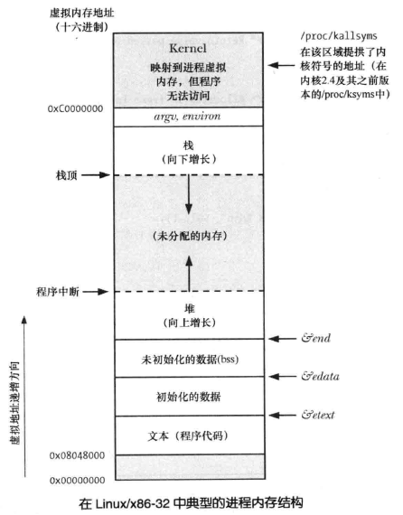
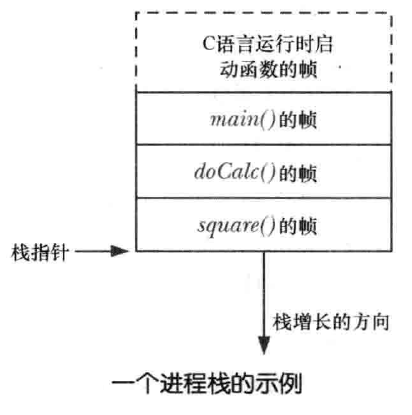
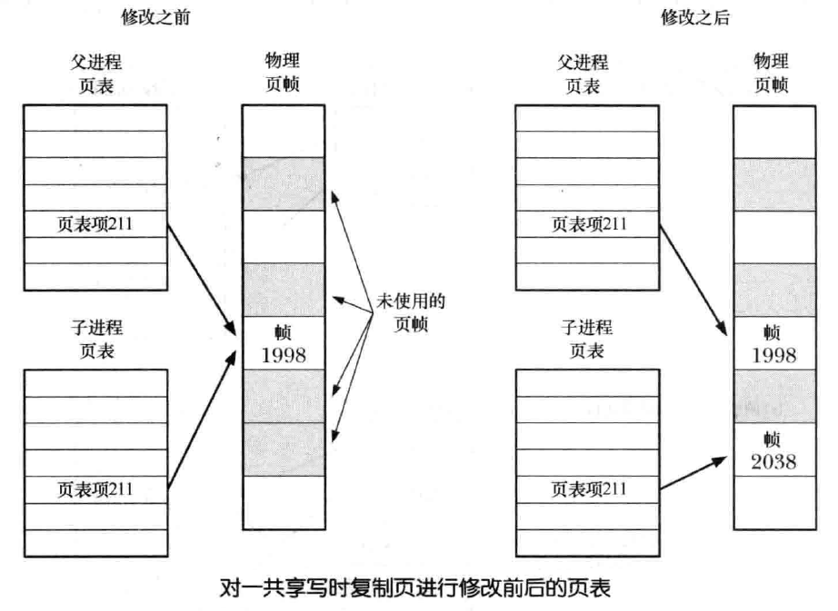
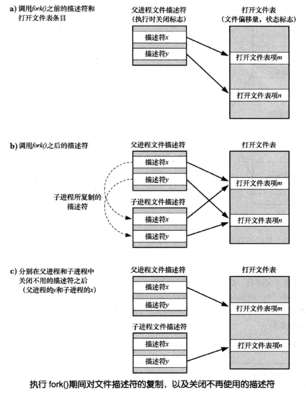
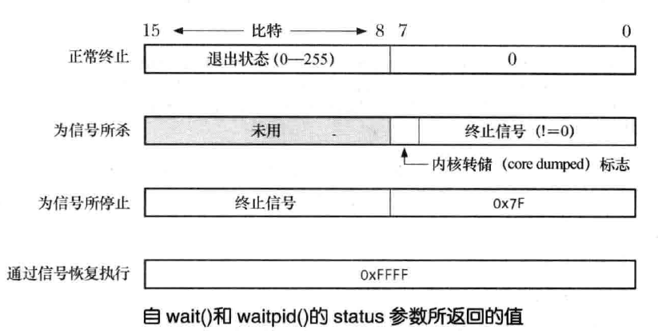
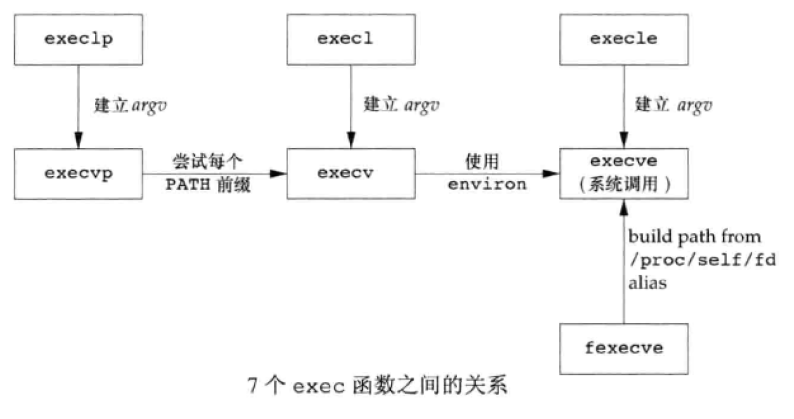

# 进程

<!-- TOC -->

- [一、进程基础知识](#一进程基础知识)
    - [1. 进程模型](#1-进程模型)
        - [1.1 进程和程序](#11-进程和程序)
        - [1.2 进程内存布局和管理](#12-进程内存布局和管理)
        - [1.3 栈和栈帧](#13-栈和栈帧)
        - [1.4 命令行参数和环境列表](#14-命令行参数和环境列表)
    - [2. 进程资源限制](#2-进程资源限制)
    - [3. 进程内存分配](#3-进程内存分配)
    - [4. 进程凭证](#4-进程凭证)
        - [4.1 实际用户 ID 和实际组 ID](#41-实际用户-id-和实际组-id)
        - [4.2 有效用户 ID 和有效组 ID](#42-有效用户-id-和有效组-id)
        - [4.3 保存 set-user-ID 和保存 set-group-ID](#43-保存-set-user-id-和保存-set-group-id)
        - [4.4 辅助组 ID](#44-辅助组-id)
- [二、进程 API](#二进程-api)
    - [1. 进程的创建](#1-进程的创建)
        - [1.1 fork()](#11-fork)
        - [1.2 只读共享和写时复制](#12-只读共享和写时复制)
        - [1.3 父子进程间的文件共享](#13-父子进程间的文件共享)
        - [1.4 fork() 后父子进程执行顺序的竞争条件](#14-fork-后父子进程执行顺序的竞争条件)
        - [1.5 fork() 的其他应用：调用函数而不改变进程的内存需求量](#15-fork-的其他应用调用函数而不改变进程的内存需求量)
    - [2. 进程的终止](#2-进程的终止)
        - [2.1 _exit() 和 exit()](#21-_exit-和-exit)
        - [2.2 退出处理程序](#22-退出处理程序)
        - [2.3 fork()、stdio 缓冲区以及 _exit() 之间的交互](#23-forkstdio-缓冲区以及-_exit-之间的交互)
    - [3. 子进程](#3-子进程)
        - [3.1 等待并回收子进程](#31-等待并回收子进程)
        - [3.2 孤儿进程与僵尸进程](#32-孤儿进程与僵尸进程)
        - [3.3 SIGCHLD 信号](#33-sigchld-信号)
    - [4. 程序的执行](#4-程序的执行)
        - [4.1 execve()](#41-execve)
        - [4.2 exec 库函数](#42-exec-库函数)
        - [4.3 system()](#43-system)
    - [5. 进程组、会话和作业控制](#5-进程组会话和作业控制)
    - [6. 进程优先级和调度](#6-进程优先级和调度)
    - [7. 进程资源](#7-进程资源)
    - [8. 守护进程 DAEMON](#8-守护进程-daemon)
    - [9. 编写安全的特权程序](#9-编写安全的特权程序)
    - [获取和修改进程凭证](#获取和修改进程凭证)
    - [获取和修改进程环境变量](#获取和修改进程环境变量)
    - [执行非局部跳转：setjmp() 和 longjmp()](#执行非局部跳转setjmp-和-longjmp)
- [三、进程间通信](#三进程间通信)
- [其他](#其他)
- [进程相关命令](#进程相关命令)
    - [1. pstree](#1-pstree)
    - [2. size](#2-size)
    - [3.](#3)

<!-- /TOC -->


## 一、进程基础知识

### 1. 进程模型

#### 1.1 进程和程序

进程是一个可执行程序的实例，一个完整的可执行程序包含的内容有：

- 二进制格式标识：用于表明二进制文件的格式
- 机器语言指令：编码的程序算法
- 程序入口地址
- 数据：程序文件中包含的变量初始值和程序使用的字面常量值
- 符号表和重定位表：描述程序中函数和变量的为止及名称，可用于链接和调试过程
- 共享库和动态链接信息：程序文件所包含的一些字段，列出了程序运行时需要使用的共享库，以及加载共享库的动态链接器的路径名
- 其他信息

一个程序可以创建许多进程，从内核角度来看，进程由用户内存空间和一系列内核数据结构组成，其中用户内存空间包含了程序代码及代码所使用的变量，而内核数据结构则用于维护进程状态信息。记录在内核数据结构中的信息包括许多与进程相关的标识号、虚拟内存表、打开文件的描述符表、信号传递及处理的有关信息、进程资源使用及限制、当前工作目录和大量其他信息

#### 1.2 进程内存布局和管理

##### 1.2.3 内存布局

与程序对应的，每个进程所分配的内存由不同的段（segment）组成：

- 文本段：包含了进程运行的程序机器语言指令，文本段一般都具有只读和共享属性
- 初始化数据段，又称用户初始化数据段（user-initialized data segment）：包含显示初始化的全局变量和静态变量
- 未初始化数据段，又称零初始化数据段（zero-initialized data segment）：包含未进行显示初始化的全局变量和静态变量，该段又称为 BSS 段，仅记录这些变量的位置和所需大小，运行时才为它们开辟空间
- 栈（stack）：是一个动态增长和收缩的段，由栈帧（stack frames）组成，系统会为每个当前调用的函数分配一个栈帧，栈帧中存储了函数的局部变量、实参和返回值
- 堆（heap）：是可在运行时为变量动态进行内存分配的一块区域，堆顶端称作 program break

下图是一个典型的进程内存布局图：

<div align="center"></img></div>

以下面代码为例说明各种变量在进程内存的不同段的位置：

```c

```

##### 1.2.4 虚拟内存管理

操作系统通过使用 **虚拟内存** 来对进程内存进行管理

虚拟内存管理技术主要利用了大多数程序的两种访问局部性（locality of reference），由于访问局部性特征，使得程序即便仅有部分地址空间存在于 RAM 中，仍然可能得以执行：

1. 空间局部性（Spatial locality）：指程序倾向于访问在最近访问过的内存地址附近的内存
2. 时间局部性（Temporal locality）：指程序倾向于在不久的将来再次访问最近访问过的内存地址（由于循环）

虚拟内存将每个程序使用的内存切割成小型的、固定大小的 “页”（page）单元，任一时刻，每个程序仅有部分页需要驻留在物理内存页帧中，即驻留集（resident set），程序未使用的页拷贝保存在交换区（swap area）中，仅在需要的时候才会载入到物理内存。若进程欲访问的页面目前并未驻留在物理内存中，将会发生页面错误（page fault），内核即刻挂起进程的执行，同时从磁盘中将该页面载入内存中

同时，内核为每个进程维护了一张页表（page table），该页表描述了每页在进程虚拟地址空间（virtual address space）中的位置，页表中的每个条目要么指出一个虚拟页面在 RAM 中的所在位置，要么表明其当前驻留在磁盘上，若进程试图访问的地址并无页表条目与之对应，那么进程将收到一个 SIGSEGV 信号

进程的有效虚拟地址范围在以下场景中可能会发生变化：

1. 由于栈向下增长超出了之前曾达到的位置
2. 当在堆中分配或释放内存时，通过调用 brk()、sbrk() 或 malloc 函数族来提升 program break 的位置
3. 当调用 shmat() 连接 System V 共享内存区时，或者当调用 shmdt() 脱离共享内存区时
4. 当调用 mmap() 创建内存映射时，或者当调用 munmap() 解除内存映射时


虚拟内存管理使进程的虚拟地址空间与 RAM 物理地址空间隔离开，其优点有：

1. 进程与进程、进程与内核相互隔离，所以一个进程不能读取和修改另一个进程或内核的内存
2. 适当情况下，两个或者更多进程能够共享内存，这是由于内核可以使不同进程的页表条目指向相同的 RAM 页，内存共享的常用场景：
   - 执行同一程序的多个进程，可共享一份程序代码
   - 进程可以使用 shmget() 和 mmap() 系统调用显式地请求与其他进程共享内存区
3. 便于实现内存保护机制：可以对页表条目进行标记，以施加更加细致的内存访问属性
4. 程序员和编译器、链接器之类的工具无需关注程序在 RAM 中的物理布局
5. 由于需要驻留在内存中的仅是程序的一部分，所以程序的加载和运行都很快，而且，一个进程所占用的虚拟内存可以超出 RAM 容量
6. 由于每个进程使用的实际 RAM 减少了，所以计算机 RAM 中同时可以容纳的进程数量也就增多了，这也提高了 CPU 的利用率

#### 1.3 栈和栈帧

从 1.2 进程内存结构图中可以看出，栈驻留在内存的高端并向下增长（朝堆的方向），将栈的增长端称为栈顶，有一个专用寄存器——栈指针，用于跟踪当前栈顶

每次调用函数时，会在栈上新分配一帧，每当函数返回时，再从栈上将此帧移去，就虚拟内存而言，分配栈帧后，栈段的大小将会增长，但在大多数实现中，释放这些栈帧后，栈的大小并未减少（在分配新的栈帧时，会对这些内存重新加以利用）

每个栈帧包括以下信息：

1. 函数实参和局部变量：函数实参和局部变量的作用域仅限当前函数内，它们的空间都是在当前函数栈帧中开辟的，因此 C 语言中又被称为自动变量，当函数返回时，栈帧会被释放，这些自动变量就会被自动销毁
2. 函数调用的链接信息：每个函数都会用到一些 CPU 寄存器，如程序计数器，其指向下一条将要执行的机器语言指令，每当一函数调用另一函数时，会在被调用函数的栈帧中保存这些寄存器的副本，以便函数返回时能为函数调用者将寄存器恢复原状

因为函数能够递归调用，所以某个函数在栈中可能有多个栈帧，下图是一个进程栈的示例：

<div align="center"></img></div>

上面我们说到的其实是 **用户栈**，与此对应的是 **内核栈**，内核栈是每个进程保留在内核内存中的内存区域，在执行系统调用的过程中供内核的内部函数调用使用（由于用户栈驻留在不受保护的用户内存中，所以内核无法利用用户栈来达成这一目的）


#### 1.4 命令行参数和环境列表

##### 1.4.1 命令行参数

C 语言以 `main()` 函数为程序启动点，命令行参数信息通过 `int argc` 和 `char *argv[]` 两个入参传入 `main()` 函数

> `argv[0]` 中包含了调用程序的名称，有个小技巧：可以为同一程序创建多个链接（即名称不同），然后让该程序查看 argv[0]，并根据调用程序的名称来执行不同任务，如程序 gzip、gunzip、zcat 都使用了这个特性，这些命令链接的都是同一可执行文件

除了入参的方式，还可以通过下面两种方式查看进程的命令行参数：

1. linux 系统独有的 `/proc/PID/cmdline` 文件
2. GNU C 语言库提供了两个全局变量：
   1. `program_invocation_name`：提供了用于调用该程序的完整路径名
   2. `program_invocation_short_name`：提供了不含目录的程序名称
   程序中定义 `_GNU_SOURCE` 宏后从 `<errno.h>` 中可获得这两个全局变量的声明

##### 1.4.2 环境列表

每个进程都有与之相关的称为 **环境列表（environment list）** 的字符串数组，其中每个字符串都以 `名称=值（name=value）` 的形式定义 ：

- 一般新进程在创建之时，会继承其父进程的环境副本，这是一种原始的进程间通信的方式：例如 shell 中，通过在自身环境中设置变量值，shell 可将这些值传递给其所创建的进程，并以此来执行用户命令
- 可以通过设置环境变量来改变一些库函数的行为

环境列表的值可以通过以下的方法获取：

1. linux 特有的 `/proc/PID/environ` 文件
2. C 语言程序中，可以使用全局变量 `char **environ` 访问环境列表，environ 和 argv 参数类似，指向一个以 NULL结尾的指针列表，每个指针又指向一个以空字节终止的字符串
3. 环境列表系统调用


如 1.2 进程内存结构图可以看出，argv 和 environ 数组，以及这些参数最初指向的字符串，都驻留在进程栈之上的一个单一、连续的内存区域


### 2. 进程资源限制

### 3. 进程内存分配

### 4. 进程凭证


#### 4.1 实际用户 ID 和实际组 ID

实际用户 ID 和实际组 ID 确定了进程所属的用户和组

登录 shell 从 /etc/passwd 文件中读取相应用户密码记录的第三字段和第四字段，置为其实际用户 ID 和实际组 ID，当创建新进程时，将从其父进程中继承这些 ID

#### 4.2 有效用户 ID 和有效组 ID

当进程尝试执行各种操作时，将结合有效用户 ID、有效组 ID，连同辅助组 ID 一起来确定授予进程的权限，有效用户为 0 的进程拥有超级用户的所有权限，这样的进程被称为特权级进程（privileged process）

通常，有效用户 ID 和组 ID 与其相应的实际 ID 相同，但有两种方法能改变有效用户 ID 和组 ID：
1. 使用系统调用
2. 执行 set-user-ID 和 set-group-ID 程序

与其他文件一样，可执行文件的用户 ID 和组 ID 决定了该文件的所有权，可执行文件还拥有两个特殊的权限位 set-user-ID 和 set-group-ID，可以使用 chmod 命令来设置这些权限位：

```shell
$ chmod u+s a.out   # 设置 set-user-ID 标志
$ chmod g+s a.out   # 设置 set-group-ID 标志
```

当运行 set-user-ID 程序时，内核会将进程的有效用户 ID 置为可执行文件的用户 ID，set-group-ID 程序会将进程的有效组 ID 置为可执行文件的组 ID，这种方式会使进程获得常规情况下并不具有的权限。例如：如果一个可执行文件的属主为 root，且为此程序设置了 set-user-ID 权限位，那么当运行该程序时，进程会取得超级用户权限

Linux 中常见的使用 set-user-ID 的程序包括：passwd、mount、umount、su、wall 等

#### 4.3 保存 set-user-ID 和保存 set-group-ID

设计保存 set-user-ID 和保存 set-group-ID 是为了与 set-user-ID 和 set-group-ID 程序结合使用，当执行程序时，将会依次进行以下处理：

1. 若可执行文件的 set-user-ID（set-group-ID）权限位已开启，则将进程的有效用户（组）ID 置为可执行文件的属主，若未设置 set-user-ID（set-group-ID）权限位，则进程的有效用户（组）ID 将保持不变
2. 无论正在执行的文件是否设置了 set-user-ID 或 set-group-ID 权限位，保存 set-user-ID 和 保存 set-group-ID 的值都由对应的有效 ID 复制而来

许多系统调用，允许将 set-user-ID 程序的有效用户 ID 在实际用户 ID 和保存 set-user-ID 之间切换，这样一来，拥有特权的程序就可以收放自如，自由游走于两个状态之间：具备获取特权的潜力和以特权进行实际操作。因此，程序就可以使用一种更加安全的编程手法：只要 set-user-ID 程序和 set-group-ID 程序没有执行与特权级 ID 相关的任何操作，就应将其置于非特权 ID 的身份之下

#### 4.4 辅助组 ID

辅助组 ID 用于标识进程所属的若干附加的组

## 二、进程 API

### 1. 进程的创建

#### 1.1 fork()

系统调用 `fork()` 用于创建一个新进程

```c
#include <unistd.h>

pid_t fork(void);
```

- fork() 调用之后将存在两个进程，且每个进程都会从 fork() 的返回处继续执行，程序代码可通过 fork() 的返回值来区分父、子进程：
  - 父进程中，fork() 将返回新创建子进程的进程 ID
  - 子进程中，fork() 返回 0，子进程可调用 getpid() 以获取自身的进程 ID，调用 getppid() 以获取父进程 ID

- fork() 调用失败返回 -1，表示当前无法创建子进程，失败的原因可能有：
  1. 进程数量超过了系统针对此真实用户在进程数量上所施加的限制（RLIMIT_NPROC）
  2. 超过了允许该系统创建的最大进程数的限制

- 创建完成的父子进程将执行相同的程序文本段，但却各自拥有不同的栈段、数据段、以及堆栈拷贝。子进程的栈、数据以及栈段开始时是对父进程内存相应各部分的完全复制，执行 fork() 之后，每个进程均可修改各自的栈数据、以及堆段中的变量，而并不影响另一进程

TODO：下面代码展示了 fork() 的用法：

该程序创建一子进程，并对继承自 fork() 的全局及自动变量拷贝进行修改：

```c

```

#### 1.2 只读共享和写时复制

从概念上讲，可以将 fork() 认作对父进程程序段、数据段、堆段以及栈段创建拷贝，但是如此简单的复制会导致性能的浪费：一般 fork() 之后常常伴随着 exec()，这会用新程序替换进程的代码段，并重新初始化其数据段、堆段和栈段，大部分现代 UNIX 实现采用下面两种技术来避免这种浪费：

1. 内核将每一进程的代码段标记为只读，从而使进程无法修改自身代码，这样，父子进程可共享同一代码段，系统调用 fork() 在为子进程创建代码段时，其所构建的一系列进程级页表项均指向与父进程相同的物理内存页帧
2. 对于父进程数据段、堆段和栈段中的各页，内核采用写时复制（copy-on-write）技术来处理

   最初，内核做了一些设置，令这些段的页表项指向与父进程相同的物理内存页，并将这些页面自身标记为只读，调用 fork() 之后，内核会捕获所有父进程或子进程针对这些页面的修改企图，并为将要修改的页面创建拷贝。系统将新的页面拷贝分配给遭内核捕获的进程，还会对子进程的相应页表项做适当调整，从此刻起，父、子进程可以分别修改各自的页拷贝，不再相互影响

下图展示了写时复制技术：

<div align="center"></img></div>

#### 1.3 父子进程间的文件共享

执行 fork() 时，子进程会获得父进程所有文件描述符的副本，这意味着父、子进程中对应的描述符均指向相同的打开文件句柄，打开文件句柄包含有当前文件偏移量以及文件状态标志，一个打开文件的这些属性因之而在父子进程间实现了共享

下图展示了执行 fork() 期间对文件描述符的复制以及关闭不再使用的描述符：

<div align="center"></img></div>


TODO：下面代码展示了在父子进程间共享文件偏移量和打开文件状态标志：

```c

```

- 父子间共享文件偏移量可以确保两者不会覆盖彼此的输出内容
- 如果不需要这种对文件描述符的共享方式，可以注意两点：
  1. 令父、子进程使用不同的文件描述符
  2. 各自立即关闭不再使用的描述符，也可以使用执行时关闭（close-on-exec）标志在进程执行 exec() 之后自动关闭某些文件描述符

#### 1.4 fork() 后父子进程执行顺序的竞争条件

调用 fork() 之后，无法确定父、子进程间谁将率先访问 CPU，如果在程序中或明或暗的依赖于特定的执行序列，那么将可能因竞争条件而导致失败，因此，不应对 fork() 之后执行父、子进程的特定顺序做任何假设，若确需保证某一特定执行顺序，则必须采用某种同步技术

TODO：下面，我们以信号为例对父子进程进行同步：


```c


```

#### 1.5 fork() 的其他应用：调用函数而不改变进程的内存需求量

通过将 fork() 和 wait() 组合使用，在子进程中调用某些函数 func()，可以控制一个进程的内存需求：

1. 若已知 func() 导致内存泄漏，或是引发堆内存的过度碎片化，则该技术可以避免这些问题
2. 假设某一算法在做树状分析的同时需要进行临时内存分配

TODO：下面代码展示了调用函数而不改变进程的内存需求量的做法：

```c

```

### 2. 进程的终止

进程的终止方式有两种：

1. 异常（abnormal）终止：可能由信号接收而引发
2. 正常终止：使用 _exit() 或 exit() 等系统调用主动终止进程

而无论进程是否正常终止，都会发生如下动作：

1. 关闭所有打开文件描述符、目录流、信息目录描述符以及（字符集）转换描述符，与文件描述符相关的进程持有的所有文件锁也将被释放
2. 分离任何已连接的 System V 共享内存段，且对应于各段的 shm_nattch 计数器值将减一
3. 进程为每个 System V 信号量所设置的 semadj 值将会被加到信号量值中
4. 如果该进程是一个管理终端的管理进程，那么系统会向该终端前台进程组中的每个进程发送 SIGHUP 信号，接着终端会与会话脱离
5. 将关闭该进程打开的任何 POSIX 有名信号量，类似于调用 sem_close()
6. 将关闭该进程打开的任何 POSIX 消息队列，类似于调用 mq_close()
7. 进程退出之后，如果某进程组成为孤儿，且该组中存在任何已停止进程，则组中所有进程都将收到 SIGHUP 信号，随之为 SIGCONT 信号
8. 移除该进程通过 mlock() 或 mlockall() 所建立的任何内存锁
9. 取消该进程调用 mmap() 所创建的任何内存映射

#### 2.1 _exit() 和 exit()

_exit() 系统调用用于正常终止进程

```c
#include <unistd.h>

void _exit(int status);
```

- `status` 参数定义了进程的终止状态，父进程可调用 wait() 获取该状态，status 虽然为 int 类型，但是只有低 8 位可为父进程使用，终止状态为 0 表示进程成功终止，非 0 值表示进程因异常而退出
- 调用 _exit() 总会成功终止，即 _exit() 从不返回


程序一般不会直接调用 _exit()，而是调用库函数 exit()，它会在调用 _exit() 前执行各种动作

```c
#include <stdlib.h>

void exit(int status);
```

`exit()` 会执行的动作如下：

1. 调用退出处理程序（通过 atexit() 和 on_exit() 注册的函数），其执行顺序和注册顺序相反
2. 刷新 stdio 流缓冲区
3. 使用由 status 提供的值执行 _exit() 系统调用

进程的另一种终止方式是从 main() 函数结束，执行 return 语句或者执行到 main() 函数结尾，会导致 main() 的调用者执行 exit() 函数

#### 2.2 退出处理程序

有时，应用程序需要在进程终止时自动执行一些清理操作，这是就需要退出处理程序。退出处理程序是一个由程序设计者提供的函数，可于进程生命周期的任意时间点的注册，并在该进程调用 exit() 正常终止时自动执行。如果程序直接调用 _exit() 或因信号而异常终止，则不会调用退出处理程序

有两种方式来注册退出处理程序：atexit() 和 on_exit()

##### 2.2.1 atexit()

函数 `atexit()` 将 func 加到一个函数列表中，进程终止时会调用该函数列表的所有函数

```c
#include <stdlib.h>

int atexit(void (*func)(void));
```

- 参数 `func` 不接受任何参数，也无返回值，其格式如下：
  ```
  void func(void) {
      // Perform some actions
  }
  ```
- atexit() 在出错时返回非 0 值
- 可以注册多个退出处理程序，当应用程序调用 exit() 时，这些函数的执行顺序与注册顺序相反
- 在执行多个退出处理程序时，一旦有任一退出处理程序无法返回（无论是因为调用了 _exit() 还是进程因收到信号而终止），就不会再调用剩余的处理程序了
- 若退出程序自身调用 exit()，Linux 中会照常调用剩余的退出处理程序，不过在其他 UNIX 实现并不一定如此，为保障程序可移植性，应避免在退出处理程序内部调用 exit()
- 通过 fork() 创建的子进程会继承父进程注册的退出处理函数，而进程调用 exec() 时，会移除所有已注册的退出处理程序
- 无法取消经由 atexit() 或 on_exit() 注册的退出处理程序，不过，可以令退出处理程序在执行动作之前检查全局执行标志是否置位，或者清除该标志来屏蔽退出处理程序
- 经由 atexit() 注册的退出处理程序会受到两种限制：
  1. 退出处理程序在执行时无法获知传递给 exit() 的状态
  2. 无法给退出处理程序指定参数


##### 2.2.2 on_exit()

函数 `on_exit()` 完成和 `atexit()` 同样的功能，同时完善了 `atexit()` 的两个限制

```c
#define _BSD_SOURCE
#include <stdlib.h>

int on_exit(void (*func)(int, void *), void *arg);
```

- 参数 `func` 是一个指针，指向如下类型的函数：
  ```
  void func(int status, void *arg) {
      // Perform cleanup actions
  }
  ```
  调用时，会传递两个参数给 func()：提供给 exit() 的 status 参数和注册时供给 on_exit() 的一份 arg 参数拷贝

- `on_exit()` 出错时返回非 0 值
- 使用 atexit() 和 on_exit() 注册的函数位于同一函数列表，如果在程序中同时用到了这两种方式，则会按照使用这两个方法注册的相反顺序来执行相应的退出处理程序

- on_exit() 虽然比 atexit() 灵活，但是可移植性较差，所以在需要保障移植性时，应尽量避免使用 on_exit()

TODO：下面代码展示了如何利用 atexit() 和 on_exit() 注册退出处理程序的例子：

```c

```

#### 2.3 fork()、stdio 缓冲区以及 _exit() 之间的交互

TODO：下面程序展示了 fork() 与 stdio 缓冲区的交互：

```c

```

当程序标准输出定向到终端时，会看到预期的结果：

```shell

```

但是，当重定向标准输出到一个文件时，结果如下：

```shell

```

上面的输出有两处疑问：
1. printf() 的输出行为什么出现了两次？
2. write() 的输出为什么先于 printf()？

- 我们先前说过，stdio 缓冲区是在进程的用户空间内存中维护的，因此，通过 fork() 创建子进程时会复制这些缓冲区，当标准输出定向到终端时，因为缺省为行缓冲，所以会立即显示函数 printf() 输出的包含换行符的字符串。不过，当标准输出重定向到文件时，由于缺省为块缓冲，所以在本例中，当调用 fork() 时，printf() 输出的字符串仍在父进程的 stdio 缓冲区中，并随子进程的创建而产生一份副本。父、子进程调用 exit() 时会刷新各自的 stdio 缓冲区，从而导致重复的输出结果

  而 write() 的输出并未出现两次，这是因为 write() 会将数据直接传给内核缓冲区，fork() 不会复制这一缓冲区

  可以采用下面的两种方法避免重复的输出结果：

  1. 可以在调用 fork() 之前使用函数 fflush() 来刷新 stdio 缓冲区，或者使用 setvbuf() 和 setbuf() 来关闭 stdio 流的缓冲功能
  2. 子进程可以调用 _exit() 而非 exit()，以便不再刷新 stdio 缓冲区

- wirte() 的输出结果先于 printf() 出现，是因为 write() 会将数据立即传给内核高速缓存，而 printf() 的输出则需要等到调用 exit() 刷新 stdio 缓冲区时

### 3. 子进程

#### 3.1 等待并回收子进程

##### 3.1.1 wait()

系统调用 `wait()` 等待调用进程的任一子进程终止，同时在参数 status 所指向的缓冲区中返回该子进程的终止状态

```
#include <sys/wait.h>

pid_t wait(int *status);
```

系统调用 wait() 将执行如下动作：

1. 如果调用过程中没有还子进程终止，wait() 将一直阻塞直到某个子进程终止，如果调用时已有子进程终止，wait() 则立即返回
2. 如果 status 非空，那么关于子进程如何终止的信息会通过 status 指向的整型变量返回
3. 内核将会为父进程下所有子进程的运行总量追加进程 CPU 时间以及资源使用数据
4. 将终止子进程的 ID 作为 wait() 的结果返回

- wait() 出错时返回 -1

  可能的错误原因之一是调用进程并没有已终止还未回收的子进程，此时 errno 会被置为 ECHLD，可使用下面代码中的循环来等待调用进程的所有子进程退出：

  ```
  while ((childPid = wait(NULL) != -1))
      continue;
  if (errno != ECHLD)
  ```

- 返回的参数 `status` 可用来区分以下子进程事件：

  1. 子进程调用 _exit() 或 exit() 而终止，并指定一个整型值作为退出状态
  2. 子进程收到未处理信号而终止
  3. 子进程因信号而停止，并以 WUNTRACED 标志调用 waitpid()
  4. 子进程因收到信号 SIGCONT 而恢复，并以 WCONTINUED 标志调用 waitpid()

  虽然将变量 status 定义为整型，但实际上仅使用了其最低的 2 个字节，对这 2 个字节的填充方式取决于子进程所发生的具体事件，如下图：

  <div align="center"></img></div>

  头文件 `<sys/wait.h>` 中定义了用于解析等待状态值的一组标准宏，对 status 值进行处理时，以下列表中各宏仅有一个会返回真值：

  - `WIFEXITED(status)`：若子进程正常结束则返回真（true），此时宏 `WEXITSTATUS(status)` 返回子进程的退出状态
  - `WIFSIGNALED(status)`：若通过信号杀掉子进程则返回真（true），此时宏 `WTERMSIG(status)` 返回导致子进程终止的信号编号，若子进程产生内核转储文件，则宏 `WCOREDUMP(status)` 返回真值（true）
  - `WIFSTOPPED(status)`：若子进程因信号而停止，则此宏返回为真值（true），此时宏 `WSTOPSIG(status)` 返回导致子进程停止的信号编号
  - `WIFCONTINUED(status)`：若子进程收到 SIGCONT 而恢复执行，则此宏返回真值（true）

  TODO：下面代码中的函数使用上述所有宏来输出 wait() 及相关调用返回的状态值

TODO：下面的代码演示了 wait() 的用法：

```c

```

wait() 系统调用存在诸多限制：

1. 如果父进程已经创建了多个子进程，使用 wait() 将无法等待某个特定子进程的完成，只能按顺序等待下一个子进程的终止
2. 如果没有子进程退出，wait() 总是保持阻塞
3. 使用 wait() 只能发现那些已经终止的子进程，有时父进程需要直到子进程的其他状态更改的信息，如子进程的停止和继续运行

##### 3.1.2 waitpid()

`waitpid()` 系统调用可以突破 wait() 系统调用的诸多限制：

```c
#include <sys/wait.h>

pid_t waitpid(pid_t pid, int *status, int options);
```

- waitpid() 与 wait() 的返回值以及参数 status 的意义相同
- 参数 `pid` 用来表示需要等待的具体子进程：

  - 如果 `pid > 0`，表示等待进程 ID 为 pid 的子进程
  - 如果 `pid == 0`，则等待与调用进程同一个进程组的所有子进程
  - 如果 `pid < -1`，则会等待进程组标识与 pid 绝对值相等的所有子进程
  - 如果 `pid == -1`，则等待任意子进程，`wait(&status)` 的调用与 `waitpid(-1, &status, 0)` 等价

- 参数 `options` 是一个位掩码，可以按位或包含 0 个或多个如下标志：

  - `WUNTRACED`：除了返回终止子进程的信息外，还返回因信号而停止的子进程信息
  - `WCONTINUED`：返回那些因收到 SIGCONT 信号而恢复执行的已停止子进程的状态信息
  - `WNOHANG`：如果参数 pid 所指定的子进程并未发生状态改变，则立即返回，而不会阻塞，此时 waitpid() 返回 0，如果调用进程并无 pid 匹配的子进程，则 waitpid() 出错返回并设置 errno 为 ECHILD

TODO：下面代码演示了 waitpid() 的用法：

```c

```

##### 3.1.3 waitid()

与 waitpid() 类似，waitid() 返回子进程的状态，不过 waitid() 提供了 waitpid() 所没有得拓展功能

```c
#include <sys/wait.h>

int waitid(idtype_t idtype, id_t id, siginfo_t *infop, int options);
```

- 参数 `idtype` 和 `id` 指定需要等待哪些子进程：

  - 如果 idtype 为 P_ALL，则等待任何子进程，同时忽略 id 值
  - 如果 idtype 为 P_PID，则等待进程 ID 为 id 进程的子进程
  - 如果 idtype 为 P_PGID，则等待进程组 ID 为 id 各进程得所有子进程

- 参数 `options` 可指定下面一个或多个标识（按位或运算）来实现子进程事件的控制：

  - `WEXITED`：等待已终止的子进程，而无论其是否正常返回
  - `WSTOPPED`：等待已通过信号而停止的子进程
  - `WCONTINUED`：等待经由信号 SIGCONT 而恢复的子进程
  - `WNOHANG`：与其在 waitpid() 中的意义相同，如果匹配 id 值的子进程中并无状态信息需要返回，则立即返回，此时 waitid() 返回 0，如果调用进程并无子进程与 id 的值相匹配，则 waitid 调用失败，且错误号为 ECHILD
  - `WNOWAIT`：指定该标志后，waitid() 仅仅返回子进程状态，并不处理状态事件，子进程仍然处于可等待状态，稍后可再次等待并获取相同信息
  
- waitid() 执行成功返回 0，且会更新指针 infop 所指向的 siginfo_t 结构，用以返回子进程的相关信息

- 参数 `infop` 中各字段的意义：

  - `si_code`：该字段可取值如下：
    - `CLD_EXITED`：表示子进程已通过调用 _exit() 终止
    - `CLD_KILLED`：表示子进程为某个信号所杀
    - `CLD_STOPPED`：表示子进程因某个信号而停止
    - `CLD_CONTINUED`：表示已停止的子进程因接收到 SIGCONT 信号而恢复执行
  - `si_pid`：该字段包含状态发生变化子进程的进程 ID
  - `si_signo`：该字段总是置为 SIGCHLD
  - `si_status`：该字段要么包含传递给 _exit() 的子进程退出状态，要么包含导致子进程停止、继续或终止的信号值，可以通过读取 si_code 值来判定具体包含的是哪一种类型的信息
  - `si_uid`：该字段包含子进程的真正用户 ID

#### 3.2 孤儿进程与僵尸进程

一般来说，父进程与子进程的生命周期都不相同，由此，引出 **孤儿进程** 和 **僵尸进程** 的概念

##### 3.2.1 孤儿进程

当父进程先于子进程终止时，子进程就将成为 **孤儿进程**，之后，进程 ID 为 1 的 init 进程会接管孤儿进程，成为它新的父进程

因此可以通过对某子进程的 getppid() 调用返回是否为 1 判断其父进程是否已经终止（前提是该子进程并非由 init 进程创建的）

##### 3.2.2 僵尸进程

前面说到，子进程终止后，系统允许其父进程在之后的某一时刻去执行 wait()，以确定该子进程是如何终止的，内核通过将子进程转为 **僵尸进程（zombie）** 处理这种情况，这意味着内核将释放子进程所把持的大部分资源，以便供其他进程重新使用。该进程所唯一保留的是内核进程表中的一条记录，其中包含了子进程 ID、终止状态、资源使用数据等信息

僵尸进程无法通过信号杀死，即使是必杀信号 SIGKILL，当父进程执行 wait() 后，由于不再需要子进程所剩余的最后信息，因此内核将删除僵尸进程。如果父进程未执行 wait() 随即退出，那么 init 进程将接管子进程并自动调用 wait()，从而从系统中移除僵尸进程

如果父进程创建了某一子进程，但并未执行 wait()，那么在内核的进程表中将为该子进程永久保留一条记录，如果存在大量此类僵尸进程，它们势必将填满内核进程表，从而阻碍新进程的创建，而由于无法用信号杀死僵尸进程，所以从系统中将其移除的唯一方法就是杀掉它们的父进程（或等待其父进程终止），此时 init 进程将接管和等待这些僵尸进程，从而从系统中将它们清理掉

因此在设计长生命周期的父进程时，要记住适时的调用 wait() 回收僵尸进程，避免它们成为长寿僵尸，这一问题的最佳解决方案是 SIGCHLD 信号


TODO：下面代码展示了一个僵尸进程的创建，以及发送 SIGKILL 信号无法杀死僵尸进程的例子：

```c

```

#### 3.3 SIGCHLD 信号

子进程的终止属于异步事件，因此父进程无法预知其子进程如何终止，前文说到，父进程要及时调用 wait() 防止系统中僵尸进程的累积，有两种方法：

1. 父进程调用不带 WNOHANG 标志的 wait() 或 waitpid()，此时如果尚无已经终止的子进程，那么调用将会阻塞
2. 父进程周期性地调用带有 WNOHANG 标志的 waitpid()，执行针对已终止子进程的非阻塞式检查，即轮循

这两种方法的效率都不高，并且会一定程度的浪费 CPU 资源，而使用 SIGCHLD 信号将会很好的规避这些问题

##### 3.3.1 为 SIGCHLD 建立信号处理程序

无论一个子进程何时终止，系统都会向其父进程发送 SIGCHLD 信号，进程对该信号的默认处置方式是忽略，可以为其设置处理函数，在处理函数中使用 wait() 来回收僵尸进程

在为 SIGCHLD 信号建立处理程序时，要注意以下问题：

1. 我们知道，当调用信号处理程序时，会暂时将引发调用的信号阻塞起来（除非为 sigaction() 指定了 SA_NODEFER 标志），且 SIGCHLD 为标准信号，不会对其进行排队处理。

   这种情况下，当 SIGCHLD 信号处理程序正在为一个终止的子进程运行时，如果相继有两个子进程终止，即使产生了两次 SIGCHLD 信号，父进程也只能捕获到一个，此时如果父进程的 SIGCHLD 信号处理程序每次只调用一次 wait()，那么一些僵尸进程可能会成为“漏网之鱼”

   解决方案是：在 SIGCHLD 处理程序内部循环以 WNOHANG 标志来调用 waitpid()，直至再无其他终止的子进程需要处理为止。一个最简单的处理程序如下：

   ```c
   while (waitpid(-1, NULL, WNOHANG) > 0)
       continue;
   ```

2. 为保障移植性和可靠性，应用应在创建任何子进程之前就设置好 SIGCHLD 处理程序。这是为了防止在为 SIGCHLD 创建处理程序时，就已经有子进程终止的情况发生

3. 可重入问题。信号处理程序中调用 wait() 或 waitpid() 等系统调用可能会改变全局变量 errno 的值，因此，在编写 SIGCHLD 信号处理程序时，需要在进入处理程序时备份 errno 值，在返回前恢复

4. 事实上，当信号导致子进程停止或恢复执行时，父进程也有可能收到 SIGCHLD 信号。可以在调用 sigaction() 设置 SIGCHLD 信号处理程序时，传入 SA_NOCLDSTOP 标志来控制这一行为：
   - 若设置该标志，子进程的停止或恢复就不会发出 SIGCHLD 信号
   - 若未设置该标志，系统会在子进程因信号停止或恢复时向父进程发出 SIGCHLD 信号

TODO：下面代码展示了一个 SIGCHLD 信号处理程序的例子：

```c

```

##### 3.3.2 忽略终止的子进程

另一种处理终止子进程的办法是：将对 SIGCHLD 的处理显示设置为 SIG_IGN，这样系统会将之后终止的子进程立即删除，不用转为僵尸进程。此时终止子进程的退出状态无法通过 wait() 等系统调用得到
> 虽然对信号 SIGCHLD 的默认处理就是忽略，但显式设置为 SIG_IGN 还是会导致此处的行为差异

在 Linux 系统中，对 SIGCHLD 信号的处置置为 SIG_IGN 并不会影响任何既有僵尸进程的状态，对它们的等待仍然要照常进行，但是在其他一些 UNIX 实现中，将对 SIGCHLD 的处置设置为 SIG_IGN 却会删除所有已有的僵尸进程

### 4. 程序的执行

#### 4.1 execve()

系统调用 `execve()` 用于将新程序加载到某一进程的内存空间，旧进程的代码段、数据段、栈和堆段都会被新程序的相应部分替换

```c
#include <unistd.h>

int execve(const char *pathname, char *const argv[], char *const envp[]);
```

- 参数 `pathname` 包含了准备载入当前进程空间的新程序的路径名，既可以是绝对路径，也可以是相对路径（相对于调用进程当前工作目录）
- 参数 `argv` 指定了传递给新进程的命令行参数，该数组对应于 main() 函数的第 2 个参数 argv
- 参数 `envp` 指定了新程序的环境列表，其对应于新程序的 environ 数组：也是由字符串指针组成的列表，以 NULL 结束，所指向的字符串格式为 name = value

- 由于 `execve()` 将调用程序取而代之，因此对 execve() 的成功调用将永不返回。一旦函数返回，就表明发生了错误，所以函数的返回值总是等于 -1，errno 可为下列值：

  - `EACCES`：文件权限错误，有以下几种情况：
    1. pathanme 没有指向一个常规文件，未对该文件赋予可执行权限
    2. pathname 中某一级目录不可搜索（关闭了该目录的可执行权限）
    3. 以 MS_NOEXEC 标志挂载了文件所在的文件系统
  - `ENOENT`：pathname 指定的文件不存在
  - `ENOEXEC`：系统无法识别 pathname 指定的文件格式，例如：没有包含用于指定脚本解释器（以字符 #! 开头）的起始行，就可能导致这一错误
  - `ETXTBSY`：存在一个或多个进程已经以写入方式打开 pathname 所指代的文件
  - `E2BIG`：参数列表和环境列表所需空间总和超出了允许的最大值

使用 exec() 系列函数时要注意以下几点：

- 调用 execve() 之后，进程 ID 保持不变，还有其他少量的进程属性也未发生变化
- 如果 pathname 指定的程序文件设置了 set-user-ID（set-group-ID），那么系统调用会在执行此文件时将进程的有效用户（组）ID 设置为程序文件的属主（组）ID。同时无论是否更改了有效用户 ID，execve() 都会以进程的有效用户 ID 去覆盖已保存的 （saved）set-user-ID，以进程的有效组 ID 去覆盖已保存的（saved）set-group-ID
- execve() 可执行解释器脚本文件

  该脚本文件必须满足两点要求：

  1. 具有可执行权限
  2. 文件的起始行必须指定运行脚本解释器的路径名，格式如下：

     ```shell
     #!interpreter-path [optional-arg]
     ```  
     - 字符 `#!` 必须置于该行起始处，这两个字符串与解释器路径名之间可以以空格分隔
     - 该解释器路径一般采用绝对路径，当采用相对路径名时，相对起始路径为启动解释器进程的当前工作目录
     - 解释器路径和可选参数以空格分隔，可选参数中不应包含空格
     
     例如：

     ```shell
     #!/usr/bin/awk -f
     ```

  execve() 如果检测到传入的文件以两字节序列 "#!" 开始，就会提取该行的剩余部分（路径名和参数），然后按照以下参数列表来执行解释器程序：

  ```shell
  interpreter-path [optional-arg] script-path arg...
  ```

  - `interpreter-path` 和 `optional-arg` 都取自脚本的 #! 行
  - `script-path` 时传递给 execve() 的路径名
  - `arg...` 是通过变量 arg 传递给 execve() 的参数列表（不包括 argv[0]）

- 默认情况下，由 exec() 的调用程序所打开的所有文件描述符在 exec() 的执行过程中会保持打开状态，且在新程序中仍然有效，shell 利用这一特性为其所执行的程序处理 I/O 重定向

  有时在执行 exec() 之前，程序需要确保关闭某些特定的文件描述符，例如为安全编程考虑，特权进程在加载一个未知程序时，应确保关闭那些不必要的文件

  我们可以尝试使用 close() 来关闭这些文件，但是有很大的局限性：

  1. 某些描述符是由库函数打开的，但库函数无法使主程序在执行 exec() 之前关闭相应的文件描述符，因此库函数应总是为其打开的文件设置执行时关闭（close-on-exec）标志
  2. 如果 exec() 因某种原因而调用失败，可能还需要使描述符保持打开状态。如果这些描述符已经关闭，将它们重新打开并指向相同文件的难度很大

  因此，内核为每个文件描述符提供了执行时关闭标志，如果设置了该标志，那么在成功执行 exec() 时，会自动关闭该文件描述符，如果调用 exec() 失败，文件描述符则会保持打开状态
  > 注意：当使用 dup()、dup2()、fcntl() 为一文件描述符创建副本时，总是会清除副本描述符的执行时关闭状态

  TODO：下面代码是为一文件描述符设置执行时关闭标志的例子：

  ```c

  ```

- exec() 在执行时会将现有进程的文本段丢弃，该文本段可能包含了由调用进程创建的信号处理器程序，既然处理器已经不知所踪，内核就会对所有已设信号的处置重置为 SIG_DFL，而对所有其他信号（即将处置置为 SIG_IGN  或 SIG_DFL 的信号）的处置保持不变

  而被显式忽略的 SIGCHLD 信号属于特例，Linux 下调用 exec() 之后，遭忽略的 SIGCHLD 信号继续保持忽略状态，但是其他 UNIX 实现可能会将其重置为 SIG_DFL。因此，为了保证程序的可移植性，就应该在调用 exec() 之前执行 signal(SIGCHLD, SIG_DFL)，并且，程序也不应当假设对 SIGCHLD 处置的初始设置为 SIG_DFL 之外的其他值

  在调用 exec() 期间，进程信号掩码以及挂起信号的设置均得以保存


TODO：下面代码展示了 execve() 的用法：

```c

```

#### 4.2 exec 库函数

下面这些函数均构建与 `execve()` 调用之上，只是在为新程序指定程序名、参数列表以及环境变量的方式上有所不同

```c
#include <unistd.h>

int execle(const char *pathname, const char *arg, ... /*, (char *)NULL, char *const envp[]*/);
int execlp(const char *filename, const char *arg, ... /*, (char *)NULL*/);
int execvp(const char *filename, char *const argv[]);
int execv(const char *pathname, char *const argv[]);
int execl(const char *pathname, const char *arg, ... /*, (char *)NULL*/);
```

上面函数的函数名均以 exec 开头，后面的字母用于区分各函数的功能：

- `execlp()` 和 `execvp` 允许只提供程序的文件名，系统会在由环境变量 PATH 所指定的目录列表中寻找相应的执行文件，其他 exec() 函数则要求提供新程序的完整路径

  如果没有定义变量 PATH，那么 `execlp()` 和 `execvp()` 会采用默认的路径列表：`,:/usr/bin:/bin`

  通常脚本缺少 `#!` 起始行将导致 exec() 函数调用失败，但是 `execlp()` 和 `execvp()` 行事方式有所不同，这两个函数会先在 PATH 中找到该脚本文件，若其具有可执行权限，但又并非二进制格式，且起始行也不以 `#!` 开始，那么就会用 shell 来解释这一文件，Linux 中，会将这类文件视同于包含 `#!/bin/sh` 起始行的文件来进行处理

  应该注意避免在设置了 set-user-ID 和 set-group-ID 的程序中调用 execlp 和 execvp，在实际使用中，应该特别谨慎的控制 PATH 环境变量，以防运行恶意程序，这意味着应该总是使用已知安全的目录列表来覆盖之前定义的任何 PATH 值

  TODO：下面代码是一个使用 execlp() 的例子：

  ```c

  ```
  
- `execle()`、`execlp()`、`execl()` 要求开发者在调用中以字符串列表形式指定参数，而不使用数组描述 argv 列表，注意：argv[0] 通常对应新程序名，且必须以 NULL 指针来终止参数列表，以便于各调用定位列表的尾部

  TODO：将程序参数指定为列表较之将参数装配于一个 argv 向量中，在使用上更简便一些，下面是使用 execle() 的一个例子：

  ```c

  ```

- `execve()` 和 `execle` 允许开发者通过 envp为新程序显式指定环境变量，其中 envp 是一个以 NULL 结束的字符串指针数组，而其他函数运行的新程序的环境则继承自调用进程

  TODO：下面代码展示了如何运用函数 execl() 使新程序继承调用者的环境：

  ```c

  ```

函数 `fexecve()` 以文件描述符的形式指定要打开的新程序：

```c
#define _GNU_SOURCE
#include <unistd.h>

int fexecve(int fd, char *const argv[], char *const evnp[]);
```

有时候，在打开程序文件前，需要先验证文件内容是否正确，这时候就可以使用 `fexecve()`。当然，我们也可以先调用 open() 打开文件，读取并验证其内容，然后运行，但是这种方式在打开与执行文件之间，存在将该文件替换的可能性，最终可能会造成验证者并非执行的情况

<div align="center"></div>

#### 4.3 system()

可以通过 `system()` 函数来执行任意的 shell 命令

```c
#include <stdlib.h>

int system(const char *command);
```

- 函数 `system()` 创建一个子进程来运行 shell，并以之执行命令 command

- 使用 `system()` 主要考虑到其简便性：

  - 无需处理对 fork()、exec()、wait()、exit() 的调用细节
  - system() 会代为处理错误和信号
  - 在应用程序中，使用 system() 函数来实现类似 “执行一条 shell 命令” 的需求非常容易

  但是，system() 的简便性是以低效率为代价的，使用 system() 运行命令至少需要两个以上的进程，一个用于运行 shell，另外一个或多个用于 shell 所执行的命令，如果应用程序对效率或速度有要求，则更应该使用 fork() 和 exec() 来执行命令

- system() 返回值如下：

  - 当 command 为 NULL 指针时，如果 shell 可用则 system() 返回非 0 值，若不可用则返回 0
  - 如果无法创建子进程或是无法获取其终止状态，那么 system() 返回 -1
  - 若子进程不能执行 shell，则 system() 的返回值会与子 shell 调用 _exit(127) 终止时一样
  - 如果所有的系统调用都成功，system() 会返回执行 command 的子 shell 的终止状态，shell 的终止状态是其执行最后一条命令时的退出状态，如果命令为信号所杀，大多数 shell 会以值 128+n 退出，其中 n 为信号编号

- 在设置了用户 ID 和组 ID 的程序在特权模式下运行时，绝不能调用 system()，这可能会带来安全隐患

TODO：下面代码展示了 systme() 的用法：


```c

```

TODO：下面我们用 fork()、exec()、wait() 和 exit() 来实现 system()，实现之前，我们需要注意以下几点：

- 


TODO：下面代码是 system() 的实现：

```c

```

### 5. 进程组、会话和作业控制

### 6. 进程优先级和调度

### 7. 进程资源

### 8. 守护进程 DAEMON

### 9. 编写安全的特权程序


### 获取和修改进程凭证

### 获取和修改进程环境变量
### 执行非局部跳转：setjmp() 和 longjmp()

## 三、进程间通信

## 其他


## 进程相关命令

### 1. pstree

### 2. size

size 命令可显示二进制可执行文件的文本段，初始化数据段、非初始化数据段（bss）的段大小

### 3. 

进程内存模型
进程凭证
进程资源限制
进程信息
进程创建、终止、执行
子进程
进程间关系
进程调度
守护进程
特权进程
进程间通信
进程相关命令

进程栈
fork() exec() 过程进程映像的变化