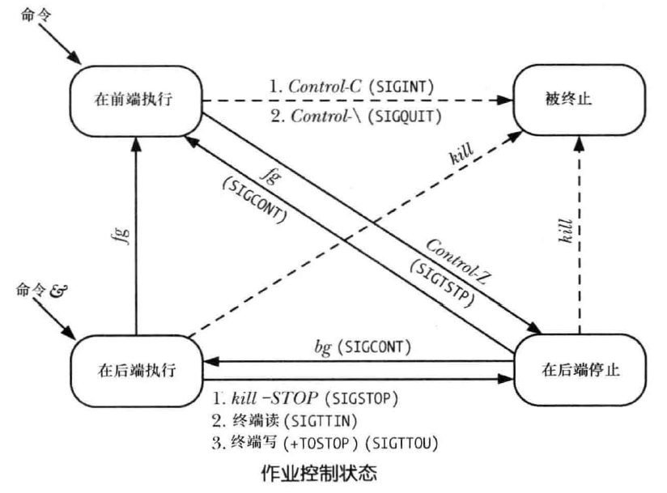
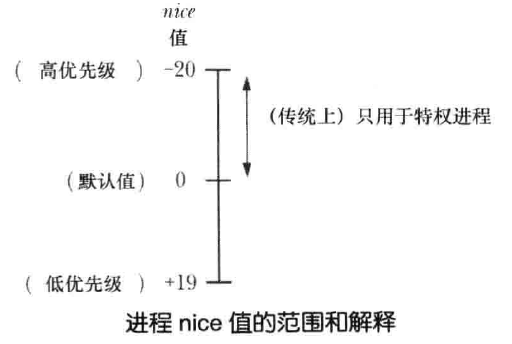
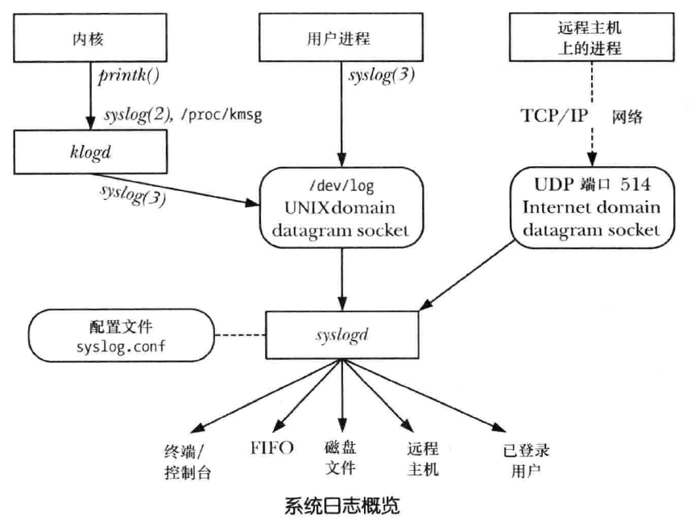

# 进程

<!-- TOC -->

- [一、进程基础知识](#一进程基础知识)
    - [1. 进程模型](#1-进程模型)
        - [1.1 进程和程序](#11-进程和程序)
        - [1.2 进程内存布局和管理](#12-进程内存布局和管理)
        - [1.3 栈和栈帧](#13-栈和栈帧)
        - [1.4 命令行参数和环境列表](#14-命令行参数和环境列表)
    - [3. 进程内存分配](#3-进程内存分配)
- [二、进程 api](#二进程-api)
    - [1. 进程凭证](#1-进程凭证)
        - [1.1 实际用户 id 和实际组 id](#11-实际用户-id-和实际组-id)
        - [1.2 有效用户 id 和有效组 id](#12-有效用户-id-和有效组-id)
        - [1.3 保存 set-user-id 和保存 set-group-id](#13-保存-set-user-id-和保存-set-group-id)
        - [1.4 辅助组 id](#14-辅助组-id)
        - [1.5 获取实际和有效 ID getuid、getgid、geteuid、getegid](#15-获取实际和有效-id-getuidgetgidgeteuidgetegid)
        - [1.6 修改有效 ID setuid、setgid](#16-修改有效-id-setuidsetgid)
        - [1.7 修改有效 ID seteuid、setegid](#17-修改有效-id-seteuidsetegid)
        - [1.8 修改实际 ID 和有效 ID setreuid、setregid](#18-修改实际-id-和有效-id-setreuidsetregid)
        - [1.9 获取实际、有效和保存设置 ID getresuid、getresgid](#19-获取实际有效和保存设置-id-getresuidgetresgid)
        - [1.10 修改实际、有效和保存设置 ID setresuid、setresgid](#110-修改实际有效和保存设置-id-setresuidsetresgid)
        - [1.11 获取和修改辅助组 ID](#111-获取和修改辅助组-id)
    - [1. 进程的创建](#1-进程的创建)
        - [1.1 fork()](#11-fork)
        - [1.2 只读共享和写时复制](#12-只读共享和写时复制)
        - [1.3 父子进程间的文件共享](#13-父子进程间的文件共享)
        - [1.4 fork() 后父子进程执行顺序的竞争条件](#14-fork-后父子进程执行顺序的竞争条件)
        - [1.5 fork() 的其他应用：调用函数而不改变进程的内存需求量](#15-fork-的其他应用调用函数而不改变进程的内存需求量)
    - [2. 进程的终止](#2-进程的终止)
        - [2.1 _exit() 和 exit()](#21-_exit-和-exit)
        - [2.2 退出处理程序](#22-退出处理程序)
        - [2.3 fork()、stdio 缓冲区以及 _exit() 之间的交互](#23-forkstdio-缓冲区以及-_exit-之间的交互)
    - [3. 子进程](#3-子进程)
        - [3.1 等待并回收子进程](#31-等待并回收子进程)
        - [3.2 孤儿进程与僵尸进程](#32-孤儿进程与僵尸进程)
        - [3.3 sigchld 信号](#33-sigchld-信号)
    - [4. 程序的执行](#4-程序的执行)
        - [4.1 execve()](#41-execve)
        - [4.2 exec 库函数](#42-exec-库函数)
        - [4.3 system()](#43-system)
    - [5. 进程组、会话和作业控制](#5-进程组会话和作业控制)
        - [5.1 进程组](#51-进程组)
        - [5.2 会话](#52-会话)
        - [5.3 作业控制](#53-作业控制)
    - [6. 进程优先级和调度](#6-进程优先级和调度)
        - [6.1 进程优先级（nice 值）](#61-进程优先级nice-值)
        - [6.2 获取和设置优先级（nice 值）](#62-获取和设置优先级nice-值)
        - [6.3 实时进程调度](#63-实时进程调度)
        - [6.4 实时进程调用 api](#64-实时进程调用-api)
        - [6.5 cpu 亲和力](#65-cpu-亲和力)
    - [7. 进程资源](#7-进程资源)
        - [7.1 查看系统资源使用情况](#71-查看系统资源使用情况)
        - [7.2 获取和修改进程资源限制](#72-获取和修改进程资源限制)
    - [8. 守护进程 daemon](#8-守护进程-daemon)
        - [8.1 daemon 的特点](#81-daemon-的特点)
        - [8.2 编写 daemon](#82-编写-daemon)
        - [8.3 利用 SIGHUP 重新初始化 daemon](#83-利用-sighup-重新初始化-daemon)
        - [8.4 利用 syslog 记录消息和错误](#84-利用-syslog-记录消息和错误)
    - [9. 编写安全的特权程序](#9-编写安全的特权程序)
        - [9.1 是否需要一个 set-user-ID 或 set-group-ID 程序](#91-是否需要一个-set-user-id-或-set-group-id-程序)
        - [9.2 以最小权限操作](#92-以最小权限操作)
        - [9.3 小心执行程序](#93-小心执行程序)
        - [9.4 避免暴露敏感信息](#94-避免暴露敏感信息)
        - [9.5 确定进程的边界](#95-确定进程的边界)
        - [9.6 小心信号和竞争条件](#96-小心信号和竞争条件)
        - [9.7 执行文件操作和文件 I/O 的缺陷](#97-执行文件操作和文件-io-的缺陷)
        - [9.8 不要完全相信输入和环境](#98-不要完全相信输入和环境)
        - [9.9 小心缓冲区溢出](#99-小心缓冲区溢出)
        - [9.10 小心拒绝服务攻击](#910-小心拒绝服务攻击)
        - [9.11 检查返回状态和安全地处理失败情况](#911-检查返回状态和安全地处理失败情况)
    - [获取和修改进程环境变量](#获取和修改进程环境变量)
    - [执行非局部跳转：setjmp() 和 longjmp()](#执行非局部跳转setjmp-和-longjmp)
- [其他](#其他)
- [进程相关命令](#进程相关命令)
    - [1. pstree](#1-pstree)
    - [2. size](#2-size)
    - [3. nice、renice](#3-nicerenice)
    - [4. ulimit](#4-ulimit)

<!-- /TOC -->


## 一、进程基础知识

### 1. 进程模型

#### 1.1 进程和程序

进程是一个可执行程序的实例，一个完整的可执行程序包含的内容有：

- 二进制格式标识：用于表明二进制文件的格式
- 机器语言指令：编码的程序算法
- 程序入口地址
- 数据：程序文件中包含的变量初始值和程序使用的字面常量值
- 符号表和重定位表：描述程序中函数和变量的为止及名称，可用于链接和调试过程
- 共享库和动态链接信息：程序文件所包含的一些字段，列出了程序运行时需要使用的共享库，以及加载共享库的动态链接器的路径名
- 其他信息

一个程序可以创建许多进程，从内核角度来看，进程由用户内存空间和一系列内核数据结构组成，其中用户内存空间包含了程序代码及代码所使用的变量，而内核数据结构则用于维护进程状态信息。记录在内核数据结构中的信息包括许多与进程相关的标识号、虚拟内存表、打开文件的描述符表、信号传递及处理的有关信息、进程资源使用及限制、当前工作目录和大量其他信息

#### 1.2 进程内存布局和管理

##### 1.2.3 内存布局

与程序对应的，每个进程所分配的内存由不同的段（segment）组成：

- 文本段：包含了进程运行的程序机器语言指令，文本段一般都具有只读和共享属性
- 初始化数据段，又称用户初始化数据段（user-initialized data segment）：包含显示初始化的全局变量和静态变量
- 未初始化数据段，又称零初始化数据段（zero-initialized data segment）：包含未进行显示初始化的全局变量和静态变量，该段又称为 bss 段，仅记录这些变量的位置和所需大小，运行时才为它们开辟空间
- 栈（stack）：是一个动态增长和收缩的段，由栈帧（stack frames）组成，系统会为每个当前调用的函数分配一个栈帧，栈帧中存储了函数的局部变量、实参和返回值
- 堆（heap）：是可在运行时为变量动态进行内存分配的一块区域，堆顶端称作 program break

下图是一个典型的进程内存布局图：

<div align="center"></img></div>

以下面代码为例说明各种变量在进程内存的不同段的位置：

```c

```

##### 1.2.4 虚拟内存管理

操作系统通过使用 **虚拟内存** 来对进程内存进行管理

虚拟内存管理技术主要利用了大多数程序的两种访问局部性（locality of reference），由于访问局部性特征，使得程序即便仅有部分地址空间存在于 ram 中，仍然可能得以执行：

1. 空间局部性（spatial locality）：指程序倾向于访问在最近访问过的内存地址附近的内存
2. 时间局部性（temporal locality）：指程序倾向于在不久的将来再次访问最近访问过的内存地址（由于循环）

虚拟内存将每个程序使用的内存切割成小型的、固定大小的 “页”（page）单元，任一时刻，每个程序仅有部分页需要驻留在物理内存页帧中，即驻留集（resident set），程序未使用的页拷贝保存在交换区（swap area）中，仅在需要的时候才会载入到物理内存。若进程欲访问的页面目前并未驻留在物理内存中，将会发生页面错误（page fault），内核即刻挂起进程的执行，同时从磁盘中将该页面载入内存中

同时，内核为每个进程维护了一张页表（page table），该页表描述了每页在进程虚拟地址空间（virtual address space）中的位置，页表中的每个条目要么指出一个虚拟页面在 ram 中的所在位置，要么表明其当前驻留在磁盘上，若进程试图访问的地址并无页表条目与之对应，那么进程将收到一个 sigsegv 信号

进程的有效虚拟地址范围在以下场景中可能会发生变化：

1. 由于栈向下增长超出了之前曾达到的位置
2. 当在堆中分配或释放内存时，通过调用 brk()、sbrk() 或 malloc 函数族来提升 program break 的位置
3. 当调用 shmat() 连接 system v 共享内存区时，或者当调用 shmdt() 脱离共享内存区时
4. 当调用 mmap() 创建内存映射时，或者当调用 munmap() 解除内存映射时


虚拟内存管理使进程的虚拟地址空间与 ram 物理地址空间隔离开，其优点有：

1. 进程与进程、进程与内核相互隔离，所以一个进程不能读取和修改另一个进程或内核的内存
2. 适当情况下，两个或者更多进程能够共享内存，这是由于内核可以使不同进程的页表条目指向相同的 ram 页，内存共享的常用场景：
   - 执行同一程序的多个进程，可共享一份程序代码
   - 进程可以使用 shmget() 和 mmap() 系统调用显式地请求与其他进程共享内存区
3. 便于实现内存保护机制：可以对页表条目进行标记，以施加更加细致的内存访问属性
4. 程序员和编译器、链接器之类的工具无需关注程序在 ram 中的物理布局
5. 由于需要驻留在内存中的仅是程序的一部分，所以程序的加载和运行都很快，而且，一个进程所占用的虚拟内存可以超出 ram 容量
6. 由于每个进程使用的实际 ram 减少了，所以计算机 ram 中同时可以容纳的进程数量也就增多了，这也提高了 cpu 的利用率

#### 1.3 栈和栈帧

从 1.2 进程内存结构图中可以看出，栈驻留在内存的高端并向下增长（朝堆的方向），将栈的增长端称为栈顶，有一个专用寄存器——栈指针，用于跟踪当前栈顶

每次调用函数时，会在栈上新分配一帧，每当函数返回时，再从栈上将此帧移去，就虚拟内存而言，分配栈帧后，栈段的大小将会增长，但在大多数实现中，释放这些栈帧后，栈的大小并未减少（在分配新的栈帧时，会对这些内存重新加以利用）

每个栈帧包括以下信息：

1. 函数实参和局部变量：函数实参和局部变量的作用域仅限当前函数内，它们的空间都是在当前函数栈帧中开辟的，因此 c 语言中又被称为自动变量，当函数返回时，栈帧会被释放，这些自动变量就会被自动销毁
2. 函数调用的链接信息：每个函数都会用到一些 cpu 寄存器，如程序计数器，其指向下一条将要执行的机器语言指令，每当一函数调用另一函数时，会在被调用函数的栈帧中保存这些寄存器的副本，以便函数返回时能为函数调用者将寄存器恢复原状

因为函数能够递归调用，所以某个函数在栈中可能有多个栈帧，下图是一个进程栈的示例：

<div align="center"></img></div>

上面我们说到的其实是 **用户栈**，与此对应的是 **内核栈**，内核栈是每个进程保留在内核内存中的内存区域，在执行系统调用的过程中供内核的内部函数调用使用（由于用户栈驻留在不受保护的用户内存中，所以内核无法利用用户栈来达成这一目的）


#### 1.4 命令行参数和环境列表

##### 1.4.1 命令行参数

c 语言以 `main()` 函数为程序启动点，命令行参数信息通过 `int argc` 和 `char *argv[]` 两个入参传入 `main()` 函数

> `argv[0]` 中包含了调用程序的名称，有个小技巧：可以为同一程序创建多个链接（即名称不同），然后让该程序查看 argv[0]，并根据调用程序的名称来执行不同任务，如程序 gzip、gunzip、zcat 都使用了这个特性，这些命令链接的都是同一可执行文件

除了入参的方式，还可以通过下面两种方式查看进程的命令行参数：

1. linux 系统独有的 `/proc/pid/cmdline` 文件
2. gnu c 语言库提供了两个全局变量：
   1. `program_invocation_name`：提供了用于调用该程序的完整路径名
   2. `program_invocation_short_name`：提供了不含目录的程序名称
   程序中定义 `_gnu_source` 宏后从 `<errno.h>` 中可获得这两个全局变量的声明

##### 1.4.2 环境列表

每个进程都有与之相关的称为 **环境列表（environment list）** 的字符串数组，其中每个字符串都以 `名称=值（name=value）` 的形式定义 ：

- 一般新进程在创建之时，会继承其父进程的环境副本，这是一种原始的进程间通信的方式：例如 shell 中，通过在自身环境中设置变量值，shell 可将这些值传递给其所创建的进程，并以此来执行用户命令
- 可以通过设置环境变量来改变一些库函数的行为

环境列表的值可以通过以下的方法获取：

1. linux 特有的 `/proc/pid/environ` 文件
2. c 语言程序中，可以使用全局变量 `char **environ` 访问环境列表，environ 和 argv 参数类似，指向一个以 null结尾的指针列表，每个指针又指向一个以空字节终止的字符串
3. 环境列表系统调用


如 1.2 进程内存结构图可以看出，argv 和 environ 数组，以及这些参数最初指向的字符串，都驻留在进程栈之上的一个单一、连续的内存区域


### 3. 进程内存分配


## 二、进程 api

### 1. 进程凭证

Linux 下进程凭证包括以下内容：

1. 实际用户 ID `real user ID` 和实际组 ID `real group ID`
2. 有效用户 ID `effective user ID` 和有效组 ID `effective group ID`
3. 保存的 set-user-ID `saved set-user-ID` 和保存的 set-group-ID `saved set-group-ID`
4. 文件系统用户 ID `file-system user ID` 和文件系统组 ID `file-system group ID`（此为 Linux 独有，其值应总是与有效用户 ID 和有效组 ID 相同，现已基本废弃不用，因此不做详细说明）
5. 辅助组 ID

进程按拥有的权限分类：

1. 特权用户（root）启动的程序
2. 非特权用户执行 `set-user-ID-root` 程序
3. 非特权用户执行 `set-user-ID` 程序
4. 非特权用户执行普通程序

分析：

- `1`、`2` 都是特权级进程，其有效用户 都是 root，`1` 的真实用户也为 root，`2` 的真实用户不是 root
- `3` 的有效用户与真实用户不相同，而且都不为 root
- `4` 的有效用户与真实用户相同，且不为 root

#### 1.1 实际用户 id 和实际组 id

实际用户 id 和实际组 id 确定了进程所属的用户和组

登录 shell 从 /etc/passwd 文件中读取相应用户密码记录的第三字段和第四字段，置为其实际用户 id 和实际组 id，当创建新进程时，将从其父进程中继承这些 id


#### 1.2 有效用户 id 和有效组 id

当进程尝试执行各种操作时，将结合有效用户 id、有效组 id，连同辅助组 id 一起来确定授予进程的权限，有效用户为 0 的进程拥有超级用户的所有权限，这样的进程被称为特权级进程（privileged process）

通常，有效用户 id 和组 id 与其相应的实际 id 相同，但有两种方法能改变有效用户 id 和组 id：
1. 使用系统调用
2. 执行 set-user-id 和 set-group-id 程序

与其他文件一样，可执行文件的用户 id 和组 id 决定了该文件的所有权，可执行文件还拥有两个特殊的权限位 set-user-id 和 set-group-id，可以使用 chmod 命令来设置这些权限位：

```shell
$ chmod u+s a.out   # 设置 set-user-id 标志
$ chmod g+s a.out   # 设置 set-group-id 标志
```

当运行 set-user-id 程序时，内核会将进程的有效用户 id 置为可执行文件的用户 id，set-group-id 程序会将进程的有效组 id 置为可执行文件的组 id，这种方式会使进程获得常规情况下并不具有的权限。例如：如果一个可执行文件的属主为 root，且为此程序设置了 set-user-id 权限位，那么当运行该程序时，进程会取得超级用户权限
> 一般使用术语 `set-user-ID-root` 表示 root 用户所拥有的 set-user-ID 程序

linux 中常见的使用 set-user-id 的程序包括：passwd、mount、umount、su、wall 等

#### 1.3 保存 set-user-id 和保存 set-group-id

设计保存 set-user-id 和保存 set-group-id 是为了与 set-user-id 和 set-group-id 程序结合使用，当执行程序时，将会依次进行以下处理：

1. 若可执行文件的 set-user-id（set-group-id）权限位已开启，则将进程的有效用户（组）id 置为可执行文件的属主，若未设置 set-user-id（set-group-id）权限位，则进程的有效用户（组）id 将保持不变
2. 无论正在执行的文件是否设置了 set-user-id 或 set-group-id 权限位，保存 set-user-id 和 保存 set-group-id 的值都由对应的有效 id 复制而来

许多系统调用，允许将 set-user-id 程序的有效用户 id 在实际用户 id 和保存 set-user-id 之间切换，这样一来，拥有特权的程序就可以收放自如，自由游走于两个状态之间：具备获取特权的潜力和以特权进行实际操作。因此，程序就可以使用一种更加安全的编程手法：只要 set-user-id 程序和 set-group-id 程序没有执行与特权级 id 相关的任何操作，就应将其置于非特权 id 的身份之下

#### 1.4 辅助组 id

辅助组 id 用于标识进程所属的若干附加的组

#### 1.5 获取实际和有效 ID getuid、getgid、geteuid、getegid

系统调用 `getuid()` 和 `getgid()` 分别返回调用进程的实际用户 ID 和组 ID

```
#include <unistd.h>

uid_t getuid(void);
uid_t getgid(void);
```

系统调用 `geteuid()` 和 `getegid()` 分别返回调用进程的有效用户 ID 和组 ID

```
#include <unistd.h>

uid_t geteuid(void);
uid_t getgid(void);
```

- 上面四个系统调用总会成功

#### 1.6 修改有效 ID setuid、setgid

`setuid()` 系统调用以给定的 uid 参数值来修改调用进程的有效用户 ID，也可能修改实际用户 ID 和保存 set-user-ID，`setgid()` 对相应组 ID 实现类似功能：

```
#include <unistd.h>

int setuid(uid_t uid);
int setgid(gid_t gid);
```

对于特权进程和非特权进程，`setuid()` 和 `setgid()` 系统调用的效果有差异，其规则如下：

- 当 **非特权进程** 调用 `setuid()` 时，仅能修改进程的有效用户 ID，而且，仅能将有效用户 ID 修改成相应的实际用户 ID 或保存 set-user-ID，否则将导致 `EPERM` 错误
 
  非特权用户仅在执行 `set-user-ID` 程序时，`setuid()` 才会起作用，执行普通程序时，进程的实际用户 ID、有效用户 ID、保存 set-user-ID 三者的值相等

- 当 **特权进程** 以一个非 0 参数调用 `setuid()` 时，其实际用户 ID、有效用户 ID 和保存 set-user-ID 均被置为 uid 参数所指定的值

  这一操作是单向的，一旦特权进程以此方式修改了其 ID，那么所有特权都将丢失，且之后再也不能使用 `setuid()` 调用将有效用户重置为 0，所以可以使用 `seteuid()` 或 `setreuid()` 来替代 `setuid()`

- `setgid()` 系统调用修改组 ID 的规则与 `setuid()` 类似，不同之处在于在 **特权进程** 中，对组 ID 的修改不会引起进程特权的丢失（**拥有特权与否由有效用户 ID 决定**），特权级程序可以使用 `setgid()` 对组 ID 进行任意修改

- 对一个 `set-user-ID-root` 程序，使用下面方法可以不可逆的放弃进程的所有特权：

  ```
  if (setuid(getuid()) == -1)
      errExit("setuid");
  ```

- 对于非特权的 `set-user-ID` 程序，可使用 `setuid()` 将有效用户 ID 在实际用户 ID 和保存 set-user-ID 之间来回切换

#### 1.7 修改有效 ID seteuid、setegid

进程还可以使用 `seteuid()` 和 `setegid()` 来修改其有效用户 ID 和有效组 ID：

```
#include <unistd.h>

int seteuid(uid_t euid);
int setegid(gid_t egid);
```

`seteuid()` 和 `setegid()` 使用规则如下：

1. 非特权级进程仅能将其有效 ID 修改为相应的实际 ID 或保存设置 ID
2. 特权级进程能够将其有效 ID 修改为任意值

   特权级进程可以利用 `seteuid()` 对特权收放自如：

   ```
   // 保存有效 ID
   euid = geteuid();

   // 修改有效 ID
   if (seteuid(getuid()) == -1)
       errExit("seteuid");

   // 恢复有效 ID
   if (seteuid(euid) == -1)
       errExit("seteuid");
   ```

#### 1.8 修改实际 ID 和有效 ID setreuid、setregid

`setreuid()` 系统调用允许调用进程独立修改其实际和有效用户 ID，`setregid()` 对实际和有效组 ID 实现类似功能

```
#include <unistd.h>

int setreuid(uid_t ruid, uid_t euid);
int setregid(gid_t rgid, gid_t egid);
```

- 这两个系统调用第一个参数指定新的实际 ID，第二个参数指定新的有效 ID，若只想修改其中一个 ID，可以将另一个参数指定为 -1
- `setreuid()` 的修改规则如下：
  
  1. 非特权进程只能将实际用户 ID 设置为当前实际用户 ID 值或有效用户 ID 值，且只能将有效用户 ID 设置为当前实际用户 ID、有效用户 ID 或保存 set-user-ID

  2. 特权级进程能够设置其实际用户 ID 和有效用户 ID 为任意值

  3. 不管进程拥有特权与否，只要如下条件之一成立，就能将保存 set-user-ID 设置成（新的）有效用户 ID：

    - ruid 不为 -1（即设置实际用户 ID，即使是置为当前值）

    - 对有效用户 ID 所设置的值不同于系统调用之前的实际用户 ID

    也就是说，如果进程使用 `setreuid()` 仅将有效用户 ID 修改为实际用户 ID 的当前值，那么保存 `set-user-ID` 的值将保持不变，并且后续可调用 `setreuid()` 或 `seteuid()` 将有效用户 ID 恢复为保存 `set-user-ID` 的值

    使用这条规则为 `set-user-ID` 程序提供了一个永久放弃特权的方法：

    ```
    setreuid(getuid(), getuid());
    ```

- `set-user-ID-root` 进程若有意将用户凭证和组凭证改变为任意值，则应首先调用 `setregid()`，然后再调用 `setreuid()`。一旦调用顺序颠倒，那么调用 `setregid()` 将会失败，因为调用 `setreuid()` 后，程序将不再具有特权

#### 1.9 获取实际、有效和保存设置 ID getresuid、getresgid

Linux 中提供了两个非标准的系统调用来直接获取进程的保存 `set-user-ID` 和保存 `set-group-ID` 的值

```
#define _GNU_SOURCE
#include <unistd.h>

int getresuid(uid_t *ruid, uid_t *euid, uid_t *suid);
int getresgid(gid_t *rgid, gid_t *egid, gid_t *sgid);
```

- `getresuid()` 系统调用将调用进程的当前实际用户 ID、有效用户 ID 和保存 set-user-ID 值返回至给定 3 个参数所指定的位置
- `getresgid()` 系统调用将调用进程的当前实际组 ID、有效组 ID 和保存 set-group-ID 值返回至给定 3 个参数所指定的位置

#### 1.10 修改实际、有效和保存设置 ID setresuid、setresgid

`setresuid` 和 `setresgid()` 系统调用允许调用进程独立修改其 3 个用户 ID 和 3 个组ID：

```
#define _GNU_SOURCE
#include <unistd.h>

int setresuid(uid_t ruid, uid_t euid, uid_t suid);
int setresgid(gid_t rgid, gid_t egid, gid_t sgid);
```

- 若不想同时修改这些 ID，则需将无意修改的 ID 参数值指定为 -1

- `setresuid()` 的修改规则如下（`setresgid()` 类似）：

  1. 非特权进程能够将实际用户 ID、有效用户 ID 和保存 set-user-ID 中的任一 ID 设置为实际用户 ID、有效用户 ID 或保存 set-user-ID 之中的任一当前值
  2. 特权级进程能够对其实际用户 ID、有效用户 ID 和保存 set-user-ID 做任意设置
  3. 不管系统调用是否对其他 ID 做了任何改动，总是将文件系统用户 ID 设置为与（新的）有效用户 ID 相同

- `setresuid()` 和 `setresgid()` 要么对所有 ID 的修改全部成功，要么对全部更改失败

#### 1.11 获取和修改辅助组 ID

`getgroups()` 系统调用会将当前进程所属组的集合返回至由参数 `grouplist` 指向的数组中：

```
#include <unistd.h>

int getgroups(int gidsetsize, gid_t grouplist[]);
```

- Linux 中 `getgroups()` 仅返回调用进程的辅助组 ID
- 调用程序必须负责为 `grouplist` 数组分配存储空间，并在 `gidsetsize` 参数中指定其长度，若调用成功，`getgroups()` 会返回置于 `grouplist` 中的组 ID 数量
- 若进程属组的数量超出 `gidsetsize`，则 `getgroups()` 将返回错误 `EINVAL`
  - 为了避免发生这种情况，可将 `grouplist` 数组的大小调整为常量 `NGROUPS_MAX+1`，该常量定义了进程属组的最大数量：

    ```
    gid_t grouplist[NGROUPS_MAX+1];
    ```

  - 除此之外，还可以先在调用 `getgroups()` 时将 `gidtsetsize` 参数指定为 0，这样，`grouplist` 数组未作修改，但调用的返回值却给出了进程属组的数量

特权级进程能够使用 `setgroups()` 和 `initgroups()` 来修改其辅助组 ID 集合：

```
#define _BSD_SOURCE
#include <grp.h>

int setgroups(size_t gidsetsize, const gid_t *grouplist);
int initgroups(const char *user, gid_t group);
```

- `setgroups()` 系统调用用 `grouplist` 数组所指定的集合来替换调用进程的辅助组 ID，参数 `gidsetsize` 指定了置于参数 `grouplist` 数组中的组 ID 数量
- `initgroups()` 函数将扫描 `/etc/groups` 文件，为 user 创建属组列表，以此来初始化调用进程的辅助组 ID，另外，也会将参数 `group` 指定的组 ID 追加到进程辅助组 ID 的集合中
  
  `initgroups()` 函数的主要用户是创建登录会话的程序，如 `login`：在用户调用登录 shell 之前，为进程设置各种属性


TODO：下面代码使用前述系统调用和库函数来获取进程的所有用户 ID 和组 ID 并显示出来：

```

```

### 1. 进程的创建

#### 1.1 fork()

系统调用 `fork()` 用于创建一个新进程

```c
#include <unistd.h>

pid_t fork(void);
```

- fork() 调用之后将存在两个进程，且每个进程都会从 fork() 的返回处继续执行，程序代码可通过 fork() 的返回值来区分父、子进程：
  - 父进程中，fork() 将返回新创建子进程的进程 id
  - 子进程中，fork() 返回 0，子进程可调用 getpid() 以获取自身的进程 id，调用 getppid() 以获取父进程 id

- fork() 调用失败返回 -1，表示当前无法创建子进程，失败的原因可能有：
  1. 进程数量超过了系统针对此真实用户在进程数量上所施加的限制（rlimit_nproc）
  2. 超过了允许该系统创建的最大进程数的限制

- 创建完成的父子进程将执行相同的程序文本段，但却各自拥有不同的栈段、数据段、以及堆栈拷贝。子进程的栈、数据以及栈段开始时是对父进程内存相应各部分的完全复制，执行 fork() 之后，每个进程均可修改各自的栈数据、以及堆段中的变量，而并不影响另一进程

todo：下面代码展示了 fork() 的用法：

该程序创建一子进程，并对继承自 fork() 的全局及自动变量拷贝进行修改：

```c

```

#### 1.2 只读共享和写时复制

从概念上讲，可以将 fork() 认作对父进程程序段、数据段、堆段以及栈段创建拷贝，但是如此简单的复制会导致性能的浪费：一般 fork() 之后常常伴随着 exec()，这会用新程序替换进程的代码段，并重新初始化其数据段、堆段和栈段，大部分现代 unix 实现采用下面两种技术来避免这种浪费：

1. 内核将每一进程的代码段标记为只读，从而使进程无法修改自身代码，这样，父子进程可共享同一代码段，系统调用 fork() 在为子进程创建代码段时，其所构建的一系列进程级页表项均指向与父进程相同的物理内存页帧
2. 对于父进程数据段、堆段和栈段中的各页，内核采用写时复制（copy-on-write）技术来处理

   最初，内核做了一些设置，令这些段的页表项指向与父进程相同的物理内存页，并将这些页面自身标记为只读，调用 fork() 之后，内核会捕获所有父进程或子进程针对这些页面的修改企图，并为将要修改的页面创建拷贝。系统将新的页面拷贝分配给遭内核捕获的进程，还会对子进程的相应页表项做适当调整，从此刻起，父、子进程可以分别修改各自的页拷贝，不再相互影响

下图展示了写时复制技术：

<div align="center"></img></div>

#### 1.3 父子进程间的文件共享

执行 fork() 时，子进程会获得父进程所有文件描述符的副本，这意味着父、子进程中对应的描述符均指向相同的打开文件句柄，打开文件句柄包含有当前文件偏移量以及文件状态标志，一个打开文件的这些属性因之而在父子进程间实现了共享

下图展示了执行 fork() 期间对文件描述符的复制以及关闭不再使用的描述符：

<div align="center"></img></div>


todo：下面代码展示了在父子进程间共享文件偏移量和打开文件状态标志：

```c

```

- 父子间共享文件偏移量可以确保两者不会覆盖彼此的输出内容
- 如果不需要这种对文件描述符的共享方式，可以注意两点：
  1. 令父、子进程使用不同的文件描述符
  2. 各自立即关闭不再使用的描述符，也可以使用执行时关闭（close-on-exec）标志在进程执行 exec() 之后自动关闭某些文件描述符

#### 1.4 fork() 后父子进程执行顺序的竞争条件

调用 fork() 之后，无法确定父、子进程间谁将率先访问 cpu，如果在程序中或明或暗的依赖于特定的执行序列，那么将可能因竞争条件而导致失败，因此，不应对 fork() 之后执行父、子进程的特定顺序做任何假设，若确需保证某一特定执行顺序，则必须采用某种同步技术

todo：下面，我们以信号为例对父子进程进行同步：


```c


```

#### 1.5 fork() 的其他应用：调用函数而不改变进程的内存需求量

通过将 fork() 和 wait() 组合使用，在子进程中调用某些函数 func()，可以控制一个进程的内存需求：

1. 若已知 func() 导致内存泄漏，或是引发堆内存的过度碎片化，则该技术可以避免这些问题
2. 假设某一算法在做树状分析的同时需要进行临时内存分配

todo：下面代码展示了调用函数而不改变进程的内存需求量的做法：

```c

```

### 2. 进程的终止

进程的终止方式有两种：

1. 异常（abnormal）终止：可能由信号接收而引发
2. 正常终止：使用 _exit() 或 exit() 等系统调用主动终止进程

而无论进程是否正常终止，都会发生如下动作：

1. 关闭所有打开文件描述符、目录流、信息目录描述符以及（字符集）转换描述符，与文件描述符相关的进程持有的所有文件锁也将被释放
2. 分离任何已连接的 system v 共享内存段，且对应于各段的 shm_nattch 计数器值将减一
3. 进程为每个 system v 信号量所设置的 semadj 值将会被加到信号量值中
4. 如果该进程是一个管理终端的管理进程，那么系统会向该终端前台进程组中的每个进程发送 sighup 信号，接着终端会与会话脱离
5. 将关闭该进程打开的任何 posix 有名信号量，类似于调用 sem_close()
6. 将关闭该进程打开的任何 posix 消息队列，类似于调用 mq_close()
7. 进程退出之后，如果某进程组成为孤儿，且该组中存在任何已停止进程，则组中所有进程都将收到 sighup 信号，随之为 sigcont 信号
8. 移除该进程通过 mlock() 或 mlockall() 所建立的任何内存锁
9. 取消该进程调用 mmap() 所创建的任何内存映射

#### 2.1 _exit() 和 exit()

_exit() 系统调用用于正常终止进程

```c
#include <unistd.h>

void _exit(int status);
```

- `status` 参数定义了进程的终止状态，父进程可调用 wait() 获取该状态，status 虽然为 int 类型，但是只有低 8 位可为父进程使用，终止状态为 0 表示进程成功终止，非 0 值表示进程因异常而退出
- 调用 _exit() 总会成功终止，即 _exit() 从不返回


程序一般不会直接调用 _exit()，而是调用库函数 exit()，它会在调用 _exit() 前执行各种动作

```c
#include <stdlib.h>

void exit(int status);
```

`exit()` 会执行的动作如下：

1. 调用退出处理程序（通过 atexit() 和 on_exit() 注册的函数），其执行顺序和注册顺序相反
2. 刷新 stdio 流缓冲区
3. 使用由 status 提供的值执行 _exit() 系统调用

进程的另一种终止方式是从 main() 函数结束，执行 return 语句或者执行到 main() 函数结尾，会导致 main() 的调用者执行 exit() 函数

#### 2.2 退出处理程序

有时，应用程序需要在进程终止时自动执行一些清理操作，这是就需要退出处理程序。退出处理程序是一个由程序设计者提供的函数，可于进程生命周期的任意时间点的注册，并在该进程调用 exit() 正常终止时自动执行。如果程序直接调用 _exit() 或因信号而异常终止，则不会调用退出处理程序

有两种方式来注册退出处理程序：atexit() 和 on_exit()

##### 2.2.1 atexit()

函数 `atexit()` 将 func 加到一个函数列表中，进程终止时会调用该函数列表的所有函数

```c
#include <stdlib.h>

int atexit(void (*func)(void));
```

- 参数 `func` 不接受任何参数，也无返回值，其格式如下：
  ```
  void func(void) {
      // perform some actions
  }
  ```
- atexit() 在出错时返回非 0 值
- 可以注册多个退出处理程序，当应用程序调用 exit() 时，这些函数的执行顺序与注册顺序相反
- 在执行多个退出处理程序时，一旦有任一退出处理程序无法返回（无论是因为调用了 _exit() 还是进程因收到信号而终止），就不会再调用剩余的处理程序了
- 若退出程序自身调用 exit()，linux 中会照常调用剩余的退出处理程序，不过在其他 unix 实现并不一定如此，为保障程序可移植性，应避免在退出处理程序内部调用 exit()
- 通过 fork() 创建的子进程会继承父进程注册的退出处理函数，而进程调用 exec() 时，会移除所有已注册的退出处理程序
- 无法取消经由 atexit() 或 on_exit() 注册的退出处理程序，不过，可以令退出处理程序在执行动作之前检查全局执行标志是否置位，或者清除该标志来屏蔽退出处理程序
- 经由 atexit() 注册的退出处理程序会受到两种限制：
  1. 退出处理程序在执行时无法获知传递给 exit() 的状态
  2. 无法给退出处理程序指定参数


##### 2.2.2 on_exit()

函数 `on_exit()` 完成和 `atexit()` 同样的功能，同时完善了 `atexit()` 的两个限制

```c
#define _bsd_source
#include <stdlib.h>

int on_exit(void (*func)(int, void *), void *arg);
```

- 参数 `func` 是一个指针，指向如下类型的函数：
  ```
  void func(int status, void *arg) {
      // perform cleanup actions
  }
  ```
  调用时，会传递两个参数给 func()：提供给 exit() 的 status 参数和注册时供给 on_exit() 的一份 arg 参数拷贝

- `on_exit()` 出错时返回非 0 值
- 使用 atexit() 和 on_exit() 注册的函数位于同一函数列表，如果在程序中同时用到了这两种方式，则会按照使用这两个方法注册的相反顺序来执行相应的退出处理程序

- on_exit() 虽然比 atexit() 灵活，但是可移植性较差，所以在需要保障移植性时，应尽量避免使用 on_exit()

todo：下面代码展示了如何利用 atexit() 和 on_exit() 注册退出处理程序的例子：

```c

```

#### 2.3 fork()、stdio 缓冲区以及 _exit() 之间的交互

todo：下面程序展示了 fork() 与 stdio 缓冲区的交互：

```c

```

当程序标准输出定向到终端时，会看到预期的结果：

```shell

```

但是，当重定向标准输出到一个文件时，结果如下：

```shell

```

上面的输出有两处疑问：
1. printf() 的输出行为什么出现了两次？
2. write() 的输出为什么先于 printf()？

- 我们先前说过，stdio 缓冲区是在进程的用户空间内存中维护的，因此，通过 fork() 创建子进程时会复制这些缓冲区，当标准输出定向到终端时，因为缺省为行缓冲，所以会立即显示函数 printf() 输出的包含换行符的字符串。不过，当标准输出重定向到文件时，由于缺省为块缓冲，所以在本例中，当调用 fork() 时，printf() 输出的字符串仍在父进程的 stdio 缓冲区中，并随子进程的创建而产生一份副本。父、子进程调用 exit() 时会刷新各自的 stdio 缓冲区，从而导致重复的输出结果

  而 write() 的输出并未出现两次，这是因为 write() 会将数据直接传给内核缓冲区，fork() 不会复制这一缓冲区

  可以采用下面的两种方法避免重复的输出结果：

  1. 可以在调用 fork() 之前使用函数 fflush() 来刷新 stdio 缓冲区，或者使用 setvbuf() 和 setbuf() 来关闭 stdio 流的缓冲功能
  2. 子进程可以调用 _exit() 而非 exit()，以便不再刷新 stdio 缓冲区

- wirte() 的输出结果先于 printf() 出现，是因为 write() 会将数据立即传给内核高速缓存，而 printf() 的输出则需要等到调用 exit() 刷新 stdio 缓冲区时

### 3. 子进程

#### 3.1 等待并回收子进程

##### 3.1.1 wait()

系统调用 `wait()` 等待调用进程的任一子进程终止，同时在参数 status 所指向的缓冲区中返回该子进程的终止状态

```
#include <sys/wait.h>

pid_t wait(int *status);
```

系统调用 wait() 将执行如下动作：

1. 如果调用过程中没有还子进程终止，wait() 将一直阻塞直到某个子进程终止，如果调用时已有子进程终止，wait() 则立即返回
2. 如果 status 非空，那么关于子进程如何终止的信息会通过 status 指向的整型变量返回
3. 内核将会为父进程下所有子进程的运行总量追加进程 cpu 时间以及资源使用数据
4. 将终止子进程的 id 作为 wait() 的结果返回

- wait() 出错时返回 -1

  可能的错误原因之一是调用进程并没有已终止还未回收的子进程，此时 errno 会被置为 echld，可使用下面代码中的循环来等待调用进程的所有子进程退出：

  ```
  while ((childpid = wait(null) != -1))
      continue;
  if (errno != echld)
  ```

- 返回的参数 `status` 可用来区分以下子进程事件：

  1. 子进程调用 _exit() 或 exit() 而终止，并指定一个整型值作为退出状态
  2. 子进程收到未处理信号而终止
  3. 子进程因信号而停止，并以 wuntraced 标志调用 waitpid()
  4. 子进程因收到信号 sigcont 而恢复，并以 wcontinued 标志调用 waitpid()

  虽然将变量 status 定义为整型，但实际上仅使用了其最低的 2 个字节，对这 2 个字节的填充方式取决于子进程所发生的具体事件，如下图：

  <div align="center"></img></div>

  头文件 `<sys/wait.h>` 中定义了用于解析等待状态值的一组标准宏，对 status 值进行处理时，以下列表中各宏仅有一个会返回真值：

  - `wifexited(status)`：若子进程正常结束则返回真（true），此时宏 `wexitstatus(status)` 返回子进程的退出状态
  - `wifsignaled(status)`：若通过信号杀掉子进程则返回真（true），此时宏 `wtermsig(status)` 返回导致子进程终止的信号编号，若子进程产生内核转储文件，则宏 `wcoredump(status)` 返回真值（true）
  - `wifstopped(status)`：若子进程因信号而停止，则此宏返回为真值（true），此时宏 `wstopsig(status)` 返回导致子进程停止的信号编号
  - `wifcontinued(status)`：若子进程收到 sigcont 而恢复执行，则此宏返回真值（true）

  todo：下面代码中的函数使用上述所有宏来输出 wait() 及相关调用返回的状态值

todo：下面的代码演示了 wait() 的用法：

```c

```

wait() 系统调用存在诸多限制：

1. 如果父进程已经创建了多个子进程，使用 wait() 将无法等待某个特定子进程的完成，只能按顺序等待下一个子进程的终止
2. 如果没有子进程退出，wait() 总是保持阻塞
3. 使用 wait() 只能发现那些已经终止的子进程，有时父进程需要直到子进程的其他状态更改的信息，如子进程的停止和继续运行

##### 3.1.2 waitpid()

`waitpid()` 系统调用可以突破 wait() 系统调用的诸多限制：

```c
#include <sys/wait.h>

pid_t waitpid(pid_t pid, int *status, int options);
```

- waitpid() 与 wait() 的返回值以及参数 status 的意义相同
- 参数 `pid` 用来表示需要等待的具体子进程：

  - 如果 `pid > 0`，表示等待进程 id 为 pid 的子进程
  - 如果 `pid == 0`，则等待与调用进程同一个进程组的所有子进程
  - 如果 `pid < -1`，则会等待进程组标识与 pid 绝对值相等的所有子进程
  - 如果 `pid == -1`，则等待任意子进程，`wait(&status)` 的调用与 `waitpid(-1, &status, 0)` 等价

- 参数 `options` 是一个位掩码，可以按位或包含 0 个或多个如下标志：

  - `wuntraced`：除了返回终止子进程的信息外，还返回因信号而停止的子进程信息
  - `wcontinued`：返回那些因收到 sigcont 信号而恢复执行的已停止子进程的状态信息
  - `wnohang`：如果参数 pid 所指定的子进程并未发生状态改变，则立即返回，而不会阻塞，此时 waitpid() 返回 0，如果调用进程并无 pid 匹配的子进程，则 waitpid() 出错返回并设置 errno 为 echild

todo：下面代码演示了 waitpid() 的用法：

```c

```

##### 3.1.3 waitid()

与 waitpid() 类似，waitid() 返回子进程的状态，不过 waitid() 提供了 waitpid() 所没有得拓展功能

```c
#include <sys/wait.h>

int waitid(idtype_t idtype, id_t id, siginfo_t *infop, int options);
```

- 参数 `idtype` 和 `id` 指定需要等待哪些子进程：

  - 如果 idtype 为 p_all，则等待任何子进程，同时忽略 id 值
  - 如果 idtype 为 p_pid，则等待进程 id 为 id 进程的子进程
  - 如果 idtype 为 p_pgid，则等待进程组 id 为 id 各进程得所有子进程

- 参数 `options` 可指定下面一个或多个标识（按位或运算）来实现子进程事件的控制：

  - `wexited`：等待已终止的子进程，而无论其是否正常返回
  - `wstopped`：等待已通过信号而停止的子进程
  - `wcontinued`：等待经由信号 sigcont 而恢复的子进程
  - `wnohang`：与其在 waitpid() 中的意义相同，如果匹配 id 值的子进程中并无状态信息需要返回，则立即返回，此时 waitid() 返回 0，如果调用进程并无子进程与 id 的值相匹配，则 waitid 调用失败，且错误号为 echild
  - `wnowait`：指定该标志后，waitid() 仅仅返回子进程状态，并不处理状态事件，子进程仍然处于可等待状态，稍后可再次等待并获取相同信息
  
- waitid() 执行成功返回 0，且会更新指针 infop 所指向的 siginfo_t 结构，用以返回子进程的相关信息

- 参数 `infop` 中各字段的意义：

  - `si_code`：该字段可取值如下：
    - `cld_exited`：表示子进程已通过调用 _exit() 终止
    - `cld_killed`：表示子进程为某个信号所杀
    - `cld_stopped`：表示子进程因某个信号而停止
    - `cld_continued`：表示已停止的子进程因接收到 sigcont 信号而恢复执行
  - `si_pid`：该字段包含状态发生变化子进程的进程 id
  - `si_signo`：该字段总是置为 sigchld
  - `si_status`：该字段要么包含传递给 _exit() 的子进程退出状态，要么包含导致子进程停止、继续或终止的信号值，可以通过读取 si_code 值来判定具体包含的是哪一种类型的信息
  - `si_uid`：该字段包含子进程的真正用户 id

#### 3.2 孤儿进程与僵尸进程

一般来说，父进程与子进程的生命周期都不相同，由此，引出 **孤儿进程** 和 **僵尸进程** 的概念

##### 3.2.1 孤儿进程

当父进程先于子进程终止时，子进程就将成为 **孤儿进程**，之后，进程 id 为 1 的 init 进程会接管孤儿进程，成为它新的父进程

因此可以通过对某子进程的 getppid() 调用返回是否为 1 判断其父进程是否已经终止（前提是该子进程并非由 init 进程创建的）

##### 3.2.2 僵尸进程

前面说到，子进程终止后，系统允许其父进程在之后的某一时刻去执行 wait()，以确定该子进程是如何终止的，内核通过将子进程转为 **僵尸进程（zombie）** 处理这种情况，这意味着内核将释放子进程所把持的大部分资源，以便供其他进程重新使用。该进程所唯一保留的是内核进程表中的一条记录，其中包含了子进程 id、终止状态、资源使用数据等信息

僵尸进程无法通过信号杀死，即使是必杀信号 sigkill，当父进程执行 wait() 后，由于不再需要子进程所剩余的最后信息，因此内核将删除僵尸进程。如果父进程未执行 wait() 随即退出，那么 init 进程将接管子进程并自动调用 wait()，从而从系统中移除僵尸进程

如果父进程创建了某一子进程，但并未执行 wait()，那么在内核的进程表中将为该子进程永久保留一条记录，如果存在大量此类僵尸进程，它们势必将填满内核进程表，从而阻碍新进程的创建，而由于无法用信号杀死僵尸进程，所以从系统中将其移除的唯一方法就是杀掉它们的父进程（或等待其父进程终止），此时 init 进程将接管和等待这些僵尸进程，从而从系统中将它们清理掉

因此在设计长生命周期的父进程时，要记住适时的调用 wait() 回收僵尸进程，避免它们成为长寿僵尸，这一问题的最佳解决方案是 sigchld 信号


todo：下面代码展示了一个僵尸进程的创建，以及发送 sigkill 信号无法杀死僵尸进程的例子：

```c

```

#### 3.3 sigchld 信号

子进程的终止属于异步事件，因此父进程无法预知其子进程如何终止，前文说到，父进程要及时调用 wait() 防止系统中僵尸进程的累积，有两种方法：

1. 父进程调用不带 wnohang 标志的 wait() 或 waitpid()，此时如果尚无已经终止的子进程，那么调用将会阻塞
2. 父进程周期性地调用带有 wnohang 标志的 waitpid()，执行针对已终止子进程的非阻塞式检查，即轮循

这两种方法的效率都不高，并且会一定程度的浪费 cpu 资源，而使用 sigchld 信号将会很好的规避这些问题

##### 3.3.1 为 sigchld 建立信号处理程序

无论一个子进程何时终止，系统都会向其父进程发送 sigchld 信号，进程对该信号的默认处置方式是忽略，可以为其设置处理函数，在处理函数中使用 wait() 来回收僵尸进程

在为 sigchld 信号建立处理程序时，要注意以下问题：

1. 我们知道，当调用信号处理程序时，会暂时将引发调用的信号阻塞起来（除非为 sigaction() 指定了 sa_nodefer 标志），且 sigchld 为标准信号，不会对其进行排队处理。

   这种情况下，当 sigchld 信号处理程序正在为一个终止的子进程运行时，如果相继有两个子进程终止，即使产生了两次 sigchld 信号，父进程也只能捕获到一个，此时如果父进程的 sigchld 信号处理程序每次只调用一次 wait()，那么一些僵尸进程可能会成为“漏网之鱼”

   解决方案是：在 sigchld 处理程序内部循环以 wnohang 标志来调用 waitpid()，直至再无其他终止的子进程需要处理为止。一个最简单的处理程序如下：

   ```c
   while (waitpid(-1, null, wnohang) > 0)
       continue;
   ```

2. 为保障移植性和可靠性，应用应在创建任何子进程之前就设置好 sigchld 处理程序。这是为了防止在为 sigchld 创建处理程序时，就已经有子进程终止的情况发生

3. 可重入问题。信号处理程序中调用 wait() 或 waitpid() 等系统调用可能会改变全局变量 errno 的值，因此，在编写 sigchld 信号处理程序时，需要在进入处理程序时备份 errno 值，在返回前恢复

4. 事实上，当信号导致子进程停止或恢复执行时，父进程也有可能收到 sigchld 信号。可以在调用 sigaction() 设置 sigchld 信号处理程序时，传入 sa_nocldstop 标志来控制这一行为：
   - 若设置该标志，子进程的停止或恢复就不会发出 sigchld 信号
   - 若未设置该标志，系统会在子进程因信号停止或恢复时向父进程发出 sigchld 信号

todo：下面代码展示了一个 sigchld 信号处理程序的例子：

```c

```

##### 3.3.2 忽略终止的子进程

另一种处理终止子进程的办法是：将对 sigchld 的处理显示设置为 sig_ign，这样系统会将之后终止的子进程立即删除，不用转为僵尸进程。此时终止子进程的退出状态无法通过 wait() 等系统调用得到
> 虽然对信号 sigchld 的默认处理就是忽略，但显式设置为 sig_ign 还是会导致此处的行为差异

在 linux 系统中，对 sigchld 信号的处置置为 sig_ign 并不会影响任何既有僵尸进程的状态，对它们的等待仍然要照常进行，但是在其他一些 unix 实现中，将对 sigchld 的处置设置为 sig_ign 却会删除所有已有的僵尸进程

### 4. 程序的执行

#### 4.1 execve()

系统调用 `execve()` 用于将新程序加载到某一进程的内存空间，旧进程的代码段、数据段、栈和堆段都会被新程序的相应部分替换

```c
#include <unistd.h>

int execve(const char *pathname, char *const argv[], char *const envp[]);
```

- 参数 `pathname` 包含了准备载入当前进程空间的新程序的路径名，既可以是绝对路径，也可以是相对路径（相对于调用进程当前工作目录）
- 参数 `argv` 指定了传递给新进程的命令行参数，该数组对应于 main() 函数的第 2 个参数 argv
- 参数 `envp` 指定了新程序的环境列表，其对应于新程序的 environ 数组：也是由字符串指针组成的列表，以 null 结束，所指向的字符串格式为 name = value

- 由于 `execve()` 将调用程序取而代之，因此对 execve() 的成功调用将永不返回。一旦函数返回，就表明发生了错误，所以函数的返回值总是等于 -1，errno 可为下列值：

  - `eacces`：文件权限错误，有以下几种情况：
    1. pathanme 没有指向一个常规文件，未对该文件赋予可执行权限
    2. pathname 中某一级目录不可搜索（关闭了该目录的可执行权限）
    3. 以 ms_noexec 标志挂载了文件所在的文件系统
  - `enoent`：pathname 指定的文件不存在
  - `enoexec`：系统无法识别 pathname 指定的文件格式，例如：没有包含用于指定脚本解释器（以字符 #! 开头）的起始行，就可能导致这一错误
  - `etxtbsy`：存在一个或多个进程已经以写入方式打开 pathname 所指代的文件
  - `e2big`：参数列表和环境列表所需空间总和超出了允许的最大值

使用 exec() 系列函数时要注意以下几点：

- 调用 execve() 之后，进程 id 保持不变，还有其他少量的进程属性也未发生变化
- 如果 pathname 指定的程序文件设置了 set-user-id（set-group-id），那么系统调用会在执行此文件时将进程的有效用户（组）id 设置为程序文件的属主（组）id。同时无论是否更改了有效用户 id，execve() 都会以进程的有效用户 id 去覆盖已保存的 （saved）set-user-id，以进程的有效组 id 去覆盖已保存的（saved）set-group-id
- execve() 可执行解释器脚本文件

  该脚本文件必须满足两点要求：

  1. 具有可执行权限
  2. 文件的起始行必须指定运行脚本解释器的路径名，格式如下：

     ```shell
     #!interpreter-path [optional-arg]
     ```  
     - 字符 `#!` 必须置于该行起始处，这两个字符串与解释器路径名之间可以以空格分隔
     - 该解释器路径一般采用绝对路径，当采用相对路径名时，相对起始路径为启动解释器进程的当前工作目录
     - 解释器路径和可选参数以空格分隔，可选参数中不应包含空格
     
     例如：

     ```shell
     #!/usr/bin/awk -f
     ```

  execve() 如果检测到传入的文件以两字节序列 "#!" 开始，就会提取该行的剩余部分（路径名和参数），然后按照以下参数列表来执行解释器程序：

  ```shell
  interpreter-path [optional-arg] script-path arg...
  ```

  - `interpreter-path` 和 `optional-arg` 都取自脚本的 #! 行
  - `script-path` 时传递给 execve() 的路径名
  - `arg...` 是通过变量 arg 传递给 execve() 的参数列表（不包括 argv[0]）

- 默认情况下，由 exec() 的调用程序所打开的所有文件描述符在 exec() 的执行过程中会保持打开状态，且在新程序中仍然有效，shell 利用这一特性为其所执行的程序处理 i/o 重定向

  有时在执行 exec() 之前，程序需要确保关闭某些特定的文件描述符，例如为安全编程考虑，特权进程在加载一个未知程序时，应确保关闭那些不必要的文件

  我们可以尝试使用 close() 来关闭这些文件，但是有很大的局限性：

  1. 某些描述符是由库函数打开的，但库函数无法使主程序在执行 exec() 之前关闭相应的文件描述符，因此库函数应总是为其打开的文件设置执行时关闭（close-on-exec）标志
  2. 如果 exec() 因某种原因而调用失败，可能还需要使描述符保持打开状态。如果这些描述符已经关闭，将它们重新打开并指向相同文件的难度很大

  因此，内核为每个文件描述符提供了执行时关闭标志，如果设置了该标志，那么在成功执行 exec() 时，会自动关闭该文件描述符，如果调用 exec() 失败，文件描述符则会保持打开状态
  > 注意：当使用 dup()、dup2()、fcntl() 为一文件描述符创建副本时，总是会清除副本描述符的执行时关闭状态

  todo：下面代码是为一文件描述符设置执行时关闭标志的例子：

  ```c

  ```

- exec() 在执行时会将现有进程的文本段丢弃，该文本段可能包含了由调用进程创建的信号处理器程序，既然处理器已经不知所踪，内核就会对所有已设信号的处置重置为 sig_dfl，而对所有其他信号（即将处置置为 sig_ign  或 sig_dfl 的信号）的处置保持不变

  而被显式忽略的 sigchld 信号属于特例，linux 下调用 exec() 之后，遭忽略的 sigchld 信号继续保持忽略状态，但是其他 unix 实现可能会将其重置为 sig_dfl。因此，为了保证程序的可移植性，就应该在调用 exec() 之前执行 signal(sigchld, sig_dfl)，并且，程序也不应当假设对 sigchld 处置的初始设置为 sig_dfl 之外的其他值

  在调用 exec() 期间，进程信号掩码以及挂起信号的设置均得以保存


todo：下面代码展示了 execve() 的用法：

```c

```

#### 4.2 exec 库函数

下面这些函数均构建与 `execve()` 调用之上，只是在为新程序指定程序名、参数列表以及环境变量的方式上有所不同

```c
#include <unistd.h>

int execle(const char *pathname, const char *arg, ... /*, (char *)null, char *const envp[]*/);
int execlp(const char *filename, const char *arg, ... /*, (char *)null*/);
int execvp(const char *filename, char *const argv[]);
int execv(const char *pathname, char *const argv[]);
int execl(const char *pathname, const char *arg, ... /*, (char *)null*/);
```

上面函数的函数名均以 exec 开头，后面的字母用于区分各函数的功能：

- `execlp()` 和 `execvp` 允许只提供程序的文件名，系统会在由环境变量 path 所指定的目录列表中寻找相应的执行文件，其他 exec() 函数则要求提供新程序的完整路径

  如果没有定义变量 path，那么 `execlp()` 和 `execvp()` 会采用默认的路径列表：`,:/usr/bin:/bin`

  通常脚本缺少 `#!` 起始行将导致 exec() 函数调用失败，但是 `execlp()` 和 `execvp()` 行事方式有所不同，这两个函数会先在 path 中找到该脚本文件，若其具有可执行权限，但又并非二进制格式，且起始行也不以 `#!` 开始，那么就会用 shell 来解释这一文件，linux 中，会将这类文件视同于包含 `#!/bin/sh` 起始行的文件来进行处理

  应该注意避免在设置了 set-user-id 和 set-group-id 的程序中调用 execlp 和 execvp，在实际使用中，应该特别谨慎的控制 path 环境变量，以防运行恶意程序，这意味着应该总是使用已知安全的目录列表来覆盖之前定义的任何 path 值

  todo：下面代码是一个使用 execlp() 的例子：

  ```c

  ```
  
- `execle()`、`execlp()`、`execl()` 要求开发者在调用中以字符串列表形式指定参数，而不使用数组描述 argv 列表，注意：argv[0] 通常对应新程序名，且必须以 null 指针来终止参数列表，以便于各调用定位列表的尾部

  todo：将程序参数指定为列表较之将参数装配于一个 argv 向量中，在使用上更简便一些，下面是使用 execle() 的一个例子：

  ```c

  ```

- `execve()` 和 `execle` 允许开发者通过 envp为新程序显式指定环境变量，其中 envp 是一个以 null 结束的字符串指针数组，而其他函数运行的新程序的环境则继承自调用进程

  todo：下面代码展示了如何运用函数 execl() 使新程序继承调用者的环境：

  ```c

  ```

函数 `fexecve()` 以文件描述符的形式指定要打开的新程序：

```c
#define _gnu_source
#include <unistd.h>

int fexecve(int fd, char *const argv[], char *const evnp[]);
```

有时候，在打开程序文件前，需要先验证文件内容是否正确，这时候就可以使用 `fexecve()`。当然，我们也可以先调用 open() 打开文件，读取并验证其内容，然后运行，但是这种方式在打开与执行文件之间，存在将该文件替换的可能性，最终可能会造成验证者并非执行的情况

<div align="center"></div>

#### 4.3 system()

可以通过 `system()` 函数来执行任意的 shell 命令

```c
#include <stdlib.h>

int system(const char *command);
```

- 函数 `system()` 创建一个子进程来运行 shell，并以之执行命令 command

- 使用 `system()` 主要考虑到其简便性：

  - 无需处理对 fork()、exec()、wait()、exit() 的调用细节
  - system() 会代为处理错误和信号
  - 在应用程序中，使用 system() 函数来实现类似 “执行一条 shell 命令” 的需求非常容易

  但是，system() 的简便性是以低效率为代价的，使用 system() 运行命令至少需要两个以上的进程，一个用于运行 shell，另外一个或多个用于 shell 所执行的命令，如果应用程序对效率或速度有要求，则更应该使用 fork() 和 exec() 来执行命令

- system() 返回值如下：

  - 当 command 为 null 指针时，如果 shell 可用则 system() 返回非 0 值，若不可用则返回 0
  - 如果无法创建子进程或是无法获取其终止状态，那么 system() 返回 -1
  - 若子进程不能执行 shell，则 system() 的返回值会与子 shell 调用 _exit(127) 终止时一样
  - 如果所有的系统调用都成功，system() 会返回执行 command 的子 shell 的终止状态，shell 的终止状态是其执行最后一条命令时的退出状态，如果命令为信号所杀，大多数 shell 会以值 128+n 退出，其中 n 为信号编号

- 在设置了用户 id 和组 id 的程序在特权模式下运行时，绝不能调用 system()，这可能会带来安全隐患

todo：下面代码展示了 systme() 的用法：


```c

```

todo：下面我们用 fork()、exec()、wait() 和 exit() 来实现 system()，实现之前，我们需要注意以下几点：

- 


todo：下面代码是 system() 的实现：

```c

```

### 5. 进程组、会话和作业控制

进程组和会话在进程之间形成了一种两级层次关系：进程组是一组相关进程的集合，会话是一组相关进程组的集合。进程组和会话是为了支持 shell 作业控制而定义的抽象概念，用户通过 shell 能够交互地在前台或后台运行命令

#### 5.1 进程组

一个进程组内地进程拥有同一个进程组 id（pgid），一个进程组有一个进程组首进程，该进程是创建该组的进程，其进程 id 为该进程组的 id，新进程会继承其父进程所属的进程组 id

一个进程组的生命周期开始于首进程创建该进程组，直到最后一个成员进程退出组而结束，一个进程可能会因终止而退出进程组，也有可能因加入另外一个进程组而退出该进程组，进程组首进程无需是最后一个离开进程组的成员

##### 5.1.1 getpgrp()

使用 `getpgrp()` 能够获取一个进程的进程组 id：

```
#include <unistd.h>

pid_t getpgrp(void);
```

- 若 `getpgrp()` 的返回值与调用进程 id 相同则说明调用进程是其进程组的首进程

##### 5.1.2 setpgid()

使用 `setpgid()` 可以将进程 id 为 pid 的进程设置进程组 id 为 pgid：

```
#include <unistd.h>

int setpgid(pid_t pid, pid_t pgid);
```

- 如果将 `pid` 的值设置为 0，那么调用进程的进程组 id 就会被改变
- 如果将 `pgid` 的值设置为 0，那么 id 为 pid 的进程的进程组 id 会被设置为 pid 的值
- 如果 `pid` 和 `pgid` 参数指定了同一个进程，那么就会创建一个新进程组，并且该进程成为新进程组的首进程
- 如果两个参数指定的进程不同，则 `setpgid()` 调用会将一个进程从一个进程组中移到另一个进程组中

在调用 `setpgid()` 过程中存在以下限制：

- `pid` 参数仅可以指定调用进程或其某个子进程，否则将导致 `esrch` 错误
- 在组之间移动进程时，调用进程、由 pid 指定的进程以及目标进程组必须要属于同一个会话，否则将导致 `eperm` 错误
- `pid` 参数所指定的进程不能是会话首进程，否则将导致 `eperm` 错误
- 一个进程在其子进程已经执行 `exec()` 后就无法修改该子进程的进程组 id 了，否则将导致 `eacces` 错误

todo：在作业控制 shell 中使用 setpgid()


#### 5.2 会话

会话是一组进程组的集合，会话内的进程拥有相同的会话 id（sid），会话首进程是创建该会话的进程，其进程 id 会成为会话 id，新进程会继承其父进程的会话 id

##### 5.2.1 getsid()

`getsid()` 系统调用会返回 pid 指定的进程的会话 id：

```
#define _xopen_source 500
#include <unistd.h>

pid_t getsid(pid_t pid);
```

- 如果 `pid` 参数为 0，则 `getsid()` 会返回调用进程的会话 id
- 出错返回 -1 并设置 errno

##### 5.2.2 setsid()

`setsid()` 系统调用用于创建一个新会话：

```
#include <unistd.h>

pid_t setsid(void);
```

`setsid()` 将会按照如下步骤创建一个新会话：

- 调用进程成为新会话的首进程和该会话中新进程组的首进程。调用进程的进程组 id 和会话 id 会被设置成该进程的进程 id
- 调用进程没有控制终端。所有之前到控制终端的连接都会被断开

使用 `setsid()` 时要注意：

- 如果调用进程是一个进程组首进程，那么 `setsid()` 调用会报出 `eperm` 错误

  避免这个错误发生的最简单的方式是：执行一个 `fork()` 并让父进程终止以及让子进程调用 `setsid()`，由于子进程会继承其父进程的进程组 id 并接收属于自己的唯一的进程 id，因此它无法成为进程首进程

  之所以需要这个约束，是因为没有这个约束的话，进程组组长就能够将自身迁移到另一个会话中了，而该进程组的其他成员则仍然位于原来的会话中，这会破坏会话和进程组之间严格的两级层次，因此一个进程组的所有成员必须属于同一个会话


todo：下面的代码演示了使用 `setsid()` 来创建一个新会话：

```

```

##### 5.2.3 控制终端

- 一个会话中的所有进程会拥有同一个控制终端
- 会话在刚被创建出来时是没有控制终端的，当会话首进程首次打开一个还没有成为某个会话的控制终端的终端时会建立控制终端，除非在调用 open() 时指定 `o_noctty` 标记
- 一个终端至多只能成为一个会话的控制终端
- 控制终端会被由 `fork()` 创建的子进程继承并且在 `exec()` 调用中得到保存
- 在发生终端断开时，内核会向控制进程发送一个 `sighup` 信号来通知这一事件的发生
- 如果一个进程拥有一个控制终端，那么打开特殊文件 `/dev/tty` 就能够获取该终端的文件描述符，这对于一个程序在标准输入和输出被重定向之后需要确保自己确实在与控制终端进行通信是很有用的
- 可以通过 `ioctl(fd, tiocnotty)` 删除进程与 fd 指定的控制终端之间的关联关系，那么在打开 /dev/tty 时会报出 `enxio` 的错误，如果调用进程是终端的控制进程，那么在控制进程终止时会发生下列事情：
  1. 会话中所有进程将失去与控制终端之间的关联关系
  2. 控制终端失去了与该会话之间的关联关系，因此另一个会话首进程就能够获取该终端以成为控制进程
  3. 内核会向前台进程组的所有成员发送一个 `sighup` 信号（和一个 `sigcont` 信号）来通知它们控制终端的丢失


##### 5.2.4 前台和后台进程组

在一个会话中，同一时刻只有一个进程能成为前台进程，会话中的其他所有进程都是后台进程组。前台进程组是唯一能够自由地读取和写入控制终端的进程组。当在控制终端中输入其中一个信号生成终端字符之后，终端驱动器会将相应的信号发送给前台进程组的成员

`tcgetpgrp()` 函数分别获取一个终端的前台进程组：

```
#include <unistd.h>

pid_t tcgetpgrp(int fd);
```

- `tcgetpgrp()` 函数返回文件描述符 fd 所指定的终端的前台进程组的进程组 id，该终端必须是调用进程的控制终端
- 如果这个终端没有前台进程组，那么 `tcgetpgrp()` 返回一个大于 1 并且与所有既有进程组 id 都不匹配的值

`tcsetpgrp()` 函数修改一个终端的前台进程组：

```
#include <unistd.h>

int tcsetpgrp(int fd, pid_t pgid);
```

- 如果调用进程拥有一个控制终端，那么文件描述符 fd 引用的就是那个终端，接着 `tcsetpgrp()` 会将终端的前台进程组设置为 pgid 参数指定的进程组，该参数必须与调用进程所属的会话中的一个进程的进程组 id 匹配

##### 5.2.5 sighup 信号

当一个控制进程失去其终端连接之后，内核会向其发送一个 `sighup` 信号来通知它（还会发送一个 `sigcont` 信号以确保当该进程之前被一个信号停止时重新开始该进程）

`sighup` 信号的默认处理方式是终止进程，向控制进程发送 `sighup` 信号会引起一种链式反应，从而导致将 `sighup` 信号发送给很多其他进程，这个过程可能会以以下两种方式发生：

1. 控制进程通常是一个 shell，shell 建立了一个 `sighup` 信号处理器，在进程终止之前，它能够将 `sighup` 信号发送给由它所创建的各个任务。默认情况下，这个信号会终止那些任务，但如果它们捕获了这个信号，就能知道 shell 进程已经终止了

   todo：下面代码演示了 shell 接收 sighup 信号并向其创建的任务发送 sighup 信号的过程：

   ```

   ```

2. 在终止终端的控制进程时，内核会解除会话中所有进程与该控制终端之间的关联关系以及控制终端与该会话的关联关系，并且通过向该终端的前台进程组的成员发送 `sighup` 信号来通知它们控制终端的丢失

   todo：下面代码演示了控制进程的终止导致向终端的前台进程组的所有成员发送 `sighup` 信号

   ```

   ```

#### 5.3 作业控制

作业控制允许一个 shell 用户同时执行多个命令（作业），其中一个命令在前台运行，其余的命令在后台运行，作业可以被停止和恢复以及在前后台之间移动

##### 5.3.1 shell 中的作业控制

- 当输入的命令以 `&` 符号结束时，该命令会作为后台任务运行，shell 会为后台的每个进程赋一个唯一的作业号（`[]` 内），作业号后是执行这个命令的进程 id
- 可以使用 `%num` 来引用作业，其中 `num` 是作业号，`%%` 和 `%+` 指当前作业，`%-` 指上一个当前作业，当省略 `%num` 时默认指当前作业
- `jobs` 可以列出当前 shell 中所有后台作业
- `fg` 可以将后台作业移动到前台运行
- `bg` 可以将后台停止的进程继续在后台运行
- 当作业在前台运行时可以使用 `c-z` 来挂起作业，它会向终端的前台进程组发送一个 `sigtstp` 信号
- 只有前台作业的进程才能够从控制终端中读取输入，这个限制条件避免了多个作业竞争读取终端输入
  
  如果后台作业尝试从终端中读取输入，就会接收到一个 sigttin 信号，其默认处理是停止作业

  默认情况下，后台作业是被允许向控制终端输入内容的，但如果终端设置了 `tostop` 标记，那么当后台作业尝试在终端上输出时会导致 sigttou 信号的产生，与 sigttin 信号一样，sigttou 信号会停止作业

下面的图片展示了作业控制的状态转移：

<div align="center"></div>

### 6. 进程优先级和调度

#### 6.1 进程优先级（nice 值）

linux 中调度进程使用 cpu 的默认模型是 **循环时间共享**，这种模型中，每个进程轮流使用 cpu 一段时间，这段时间被称为 **时间片**，进程无法直接何时使用 cpu 以及使用 cpu 的时间，默认情况下，每个进程轮流使用 cpu 直至时间片被用光或自己自动放弃 cpu（睡眠或被阻塞）。如果所有进程都试图尽可能多地使用 cpu（即没有进程会睡眠或被 i/o 操作阻塞），那么它们使用 cpu 的时间差不多是相等的

进程的 nice 值允许间接地影响内核的调度算法，nice 取值范围为 `-20~19`，默认值为 0。nice 值越小优先级越高，进程的调度并非严格按照 nice 值得层次进行的，相反，nice 值是一个权重因素，它导致内核调度器倾向于调度拥有高优先级的进程。一个低优先级的进程并不会导致它完全无法用到 cpu，但会导致它使用 cpu 的时间变少

<div align="center"></img></div>

#### 6.2 获取和设置优先级（nice 值）

##### 6.2.1 getpriority()

`getpriority()` 系统调用将返回由 which 和 who 指定的进程的 nice 值

```
#include <sys/resource.h>

int getpriority(int which, id_t who);
```

- 参数 `which` 和 `who` 用于标识需读取或修改优先级的进程，`which` 参数确定 `who` 参数该如何被解释：

  - `prio_process`

    操作进程 id 为 `who` 的进程，若 `who` 为 0，则使用调用者的进程 id
  
  - `prio_pgrp`

    操作进程组 id 为 `who` 的进程组中的所有成员，若 `who` 为 0，则使用调用者的进程组

  - `prio_user`

    操作所有真实用户 id 为 `who` 的进程，若 `who` 为 0，则使用调用者的真实用户 id

- `who` 的参数类型 `id_t` 是一个大小能容纳进程 id 或用户 id 的整型
- 如果由多个进程符合指定标准，将会返回优先级最高的进程的 nice 值（即最小的数值），由于 `getpriority()` 可能在成功时返回 -1，因此在调用这个函数之前必须要将 errno 设置为 0，在调用之后要检查返回值为 -1 以及 errno 不为 0 才能确认调用成功


##### 6.2.2 setpriority()

`setpriority()` 系统调用会将由 which 和 who 指定的进程的 nice 值设置为 prio

```
#include <sys/resource.h>

int setpriority(int which, id_t who, int prio);
```

- 参数 `which` 和 `who` 和 `getpriority()` 相同
- 试图将 nice 值设置为一个超出允许范围的值时会直接将 nice 值置为边界值


- 修改规则：

  - 特权进程（cap_sys_nice）能够修改任意进程的优先级
  - 非特权用户能够将自己的 nice 值最高提高到公式 `20-rlim_cur` 指定的值，其中 `rlim_cur` 是当前 `rlimit_nice` 软资源限制
    
    非特权进程能够通过 `setpriority()` 来修改其他目标进程的 nice 值，前提是 **调用 `setpriority()` ** 的进程的有效用户 id 与目标进程的真实或有效用户 id 匹配并且对 nice 值得修改符合目标进程的 `rlimit_nic` 限制


todo：下面代码使用 setpriority() 修改通过命令行参数指定的进程的 nice 值，接着调用 getpriority() 验证变更是否生效：

```

```

#### 6.3 实时进程调度

标准的内核调度算法对系统中的交互式进程和后台进程的优先级调度提供足够的性能和响应度，但是实时应用对调度器有更严格的要求：

- 实时应用必须要为外部输入提供担保最大响应时间。因此，内核必须要提供工具，让高优先级进程能快速地取得 cpu 的控制权，抢占当前运行的所有进程
- 高优先级进程应该能够保持互斥地访问 cpu 直至它完成或自动释放 cpu
- 实时应用应该能够精确地控制其组件进程的调度顺序

linux 为此提供了以下几个实时调度策略：

1. `sched_rr`
2. `sched_fifo`
3. `sched_other`：实时调度 api 中使用此常量来标识标准内核调度的循环时间分享策略
4. `sched_batch`：与 `sched_other` 相似，区别在于 `sched_batch` 策略会导致频繁被唤醒的任务被调度的次数较少，这种策略用于进程的批量式执行
5. `sched_idle`：与 `sched_other` 类似，但提供的功能等价于一个非常低的 nice 值（低于 +19），在此策略中，进程的 nice 值毫无意义，它用于运行低优先级的任务，这些任务在系统中没有其他任务需要使用 cpu 时才会大量使用 cpu

linux 为前两个策略提供了 99 个实时优先级，其数值从 1（最低）~ 99（最高），并且这个取值范围同时适用于两个实时调度策略，每个策略中的优先级是等价的，即两个优先级相同的 `sched_rr` 和 `sched_fifo` 进程具备的被调度的资格是相同的

##### 6.3.1 sched_rr 策略

`sched_rr` 策略中，优先级相同的进程以循环时间分享的方式执行，进程每次使用 cpu 的时间为一个固定长度的时间片，一旦被调度执行之后，使用 `sched_rr` 策略的进程会保持对 cpu 的控制直到下列条件中的一个得到满足：

1. 达到时间片的终点
2. 自愿放弃 cpu，这可能是因为执行了一个阻塞系统调用或调用了 sched_yield()
3. 终止了
4. 被一个优先级更高的进程抢占了

对于上面列出的事件：

- 发生 `1` 和 `2` 两种情况后，当运行在 `sched_rr` 策略下的进程丢掉 cpu 之后将会被放置在与其优先级级别对应的队列的队尾
- 发生第 `4` 种情况后，当优先级更高的进程执行结束之后，被抢占的进程会继续执行直到其时间片的剩余部分被消耗完（即被抢占的进程仍然位于与其优先级级别对应的队列的队头）

与 `sched_other` 相比，`sched_rr` 存在严格的优先级级别，高优先级的进程总是优先于优先级较低的进程，因此，`sched_rr` 策略允许精确控制进程被调用的顺序

##### 6.3.2 sched_fifo 策略

`sched_fifo` 策略与 `sched_rr` 策略类似，主要差别在于 **`sched_fifo` 策略中不存在时间片，一旦一个 `sched_fifo` 进程获得了 cpu 的控制权之后，它就会一直执行直到下面某个条件被满足：**

1. 自动放弃 cpu，因调用阻塞系统调用或调用了 sched_yield()
2. 终止了
3. 被一个优先级更高的进程抢占了

对于上面的事件：

- 发生第 `1` 种情况时，进程会被放置在与其优先级级别对应的队列的队尾
- 发生第 `3` 种情况时，当高优先级进程执行结束之后，被抢占的进程会继续执行（即被抢占的进程位于与其优先级级别对应的队列的队头）

`sched_rr` 和 `sched_fifo` 两种策略中，当前运行的进程可能会因为下面的原因被抢占：

1. 之前被阻塞的高优先级进程解除阻塞了
2. 另一个进程的优先级被提高到高于当前进程的优先级
3. 当前进程优先级被降低

#### 6.4 实时进程调用 api

##### 6.4.1 实时优先级范围

`sched_get_priority_min()` 和 `sched_get_priority_max()` 系统调用返回一个调度策略的优先级的取值范围

```
#include <sched.h>

int sched_get_priority_min(int policy);
int sched_get_priority_max(int policy);
```

`sched_get_priority_min` 返回指定策略的最小优先级，`sched_get_priority_max` 返回指定策略的最大优先级

- 参数 `policy` 指定了需获取那种调度策略的信息，一般取值为 `sched_rr` 和 `sched_fifo`
- linux 中，为 `sched_rr` 和 `sched_fifo` 分别返回范围为 1 到 99 的数字
- 因为不同的 unix 实现中的实时策略的取值范围是不同的，为可移植性考虑，需要根据两个函数的返回值来指定优先级，而不能硬编码优先级值


##### 6.4.2 修改策略和优先级 `sched_setscheduler` 和 `sched_setparam`

```
#include <sched.h>

int sched_setscheduler(pid_t pid, int policy, const struct sched_param *param);

struct sched_param {
    int sched_priority;
};
```

- `sched_setscheduler` 修改进程 id 为 pid 的进程的调度策略和优先级，若 `pid` 为 0，则修改调用进程的策略和优先级
- `policy` 指定了优先级策略，可取上述 5 种策略之一
- `param` 参数中的 `sched_priority` 指定了优先级值，对于 `sched_rr` 和 `sched_fifo` ，该字段取值必须在实时优先级范围内，对于其他策略，优先级必须指定为 0

- `sched_setscheduler` 成功调用会将 pid 指定的进程移到与其优先级级别对应的队列的尾部
- linux 中成功调用后该函数返回 0，但为可移植性考虑，应该通过检查返回值是否不为 -1 来判断调用是否成功
- 通过 `fork()` 创建的子进程会继承父进程的调度策略和优先级，并且在 `exec()` 调用中会保持这些信息
- 修改规则：
  - 特权（cap_sys_nice）进程能够随意修改任意进程的调度策略和优先级
  - 非特权进程根据下列规则修改自己的调度策略：
    - 如果进程拥有非零的 `rlimit_rtprio` 软限制，那么它就能随意修改自己的调度策略和优先级，只要符合实时优先级的上限为其当前实时优先级的最大值及其 `rlimit_rtprio` 软限制值得约束即可
    - 如果进程的 `rlimit_rtprio` 软限制值为 0，那么进程只能降低自己的实时调度优先级或从实时策略切换非实时策略
    - `sched_idle` 策略是一种特殊的策略，运行在这个策略下的进程无法修改自己的策略，不管 `rlimit_rtprio` 资源限制值是多少
    - 在其他非特殊进程中也能执行策略和优先级的修改工作，只要该进程的有效用户 id 与目标进程的真实或有效用户 id 匹配即可
    - 进程的软 `rlimit_rtprio` 限制值只能确定可以对自己的调度策略和优先级做出哪些更改，这些变更可以由进程自己发起，也可以由其他非特权进程发起，拥有非零限制值的非特权进程无法修改其他进程的调度策略和优先级


`sched_setparam()` 系统调用提供了 `sched_setscheduler()` 函数的一个功能子集，它修改一个进程的调度策略，但不会修改其优先级：

```
#include <sched.h>

int sched_setparam(pid_t pid, const struct sched_param *param);
```

- `pid` 和 `param` 与 `sched_setscheduler()` 中相应的参数是一样的
- 成功调用 `sched_setparam()` 会将 pid 指定的进程移到与其优先级级别对应的队列的队尾 


下面代码是使用 sched_setscheduler() 来设置又命令行参数指定的进程的策略和优先级：

```

```

##### 6.4.3 获取调度策略和优先级 `sched_getscheduler` 和 `sched_getparam`

```
#include <sched.h>

int sched_getscheduler(pid_t pid);
int sched_getparam(pid_t pid, struct sched_param *param);
```

- 这两个系统调用都可被非特权进程用来获取任意进程的调度策略和优先级信息
- `pid` 指定了需查询信息的进程 id，若 `pid` 为 0，那么就会查询调用进程的信息
- 如果执行成功，`sched_getscheduler()` 将返回前面说的 5 种策略之一
- todo：`sched_getparam()` 系统调用返回？

todo：下面代码使用这两个系统调用获取进程的调度策略和优先级

```

```

##### 6.4.4 防止实时进程锁住系统

由于 `sched_rr` 和 `sched_fifo` 进程会抢占所有低优先级的进程，所以要小心可能会发生失控的进程因一直占住 cpu 而导致系统被锁住，可以通过以下方法来避免这种情况：

1. 使用 `setrlimit()` 设置一个合理的低软 cpu 时间组员限制，如果进程消耗了太多的 cpu 时间，那么它将收到一个 `sigxcpu` 信号，该信号在默认情况下会杀死进程
2. 使用 `alarm()` 设置一个警报定时器，如果进程的运行时间超过了该定时器，那么该进程会被 `sigalrm` 信号杀死
3. 创建一个拥有高实时优先级的看门狗进程，该进程在睡眠指定时间之后监控其他进程的状态，若发现异常进程，看门狗进程会降低该进程的优先级或向其发送合适的信号来停止或终止该进程
4. linux 中提供了一个非标准的资源限制 `rlimit_rttime` 用于控制一个运行在实时调度策略下的进程在单次运行中能消耗的 cpu 时间，`rlimit_rttime` 的单位是毫秒，它限制了一个进程在不执行阻塞式系统调用时能够消耗的 cpu 时间，当进程达到了 cpu 时间限制 `rlimit_cpu` 之后，系统会向其发送一个 `sigxcpu` 信号，该信号在默认情况下会杀死这个进程

##### 6.4.5 避免子进程特权调度

调用 `sched_setscheduler()` 时可以将 `policy` 参数的值设置为常量 `sched_reset_on_fork`，如果设置了这个标记，那么由这个进程使用 `fork()` 创建的子进程就不会继承特权调度策略和优先级了，规则如下：

- 如果调用进程拥有一个实时调度策略（`sched_rr` 和 `sched_fifo`），那么其子进程的策略会被重置为标准的循环时间分享策略 `sched_other`
- 如果进程的 nice 值为负值（即高优先级），那么子进程的 nice 值将被重置为 0

`sched_reset_on_fork` 标记用于媒体回放应用程序，它允许创建单个拥有实时调度策略但不会将该策略传递给子进程的进程。使用 `sched_reset_on_fork` 标记能够通过创建多个运行于实时调度策略下的子进程来防止创建试图超过 `rlimit_rttime` 资源限制的子进程

一旦进程启用了 `sched_reset_on_fork` 标记，那么只有特权进程才能够禁用该标记，当子进程被创建出来之后，它的 `reset-on-fork` 标记会被禁用

##### 6.4.6 释放 cpu

实时进程有两种方式自愿释放 cpu：

1. 调用一个阻塞进程的系统调用
2. 调用 `sched_yield()`

```
#include <sched.h>

int sched_yield(void);
```

`sched_yield()` 的操作如下：

- 如果存在与调用进程的优先级相同的其他排队的可运行进程，那么调用进程会被放在队列的队尾，队列中队头的进程将会被调度使用 cpu
- 如果该优先级队列中不存在可运行的进程，那么 `sched_yield()` 不会做任何事情，调用进程会继续使用 cpu

##### 6.4.7 sched_rr 时间片

`sched_rr_get_interval()` 系统调用可以得到 `sched_rr` 进程在每次被授权使用 cpu 时分配到的时间片的长度：

```
#include <sched.h>

int sched_rr_get_interval(pid_t pid, struct timespec *tp);

struct timespec {
    time_t tv_sec;
    long   tv_nsec;
};
```

- `pid` 标识了需查询信息的进程，当 `pid` 为 0 时表示调用进程

#### 6.5 cpu 亲和力

在多 cpu 环境下，一个进程被重新调度时不能保证会继续在上次执行的 cpu 上继续运行，进程切换 cpu 时对性能会有一定影响：在原来的 cpu 的高速缓冲器中可能存在进程的数据（cpu 高速缓冲器的一行类似虚拟内存管理系统的一页）。

因此，linux 内核尝试给进程保证 **软 cpu 亲和力** —— 在条件允许的情况下进程重新会被调度到原来的 cpu 上运行
> `/proc/pid/stat` 中某个字段显示了进程当前执行或上次执行时所在的 cpu 编号

有时需要为进程设置 **硬 cpu 亲和力**，这样可以显式地将其限制在可用 cpu 中的一个或一组 cpu 上运行，这样：

- 可以避免由使高速缓冲器中的数据失效带来的性能影响
- 如果多个线程（或进程）访问同样的数据，那么当将它们限制在同样的 cpu 上的话可能会带来性能提升，因为它们无需竞争数据并且也不存在由此而产生的高速缓冲器未命中
- 对于时间关键的应用程序来说，可能需要为此应用程序预留一个或更多 cpu，而将系统中大多数进程限制在其他 cpu 上

linux 提供了一对非标准的系统调用来修改和获取进程的硬 cpu 亲和力：`sched_setaffinity()` 和 `sched_getaffinity()`

```
#define _gnu_source
#include <sched.h>

int sched_setaffinity(pid_t pid, size_t len, cpu_set_t *set);
int sched_getaffinity(pid_t pid, size_t len, cpu_set_t *set);
```

- 若 `pid` 为 0，将获取和设置调用进程的 cpu 亲和力
- 修改规则：
  - 非特权进程只有在其有效用户 id 与目标进程的真实或有效用户 id 匹配时才能够设置目标进程的 cpu 亲和力
  - 特权进程可以设置任意进程的 cpu 亲和力

### 7. 进程资源

#### 7.1 查看系统资源使用情况

`getrusage()` 系统调用返回调用进程或其子进程用掉的各类系统资源的统计信息：

```
#include <sys/resource.h>

int getrusage(int who, struct rusage* res_usage);
```

- `who` 指定了要查询的进程：
  - `rusage_self`：返回调用进程相关信息
  - `rusage_children`：返回调用进程的所有被终止和处于等待状态的子进程相关的信息
  - `rusage_thread`：返回调用线程相关的信息，此为 linux 特有

- 参数 `res_usage` 是一个指向 `rusage` 结构的指针，rusage 结构定义如下：

  ```
  struct rusage
  {
      struct timeval ru_utime; /* total amount of user time used.  */
      struct timeval ru_stime; /* total amount of system time used.  */
	    long int ru_maxrss; /* maximum resident set size (in kilobytes).  */
	    long int ru_ixrss; /* amount of sharing of text segment memory with other processes (kilobyte-seconds).  */
	    long int ru_idrss; /* amount of data segment memory used (kilobyte-seconds).  */
	    long int ru_isrss; /* amount of stack memory used (kilobyte-seconds).  */
	    long int ru_minflt; /* number of soft page faults (i.e. those serviced by reclaiming a page from the list of pages awaiting reallocation.  */
	    long int ru_majflt; /* number of hard page faults (i.e. those that required i/o).  */
	    long int ru_nswap; /* number of times a process was swapped out of physical memory.  */
	    long int ru_inblock; /* number of input operations via the file system.  note: this and `ru_oublock' do not include operations with the cache.  */
	    long int ru_oublock; /* number of output operations via the file system.  */
	    long int ru_msgsnd; /* number of ipc messages sent.  */
	    long int ru_msgrcv; /* number of ipc messages received.  */
	    long int ru_nsignals; /* number of signals delivered.  */
	    long int ru_nvcsw; /* number of voluntary context switches, i.e. because the process gave up the process before it had to (usually to wait for some resource to be available).  */
	    long int ru_nivcsw; /* number of involuntary context switches, i.e. a higher priority process became runnable or the current process used up its time slice.  */
  };
  ```

  - `ru_utime` 和 `ru_stime` 分别表示一个进程在用户模式和内核模式下消耗的 cpu 时间

- 在 `getrusage()` 的 `rusage_children` 操作返回的结果中包含了调用进程的所有子孙进程的资源使用统计信息：

  - 仅当子进程通过 `wait()` 回收孙子进程后，孙子进程的资源使用统计才会被加到子进程的 `rusage_children` 上，仅当父进程通过 `wait()` 回收子进程后，子进程和孙子进程的资源使用信息才会被加到父进程的 `rusage_children` 上

  - `rusage_children` 操作中，`ru_maxrss` 字段返回调用进程的所有子孙进程中最大驻留集大小，而并非所有子孙进程之和

#### 7.2 获取和修改进程资源限制

`getrlimit` 和 `setrlimit` 允许一个进程读取和修改自己的资源限制

```
#include <sys/resource.h>

int getrlimit(int resource, struct rlimit *rlim);
int setrlimit(int resource, const struct rlimit *rlim);

struct rlimit {
    rlim_t rlim_cur;  // 软限制
    rlim_t rlim_max;  // 硬限制
};
```

- `resource` 参数标识了需读取和修改的资源限制
- `rlim` 参数中包含了资源限制值，其中包括软限制和硬限制：
  - 软限制：规定了进程能够消耗的资源数量，进程可将软限制调整为 0 到硬限制之间的值
  - 硬限制：为软限制设定了上限
    - 特权（cap_sys_resource）进程能够增大和缩小硬限制
    - 非特权进程只能不可逆的缩小硬限制
  - 当 `rlim_cur` 和 `rlim_max` 取值为 `rlim_infinity` 时表示没有限制
  - `getrlimit()` 中，`rlim_cur` 和 `rlim_max` 可能会返回 `rlim_saved_cur` 和 `rlim_saved_max`，这是因为 `rlim_t` 结构可能无法表示当前环境中某个特定资源限制的所有可取值

- 子进程会继承父进程的资源限制

linux 下可获取和设置的资源值有：

| 资源 | 限制 | 备注 |
| --- | --- | --- |
| `RLIMIT_AS` | 进程虚拟内存限制大小（字节数） | 试图超过这个限制会导致 `ENOMEM` 错误 |
| `RLIMIT_CORE` | 进程终止时产生的核心文件的最大字节数 | 此限制为 0 时，将禁止 DUMP 文件的创建 |
| `RLIMIT_CPU` | 进程最多使用的CPU 时间（秒数），包括系统和用户模式 | 达到软限制时进程将收到 `SIGXCPU` 信号，该信号默认终止进程并产生 DUMP 文件 |
| `RLIMIT_DATA` | 进程数据段的最大字节数 | 试图超过这个限制会导致 `ENOMEM` 错误 |
| `RLIMIT_FSIZE` | 进程能创建的文件的最大字节数 | 进程试图扩充一个文件使其超过软限制时，将收到 `SIGCFSZ` 信号，该信号默认终止进程并产生 DUMP 文件 |
| `RLIMIT_MEMLOCK` | 进程最多能够将多少字节的虚拟内存锁住物理内存以防止内存被交换出去 | |
| `RLIMIT_MSGQUEUE` | 为 **真实用户 ID** 分配的 POSIX 消息队列的字节数 | 仅影响调用进程 |
| `RLIMIT_NICE` | 使用 SCHED_SETSCHEDULER() 和 NICE() 能为进程设置的最大 NICE 值 | NICE 的最大值由 `20-rlim_cur` 计算得到 |
| `RLIMIT_NOFILE` | 规定了一个数值，该数值为进程能够分配的最大的文件描述符数量加 1 |
| `RLIMIT_NPROC` | 调用进程的 **真实用户 ID** 下最多能创建的进程数量 | 试图超过这个限制将导致 `EAGAIN` 错误 |
| `RLIMIT_RSS` | 进程驻留集的最大页面数，即当前位于物理内存中的虚拟内存页面总数 | Linux 中无用 |
| `RLIMIT_RTPRIO` | 能够为进程设置的最高实时调度优先级 |
| `RLIMIT_RTTIME` | 进程在实时调度策略中不睡眠的情况下最大能消耗的 CPU 秒数 | 进程达到此软限制，将受到 `SIGXCPU` 信号，且之后进程每消耗 1 秒 CPU 时间都会收到 `SIGXCPU` 信号，直到达到硬限制，内核会向进程发送 `SIGKILL` 信号 |
| `RLIMIT_SIGPENDING` | 调用进程的 **真实用户 ID** 下信号队列中中最多能容纳的信号数 |
| `RLIMIT_STACK` | 进程栈段的最大字节数| 试图拓展栈以超过此限制时，进程将收到 `SIGSEGV` 信号 |

> 资源限制大部分是针对进程级别的特性，表中加黑的项是针对同一个真实用户 id 下所有进程对资源的消耗总和情况

todo：下面代码定义的函数 `printrlimit()` 会显示一条消息以及指定资源的软限制和硬限制：

```

```

todo：下面代码使用 `setrlimit()` 设置一个用户能够创建的进程数量的软限制和硬限制，同时使用上面定义的 `printrlimit()` 函数输出变更之前和之后的资源限制：

```

```

### 8. 守护进程 daemon

#### 8.1 daemon 的特点

daemon 是具备下列特征的进程：

- **生命周期长**。通常一个 daemon 会在系统启动时创建直到系统关闭退出
- **后台运行且不拥有控制终端**。控制终端的缺失确保内核永远不会为 daemon 自动生成任何任务控制信号以及终端相关的信号（SIGINT、SIGTSTP、SIGHUP）
- 很多标准 daemon **通常作为特权进程运行**
- daemon 程序的 **名称通常以 d 结尾**
- daemon 是用来 **执行特殊任务** 的

#### 8.2 编写 daemon

一个程序要变成 daemon 运行需要以下步骤：

1. 执行一个 `fork()`，之后父进程退出，子进程继续执行，做这一步有两个原因：

   - 若 daemon 从命令行启动，父进程终止会释放 shell 使其继续执行其他命令，子进程继续在后台运行
   - 可以确保子进程不会成为一个进程组首进程，因为进程组首进程无法创建新会话

2. 子进程调用 `setsid()` 开启一个新会话并释放它与控制终端之间的所有关联关系
3. 确保 daemon 不拥有控制，通过两个方法实现：

   - 从不打开终端设备

   - 若非要打开终端设备，下面两种方式可以使其不会成为控制终端：

     1. 使用 `open()` 打开终端设备时指定 `O_NOCTTY` 标记
     2. 在 `setsid()` 调用之后执行第二个 `fork()`，然后再次让父进程退出并让孙子进程继续执行，这确保了子进程不会称为会话组长，按照获取终端的规则，进程永远不会重新请求一个控制终端
    
4. 清除进程的 `umask()` 以确保当 daemon 创建文件和目录时拥有所需的权限
5. 修改进程的当前工作目录，通常改为根目录 `/`

   这样做是因为：通常 daemon 会一直运行直到系统关闭，若 daemon 的工作目录为其他文件系统，则在 daemon 退出前就无法卸载该文件系统，因此工作目录改为 `/` 可以避免这些问题。
   
   如果有特殊需求的 daemon 也可以将工作目录设置为其他目录，只要确保包含该目录的文件系统在 daemon 运行期间永远不会被卸载即可
  
6. 关闭 daemon 从其父进程继承而来的所有打开着的文件描述符，原因有：

   - 通常 daemon 是失去了控制终端且在后台运行的，保持文件描述符 `0,1,2` 打开没有意义
   - 若保持打开继承而来的无用的文件描述符，不仅浪费文件描述符资源，而且无法卸载长时间运行的 daemon 打开的文件所在的文件系统

7. 上一步骤关闭了文件描述符 0、1、2 后，daemon 通常会打开 `/dev/null` 并使用 `dup2()` 使所有这些描述符指向这个设备，原因是：

   - 确保了当 daemon 调用了在这些描述符上执行的 I/O 操作不会出乎意料的失败
   - 防止了 daemon 后面使用描述符 1 或 2 打开一个文件的情况，因为库函数会将这些描述符当作标准输出和标准错误来写入数据

在编写 daemon 时要注意以下问题：

- daemon 有两种关闭方式：

  1. 很多标准 daemon 在系统在关闭时执行特定于应用程序地脚本来停止的
  2. daemon 以 `SIGTERM` 信号关闭：在系统关闭时 init 进程会向所有子进程发送 `SIGTERM` 信号，默认情况下，`SIGTERM` 信号会终止一个进程，如果 daemon 在终止之前需要做那些清理工作，那么就需要为这个信号建立一个处理器，该处理器必须能够快速地完成清理工作，因为 init 在发完 `SIGTERM` 信号的 5 秒之后会发送一个 `SIGKILL` 信号

- 由于 daemon 是长时间运行的，因此要特别小心潜在的内存泄露问题和文件描述符泄露问题
- 很多 daemon 需要确保同一时刻只有一个实例处于活跃状态
- daemon 在后台运行时，一般要通过日志系统显示运行过程中的消息，后面 8.4 节会详细说明 Linux 下的日志系统
- 要会利用 `SIGHUP` 重新初始化 daemon，具体参见后面 8.3 节


TODO：下面实现一个 becomeDaemon() 函数将调用者变成 daemon，它接收一个掩码参数 `flags`，允许调用者有选择地执行其中地步骤：

```
#include <syslog.h>

int becomeDaemon(int flags);
```

```

```


#### 8.3 利用 SIGHUP 重新初始化 daemon

由于 daemon 需要持续运行，因此在设计时要考虑以下问题：

  1. daemon 通常在启动时从配置文件中读取配置，有时候需要不重启 daemon 的情况下快速修改这些参数
  2. daemon 会产生日志文件，daemon 不能长期只使用一个日志文件，这会导致日志文件无限制增长，我们需要一种机制来告诉 daemon 关闭其日志文件并打开一个新文件

可以使用 `SIGHUP` 信号解决这两个问题，由于 daemon 没有控制终端，因此内核永远不会向 daemon 发送这个信号，这样 daemon 就可以使用 `SIGHUP` 信号来达到目的，我们可以为 `SIGHUP` 建立一个处理器，并在收到这个信号时采取所需的措施

TODO：下面代码提供了 daemon 如何使用 SIGHUP 的一个示例：

```

```

#### 8.4 利用 syslog 记录消息和错误

##### 8.4.1 syslog 日志系统概述

`syslog` 工具提供了一个集中式日志工具，系统中的所有应用程序都可以使用这个工具来记录日志消息，下图是这个系统日志工具的概览：

<div align="center"></img></div>


- `syslog` 工具有两个主要组件：`syslogd daemon` 和 `syslog` 库函数

- `syslogd` 从两个不同的源接收日志消息：

  1. `UNIX domain socket /dev/log`，它保存本地产生的消息

    - 任意进程都可以通过 `syslog()` 函数来记录消息，这个函数会将消息写入 `/dev/log socket` 以供 syslogd 读取
    - `/dev/log` 中的消息另一个来源是 `Kernel Log daemon klogd`，它会收集内核日志消息（内核使用 `printk()` 生成的消息）

  2. `Internet domain socket`，它保存通过 TCP/IP 网络发送的消息

     通过 TCP/IP 网络将 syslog 消息发送到另一个系统有助于发现系统非法入侵

- 由 `syslogd` 处理的消息有两个重要特性：

  1. `facility`：指定了产生消息程序类型

  2. `level`：指定了消息的严重程序（优先级）

  `syslogd` 通过配置文件 `/etc/syslog.conf` 中的指令将具备不同 `facility` 和 `level` 组合的消息发送到任何不同的目的地，包括终端或虚拟控制台、磁盘文件、FIFO、一个或多个登录过的用户以及另一个系统上的通过 TCP/IP 连接的进程


`syslog API` 主要由三个函数组成：`openlog()`、`syslog()`、`closelog()`

##### 8.4.2 设置日志默认配置 openlog()


`openlog()` 函数的调用是可选的，它建立一个到系统日志工具的连接并为后续的 `syslog()` 调用设置默认设置：

```
#include <syslog.h>

void openlog(const char *ident, int log_options, int facility);
```

- 参数 `ident` 是一个指向字符串的指针，`syslog()` 输出的每条消息都会包含这个字符串

- 参数 `log_options` 是一个位掩码，它可以是下面几个常量的的 `OR` 值：

  - `LOG_CONS`：当向系统日志发送消息发生错误时将消息写入到系统控制台（/dev/console）

  - `LOG_NDELAY`：立即打开到日志系统的连接
    
    默认情况下，只有在首次使用 `syslog()` 记录消息的时候才会打开连接，`O_NDELAY` 标记对于那些需要精确控制何时为 `/dev/log` 分配文件描述符的程序来将是很有用的

  - `LOG_NOWAIT`：不要 `wait()` 被创建来记录日志消息的子进程。

    Linux 上，`LOG_NOWAIT` 不起任何作用，因为在记录日志消息时不会创建子进程

  - `LOG_ODELAY`：与 `LOG_NDELAY` 相反，连接到日志系统的操作会被延迟至记录第一条消息时

    这是默认行为，因此无需指定这个标记

  - `LOG_PERROR`：将消息写入标准错误和系统日志

    但是通常 daemon 进程会关闭标准错误或将其重定向到 `/dev/null`，这样 `LOG_PERROR` 就没用了
  
  - `LOG_PID`：在每条消息中加上调用者的进程 ID
    
    在一个创建多个子进程的服务器中使用 `LOG_PID` 有助于区分哪个进程记录了某条特定的消息

- 参数 `facility` 指定了后续的 `syslog()` 调用中使用的默认的 facility 值

| 值 | 描述 |
| --- | --- |
| `LOG_AUTH` | 安全和验证消息（如 su） |
| `LOG_AUTHPRIV` | 私有的安全和验证消息 |
| `LOG_CRON` | 来自 cron 和 at daemons 的消息 |
| `LOG_DAEMON` | 来自其他系统 daemon 的消息 |
| `LOG_FTP` | 来自 ftp daemon 的消息（ftpd） |
| `LOG_KERN` | 内核消息（用户进程无法生成此类消息） |
| `LOG_LOCALO` | 保留给本地使用（包括 `LOG_LOCAL1` 到 `LOG_LOCAL7`） |
| `LOG_LPR` | 来自行打印机系统的消息（lpr、lpd、lpc） |
| `LOG_MAIL` | 来自邮件系统的消息 |
| `LOG_NEWS` | 与 Usenet 网络新闻相关的消息 |
| `LOG_SYSLOG` | 来自 syslogd daemon 的消息 |
| `LOG_USER` | 用户进程（默认值）生成的消息 |
| `LOG_UUCP` | 来自 UUCP 系统的消息 |

> `LOG_KERN` 用于内核消息，用户空间的程序无法使用，`LOG_KERN` 常量值为 0，如果在 `syslog()` 调用中使用了这个常量，那么 0 被翻译成了 “使用默认的级别”

##### 8.4.3 写入日志消息 syslog()

`syslog()` 函数用来写入一条日志消息，任何进程都可以通过 syslog() 来记录消息：

```
#include <syslog.h>

void syslog(int priority, const char *format, ...);
```

- 参数 `priority` 是 `facility` 和 `level` 的 `OR` 值，如果忽略了这个参数，`facility` 取 `openlog()` 调用中指定的值，若 `openlog()` 也忽略了这个值，则取默认值 `LOG_USER`
- `level` 表示消息的严重程序，其可取值如下表：

| 值 | 描述 |
| --- | --- |
| `LOG_EMERG` | 紧急或令人恐慌的情况（系统不可用了） |
| `LOG_ALERT` | 需要立即处理的情况（如系统数据库被破坏） |
| `LOG_CRIT` | 关键情况（如磁盘设备发生错误） |
| `LOG_ERR` | 常规错误情况 |
| `LOG_WARNING` | 警告 |
| `LOG_NOTICE` | 可能需要特殊处理的普通情况 |
| `LOG_INFO` | 情报性消息 |
| `LOG_DEBUG` | 调试消息 |

- 最后一个参数是格式化字符串及其参数

  - 在格式字符串中可以使用双字符序列 `%m`，在调用的时候这个序列会被与当前的 errno 值对应的错误字符串（等价于 strerror(error)）所替换
  - 此处要注意 **格式字符串攻击**，如下面使用：

    ```
    syslog(priority, user_supplied_string);
    ```

    上面代码中如果用户提供的字符串 `user_supplied_string` 中包含格式指示符，如 `%s` 等，那么结果将是不可预测的，也是不安全的，因此要将其改正为：

    ```
    syslog(priority, "%s", user_supplied_string);
    ```

##### 8.4.4 关闭日志 closelog()

当完成日志记录之后可以调用 `closelog()` 来释放分配给 `/dev/log socket` 的文件描述符

```
#include <syslog.h>

void closelog(void);
```

- 由于 daemon 通常会保持与系统日志之间的连接的打开状态，因此通常会省略对 `closelog()` 的调用

##### 8.4.5 过滤日志消息 setlogmask()

`setlogmask()` 函数可以设置一个能过滤由 `syslog()` 写入的消息的掩码：

```
#include <syslog.h>

int setlogmask(int mask_priority);
```

- 所有 level 不在当前的掩码设置中的消息都会被丢弃，默认的掩码值允许记录所有的严重性级别
- 宏 `LOG_MASK()` 会将 level 值转换成适合传入 `setlogmask()` 的位置：

  可以使用下面的调用丢弃除优先级为 LOG_ERR 以及以上之外的消息时可以使用下面的调用：

  ```
  setlogmask(LOG_MASK(LOG_EMERG) | LOG_MASK(LOG_ALERT) | LOG_MASK(LOG_CRIT) | LOG_MASK(LOG_ERR));
  ```

- 宏 `LOG_UPTO` 创建一个能过滤特定级别及其以上的所有消息的位掩码

  可以将前面的 setlogmask 简化如下：

  ```
  setlogmask(LOG_UPTO(LOG_ERR));
  ```

##### 8.4.6 /etc/syslog.conf 文件

`/etc/syslog.conf` 配置文件控制了 syslogd daemon 的操作，这个文件由规则和注释（`#` 开头）组成，规则的形式如下：

```
facility.level    action
```

`facility` 和 `level` 组合在一起被称为选择器，`action` 指定了与选择器匹配的消息被发送到何处，如：

```
*.err           /dev/tty10
auth.notice     root
```

- 第一条规则表示来自所有工具（`*`）的 `level` 为 `LOG_ERR` 或更高的消息应该被发送到 `/dev/tty10` 控制台设备上
- 第二条规则表示来自验证工具（`LOG_AUTH`）的 `level` 为 `LOG_NOTICE` 或更高的消息应该被发送到 root 登录的所有控制台和终端


### 9. 编写安全的特权程序

一个程序可以通过两种方式以特权方式运行：

1. 程序在一个特权用户 ID 下启动
2. 程序设置了 set-user-ID 或 set-group-ID 权限位，有时候会使用术语 set-user-ID-root 区分将超级用户权限赋给进程的 set-user-ID 程序与赋给进程另一个有效身份的程序

#### 9.1 是否需要一个 set-user-ID 或 set-group-ID 程序

- 编写 set-user-ID 和 set-group-ID 程序的最佳建议就是 **尽量避免编写这种程序**，即使有时候真的需要这种特权程序，那也不总是需要赋给进程 root 身份，如果赋给进程其他一些身份就可以完成功能，就应该用这种方法以避免为进程开启更大的权限而带来安全隐患

  例如：一个 set-user-ID 程序需要写一个自己没有写权限的文件，那我们可以创建一个专用组 ID，为这个专用组赋予该文件的写权限，然后编写一个所属组是这个专用组的 set-group-ID 程序，再去执行这个程序即可

- 还可以将需要权限才能完成的功能拆分到一个只执行单个任务的程序中，然后再需要的时候在子进程中执行这个程序，这个相当于缩短特权的执行时间

#### 9.2 以最小权限操作

set-user-ID 程序通常只有在执行特定操作的时候才需要权限，因此在特权程序执行其他工作时应该禁止这些权限，同时如果之后永远也不会请求这项权限时就应该永久删除这项权限

##### 9.2.1 按需拥有权限

在 `set-user-ID` 程序中可以使用下面的 `seteuid()` 调用序列来临时删除并在之后重新获取权限：

```
uid_t orig_euid;

// 保存有效用户 ID
orig_euid = geteuid();

// 暂时设置为其他有效用户
if (seteuid(getuid()) == -1)
    errExit("seteuid");

// 做不需要特殊权限的事

// 恢复拥有特殊权限的有效用户 ID
if (seteuid(orig_euid) == -1)
    errExit("seteuid");

// 做需要特权的事
```

对于 `set-group-ID` 程序来说，`saved set-group-ID` 会保存程序的初始有效组 ID，并且 `setegid()` 可以用来删除和重新获取权限

最安全的做法是 **在程序启动的时候立即删除权限，然后在后面需要的时候临时重新获得这些权限**，然后在无需使用权限时永久删除权限

##### 9.2.2 在无需使用权限时永久删除权限

永远删除权限是通过将所有进程用户（组）ID 重置为真实（组）ID 来完成的：

- 对于一个当前有效用户 ID 为 0 的 `set-user-ID-root` 程序来说，可以使用下面的代码来重置所有的用户 ID：

  ```
  if (setuid(getuid()) == -1)
      errExit("setuid");
  ```

- 对于一个当前有效用户 ID 不为 0 的 `set-user-ID-root` 程序来说，由于当在一个有效用户 ID 不为零的程序中发起调用时，`setuid()` 只会修改有效用户 ID，因此，要先重新获取特权，再通过上面的调用永久删除权限：

  ```
  uid_t orig_euid;
  orig_euid = geteuid();

  // 失去特殊权限
  if (seteuid(getuid()) == -1)
      errExit("seteuid");

  
  // 先重新获取权限
  if (seteuid(orig_euid) == -1)
      errExit("seteuid");

  // 永久删除权限
  if (setuid(getuid()) == -1)
      errExit("setuid");
  ```

- 如果一个非 root 用户拥有了 `set-user-ID` 程序，那么由于 `setuid()` 不足以修改 `set-user-ID` 标识符，因此必须要使用 `setreuid()` 或 `setresuid()` 来永久地删除特权标识符，例如通过 `setreuid()` 删除权限：

  ```
  if (setreuid(getuid(), getuid()) == -1)
      errExit("setreuid");
  ```

- 在 `set-group-ID` 程序中永久地删除一个特权组 ID 同样必须要使用 `setregid()` 或 `setresgid()` 系统调用，因为当程序的有效用户 ID 不为零时，`setgid()` 只会修改调用进程的有效组 ID


##### 9.2.3 修改进程身份信息的注意事项

- 一些修改进程身份信息的系统调用在不同系统上的语义是不同的。此外，此类系统调用中的一些在调用者是特权进程时与非特权进程时表现出来的语义是不同的
- 在 linux 上，即使调用者的有效用户 ID 为 0，修改身份信息的系统调用在程序显式地操作其能力时也可能会表现出意料之外的行为
- 由于存在前面两种可能性，因此强烈建议在实践中不仅需要检查一个修改身份信息的系统调用是否成功，还需要验证修改行为是否如预期的那样
- 一些身份信息的变更只能由有效用户 ID 为 0 的进程来完成。因此在修改多个 ID 时（辅助组 ID、组 ID 和用户 ID），要先删除特权 ID，最后再删除特权有效用户 ID，相应的，在提升特权 ID 时应该先提升特权有效用户 ID

#### 9.3 小心执行程序

##### 9.3.1 在执行另一个程序之前永久地删除权限

如果一个 `set-user-ID` 或 `set-group-ID` 程序要执行另一个程序，执行前要确保删除特殊权限：

- 可以通过在执行 `exec()` 之前使用前文说过的方法重置所有的 ID

- 因为成功的 `exec()` 调用会将有效用户复制到 `saved set-user-ID`，因此，所有都可以通过调用 `setuid(getuid)` 来删除权限（`set-group-ID` 程序同理）
  
  这种处理方法在 `exec()` 执行失败之后，也能继续恢复特权身份继续执行其他工作


##### 9.3.2 避免执行一个拥有权限的 shell 或其他解释器

运行于用户控制下的特权程序永远都不该直接或间接（通过 `system()`、`popen()`、`execlp()`、`execvp()` 等类似的库函数）地执行 shell，shell（以及其他不受限的解释器，如 `awk`）的复杂性和强大功能意味着几乎不可能消除所有的安全漏洞

##### 9.3.3 在 `exec()` 之前关闭所有用不到的文件描述符

特权进程可能会打开普通进程无法访问的文件，这种打开的文件描述符表示一种特权资源，在调用 `exec()` 前应该关闭这种文件描述符

完成这个任务既可以通过显式关闭文件描述符，也可以设置程序的 `close-on-exec` 标记

#### 9.4 避免暴露敏感信息

当一个程序读取密码或其他敏感信息时应该在执行完所需的处理之后立即从内存中删除这些信息，在内存中保留这些信息是一种安全隐含，原因如下：

- 包含这些数据的虚拟内存页面可能会被换出（除非使用 mlock() 或类似的函数将它们锁在内存中），这样交换区域中的数据可能会被一个特权程序读取

- 如果进程接收到了一个能导致它产生一个核心 dump 文件的信号，那么就有可能会从该文件中获取这类信息

  因此，安全程序应该避免产生核心 dump，使用 `setrlimit()` 将 `RLIMIT_CORE` 资源限制设置为 0 来防止核心 dump 文件的创建

  > 默认情况下，Linux 不允许 `set-user-ID` 程序在收到信号时执行一个核心 dump

#### 9.5 确定进程的边界

给予程序各种限制来减少程序发生安全问题时所造成的损失：

- 使用能力

- 考虑使用一个 `chroot` 监牢

  建立一个 `chroot` 监牢可以限制程序能够访问的一组目录和文件，同时要确保当前工作目录在监牢中的某个位置，但是 `chroot` 监牢不足以限制一个 `set-user-ID-root` 程序
 
  > 还可以考虑使用虚拟服务器，虚拟服务器比 `chroot` 监牢更加安全和灵活，因为虚拟服务器是实现于虚拟内核上的一个服务器，且每个虚拟内核与运行于同一硬件上的其他虚拟内核是相互隔离的

#### 9.6 小心信号和竞争条件

用户可以向他启动的 `set-user-ID` 程序发送任意信号，其发送时间和发送频率也是任意的，因此：

- 当信号在程序执行过程中的任意时刻发送时需要考虑可能出现的竞争条件，在程序中合适的地方应该捕获、阻塞或忽略信号以防止可能存在的安全问题

- 信号处理器的设计应该尽可能地简单以降低无意中创建竞争条件的风险

#### 9.7 执行文件操作和文件 I/O 的缺陷

如果一个特权进程需要创建一个文件，那么必须要小心处理那个文件的所有权和权限以确保文件不存在被恶意操作攻击的风险点：

- 需要将进程的 `umask` 设置为一个能确保进程永远无法创建公共可写的文件的值，否则恶意用户就能修改这些文件了

- 因为文件的所有权是根据创建进程的有效用户 ID 确定的，文件的组所有权也是根据进程的有效组 ID 确定的，所以可能需要在创建文件时临时删除特殊权限

- 如果特权程序需要创建一个一开始由自己拥有但最终由其他用户拥有的文件，就不应该在一开始为其他用户开放写权限，应该确保 `set-user-ID` 程序永远不会创建一个由程序所有者拥有但允许其他用户写入的文件

- 在打开的文件描述符上检查文件的特性，而不是检查与一个路径名相关联的特性后再打开文件

- 如果一个程序必须要确保它自己是文件的创建者，那么在调用 `open` 时应该使用 `O_EXCL` 标记

- 特权进程应该避免创建或依赖像 /tmp 这样的公共可写的目录，因为这样程序就容易受到那些试图创建文件名与特权程序预期一致的非授权文件的恶意攻击

#### 9.8 不要完全相信输入和环境

特权程序应该避免完全信任输入和它们运行的环境

- 不要信任环境列表

  不应该假设环境变量的值是可靠的，特别是 `PATH` 和 `IFS` 两个变量：

  - `PATH` 确定了 `shell` 以及 `execlp()` 和 `execvp()` 在何处搜索程序。

    恶意用户可以改变 `PATH` 的值欺骗 `set-user-ID` 程序执行另外一个同名程序，最好的解决方案就是总是在执行程序时指定绝对路径名

  - `IFS` 指定了 shell 解释器用来分隔命令行中的单词的分隔符

    应该总是将这个变量设置为任意一个空字符串，表示 shell 只会把空白字符当成单词分隔符

  最安全的方式是总是删除预先的整个环境列表，然后使用已知的安全值来还原所选中的环境变量

- 防御性地处理不可信用户的输入

  特权程序应该要小心的验证来自不可信源的输入，包括用户创建的文件、命令行参数，交互式输入、CGI 输入、电子邮件消息、环境变量、不可信用户能够访问的进程间通信通道（FIFO、共享内存等）和网络包，要验证的内容包括：数字和字符串长度等是否在接受范围内，以及是否允许的字符出现

- 避免对进程的运行时环境进行可靠性假设

#### 9.9 小心缓冲区溢出

当输入值或复制的字符串超出分配的缓冲区时就需要小心缓冲区溢出了，恶意用户可以通过缓冲区溢出之类的技术将精心编写的字节放入一个栈帧中以强制特权程序执行任意代码

因此，在使用可能导致缓冲区溢出的函数时要特别谨慎，如 gets()、scanf()、sprintf()、strcpy() 以及 strcat() 等，要尽量使用它们的安全版本

#### 9.10 小心拒绝服务攻击

拒绝服务攻击是通过向服务器发送能导致其崩溃的错误数据或使用虚假请求给服务器增加过量的负载使得系统无法向合法用户提供正常得服务：

- 服务器应执行负载控制，当负载超过预先设定的限制之后就丢弃请求
- 服务器应该为与客户端的通信设置等待超时时间
- 发送超负荷时，服务器应该记录下合适的信息以便系统管理员发现问题
- 服务器程序在碰到预期之外的负载时不应该崩溃
- 设计的数据结构应该能够避免算法复杂度攻击

#### 9.11 检查返回状态和安全地处理失败情况

所有程序应该总是检查系统调用和库函数调用是否成功以及它们是否返回了预期的值，即使系统调用成功了也有必要检查其结果

如果特权程序碰到了未知情形，那么恰当的处理方式通常是终止执行或如果是服务器的话就丢弃客户端请求

### 获取和修改进程环境变量
### 执行非局部跳转：setjmp() 和 longjmp()

## 其他


## 进程相关命令

### 1. pstree

### 2. size

size 命令可显示二进制可执行文件的文本段，初始化数据段、非初始化数据段（bss）的段大小

### 3. nice、renice

### 4. ulimit

进程内存模型
进程信息
进程状态
进程调度
守护进程
特权进程
进程间通信
进程相关命令

进程栈
fork() exec() 过程进程映像的变化