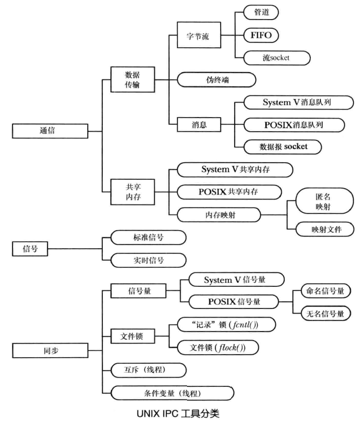
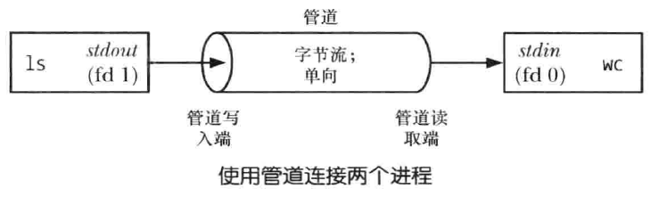
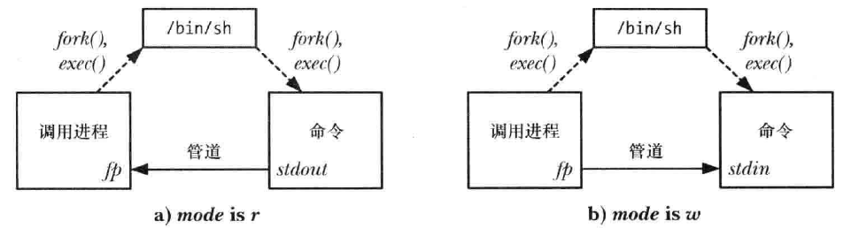
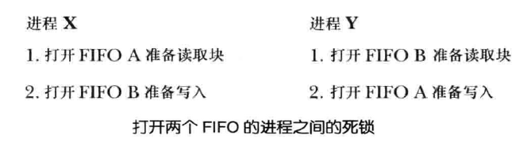

# 进程间通信

<!-- TOC -->

- [一、进程间通信简介](#一进程间通信简介)
- [二、管道](#二管道)
    - [1. 无名管道](#1-无名管道)
        - [1.1 pipe](#11-pipe)
        - [1.2 popen 和 pclose](#12-popen-和-pclose)
    - [2. 有名管道 FIFO](#2-有名管道-fifo)
        - [2.1 阻塞下打开、读写管道 FIFO](#21-阻塞下打开读写管道-fifo)
        - [2.2 非阻塞下打开、读写管道 FIFO](#22-非阻塞下打开读写管道-fifo)
        - [2.3 使用 FIFO 和 tee 创建双重管道线](#23-使用-fifo-和-tee-创建双重管道线)
        - [2.3 使用 FIFO 实现一个客户端/服务端应用程序](#23-使用-fifo-实现一个客户端服务端应用程序)
- [四、System V IPC 介绍](#四system-v-ipc-介绍)
- [五、System V 消息队列](#五system-v-消息队列)
    - [1. 消息队列的特点](#1-消息队列的特点)
    - [2. 发送消息 msgsnd()](#2-发送消息-msgsnd)
        - [1.1 消息数据结构 msgp](#11-消息数据结构-msgp)
        - [1.2 msgsnd()](#12-msgsnd)
    - [3. 接收消息 msgrcv()](#3-接收消息-msgrcv)
    - [4. 消息队列控制 msgctl()](#4-消息队列控制-msgctl)
    - [5. 消息队列数据结构 msqid_ds](#5-消息队列数据结构-msqid_ds)
    - [6. 消息队列的限制](#6-消息队列的限制)
    - [7. 使用消息队列实现客户端/服务器应用程序](#7-使用消息队列实现客户端服务器应用程序)
    - [8. 使用消息队列实现文件服务器应用程序](#8-使用消息队列实现文件服务器应用程序)
- [六、System V 信号量](#六system-v-信号量)
    - [1. System V 信号量特点](#1-system-v-信号量特点)
    - [2. 信号量控制操作 semctl()](#2-信号量控制操作-semctl)
    - [3. 信号量关联数据结构 semid_ds](#3-信号量关联数据结构-semid_ds)
    - [3. 信号量初始化](#3-信号量初始化)
    - [4. 信号量操作 semop()](#4-信号量操作-semop)
    - [5. 信号量撤销值 SEM_UNDO](#5-信号量撤销值-sem_undo)
    - [6. 信号量限制](#6-信号量限制)
    - [7. 实现一个二元信号量的协议](#7-实现一个二元信号量的协议)
- [七、System V 共享内存](#七system-v-共享内存)
    - [1. System V 共享内存特点](#1-system-v-共享内存特点)
    - [2. 使用共享内存 shmat() 和 shmdt()](#2-使用共享内存-shmat-和-shmdt)
    - [3. 共享内存控制操作 shmctl()](#3-共享内存控制操作-shmctl)
    - [4. 共享内存关联数据结构 shmid_ds](#4-共享内存关联数据结构-shmid_ds)
    - [5. 共享内存限制](#5-共享内存限制)
    - [6. 共享内存位置及向共享内存中存储指针](#6-共享内存位置及向共享内存中存储指针)
    - [7. 示例：通过共享内存传输数据](#7-示例通过共享内存传输数据)
- [八、内存映射](#八内存映射)
- [九、POSIX 信号量](#九posix-信号量)
- [九、文件锁](#九文件锁)

<!-- /TOC -->

## 一、进程间通信简介

<div align="center"></div>

## 二、管道

管道类似铅管，它允许数据从一个进程流向另一个进程。Linux 中的管道包括无名管道和有名管道，无名管道只能用于相关进程之间的通信，有名管道可用于任意进程间的通信

<div align="center"></div>

管道的特征：

- **一个管道是一个字节流**

  字节流意味着两方面的内容：

  1. 管道中不存在消息或消息边界的概念：从管道中读取数据的进程可以读取任意大小的数据块，而不管写入进程写入管道的数据块的大小
  2. 管道传递的数据是顺序的：从管道中读取出来的字节的顺序与它们被写入管道的顺序是完全一样的，管道中无法使用 lseek() 来随机地访问数据

- **管道是单向的**

  管道中数据的传递方向是单向的，管道的一端用于写入，另一端用于读取

  要实现双向的数据传递一般需要两条管道，也可以使用 UNIX domain 流 socket 对，它提供了一种标准的双向通信机制，并且其语义与流管道是等价的

- **可以确保写入不超过 `PIPE_BUF` 字节的操作是原子的**
  
  多个进程写入同一个管道时，如果它们在一个时刻写入的数据量不超过 PIPE_BUF 字节，那么就可以确保写入的数据不会发生相互混合的情况，，否则大数据块的写入可能会被分解成任意大小的段，并且可能会出现与其他进程写入的数据交叉的现象，当只有一个进程向管道写入数据时，PIPE_BUF 的取值就没有关系了，Linux 中 PIPE_BUF 的值为 4096

  当写入管道的数据块的大小超过了 PIPE_BUF 字节，那么内核可能会将数据分割成几个较小的片段来传输

  当写入管道的数据达到 PIPE_BUF 字节时，write() 会在必要的时候阻塞直到管道中的可用空间足以原子地完成操作，如果写入的数据大于PIPE_BUF 字节，那么write() 会尽可能地多传输数据以充满整个管道，然后阻塞直到一些读取进程从管道中移除了数据。如果此类阻塞的write()被一个信号处理器中断了，那么这个调用会被解除阻塞并返回成功传输到管道中的字节数，这个字节数会少于请求写入的字节数（所谓的部分写入)。

  当数据无法立即被传输时 O NONBLOCK标记会导致在一个管道或FIFO上的 write失败（错误是 EAGAIN）。这意味着当写入了 PIPE BUF字节之后，如果在管道或FIFO中没有足够的空间了，那么 write会失败，因为内核无法立即完成这个操作并且无法执行部分写入，否则就会破坏不超过 PIPE BUF字节的写入操作的原子性的要求。
当一次写入的数据量超过PIPE_BUF字节时，该写入操作无需是原子的。因此， write会尽可能多地传输字节（部分写）以充满管道或FIFO。在这种情况下，从 write（返回的值是实际传输的字节数，并且调用者随后必须要进行重试以写入剩余的字节。但如果管道或FFO已经满了，从而导致哪怕连一个字节都无法传输了，那么 write会失败并返回 EAGAIN错误。

- **管道读写数据**

  - 当读 `read()` 一个写端已被关闭的管道时，在所有数据都被读取后，`read()` 返回 0，表示文件结束
  - 当写 `write()` 一个读端已被关闭的管道时，将产生信号 `SIGPIPE`，如果忽略该信号或者捕捉该信号并从其处理程序返回，则 `write()` 返回 -l，并设置 errno 为 EPIPE


- **管道容量有限**
  
  管道是一个在内核内存中维护的缓冲器，这个缓冲器的存储能力是有限的。一旦管道被填满之后，后续向该管道的写入操作就会被阻塞直到读者从管道中移除了一些数据为止。

  Linux 中管道的存储能力是 65,536 字节。一般来讲，一个应用程序无需知道管道的实际存储能力。如果需要防止写者进程阻塞，那么从管道中读取数据的进程应该被设计成以尽可能快的速度从管道中读取数据。从理论上来讲，没有任何理由可以支持存储能力较小的管道无法正常工作这个结论，哪怕管道的存储能力只有一个字节。
  
  使用较大的缓冲器的原因是效率：每当写者充满管道时，内核必须要执行一个上下文切换以允许读者被调度来消耗管道中的一些数据。使用较大的缓冲器意味着需执行的上下文切换次数更少。

  Linux特有的 `fcntl(fd, F_SETPIPE_SZ, size)` 调用会将 fd 引用的管道的存储能力修改为至少 size 字节。非特权进程可以将管道的存储能力修改为范围在系统的页面大小到 `proc/sys/fs/pipe-max-size` 中规定的值之内的任何一个值。`pipe-max-size` 的默认值是 1048576 字节。特权（CAP_SYS_RESOURCE）进程可以覆盖这个限制。
  
  fcntl(fd, F_GETPIPE_SZ) 调用返回为管道分配的实际大小。

### 1. 无名管道

#### 1.1 pipe

无名管道可用于任意两个（或更多）相关进程之间的通信，在构建管道线时 shell 就是利用管道在两个兄弟进程之间通信

```c
#include <unistd.h>

int pipe(int filedes[2]);
```

- `pipe()` 成功后会在 `filedes` 数组中返回两个打开的文件描述符：一个表示管道的读取端 `filedes[0]`，另一个表示管道的写入端 `filedes[1]`
- `ioctl(fd,FIONREAD,&cnt)` 调用可以返回文件描述符 fd 所引用的管道或 FIFO 中未读取的字

- 无名管道用于相关进程间的通信，只要创建子进程的系列 fork() 调用之前通过一个共同的祖先进程创建管道即可，常将管道用于父子进程间通信，在 shell 的管道线中管道被用于兄弟进程间通信

  > 通过 UNIX 域 socket 在进程间传递文件描述符的技术也可以使无名管道为不相关进程间进行通信

- 利用双管道实现进程间双向通信时要注意 **防止死锁** 出现：如果两个进程都试图从空管道中读取数据或尝试向已满的管道中写入数据就可能会发生死锁

- 管道仅能单向通信，确定好通信方向后，读端进程应该关闭管道写入端，写入进程应该关闭进程读取端，原因如下：
  1. 节省文件描述符资源
  2. 防止读取进程向管道中误写数据或写入进程向管道读取数据造成管道数据混乱
  3. 不遵守该规则可能会导致行为不一致问题：
  
     管道的读取进程将关闭其持有的管道写入描述符，这样当其他进程完成输出并关闭其写入描述符之后，读者进程读完管道中的数据之后就能够看到文件结束标志。如果读取进程没有关闭管道写入端，那么在其他进程关闭了写入描述符之后，读者进程即使读完了管道的数据也不会看到文件结束，相反它将会阻塞以等待数据。
  
     当一个进程试图向一个管道中写入数据但该管道没有任何读者进程时，内核会向写入进程发送一个 SIGPIPE 信号，同时管道上的 write() 也会因 EPIPE 错误(已损坏的管道）而失败。收到 SIGPIPE 信号或得到 EPIPE 错误对于标示出管道的状态是有用的。 如果写入进程没有关闭管道的读取端，那么即使在其他进程已经关闭了管道的读取端之后写入进程仍然能够向管道写入数据，最后写入进程会将数据充满整个管道，后续的写入请求会被永远阻塞。

  4. 最后一个原因是只有当所有进程中所有引用一个管道的文件描述符被关闭之后才会销毁该管道以及释放该管道占用的资源以供其他进程复用。此时，管道中所有未读取的数据都会丢失。

TODO：下面的代码演示了使用管道在父子进程间通信的过程：

```

```

- 还可以利用管道对父子进程进行同步：

  TODO：下面的代码使用了管道同步父子进程

  ```

  ```

- 使用管道连接过滤器：

  TODO：下面的代码使用管道连接 ls 和 wc

  ```

  ```

#### 1.2 popen 和 pclose

管道的一个常见用途是执行 shell 命令并读取其输岀或向其发送一些输入。`popen()` 和 `pclose()` 函数简化了这个任务

```
#include <stdio.h>

FILE *popen(const char *command, const char *mode);
int pclose(FILE *stream);
```

- `popen` 函数创建了一个管道，然后创建了一个子进程来执行 shell，而 shell 又创建了子进程来执行 `command` 字符串
- mode 参数是一个字符串，可取 `r` 或 `w`：

  - `r`：调用进程将从管道中读取 `read` 数据，command 命令的标准输出连接到管道的写入端
  - `w`：调用进程将数据写入 `write` 到管道中，command 命令的标准输入连接到管道的读取端

<div align="center"></div>

- `popen` 成功时会返回供 stdio 库函数使用的文件流指针，当发生错误时会返回 NULL 并设置 errno
- IO 结束之后使用 `pclose` 函数关闭管道并等待子进程中的 shell 终止。`pclose` 成功时会返回子进程中she的终止状态
- `popen()` 和 `system()` 的区别：

  
TODO：下面代码展示了 `popen()` 和 `pclose()` 的用法：

```

```

### 2. 有名管道 FIFO

FIFO 与无名管道的区别在于 FIFO 在文件系统中拥有一个名称，并且其打开方式与打开一个普通文件是一样的，因此 FIFO 可用于非相关进程之间的通信

`mkfifo()` 函数用于创建一个名为 pathname 的全新的 FIFO：

```
#include <sys/stat.h>

int mkfifo(const char *pathname, mode_t mode);
```

- `mode` 指定了新 FIFO 的权限，并且会按照进程的 `umask` 值来取掩码

#### 2.1 阻塞下打开、读写管道 FIFO

默认情况下将以阻塞方式打开 FIFO：

- 打开一个 FIFO 以便读取数据（`O_RDONLY`）将会阻塞直到另一个进程打开 FIFO 以写入数据（`O_WRONLY`）为止
- 打开一个 FIFO 以写入数据将会阻塞直到另一个进程打开 FIFO 以读取数据为止

总之，打开一个 FIFO 会同步读取进程和写入进程。如果一个 FIFO 的另一端已经打开，那么 open 调用会立即成功，否则将阻塞等待

应避免使用 `O_RDWR` 打开 FIFO：

- Linux 中打开一个 FIFO 时指定 `O_RDWR` 标记可以绕过打开 FIFO 时的阻塞行为。这样，`open` 将总是立即返回，但使用该方式返回的文件描述符在 FIFO 上读写数据将导致未定义行为。因为这种做法意在使用同一个文件描述符对 FIFO 进行读写，破坏了 FIFO 的 I/O 模型
- 当采用 `O_RDWR` 方式调用 `open` 之后，调用进程在从返回的文件描述符中读取数据时永远都不会看到文件结束，因为永远都至少存在一个文件描述符被打开着以等待数据被写入 FIFO，即进程从中读取数据的那个描述符

在阻塞方式下读写 FIFO：

- 从一个包含 p 字节的管道中读取 n 字节时：

  - 当 `p < n` 时，无论管道写入端是否被打开，`read()` 将读取 p 字节数据并成功返回
  - 当 `p >= n` 时，无论管道写入端是否被打开，`read()` 将读取 n 字节数据并成功返回
  - 当 `p = 0` 时：
    - 若管道写端关闭，`read()` 直接返回 0(EOF)
    - 若管道写端开启，`read()` 将阻塞直到有数据被写入

- 向一个管道中写入 n 字节时：

  - 读端关闭时，将产生 `SIGPIPE` 信号，并且 `write()` 失败并设置 errno 为 `EPIPE`
  - 读端打开时：
    - 当 `n <= PIPE_BUF`，如果管道空间足够，`write()` 将 **原子的** 写入 n 字节；否则将阻塞等待管道中足够的数据被读取后继续执行 `write()`
    - 当 `n > PIPE_BUF`，`write()` 将写入 n 字节，并且可能阻塞，直到足够的数据被读取以便结束 `write()`，**数据可能会与其他进程写入的数据发生交叉**

#### 2.2 非阻塞下打开、读写管道 FIFO

可以 **在 `open()` 中指定 `O_NONBLOCK` 标志以非阻塞的方式打开 FIFO：**

- 如果 FIFO 的另一端已经被打开，那么 `O_NONBLOCK` 对 `open()` 调用不会产生任何影响，它会像往常一样立即成功地打开 FIFO
- 只有当 FIFO 的另一端还没有被打开的时候 `O_NONBLOCK` 标记才会起作用：

  - 如果打开 FIFO 是为了读取，并且 FIFO 的写入端还没有被打开，那么 `open()` 调用会立即成功（就像FIFO的另一端已经被打开一样）
  - 如果打开 FIFO 是为了写入，并且 FIFO 的读取端还没有被打开，那么 `open()` 调用会失败，并将 `errno` 设置为 `ENXIO`
  
  为读取而打开 `FIFO` 和为写入而打开 `FIFO` 时 `O_NONBLOCK` 标记所起的作用不同是有原因的：

  - 当 `FIFO` 的另一个端没有写者时打开一个 `FIFO` 以便读取数据是没有问题的，因为任何试图从 `FIFO` 读取数据的操作都不会返回任何数据
  - 但当试图向没有读者的 FIFO 中写入数据时将会导致 `SIGPIPE` 信号的产生且 `write()`将返回 `EPIPE` 错误

**以非阻塞方式打开 FIFO 有两个用处：**

1. 这种方式允许单个进程打开一个 FIFO 的两端：先以读取方式打开，然后以写入方式打开
2. 防止打开两个 FIFO 的进程直接产生死锁，死锁产生的情况如下图：

  <div align="center"></div>

**在非阻塞方式下读写 FIFO：**

- 从一个包含 p 字节的管道中读取 n 字节时：

  - 当 `p < n` 时，无论管道写入端是否被打开，`read()` 将读取 p 字节数据并成功返回
  - 当 `p >= n` 时，无论管道写入端是否被打开，`read()` 将读取 n 字节数据并成功返回
  - 当 `p = 0` 时：
    - 若管道写端关闭，`read()` 直接返回 0(EOF)
    - 若管道写端开启，`read()` 调用失败并设置 errno 为 `EAGAIN`

- 向一个管道中写入 n 字节时：

  - 读端关闭时，将产生 `SIGPIPE` 信号，并且 `write()` 失败并设置 errno 为 `EPIPE`
  - 读端打开时：
    - 当 `n <= PIPE_BUF`，如果管道空间足够，`write()` 将 **原子的** 写入 n 字节；否则 `write()` 调用失败并设置 errno 为 `EAGAIN`
    - 当 `n > PIPE_BUF`，如果管道有一定空闲空间，`write()` 将尽可能写入多字节数直到空间已满或写完 n 字节，可能的写入字节数在 1~n 之间，并且多进程环境下可能会与其他进程写入的数据发生交叉，否则 `write()` 调用失败并设置 errno 为 `EAGAIN`

#### 2.3 使用 FIFO 和 tee 创建双重管道线

#### 2.3 使用 FIFO 实现一个客户端/服务端应用程序

TODO：简单的使用 FIFO 进行 IPC 的客户端/服务器应用程序

```

```

## 四、System V IPC 介绍


## 五、System V 消息队列

### 1. 消息队列的特点

消息队列有以下特性：

- 不同于管道所提供的字节流，消息队列进行的通信是面向消息的，即读者接收到由写者写入的整条消息。读取条消息的一部分而让剩余部分遗留在队列中或一次读取多条消息都是不可能的

- System V 消息队列能为每个消息加一个数字类型。应用程序可以使用这个完成两件事情：
  - 读取进程可以根据类型来选择消息
  - 可以采用一种优先队列策略以便优先读取高优先级的消息（即那些消息类型值更低的消息）。


但 System V消息队列也存在几个缺点：

- 消息队列是通过标识符而非文件描述符引用。这意味着无法使用各种基于文件描述符的IO技术（如 `select`、`poll` 以及 `epoll`），在程序中同时处理消息队列的输入和基于文件描述符的IO机制的代码要比编写只处理文件描述符的代码更加复杂

- 使用键而不是文件名来标识消息队列会増加额外的程序设计复杂性，同时还需要使用 `ipcs` 和 `ipcrm` 来替换 `ls` 和 `rm`，`ftok()` 函数通常能产生一个唯一的键，但却无法保证，使用 `IPC_PRIVATE` 键能确保产生唯一的队列标识符，但需要使这个标识符对需要用到它的其他进程可见

- 消息队列是无连接的，内核不会像对待管道、FIFO 以及 socket 那样维护引用队列的进程数，因此就难以回答下列问题：
  - 一个应用程序何时能够安全地删除一个消息队列？（不管是否有进程在后面某个时刻需要从队列中读取数据而过早地删除队列会导致数据丢失。）
  - 应用程序如何确保不再使用的队列会被删除呢？

- 消息队列的总数、消息的大小以及单个队列的容量都是有限制的

### 2. 发送消息 msgsnd()

#### 1.1 消息数据结构 msgp

```
struct mymsg {
    long mtype;
    char mtext[];
}
```

- `mtype` 使用类型为 long 的整数指定消息类型
- `mtext` 为程序员自定义的一个结构，内含消息内容，其长度和内容可以是任意的

  `mtext` 字段长度可以为 0，这样对于接收进程来将所需传递的信息仅通过消息类型就能表示或只需要直到一条消息本身是否存在，这种做法有时非常有用

#### 1.2 msgsnd()

```
#include <sys/types.h>
#include <sys/msg.h>

int msgsnd(int msqid, const void *msgp, size_t msgsz, int msgflg);
```

- `msqid` 标识消息队列
- `msgp`：使用 `msgsnd` 发送消息必须要将消息结构中的 `mtype` 字段的值设为一个大于 0 的值并将所需传递的信息复制到程序员定义的 `mtext` 字段中
- `msgs` 指定了 `mtext` 字段中包含的字节数
- `msgflg` 是一组标记的位掩码，用于控制 `msgsnd` 的操作，目前只定义了 `IPC_NOWAIT` 标记：

  - `IPC_NOWAIT` 用于执行一个非阻塞的发送操作
  
    通常，当消息队列满时， `msgsnd()` 会阻塞直到队列中有足够的空间来存放这条消息。但如果指定了这个标记，那么 `msgsnd` 就会立即返回 EAGAIN 错误

    当 `msgsnd` 调用因队列满而发生阻塞时可能会被信号处理器中断。当发生这种情况时，`msgsnd` 总是会返回`ENIR` 错误，msgsnd() 系统调用永远不会自动重启，不管在建立信号处理器时是否设置了 `SA_RESTART` 标记

- `msgsnd()` 成功返回 0，失败返回 -1 并设置 errno

- 向消息队列写入消息要求具备在该队列上的写权限。

TODO：下面代码展示如何使用 `msgsnd()` 发送一条消息：

```

```

### 3. 接收消息 msgrcv()

`msgrcv` 系统调用从消息队列中读取（以及删除）一条消息并将其内容复制进 `msgp` 指向的缓冲区中

```
#include <sys/types.h>
#include <sys/msg.h>

ssize_t msgrcv(int msqid, void *msgp, size_t maxmsgsz, long msgtyp, int msgflg);
```

- `maxmsgsz` 指定了 `msgp` 缓冲区中 `mtext` 字段的最大可用空间

  如果队列中待读取的消息体的大小超过了 `maxmsgsz` 字节，那么就不会从队列中读取消息，并且 `msgrcv` 会返回错误 `E2BIG`

- `msgtyp` 控制了根据消息类型读取消息的方式：
  - `msgtyp = 0`：会删除队列中的第一条消息并将其返回给调用进程
  - `msgtyp > 0`：将队列中第一条 `mtype` 等于 `msgtyp` 的消息删除并返回
  - `msgtyp < 0`：将等待消息当成优先队列来处理，队列中 `mtype` 最小并且其值小于或等于 `msgtyp` 的绝对值的第一条消息会被删除并返回给调用进程
- `msgflg` 是一个位掩码，它的值通过将下列标记中的零个或多个取 `OR` 来确定

  - `IPC_NOWAIT` 执行一个非阻塞接收
  
    通常如果队列中没有匹配 `msgtyp` 的消息，那么 `msgrcv` 会阻塞直到队列中存在匹配的消息为止。指定 `IPC_NOWAIT` 标记会导致 `msgrcv` 立即返回 `ENOMSG` 错误

  - `MSG_EXCEPT` 仅当 `msgtyp > 0` 时生效，将队列中第一条 `mtype` 不等于 `msgtyp` 的消息删除并将其返回给调用者

  - `MSG_NOERROR` 指定该标记时，当消息的 `mtext` 字段的大小超过了可用空间时（由 maxmsgs定义），`msgrcv` 将会从队列中删除消息并将其 `mtext` 字段的大小截断为 `maxmsgsz` 字节，然后将消息返回给调用者，被截去的数据将会丢失

- `msgrcv` 成功后会返回接收到的消息的 `mtext` 字段的大小，发生错误时则返回 -1 并设置 errno

  与 `msgsnd` 一样，如果被阻塞的 `msgrcv` 调用被一个信号处理器中断了，那么调用会失败并返回 `EINTR` 错误，不管在建立信号处理器时是否设置了 `SA_RESTART` 标记

- 从消息队列中读取消息需要具备在队列上的读权限示例程序

下面代码展示了如何使用 `msgrcv()` 读取一条消息：

```

```

### 4. 消息队列控制 msgctl()

`msgctl()` 系统调用在标识符为 msqid 的消息队列上执行控制操作

```c
#include <sys/types.h>
#include <sys/msg.h>

int msgctl(int msqid, int cmd, struct msqid_ds *buf);
```

- `cmd` 参数指定了在队列上执行的操作：
  - `PC_RMID` 立即删除消息队列对象及其关联的 `msqid_ds` 数据结构。队列中所有剩余的消息都会丢失，所有被阻塞的读者和写者进程会立即醒来，`msgsnd()` 和 `msgrcv()` 会失败并返回错误 `EIDRM`，该操作会忽略第三个参数 buf
  - `PC_STAT` 将与这个消息队列关联的 `msqid_ds` 数据结构的副本放到 `buf` 指向的缓冲区中
  - `IPC_SET` 使用 `buf` 指向的缓冲区提供的值更新与这个消息队列关联的 `msqid_ds` 数据结构中被选中的字段

下面的代码展示了使用 `msgctl()` 删除消息队列：

```c

```

### 5. 消息队列数据结构 msqid_ds

每个消息队列都有其关联的 `msqid_ds` 数据结构：

```c
struct msqid_ds {
    struct        ipc_perm msg_perm；    /* Ownership and permissions */
    time_t        msg_stime;             /* Time of last msgsnd() */ 
    time_t        msg_rtime;             /* Time of last msgrcv() */ 
    time_t        msg_ctime;             /* Time of last change */
    unsigned long __msg_cbytes;          /* Number of bytes in queue */
    msgnum_t      msg_qnum;              /* Number of messages in queue */
    msglen_t      msg_qbytes;            /* Maximum bytes in queue */
    pid_t         msg_lspid;             /* PID of last msgsnd() */
    pid_t         msg_lrpid;             /* PID of last msgrcv() */
```

各种消息队列系统调用会隐式地更新 `msqid_ds` 结构中的字段，使用 `msgctl() IPC_SET` 操作则可以显式地更新其中一些字段：
- `msg_perm` 在创建消息队列之后会按照45.3节中描述的那样初始化这个子结构中的字段。uid、gid以及mode子字段可以通过 `IPC_SET` 来更新。
- `msg_stime` 初始值为 0，后续每次成功调用 `msgsnd()` 都会将这个字段设置为当前时间
- `msg_rtime` 初始值为 0，后续每次成功调用 `msgrcv()` 都会将这个字段设置为当前时间
- `msg_ctime` 当消息队列被创建或成功执行了 `IPC_SET` 操作之后会将这个字段设置为当前时间
- `__msg_cbytes` 初始值为0，后续每次成功调用 `msgsnd()`和 `msgrcv()` 都会对这个字段进行调整以反映出队列中所有消息的 `mtext` 字段包含的字节数总和
- `msg_qnum` 初始值为 0，后续每次成功调用 `msgsnd()` 会递增这个字段的值，每次成功调用 `msgrcv` 会递减这个字段的值，以此反映出队列中的消息总数
- `msg_qbytes` 消息队列中所有消息的 `mtext` 字段的字节总数的上限

  若达到一个队列的 `msg_qbytes` 限制，那么 `msgsnd()` 会阻塞或在 `IPC_NOWAIT` 设置时返回 `EAGAIN` 错误

- `msg_lspid` 初始值为 0，后续每次成功调用 `msgsnd()` 会将其设置为调用进程的进程ID
- `msg_lrpid` 初始值为 0，后续每次成功调用 `msgrcv()`会将其设置为调用进程的进程ID

下面代码展示了修改一个 System V 消息队列的 `msg_qbytes` 设置的例子：

```c

```

### 6. 消息队列的限制

Linux 下对消息队列的限制有：

- `MSGMNI` 系统级限制，它规定了系统中所能创建的消息队列标识符（即消息队列）的数量（`mugget, ENOSPO`）
- `MSGMAX` 系统级限制，它规定了单条消息中最多可写入的字节数（`mtext`）（`msgsnd(), EINVAL`）
- `MSGMNB` 一个消息队列中一次最多保存的字节数（`mtext`）

系统启动时这些消息队列限制会被重设为默认值

Linux 中特有的 `msgctl() IPC_INFO` 操作可以获取一个类型为 msginfo 的结构，其中包含了各种消息队列限制的值

### 7. 使用消息队列实现客户端/服务器应用程序

### 8. 使用消息队列实现文件服务器应用程序

## 六、System V 信号量

### 1. System V 信号量特点

System V 信号量是用来同步进程间的动作，一个常见的用途是同步对一块共享内存的访问以防止出现一个进程在访问共享内存的同时另一个进程更新这块内存的情况

System V 信号量的分配是以称为信号量集的组为单位进行的。在使用 `semget()` 系统调用创建集合的时候需要指定集合中的信号量数量。虽然在同一时刻通常只操作一个信号量，但通过 `semop` 系统调用可以原子地在同一个集合中的多个信号量之上执行一组操作

System V 信号量的很多缺点和消息队列是一样的，包括以下几点：

- 信号量是通过标识符而非文件描述符引用。这意味着无法使用各种基于文件描述符的IO技术（如 `select`、`poll` 以及 `epoll`），在程序中同时处理等待信号量和基于文件描述符的IO机制的代码要比编写只处理文件描述符的代码更加复杂

- 使用键而不是文件名来标识消息队列会増加额外的程序设计复杂性
- 创建和初始化信号量需要使用单独的系统调用意味着在一些情况下必须要做一些额外的编程工作来防止在初始化一个信号量时出现竞争条件
- 内核不会维护引用一个信号量集的进程数量，这给确定何时删除一个信号量集增加了难度并且难以确保一个不再使用的信号量集会被删除
- System V 提供的编程接口过于复杂
- 信号量的操作存在诸多限制

### 2. 信号量控制操作 semctl()

```
#include <sys/types.h>
#include <sys/sem.h>

int semctl(int semid, int semnum, int cmd, ... /* union semun arg */);
```

- `semid` 是操作所施加的信号量集的标识符
- 在单个信号量上执行操作时，`semnum` 标识出了集合中的具体信号量，对整个信号集进行操作时会忽略这个参数
- `cmd` 参数指定了需执行的操作：

  下面的控制操作对整个信号集进行操作，会忽略 `semnum` 参数：
  - `IPC_RMID` 立即删除信号量集及其关联的 `semid_ds` 数据结构。所有因该信号量集而阻塞的进程都会立即被唤醒，`semop()` 会报告错误 `EIDRM`，该操作无需 `arg` 参数。
  - `IPC_STAT` 在 `arg.buf` 指向的缓冲器中放置一份与这个信号量集相关联的 `semid_ds` 数据结构的副本
  - `IPC_SET` 使用 `arg.buf` 指向的缓冲器中的值来更新与这个信号量集相关联的 `semid_ds` 数据结构中选中的字段

获取和初始化信号量值下面的操作可以获取或初始化一个集合中的单个或所有信号量的值。获取一个信号量的值需具备在信号量上的读权限，而初始化该值则需要修改（写）权限

  - `GETVAL` `semctl()` 返回由 `semid` 指定的信号量集中第 `semnum` 个信号量的值，此操作无需 `arg` 参数
  - `SETVAL` 将由 `semid` 指定的信号量集中第 `semnum` 个信号量的值初始化为 `arg.val`
  - `GETALL` 获取由 `semid` 指向的信号量集中所有信号量的值并将它们放在 `arg.aray` 指向的数组中，程序员必须要确保该数组具备足够的空间。（通过由 `IPC_STAT` 操作返回的 `semid_ds` 数据结构中的 `sem_nsems` 字段可以获取集合中的信号量数量）此操作将忽略 `semnum` 参数
  - `SETALL` 使用 `arg_array` 指向的数组中的值初始化 `semid` 指向的集合中的所有信号量，此操作将忽略 `semnum` 参数

下面的操作返回 `semid` 引用的集合中第 `semnum` 个信号量的信息。所有这些操作都需要在信号量集合中具备读权限，并且无需 `arg` 参数：

- `GETPID` 返回上一个在该信号量上执行 `semop()` 的进程的进程 ID
- `GETNCNT` 返回当前等待该信号量的值增长的进程数

注意：`GETVAL`、`GETALL`、`GETPID`、`GETNCNT`、`GETZCNT` 返回的信息在调用进程使用它们时可能已经过期了。所有依赖由这些操作返回的信息保持不变这个条件的程序都可能会遇到 **检查时（time-of-check）和使用时（time-of-use）的竞争条件**

### 3. 信号量关联数据结构 semid_ds

每个信号量集都有一个关联的 `semid_ds` 数据结构：

```c
struct semid_ds {
    struct ipc_perm   sem_perm;     /* Ownership and permissions */
    time_t            sem_otime;    /* Time of last semop() */
    time_t            sem_ctime;    /* Time of last change */
    unsigned long     sem_nsems;    /* Number of semaphores in ret */
};
```

各种信号量系统调用会隐式地更新 `semid_ds` 结构中的字段，使用 `sectl() IPC_SET` 操作能够显式地更新 `sem_perm` 字段中的特定子字段：

- `sem_perm` 在创建信号量集时将初始化这个子结构中的字段。通过 `IPC SET` 能够更新 uid、gid 以及 mode 子字段
- `sem_time` 在创建信号量集时会将这个字段设置为 0，然后在每次成功的 `semop` 调用或当信号量值因 `SEM_UNDO` 操作而发生变更时将这个字段设置为当前时间
- `sem_ctime` 在创建信号量时以及每个成功的 `PC_SET`、`SETALL` 和 `SETVAL` 操作执行完毕之后将这个字段设置为当前时间
- `sem_nsems` 在创建集合时将这个字段的值初始化为集合中信号量的数量

TODO：下面代码使用了各种 `semctl()` 操作来显示标识符为命令行参数值的既有信号量集的信息：

```

```

### 3. 信号量初始化

TODO：多进程下避免竞争条件产生的正确创建和初始化信号量的方法：

```

```

### 4. 信号量操作 semop()

`semop()` 系统调用在 semid 标识的信号量集中的信号量上执行一个或多个操作：

```
#include <sys/types.h>
#include <sys/sem.h>

int semop(int semid, struct sembuf *sops, unsigned int nsops);
```

- `nsops` 指定了数组中元素的个数
- `sops` 是一个指向数组的指针，数组中包含了需要执行的操作，操作将会按照在数组中的顺序以原子的方式被执行，`struct sembuf` 结构如下：
  ```
  struct sembuf {
      unsigned short sem_num;   /* Semaphore number */
      short    sem_op;          /* Operation to be performed */
      short    sem_flg;         /* Operation flags（IPC_NOWAIT and SEM_UNDO）*/ 
  } 
  ```
  - `sem_num` 字段标识出了在集合中的哪个信号量上执行操作

  - `sem_op` 字段指定了需执行的操作：

    - `sem_op > 0`：将 `sem_op` 的值加到信号量值上，其他等待减小信号量值的进程可能会被唤醒，调用进程具备在信号量上的修改（写）权限
    - `sem_op = 0`：对信号量值进行检査以确定它当前是否等于 0，如果等于 0，那么操作将立即结束，否则 `semop()` 将阻塞直到信号量值变成 0 为止，调用进程必须要具备在信号量上的读权限
    - `sem_op < 0`：将信号量值减去 `sem_op`，如果信号量的当前值大于或等于 `sem_op` 的绝对值，那么操作会立即结束，否则 `semop()` 会阻塞直到信号量值增长到在执行操作之后不会导致出现负值的情况为止，调用进程必须要具备在信号量上的修改权限

  - `sem_flag` 可取 `IPC_NOWAIT` 标志防止 `semop()` 阻塞，此时如果 `semop()` 本来要发生阻塞的话就会返回 `EAGAIN` 错误

- 当 `semop()` 调用阻塞时，进程会保持阻塞直到发生下列某种情况为止：

  - 另一个进程修改了信号量值使得待执行的操作能够继续向前
  - 信号中断了 `semop()` 调用，此时会返回 `EINTR` 错误
  - 另一个进程删除了 `semid` 引用的信号量，此时 `semop` 会返回 `EIDRM` 错误

- `semop()` 保证一组操作的执行是 **原子的**，即 `semop()` 要么立即执行所有操作，要么就阻塞直到能够同时执行所有操作

- `semtimedop()` 系统调用完成与 `semop()` 同样的功能，但多一个 `timeout` 参数，该参数指定了调用所阻塞的时间上限：

  ```c
  #define _GNU_SOURCE
  #include <sys/types.h>
  #include <sys/sem.h>

  int semtimedop(int semid, struct sembuf *sops, unsigned int nsops, struct timespec *timeout);
  ```
  
  - 若 `semtimedop()` 阻塞的时间超过了 `timeout`，那么 `semtimedop()` 会返回 `EAGAIN` 错误，`timeout` 为 NULL 时，`semop()` 与 `semtimedop()` 完全一样


TODO：下面代码展示了如何使用 `semop()` 在一个集合中的三个信号量上执行操作：

```

```

### 5. 信号量撤销值 SEM_UNDO


### 6. 信号量限制

下面列出了 Linux 上信号量的限制，括号中给出了当限制达到时会受影响的系统调用及其所返回的错误：

- `SEMAEM` 在 `semadj` 总和中能够记录的最大值（`semop(), ERANGE`）
- `SEMMNI` 系统级限制，限制了所能创建的信号量标识符的数量（`semget(), ENOSPC`）
- `SEMMSL` 一个信号量集中能分配的信号量的最大数量（`semget(), EINVAL`）
- `SEMMNS` 系统级限制，限制了所有信号量集中的信号量数量。实际上，`SEMMNS` 的默认值是 `SEMMNI` 和 `SEMMSL` 两个限制的默认值的乘积（`semget, ENOSPC`）
- `SEMOPM` 每个 `semop()` 调用能够执行的操作的最大数量（`semon, E2BIG`）
- `SEMVMX` 一个信号量能取的最大值（`semop(), ERANGE`）

Linux 中特有的 `/proc/sys/kernel/sem` 中按顺序定义了 `SEMMSL`、`SEMMNS`、`SEMOPM`、`SEMMNI` 的限制值：

```
cat /proc/sys/kernel/sem
32000	1024000000	500	32000
```

Linux 中特有的 `semctl() IPC_INFO` 操作返回一个类型为 `seminfo` 的结构，其中包含了各种信号量限制的值：

```
union semun arg;
struct seminfo buf;

arg.__buf = &buf;
semctl(0, 0, IPC_INFO, arg);
```

### 7. 实现一个二元信号量的协议

## 七、System V 共享内存

### 1. System V 共享内存特点

### 2. 使用共享内存 shmat() 和 shmdt()

`shmat()` 系统调用将 `shmid` 标识的共享内存段附加到调用进程的虚拟地址空间中

```
#include <sys/types.h>
#include <sys/shm.h>

void *shmat(int shmid, const void *shmaddr, int shmflg);
```

- `shmaddr` 参数和 `shmflg` 位掩码参数中的 `SHM_RND` 控制着段是如何被附加上去的：
  - 如果 `shmaddr` 是 `NULL`，那么段会被附加到内核所选择的一个合适的地址处，这是附加一个段的优选方法
  - 如果 `shmaddr` 不为 `NULL` 且没有设置 `SHM_RND`，那么段会被附加到由 `shmaddr` 指定的地址处，它必须是系统分页大小的一个倍数，否则会发生 `EINVAL` 错误
  - 如果 `shmaddr` 不为 `NULL` 且设置了 `SHM_RND`，那么段被映射到的地址为在 `shmaddr` 中提供的地址被舍入到最近的常量 `SHMLBA` 的倍数，该常量等于系统分页大小的某个倍数。将一个段附加到值为 `SHMLBA` 的倍数的地址能够提升 CPU 的快速缓冲性能和防止岀现同一个段的不同附加操作在 CPU 快速缓冲中存在不一致的视图的情况

  为 `shmaddr` 指定一个非 `NULL` 值不是推荐的做法，原因如下：
  - 它降低了一个应用程序的可移植性，在一个UNX实现上有效的地址在另一个实现上可能是无效的
  - 试图将一个共享内存段附加到一个正在使用中的特定地址处的操作会失败

- `shmflg` 参数可取下列值的 `OR`：

  - `SHM_RND`：作用如上所述
  - `SHM_RDONLY`：附加一个共享内存段以供只读访问，试图更新只读段中的内容会导致段错误（`SIGSEGV` 信号）的发生。如果没有指定 `SHM_RDONLY`，那么就既可以读取内存又可以修改内存
  - `SHM_REMAP`：指定了这个标记之后 `shmaddr` 的值必须为非NULL，这个标记要求 `shmat()` 调用替换起点在 `shmaddr` 处长度为共享内存段的长度的任何既有共享内存段或内存映射。一般来讲，如果试图将一个共享内存段附加到一个已经在用的地址范围时将会导致 `EINVAL` 错误的发生
  
- shmat的函数结果是返回附加共享内存段的地址

`shmdt()` 调用可以将段分离出其虚拟地址空间

```
#include <sys/types.h>
#include <sys/shm.h>

int shmdt(const void *shmaddr);
```

- 分离一个共享内存段和删除它不同，删除通过 `shmctl() IPC_RMID` 完成
- `fork()` 创建的子进程会继承其父进程附加的共享内存段，因此，共享内存可以作为父子进程间 IPC 的方法
- `exec()` 和进程终止后，所有附加的共享内存段都将分离

### 3. 共享内存控制操作 shmctl()

`shmctl()` 系统调用在 shmid 标识的共享内存段上执行一组控制操作：

```
#include <sys/types.h>
#include <sys/shm.h>

int shmctl(int shmid, int cmd, struct shmid_ds *buf);
```

- `cmd` 参数指定了要执行的控制操作，`buf` 参数仅在 cmd 指定 `IPC_STAT` 和 `IPC_SET` 时用到：

  - `IPC_RMID` 标记共享内存段及其关联 `shmid_ds` 数据结构以便删除。如果当前没有进程附加该段，那么就会执行删除操作，否则就在所有进程都已经与该段分离之后再执行删除操作
    
    可以通过在附加共享内存段之后立即使用 `shmctl()` 将其标记为删除来确保在应用程序退出时干净地清除共享内存段

  - `IPC_STAT` 将与这个共享内存段关联的 `shmid_ds` 数据结构的一个副本放置到 `buf` 指向的缓冲区中
  - `IPC_SET` 使用 `buf` 指向的缓冲区中的值来更新与这个共享内存段相关联的 `shmid_ds` 数据结构中被选中的字段

  - `SHM_LOCK` 将一个共享内存锁进内存防止被交换出去
  - `SHM_UNLOCK` 为共享内存解锁以允许它被交换出去

    将共享内存锁进内存能够确保一个应用程序在访问分页时不会因发生分页故障而被延迟，若在设置 `SHM_LOCK` 时某些分页没有在内存中，则等下次该分页被调进内存后就不会被置换出去了

    Linux 上，特权进程可以将一个共享内存段锁进内存，非特权进程在进程有效用户 ID 与段的所有者或创建者的用户 ID 匹配并且进程具备足够的 `RLIMIT_MEMLOCK` 资源限制时才能在一个共享内存段上进行加锁和解锁操作

### 4. 共享内存关联数据结构 shmid_ds

每个共享内存段都有一个关联的 `shmid_ds` 数据结构：

```
struct shmid_ds {
    struct ipc_perm       shm_perm;     /* Ownership and permissions */
    size_t                shm_segsz;    /* Size of segment in bytes */
    time_t                shm_atime;    /* Time of last shmat() */
    time_t                shm_dtime;    /* Time of last shmdt() */
    time_t                shm_ctime;    /* Time of last change */
    pid_t                 shm_cpid;     /* PID of creator */
    pid_t                 shm_lpid;     /* PID of last shmat() / shmdt():w */
    shmatt_t              shm_nattch;   /* Number of currently attached processes */
};
```

各种共享内存系统调用会隐式地更新 `shmid_ds` 结构中的字段，使用 `shmctl() IPC_SET` 操作可以显式地更新 `shm_perm` 字段中的特定子字段：
- `shm_perm` 在创建共享内存段之后会对这个子结构中的字段进行初始化
- `shm_segsz`：在创建共享内存段时这个字段会被设置成段所需要的字节数
- `shm_atime`：在创建共享内存段时会将这个字段设置为 0，当一个进程附加该段时（`shmat()`）会将这个字段设置为当前时间
- `shm_dtime`：在创建共享内存段时会将这个字段设置为 0，当一个进程与该段分离（`shmdt()`）之后会将这个字段设置为当前时间
- `shm_ctime`：当段被创建时以及每个成功的 `IPC_SET` 操作都会将这个字段设置为当前时间
- `shm_cpid`：被设置成使用 `shmget()` 创建这个段的进程的进程ID
- `shm_lpid`：在创建共享内存段时会将这个字段设置为 0，后续每个成功的 `shmat()` 或 `shmdt()` 调用会将这个字段设置成调用进程的进程ID
- `shm_nattch`：统计当前附加该段的进程数。在创建段时会将这个字段初始化为 0，然后每次成功的 `shmat()` 调用会递增这个字段的值，每次成功的 `shmdt()` 调用会递减这个字段的值

### 5. 共享内存限制

下面是 Linux 对共享内存的资源限制，括号中列出了当限制达到时受影响的系统调用及其返回的错误：

- `SHMMNI` 系统级限制，限制了所能创建的共享内存标识符的数量（`shmget(), ENOSPC`）
- `SHMMIN` 共享内存段的最小大小（字节数），这个限制的值被定义成了 1（无法修改这个值），但实际的限制是系统分页大小（`shmget(), EINVAL`）。
- `SHMMAX` 共享内存段的最大大小（字节数），`SHMMAX` 的实际上限依赖于可用的 RAM 和交换空间（`shmget(), EINVAL`）
- `SHMALL` 系统级限制，限制了共享内存中的分页总数。`SHMALL` 的实际上限依赖于可用的 RAM 和交换空间（`shmget(), ENOSPC`）

查看限制值：

- 通过 `/proc` 文件系统：

  ```
  cd /proc/sys/kernel/
  cat shmmni
  4096

  cat shmmax
  18446744073692774399

  cat shmall
  18446744073692774399
  ```

- 通过 Linux 特有的 `shmctl() IPC_INFO` 返回一个类型为 `shminfo` 的结构，它包含了各个共享内存限制的值：
 
  ```
  struct shminfo buf;

  shmctl(0, IPC_INFO, (struct shmid_ds *)&buf);
  ```

查看当前消耗的值：

- 通过 Linux 特有的 `SHM_INFO` 操作返回类型为 `shm_info` 结构，其中包含了共享内存对象所消耗的实际资源相关的信息

### 6. 共享内存位置及向共享内存中存储指针

### 7. 示例：通过共享内存传输数据

## 八、内存映射

## 九、POSIX 信号量

## 九、文件锁


内存映射 IO 模型与 read、write IO 模型对比
  
