# 内存管理

<!-- TOC -->

- [一、虚拟内存](#一虚拟内存)
- [二、分页机制](#二分页机制)
- [三、页表](#三页表)
    - [1. 页表转换过程](#1-页表转换过程)
    - [2. 页表项结构](#2-页表项结构)
    - [3. 加速分页过程](#3-加速分页过程)
        - [3.1 加速虚拟地址到物理地址的映射](#31-加速虚拟地址到物理地址的映射)
        - [3.2 针对大内存页面的优化](#32-针对大内存页面的优化)
- [四、缺页中断 Page Fault](#四缺页中断-page-fault)
    - [1. 缺页中断的过程](#1-缺页中断的过程)
    - [2. 三种缺页错误](#2-三种缺页错误)
- [五、页面置换算法](#五页面置换算法)
    - [1. 最优页面置换算法](#1-最优页面置换算法)
    - [2. 最近未使用（NRU）页面置换算法](#2-最近未使用nru页面置换算法)
    - [3. 先进先出（FIFO）页面置换算法](#3-先进先出fifo页面置换算法)
    - [4. 第二次机会页面置换算法](#4-第二次机会页面置换算法)
    - [5. 时钟页面置换算法](#5-时钟页面置换算法)
    - [6. 最近最少使用（LRU）页面置换算法](#6-最近最少使用lru页面置换算法)
    - [7. 最不常用（NFU）页面置换算法](#7-最不常用nfu页面置换算法)
    - [8. 老化算法](#8-老化算法)
    - [9. 工作集页面置换算法](#9-工作集页面置换算法)
    - [10. 工作集时钟（WSClock）页面置换算法](#10-工作集时钟wsclock页面置换算法)
    - [11. 置换算法小结](#11-置换算法小结)

<!-- /TOC -->

## 一、虚拟内存

通过 [链接装载库](链接装载库.md) 和 [进程知识](进程和线程.md) 我们知道了 **操作系统为每个进程分配了独立的虚拟地址空间**，每个进程都不能直接访问物理地址，**操作系统提供了一种机制，将不同进程的虚拟地址和不同内存的物理地址映射起来**，因此，我们引入了两种地址的概念：

- 程序中使用的内存地址为 **虚拟内存地址（Virtual Memory Address）**
- 实际存在硬件里面的空间地址叫 **物理内存地址（Physical Memory Address）**

操作系统引入了虚拟内存，进程持有的虚拟地址会通过 CPU 芯片中的 **内存管理单元（MMU, Memory Management Unit）** 的映射关系，来转换变成物理地址，然后再通过物理地址访问内存，如下图所示：

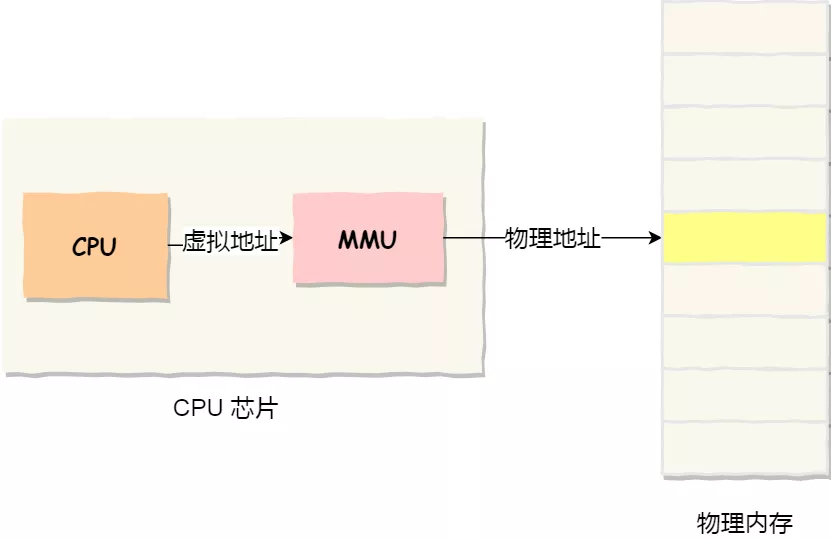</img>

## 二、分页机制

为了提交效率和减少内存碎片，虚拟地址空间按照固定大小被连续划分为称为 **页面（page）** 的若干单元，物理内存中对应的单元称为 **页框（page frame）**，页面和页框的大小通常是一样的，每一页都有连续的地址范围，这些页被映射到物理内存中，但并不是所有的页都必须在内存中才能运行程序，当程序引用到一部分在物理内存中的地址空间时，由硬件立即执行必要的映射，当程序引用一部分不在物理内存中的地址空间时，此时产生 **缺页错误（page fault）**，由操作系统负责将缺失的部分装入物理内存并重新执行失败的指令
> Linux 下，每页的大小通常为 4 KB

虚拟地址与物理地址之间的转换是通过 CPU 的内存管理单元 MMU 中存储的 **页表** 完成的：

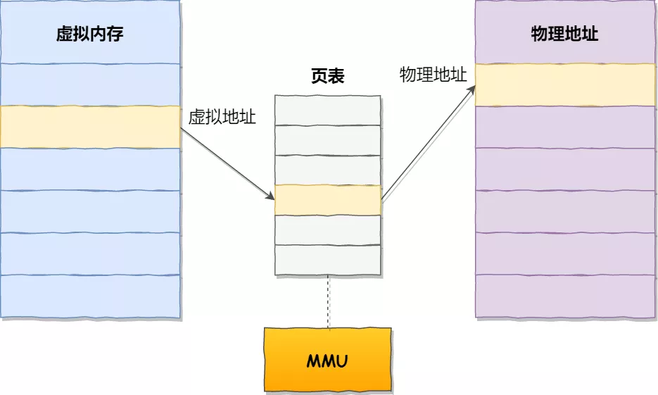</img>

若物理内存空间不够时发生缺页中断，操作系统必须在内存中选择一个页面换出内存，以便为即将调入的页面腾出空间，所以一个合理的 **页面置换算法** 可以大大提升系统的性能

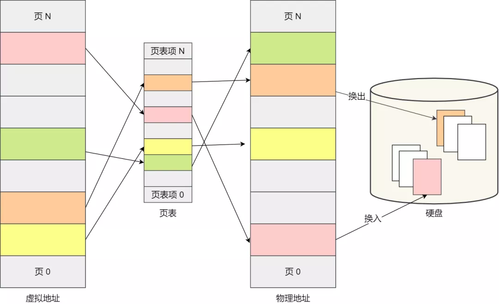</img>

## 三、页表

### 1. 页表转换过程

接下来，我们看一下在分页机制下，虚拟地址和物理地址是如何通过页表转换的

在分页机制下，虚拟地址分为两部分，**虚拟页号**（高位部分）和 **页内偏移**（低位部分）。虚拟页号作为页表的索引，以找到该虚拟页面对应的页表项，由页表项可以找到页框号（如果有的话）。然后把页框号拼接到偏移量的高位端，以替换掉虚拟页号，形成送往内存的物理地址，见下图：

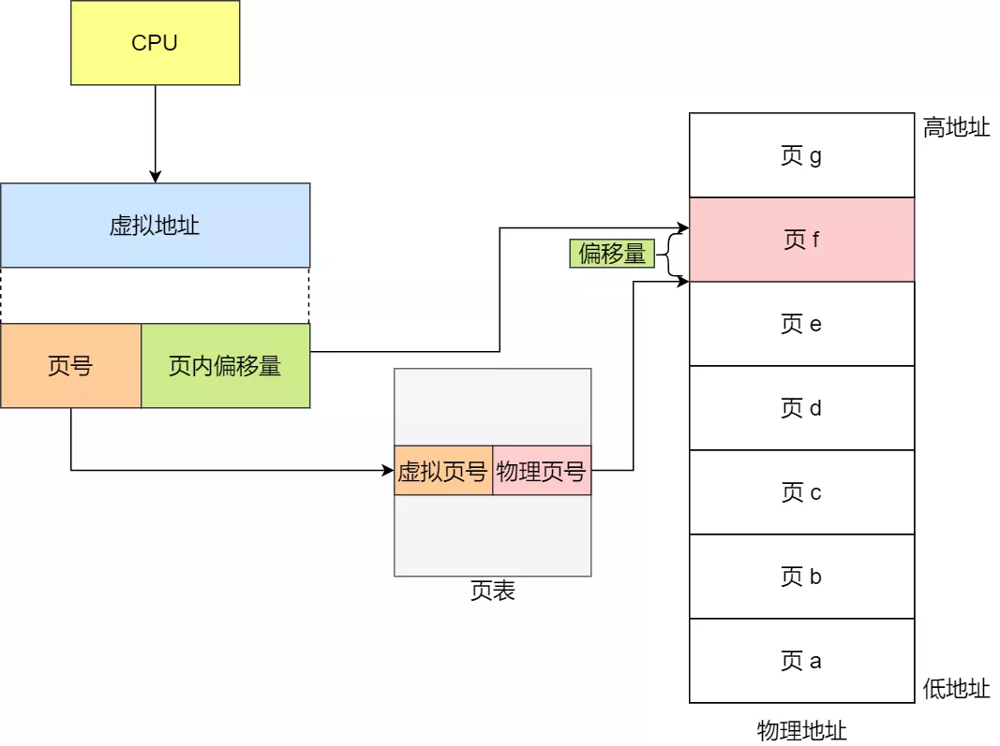</img>

一次内存地址转换，其实就是这样三个步骤：

1. 把虚拟内存地址，切分成页号和偏移量；
2. 根据页号，从页表里面，查询对应的物理页号；
3. 直接拿物理页号，加上前面的偏移量，就得到了物理内存地址

### 2. 页表项结构

页表中每个页表项都记录了与该页相关的信息，下图是一个典型的页表项：

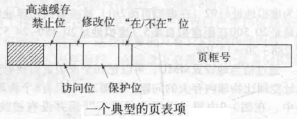</img>

- 页表项中最重要的域是 **页框号**：页映射的目的就是找到这个值
- **在/不在位**：这位为 1 时表示该表项是有效的，可以用；如果为 0，表示该表项对应的虚拟页面此时不在内存中，访问该页面会引起一个缺页中断
- **保护位**：指出该页的访问权限：0 表示读写，1 表示只读
- **修改位**：该页被写入数据时，硬件将自动设置该修改位，此时该页被称为“脏位”，脏位在重新分配页框时必须写回磁盘
- **访问位**：不论读还是写，系统都会在访问该页后设置访问位，其值用来 **帮助操作系统在发生缺页中断时选择要被淘汰的页面**
- **高速缓存禁止位**：设置该位可以禁止高速缓存，以保证硬件是不断从设备获取数据而不是访问一个旧的被高速缓存的副本

### 3. 加速分页过程

上面介绍了分页机制的主要过程，下面从两个方面优化此分页过程：

1. 虚拟地址到物理地址的映射必须非常快

   CPU 执行的每条指令都来自内存，很多指令也会访问内存中的内容，而每次访问内存都要经过虚拟地址到物理地址的映射，因此几乎每条指令都会进行一到两次的页表访问，所以页表查询必须非常快，以免成为系统性能瓶颈

2. 虚拟地址空间很大时，页表也会很大

   在 32 位的环境下，虚拟地址空间共有 4GB，假设一个页的大小是 4KB（2^12），那么就需要大约 100 万 （2^20） 个页，每个「页表项」需要 4 个字节大小来存储，那么整个 4GB 空间的映射就需要有 4MB 的内存来存储页表。而每个进程都有自己的虚拟地址空间的，也就是说都要有自己的页表。那么，100 个进程的话，就需要 400MB 的内存来存储页表，这是非常大的内存了，更别说 64 位的环境了。

#### 3.1 加速虚拟地址到物理地址的映射

##### 3.1.1 转换检测缓冲区

此优化方案基于这样一种观察：**大多数程序总是对少量的页面进行多次的访问，因此，只有很少的页表项会被反复读取，而其他的页表项很少被访问**，因此可以在 MMU 中为页表设置一个高速缓存 **转换检测缓冲区（TLB, Translation Lookaside Buffer）**，其中缓冲了少量的被多次访问的页表项，TLB 的工作过程如下：

当一个虚拟地址被放入 MMU 中进行转换时，硬件首先在 TLB 中查找该虚拟页号：

- 如果发现一个有限的匹配，则将页框号直接从 TLB 中取出而不用再访问页表
- 如果虚拟页号不在 TLB 中，就会进行正常的页表查找，并从 TLB 中淘汰一个表项，用新找到的页表项代替它，这样，该页面再下次访问时就会被 TLB 命中了

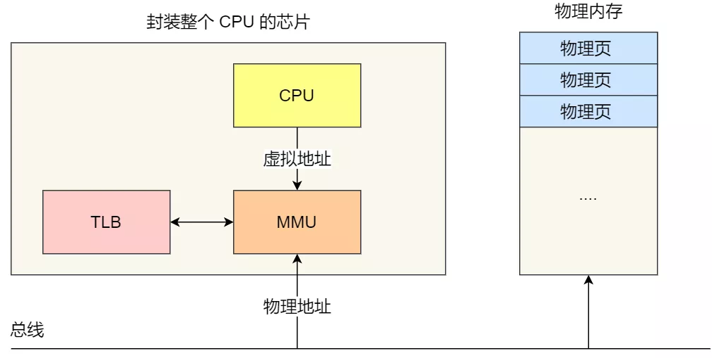</img>

#### 3.2 针对大内存页面的优化

##### 3.2.1 多级页表

可以采用 **多级页表**，以下图为例，32 位的虚拟地址被划分为 10 位的一级页表域，10 位的二级页表域和 12 位的偏移量域，此时每个页面大小为 4KB，共有 220 个页面：

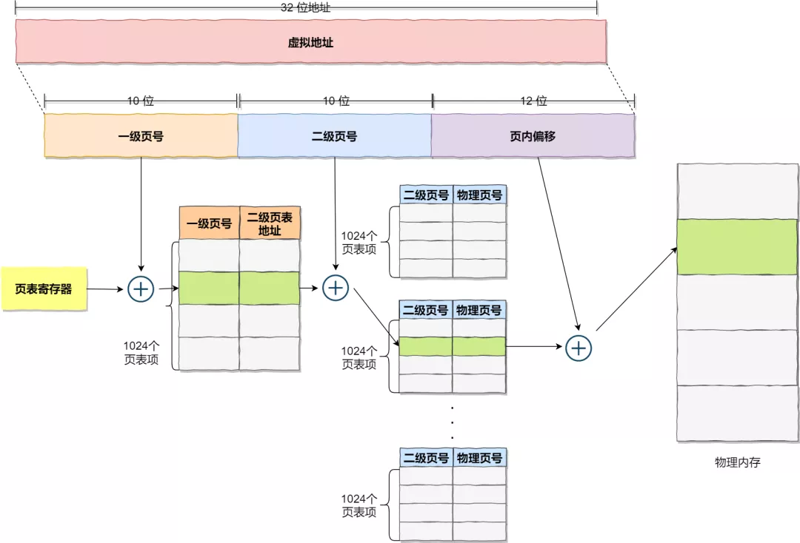</img>

引入多级页表的原因是避免把全部页表一直保存再内存中，特别是哪些从不需要的页表就不应该保留，例如一个需要 12 MB 内存的进程，其最底端是 4 MB 的程序正文段，后面是 4 MB 的数据段，顶端是 4 MB 的堆栈段，在数据段上方和堆栈段下访之间是大量根本没有使用的空闲区

对于 64 位系统，一般使用四级页表

##### 3.2.2 倒排页表

另一种解决办法是 **倒排页表**：这种设计中，实际内存中的每个页框对应一个表项，而不是每个虚拟页面对应一个表项

在虚拟地址空间比物理内存大的多的时候，倒排页表可以节省大量的空间，但是也有严重不足，即从虚拟地址到物理地址的转换会非常困难：当进程 n 访问虚拟页面 p 时，硬件不再能通过把 p 当作指向页表的一个索引来查找物理页框，取而代之的是，它必须搜索整个倒排页表来查找某个表项 (n, p)

可以使用 TLB 来克服该缺点，如果 TLB 能记录所有频繁使用的页面，那地址转换的过程就和平常的页表一样快，但是当 TLB 失效时，就需要搜索整个倒排页表，也可以通过散列表加快这个搜索过程

## 四、缺页中断 Page Fault

### 1. 缺页中断的过程

CPU 给 MMU 的虚拟地址在 TLB 和 Page Table 都没有找到对应的物理页帧或者权限不对时，就会引起 **缺页异常 Page Fault**，**它是一个由硬件中断触发的可以由软件逻辑纠正的错误。** 

发生缺页中断时，进程会从用户态切换到内核态，并将缺页中断交给内核的 **内核中断处理器 Page Fault Handler** 处理：

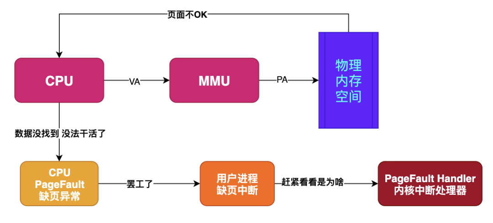</img>

### 2. 三种缺页错误

内核中断处理器会根据缺页中断的类型会进行不同的处理：

1. **硬缺页错误 Hard Page Fault**

   也被称为主要缺页错误 Major Page Fault，这时物理内存中没有对应的页帧，需要 CPU 打开磁盘设备读取到物理内存中，再让 MMU 建立虚拟内存到物理内存的映射

2. **软缺页错误 Soft Page Fault**

   也被称为次要缺页错误 Minor Page Fault，这时物理内存中是存在对应页帧的，只不过可能是其他进程调入的，发出缺页异常的进程不知道而已，此时 MMU 只需要重新建立映射即可，无需从磁盘读取写入内存，一般出现在多进程共享内存区域

3. **无效缺页错误 Invalid Page Fault**

   进程非法或者越界访问内存地址会导致该错误，例如对空指针解引用内核就会报 segment fault 错误中断进程直接挂掉

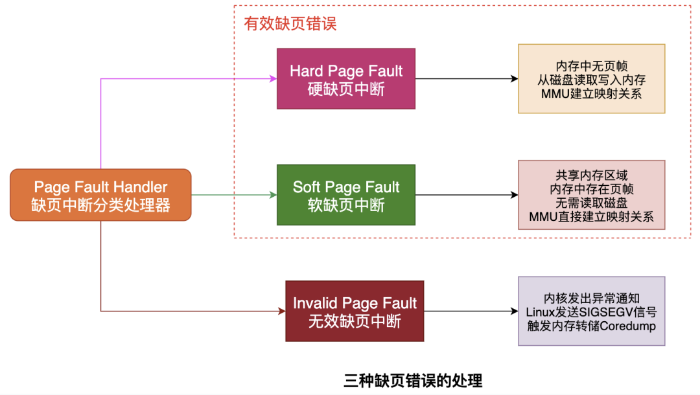</img>

## 五、页面置换算法

在物理内存不足且发生硬缺页错误时，操作系统就需要使用页面置换算法将淘汰旧页面，加入新页面

### 1. 最优页面置换算法

我们可以设想一个最好的页面置换算法：在缺页中断发生时，每个页面都可以用在该页面首次被访问前所要执行的指令数作为标记，最优页面置换算法规定应该置换标记最大的页面。例如，如果一个页面在 800 万条指令内不会被使用，另外一个页面在 600 万条指令内不会被使用，则置换前一个页面，从而把因需要调入这个页面发生的缺页中断推迟到将来，越久越好

但是该算法是无法实现的，因为我们无法预测各个页面下一次会在什么时候访问，但是我们可以将最优页面置换算法作为一个目标，来与其他置换算法作比较

### 2. 最近未使用（NRU）页面置换算法

前文说到，页表项中记录了每个页的访问和修改信息，可以根据这两个信息将页表中的页分为四类：

0. 第 0 类：没有被访问，没有被修改
1. 第 1 类：没有被访问，已被修改
2. 第 2 类：已被访问，没有被修改
3. 第 3 类：已被访问，已被修改

> 访问信息被定期清零，以区别最近没有被访问的页面和被访问的页面，第 1 类是 第 3 类经历访问信息清零得到的

**NRU(Not Recently Used) 最近未使用算法** 随机地从类编号最小的非空类挑选一个页面淘汰，算法隐含的意思是：在最近一个时钟滴答中淘汰一个没有被访问的已修改页面要比淘汰一个被频繁使用的干净页面好

NRU 的主要优点是：**易于理解和能够有效地被实现**，虽然其性能不是最好，但是已经够用了

### 3. 先进先出（FIFO）页面置换算法

**FIFO(First-In First-Out) 先进先出算法**：由操作系统维护一个所有当前在内存中的页面的链表，最新进入的页面放在表尾，最早进入的页面放在表头，当发生缺页中断时，淘汰表头的页面并把新调入的页面加到表尾

FIFO 算法的问题是可能会淘汰掉一些常用的页面，导致频繁的调入调出，所以很少使用纯粹的 FIFO 算法

### 4. 第二次机会页面置换算法

**第二次机会算法** 是对 FIFO 算法的一次改进：它每次检查最老页面的访问位：
- 如果该页面最近没有被访问过，则这个页面是又老又没有被使用过，可以立即置换掉；
- 如果该页面最近被访问过，则将访问位清零，并把该页面放到链表尾端，修改它的装入事件使它就像刚装入一样，然后继续搜索新的置换页面
- 如果所有的页面都被访问过，则该算法将退化为纯粹的 FIFO 算法

### 5. 时钟页面置换算法

**时钟页面算法** 是对第二次机会算法的改进：因为第二次机会算法经常要在链表中移动页面，既降低了效率又不是很必要，更好的办法是将所有的页面存放于一个环形链表中，一个指针总是指向最老的页面，如下图：

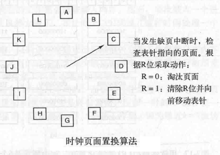</img>

当发生缺页中断时，算法首先检查指针指向的页面：

- 如果其没有被访问过，则淘汰该页面，将新页面插入到当前位置，然后将指针前移一位；
- 如果其被访问过，则清除访问位，并将指针前移一位

### 6. 最近最少使用（LRU）页面置换算法

一般来说，已经很久没有使用的页面很有可能在未来较长一段时间内仍然不会被使用，基于此可以实现一种算法，称为 **LRU(Least Recently Used) 最近最少使用** 算法，该算法 **在缺页中断发生时，置换未使用时间最长的页面**

为了实现 LRU 算法，需要在内存中维护一个所有页面的链表，最近最多使用的页面在表头，最近最少使用的页面在表尾，并且在每次访问内存时要更新整个链表，这非常费时，因此该算法实现的代价很高

有些特殊硬件可以实现 LRU 算法，最简单的方法是：假设硬件中有一个 64 位计数器 C，其在每条指令执行完后自动 +1，每个页表项中增加一个计数器值域，每次访问内存后，将当前 C 值赋给被访页面的页表项计数器，在发生缺页中断后，检查每个页表项的计数器值，找到值最小的一个页面，这个页面就是最近最少使用的页面

### 7. 最不常用（NFU）页面置换算法

**NFU(Not Frequently Used) 最不常用** 算法：将每个页面与一个软件计数器相关联，计数器的初值为 0，每次时钟中断时，由操作系统扫描内存中所有的页面，将每个页面的访问位的值（0 或 1）加到它的计数器上，这个计数器大体上跟踪了各个页面被访问的频繁程序，发生缺页中断的时候，则置换计数器值最小的页面

### 8. 老化算法

只需对 NFU 做小小的改动就可以很好的模拟 LRU，修改后的算法被称为 **老化算法**，改动如下：

1. 在访问位被加进之前先将计数器右移一位；
2. 将访问位加到计数器最左端的位而不是最右端的位

发生缺页中断时，将置换计数器最小的页面

### 9. 工作集页面置换算法

根据内存访问的 **局部性原理**，我们可以定义一个 **工作集** 的概念：即任意时刻 t，都存在一个集合，它包含所有最近 k 次内存访问所访问过的页面，而 **工作集页面置换算法** 核心即是：当发生缺页中断时，淘汰一个不在工作集中的页面

为了实现该算法，必须预先选定 k 的值，一旦选定某个值，每次内存访问之后，最近 k 次内存访问所使用过的页面的集合就是唯一确定的了，一般来说，k 的值比较大，维护该集合并在缺页中断时处理该集合所需的开销很大，所以我们考虑其他的代替方案

可以为工作集下一个近似的定义：**工作集即是过去 10 ms 中的内存访问所用到的页面的集合**，这样的模型更容易实现，一个进程从它开始执行到当前所实际使用的 CPU 时间总数通常称为 **当前实际运行时间**，所以基于此，**进程的工作集可以被称为在过去的 n 秒实际运行时间中它所访问过的页面的集合**

下来我们就可以在缺页中断时找出一个不在工作集中的页面并淘汰它，算法过程如下：

- 处理每个表项时，先检查访问位：
  - 若为 1，表示该页面在本次时钟滴答中以及被访问过，它处在当前工作集中，把当前实际时间写到页表项的“上次使用时间”域，表示缺页中断发生时该页面正在被使用
  - 若为 0，表示当前时钟滴答中，该页面还没有被访问过，接着计算它的生存时间（即当前实际运行时间 - 上次使用时间），并于 n 做对比：
    - 如果生存时间大于 n，表示这个页面不在当前工作集了，则该页面可以被淘汰了
    - 如果生存时间小于或等于 n，则该页面仍然在当前工作集，则要将该页面临时保留下来，但要记录生存时间最长的页面
- 如果扫描完整个页表发现所有页面都在工作集中，这时，如果找到多个访问位为 0 的页面，则淘汰生存时间最长的那个页面
- 最坏的情况是，所有页面的访问为都为 1，即当前时钟滴答中，所有的页面都被访问了，那么久随机选择一个页面淘汰，选择时最好根据 NRU 算法的优先级选择

### 10. 工作集时钟（WSClock）页面置换算法

当缺页中断发生时，基本工作集算法需要扫描整个页表才能确定被淘汰的页面，而 **WSClock 算法** 基于时钟算法，使用了工作集信息，构建一个以页框为元素的循环表，每个表项包含来自基本工作算法的上次使用时间，以及访问位(R)和修改位(M)

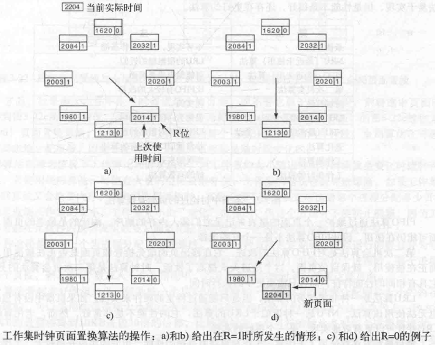</img>

算法过程如下：

- 每次缺页中断时，首先检查指针指向的页面：
  - 如果访问位为 1，该页面在本次时钟滴答中被使用过，该页面不适合被淘汰，则将该页面的访问位置为 0，将指针指向下一个页面，并继续重复该算法
  - 如果访问位为 0：
    - 并且如果页面的生存时间大于 n 并且该页面是未被修改的，那它就不在当前工作集中，则申请此页框，并把新页面放在其上，反之如果该页面是已被修改的，则不能立即申请该页框，以避免由于调度写磁盘操作引起的进程切换，指针继续前进对下一个页面进行操作
    - 页面生存时间小于等于 n 时继续指针下移
- 如果指针经过一圈返回起始点时，有两种情况：
  1. 至少调度了一次写操作
     如果操作系统已经调度了一次写操作，那某个页面将由已被修改的变为未被修改的，此时，指针仅仅是不停的移动，并置换遇到的第一个干净页面
  2. 没有调度过写操作
     此时表明所有的页面都在工作集中，只需随便置换一个干净的页面即可     

### 11. 置换算法小结

| 算法 | 备注 |
| --- | --- |
| 最优算法 | 不可实现，但可作为基准 |
| NRU（最近未使用）算法 | LRU 的很粗糙的近似 |
| FIFO（先进先出）算法 | 可能抛弃重要页面 |
| 第二次机会算法 | 比 FIFO 有较大改善 |
| 时钟算法 | 现实的 |
| LRU（最近最少使用）算法 | 很优秀，但很难实现 |
| NFU（最不经常使用）算法 | LRU 的相对粗略的近似 |
| 老化算法 | 非常近似 LRU 的有效算法 |
| 工作集算法 | 实现起来开销很大 |
| 工作集时钟算法 | 好的有效算法 |

最好的两种算法是 **老化算法** 和 **工作集时钟算法**，它们分别基于 **LRU** 和 **工作集**，它们都具有良好的页面调度性能，并可以有效的实现

参考：

- 《现代操作系统》
- 《操作系统导论》
- [20 张图揭开内存管理的迷雾](https://mp.weixin.qq.com/s/HnhGf137t_c0Qio6l-Qbsw)
- [图解|什么是缺页错误Page Fault](https://mp.weixin.qq.com/s/7JfdakiroPMPw6wAtZbXNw)