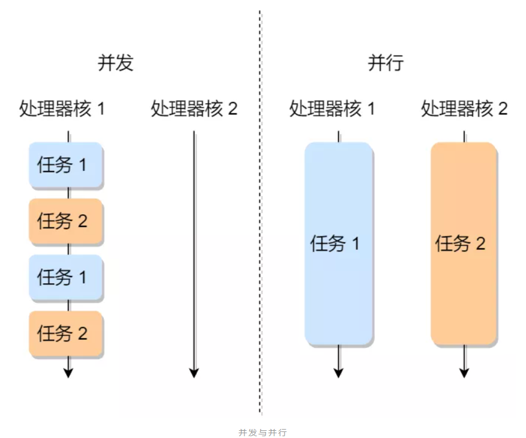

# 进程和线程

<!-- TOC -->

- [一、进程](#一进程)
    - [1. 什么是进程？](#1-什么是进程)
    - [2. 进程的状态](#2-进程的状态)
    - [3. 进程的实现](#3-进程的实现)
        - [3.1 进程模型](#31-进程模型)
        - [3.2 用户模式和内核模式](#32-用户模式和内核模式)
        - [3.3 进程的切换](#33-进程的切换)
- [二、线程](#二线程)
    - [1. 什么是线程？怎么理解线程？](#1-什么是线程怎么理解线程)
    - [2. 进程和线程的比较](#2-进程和线程的比较)
    - [3. 线程上下文切换](#3-线程上下文切换)
    - [4. 线程的实现](#4-线程的实现)
        - [4.1 用户线程模型](#41-用户线程模型)
        - [4.2 内核线程模型](#42-内核线程模型)
        - [4.3 混合实现——轻量级进程](#43-混合实现轻量级进程)
    - [5. 协程](#5-协程)
- [三、调度](#三调度)
    - [1. 调度时机](#1-调度时机)
    - [2. 调度原则](#2-调度原则)
    - [3. 调度算法](#3-调度算法)
        - [3.1 先来先服务调度算法](#31-先来先服务调度算法)
        - [3.2 最短作业优先调度算法](#32-最短作业优先调度算法)
        - [3.3 高响应比优先调度算法](#33-高响应比优先调度算法)
        - [3.4 时间片轮转调度算法](#34-时间片轮转调度算法)
        - [3.5 最高优先级调度算法](#35-最高优先级调度算法)
        - [3.6 多级反馈队列调度算法](#36-多级反馈队列调度算法)
        - [3.7 举例说明每个调度算法](#37-举例说明每个调度算法)
- [四、进程间通信](#四进程间通信)
    - [1. 管道](#1-管道)
    - [2. 消息队列](#2-消息队列)
    - [3. 共享内存](#3-共享内存)
    - [4. 信号量](#4-信号量)
    - [5. 信号](#5-信号)
    - [6. Socket](#6-socket)
        - [6.1 针对 TCP 协议通信的 socket 编程模型](#61-针对-tcp-协议通信的-socket-编程模型)
        - [6.2 针对 UDP 协议通信的 socket 编程模型](#62-针对-udp-协议通信的-socket-编程模型)
        - [6.3 针对本地进程通信的 socket 编程模型](#63-针对本地进程通信的-socket-编程模型)
    - [7. 总结](#7-总结)
- [五、互斥、同步](#五互斥同步)
    - [1. 互斥](#1-互斥)
    - [2. 同步](#2-同步)
    - [3. 互斥与同步的实现和使用](#3-互斥与同步的实现和使用)
        - [3.1 锁](#31-锁)
        - [3.2 信号量](#32-信号量)
        - [3.3 生产者-消费者问题](#33-生产者-消费者问题)
    - [4. 经典同步问题](#4-经典同步问题)
        - [4.1 哲学家就餐问题](#41-哲学家就餐问题)
        - [4.2 读者-写者问题](#42-读者-写者问题)
- [六、死锁](#六死锁)
    - [1. 什么是死锁？](#1-什么是死锁)
    - [2. 产生死锁的原因](#2-产生死锁的原因)
    - [3. 死锁产生的条件](#3-死锁产生的条件)
    - [4. 死锁的解决办法](#4-死锁的解决办法)
        - [4.1 鸵鸟算法](#41-鸵鸟算法)
        - [4.2 检测死锁和死锁恢复](#42-检测死锁和死锁恢复)
        - [4.3 避免死锁](#43-避免死锁)
        - [4.4 预防死锁](#44-预防死锁)

<!-- /TOC -->

## 一、进程

### 1. 什么是进程？

进程、多进程、并发和并行、

操作系统中最核心的概念是进程，一个进程就是一个正在执行程序的实例，包括程序计数器、寄存器和变量的当前值

进程为应用程序提供了两个关键抽象：

1. **一个独立的逻辑控制流**：它提供了一个假象，好像我们的程序独占的使用处理器
2. **一个私有的地址空间**：它提供了一个假象，好像我们的程序独占的使用内存系统

对单核 CPU 来说，同一时间只能有一个进程运行，操作系统使用一些调度算法控制 CPU 如何切换进程，同一进程多次运行时，其运算速度通常无法重现，多进程编程时，进程间的运行顺序也无法保证，由于 CPU 切换进程非常快，所以给人产生多个进程 **并行** 的感觉，而多核 CPU 可以真正在同一时间运行多个进程，这是真正的 **并发**

<div align="center"></img></div>

进程的创建一般都是由一个已存在的进程执行用于创建进程的系统调用而创建的，由此，形成父进程和子进程的关系，子进程自身可以创建更多的进程，形成一个进程的层次结构，进程创建之后，父进程和子进程有各自不同的地址空间，Linux 中 父进程通过调用 fork 创建子进程，这两个进程拥有共同的内存映像，同样的环境字符串和打开文件，其共享内存的方式为写时复制

进程的终止一般是四个原因：

1. 正常退出（自愿的）

   程序成功返回了自己的工作，主动调用进程退出系统调用

2. 出错退出（自愿的）

   程序中因某些条件不满足无法完成工作，错误处理为退出进程

3. 严重错误（自愿的）

   进程引起错误（如访问非法地址、除数为零）等，进程会受到信号被中断

4. 被其他进程杀死（非自愿）

   其中进程执行系统调用通知操作系统杀死某个进程

### 2. 进程的状态

一个进程在活动期间至少具备三种基本状态：**运行态、就绪态、阻塞态**：

<div align="center"></img></div>

- 运行态：此时进程实际占用 CPU
- 就绪态：进程可运行，但因其他进程正在运行而暂时停止
- 阻塞态：等待某种阻塞事件完成，否则进程不能运行

另外，进程还有一个 **挂起状态**，它表示进程没有占用物理内存空间，由于虚拟内存管理原因，进程所使用的空间可能还没有映射到物理内存，而是在硬盘上，这时进程就会出现挂起状态，另外调用 sleep 也会被挂起，挂起可以分为两种：

- 阻塞挂起状态：进程在外存（硬盘）并等待某个事件的出现
- 就绪挂起状态：进程在外存（硬盘），但只要进入内存，即刻立即可运行

加上这两种挂起状态，进程就变成了七种状态变迁：

<div align="center"></img></div>

### 3. 进程的实现

#### 3.1 进程模型

##### 3.1.1 进程控制块 PCB

操作系统中，是用 **进程控制块（PCB, Process Control Block）** 数据结构来描述进程的，一个进程的存在，必然对应一个 PCB，**PCB 是进程存在的唯一标识**。PCB 中包含了进程状态的重要信息，包括程序计数器、堆栈指针、内存分配状况、所打开的文件状态、账号和调度信息，以及其他在进程由运行态转换到就绪态或阻塞态时必须保存的信息

其保存的信息主要有以下几类：

<table>
<tr>
<td>信息</td>
<td>说明</td>
</tr>
<tr>
<td>进程描述信息</td>
<td>
   <li>进程标识符：标识各个进程，每个进程都有一个并且唯一的标识符</li>
   <li>用户标识符：进程归属的用户，用户标识符主要为共享和保护服务</li>
</td>
</tr>
<tr>
<td>进程控制和管理信息</td>
<td>
   <li>进程当前状态：如 new、ready、running、waiting、blocked 等</li>
   <li>进程优先级：进程抢占 CPU 时的优先级</li>
</td>
</tr>
<tr>
<td>资源分配清单</td>
<td>
   <li>有关内存地址空间或虚拟地址空间的信息，所打开的文件的列表和所使用的 I/O 设备信息</li>
</td>
</tr>
<tr>
<td>CPU 相关信息</td>
<td>
   <li>CPU 中各个寄存器的值，当进程被切换时，CPU 的状态信息都会被保存在相应的 PCB 中，以便进程重新执行时，能从断点处继续执行</li>
</td>
</tr>
</table>

##### 3.1.2 进程的控制

一般来说，PCB 通过链表组织，把 **具有相同状态的进程链在一起组成各种队列**：

- 将所有处于就绪状态的进程链在一起，称为就绪队列
- 把所有因等待某事件而处于等待状态的进程链在一起就组成了各种阻塞队列
- 另外，对于运行队列在单核 CPU 系统中则只有一个运行指针了，因为单核 CPU 在某个事件，只能运行一个程序

就绪队列和阻塞队列链表的组织如下图：

<div align="center"></img></div>

> 除了链表的组织方式，还有索引方式：将同一状态的进程组织在索引表中，索引表项指向相应的 PCB，不同状态对应不同索引表，考虑到链表插入和删除元素更加高效，一般采用链表方式

接下来，我们看看进程的 **创建、终止、阻塞、唤醒** 的过程：

- 创建进程

  操作系统允许一个进程创建另一个进程，而且允许子进程继承父进程所拥有的资源，当子进程被终止时，其在父进程处继承的资源应当还给父进程。同时，终止父进程时同时也会终止其所有的子进程

  进程创建过程如下：

  1. 为新进程分配一个唯一的进程标识号，并申请一个空白的 PCB，PCB 是有限的，若申请失败则创建失败
  2. 为进程分配资源，此处如果资源不足，进程就会进入等待状态，以等待资源
  3. 初始化 PCB
  4. 如果进程的调度队列能够接纳新进程，那就将进程插入到就绪队列，等待被调度运行

- 终止进程

  进程有 3 种终止方式：正常结束、异常结束、外界干预（如信号 kill）

  终止进程的过程如下：

  1. 查找需要终止进程的 PCB
  2. 如果处于执行状态，则立即终止该进程的执行，然后将 CPU 资源分配给其他进程
  3. 如果其还有子进程，则应将所有子进程终止
  4. 将该进程拥有的全部资源都归还给父进程或操作系统
  5. 将其从 PCB 所在队列删除

- 阻塞进程

  当进程需要等待某一事件完成时，它可以调用阻塞语句把自己阻塞等待。而一旦被阻塞等待，它只能由另一个进程唤醒

  阻塞过程如下：

  1. 找到将要被阻塞进程标识号对应的 PCB
  2. 如果该进程为运行状态，则保护其现场，将其状态转为阻塞状态，停止运行
  3. 将该 PCB 插入到阻塞队列中去

- 唤醒进程

  进程由运行转变为阻塞状态是由于进程必须等待某一事件的完成，所以处于阻塞状态的进程是绝对不可能叫醒自己的

  如果某进程正在等待 IO 事件，需由别的进程发消息给它，则只有当该进程所期待的事件出现时，才由发现者进程用唤醒语句叫醒它

  唤醒进程的过程如下：

  1. 在该事件的阻塞队列中找到相应进程的 PCB
  2. 将其从阻塞队列中移出，并置其状态为就绪状态
  3. 把该 PCB 插入到就绪队列中，等待调度程序调度

  进程的阻塞和唤醒是一对功能相反的语句，如果某个进程调用了阻塞语句，则必有一个与之对应的唤醒语句

#### 3.2 用户模式和内核模式

从 [链接装载库](链接装载库.md) 我们知道：
- 进程虚拟地址空间底部是保留给用户程序的，包括通常的代码、数据、堆和栈段，64 位进程代码段总是从地址 0x400000 开始
- 地址空间顶部是保留给内核的，内核部分包含内核在代表进程执行指令时（如，执行系统调用时）使用的代码、数据和栈

<div align="center"></img></div>

处理器通常是用某个控制寄存器的一个模式位区分进程当前享有的特权：

- 当设置了模式位时，进程就运行在 **内核模式** 中：

  运行在内核模式的进程可以执行指令集中的任何指令，并且可以访问系统中任何存储器位置

- 没有设置模式位时，进程就运行在 **用户模式** 中：

  用户模式中的进程不允许执行特权指令，如停止处理器、改变模式位、IO 操作等，也不允许用户模式中的进程直接引用地址空间中内核区内的代码和数据，用户程序必须通过系统调用接口间接地访问内核代码和数据

应用程序运行初始时，进程是在用户模式的，进程只能通过如中断、故障或者系统调用这样的异常进入内核模式。当异常发生时，控制传递到异常处理程序，处理器将模式从用户态转为内核态，处理程序运行在内核模式中，当它返回到应用程序代码时，处理器就把模式从内核模式改回到用户模式

> Linux 中提供了 `/proc` 文件系统的机制来允许用户模式进程访问内核数据结构的内容：`/proc` 文件系统将许多内核数据结构的内容输出为一个用户程序可以读的文本文件的层次结构

#### 3.3 进程的切换

操作系统内核为每个进程维持了一个上下文，各个进程之间是共享 CPU 资源的，在不同的时候进程之间需要切换，让不同的进程可以在 CPU 执行，那么这个一个进程切换到另一个进程运行，称为进程的上下文切换

##### 3.3.1 CPU 上下文

先说说 CPU 上下文，大多数操作系统都是多任务，通常支持大于 CPU 数量的任务同时运行。实际上，这些任务并不是同时运行的，只是因为系统在很短的时间内，让各个任务分别在 CPU 运行，于是就造成同时运行的错觉。任务是交给 CPU 运行的，那么在每个任务运行前，CPU 需要知道任务从哪里加载，又从哪里开始运行。

所以，**操作系统需要事先帮 CPU 设置好 CPU 寄存器和程序计数器**

CPU 寄存器是 CPU 内部一个容量小，但是速度极快的内存（缓存）。程序计数器则是用来存储 CPU 正在执行的指令位置、或者即将执行的下一条指令位置。

所以说，**CPU 寄存器** 和 **程序计数器** 是 CPU 在运行任何任务前，所必须依赖的环境，这些环境就叫做 **CPU 上下文**

CPU 上下文切换就是先把前一个任务的 CPU 上下文（CPU 寄存器和程序计数器）保存起来，然后加载新任务的上下文到这些寄存器和程序计数器，最后再跳转到程序计数器所指的新位置，运行新任务。

系统内核会存储保持下来的上下文信息，当此任务再次被分配给 CPU 运行时，CPU 会重新加载这些上下文，这样就能保证任务原来的状态不受影响，让任务看起来还是连续运行。

上面说到的“任务”，主要包含进程、线程和中断，所以根据任务的不同，把 CPU 的上下文切换分成：**进程上下文切换、线程上下文切换、中断上下文切换**

##### 3.3.2 进程上下文切换

进程是由内核管理和调度的，所以进程的切换只能发生在内核态。

所以，进程的上下文切换不仅包含了虚拟内存、栈、全局变量等用户空间的资源，还包括了内核堆栈、寄存器等内核空间的资源。通常，会把交换的信息保存在进程的 PCB，当要运行另外一个进程的时候，我们需要从这个进程的 PCB 取出上下文，然后恢复到 CPU 中，这使得这个进程可以继续执行，如下图所示：

<div align="center"></img></div>

会发生进程上下文切换的场景如下：

- 为了保证所有进程可以得到公平调度，CPU 时间被划分为一段段的时间片，这些时间片再被轮流分配给各个进程。这样，当某个进程的时间片耗尽了，就会被系统挂起，切换到其它正在等待 CPU 的进程运行；
- 进程在系统资源不足（比如内存不足）时，要等到资源满足后才可以运行，这个时候进程也会被挂起，并由系统调度其他进程运行；
- 当进程通过睡眠函数 sleep 这样的方法将自己主动挂起时，自然也会重新调度；
- 当有优先级更高的进程运行时，为了保证高优先级进程的运行，当前进程会被挂起，由高优先级进程来运行；
- 发生硬件中断时，CPU 上的进程会被中断挂起，转而执行内核中的中断服务程序

下图是一对进程 A 和进程 B 之间上下文切换的示例：

<div align="center"></img></div>

1. 进程 A 初始运行在用户模式下，通过执行系统调用 `read` 进入内核模式，`read` 读取磁盘数据通常需要一定时间，所以内核执行从进程 A 到进程 B 的上下文切换；
2. 进程 B 在用户模式下运行一段时间，直到磁盘发出一个中断信号，表示数据已经从磁盘传送到了内存中，且进程 B 已经运行了足够长的时间，此时内核执行从进程 B 到进程 A 的上下文切换，将控制返回给 A 进程中紧随系统调用 `read` 之后的指令，进程 A 继续在用户模式下执行

## 二、线程

### 1. 什么是线程？怎么理解线程？

每个进程都有一个地址空间和一个控制线程，经常存在同一个地址空间中并行运行多个控制线程的情形

**线程是进程当中的一条执行流程**

同一个进程内多个线程之间可以共享代码段、数据段、打开的文件等资源，但每个线程都有独立一套的寄存器和栈，这样可以确保线程的控制流程是相对独立的

<div align="center"></img></div>

为什么需要线程？

1. 在许多应用中同时发生着多种活动，其中某些活动会随着时间的推移被阻塞，通过把将这些应用程序分解成可以准并行运行的多个顺序线程，而多个并行实体之间拥有共享同一个地址空间和所有可用数据的能力，这样程序设计模型会更加简单，而这时多进程模型（它们具有不同地址空间）所无法表达的
2. 线程比进程更轻量，它们比进程更快创建和撤销
3. 若多个线程都是 CPU 密集型的，那么多线程并不能获得性能上的增强，但是如果存在大量的计算和大量的 IO 处理，拥有多个线程运行这些活动彼此重叠进行，可以加快应用程序执行的速度

线程的缺点：

 - 当进程中的一个线程奔溃时，会导致其所属进程的所有线程奔溃

### 2. 进程和线程的比较

**核心：进程是资源分配的最小单位，线程是CPU调度的最小单位**

- 进程：
  
  - 进程是资源竞争的基本单位，比如竞争CPU的调度，以及申请内存（物理地址空间）
  - 进程之间相互独立安全性高，如果两个进程之间需要进行（事件通知，数据传输，资源共享，进程控制）那么就需要通过进程间通信（管道，消息队列，共享内存，信号量等）的方式来达成。
  - 进程有自己的内存，通过分页将虚拟地址空间映射到物理地址空间来存储数据 

- 线程：
  
  - 线程是程序运行的最小单位，线程是进程的一个分流（一个进程至少有一个线程）
  - 一个进程内部的多个线程之间共享进程的数据，如果多个线程同时访问临界资源就会存在线程冲突（通过互斥锁来放置线程访问共享资源冲突的问题，有的时候互斥锁会带“死锁”和“饥饿现象”的问题），当然大多数线程内部的数据是单独享有的存储在线程栈上面。
  - 线程共享进程的虚拟地址空间（共享段、数据段）、用户ID和组ID、文件描述符表、当前工作目录、但是线程也私有自己的一部分数据例如一组寄存器（用于线程切换时保存独立硬件上下）、用户栈（保存私有数据）、线程优先级等。

**理解：**
- 资源管理角度：

  资源即计算机里的中央处理器、内存、文件、网络等
  
  进程可以理解为在一定环境下，把静态的程序代码运行起来，通过使用不同的资源来完成一定的任务
  
  进程的环境包括：环境变量、进程掌握的资源：中央处理器、内存、打开的文件、映射的网络端口等


  线程作为进程的一部分，扮演的角色是怎么利用中央处理器去运行代码，线程关注的是中央处理器的运行，而不是其他内存等资源的管理
  
  当只有一个中央处理器时，进程中只需要一个线程，随着多处理器的发展，一个进程可以有多个线程来并行的完成任务
  
  进程和线程不是同一层面的概念，线程是进程的一部分，线程主抓中央处理器执行代码的过程，其余的资源保护和管理由整个进程完成

- CPU任务切换角度：

  CPU轮流执行任务的过程：先加载程序A的上下文，然后开始执行A，保存程序A的上下文，调入下一个要执行的程序B的程序上下文，然后执行B，保存程序B的上下文
  
  所以： 进程就是包括上下文切换的程序执行时间总和 = CPU加载上下文 + CPU执行 + CPU保存上下文
  
  进程的颗粒度太大，每次都要有上下文的调入、保存、调出
  
  如果将进程分为a,b,c三个线程组合而成，执行流程将变为：
  
  程序A得到CPU -> CPU加载上下文 -> 执行程序A的a -> 执行b -> 执行c ->保存A的上下文
  
  也即，线程共享进程的上下文，使得线程切换导致的上下文切换代价更小，是更为细小的CPU时间段
  
  总结：进程和线程都是一个时间段的描述，是CPU工作时间段的描述，不过是颗粒大小不同

- 计算机发展史角度：

  早期计算机只有进程，进程是最基本的运行单位，包含静态的资源和动态的计算，随着计算机性能的提升和系统设计的改进，为了避免进程间调度带来的资源开销，同时提升系统的并发性能，于是在进程中引入了线程的概念，专门来负责程序的动态部分
  
  总之：
  
  - 进程是一个资源的容器，为进程里所有线程提供共享资源，是对程序的一种静态描述
  
  - 线程是计算机最小的调度和运行单位，是对程序的一种动态描述

- 从程序角度：

  - 定义方面：进程是程序在某个数据集合上的一次运行活动；线程是进程中的一个执行路径
  - 角色方面：在支持线程机制的系统中，进程是系统资源分配的单位，线程是系统调度的单位
  - 资源共享方面：进程之间不能共享资源，而线程共享所在进程的地址空间和其它资源。同时线程还有自己的栈和栈指针，程序计数器等寄存器
  - 独立性方面：进程有自己独立的地址空间，而线程没有，线程必须依赖于进程而存在

### 3. 线程上下文切换

前文说到，线程与进程最大的区别在于：线程是调度的基本单位，而进程则是资源拥有的基本单位。所以，所谓操作系统的任务调度，实际上的调度对象是线程，而进程只是给线程提供了虚拟内存、全局变量等资源。

对于线程和进程，我们可以这么理解：

- 当进程只有一个线程时，可以认为进程就等于线程；
- 当进程拥有多个线程时，这些线程会共享相同的虚拟内存和全局变量等资源，这些资源在上下文切换时是不需要修改的；
- 另外，线程也有自己的私有数据，比如栈和寄存器等，这些在上下文切换时也是需要保存的。

所以线程的上下文切换得看线程是不是属于同一个进程：

- 当两个线程不是属于同一个进程，则切换的过程就跟进程上下文切换一样；
- 当两个线程是属于同一个进程，因为虚拟内存是共享的，所以在切换时，虚拟内存这些资源就保持不动，只需要切换线程的私有数据、寄存器等不共享的数据；

所以，线程的上下文切换相比进程，开销要小很多

### 4. 线程的实现

主要有三种线程的实现方式：

1. 用户线程（User Thread）：在用户空间实现的线程，不是由内核管理的线程，是由用户态的线程库来完成线程的管理；
2. 内核线程（Kernel Thread）：在内核中实现的线程，是由内核管理的线程；
3. 轻量级进程（LightWeight Process）：在内核中来支持用户线程；

那么，这还需要考虑一个问题，用户线程和内核线程的对应关系：

- 第一种关系是多对一的关系，也就是多个用户线程对应同一个内核线程:

  <div align="center"></img></div>

- 第二种是一对一的关系，也就是一个用户线程对应一个内核线程：

  <div align="center"></img></div>

- 第三种是多对多的关系，也就是多个用户线程对应到多个内核线程：

  <div align="center"></img></div>

#### 4.1 用户线程模型

**用户线程** 是基于用户态的线程管理库来实现的，线程控制块（Thread Control Block, TCB）也是在库里面来实现的，对于操作系统而言是看不到这个 TCB 的，它只能看到整个进程的 PCB。用户线程的整个线程管理和调度，操作系统是不直接参与的，而是由用户级线程库函数来完成线程的管理，包括线程的创建、终止、同步和调度等。

用户级线程的模型，也就类似前面提到的多对一的关系，即多个用户线程对应同一个内核线程，如下图所示：

<div align="center"></img></div>

用户线程的优点：

- 每个进程都需要有它私有的线程控制块（TCB）列表，用来跟踪记录它各个线程状态信息（PC、栈指针、寄存器），TCB 由用户级线程库函数来维护，可用于不支持线程技术的操作系统；
- 用户线程的切换也是由线程库函数来完成的，无需用户态与内核态的切换，所以速度特别快；

用户线程的缺点：

- 由于操作系统不参与线程的调度，如果一个线程发起了系统调用而阻塞，那进程所包含的用户线程都不能执行了。
- 当一个线程开始运行后，除非它主动地交出 CPU 的使用权，否则它所在的进程当中的其他线程无法运行，因为用户态的线程没法打断当前运行中的线程，它没有这个特权，只有操作系统才有，但是用户线程不是由操作系统管理的。
- 由于时间片分配给进程，故与其他进程比，在多线程执行时，每个线程得到的时间片较少，执行会比较慢；

#### 4.2 内核线程模型

**内核线程** 是由操作系统管理的，线程对应的 TCB 自然是放在操作系统里的，这样线程的创建、终止和管理都是由操作系统负责。

内核线程的模型，也就类似前面提到的一对一的关系，即一个用户线程对应一个内核线程，如下图所示：

<div align="center"></img></div>

内核线程的优点：

- 在一个进程当中，如果某个内核线程发起系统调用而被阻塞，并不会影响其他内核线程的运行；
- 分配给线程，多线程的进程获得更多的 CPU 运行时间；

内核线程的缺点：

- 在支持内核线程的操作系统中，由内核来维护进程和线程的上下问信息，如 PCB 和 TCB；
- 线程的创建、终止和切换都是通过系统调用的方式来进行，因此对于系统来说，系统开销比较大；

#### 4.3 混合实现——轻量级进程

**轻量级进程（Light-weight process，LWP）** 是内核支持的用户线程，一个进程可有一个或多个 LWP，每个 LWP 是跟内核线程一对一映射的，也就是 LWP 都是由一个内核线程支持。另外，LWP 只能由内核管理并像普通进程一样被调度，Linux 内核是支持 LWP 的典型例子。

在大多数系统中，LWP与普通进程的区别也在于它只有一个最小的执行上下文和调度程序所需的统计信息。一般来说，一个进程代表程序的一个实例，而 LWP 代表程序的执行线程，因为一个执行线程不像进程那样需要那么多状态信息，所以 LWP 也不带有这样的信息。

在 LWP 之上也是可以使用用户线程的，那么 LWP 与用户线程的对应关系就有三种：

- `1 : 1`，即一个 LWP 对应 一个用户线程；
- `N : 1`，即一个 LWP 对应多个用户线程；
- `N : N`，即多个 LMP 对应多个用户线程；

接下来针对上面这三种对应关系说明它们优缺点。先看下图的 LWP 模型：

<div align="center"></img></div>

- 1 : 1 模式

  一个线程对应到一个 LWP 再对应到一个内核线程，如上图的进程 4，属于此模型。

  - 优点：实现并行，当一个 LWP 阻塞，不会影响其他 LWP；
  - 缺点：每一个用户线程，就产生一个内核线程，创建线程的开销较大。

- N : 1 模式

  多个用户线程对应一个 LWP 再对应一个内核线程，如上图的进程 2，线程管理是在用户空间完成的，此模式中用户的线程对操作系统不可见。

  - 优点：用户线程要开几个都没问题，且上下文切换发生用户空间，切换的效率较高；
  - 缺点：一个用户线程如果阻塞了，则整个进程都将会阻塞，另外在多核 CPU  中，是没办法充分利用 CPU 的。

- M : N 模式

  根据前面的两个模型混搭一起，就形成 M:N 模型，该模型提供了两级控制，首先多个用户线程对应到多个 LWP，LWP 再一一对应到内核线程，如上图的进程 3。

  - 优点：综合了前两种优点，大部分的线程上下文发生在用户空间，且多个线程又可以充分利用多核 CPU 的资源。

- 组合模式

  如上图的进程 5，此进程结合 1:1 模型和 M:N 模型。开发人员可以针对不同的应用特点调节内核线程的数目来达到物理并行性和逻辑并行性的最佳方案。

### 5. 协程

## 三、调度

进程都希望自己能够占用 CPU 进行工作，那么这涉及到前面说过的进程上下文切换。一旦操作系统把进程切换到运行状态，也就意味着该进程占用着 CPU 在执行，但是当操作系统把进程切换到其他状态时，那就不能在 CPU 中执行了，于是操作系统会选择下一个要运行的进程。

选择一个进程运行这一功能是在操作系统中完成的，通常称为调度程序（scheduler）

### 1. 调度时机

在进程的生命周期中，当进程从一个运行状态到另外一状态变化的时候，其实会触发一次调度。

比如，以下状态的变化都会触发操作系统的调度：

- `从就绪态 -> 运行态`：当进程被创建时，会进入到就绪队列，操作系统会从就绪队列选择一个进程运行；
- `从运行态 -> 阻塞态`：当进程发生 I/O 事件而阻塞时，操作系统必须另外一个进程运行；
- `从运行态 -> 结束态`：当进程退出结束后，操作系统得从就绪队列选择另外一个进程运行；

因为，这些状态变化的时候，操作系统需要考虑是否要让新的进程给 CPU 运行，或者是否让当前进程从 CPU 上退出来而换另一个进程运行。

另外，如果硬件时钟提供某个频率的周期性中断，那么可以根据如何处理时钟中断，把调度算法分为两类：

- **非抢占式调度算法** 挑选一个进程，然后让该进程运行直到被阻塞，或者直到该进程退出，才会调用另外一个进程，也就是说不会理时钟中断这个事情。

- **抢占式调度算法** 挑选一个进程，然后让该进程只运行某段时间，如果在该时段结束时，该进程仍然在运行时，则会把它挂起，接着调度程序从就绪队列挑选另外一个进程。这种抢占式调度处理，需要在时间间隔的末端发生时钟中断，以便把 CPU 控制返回给调度程序进行调度，也就是常说的时间片机制。

### 2. 调度原则

1. 原则一：如果运行的程序，发生了 I/O 事件的请求，那 CPU 使用率必然会很低，因为此时进程在阻塞等待硬盘的数据返回。这样的过程，势必会造成 CPU 突然的空闲。所以，**为了提高 CPU 利用率，在这种发送 I/O 事件致使 CPU 空闲的情况下，调度程序需要从就绪队列中选择一个进程来运行**
2. 原则二：有的程序执行某个任务花费的时间会比较长，如果这个程序一直占用着 CPU，会造成系统吞吐量（CPU 在单位时间内完成的进程数量）的降低。所以，**要提高系统的吞吐率，调度程序要权衡长任务和短任务进程的运行完成数量**
3. 原则三：从进程开始到结束的过程中，实际上是包含两个时间，分别是进程运行时间和进程等待时间，这两个时间总和就称为周转时间。进程的周转时间越小越好，**如果进程的等待时间很长而运行时间很短，那周转时间就很长，这不是我们所期望的，调度程序应该避免这种情况发生**
4. 原则四：处于就绪队列的进程，也不能等太久，当然希望这个等待的时间越短越好，这样可以使得进程更快的在 CPU 中执行。所以，**就绪队列中进程的等待时间也是调度程序所需要考虑的原则**
5. 原则五：对于鼠标、键盘这种交互式比较强的应用，我们当然希望它的响应时间越快越好，否则就会影响用户体验了。所以，**对于交互式比较强的应用，响应时间也是调度程序需要考虑的原则**

<div align="center"></img></div>

针对上面的五种调度原则，总结成如下：

- **CPU 利用率**：调度程序应确保 CPU 是始终匆忙的状态，这可提高 CPU 的利用率；
- **系统吞吐量**：吞吐量表示的是单位时间内 CPU 完成进程的数量，长作业的进程会占用较长的 CPU 资源，因此会降低吞吐量，相反，短作业的进程会提升系统吞吐量；
- **周转时间**：周转时间是进程运行和阻塞时间总和，一个进程的周转时间越小越好；
- **等待时间**：这个等待时间不是阻塞状态的时间，而是进程处于就绪队列的时间，等待的时间越长，用户越不满意；
- **响应时间**：用户提交请求到系统第一次产生响应所花费的时间，在交互式系统中，响应时间是衡量调度算法好坏的主要标准。

说白了，这么多调度原则，目的就是要使得进程要「快」。

### 3. 调度算法

不同的调度算法适用的场景也是不同的。

接下来，先说说在单核 CPU 系统中常见的调度算法

#### 3.1 先来先服务调度算法

最简单的一个调度算法，就是 **非抢占式的先来先服务（First Come First Severd, FCFS）算法** 了，顾名思义，**该算法每次从就绪队列选择最先进入队列的进程，然后一直运行，直到进程退出或被阻塞，才会继续从队列中选择第一个进程接着运行。**

<div align="center"></img></div>

这似乎很公平，但是当一个长作业先运行了，那么后面的短作业等待的时间就会很长，不利于短作业。所以，FCFS 对长作业有利，适用于 CPU 繁忙型作业的系统，而不适用于 I/O 繁忙型作业的系统。

#### 3.2 最短作业优先调度算法

**最短作业优先（Shortest Job First, SJF）调度算法** 同样也是顾名思义，**它会优先选择运行时间最短的进程来运行**，这有助于提高系统的吞吐量

<div align="center"></img></div>

这显然对长作业不利，很容易造成一种极端现象。比如，一个长作业在就绪队列等待运行，而这个就绪队列有非常多的短作业，那么就会使得长作业不断的往后推，周转时间变长，致使长作业长期不会被运行

#### 3.3 高响应比优先调度算法

前面的 **先来先服务调度算法** 和 **最短作业优先调度算法** 都没有很好的权衡短作业和长作业。而 **高响应比优先 （Highest Response Ratio Next, HRRN）调度算法主要是权衡了短作业和长作业**。**该算法每次进行进程调度时，先计算「响应比优先级」，然后把「响应比优先级」最高的进程投入运行**，「响应比优先级」的计算公式：

<div align="center"></img></div>

从上面的公式，可以发现：

- 如果两个进程的「等待时间」相同时，「要求的服务时间」越短，「响应比」就越高，这样短作业的进程容易被选中运行；
- 如果两个进程「要求的服务时间」相同时，「等待时间」越长，「响应比」就越高，这就兼顾到了长作业进程，因为进程的响应比可以随时间等待的增加而提高，当其等待时间足够长时，其响应比便可以升到很高，从而获得运行的机会

#### 3.4 时间片轮转调度算法

最古老、最简单、最公平且使用最广的算法就是 **时间片轮转（Round Robin, RR）调度算法**。

<div align="center"></img></div>

**每个进程被分配一个时间段，称为时间片（Quantum），即允许该进程在该时间段中运行**：

- 如果时间片用完，进程还在运行，那么将会把此进程从 CPU 释放出来，并把 CPU 分配另外一个进程；
- 如果该进程在时间片结束前阻塞或结束，则 CPU 立即进行切换；

另外，时间片的长度就是一个很关键的点：

- 如果时间片设得太短会导致过多的进程上下文切换，降低了 CPU 效率；
- 如果设得太长又可能引起对短作业进程的响应时间变长。

通常时间片设为 20ms~50ms，这是一个比较合理的折中值

#### 3.5 最高优先级调度算法

前面的「时间片轮转算法」做了个假设，即让所有的进程同等重要，也不偏袒谁，大家的运行时间都一样。但是，对于多用户计算机系统就有不同的看法了，它们希望调度是有优先级的，即 **希望调度程序能从就绪队列中选择最高优先级的进程进行运行**，这称为 **最高优先级（Highest Priority First，HPF）调度算法**。

进程的优先级可以分为，静态优先级或动态优先级：

- 静态优先级：创建进程时候，就已经确定了优先级了，然后整个运行时间优先级都不会变化；
- 动态优先级：根据进程的动态变化调整优先级，比如如果进程运行时间增加，则降低其优先级，如果进程等待时间（就绪队列的等待时间）增加，则升高其优先级，也就是 **随着时间的推移增加等待进程的优先级**。

该算法也有两种处理优先级高的方法，非抢占式和抢占式：

- 非抢占式：当就绪队列中出现优先级高的进程，运行完当前进程，再选择优先级高的进程。
- 抢占式：当就绪队列中出现优先级高的进程，当前进程挂起，调度优先级高的进程运行。

但是依然有缺点，可能会导致低优先级的进程永远不会运行。

#### 3.6 多级反馈队列调度算法

**多级反馈队列（Multilevel Feedback Queue）调度算法** 是「时间片轮转算法」和「最高优先级算法」的综合和发展。

顾名思义：

- 「多级」表示有多个队列，每个队列优先级从高到低，同时优先级越高时间片越短。

- 「反馈」表示如果有新的进程加入优先级高的队列时，立刻停止当前正在运行的进程，转而去运行优先级高的队列；

<div align="center"></img></div>

来看看，它是如何工作的：

- 设置了多个队列，赋予每个队列不同的优先级，每个队列优先级从高到低，同时优先级越高时间片越短；
- 新的进程会被放入到第一级队列的末尾，按先来先服务的原则排队等待被调度，如果在第一级队列规定的时间片没运行完成，则将其转入到第二级队列的末尾，以此类推，直至完成；
- 当较高优先级的队列为空，才调度较低优先级的队列中的进程运行。如果进程运行时，有新进程进入较高优先级的队列，则停止当前运行的进程并将其移入到原队列末尾，接着让较高优先级的进程运行；

可以发现，对于短作业可能可以在第一级队列很快被处理完。对于长作业，如果在第一级队列处理不完，可以移入下次队列等待被执行，虽然等待的时间变长了，但是运行时间也会更长了，所以该算法很好的兼顾了长短作业，同时有较好的响应时间

#### 3.7 举例说明每个调度算法

我们以去银行办业务的例子，把上面的调度算法串起来，**办理业务的客户相当于进程，银行窗口工作人员相当于 CPU**

现在，假设这个银行只有一个窗口（单核 CPU ），那么工作人员一次只能处理一个业务。

<div align="center"></img></div>

那么最简单的处理方式，就是先来的先处理，后面来的就乖乖排队，这就是 **先来先服务（FCFS）调度算法**。但是万一先来的这位老哥是来贷款的，这一谈就好几个小时，一直占用着窗口，这样后面的人只能干等，或许后面的人只是想简单的取个钱，几分钟就能搞定，却因为前面老哥办长业务而要等几个小时，你说气不气人？

<div align="center"></img></div>

有客户抱怨了，那我们就要改进，我们干脆优先给那些几分钟就能搞定的人办理业务，这就是 **短作业优先（SJF）调度算法**。听起来不错，但是依然还是有个极端情况，万一办理短业务的人非常的多，这会导致长业务的人一直得不到服务，万一这个长业务是个大客户，那不就捡了芝麻丢了西瓜

<div align="center"></img></div>

那就公平起见，现在窗口工作人员规定，每个人我只处理 10 分钟。如果 10 分钟之内处理完，就马上换下一个人。如果没处理完，依然换下一个人，但是客户自己得记住办理到哪个步骤了。这个也就是 **时间片轮转（RR）调度算法**。但是如果时间片设置过短，那么就会造成大量的上下文切换，增大了系统开销。如果时间片过长，相当于退化成退化成 FCFS 算法了。

<div align="center"></img></div>

既然公平也可能存在问题，那银行就对客户分等级，分为普通客户、VIP 客户、SVIP 客户。只要高优先级的客户一来，就第一时间处理这个客户，这就是 **最高优先级（HPF）调度算法**。但依然也会有极端的问题，万一当天来的全是高级客户，那普通客户不是没有被服务的机会，不把普通客户当人是吗？那我们把优先级改成动态的，如果客户办理业务时间增加，则降低其优先级，如果客户等待时间增加，则升高其优先级。

<div align="center"></img></div>

那有没有兼顾到公平和效率的方式呢？这里介绍一种算法，考虑的还算充分的，**多级反馈队列（MFQ）调度算法**，它是时间片轮转算法和优先级算法的综合和发展。它的工作方式：

<div align="center"></img></div>

- 银行设置了多个排队（就绪）队列，每个队列都有不同的优先级，各个队列优先级从高到低，同时每个队列执行时间片的长度也不同，优先级越高的时间片越短。

- 新客户（进程）来了，先进入第一级队列的末尾，按先来先服务原则排队等待被叫号（运行）。如果时间片用完客户的业务还没办理完成，则让客户进入到下一级队列的末尾，以此类推，直至客户业务办理完成。

- 当第一级队列没人排队时，就会叫号二级队列的客户。如果客户办理业务过程中，有新的客户加入到较高优先级的队列，那么此时办理中的客户需要停止办理，回到原队列的末尾等待再次叫号，因为要把窗口让给刚进入较高优先级队列的客户。

可以发现，对于要办理短业务的客户来说，可以很快的轮到并解决。对于要办理长业务的客户，一下子解决不了，就可以放到下一个队列，虽然等待的时间稍微变长了，但是轮到自己的办理时间也变长了，也可以接受，不会造成极端的现象，可以说是综合上面几种算法的优点

## 四、进程间通信

每个进程的用户地址空间都是独立的，一般而言是不能互相访问的，但内核空间是每个进程都共享的，所以进程之间要通信必须通过内核。

<div align="center"></img></div>

### 1. 管道

Linux命令行里的 `|` 竖线就是一个管道，它的功能是将前一个命令的输出，作为后一个命令的输入，从这功能描述，可以看出管道传输数据是单向的，如果想相互通信，我们需要创建两个管道才行。

```
$ ps auxf | grep mysql
```

同时，我们得知上面这种管道是没有名字，所以「|」表示的管道称为匿名管道，用完了就销毁。管道还有另外一个类型是命名管道，也被叫做 FIFO，因为数据是先进先出的传输方式。在使用命名管道前，先需要通过 mkfifo 命令来创建，并且指定管道名字：

```
$ mkfifo myPipe
```

myPipe 就是这个管道的名称，基于 Linux 一切皆文件的理念，所以管道也是以文件的方式存在，我们可以用 ls 看一下，这个文件的类型是 p，也就是 pipe（管道） 的意思：

```
$ ls -l
prw-r--r--. 1 root    root         0 Jul 17 02:45 myPipe
```

接下来，我们往 myPipe 这个管道写入数据：

```
$ echo "hello" > myPipe  // 将数据写进管道
                         // 停住了 ...
```

操作后，你会发现命令执行后就停在这了，这是因为管道里的内容没有被读取，只有当管道里的数据被读完后，命令才可以正常退出。于是，我们执行另外一个命令来读取这个管道里的数据：

```
$ cat < myPipe  // 读取管道里的数据
hello
```

可以看到，管道里的内容被读取出来了，并打印在了终端上，另外一方面，echo 那个命令也正常退出了。

我们可以看出，管道这种通信方式效率低，不适合进程间频繁地交换数据。当然，它的好处，自然就是简单，同时也我们很容易得知管道里的数据已经被另一个进程读取了。

那管道如何创建呢，背后原理是什么？匿名管道的创建，需要通过下面这个系统调用：

```
int pipe(int fd[2])
```

这里表示创建一个匿名管道，并返回了两个描述符，一个是管道的读取端描述符 fd[0]，另一个是管道的写入端描述符 fd[1]。注意，这个匿名管道是特殊的文件，只存在于内存，不存于文件系统中。

<div align="center"></img></div>

其实，**所谓的管道，就是内核里面的一串缓存**。从管道的一段写入的数据，实际上是缓存在内核中的，另一端读取，也就是从内核中读取这段数据。另外，管道传输的数据是无格式的流且大小受限。

看到这，你可能会有疑问了，这两个描述符都是在一个进程里面，并没有起到进程间通信的作用，怎么样才能使得管道是跨过两个进程的呢？

我们可以使用 `fork` 创建子进程，创建的子进程会复制父进程的文件描述符，这样就做到了两个进程各有两个 `fd[0]` 与 `fd[1]`，两个进程就可以通过各自的 fd 写入和读取同一个管道文件实现跨进程通信了。

<div align="center"></img></div>

管道只能一端写入，另一端读出，所以上面这种模式容易造成混乱，因为父进程和子进程都可以同时写入，也都可以读出。那么，为了避免这种情况，通常的做法是：

- 父进程关闭读取的 fd[0]，只保留写入的 fd[1]；
- 子进程关闭写入的 fd[1]，只保留读取的 fd[0]；

<div align="center"></img></div>

所以说如果需要双向通信，则应该创建两个管道。

到这里，我们仅仅解析了使用管道进行父进程与子进程之间的通信，但是在我们 shell 里面并不是这样的。

在 shell 里面执行 `A | B` 命令的时候，A 进程和 B 进程都是 shell 创建出来的子进程，A 和 B 之间不存在父子关系，它俩的父进程都是 shell。

<div align="center"></img></div>

所以说，在 shell 里通过 `|` 匿名管道将多个命令连接在一起，实际上也就是创建了多个子进程，那么在我们编写 shell 脚本时，能使用一个管道搞定的事情，就不要多用一个管道，这样可以减少创建子进程的系统开销。

我们可以得知，**对于匿名管道，它的通信范围是存在父子关系的进程**。因为管道没有实体，也就是没有管道文件，只能通过 fork 来复制父进程 fd 文件描述符，来达到通信的目的。

另外，**对于命名管道，它可以在不相关的进程间也能相互通信**。因为命令管道，提前创建了一个类型为管道的设备文件，在进程里只要使用这个设备文件，就可以相互通信。

不管是匿名管道还是命名管道，进程写入的数据都是缓存在内核中，另一个进程读取数据时候自然也是从内核中获取，同时通信数据都遵循 **先进先出** 原则，不支持 lseek 之类的文件定位操作。

### 2. 消息队列

前面说到管道的通信方式是效率低的，因此管道不适合进程间频繁地交换数据。

对于这个问题，**消息队列** 的通信模式就可以解决。比如，A 进程要给 B 进程发送消息，A 进程把数据放在对应的消息队列后就可以正常返回了，B 进程需要的时候再去读取数据就可以了。同理，B 进程要给 A 进程发送消息也是如此。

再来，**消息队列是保存在内核中的消息链表**，在发送数据时，会分成一个一个独立的数据单元，也就是消息体（数据块），消息体是用户自定义的数据类型，消息的发送方和接收方要约定好消息体的数据类型，所以每个消息体都是固定大小的存储块，不像管道是无格式的字节流数据。如果进程从消息队列中读取了消息体，内核就会把这个消息体删除。

消息队列生命周期随内核，如果没有释放消息队列或者没有关闭操作系统，消息队列会一直存在，而前面提到的匿名管道的生命周期，是随进程的创建而建立，随进程的结束而销毁。

消息这种模型，两个进程之间的通信就像平时发邮件一样，你来一封，我回一封，可以频繁沟通了。

但邮件的通信方式存在不足的地方有两点，**一是通信不及时，二是附件也有大小限制**，这同样也是消息队列通信不足的点。

**消息队列不适合比较大数据的传输**，因为在内核中每个消息体都有一个最大长度的限制，同时所有队列所包含的全部消息体的总长度也是有上限。在 Linux 内核中，会有两个宏定义 `MSGMAX` 和 `MSGMNB`，它们以字节为单位，分别定义了一条消息的最大长度和一个队列的最大长度。

**消息队列通信过程中，存在用户态与内核态之间的数据拷贝开销**，因为进程写入数据到内核中的消息队列时，会发生从用户态拷贝数据到内核态的过程，同理另一进程读取内核中的消息数据时，会发生从内核态拷贝数据到用户态的过程。

### 3. 共享内存

消息队列的读取和写入的过程，都会有发生用户态与内核态之间的消息拷贝过程。那 **共享内存** 的方式，就很好的解决了这一问题。

现代操作系统，对于内存管理，采用的是虚拟内存技术，也就是每个进程都有自己独立的虚拟内存空间，不同进程的虚拟内存映射到不同的物理内存中。所以，即使进程 A 和 进程 B 的虚拟地址是一样的，其实访问的是不同的物理内存地址，对于数据的增删查改互不影响。

**共享内存的机制，就是拿出一块虚拟地址空间来，映射到相同的物理内存中**。这样这个进程写入的东西，另外一个进程马上就能看到了，都不需要拷贝来拷贝去，传来传去，大大提高了进程间通信的速度。

<div align="center"></img></div>

### 4. 信号量

用了共享内存通信方式，带来新的问题，那就是如果多个进程同时修改同一个共享内存，很有可能就冲突了。例如两个进程都同时写一个地址，那先写的那个进程会发现内容被别人覆盖了。

为了防止多进程竞争共享资源，而造成的数据错乱，所以需要保护机制，使得共享的资源，在任意时刻只能被一个进程访问。正好，**信号量** 就实现了这一保护机制。

**信号量其实是一个整型的计数器，主要用于实现进程间的互斥与同步，而不是用于缓存进程间通信的数据。**

信号量表示资源的数量，控制信号量的方式有两种原子操作：

- 一个是 `P` 操作，这个操作会把信号量减去 -1，相减后如果信号量 < 0，则表明资源已被占用，进程需阻塞等待；相减后如果信号量 >= 0，则表明还有资源可使用，进程可正常继续执行。

- 另一个是 `V` 操作，这个操作会把信号量加上 1，相加后如果信号量 <= 0，则表明当前有阻塞中的进程，于是会将该进程唤醒运行；相加后如果信号量 > 0，则表明当前没有阻塞中的进程；

P 操作是用在进入共享资源之前，V 操作是用在离开共享资源之后，这两个操作是必须成对出现的。

接下来，举个例子，如果要使得两个进程互斥访问共享内存，我们可以初始化信号量为 1。

<div align="center"></img></div>

具体的过程如下：

- 进程 A 在访问共享内存前，先执行了 P 操作，由于信号量的初始值为 1，故在进程 A 执行 P 操作后信号量变为 0，表示共享资源可用，于是进程 A 就可以访问共享内存。
- 若此时，进程 B 也想访问共享内存，执行了 P 操作，结果信号量变为了 -1，这就意味着临界资源已被占用，因此进程 B 被阻塞。
- 直到进程 A 访问完共享内存，才会执行 V 操作，使得信号量恢复为 0，接着就会唤醒阻塞中的线程 B，使得进程 B 可以访问共享内存，最后完成共享内存的访问后，执行 V 操作，使信号量恢复到初始值 1。

可以发现，信号初始化为 1，就代表着是 **互斥信号量**，它可以保证共享内存在任何时刻只有一个进程在访问，这就很好的保护了共享内存。

另外，在多进程里，每个进程并不一定是顺序执行的，它们基本是以各自独立的、不可预知的速度向前推进，但有时候我们又希望多个进程能密切合作，以实现一个共同的任务。

例如，进程 A 是负责生产数据，而进程 B 是负责读取数据，这两个进程是相互合作、相互依赖的，进程 A 必须先生产了数据，进程 B 才能读取到数据，所以执行是有前后顺序的。

那么这时候，就可以用信号量来实现多进程同步的方式，我们可以初始化信号量为 0。

<div align="center"></img></div>

具体过程：

- 如果进程 B 比进程 A 先执行了，那么执行到 P 操作时，由于信号量初始值为 0，故信号量会变为 -1，表示进程 A 还没生产数据，于是进程 B 就阻塞等待；
- 接着，当进程 A 生产完数据后，执行了 V 操作，就会使得信号量变为 0，于是就会唤醒阻塞在 P 操作的进程 B；
- 最后，进程 B 被唤醒后，意味着进程 A 已经生产了数据，于是进程 B 就可以正常读取数据了。

可以发现，信号初始化为 0，就代表着是 **同步信号量**，它可以保证进程 A 应在进程 B 之前执行

### 5. 信号

上面说的进程间通信，都是常规状态下的工作模式。对于异常情况下的工作模式，就需要用「信号」的方式来通知进程。

在 Linux 操作系统中， 为了响应各种各样的事件，提供了几十种信号，分别代表不同的意义。我们可以通过 kill -l 命令，查看所有的信号：

```
$ kill -l
 1) SIGHUP       2) SIGINT       3) SIGQUIT      4) SIGILL       5) SIGTRAP
 6) SIGABRT      7) SIGBUS       8) SIGFPE       9) SIGKILL     10) SIGUSR1
11) SIGSEGV     12) SIGUSR2     13) SIGPIPE     14) SIGALRM     15) SIGTERM
16) SIGSTKFLT   17) SIGCHLD     18) SIGCONT     19) SIGSTOP     20) SIGTSTP
21) SIGTTIN     22) SIGTTOU     23) SIGURG      24) SIGXCPU     25) SIGXFSZ
26) SIGVTALRM   27) SIGPROF     28) SIGWINCH    29) SIGIO       30) SIGPWR
31) SIGSYS      34) SIGRTMIN    35) SIGRTMIN+1  36) SIGRTMIN+2  37) SIGRTMIN+3
38) SIGRTMIN+4  39) SIGRTMIN+5  40) SIGRTMIN+6  41) SIGRTMIN+7  42) SIGRTMIN+8
43) SIGRTMIN+9  44) SIGRTMIN+10 45) SIGRTMIN+11 46) SIGRTMIN+12 47) SIGRTMIN+13
48) SIGRTMIN+14 49) SIGRTMIN+15 50) SIGRTMAX-14 51) SIGRTMAX-13 52) SIGRTMAX-12
53) SIGRTMAX-11 54) SIGRTMAX-10 55) SIGRTMAX-9  56) SIGRTMAX-8  57) SIGRTMAX-7
58) SIGRTMAX-6  59) SIGRTMAX-5  60) SIGRTMAX-4  61) SIGRTMAX-3  62) SIGRTMAX-2
63) SIGRTMAX-1  64) SIGRTMAX
```

运行在 shell 终端的进程，我们可以通过键盘输入某些组合键的时候，给进程发送信号。例如

- Ctrl+C 产生 SIGINT 信号，表示终止该进程；
- Ctrl+Z 产生 SIGTSTP 信号，表示停止该进程，但还未结束；

如果进程在后台运行，可以通过 kill 命令的方式给进程发送信号，但前提需要知道运行中的进程 PID 号，例如：

- kill -9 1050 ，表示给 PID 为 1050 的进程发送 SIGKILL 信号，用来立即结束该进程；

所以，信号事件的来源主要有 **硬件来源（如键盘 Cltr+C ）和软件来源（如 kill 命令）**。

信号是进程间通信机制中 **唯一的异步通信机制**，因为可以在任何时候发送信号给某一进程，一旦有信号产生，我们就有下面这几种，用户进程对信号的处理方式。

1. **执行默认操作**。Linux 对每种信号都规定了默认操作，例如，上面列表中的 SIGTERM 信号，就是终止进程的意思。Core 的意思是 Core Dump，也即终止进程后，通过 Core Dump 将当前进程的运行状态保存在文件里面，方便程序员事后进行分析问题在哪里。
2. **捕捉信号**。我们可以为信号定义一个信号处理函数。当信号发生时，我们就执行相应的信号处理函数。
3. **忽略信号**。当我们不希望处理某些信号的时候，就可以忽略该信号，不做任何处理。有两个信号是应用进程无法捕捉和忽略的，即 SIGKILL 和 SEGSTOP，它们用于在任何时候中断或结束某一进程。

### 6. Socket

前面提到的管道、消息队列、共享内存、信号量和信号都是在同一台主机上进行进程间通信，那要想跨网络与不同主机上的进程之间通信，就需要 Socket 通信了。

实际上，Socket 通信不仅可以跨网络与不同主机的进程间通信，还可以在同主机上进程间通信。我们来看看创建 socket 的系统调用：

```
int socket(int domain, int type, int protocal)
```

三个参数分别代表：

- domain 参数用来指定协议族，比如 AF_INET 用于 IPV4、AF_INET6 用于 IPV6、AF_LOCAL/AF_UNIX 用于本机；
- type 参数用来指定通信特性，比如 SOCK_STREAM 表示的是字节流，对应 TCP、SOCK_DGRAM  表示的是数据报，对应 UDP、SOCK_RAW 表示的是原始套接字；
- protocal 参数原本是用来指定通信协议的，但现在基本废弃。因为协议已经通过前面两个参数指定完成，protocol 目前一般写成 0 即可；

根据创建 socket 类型的不同，通信的方式也就不同：

- 实现 TCP 字节流通信：socket 类型是 AF_INET 和 SOCK_STREAM；
- 实现 UDP 数据报通信：socket 类型是 AF_INET 和 SOCK_DGRAM；
- 实现本地进程间通信：

  - 「本地字节流 socket 」类型是 AF_LOCAL 和 SOCK_STREAM
  - 「本地数据报 socket 」类型是 AF_LOCAL 和 SOCK_DGRAM。

  另外，AF_UNIX 和 AF_LOCAL 是等价的，所以 AF_UNIX 也属于本地 socket；

接下来，简单说一下这三种通信的编程模式。

#### 6.1 针对 TCP 协议通信的 socket 编程模型

首先是针对 TCP 协议通信的 socket 编程模型：

<div align="center"></div>

- 服务端和客户端初始化 `socket`，得到文件描述符；
- 服务端调用 `bind`，将绑定在 IP 地址和端口;
- 服务端调用 `listen`，进行监听；
- 服务端调用 `accept`，等待客户端连接；
- 客户端调用 `connect`，向服务器端的地址和端口发起连接请求；
- 服务端 `accept` 返回用于传输的 `socket` 的文件描述符；
- 客户端调用 `write` 写入数据；服务端调用 `read` 读取数据；
- 客户端断开连接时，会调用 `close`，那么服务端 `read` 读取数据的时候，就会读取到了 EOF，待处理完数据后，服务端调用 `close`，表示连接关闭。

这里需要注意的是，服务端调用 `accept` 时，连接成功了会返回一个已完成连接的 `socket`，后续用来传输数据。

所以，监听的 `socket` 和真正用来传送数据的 `socket`，是「两个」 `socket`，一个叫作监听 `socket`，一个叫作已完成连接 `socket`。

成功连接建立之后，双方开始通过 `read` 和 `write` 函数来读写数据，就像往一个文件流里面写东西一样。

#### 6.2 针对 UDP 协议通信的 socket 编程模型

下面是针对 UDP 协议通信的 socket 编程模型：

<div align="center"></div>

UDP 是没有连接的，所以不需要三次握手，也就不需要像 TCP 调用 listen 和 connect，但是 UDP 的交互仍然需要 IP 地址和端口号，因此也需要 bind。

对于 UDP 来说，不需要要维护连接，那么也就没有所谓的发送方和接收方，甚至都不存在客户端和服务端的概念，只要有一个 socket 多台机器就可以任意通信，因此每一个 UDP 的 socket 都需要 bind。

另外，每次通信时，调用 sendto 和 recvfrom，都要传入目标主机的 IP 地址和端口。

#### 6.3 针对本地进程通信的 socket 编程模型

最后是针对本地进程通信的 socket 编程模型：

- 本地 socket  被用于在同一台主机上进程间通信的场景：
- 本地 socket 的编程接口和 IPv4 、IPv6 套接字编程接口是一致的，可以支持「字节流」和「数据报」两种协议；
- 本地 socket 的实现效率大大高于 IPv4 和 IPv6 的字节流、数据报 socket 实现；

对于本地字节流 socket，其 socket 类型是 AF_LOCAL 和 SOCK_STREAM。

对于本地数据报 socket，其 socket 类型是 AF_LOCAL 和 SOCK_DGRAM。

本地字节流 socket 和 本地数据报 socket 在 bind 的时候，不像 TCP 和 UDP 要绑定 IP 地址和端口，而是绑定一个本地文件，这也就是它们之间的最大区别

### 7. 总结

由于每个进程的用户空间都是独立的，不能相互访问，这时就需要借助内核空间来实现进程间通信，原因很简单，每个进程都是共享一个内核空间。

Linux 内核提供了不少进程间通信的方式，其中最简单的方式就是管道，管道分为「匿名管道」和「命名管道」。

**匿名管道** 顾名思义，它没有名字标识，匿��管道是特殊文件只存在于内存，没有存在于文件系统中，shell 命令中的 `|` 竖线就是匿名管道，通信的数据是 **无格式的流并且大小受限**，通信的方式是 **单向** 的，数据只能在一个方向上流动，如果要双向通信，需要创建两个管道，再来 **匿名管道是只能用于存在父子关系的进程间通信**，匿名管道的生命周期随着进程创建而建立，随着进程终止而消失。

**命名管道** 突破了匿名管道只能在亲缘关系进程间的通信限制，因为使用命名管道的前提，需要在文件系统创建一个类型为 p 的设备文件，那么毫无关系的进程就可以通过这个设备文件进行通信。另外，不管是匿名管道还是命名管道，进程写入的数据都是 **缓存在内核** 中，另一个进程读取数据时候自然也是从内核中获取，同时通信数据都遵循 **先进先出** 原则，不支持 lseek 之类的文件定位操作。

**消息队列** 克服了管道通信的数据是无格式的字节流的问题，消息队列实际上是保存在内核的「消息链表」，消息队列的消息体是可以用户自定义的数据类型，发送数据时，会被分成一个一个独立的消息体，当然接收数据时，也要与发送方发送的消息体的数据类型保持一致，这样才能保证读取的数据是正确的。消息队列通信的速度不是最及时的，毕竟 **每次数据的写入和读取都需要经过用户态与内核态之间的拷贝过程**。

**共享内存** 可以解决消息队列通信中用户态与内核态之间数据拷贝过程带来的开销，**它直接分配一个共享空间，每个进程都可以直接访问**，就像访问进程自己的空间一样快捷方便，不需要陷入内核态或者系统调用，大大提高了通信的速度，享有 **最快** 的进程间通信方式之名。但是便捷高效的共享内存通信，**带来新的问题，多进程竞争同个共享资源会造成数据的错乱。**

那么，就需要 **信号量** 来保护共享资源，以确保任何时刻只能有一个进程访问共享资源，这种方式就是互斥访问。**信号量不仅可以实现访问的互斥性，还可以实现进程间的同步**，信号量其实是一个计数器，表示的是资源个数，其值可以通过两个原子操作来控制，分别是 **P 操作和 V 操作**。

与信号量名字很相似的叫 **信号**，它俩名字虽然相似，但功能一点儿都不一样。信号是进程间通信机制中 **唯一的异步通信机制**，信号可以在应用进程和内核之间直接交互，内核也可以利用信号来通知用户空间的进程发生了哪些系统事件，信号事件的来源主要有硬件来源（如键盘 Cltr+C ）和软件来源（如 kill 命令），一旦有信号发生，**进程有三种方式响应信号 1. 执行默认操作、2. 捕捉信号、3. 忽略信号**。有两个信号是应用进程无法捕捉和忽略的，即 SIGKILL 和 SEGSTOP，这是为了方便我们能在任何时候结束或停止某个进程。

前面说到的通信机制，都是工作于同一台主机，如果 **要与不同主机的进程间通信，那么就需要 Socket 通信了**。Socket 实际上不仅用于不同的主机进程间通信，还可以用于本地主机进程间通信，可根据创建 Socket 的类型不同，分为三种常见的通信方式，一个是基于 TCP 协议的通信方式，一个是基于 UDP 协议的通信方式，一个是本地进程间通信方式。

以上，就是进程间通信的主要机制了。你可能会问了，那线程通信间的方式呢？

同个进程下的线程之间都是共享进程的资源，只要是共享变量都可以做到线程间通信，比如全局变量，所以对于线程间关注的不是通信方式，而是关注多线程竞争共享资源的问题，信号量也同样可以在线程间实现互斥与同步：

- 互斥的方式，可保证任意时刻只有一个线程访问共享资源；
- 同步的方式，可保证线程 A 应在线程 B 之前执行；

## 五、互斥、同步

我们都知道线程之间是可以共享进程资源的，如代码段、堆空间、数据段、打开的文件等，但每个线程都有自己独立的栈空间，那么问题就来了，多个线程如果竞争共享资源，如果不采取有效的措施，则会造成共享数据的混乱

<div align="center"></div>

### 1. 互斥

多个线程下操作共享变量会导致 **竞态条件（race condition）**，我们称操作共享变量的代码为 **临界区（critical section）**：它是访问共享资源的代码片段，一定不能被多线程同时执行，所以我们希望这段临界区代码是 **互斥（mutualexclusion）** 的，也就是说 **保证同时只能有一个线程在临界区执行，其他线程应该被阻止在临界区之外**

<div align="center"></div>

互斥也并不是只针对多线程，在多进程竞争共享资源（如共享内存）时，也同样可以使用互斥的方式来避免资源竞争造成的资源混乱

### 2. 同步

互斥解决了并发进程/线程对临界区的使用问题。这种基于临界区控制的交互作用是比较简单的，只要一个进程/线程进入了临界区，其他试图想进入临界区的进程/线程都会被阻塞着，直到第一个进程/线程离开了临界区。

我们都知道在多线程里，每个线程并一定是顺序执行的，它们基本是以各自独立的、不可预知的速度向前推进，但有时候我们又希望多个线程能密切合作，以实现一个共同的任务。

例子，线程 1 是负责读入数据的，而线程 2 是负责处理数据的，这两个线程是相互合作、相互依赖的。线程 2 在没有收到线程 1 的唤醒通知时，就会一直阻塞等待，当线程 1 读完数据需要把数据传给线程 2 时，线程 1 会唤醒线程 2，并把数据交给线程 2 处理。

所谓同步，就是并发进程/线程在一些关键点上可能需要互相等待与互通消息，这种相互制约的等待与互通信息称为进程/线程同步。

举个生活的同步例子，你肚子饿了想要吃饭，你叫妈妈早点做菜，妈妈听到后就开始做菜，但是在妈妈没有做完饭之前，你必须阻塞等待，等妈妈做完饭后，自然会通知你，接着你吃饭的事情就可以进行了。

<div align="center"></div>

注意，同步与互斥是两种不同的概念：

- 同步就好比：「操作 A 应在操作 B 之前执行」，「操作 C 必须在操作 A 和操作 B 都完成之后才能执行」等；
- 互斥就好比：「操作 A 和操作 B 不能在同一时刻执行」

### 3. 互斥与同步的实现和使用

为了实现进程/线程间正确的协作，操作系统必须提供实现进程协作的措施和方法，主要的方法有两种：

- 锁：加锁、解锁操作；

- 信号量：P、V 操作；

这两个都可以方便地实现进程/线程互斥，而信号量比锁的功能更强一些，它还可以方便地实现进程/线程同步。

#### 3.1 锁

使用加锁操作和解锁操作可以解决并发线程/进程的互斥问题：任何想进入临界区的线程，必须先执行加锁操作。若加锁操作顺利通过，则线程可进入临界区；在完成对临界资源的访问后再执行解锁操作，以释放该临界资源。

<div align="center"></div>

根据锁的实现的不同，可以分为 **忙等待锁** 和 **无忙等待锁**

##### 3.1.1 忙等待锁

在说明「忙等待锁」的实现之前，先介绍现代 CPU 体系结构提供的特殊原子操作指令 —— 测试和置位（Test-and-Set）指令。如果用 C 代码表示 Test-and-Set 指令，形式如下：

```c
int TestAndSet(int *old_ptr, int new)
{
   int old = *old_ptr;
   *old_ptr = new;
   return old;
}
```

测试并设置指令做了下述事情：

- 把 old_ptr 更新为 new 的新值
- 返回 old_ptr 的旧值；

当然，关键是这些代码是原子执行。因为既可以测试旧值，又可以设置新值，所以我们把这条指令叫作「测试并设置」。那什么是原子操作呢？**原子操作就是要么全部执行，要么都不执行，不能出现执行到一半的中间状态**

我们可以运用 Test-and-Set 指令来实现「忙等待锁」，代码如下：

```c
typedef struct lock_t {
   int flag;
} lock_t;

void init(lock_t *lock) {
   lock->flag = 0;
}

void lock(lock_t *lock) {
   while (TestAndSet(&lock->flag, 1) == 1)
   ;
}

void unlock(lock_t *lock) {
   lock->flag = 0;
}
```

我们来确保理解为什么这个锁能工作：

1. 第一个场景是，首先假设一个线程在运行，调用 lock()，没有其他线程持有锁，所以 flag 是 0。当调用 TestAndSet(flag, 1) 方法，返回 0，线程会跳出 while 循环，获取锁。同时也会原子的设置 flag 为1，标志锁已经被持有。当线程离开临界区，调用 unlock() 将 flag 清理为 0。
2. 第二种场景是，当某一个线程已经持有锁（即 flag 为1）。本线程调用 lock()，然后调用 TestAndSet(flag, 1)，这一次返回 1。只要另一个线程一直持有锁，TestAndSet() 会重复返回 1，本线程会一直忙等。当 flag 终于被改为 0，本线程会调用 TestAndSet()，返回 0 并且原子地设置为 1，从而获得锁，进入临界区。

很明显，当获取不到锁时，线程就会一直 wile 循环，不做任何事情，所以就被称为「忙等待锁」，也被称为自旋锁（spin lock）。

这是最简单的一种锁，一直自旋，利用 CPU 周期，直到锁可用。在单处理器上，需要抢占式的调度器（即不断通过时钟中断一个线程，运行其他线程）。否则，自旋锁在单 CPU 上无法使用，因为一个自旋的线程永远不会放弃 CPU

##### 3.1.2 无忙等待锁

无等待锁顾明思议就是获取不到锁的时候，不用自旋。既然不想自旋，那当没获取到锁的时候，就把当前线程放入到锁的等待队列，然后执行调度程序，把 CPU 让给其他线程执行。

```c
typedef struct lock_t {
   int flag;
   queue_t *q;    //等待队列
} lock_t;

void init(lock_t *lock) {
   lock->flag = 0;
   queue_init(lock->q);
}

void lock(lock_t *lock) {
   while (TestAndSet(&lock->flag, 1) == 1) {
      //保存现在运行线程 TCB
      //将现在运行的线程 TCB 插入到等待队列
      //设置该线程为等待状态
      //调度程序
   }
}

void unlock(lock_t *lock) {
   if (lock->q != NULL) {
      //移出等待队列的队头元素
      //将该线程的 TCB 插入到就绪队列
      //设置该线程为就绪状态
   }
   lock->flag = 0;
}
```

#### 3.2 信号量

信号量是操作系统提供的一种协调共享资源访问的方法。通常信号量表示资源的数量，对应的变量是一个整型（sem）变量。另外，还有两个原子操作的系统调用函数来控制信号量的，分别是：

- P 操作：将 sem 减 1，相减后，如果 sem < 0，则进程/线程进入阻塞等待，否则继续，表明 P 操作可能会阻塞；
- V 操作：将 sem 加 1，相加后，如果 sem <= 0，唤醒一个等待中的进程/线程，表明 V 操作不会阻塞；

P 操作是用在进入临界区之前，V 操作是用在离开临界区之后，这两个操作是必须成对出现的。

举个类比，2 个资源的信号量，相当于 2 条火车轨道，PV 操作如下图过程：

<div align="center"></div>

信号量数据结构与 PV 操作的算法描述如下：

```c
//信号量数据结构
typedef struct sem_t {
   int sem;    //资源个数
   queue_t *q; //等待队列
} sem_t;

//初始化信号量
void init(sem_t *s, int sem) {
   s->sem = sem;
   queue_init(s->q);
}

//P 操作
void P(sem_t *s) {
   s->sem--;
   if (s->sem < 0) {
      //1.保留调用线程 CPU 现场
      //2.将该线程的 TCB 插入到 s 的等待队列
      //3.设置该线程为等待状态
      //4.执行调度程序
   }
}

//V 操作
void V(sem_t *s) {
   s->sem++;
   if (s->sem <= 0) {
      //1.移出 s 等待队列首元素
      //2.将该线程的 TCB 插入就绪队列
      //3.设置该线程为就绪状态
   }
}
```

PV 操作的函数是由操作系统管理和实现的，所以操作系统已经使得执行 PV 函数时是具有原子性的。

信号量不仅可以实现临界区的互斥访问控制，还可以线程间的事件同步。

##### 3.2.1 信号量实现临界区的互斥访问

为每类共享资源设置一个信号量 s，其初值为 1，表示该临界资源未被占用。只要把进入临界区的操作置于 P(s) 和 V(s) 之间，即可实现进程/线程互斥：

<div align="center"></div>

此时，任何想进入临界区的线程，必先在互斥信号量上执行 P 操作，完成对临界资源的访问后再执行 V 操作。由于互斥信号量的初始值为 1，故在第一个线程执行 P 操作后 s 值变为 0，表示临界资源为空闲，可分配给该线程，使之进入临界区。

若此时又有第二个线程想进入临界区，也应先执行 P 操作，结果使 s 变为负值，这就意味着临界资源已被占用，因此，第二个线程被阻塞。

并且，直到第一个线程执行 V 操作，释放临界资源而恢复 s 值为 0 后，才唤醒第二个线程，使之进入临界区，待它完成临界资源的访问后，又执行 V 操作，使 s 恢复到初始值 1。

对于两个并发线程，互斥信号量的值仅取 1、0 和 -1 三个值，分别表示：

- 如果互斥信号量为 1，表示没有线程进入临界区；
- 如果互斥信号量为 0，表示有一个线程进入临界区；
- 如果互斥信号量为 -1，表示一个线程进入临界区，另一个线程等待进入。

通过互斥信号量的方式，就能保证临界区任何时刻只有一个线程在执行，就达到了互斥的效果。

##### 3.2.2 信号量实现事件同步

同步的方式是设置一个信号量，其初值为 0。我们把前面的「吃饭-做饭」同步的例子，用代码的方式实现一下：

```c
semaphore s1 = 0;    //表示不需要吃饭
semaphore s2 = 0;    //表示饭还没做完

//儿子线程函数
void son() {
   while (TRUE) {
      //肚子饿
      V(s1);   //叫妈妈做饭
      P(s2);   //等待妈妈做完饭
      //吃饭
   }
}

//妈妈线程函数
void mon() {
   while (TRUE) {
      P(s1);   //等待儿子说饿
      //做饭；
      V(s2);   //做好饭，通知儿子吃饭
   }
}
```

1. 妈妈一开始询问儿子要不要做饭时，执行的是 P(s1) ，相当于询问儿子需不需要吃饭，由于 s1 初始值为 0，此时 s1 变成 -1，表明儿子不需要吃饭，所以妈妈线程就进入等待状态。
2. 当儿子肚子饿时，执行了 V(s1)，使得 s1 信号量从 -1 变成 0，表明此时儿子需要吃饭了，于是就唤醒了阻塞中的妈妈线程，妈妈线程就开始做饭。
3. 接着，儿子线程执行了 P(s2)，相当于询问妈妈饭做完了吗，由于 s2 初始值是 0，则此时 s2 变成 -1，说明妈妈还没做完饭，儿子线程就等待状态。
4. 最后，妈妈终于做完饭了，于是执行 V(s2)，s2 信号量从 -1 变回了 0，于是就唤醒等待中的儿子线程，唤醒后，儿子线程就可以进行吃饭了。


#### 3.3 生产者-消费者问题

<div align="center"></div>

生产者-消费者问题描述：

- 生产者在生成数据后，放在一个缓冲区中；
- 消费者从缓冲区取出数据处理；
- 任何时刻，只能有一个生产者或消费者可以访问缓冲区；

我们对问题分析可以得出：

- 任何时刻只能有一个线程操作缓冲区，说明操作缓冲区是临界代码，需要互斥；
- 缓冲区空时，消费者必须等待生产者生成数据；缓冲区满时，生产者必须等待消费者取出数据。说明生产者和消费者需要同步。

那么我们需要三个信号量，分别是：

- 互斥信号量 mutex：用于互斥访问缓冲区，初始化值为 1；
- 资源信号量 fullBuffers：用于消费者询问缓冲区是否有数据，有数据则读取数据，初始化值为 0（表明缓冲区一开始为空）；
- 资源信号量 emptyBuffers：用于生产者询问缓冲区是否有空位，有空位则生成数据，初始化值为 n （缓冲区大小）；

具体的实现代码：

```
#define N 100

semaphore mutex = 1;          //互斥信号量，用于临界区的互斥访问
semaphore emptyBuffers = N;   //表示缓冲区空槽的个数
semaphore fullBuffers = 0;    //表示缓冲区满槽的个数

//生产者线程函数
void producer() {
   while (TRUE) {
      P(emptyBuffers);        //空槽个数 -1
      P(mutex);               //进入临界区
      //将生产的数据放到缓冲区中
      V(mutex);               //离开临界区
      V(fullBuffers);         //将满槽的个数 +1
   }
}

//消费者线程函数
void consumer() {
   while (TRUE) {
      P(fullBuffers);         //将满槽的个数 -1
      P(mutex);               //进入临界区
      //从缓冲区里读取数据
      V(mutex);               //离开临界区
      V(emptyBuffers);        //将空槽的个数 +1
   }
}
```

- 如果消费者线程一开始执行 P(fullBuffers)，由于信号量 fullBuffers 初始值为 0，则此时 fullBuffers 的值从 0 变为 -1，说明缓冲区里没有数据，消费者只能等待。
- 接着，轮到生产者执行 P(emptyBuffers)，表示减少 1 个空槽，如果当前没有其他生产者线程在临界区执行代码，那么该生产者线程就可以把数据放到缓冲区，放完后，执行 V(fullBuffers) ，信号量 fullBuffers 从 -1 变成 0，表明有「消费者」线程正在阻塞等待数据，于是阻塞等待的消费者线程会被唤醒。
- 消费者线程被唤醒后，如果此时没有其他消费者线程在读数据，那么就可以直接进入临界区，从缓冲区读取数据。最后，离开临界区后，把空槽的个数 + 1。


### 4. 经典同步问题

#### 4.1 哲学家就餐问题

<div align="center"></img></div>

先来看看哲学家就餐的问题描述：

- 5 个老大哥哲学家，闲着没事做，围绕着一张圆桌吃面；
- 巧就巧在，这个桌子只有 5 支叉子，每两个哲学家之间放一支叉子；
- 哲学家围在一起先思考，思考中途饿了就会想进餐；
- 奇葩的是，这些哲学家要两支叉子才愿意吃面，也就是需要拿到左右两边的叉子才进餐；
- 吃完后，会把两支叉子放回原处，继续思考；

那么问题来了，如何保证哲学家们的动作有序进行，而不会出现有人永远拿不到叉子呢？

##### 4.1.1 方案一

首先尝试使用信号量（PV 操作）的方式解决它，代码如下：

```
#define N 5                   // 哲学家个数

semaphore fork[5];            // 信号量初始值为1，也就是每个位置上叉子的个数

void smart_person(int i) {    // i 为哲学家编号 0-4
   while (TRUE) {
      think();                // 哲学家思考
      P( fork[i] );           // 去拿左边的叉子
      P( fork[ (i+1)%N ] );   // 去拿右边的叉子
      eat();                  // 进餐
      V( fork[i] );           // 放下左边的叉子
      V( fork[ (i+1)%N ] );   // 放下右边的叉子
   }
}
```

上面的程序，好似很自然。拿起叉子用 P 操作，代表有叉子就直接用，没有叉子时就等待其他哲学家放回叉子

<div align="center"></img></div>

不过，这种解法存在一个极端的问题：**假设五位哲学家同时拿起左边的叉子，桌面上就没有叉子了， 这样就没有人能够拿到他们右边的叉子，也就说每一位哲学家都会在 P(fork[(i + 1) % N ]) 这条语句阻塞了，很明显这发生了死锁的现象**

##### 4.1.2 方案二

可以在方案一的基础上加上一个互斥信号量，代码如下：

```
#define N 5

semaphore fork[5];
semaphore mutex;              //互斥信号量，初值为 1

void smart_person(int i) {
   while (TRUE) {
      think();
      P(mutex);
      P( fork[i] );           // 去拿左边的叉子
      P( fork[ (i+1)%N ] );   // 去拿右边的叉子
      eat();                  // 进餐
      V( fork[i] );           // 放下左边的叉子
      V( fork[ (i+1)%N ] );   // 放下右边的叉子
      V(mutex);               // 退出临界区

   }
}
```

上面程序中的互斥信号量的作用就在于，**只要有一个哲学家进入了「临界区」，也就是准备要拿叉子时，其他哲学家都不能动，只有这位哲学家用完叉子了，才能轮到下一个哲学家进餐。**

<div align="center"></img></div>

方案二虽然能让哲学家们按顺序吃饭，但是每次进餐只能有一位哲学家，而桌面上是有 5 把叉子，按道理是能可以有两个哲学家同时进餐的，所以从效率角度上，这不是最好的解决方案

##### 4.1.3 方案三

重新回到方案一，方案一的问题在于，会出现所有哲学家同时拿左边刀叉的可能性，那我们就避免哲学家可以同时拿左边的刀叉，采用分支结构，根据哲学家的编号的不同，而采取不同的动作。**即让偶数编号的哲学家「先拿左边的叉子后拿右边的叉子」，奇数编号的哲学家「先拿右边的叉子后拿左边的叉子」。**

```c
#define N 5                      // 哲学家个数

semaphore fork[5];               // 每个叉子一个信号量，初值为 1

void smart_person(int i) {       // i 为哲学家编号 0-4
   while (TRUE) {
      think();                   // 哲学家思考

      if (i % 2 == 0) {
         P( fork[i] );           // 去拿左边的叉子
         p( fork[ (i+1)%N ] );   // 去拿右边的叉子
      } else {
         P( fork[ (i+1)%N ] );   // 去拿右边的叉子
         P( fork[i] );           // 去拿左边的叉子
      }

      eat();                     // 哲学家进餐
      
      V( fork[i] );              // 放下左边的叉子
      V( fork[ (i+1)%N ] );      // 放下右边的叉子
   }
}
```

上面的程序，在 P 操作时，根据哲学家的编号不同，拿起左右两边叉子的顺序不同。另外，V 操作是不需要分支的，因为 V 操作是不会阻塞的：

<div align="center"></img></div>

方案三既不会出现死锁，也可以让两个人同时进餐

##### 4.1.4 方案四

还有另外一种可行的解决方案，我们用一个数组 state 来记录每一位哲学家在进程、思考还是饥饿状态（正在试图拿叉子）。那么，一个哲学家只有在两个邻居都没有进餐时，才可以进入进餐状态。

第 i 个哲学家的左邻右舍，则由宏 `LEFT` 和 `RIGHT` 定义：

- `LEFT` : ( i + 5  - 1 ) % 5
- `RIGHT` : ( i + 1 ) % 5

比如 i 为 2，则 LEFT 为 1，RIGHT 为 3。

具体代码实现如下：

```c
#define N 5             // 哲学家个数
#define LEFT (i+N-1)%N  // i 的左边邻居编号
#define RIGHT (i+1)%N   // i 的右边邻居编号

#define THINKING 0      // 思考状态
#define HUNGRY   1      // 饥饿状态
#define EATING   2      // 进餐状态

int state[N];           // 数组记录每个哲学家的状态

semaphore s[5];         // 每个哲学家一个信号量，初值为 0
semaphore mutex;        // 互斥信号量，初值为 1

void test(int i) {      // i 为哲学家编号 0-4
   // 如果 i 号的左边右边哲学家都不是进餐状态，把 i 号哲学家标记为进餐状态
   if ( state[i] == HUNGRY &&
        state[LEFT] != EATING && state[RIGHT] != EATING ) {
      state[i] = EATING;      // 两把叉子到手，进餐状态
      V(s[i]);                // 通知第 i 位哲学家可以进餐了
   }
}

// 功能：要么拿到两把叉子，要么被阻塞起来
void take_forks(int i) {
   P(mutex);                  // 进入临界区
   state[i] = HUNGRY;         // 标记哲学家处于饥饿状态
   test(i);                   // 尝试获取 2 支叉子
   V(mutex);                  // 离开临界区
   P(s[i]);                   // 没有叉子则阻塞，有叉子则继续正常执行
}

// 功能：把两把叉子放回原地，并在需要的时候，去唤醒左邻右舍
void put_forks(int i) {
   P(mutex);                  // 进入临界区
   state[i] = THINKING;       // 吃完饭了，交出叉子，标记思考状态
   test(LEFT);                // 尝试唤醒左边邻居
   test(RIGHT);               // 尝试唤醒右边邻居
   V(mutex);                  // 离开临界区
}

// 哲学家主代码
void smart_person(int i) {
   while (TRUE) {
      think();                // 思考
      take_forks(i);          // 准备拿起叉子吃饭
      eat();                  // 就餐
      put_forks(i);           // 吃完放回叉子
   }
}
```

上面的程序使用了一个信号量数组，每个信号量对应一位哲学家，这样在所需的叉子被占用时，想进餐的哲学家就被阻塞。注意，每个进程/线程将 smart_person 函数作为主代码运行，而其他 take_forks、put_forks 和 test 只是普通的函数，而非单独的进程/线程。

<div align="center"></img></div>

**哲学家进餐问题** 对于互斥访问有限的竞争问题（如 I/O 设备）一类的建模过程十分有用

#### 4.2 读者-写者问题

有个著名的问题是「读者-写者」，它为数据库访问建立了一个模型。读者只会读取数据，不会修改数据，而写者即可以读也可以修改数据。

读者-写者的问题描述：

- 「读-读」允许：同一时刻，允许多个读者同时读
- 「读-写」互斥：没有写者时读者才能读，没有读者时写者才能写
- 「写-写」互斥：没有其他写者时，写者才能写

接下来，提出几个解决方案来分析分析。

##### 4.2.1 方案一：信号量

首先使用信号量的方法尝试解决：

- 信号量 `wMutex`：控制写操作的互斥信号量，初始值为 1 ；
- 读者计数 `rCount`：正在进行读操作的读者个数，初始化为 0；
- 信号量 `rCountMutex`：控制对 rCount 读者计数器的互斥修改，初始值为 1；

接下来看看代码的实现：

```c
semaphore wMutex;             // 控制写操作的互斥信号量，初始值为 1
semaphore rCountMutex;        // 控制对 rCount 的互斥修改，初始值为 1
int rCount = 0;               // 正在进行读操作的读者个数，初值为 0

// 写者进程/线程执行的函数
void writer() {
   while (TRUE) {
      P(wMutex);              // 进入临界区
      write();
      V(wMutex);              // 离开临界区
   }
}

// 读者进程/线程执行的函数
void reader() {
   while (TRUE) {
      P(rCountMutex);         // 进入临界区
      if ( rCount == 0 ) {
         P(wMutex);           // 如果有写者，则阻塞写者
      }
      rCount++;               // 读者计数 +1
      V(rCountMutex);         // 离开临界区

      read();                 // 读数据

      P(rCountMutex);         // 进入临界区
      rCount--;               // 读者计数 -1，读完数据，准备离开
      if ( rCount == 0 ) {
         V(wMutex);           // 最后一个读者离开了，则唤醒写者
      }
      V(rCountMutex);         // 离开临界区
   }
}
```

上面的这种实现，是读者优先的策略，因为只要有读者正在读的状态，后来的读者都可以直接进入，如果读者持续不断进入，则写者会处于饥饿状态

##### 4.2.2 方案二：信号量

那既然有读者优先策略，自然也有写者优先策略：

- 只要有写者准备要写入，写者应尽快执行写操作，后来的读者就必须阻塞；
- 如果有写者持续不断写入，则读者就处于饥饿；

在方案一的基础上新增如下变量：

- 信号量 rMutex：控制读者进入的互斥信号量，初始值为 1；
- 信号量 wDataMutex：控制写者写操作的互斥信号量，初始值为 1；
- 写者计数 wCount：记录写者数量，初始值为 0；
- 信号量 wCountMutex：控制 wCount 互斥修改，初始值为 1；

具体实现如下代码：

```
semaphore rCountMutex;           // 控制对 rCount 的互斥修改，初值为 1
semaphore rMutex;                // 控制读者进入的互斥信号量，初值为 1

semaphore wCountMutex;           // 控制 wCount 互斥修改，初值为 1
semaphore wDataMutex;            // 控制写者写操作的互斥信号量，初值为 1

int rCount = 0;                  // 正在进行读操作的读者个数，初值为 0
int wCount = 0;                  // 正在进行写操作的写者个数，初值为 0

// 写者进程/线程执行的函数
void writer() {
   while (TRUE) {
      P(wCountMutex);            // 进入临界区
      if ( wCount == 0 ) {
        P(rMutex);               // 当第一个写者进入，如果有读者则阻塞读者
      }
      wCount++;                  // 写者计数 +1
      V(wCountMutex);            // 离开临界区

      P(wDataMutex);             // 写者写操作之间互斥，进入临界区
      write();                   // 写数据
      V(wDataMutex);             // 离开临界区

      P(wCountMutex);            // 进入临界区
      wCount--;                  // 写完数据，准备离开
      if (wCount == 0) {
         V(rMutex);              // 最后一个写者离开了，则唤醒读者
      }
      V(wCountMutex);            // 离开临界区
   }
}

//读者进程/线程执行的函数
void reader() {
   while (TRUE) {
      P(rMutex);
      P(rCountMutex);            // 进入临界区
      if (rCount == 0) {
         P(wDataMutex);          // 当第一个读者进入，如果有写者则阻塞写者写操作
      }
      rCount++;
      V(rCountMutex);            // 离开临界区
      V(rMutex);

      read();                    // 读数据

      P(rCountMutex);            // 进入临界区
      rCount--;
      if (rCount == 0) {
         V(wDataMutex);          // 当没有读者了，则唤醒阻塞中写者的写操作
      }
      V(rCountMutex);            // 离开临界区
   }
}
```

注意，这里 rMutex 的作用，开始有多个读者读数据，它们全部进入读者队列，此时来了一个写者，执行了 P(rMutex) 之后，后续的读者由于阻塞在 rMutex 上，都不能再进入读者队列，而写者到来，则可以全部进入写者队列，因此保证了写者优先。

同时，第一个写者执行了 P(rMutex) 之后，也不能马上开始写，必须等到所有进入读者队列的读者都执行完读操作，通过 V(wDataMutex) 唤醒写者的写操作

##### 4.2.3 方案三：信号量

既然读者优先策略和写者优先策略都会造成饥饿的现象，那么我们就来实现一下公平策略。

公平策略：

- 优先级相同；
- 写者、读者互斥访问；
- 只能一个写者访问临界区；
- 可以有多个读者同时访问临街资源；

具体代码实现：

```c
semaphore rCountMutex;           // 控制对 rCount 的互斥修改，初值为 1
semaphore wDataMutex;            // 控制写者写操作的互斥信号量，初值为 1
semaphore flag;                  // 用于实现公平竞争，初值为 1
int rCount = 0;                  // 正在进行读操作的读者个数，初值为 0

// 写者进程/线程执行的函数
void writer() {
   while (TRUE) {
      P(flag);
      P(wDataMutex);             // 写者写操作之间互斥，进入临界区
      write();                   // 写数据
      V(wDataMutex);             // 离开临界区
      V(flag);
   }
}

// 读者进程/线程执行的函数
void reader() {
   while (TRUE) {
      P(flag);
      P(rCountMutex);            // 进入临界区
      if (rCount == 0) {
         P(wDataMutex);          // 当第一个读者进入，如果有写者则阻塞写者写操作
      }
      rCount++;
      V(rCountMutex);            // 离开临界区
      V(flag);

      read();                    // 读数据

      P(rCountMutex);            // 进入临界区
      rCount--;
      if (rCount == 0) {
         V(wDataMutex);          // 当没有读者了，则唤醒阻塞中写者的写操作
      }
      V(rCountMutex);            // 离开临界区
   }
}
```

看完代码不知你是否有这样的疑问，为什么加了一个信号量 flag，就实现了公平竞争？

对比方案一的读者优先策略，可以发现，读者优先中只要后续有读者到达，读者就可以进入读者队列， 而写者必须等待，直到没有读者到达。没有读者到达会导致读者队列为空，即 rCount==0，此时写者才可以进入临界区执行写操作。

而这里 flag 的作用就是阻止读者的这种特殊权限（特殊权限是只要读者到达，就可以进入读者队列）。比如：开始来了一些读者读数据，它们全部进入读者队列，此时来了一个写者，执行 P(falg) 操作，使得后续到来的读者都阻塞在 flag 上，不能进入读者队列，这会使得读者队列逐渐为空，即 rCount 减为 0。这个写者也不能立马开始写（因为此时读者队列不为空），会阻塞在信号量 wDataMutex 上，读者队列中的读者全部读取结束后，最后一个读者进程执行 V(wDataMutex)，唤醒刚才的写者，写者则继续开始进行写操作。

## 六、死锁

### 1. 什么是死锁？

所谓死锁，是指多个进程在运行过程中因争夺资源而造成的一种僵局，当进程处于这种僵持状态时，若无外力作用，它们都将无法再向前推进。 其规范定义是：**如果一个进程集合中的每个进程都在等待只能由该进程集合中的其他进程才能引发的事件，那么该进程集合就是死锁的**，例如，如果此时有一个线程 A，按照先锁 a 再获得锁 b 的的顺序获得锁，而在此同时又有另外一个线程B，按照先锁 b 再锁 a 的顺序获得锁。如下图所示：

<div align="center"></img></div>

### 2. 产生死锁的原因

可归结为如下两点：

1. 竞争资源

   系统中的资源可以分为两类：

     1. **可剥夺资源**，是指某进程在获得这类资源后，该资源可以再被其他进程或系统剥夺，CPU 和主存均属于可剥夺性资源；
     2. 另一类资源是 **不可剥夺资源**，当系统把这类资源分配给某进程后，再不能强行收回，只能在进程用完后自行释放，如磁带机、打印机等。


   - 产生死锁中的竞争资源之一指的是 **竞争不可剥夺资源**（例如：系统中只有一台打印机，可供进程 P1 使用，假定 P1 已占用了打印机，若 P2 继续要求打印机打印将阻塞）

   - 产生死锁中的竞争资源另外一种资源指的是 **竞争临时资源**（临时资源包括硬件中断、信号、消息、缓冲区内的消息等），通常消息通信顺序进行不当，则会产生死锁

2. 进程间推进顺序非法

   - 若 P1 保持了资源 R1，P2 保持了资源 R2，系统处于不安全状态，因为这两个进程再向前推进，便可能发生死锁

### 3. 死锁产生的条件

死锁发生的四个必要条件：

1. **互斥条件**：进程要求对所分配的资源进行排它性控制，即在一段时间内某资源仅为一进程所占用。
2. **请求和保持条件**：当进程因请求资源而阻塞时，对已获得的资源保持不放。
3. **不剥夺条件**：进程已获得的资源在未使用完之前，不能剥夺，只能在使用完时由自己释放。
4. **环路等待条件**：死锁发生时，系统中一定有由两个或两个以上的进程组成的一条环路，该环路中的每个进程都在等待着下一个进程所占有的资源

### 4. 死锁的解决办法

处理死锁问题的四种办法：

1. **忽略该问题**：也许如果你忽略它，它也会忽略你
2. **检测死锁并恢复**：让死锁发生，检测它们是否发生，一旦发生死锁，采取行动解决问题
3. 仔细对资源进行分配，动态的 **避免死锁**
4. 通过破坏引起死锁的四个必要条件之一，**防止死锁的产生**

#### 4.1 鸵鸟算法

最简单的办法是鸵鸟算法，即忽略死锁，认为死锁不会发生，从工程的角度出发，若死锁出现的几率不高且影响不大时，不会以性能损失和可用性的代价去防止死锁

#### 4.2 检测死锁和死锁恢复

##### 4.2.1 检测死锁

###### 4.2.1.1 每种类型一个资源的死锁检测

可以对该系统构建一张资源分配图，如果这张图包含一个或一个以上的环，那么死锁就存在，在此环中的任何一个进程都是死锁进程，如果没有这样的环，系统就没有发生死锁

举例说明，某个系统包括 A 到 G 共 7 个进程，R 到 W 共 6 中资源，资源的占有情况和进程对资源的请求情况如下：

1. A 进程持有 R 资源，且需要 S 资源
2. B 进程不持有任何资源，但需要 T 资源
3. C 进程不持有任何资源，但需要 S 资源
4. D 进程持有 U 资源，且需要 S 资源和 T 资源
5. E 进程持有 T 资源，且需要 V 资源
6. F 进程持有 W 资源，且需要 S 资源
7. G 进程持有 V 资源，且需要 U 资源

将其转换为一张资源分配图如下：

<div align="center"></img></div>

> - 圆形代表进程，方形代表资源
> - 从资源节点到进程节点的有向边表示资源已被进程占用，从进程到资源的有向边表示进程正在阻塞申请该资源

资源分配图是一张有向图，只需通过 **环路检测算法** 检测图中是否有环路就能确定是否发生死锁，显然，此例中有向图中存在环，因此进程 D、E、G 已经死锁，而进程 A、C、F 没有死锁

有向图的环检测在 [拓扑排序](https://github.com/miscmo/leetcode/blob/master/algorithms/%E6%8B%93%E6%89%91%E6%8E%92%E5%BA%8F.md) 中提到过

这种算法虽然可以检测死锁，但有一定局限性，即规定 **每种资源类型只有一个资源**，并不是最佳算法

###### 4.2.1.2 每种类型多个资源的死锁检测

首先，我们先定义几个向量：

- **P<sub>i</sub>**：表示第 i 个进程
- **E<sub>i</sub>**：表示第 i 类资源的总数，例如 E<sub>1</sub> = 2 表示第 1 类资源的总数为 2 个
- **A<sub>i</sub>**：表示第 i 类资源可供使用的数目，即还没有被分配的数目，例如如果上例中第 1 类资源被分配了 2 个，则 A<sub>1</sub> = 0

还需要两个矩阵：

- **C** 代表当前分配矩阵，矩阵中每一项 C<sub>ij</sub> 代表进程 i 所持有的资源 j 的数量
- **R** 代表请求矩阵，矩阵中每一项 R<sub>ij</sub> 代表进程 i 要运行还需要的资源 j 的数量

四种主要数据结构如下图：

<div align="center"></img></div>

某种资源要么被分配要么可用，因此这四种数据结构之间有个重要的恒等式：

<div align="center"></img></div>

基于此，我们可以构建一个基于矩阵的算法来检测检测从 P<sub>1</sub> 到 P<sub>n</sub> 这 n 个进程中的死锁

死锁检测算法如下：

1. 算法开始时，每个进程都没有被标记，无标记意味着进程还没有被运行
2. 寻找一个没有标记的的进程 P<sub>i</sub>，并且进程 i 所对应的 R 矩阵的第 i 行向量小于等于 A，即选择一个有资源请求可被当前的可用资源满足的进程
3. 如果找到了这样一个进程，那么将 C 矩阵的第 i 行向量加到 A 中，并标记该进程，这意味着该进程已运行完毕并释放了其持有的所有资源，接下来继续转到第 2 步寻找
4. 如果没有找到这样的进程，那么算法终止，此时所有还未被标记过的进程都为死锁进程

死锁检测的时机：

1. 每当有资源请求时就去检测，这种方法会提前发现死锁，但会占用宝贵的 CPU 时间
2. 每隔 k 分钟检测一次，或者当 CPU 的使用率降到某一阈值时检测，因此系统中存在大量死锁进程会导致 CPU 空闲，这种方法会等到死锁发生再去检测，但相对来说节省 CPU 时间

##### 4.2.2 死锁恢复

###### 4.2.2.1 利用抢占恢复

抢占通常需要人工干预，即在不通知原进程的情况下，将某一资源从一个进程强行取走给另一个进程使用，接着又送回

这种方法是否可行取决于资源的特性，即资源是可抢占还是不可抢占的

###### 4.2.2.2 利用回滚恢复

可以周期性的对进程的状态备份，发生死锁时，将进程复位到一个更早的状态，那时它还没有取得所需的资源，接着把这个资源分配给一个死锁进程，如果复位后的进程试图重新获得对该资源的控制，它就必须一直等到该资源可用为止

###### 4.2.2.3 利用杀死进程恢复

可以通过杀死进程来解决死锁：

1. 一种方法时杀死环中的一个进程，使得死锁环不成立
2. 另一种方法使杀死环外得一个进程，迫使其释放占有得资源，从而打破环中得死锁

#### 4.3 避免死锁

##### 4.3.1 资源轨迹图

避免死锁的关键在于安全状态的概念，通过资源轨迹图可以更容易的理解安全状态，以两个进程申请两种资源（打印机和绘图仪）为例：

<div align="center"></img></div>

上图中：

- 横轴表示进程 A 执行的指令，纵轴表示进程 B 执行的指令
- 进程 A 在 I<sub>1</sub> 到 I<sub>3</sub> 之间需要打印机，在 I<sub>2</sub> 到 I<sub>4</sub> 之间需要绘图仪，进程 B 在 I<sub>6</sub> 到 I<sub>8</sub> 之间需要打印机，在 I<sub>5</sub> 到 I<sub>7</sub> 之间需要绘图仪
- 起始点为 p，没有进程执行任何指令，若进程 A 先运行，运行到 q 处进程 B 运行
- 进程 A 由 r 运行到 s 的过程中，其得到了打印机资源，当进程 B 运行到 t 后，它得到了绘图机资源
- 一旦系统进入由 I<sub>1</sub>、I<sub>2</sub> 和 I<sub>5</sub>、I<sub>6</sub> 组成的矩形区域，那么最后一定会到达 I<sub>2</sub> 和 I<sub>6</sub> 的交叉点，这时就会产生死锁

因此，在点 t 进程 B 请求资源时，系统必须决定是否分配，如果系统把资源分配给 B，系统就进入不安全区域，最终形成死锁，要避免死锁，就应该将 B 挂起，直到 A 请求并释放绘图仪

##### 4.3.2 安全状态和不安全状态

**安全状态**：如果没有死锁发生，并且即使所有进程突然请求对资源的最大需求，也仍然存在某种调度次序能够使得每一个进程运行完毕，则称该状态是安全的

举例说明安全状态：

<div align="center"></img></div>

上图中，进程 A、B、C 在初始状态 a 时：

- A 拥有 3 个资源实例，但最终共需要 9 个资源实例才能满足
- B 拥有 2 个资源实例，但最终共需要 4 个资源实例才能满足
- C 拥有 2 个资源实例，但最终共需要 7 个资源实例才能满足

而当前系统中可用的资源实例为 3 个，此时 **状态 a 为安全状态**，因为我们可以按照下面的分配次序使得所有的进程都能完成：

1. 先为 B 分配 2 个资源实例，使 B 运行完成并且释放所有持有的资源实例，此时有空闲资源 5 个
2. 接着为 C 分配 5 个资源实例，使 C 运行完成并且释放所有持有的资源实例，此时有空闲资源 7 个
3. 最后为 A 分配 6 个资源实例，使 A 运行完成并且释放所有持有的资源实例

举例说明不安全状态：

<div align="center"></img></div>

上图中，进程 A、B、C 在初始状态 a 为安全状态，但 **状态 b 为不安全状态**：

- 我们仍然可以先满足 B 的资源申请，但是 B 运行完毕后无法满足 A 或 C 的资源申请
- 值得说明的是，**不安全状态并不意味着一定会发生死锁**，我们可以通过调度让 A 先释放一个资源实例，使 C 完成后再满足 A 的资源申请

因此安全状态和不安全状态的区别在于：**从安全状态出发，系统能够保证所有进程都能完成，而从不安全状态出发，就没有这样的保证**

##### 4.3.3 单个资源的银行家算法

**银行家算法（banker's algorithm）** 是一种能够避免死锁的调度算法，该算法对每一个请求进行检查，检查如果满足这一请求是否会达到安全状态，若是，则满足该请求，否则就推迟这一请求的满足

为了检查状态是否安全，银行家需要考虑他是否有足够的资源满足某一位客户，如果可以，那么这笔贷款就是能够收回的，并且接着检查最接近最大限额的一个客户，依次类推，如果所有投资都能收回，那么该状态就是安全的，最初的请求就可以批准

##### 4.3.4 多个资源的银行家算法

可以将银行家算法推广以处理多个资源，如下图，左边矩阵表示为 5 个进程分别已分配的各种资源数，右边的矩阵表示了使各进程完成运行还需要的各种资源数：

<div align="center"></img></div>

> A 仍为系统中某种资源的可用数目

检查一个状态是否安全的算法如下：

1. 查找右边矩阵中是否有一行，其没有被满足的资源数均小于或等于 A：
   - 如果不存在这样的行，那么系统将会死锁，因为任何进程都无法运行结束
   - 如果找到这样的行，那么可以假设它获得所需的资源并运行结束，将该进程标记为终止，并将其资源加到向量 A 上
2. 重复步骤 1：
   - 或者直到所有的状态都标记为终止，其初始状态是安全的
   - 或者有进程的资源需求得不到满足，此时就是发生了死锁

银行家算法虽然理论可行但是显示操作性不大，因为：很少有进程能够在运行前就知道其所需资源的最大值，而且进程数也不是固定的，往往在不断变化，并且可用的资源的数目也会发生变化（如打印机突然坏掉等）

#### 4.4 预防死锁

死锁避免只从理论上进行，现实中不可能，因为需要获取的信息不可知，所以只能从预防死锁下手，预防死锁的核心就是破坏死锁形成的四个必要条件之一

##### 4.4.1 破坏互斥条件

首先考虑破坏互斥使用条件，如果资源不被一个进程所独占，那么死锁肯定不会产生，有一个思路是为资源设置守护进程，守护进程用于管理和分配某种资源

##### 4.4.2 破坏占有并等待条件

理论上只要禁止已持有资源的进程再等待其他资源便可以消除死锁，两种方案：

1. 规定所有进程再开始执行前请求所需全部资源，如果全部资源可用，则进程便可顺利运行，否则进程只能等待所有资源所需，这种方案有两个问题：

   - 一是进程直到运行时才知道自己需要多少资源，否则直接用银行家算法即可
   - 一个进程运行期间需要占用所有所需资源，导致资源利用率不是最优的

2. 要求当一个进程请求资源时，先暂时释放其当前占用的所有资源，然后再尝试一次获得所需的全部资源

##### 4.4.3 破坏不可抢占条件

通过对真实资源进行虚拟抽象的手段对一些资源赋予可抢占的属性

##### 4.4.4 破坏环路等待条件

消除环路有以下几种方法：

1. 保证每一个进程在任何时刻只能占用一个资源，如果要请求另外一个资源，必须先释放第一个资源
2. 将所有资源同一编号，要求进程在提出资源请求时必须按照资源编号顺序提出

参考：

- 《现代操作系统》 
- 《程序员的自我修养——编译、连接、库》 
- 《深入理解计算机系统》
- [进程和线程基础知识全家桶，30 张图一套带走](https://mp.weixin.qq.com/s/YXl6WZVzRKCfxzerJWyfrg)