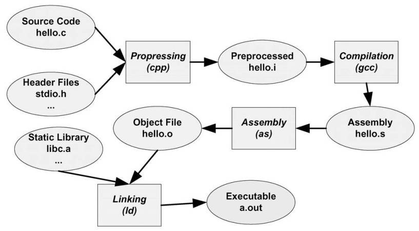
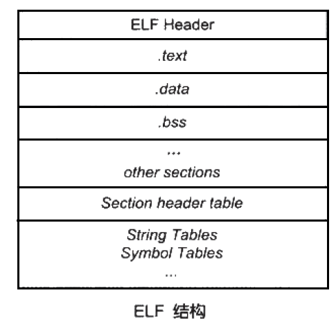
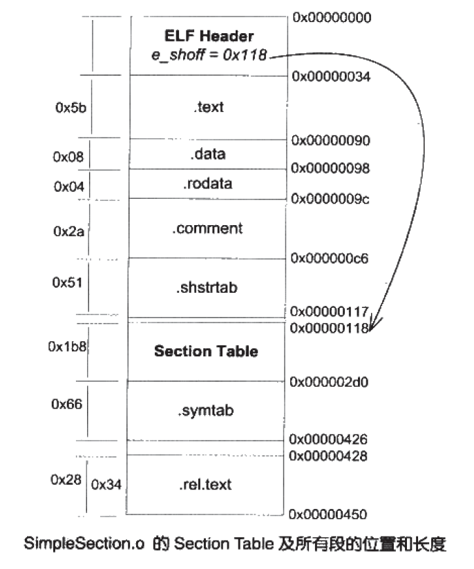
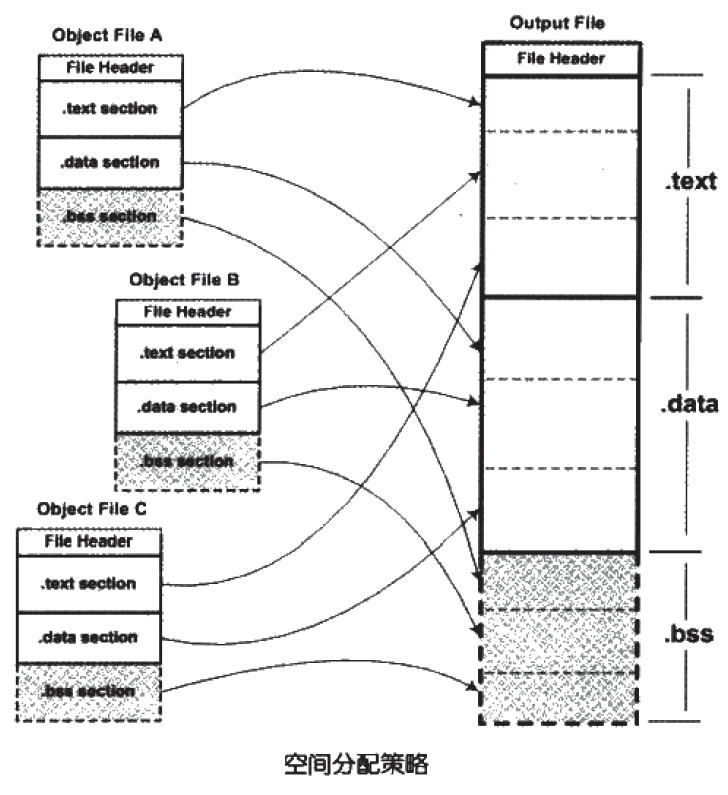
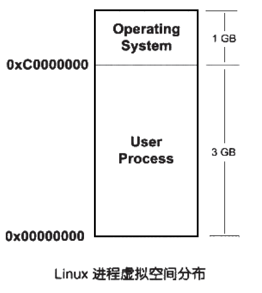
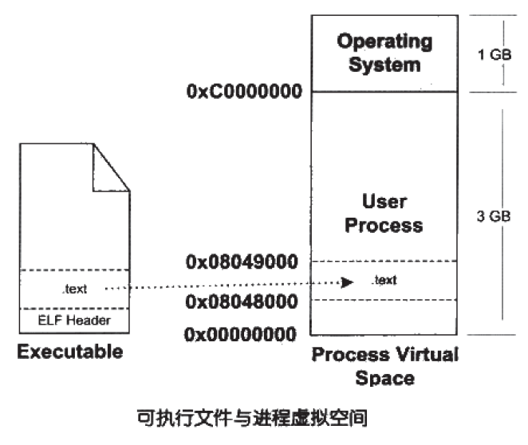
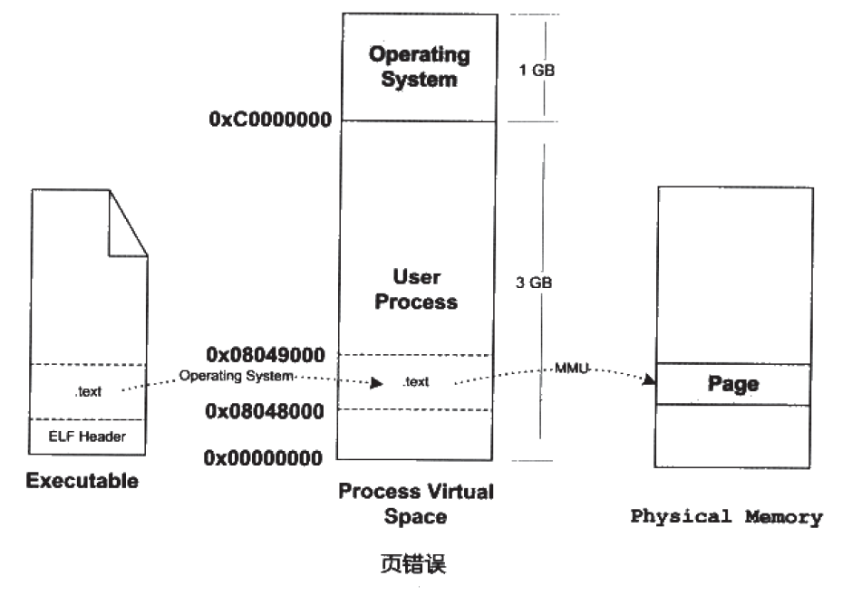
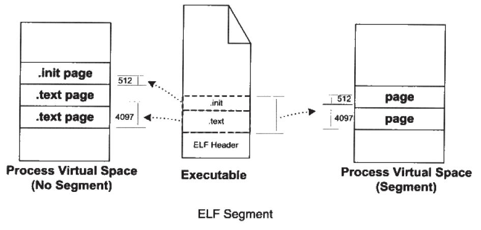
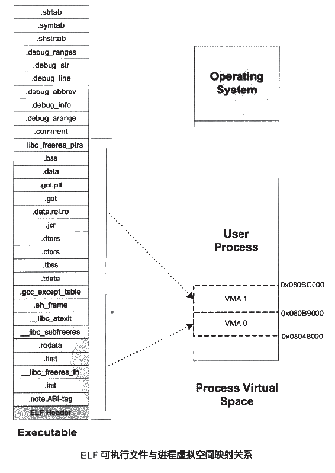
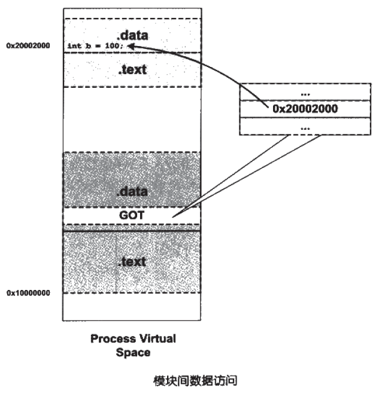

# 链接、装载和库

<!-- TOC -->

- [一、从代码到目标文件](#一从代码到目标文件)
    - [1. 预处理](#1-预处理)
    - [2. 编译](#2-编译)
    - [3. 汇编](#3-汇编)
    - [4. 链接](#4-链接)
- [二、目标文件](#二目标文件)
    - [1. 目标文件的格式](#1-目标文件的格式)
    - [2. ELF 文件的结构](#2-elf-文件的结构)
    - [2.1 ELF 文件的分段结构](#21-elf-文件的分段结构)
        - [2.2 代码段](#22-代码段)
        - [2.3 数据段和只读数据段](#23-数据段和只读数据段)
        - [2.4 BSS 段](#24-bss-段)
        - [2.5 其他与程序相关的段](#25-其他与程序相关的段)
        - [2.6 文件头](#26-文件头)
    - [3. 段表](#3-段表)
    - [4. 重定位表](#4-重定位表)
    - [5. 字符串表](#5-字符串表)
    - [6. 符号表](#6-符号表)
        - [6.1 符号类型](#61-符号类型)
        - [6.2 符号表结构](#62-符号表结构)
        - [6.3 特殊符号](#63-特殊符号)
        - [6.4 符号修饰](#64-符号修饰)
        - [6.5 强符号和弱符号](#65-强符号和弱符号)
        - [6.6 调试信息](#66-调试信息)
- [三、静态链接](#三静态链接)
    - [1. 空间和地址分配](#1-空间和地址分配)
    - [2. 符号解析与重定位](#2-符号解析与重定位)
    - [3. COMMON 块](#3-common-块)
- [四、装载](#四装载)
    - [1. 进程虚拟地址空间](#1-进程虚拟地址空间)
    - [2. 装载方式](#2-装载方式)
    - [3. 装载过程](#3-装载过程)
        - [3.1 进程的建立](#31-进程的建立)
        - [3.3 页错误](#33-页错误)
    - [4. 进程虚存空间分布](#4-进程虚存空间分布)
        - [4.1 ELF 文件链接视图和执行视图](#41-elf-文件链接视图和执行视图)
        - [4.2 堆和栈](#42-堆和栈)
- [五、动态链接](#五动态链接)
    - [1. 为什么需要动态链接？](#1-为什么需要动态链接)
    - [2. 举例说明动态链接](#2-举例说明动态链接)
    - [3. 地址无关代码](#3-地址无关代码)
        - [3.1 装载时重定位](#31-装载时重定位)
        - [3.2 地址无关代码](#32-地址无关代码)
    - [4. 延迟绑定（PLT）](#4-延迟绑定plt)
        - [4.1 动态链接会影响性能](#41-动态链接会影响性能)
        - [4.2 延迟绑定加快程序启动速度](#42-延迟绑定加快程序启动速度)
    - [5. 动态链接相关结构](#5-动态链接相关结构)
    - [6. 动态链接过程](#6-动态链接过程)

<!-- /TOC -->

## 一、从代码到目标文件

一般来说，C 源文件要成为可执行文件需要经过四个过程：**预处理、编译、汇编、链接**

<div align="center"></img></div>

### 1. 预处理

```
$ gcc -E hello.c -o hello.i
```

Linux 中预处理的结果为 `.i` 文件，主要是处理代码中以 `#` 开头的预编译指令，如 `#include`、`#define`，主要处理有：

- 展开所有 `#define` 定义的宏定义
- 处理所有条件编译指令，如 `#if`、`#ifdef`、`#elif`、`#else`、`#endif`
- 将 `#include` 中包含的文件插入到预编译指令的位置，该过程递归进行
- 删除所有注释 `/* */`、`//`
- 添加行号和文件名标识，便于调试及编译错误显示行号等
- 保留所有 `#pargma` 编译器指令，由编译器处理

### 2. 编译

```
$ gcc -S hello.i -o hello.s
```

编译过程是把预处理完成的文件进行一系列 **词法分析、语法分析、语义分析及优化** 最后生成相应的 `.s` 汇编代码文件

### 3. 汇编

```
$ gcc -c helloc.s -o hello.o
```

汇编是将汇编代码转变为机器可以执行的指令，每一条汇编代码几乎都对应一条机器指令，汇编完成生成 `.o` 目标文件

### 4. 链接

多个目标文件经过链接才能成为真正可执行的文件，这是因为复杂系统需要根据功能划分为不同模块，人们将各模块的代码单独的编译，然后按照要求最后 “组装” 起来，而这个组装的过程就叫做链接

链接过程主要包括了 **地址和空间分配(Address and Storage Allocation)、符号决议(Symbol Resolution)、重定位(Relocation)** 等步骤，有两种链接的方式，分别是 **静态链接和动态链接** ，这两种方式后面都会详细说明


## 二、目标文件

首先，我们要先知道源文件编译出的目标文件的内容，才能直到为什么需要链接？

### 1. 目标文件的格式

目标文件在不同平台有不同的格式，如 Windows 下的 PE(Portable Executable)、Linux 下的 ELF(Executable Linkable Format)，但是它们都是 COFF(Common file format) 格式的变种，本文主要以 ELF 为例说明目标文件的格式

其实，目标文件的格式和可执行文件格式几乎一样，不光如此，动态链接库(DLL，Dynamic Linking Library)和静态链接(Static Linking Library)也都按照可执行文件的格式存储，从广义的角度看，它们都是同一类型的文件

因此，ELF 文件标准中把系统中采用 ELF 格式的文件总结为以下 4 类：

| ELF 文件类型 | 说明 | 实例 |
| --- | --- | --- | --- |

### 2. ELF 文件的结构

### 2.1 ELF 文件的分段结构

目标文件 ELF 以 **段(Segment)** 的形式存储信息，其中主要的段有 `文件头（File Head）`、`代码段 .text`、`数据段 .data`、`只读数据段 .rodata`、`BSS段.bbs` 以及 `段表(Section Header Table)`、`重定位表(Relocation Table)`、`字符串表(String Table)`、`符号表(Symobol Table)` 等

下图是一个 ELF 目标文件的总体结构：

<div align="center"></img></div>

- 为什么要将 ELF 文件中的信息分段存储？

  1. 当程序被装载后，数据和指令分别被映射到两个虚存区域，由于数据区域对进程是可读写的，而指令区域是只读的，所以这两个虚存区域的权限可以被分别设置为可读写和只读的，这样可以放止程序指令区被改写，而 **具有相同访问权限的内容也可以放到同一段中**
  2. 分段有助于 **提交程序局部性，提交缓存的命中率**
  3. 分段有助于 **进程间的资源共享**。例如，当系统中运行多个程序的副本时，它们的指令都是一样的，所以内存中只需要一份该程序的指令部分，除指令部分外，其他只读数据如：程序中的图片、文本等都可作为共享的内容

下面我们以源文件 `SimpleSection.c` 为例对各个段进行说明：

```c
/*
 * SimpleSection.c
 *
 * Linux:
 *   gcc -c SimpleSection.c
 *
 * Windows:
 * cl SimpleSection.c /c /Za
 */

int printf( const char* format, ... );

int global_init_var = 84;
int global_uninit_var;

void func1( int i )
{
    printf( "%d\n", i );
}

int main( void )
{
    static int static_var = 85;
    static int static_var2;

    int a = 1;
    int b;

    func1( static_var + static_var2 + a + b );

    return a;
}
```

用 `gcc` 编译该文件，然后用 `objdump -h` 就可以看到目标文件的段信息：

> 正常情况下，本文分析的都是 32 位 intel x86 平台下的 ELF 文件格式

```
$ gcc -c SimpleSection.c
$ objdump -h SimpleSection.o

SimpleSection.o:     file format elf32-i386

Sections:
Idx Name              Size      VMA       LMA       File off  Algn
  0 .text             0000005b  00000000  00000000  00000034  2**0
                      CONTENTS, ALLOC, LOAD, RELOC, READONLY, CODE
  1 .data             00000008  00000000  00000000  00000090  2**2
                      CONTENTS, ALLOC, LOAD, DATA
  2 .bss              00000004  00000000  00000000  00000098  2**2
                      ALLOC
  3 .rodata           00000004  00000000  00000000  00000098  2**0
                      CONTENTS, ALLOC, LOAD, READONLY, DATA
  4 .comment          0000002a  00000000  00000000  0000009c  2**0
                      CONTENTS, READONLY
  5 .note.GNU-stack   00000000  00000000  00000000  000000c6  2**0
                      CONTENTS, READONLY
```

#### 2.2 代码段

可以用 `objdump -s -d SimpleSection.o` 查看目标文件中各段的具体内容

> - `-s` 参数会将所有段的内容以十六进制的方式打印出来
> - `-d` 参数会将指令段的内容反汇编显示

代码段一般以 `Content of section .text:` 标出，具体可以自行查看，代码段主要是程序中的所有指令，一般为只读内容

#### 2.3 数据段和只读数据段

```
$ objdump -x -s -d SimpleSection.o

......
Sections:
Idx Name              Size      VMA       LMA       File off  Algn
  1 .data             00000008  00000000  00000000  00000090  2**2
                      CONTENTS, ALLOC, LOAD, DATA
  3 .rodata           00000004  00000000  00000000  00000098  2**0
                      CONTENTS, ALLOC, LOAD, READONLY, DATA
......
Contents of section .data:
 0000 54000000 55000000          T...U...
Contents of section .rodata:
 0000 25640a00                   %d.. 
......
```

- `.data` 为数据段，保存的是 **已经初始化了的全局静态变量和局部静态变量**，如 `SimpleSection.c` 中 `global_init_varabal` 和 `static_var`，这两个变量每个 4 字节，一共刚好 8 字节，所以 `.data` 段大小为 8 字节

- `.rodata` 为只读数据段，一般保存程序中的 **只读变量(const)和字符串常量**，在 `SimpleSection.c` 中，我们在 `printf` 函数中用到了字符串字面量 `%d\n`，其大小为 4 字节，所以 `.rodata` 段大小刚好 4 字节，从输出的 ASCII 也能看出来只读数据段存储的是该字符串字面量

  操作系统在加载程序时会将 `.rodata` 段映射为只读，对于这个段的任何修改操作都会作为非法操作处理，这样不但在语义上支持 c 中的 const 关键字，而且也可以将程序中某些关键数据放置于此段来保证程序的安全性

#### 2.4 BSS 段

```
$ objdump -x -s -d SimpleSection.o

......
Sections:
Idx Name              Size      VMA       LMA       File off  Algn
  2 .bss              00000004  00000000  00000000  00000098  2**2
                      ALLOC
......
```

`.bss` 段存放的是 **未初始化的全局变量和局部静态变量**，但是对两种类型变量的存储方式有所不同（不同的原因参见 `第三章第3节：COMMON块`）：

- 对于 **未初始化的局部静态变量**，即是代码中的 `static_var2`，由于我们明确直到该变量定义于本编译单元内，所以保存时为它分配 4 个字节的空间
  > 其实准确来说，是预留了 4 个字节的空间，对于 `.bss` 这样的段来说，分配空间的意义只局限于虚拟地址空间，因为它在文件中并没有内容，具体原因参见 `第三章第1节`
- 而对于 **未初始化的全局变量**，在后文中我们可以知道，在编译阶段，由于我们无法确定该变量是引用外部的还是在本编译单元定义的，所以暂时无法为它分配空间，只保存一个符号，直到最终链接成可执行文件时再在 `.bss` 中分配空间

所以，我们可以看到 `objdump` 中 `.bss` 段只占 4 个字节的空间

- 那么，既然已经有了 `.data` 段存放程序数据，为什么还需要 `BSS` 段？

  BBS(Block Started by Symbol) 是为可执行文件更小，加载更快而设计的。

  我们知道 未初始化的全局变量和局部静态变量默认值都为 0，本来它们也可以被放入 `.data` 段，但是因为它们的值都是 0，所以为它们在 `.data` 分配空间并且存放数据 0 是没有必要的。程序在运行时它们的确需要占内存空间，但是在可执行文件中却没必要为它们分配内容空间，可执行文件中只是记录所有未初始化的全局变量和局部静态变量的大小总和，记为 `.bss` 段，所以 `.bss` 段只是为未初始化的全局变量和局部静态变量预留位置而已，它并没有内容，所以它在文件中也不占据空间

  假设有以下代码：

  ```
  static int x1 = 0;
  static int x2 = 1;
  ```

  那么 `x1` 会被放在 `.bss` 段，而 `x2` 被放在 `.data` 段，因为 `x1` 为0，可以被认为是未初始化的，因为未初始化的都是 0，所以被优化掉放在 `.bss` 段，这样可以减少可执行文件的大小，节省磁盘空间

#### 2.5 其他与程序相关的段

#### 2.6 文件头

ELF 目标文件格式的最前部是 **ELF 文件头（ELF Header）**，它描述了整个文件的基本属性，如 ELF 文件版本、目标机器型号、程序入口地址等。

可以通过 `readelf` 命令来详细查看 ELF 文件，`-h` 参数指示查看 ELF 文件头：

```
$ readelf -h SimpleSection.o

ELF Header:
  Magic:   7f 45 4c 46 01 01 01 00 00 00 00 00 00 00 00 00 
  Class:                             ELF32                          
  Data:                              2's complement, little endian
  Version:                           1 (current)
  OS/ABI:                            UNIX - System V
  ABI Version:                       0
  Type:                              REL (Relocatable file)
  Machine:                           Intel 80386
  Version:                           0x1                      # ELF 版本号，一般为 1
  Entry point address:               0x0                      # ELF 程序的入口虚拟地址，可重定位文件为 0
  Start of program headers:          0 (bytes into file)     
  Start of section headers:          280 (bytes into file)    # 段表在文件中的偏移
  Flags:                             0x0                      # 标志位，标识 ELF 文件平台相关的属性
  Size of this header:               52 (bytes)               # ELF 文件头本身大小
  Size of program headers:           0 (bytes)                 
  Number of program headers:         0
  Size of section headers:           40 (bytes)               # 段表描述符大小，段表中每条记录占的空间大小
  Number of section headers:         11                       # 段表描述符数量，相当于 ELF 文件中段的数量
  Section header string table index: 8                        # 段表字符串表所在的段在段表的下标
```

从输出结果看，ELF 文件头中定义了 **ELF 魔数、文件机器字节长度、数据存储方式、版本、运行平台、ABI 版本、ELF 重定位类型、硬件平台、硬件平台版本、入口地址、程序头入口和长度、段表位置和长度、段的数量** 等

ELF 头文件的数据结构和相关常量定义在 `/usr/include/elf.h` 文件中，ELF 文件有 32 版本和 64 版本，其在头文件中的数据结构分别定义为 `Elf32_Ehdr` 和 `Elf64_Ehdr`

- ELF 魔数 `Magic`

  ELF 文件头部最前面的 `Magic` 的 16 字节被 ELF 标准规定用来标识 ELF 文件的平台属性，如这个 ELF 字长（32/64位）、字节序、ELF 文件版本等信息。`readelf -h` 的输出中 `Class`、`Data`、`Version`、`OS/ABI`、`ABI Version` 显示的都是 `Magic` 中包含的信息

  ```
  Magic:   7f 45 4c 46 01 01 01 00 00 00 00 00 00 00 00 00 
  ```

  - **最开始的 4 个字节：7f 45 4c 46** 是所有 ELF 文件都必须相同的标识码：

    - 第一个字节对应 ASCII 字符里面的 DEL 控制符
    - 下来的三个字节刚好是 ELF 这三个字符的 ASCII 码

    这 4 个字节被称为 ELF 文件的魔数，几乎所有的可执行文件格式的最开始几个字节都是魔数，这种魔数用来确定文件类型，操作系统在加载可执行文件的时候会确认魔数是否正确，如果不正确会拒绝加载
  - **接下来的一个字节** 用来标识 ELF 的字长，`0x01` 表示 32 位，`0x02` 表示 64 位
  - **第 6 个字节** 是字节序，规定该 ELF 文件是大端还是小端存储
  - **第 7 个字节** 规定 ELF 文件的主版本号，一般为 1，因为 ELF 标准自 1.2 版之后再无更新
  - **后面 9 个字节** 标准无定义，一般为 0，有些平台用这 9 个字节作为拓展标志

- 文件类型 `Type`

  表示 ELF 文件类型，使用 ELF 格式的文件共有三种类型，每种文件类型对应一个常量，系统通过该常量判断 ELF 的真正文件类型，而不是通过文件的拓展名：

  | 常量 | 值 | 含义 |
  | --- | --- | --- |
  | ET_REL | 1 | 可重定位文件，一般为 `.o` 文件 |
  | ET_EXEC | 2 | 可执行文件 |
  | ET_DYN | 3 | 共享目标文件，一般为 `.so` 文件 |

- 机器类型 `Machine`

  ELF 文件格式被设计成可在多个平台下使用，但这并不代表同一个 ELF 文件可在不同平台下直接使用，而是表示不同平台下的 ELF 文件都遵循同一套 ELF 标准，一般最常见的常量值为 `EM_860`，其值为 `6`，表示 `Intel 80860` 平台

### 3. 段表

我们知道 ELF 文件中有各种各样的段，而 **段表（Section Header Table）** 就是保存这些段的属性的结构，其描述了 ELF 文件中各个段的信息，比如每个段的 **段名、段的长度、段在文件的位置（偏移量）、读写权限及段的其他信息**，编译器、链接器、装载器都是依靠段表来定位和访问各个段的属性的，而段表在 ELF 文件中的位置则由 ELF 文件头的 `e_shoff` 成员决定，在 `SimpleSection.o` 中，段表位于地址 `0x118`

可以使用 `readelf -S` 输出段表的内容，其中保存了 ELF 文件中所有的段：

```
$ readelf -S SimpleSection

There are 11 section headers, starting at offset 0x38d4:

Section Headers:
  [Nr] Name              Type            Addr     Off    Size   ES Flg Lk Inf Al
  [ 0]                   NULL            00000000 000000 000000 00  0   0   0   
  [ 1] .text             PROGBITS        00000000 000034 00005b 00  AX  0   0  4
  [ 2] .rel.text         REL             00000000 000428 000028 08      9   1  4
  [ 3] .data             PROGBITS        00000000 000090 000008 00  WA  0   0  4
  [ 4] .bss              NOBITS          00000000 000098 000004 00  WA  0   0  4
  [ 5] .rodata           PROGBITS        00000000 000098 000004 00  A   0   0  1
  [ 6] .comment          PROGBITS        00000000 00009c 00002a 00  0   0   1   
  [ 7] .note.GNU-stack   PROGBITS        00000000 0000c6 000000 00  0   0   1
  [ 8] .shstrtab         STRTAB          00000000 0000c6 000051 00  0   0   1   
  [ 9] .symtab           SYMTAB          00000000 0002d0 0000f0 10     10  10  4
  [10] .strtab           STRTAB          00000000 0003c0 000066 00  0   0   1   
Key to Flags:
  W (write), A (alloc), X (execute), M (merge), S (strings)
  I (info), L (link order), G (group), x (unknown)
  O (extra OS processing required) o (OS specific), p (processor specific)
```

段表是一个以 `Elf32_Shdr` 结构体为元素的数组，数组元素的个数等于段的个数，段描述符 `Elf32_Shdr` 被定义在 `/usr/include/elf.h` 中，对于 `SimpleSection.o` 来说，段表数组中有 11 个元素，其中第一个元素是无效的段描述符，其类型为 NULL，除此之外每个段描述符表示一个段，`SimpleSection.o` 中共有 10 个有效段

```
typedef struct
{
  Elf32_Word    sh_name;                // 段名字符串在 ".shstrtab" 中的偏移
  Elf32_Word    sh_type;                // 段的类型
  Elf32_Word    sh_flags;               // 段的标志位
  Elf32_Addr    sh_addr;                // 段虚拟地址
  Elf32_Off     sh_offset;              // 段在文件中的偏移
  Elf32_Word    sh_size;                // 段长度
  Elf32_Word    sh_link;                // 段链接信息
  Elf32_Word    sh_info;                // 段链接信息
  Elf32_Word    sh_addralign;           // 段地址对齐
  Elf32_Word    sh_entsize;             // 项的长度
} Elf32_Shdr;
```

下图中，`SectionTable` 长度为 `0x1b8`，也就是 440 个字节，它包含了 11 个段描述符，每个段描述符为 40 个字节，长度刚好为 `sizeof(Elf32_Shdr)`，符合段描述符的结构体长度；整个文件最后一个段 `.rel.text` 结束后，长度为 `0x450`，即为 1104 字节，刚好是 `SimpleSection.o` 的文件长度，中间 `SectionTable` 和 `.rel.text` 都因为对齐的原因，与前面段之间分别由一个字节和两个字节的间隔

<div align="center"></img></div>

- 段的类型 `sh_type`：指定段类型，如是无效段、代码段、符号表、重定位表等
- 段的标志位 `sh_flag`：表示该段在进程虚拟地址空间中的属性，如是否可写、是否可执行等
- 段的链接信息 `sh_link`、`sh_info`：若段的类型是与链接相关的（不论动态或静态链接），如重定位表、符号表等，那么 `sh_link` 和 `sh_info` 将指明该段使用的符号表和字符串表位置等信息

### 4. 重定位表

链接器在处理目标文件时，须要对目标文件中某些部位进行重定位，即代码段和数据段中那些对绝对地址的引用的位置。这些重定位的信息都记录在 ELF 文件的重定位表里面，对于每个须要重定位的代码段或数据段，都会有一个相应的重定位表。

`SimpleSection.o` 中的 `.rel.text` 就是针对 `.text` 段的重定位表，因为 `.text` 段中至少有一个绝对地址的引用，那就是对 `prinf` 函数的调用；而 `.data` 段则没有对绝对地址的引用，它只包含了几个常量，所以 `SimpleSection.o` 中没有针对 `.data` 段的重定位表 `rel.data`

一个重定位表同时也是 ELF 的一个段，其段类型(sh_type)是 `SHT_RET`，它的 `sh_link` 表示符号表的下标，`sh_info` 表示它作用于那个段，如 `.rel.text` 作用于 `.text` 段

### 5. 字符串表

ELF 文件中用到了很多字符串，如段名、变量名等，因为字符串的长度往往是不定的，用固定的结构来表示它比较困难，所以可以将字符串几种起来存放到一个表，然后使用字符串在表中的偏移来引用字符串。

字符串表在 ELF 文件中以段的形式保存，常见的段 `.strtab` 和 `.shstrtab`，分别表示字符串表和段表字符串表，顾名思义，字符串表用来保存普通的字符串，如符号的名字，段表字符串表用来保存段表中用到的字符串，如段名等

### 6. 符号表

#### 6.1 符号类型

链接过程正是基于符号表完成的，符号表（Symbol Table）中记录了目标文件中用到的所有符号，每个符号都有其对应的符号值（Symbol Value），对于变量和函数来说，符号值就是它们的地址，符号表中所有的符号可分为以下几类：

- 定义在本目标文件的全局符号，可以被其他目标文件引用
  
  如 `SimpleSection.o` 里的 `func1`、`main`、`global_init_val`

- 在本目标文件中引用的全局符号，但没有定义在本目标文件，即外部符号（External Symbol）

  如 `SimpleSection.o` 里的 `printf`

- 段名，由编译器产生，其值为段的起始地址

  如 `SimpleSection.o` 里的 `.text`、`.data` 等

- 局部符号，这类符号只在本编译单元内部可见，局部符号对链接过程无作用

  如 `SimpleSection.o` 中的 `static_var`、`static_var2`

- 行号信息，即目标指令与源代码中代码行的对应关系

对于链接过程，只关注上面的第一类、第二类符号，可以用 `nm SimpleSection.o` 查看符号表的内容

#### 6.2 符号表结构

ELF 文件的符号表名一般为 `.symtab`，符号表为 `Elf32_Sym` 结构的数组，`Elf32_Sym` 结构定义如下：

```
typedef struct
{
  Elf32_Word    st_name;                // 符号名
  Elf32_Addr    st_value;               // 符号值
  Elf32_Word    st_size;                // 符号大小
  unsigned char st_info;                // 符号类型和绑定信息
  unsigned char st_other;               // 为0，暂无用
  Elf32_Section st_shndx;               // 符号所在段
} Elf32_Sym;
```

#### 6.3 特殊符号

`ld` 链接器定义了很多特殊符号，你可以在代码中声明并使用它们，链接器会在程序最终链接成可执行文件时将其解析为正确的值

> Note：只有使用 `ld` 链接器时才有

- `__executable_start`：代码段起始地址
- `__etext` 或 `_etext` 或 `etext`：代码段结束地址
- `_edata` 或 `edata`：数据段结束地址
- `_end` 或 `end`：程序结束地址

上述符号的值都为装载时的虚拟地址

#### 6.4 符号修饰

以前，编译器编译源代码产生目标文件时，符号名与相应的变量或函数名一样，这样很容易会导致符号名冲突，因此 C++ 引入了符号修饰

##### 6.4.1 C++ 符号修饰

符号修饰即是 C++ 的源代码编译后的目标文件中所使用的符号名是相应的函数和变量的修饰后名称，C++ 编译器和链接器都使用符号来识别和处理函数和变量，所以对于不同函数签名的函数，即使函数名相同，编译器和链接器都认为它们是不同的函数，全局变量和静态变量名经过同样的修饰

由于不同的编译器采用不同的名字修饰方法，必然会导致由不同编译器编译产生的目标文件无法正常相互链接，这是导致不同编译器之间不能互操作的主要原因之一

##### 6.4.2 extern "C"

C++ 为了 C 兼容，定义了 `extern "C"` 关键字，C++ 编译器将在 `extern "C"` 的大括号内部代码当作 C 语言代码处理，所以在括号内，C++ 的名称修饰机制将不会起作用

但是，当我们在 C 语言程序包含 `string.h` 时，并用到了 `memset` 函数，编译器会将 memset 符号引用正确处理；但在 C++ 中，编译器会认为 `memset` 函数是个 C++ 函数，会对 `memset` 的符号进行修饰，这样链接器就无法与 C 语言库中的 `memset` 符号链接。所以，对于 C++ 来说，必须使用 `extern "C"` 关键字，但对 C 来说又不需要，如果为了兼容 C 语言和 C++ 语言定义两套头文件，太过麻烦

针对上面的问题，我们可以使用 `__cplusplus` 宏，C++ 编译器会在编译 C++ 的程序时默认定义这个宏，可以使用条件宏来判断当前编译单元是不是 C++ 代码：

```c
#ifdef __cplusplus
extern "C" {
#endif

void *memset(void *, int, size_t);

#ifdef __cplusplus
}
#endif
```

`__cplusplus` 的技巧几乎在所有的系统头文件里面都被用到

#### 6.5 强符号和弱符号

##### 6.5.1 强符号和弱符号

在链接多个目标文件，经常会出现符号重复定义的问题，如我们在目标文件 A 和目标文件 B 都定义了一个全局整型变量 global，并将它们都初始化，那么链接器将 A 和 B 进行链接时报错，这种符号的定义称为 **强符号（Strong Symbol）**，与之相对的是 **弱符号（Weak Symbol）**

- 编译器默认函数和初始化了的全局变量为强符号
- 未初始化的全局变量为弱符号，gcc 中可以通过 `__attribute__((weak))` 来定义一个强符号为弱符号

针对强弱符号的概念，链接器会按照如下规则处理与选择被多次定义的全局符号：

- 不允许强符号被多次定义，否则链接器报重复定义错误
- 强弱符号都有时，优先选择强符号
- 都是弱符号时，则选择其中占用空间最大的那个

##### 6.5.2 强引用和弱引用

- 强引用

  链接时，若没有找到该符号的定义，链接器会报符号未定义错误，该符号为 **强引用**

- 弱引用

  处理弱引用时，如果该符号有定义，则链接器将该符号的引用决议，如果该符号未定义，对于该引用并不报错，一般对于未定义的弱引用，链接器默认其值为 0，或者为一个特殊的值

  gcc 中可以通过 `__attribute__((weakref))` 声明一个引用为弱引用


这种弱符号和弱引用对于库来说十分有用。

- 比如库中定义的弱符号可以被用户定义的强符号所覆盖，从而使得程序可以使用自定义版本的库函数；
- 或者程序可以对某些扩展功能模块的引用定义为弱引用，当我们将扩展模块与程序链接在一起时， 功能模块就可以正常使用:如果我们去掉了某些功能模块，那么程序也可以正常链接，只是缺少了相应的功能，这使得程序的功能更加容易裁剪和组合。

#### 6.6 调试信息

`gcc -g` 时编译器会往产生的目标文件中加上调试信息，里面会多出许多 `debug` 相关的段

可以通过 `strip` 命令去掉 ELF 文件中的调试信息

## 三、静态链接

当我们有多个目标文件时，要经过静态链接才能链接成一个可执行文件

多个目标文件进行链接时，因为每个目标文件中都有多个段，链接器一般采用 **相似段合并** 的方法将相同性质的段合并到一起：

<div align="center"></img></div>

链接过程一般分为两步：

1. 第一步，空间与地址分配。

   链接器扫描所有的输入目标文件，获得它们的各个段的长度、属性和位置，并且将输入目标文件中的符号表中所有的符号定义和符号引用收集起来，统放到一一个全局符号表。这一步中， 链接器将能够获得所有输入目标文件的段长度，并且将它们合并，计算出输出文件中各个段合并后的长度与位置，并建立映射关系。

2. 第二步，符号解析与重定位。

   使用上面第一一步中收集到的所有信息，读取输入文件中段的数据、重定位信息，并且进行符号解析与重定位、调整代码中的地址等。事实上第二步是链接过程的核心，特别是重定位过程。

### 1. 空间和地址分配

链接器为目标文件分配地址和空间，其中的 **地址和空间** 其实有两个含义:

1. 第一个是在输出的可执行文件中的空间
2. 第二个是在装载后的虚拟地址中的虚拟地址空间
   
   对于有实际数据的段，比如 `.text` 和 `.data` 来说，它们在文件中和虚拟地址中都要分配空间，因为它们在这两者中都存在;而对于 `.bss` 这样的段来说，分配空间的意义只局限于虚拟地址空间，因为它在文件中并没有内容。
   
   事实上，我们在这里谈到的空间分配只关注于虚拟地址空间的分配，因为这个关系到链接器后面的关于地址计算的步骤，而可执行文件本身的空间分配与链接过程关系并不是很大。

### 2. 符号解析与重定位

前面我们说到了 **重定位表** 和 **符号表**，

- 符号表中记录定义了本目标文件中定义的全局变量和引用了外部的全局变量，即外部符号
 
  - 在对于本目标文件中定义的全局变量来说，地址已经确定了，它可能会被其他目标文件引用，成为其他目标文件中的外部符号

    **空间和地址分配** 完成之后，此时，输入文件的各个段在连接后的虚拟地址就已经确定了，链接器开始计算每个符号的虚拟地址，因为各个符号在段内的相对位置是固定的，所以符号地址即段地址加上相应的偏移量，符号地址确定后，链接器将其更新到全局的符号表内

  - 而外部符号因为定义在其他目标文件，其地址必须在链接时通过查询其他目标文件内的符号表得到

- 对于可重定位的 ELF 文件来说，必须包含重定位表，表中记录了相应段中需要被重定位的地方，即段中引用了外部符号的地方，被称为 **重定位入口**，每个需要被重定位的 ELF 段都有一个对应的重定位表，一个重定位表往往就是 ELF 文件中的一个段。

在链接器重定位之前，符号表中的外部符号地址均为编译器给的临时假地址，代码中使用到该符号的地方也以该假地址占位，当链接器需要对某个符号的引用进行重定位时，它就要确定这个符号的目标地址，这时链接器就会去查找由所有输入目标文件的符号表组成的全局符号表，找到相应的符号后进行重定位，同时，链接器会通过每个段的重定位表找到所有引用到该符号的指令的地址，然后对指令的地址进行更新

### 3. COMMON 块

在前面我们说过 `6.5 强符号和弱符号`，而且在 `2.4 BSS 段` 我们也提到了 **未初始化的全局变量** 和 **未初始化的局部静态变量** 虽然都到放在 `.bss` 段，但却只给未初始化的局部静态变量预留了空间

其实，对于 **未初始化的全局变量**，编译器将其作为弱符号处理，并将其标记为 COMMON 类型的变量，仅仅记录了该符号的类型所占空间的大小，而由于有强弱符号之分，所以允许同名符号的定义存在多个文件内，而由于目前链接器本身并不支持符号的类型，即变量类型对于链接器是透明的，所以会遇到一个问题：如果一个符号定义为多个目标文件中，而它们的类型又不相同，该如何处理？所以，链接器制定了以下规则：

- 两个或两个以上强符号类型不一致：

  多强符号定义本身是非法的，因此链接器报重定义错误

- 有一个强符号，其他都是弱符号，出现类型不一致

  此时最终输出结果中的符号所占空间与强符号相同

- 两个或两个以上弱符号类型不一致

  此时，COMMON 机制发挥作用，最终链接后输出的文件中，以弱符号中所占空间最大的那个为准

因为 **未初始化的全局变量** 属于弱符号，当编译器将一个编译单元编译成目标文件的时候，如果该编译单元包含了弱符号，那么该弱符号最终所占空间的大小在此时是未知的，因为有可能其他编译单元中该符号所占的空间比本编译单元该符号所占的空间要大。所以编译器此时无法为该弱符号在 `BSS` 段分配空间，因为所须要空间的大小未知。但是链接器在链接过程中可以确定弱符号的大小，因为当链接器读取所有输入目标文件以后，任何一个弱符号的最终大小都可以确定了，所以它可以在最终输出文件的 `BSS` 段为其分配空间。所以总体来看，未初始化全局变量最终还是被放在 `BSS` 段的。

## 四、装载

### 1. 进程虚拟地址空间

可执行文件只有装载到内存以后才能被 CPU 执行，每个程序运行起来以后，都将拥有自己独立的 **虚拟地址空间（Virtual Address Space）**，这个虚拟地址空间的大小由计算机的硬件平台决定，如 32 位 CPU 决定了虚拟地址空间的地址为 0 到 2<sup>32</sup>-1，64 位硬件平台具有 64 位寻址能力，他的虚拟地址空间为 0 ~ 2<sup>64</sup>-1

进程的整个虚拟地址空间可分为两部分：用户空间和内核空间。进程只能使用那些操作系统分配给进程的地址，如果访问未经允许的空间，操作系统将视为非法访问，并强制结束进程

<div align="center"></img></div>

以 32 位平台为例，4 GB 的进程虚拟地址空间中，操作系统占用了 0xC0000000~0xFFFFFFFF，共 1 GB，剩余的 0x00000000~0xBFFFFFFF 共 3 GB 是留给进程使用的

虽然每个进程都有各自的独立的虚拟内存，但是每个虚拟内存中的内核地址，其实关联的都是相同的物理内存，进程切换到内核态后，就可以很方便的访问内核空间内存：

<div align="center"></img></div>

### 2. 装载方式

前面说了，可执行文件只有装载到内存中才能运行，最简单的载入办法就是将程序运行所需的指令和数据全部装入内存，这样程序就可以运行了，但是现实是很多程序需要的内存往往大于物理内存的数量。

我们可以利用程序的局部性原理，将程序最常用的部分放入内存，暂时不用的模块放在磁盘上，等将来用到再载入，这即是 **动态装入** 的思想

动态载入的基本元素是页，分页是操作系统管理虚拟内存的基本方式，其基本思想是：将内存和所有磁盘中的数据和指令按照 **页（Page）** 为单位划分为若干页，以后所有的装载和操作的单位就是页，目前，硬件规定的页的大小有 4096 字节、8192 字节、2 MB、4 MB 等

关于分页的详细内容，查看 [内存管理](内存管理.md)

### 3. 装载过程

#### 3.1 进程的建立

从操作系统的角度来看，一个进程最关键的特征是它拥有独立的虚拟地址空间，这使得它有别于其他进程。一个程序被执行同时都伴随着一个新的进程的创建

在有虚拟存储的情况下，创建一个进程，然后装载相应的可执行文件并且执行，这个过程只需要做三件事：

1. 创建一个独立的虚拟地址空间

   虚拟空间由一组页映射函数将虚拟空间的各个页映射至相应的物理空间，创建一个虚拟空间实际上并不是创建空间而是创建映射函数所需要的相应的数据结构，在 Linux 下，创建虚拟地址空间实际上只是分配一个页目录，甚至不需要设置页映射关系，映射关系等到后面程序发生页错误的时候再进行设置
 
2. 读取可执行文件头，并且建立虚拟空间与可执行文件的映射关系

   第一步的页映射关系函数是虚拟空间到物理内存的映射关系，这一步所做的是虚拟空间与可执行文件的映射关系。
   
   我们知道，当程序执行发生页错误时，操作系统将从物理内存中分配一个物理页，然后将该缺页从磁盘中读取到内存中，再设置缺页的虚拟页和物理页的映射关系，这样程序才得以正常运行。但是很明显的一点是，当操作系统捕获到缺页错误时，它应知道程序当前所需要的页在可执行文件中的哪一个位置。这就是虚拟空间与可执行文件之间的映射关系。
   
   从某种角度来看，这一步是整个装载过程中最重要的一一步，也是传统意义上 **装载** 的过程。

   <div align="center"></img></div>

   如上图，ELF 可执行文件中的 `.text` 段映射到进程用户空间的某一段，该段叫做 **虚拟内存区域（VMA, Virtual Memory Area）**，操作系统创建进程后，会在进程相应的数据结构中设置一个 `.text` 段的 VMA，它对应于 ELF 文件中的 `.text` 段，这种映射关系只是保存在操作系统内部的一个数据结构

   操作系统在内部保存映射关系的数据结构，这样当程序发生页错误时，可以通过查看该数据结构来定位错误页在在可执行文件中的位置

3. 将 CPU 的指令寄存器设置成可执行文件的入口地址，启动运行

   在这一步中，操作系统通过设置 CPU 的指令寄存器将控制权转交给进程，进程开始执行

#### 3.3 页错误

其实上述三个步骤执行完毕后，可执行文件的真正指令和数据都还没有装入内存，操作系统只是通过可执行文件头部的信息建立其可执行文件和进程虚存之间的映射关系而已

<div align="center"></img></div>

以上图为例，程序的入口地址为 0x08048000，刚好是 `.text` 段的起始地址。当CPU开始打算执行这个地址的指令时，发现页面0x08048000~0x08049000 是个空页面，于是产生一个页错误(Page Fault)。

CPU 将控制权交给操作系统，操作系统有专门的页错误处理程序来处理这种情况：操作系统将查询装载过程的第二步建立的映射数据结构，然后找到空页面所在的 VMA，计算出相应的页面在可执行文件中的偏移，然后在物理内存中分配一个物理页面供可执行文件载入，将进程中该虚拟页与分配的物理页之间建立映射关系，然后把控制权再还回给进程，进程从刚才页错误的位置重新开始执行

随着进程的执行，页错误也会不断地产生，操作系统也会为进程分配相应的物理页面来满足进程执行的需求，当然有可能进程所需要的内存会超过可用的内存数量，特别是在有多个进程同时执行的时候，这时候操作系统就需要精心组织和分配物理内存，甚至将已分配给进程的物理内存暂时收回，这就涉及到了操作系统的虚拟内存管理。

### 4. 进程虚存空间分布

#### 4.1 ELF 文件链接视图和执行视图

从前文我们知道 ELF 文件中有很多段，相对应的进程的地址空间也由很多 VMA，即虚拟段组成，在二者映射过程中，为了节省内存，于是 **对于相同权限的段，把它们合并在一起当作一个段映射**，其实 ELF 文件中的段按照权限不同可分为三类：

- 以代码段为代表的可读可执行的段
- 以数据段和 BSS 段为代表的可读可写的段
- 以只读数据段为代表的权限为只读的段

<div align="center"></img></div>

ELF 可执行文件引入了一个概念 `Segment`，一个 `Segment` 包含一个或多个属性类似的 `Section`，比如：上图中将 `.text` 段和 `.init` 段合并在一起看作是一个 `Segment`，那么装载时就可以将它们看作一个整体一起映射，也是说映射之后再进程虚存空间中只有一个相对应的 VMA，而不是两个，这样做可以明显减少页面内存碎片，从而节省内存空间

`Segment` 和 `Section` 是从不同角度来划分同一个 ELF 文件，这在 ELF 中称为不同的视图，从 `Section` 来看 ELF 文件就是 **链接视图（Linking View）**，从 `Segment` 来看就是 **执行视图（Execution View）**

#### 4.2 堆和栈

操作系统使用 VMA 对进程的地址空间进行管理，我们知道进程的地址空间中除了 ELF 文件中的各个 `Segment` 外，还有 **堆（Heap）**、**栈（Stack）** 等空间，一个进程中的堆和栈其实也是一个 VMA，而堆栈所处的 VMA 被称为 **匿名虚拟内存区域（Anonymous Virtual Memory Area）**

> 值得一提的是，进程在刚开始启动时，需要知道一些进程运行的环境，最基本的就是系统环境变量和进程的运行参数，常见的作法是：操作系统在进程启动前将这些信息提交保存到进程的虚拟空间的栈中，即 `Stack VMA`

Linux 下通过 `/proc` 目录可以查看进程的虚拟空间分布

综上：操作系统通过给进程空间划分出一个个 VMA 来管理进程的虚拟空间；基本原则是将相同权限属性、有相同映像文件的映射成一个 VMA，一个进程基本上可以分为如下几种 VMA 区域：

- 代码 VMA，权限只读、可执行；有映像文件
- 数据 VMA，权限可读写、可执行；有映像文件
- 堆 VMA，权限可读写、可执行；无映像文件，匿名，可向上拓展
- 栈 VMA，权限可读写、不可执行；无映像文件，匿名，可向下拓展

一个常见进程的虚拟空间如下图所示：

<div align="center"></img></div>

## 五、动态链接

### 1. 为什么需要动态链接？

静态链接方法简单，实现容易。但是还是有一些问题：

1. 静态链接对内存和磁盘空间浪费严重

   在多进程操作系统中，在仅有静态链接的情况下，每个程序内都除了保留 `printf`、`scanf`、`strlen` 这样的公用函数，还有数量可观的其他库函数及它们所需的辅助数据结构

2. 静态链接对程序的更新、部署和发布不友好

   静态链接下一旦程序中有任何模块更新，整个程序就要重新连接、发布给用户

解决这两个问题的办法就是：把程序的模块相互分割开来，形成独立的文件，不对它们进行静态链接，而等到程序要运行时才进行链接，也就是说，将链接这个过程从装载前推迟到了装载时再进行，这就是 **动态链接** 的基本思想

> 需要说明的是，多个进程共享的是共享库的只读部分，共享库的可修改部分在每个进程中都有自己的副本

Linux 中，ELF 动态链接文件被称为 **动态共享对象（DSO, Dynamic Shared Objects）**，简称 **共享对象**，一般为 `.so` 为拓展名的文件，Windows被称为 **动态链接库（Dynamic Linking Libray）**，拓展名为 `.dll`

> Linux 中，C 语言运行时库为 glibc，其动态链接形式保存在 `/lib/libc.so`。整个系统中保留一份 C 语言库的动态链接文件，而所有的 C 语言编写的、动态链接的程序都可以在运行时使用它。当程序被装载的时候，系统的动态链接器会将程序所需要的所有动态链接库装载到进程的地址空间，并且将程序中所有为决议的符号绑定到相应的动态链接库中，并进行重定位工作

### 2. 举例说明动态链接

以两个程序 `Program1` 和 `Program2` 对动态链接进行演示，源代码 `Program1.c`、`Program2.c`、`Lib.c`、`Lib.h` 如下：

```c
/* Program1.c */
#include "Lib.h"

int main()
{
    foobar();
    return 0;
}

/* Program2.c */
#include "Lib.h"

int main()
{
    foobar(2);
    return 0;
}

/* Lib.c */
#include <stdio.h>

void foobar(int i)
{
    printf("Printing from Lib.so %d\n", i);
}

/* Lib.h */
#ifndef LIB_H
#define LIB_H

void foobar(int i);

#endif
```

该程序的两个模块 `Program1.c` 和 `Program2.c` 分别调用了 `Lib.c` 里面的 `foobar` 函数，使用 `gcc` 将 `Lib.c` 编译为一个共享对象文件：

```
$ gcc -fPIC -shared -o Lib.so Lib.c
```

> - `-shared` 表示产生共享对象
> - `-fPIC` 产生地址无关代码

接着，分别编译程序 `Program1` 和 `Program2`：

```
$ gcc -o Program1 Program1.c ./Lib.so
$ gcc -o Program2 Program2.c ./Lib.so
```

当链接器将 Program1.o 链接成可执行文件时，这时候链接器必须确定所引用的 foobar() 函数的性质，如果 foobar() 是一个定义于其他静态目标模块中的函数，那么链接器将会按照静态链接的规则，将 Program1.o 中的 foobar 地址引用重定向；如果 foobar() 是一个定义在某个动态共享对象中的函数，那么链接器就会将这个符号的引用标记为一个动态链接的符号，不对它进行地址重定位，把这个过程留到装载时再进行。

链接器如何知道 foobar 的引用是一个静态符号还是一个动态符号？

这实际上就是我们要用到Lib.so的原因。Lib.so 中保存了完整的符号信息(因为运行时进行动态链接还须使用符号信息)，把Lib.so也作为链接的输入文件之一，链接器在解柝符号时就可以知道: foobar是一个定 义在Lib.so的动态符号。这样链接器就可以对foobar 的引用做特殊的处理，使它成为一个对动态符号的引用。

Linux 下的动态链接器为 `ld`，动态链接时，操作系统会将目标文件、所有共享对象以及动态链接器 `ld` 都以同样的方式 **映射到同一个进程的地址空间**，只是它们所占据的虚拟地址和长度不同

在系统开始运行 `Program1` 之前，首先会把控制权交给动态链接器，由它完成所有的动态链接工作以后再把控制权交给 `Program1`，然后开始执行，共享对象的最终装载地址再编译时是不确定的，而是在装载时，装载器根据当前地址空间的空闲情况，动态分配一块足够大小的虚拟地址空间给相应的共享对象

### 3. 地址无关代码

本节，我们要解决的问题是：**共享对象在被加载时，如何确定它在进程虚拟地址空间中的位置？**

前面提到：程序模块的指令和数据中可能会包含一些绝对地址的引用，我们在链接产生输出文件时，就要假设模块被装载的目标地址，然后基于模块被加载的位置对绝对地址进行重定位，一般来说，可执行文件往往是第一个被加载进进程虚拟空间的，因此被加载的位置一般都可以确定，比如 Linux 下一般都是 0x08040000，而共享对象因为可能会被多个进程使用，每个进程的虚拟地址空间内容不同，被加载的位置也不同，显然我们没法确定某个共享对象在进程中被加载的位置，所以，我们必须考虑实现一种机制，使得共享对象可以在任意地址加载，即 **共享对象在编译时不能假设自己在进程虚拟地址空间中的位置**

#### 3.1 装载时重定位

 先考虑一种方法，其基本思路是：在链接时，对所有的绝对地址的引用不做重定位，而把这一步推迟到装载时再完成，一旦模块装载地址确定，即目标地址确定，那么系统就对程序中所有的绝对地址引用进行重定位，这种方法可以称之为 **装载时进行基址重定位**

 其实，这种方法对于共享对象来说并不合适：动态链接模块被装载映射至虚拟空间后，指令部分是在多个进程之间共享的，由于装载时重定位的方法需要修改指令，所以没有办法做到同一份指令被多个进程共享，因为指令被重定位后对于每个进程来讲是不同的，当然，动态链接库中的可修改数据部分对于不同的进程来说有多个副本，所以它们可以采用装载时重定位的方法来解决

 使用 `gcc` 如果仅指定 `-shared` 参数，那么输出的共享对象就是使用装载时重定位的方法

#### 3.2 地址无关代码

##### 3.2.1 地址无关代码的基本情况

装载时重定位导致共享对象的指令部分无法在多个进程之间共享，这样就失去了动态链接节省内存的优势。

下来让我们考虑另一种方法，即 **地址无关代码(PIC, Position-independent Code)** 技术，其基本思想是：把指令中那些需要被修改的部分分离出来，跟数据部分放在一起，这样指令部分就可以保持不变，而数据部分可以在每个进程中拥有一个副本

我们把共享对象模块中的地址引用按照是否为跨模块分成两类：模块内部引用和模块外部引用；按照不同的引用方式又可以分为指令引用和数据访问：

1. 第一种是模块内部的函数调用、跳转等
2. 第二种是模块内部的数据访问，比如模块中定义的全局变量、静态变量

   类型 1 和类型 2 都属于模块内部调用，在 ELF 文件的设计下，若被调用这和调用者在同一模块内时，只要调用者和被调用者两者之间的相对地址不发生改变，那么无论模块整体被放在什么位置，它们的引用都是地址无关的

3. 第三种是模块外部的函数调用、跳转
4. 第四种是模块外部的数据访问，如其他模块定义的全局变量

   类型 3 和类型 4 都是模块间的相互访问，显然，引用的其他模块的全局变量的地址是跟模块装载地址有关的，的要使其做到代码地址无关，其基本思想是：把跟地址相关的部分放到数据段里面，ELF 的做法是在数据段里面建立一个指向这些变量的指针数组，也被称为 **全局偏移表（Global Offset Table, GOT）**，当代码需要引用该全局变量时，可以通过 GOT 中相对应的项间接引用，其基本机制如下图：

   <div align="center"></img></div>

   链接器在装载模块的时候会查找每个变量所在的地址，然后填充 GOT 中的各个项，以确保每个指针所指向的地址正确，由于 GOT 本身是放在数据段，所以它可以在模块装载时修改，并且每个进程都有独立的副本，相互不受影响，当指令要访问变量 b 时，程序会先找到 GOT，然后根据 GOT 中变量所对应的项找到变量的目标地址

##### 3.2.2 共享模块的全局变量问题

前面的讨论基本解决了 90% 的问题，但是还有一种特殊情况需要讨论：即 **共享模块的全局变量问题**

当一个模块引用了一个定义在共享对象的全局变量的时候，比如一个共享对象定义了一个全局变量 global，而模块 `module.c` 中是怎么引用的：

```c
extern int global;
int foo()
{
    global = 1;
}
```

当编译器编译 `module.c` 时，它无法根据上下文判断 `global` 是定义在同一个模块的其他目标文件中还是定义在另外一个共享对象之中，即无法判断是否为跨模块间的调用

解决办法只有一个：ELF 共享库在编译时，默认都把定义在模块内部的全局变量当作定义在其他模块的全局变量，也就是说当作前面的类型四，通过 GOT 来实现变量访问

### 4. 延迟绑定（PLT）

#### 4.1 动态链接会影响性能

动态链接比静态链接更加灵活，更加节省空间，然后这却是以牺牲一部分性能为代价的，一般来说，动态链接要比静态链接慢，主要原因有两点：

1. 动态链接下对于模块间数据访问和函数调用都要先经过 GOT 定位，然后简介寻址，如此，程序的运行速度必然会减慢
2. 动态链接的链接工作是在运行时完成，即程序开始执行时，动态链接都要进行一次链接工作，这会减慢程序启动速度

#### 4.2 延迟绑定加快程序启动速度

ELF 采用了叫做 **延迟绑定的做法** 来解决上面的第二条原因，其基本思想是：当函数第一次被用到时才进行绑定（符号查找、重定位），如果没有用到则不进行绑定，所以当程序开始执行时，模块间的函数调用都没有进行绑定，而是需要用到时才由动态链接器来负责绑定，这样就可以大大加快程序的启动速度，特别有利于一些有大量函数引用和大量模块的程序

### 5. 动态链接相关结构

### 6. 动态链接过程
