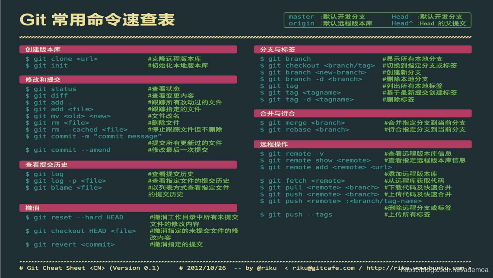

# Git

TODO：Git的构架

<details>
<summary>cheatsheet</summary>



| 命令 | 说明 | 示例 |
| --- | --- | --- |
| `git init` | 当前文件夹下建立git仓库 |  |
| `git clone <address>` | 给定地址的git仓库克隆到本地 |  |
| `git status` | 
| `git add <file>` | 将修改提交到暂存区 |  |
| `git add *` | 
| `git rm file.txt` | 从git仓库删除文件并且将删除信息直接写入暂存区 |
| `git commit -m "msg"` | 提交到本地代码库 |
| `git commit -m "msg" -a` | 将工作区还未提交到暂存区的修改一并提交到本地代码库，但不会提交工作区新建的文件 |
| `git push my-remote my-branch` | 推送提交到远程仓库 |
| `git pull my-remote my-branch` | 
| `git diff` | 查看工作区的修改 | 
| `git diff --cached` | 查看暂存区的修改
| `git diff branch1` | 对比当前工作目录与branch1
| `git diff branch1 file1` | 对比当前工作目录中file1与branch1分支中的file1 |
| `git diff branch1 branch2` | 对比两个分支的差异 |
| `git remote` | 
| `git remote -v` |
| `git remote add my-remote <address>` |
| `git remote add myrepo /tmp/myrepo` | 为常用远程库起别名 |
| `git reset file.txt` | 
| `git branch` | 查看分支列表 |
| `git branch my-branch` | 创建my-branch分支 | 
| `git branch -d my-branch` | 删除不再需要的my-branch分支，只能删除已经被当前分支合并的分支 |
| `git branch -D my-branch` | 强制删除my-branch分支 |
| `git checkout my-branch` | 切换分支 |
| `git merge my-branch -m "this is comment"` | 合并分支my-branch到当前分支 |
| `git log` | 查看提交日志 |
| `git log -p master..` |
| `git log --stat` | 查看log时显示每个提交中那些文件修改了多少行内容 |
| `git log --pretty=oneline` | 按某种格式格式化日志输出，如oneline、short |
| `git log --graph --pretty=oneline` | 可视化你的提交图 |
| `git log --pretty=format:'%h : %s' [--topo-order] [--reverse] --graph` |  |
| `git tag` | 显示所有tags |
| `git tag -a v1.0 -m 'msg'` | 
| `git show v1.0` |
| `git tag --delete v1.0` |
| `git push --delete my-remote v1.0` |
| `git push my-remote my-branch v1.0` |
| `git fetch --tags` |
| `git stash` | 将所有未commit的修改(包括暂存和未暂存的)都保存起来 |
| `git stash -u` | 
| `git stash save "msg"` |
| `git stash list` |
| `git stash pop` |
| `git stash stash@{2}` |
| `git stash show` | 
| `git stash apply` |
| `git stash branch my-branch stash@{1}` |
| `git stash drop stash@{1}` |
| `git stash clear` |

</details>


<details>
<summary>基本操作</summary>

### 生成SSH秘钥

```
ssh-keygen -t rsa -C "754657908@qq.com"
cat ~/.ssh/id_rsa.pub 配置到 Github
ssh git@github.com
```
### 基本操作

```
git init  //初始化Git仓库
git clone //克隆远程库到本地
git status  //查看当前git仓库状态

```
### 工作区修改提交到缓存区

```
git add file1 file2
  -all 添加所有修改
git rm file  //从Git仓库删除文件并且将删除信息直接写入缓存区
```

### 缓存区修改提交到本地库

```
git commit -m "xxx"   //提交到本地代码库 -m 注释(必需)
  -a 将工作区未提交的修改一并提交到本地代码库，但-a不会提交工作区新建的文件
```
### 查看修改

```
git diff 查看工作区的修改
git diff --cached 查看缓存区的修改
git diff branch1  查看当前工作目录与另一个分支的区别
git diff branch1 file1  比较当前工作目录file1与branch1分支中的file1
git diff branch1 branch2  查看两个分支的差异
```

### 更新代码

```
git pull origin master  //远程库同步到本地库
```

### 上传代码 

```
git push -u origin master  //本地库同步到远程库
```

### 添加远程库并下载代码

```
git remote add origin git@github.com:lhgaaa/xxxx
git pull origin master
```
### 常用远程库起别名
```
git remote add myrepo /tmp/myrepo
```

### 分支

```
git branch xxx  //创建名为xxx的分支
git branch  //查看当前所处分支
git checkout xxx  //切换到xxx分支
git merge -m "there is comment" xxx  //将xxx分支的修改合并到当前分支 
git branch -d xxx  //删除不再需要的分支xxx，只能删除已经被当前分支合并的分支
git branch -D xxx  //强制删除xxx分支
git reset --hard HEAD^  //回复到合并前当前分支的内容
```

### 分布式开发

### 日志

```
git log  //查看提交记录日志
git log -p master..
git log --stat  //查看log时显示每个提交中那些文件修改了多少行内容
git log --pretty=oneline  //按某种格式格式化日志输出，如oneline、short
git log --graph --pretty=oneline  //可视化你的提交图
git help log  //git log帮助
git log --pretty=format:'%h : %s' [--topo-order] [--reverse] --graph
```

</details>

<details>
<summary>设置Git用户名、密码、email</summary>

- 全局配置

  ```
  git config --global user.name "xxx"
  git config --global user.email "xxx@xxx.com"
  ```

  查看全局配置文件`~/.gitconfig`

  ```
  cat ~/.gitconfig
  配置方法：git config --global <配置名称> <配置的值>
  ```

- 项目配置

  ```
  git config user.name "xxx"
  git config user.email "xxx@xxx.com"
  ```
  查看项目配置文件`<Git_Project>/.git/config`

</details>

<details>
<summary>为github生成ssh秘钥</summary>

```
ssh-keygen -t rsa -C "754657908@qq.com"
cat ~/.ssh/id_rsa.pub 配置到 Github
ssh git@github.com
```

</details>

<details>
<summary>Git解决每次提交都需要输入用户名和密码</summary>

```
git config --global credential.helper store
```

</details>

<details>
<summary>Git恢复修改的文件</summary>

分三种情况处理：

- 只是修改了文件，没有任何git操作

  ```
  git checkout -- aaa.txt  # aaa.txt 为修改的文件
  ```

- 修改了文件，并提交到暂存区(即已经 git add 但没有 git commit )

  ```
  git log --oneline  # 可以省略
  git reset HEAD     # 回退到当前版本
  git checkout --- aaa.txt  # aaa.txt 为修改的文件
  ```

- 修改了文件，并提交到了仓库区(即不但 git add 而且 git commit )

  ```
  git log --oneline  # 可以省略
  git reset HEAD^    # 回退当上一个版本
  git checkout -- aaa.txt  # aaa.txt 为修改的文件
  ```

## 参考：

- [恢复修改的文件](https://www.cnblogs.com/liuq/p/9203087.html)

</details>

<details>
<summary>设置提交忽略文件.gitignore</summary>

配置语法：

- 以斜杠“/”开头表示目录；
- 以星号“*”通配多个字符；
- 以问号“?”通配单个字符
- 以方括号“[]”包含单个字符的匹配列表；
- 以叹号“!”表示不忽略(跟踪)匹配到的文件或目录；

示例如下：
```
# 以'#'开始的行，被视为注释.

# 忽略掉所有文件名是foo.txt的文件.
foo.txt

# 忽略某个具体文件
/mtk/foo.txt

# 忽略整个文件夹
/mtk/

# 忽略所有生成的 html文件,
*.html

# foo.html是手工维护的，所以例外.
!foo.html

# 忽略所有.o和 .a文件.
*.[oa]

```


## Note

如果你不慎在创建.gitignore文件之前就push了项目，那么即使你在.gitignore文件中写入新的过滤规则，这些规则也不会起作用，Git仍然会对所有文件进行版本管理。

简单来说，出现这种问题的原因就是Git已经开始管理这些文件了，所以你无法再通过过滤规则过滤它们。因此一定要养成在项目开始就创建.gitignore文件的习惯，否则一旦push，处理起来会非常麻烦。


</details>

<details>
<summary>如果想要过滤某个已经push的文件，该怎么办？</summary>

- 1.执行下面命令
  ```
  git rm --cached <path>
  如果是文件夹，执行：
  git rm -r --cached <path>
  如果设置后无法生效，可以清理尝试清理全部缓存：
  git rm -r --cached .

  git add .
  git commit -m "update .gitignore"
  ```
- 2.更新".gitignore"文件，添加需要忽略的文件
- 3.commit

# 参考

- [参考教程](https://www.jianshu.com/p/e5b13480479b)

</details>

<details>
<summary>为git设置代理</summary>

git clone有两种形式：

- HTTP形式：
  ```
  git clone https://github.com/owner/git.git
  ```

- SSH形式：
  ```
  git clone git@github.com:owner/git.git
  ```

两种方式要分别设置代理：

- HTTP形式：

  走HTTP代理：
  ```
  git config --global http.proxy "http://127.0.0.1:8080"
  git config --global https.proxy "http://127.0.0.1:8080"
  ```

  走sock5代理：
  ```
  git config --global http.proxy "socks5://127.0.0.1:1080"
  git config --global https.proxy "socks5://127.0.0.1:1080"
  ```

  取消设置：
  ```
  git config --global --unset http.proxy
  git config --global --unset https.proxy
  ```
- SSH形式：

  修改`~/.ssh/config`文件(不存在则新建)：
  ```
  # 必须是 github.com
  Host github.com
    HostName github.com
    User git
    # 走 HTTP 代理
    # ProxyCommand socat - PROXY:127.0.0.1:%h:%p,proxyport=8080
    # 走 socks5 代理（如 Shadowsocks）
    # ProxyCommand nc -v -x 127.0.0.1:1080 %h %p
  ```

</details>

<details>
<summary>GitHub中修改用户名和仓库名，本地需要做哪些修改？</summary>

## 修改用户名

- 修改`~/.gitconfig`中的name
- 修改每个本地仓库下`.git/config`中url的用户名

## 修改仓库名

- 修改本地仓库文件名
- 修改本地仓库下`.git/config`中url为改名后的正确仓库名

</details>

<details>
<summary>解决git错误：error object file is empty</summary>

[解决git错误: error object file is empty , The remote end hung up unexpectedly](https://blog.csdn.net/10km/article/details/83240177)

</details>

<details>
<summary>网络资源</summary>

- [Pro Git](https://www.progit.cn/)
- [git奇技淫巧](https://github.com/521xueweihan/git-tips)
- [优雅的提交你的Git Commit Message](https://juejin.im/post/5afc5242f265da0b7f44bee4)
- [版本管理三国志](https://www.cnblogs.com/vamei/archive/2013/02/21/2918069.html)

</details>