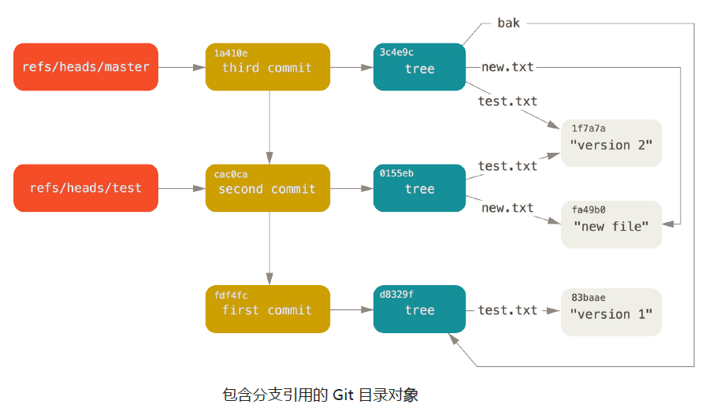
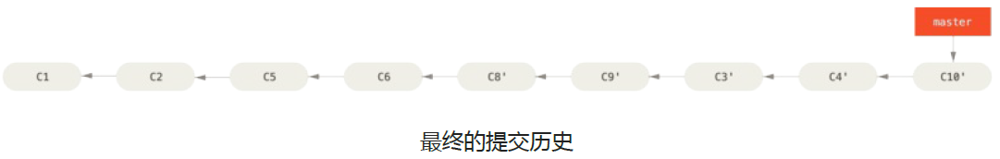
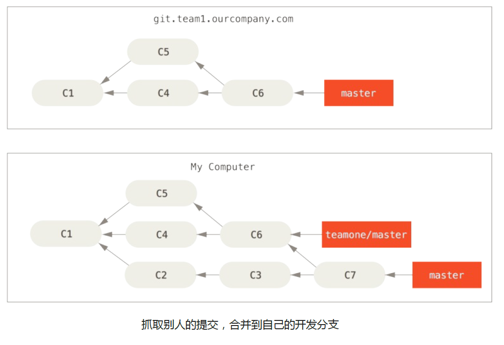

# Git

<!-- TOC -->

- [一、版本控制系统简介](#一版本控制系统简介)
    - [1. 集中式版本控制](#1-集中式版本控制)
    - [2. 分布式版本控制](#2-分布式版本控制)
- [二、git 内部原理](#二git-内部原理)
    - [1. git 思想和基本工作原理](#1-git-思想和基本工作原理)
        - [1.1 直接记录快照，而非差异比较](#11-直接记录快照而非差异比较)
        - [1.2 近乎所有操作都是本地执行](#12-近乎所有操作都是本地执行)
        - [1.3 git 保证完整性](#13-git-保证完整性)
        - [1.4 git 一般只添加数据](#14-git-一般只添加数据)
    - [2. 概念](#2-概念)
        - [2.1 工作区、暂存区、本地库、远程库](#21-工作区暂存区本地库远程库)
        - [2.2 文件的四种状态：未跟踪、未修改、已修改、已提交](#22-文件的四种状态未跟踪未修改已修改已提交)
        - [2.3 底层命令和高层命令](#23-底层命令和高层命令)
    - [3. `.git` 目录](#3-git-目录)
    - [4. git 对象](#4-git-对象)
        - [4.1 git 对象以及存取](#41-git-对象以及存取)
        - [4.2 树对象](#42-树对象)
        - [4.3 提交对象](#43-提交对象)
    - [5. git 引用](#5-git-引用)
        - [5.1 HEAD 引用](#51-head-引用)
        - [5.2 标签引用](#52-标签引用)
        - [5.3 远程引用](#53-远程引用)
    - [6. 包文件](#6-包文件)
    - [7. 引用规格](#7-引用规格)
        - [7.1 引用规则](#71-引用规则)
        - [7.2 引用规则推送](#72-引用规则推送)
        - [7.3 删除引用](#73-删除引用)
    - [8. 传输协议](#8-传输协议)
    - [9. 数据维护与恢复](#9-数据维护与恢复)
        - [9.1 定期维护 `git gc --auto`](#91-定期维护-git-gc---auto)
        - [9.2 数据恢复](#92-数据恢复)
        - [9.3 移除不再使用的对象](#93-移除不再使用的对象)
- [三、git 基础](#三git-基础)
    - [1. git 配置](#1-git-配置)
        - [1.1 用户信息](#11-用户信息)
        - [1.2 文本编辑器](#12-文本编辑器)
        - [1.3 检查配置信息](#13-检查配置信息)
        - [1.4 获取帮助](#14-获取帮助)
    - [2. 基本操作](#2-基本操作)
        - [2.1 创建/克隆仓库、文件状态、暂存/提交修改、查看修改](#21-创建克隆仓库文件状态暂存提交修改查看修改)
        - [2.2 提交日志 `git log`](#22-提交日志-git-log)
        - [2.3 暂存忽略文件 `.gitignore`](#23-暂存忽略文件-gitignore)
        - [2.4 移除文件 `git rm`](#24-移除文件-git-rm)
        - [2.5 移动文件 `git mv`](#25-移动文件-git-mv)
    - [3. 撤销操作](#3-撤销操作)
        - [3.1 漏提交或修改提交信息 `--amend`](#31-漏提交或修改提交信息---amend)
        - [3.2 取消暂存的文件](#32-取消暂存的文件)
        - [3.3 撤销工作区中对文件的修改](#33-撤销工作区中对文件的修改)
    - [4. 远程仓库](#4-远程仓库)
    - [5. 打标签](#5-打标签)
    - [6. git 别名](#6-git-别名)
- [四、git 分支](#四git-分支)
    - [1. 分支简介](#1-分支简介)
    - [2. 创建分支 `git branch`](#2-创建分支-git-branch)
    - [3. 分支切换 `git checkout`](#3-分支切换-git-checkout)
    - [4. 合并分支](#4-合并分支)
    - [5. 合并冲突分支](#5-合并冲突分支)
    - [6. 其他分支管理命令](#6-其他分支管理命令)
    - [7. 分支开发工作流](#7-分支开发工作流)
        - [长期分支](#长期分支)
        - [特性分支](#特性分支)
    - [8. 远程分支](#8-远程分支)
    - [9. 变基](#9-变基)
        - [9.1 一个变基的例子](#91-一个变基的例子)
        - [9.2 更有趣的变基的例子](#92-更有趣的变基的例子)
        - [9.3 变基的风险](#93-变基的风险)
- [五、git 工作流](#五git-工作流)
    - [1. 集中式工作流](#1-集中式工作流)
    - [2. 功能分支工作流](#2-功能分支工作流)
    - [3. Gitflow 工作流](#3-gitflow-工作流)
    - [4. Forking 工作流](#4-forking-工作流)
    - [5. Pull Requests](#5-pull-requests)
- [其他](#其他)
    - [1. CI/CD](#1-cicd)
    - [2. 其他](#2-其他)
        - [2.1 命令速查](#21-命令速查)
        - [2.2 生成SSH秘钥](#22-生成ssh秘钥)
        - [2.3 Git解决每次提交都需要输入用户名和密码](#23-git解决每次提交都需要输入用户名和密码)
        - [2.4 为git设置代理](#24-为git设置代理)
        - [2.5 GitHub中修改用户名和仓库名，本地需要做哪些修改？](#25-github中修改用户名和仓库名本地需要做哪些修改)
        - [2.6 解决git错误：error object file is empty](#26-解决git错误error-object-file-is-empty)
        - [2.7 网络资源](#27-网络资源)

<!-- /TOC -->

## 一、版本控制系统简介

### 1. 集中式版本控制

集中化的版本控制系统（Centralized Version Control Systems，简称 CVCS）诸如 CVS、Subversion 以及 Perforce 等，都有一个 **单一的集中管理的服务器，保存所有文件的修订版本**，而 **协同工作的人们都通过客户端连到这台服务器，取出最新的文件或者提交更新**。

优点是每个人都可以在一定程度上看到项目中的其他人正在做些什么。 而管理员也可以轻松掌控每个开发者的权限，并且管理一个 CVCS 要远比在各个客户端上维护本地数据库来得轻松容易

缺点是如果中央服务器的发生故障宕机一小时，那么在这一小时内，谁都无法提交更新，也就无法协同工作。 如果中心数据库所在的磁盘发生损坏，又没有做恰当备份，毫无疑问你将丢失所有数据——包括项目的整个变更历史，只剩下人们在各自机器上保留的单独快照。

### 2. 分布式版本控制

分布式版本控制系统（Distributed Version Control System，简称 DVCS），像 Git、Mercurial、Bazaar 以及 Darcs 等，**客户端并不只提取最新版本的文件快照，而是把代码仓库完整地镜像下来**。 这么一来，任何一处协同工作用的服务器发生故障，事后都可以用任何一个镜像出来的本地仓库恢复。 因为每一次的克隆操作，实际上都是一次对代码仓库的完整备份

<div align="center"></img></div>

许多这类系统都可以指定和若干不同的远端代码仓库进行交互。籍此，你就可以在同一个项目中，分别和不同工作小组的人相互协作。 你可以根据需要设定不同的协作流程，比如层次模型式的工作流，而这在以前的集中式系统中是无法实现的

## 二、git 内部原理

### 1. git 思想和基本工作原理

#### 1.1 直接记录快照，而非差异比较

git 和其它版本控制系统（如 SVN 等）的主要差别在于对待数据的方法：

大部分版本控制系统以文件变更列表的方式存储信息，它们将保存的信息看作 **一组基本文件和每个文件随时间逐步累积的差异**


<div align="center"></img></div>

git 不按照以上方式对待或保存数据。每次用户提交更新，或在 Git 中保存项目状态时，它主要 **对当时的全部文件制作一个快照并保存这个快照的索引。如果文件没有修改，Git 不再重新存储该文件，而是只保留一个链接指向之前存储的文件**。Git 对待数据更像是一个快照流。

<div align="center"></img></div>

#### 1.2 近乎所有操作都是本地执行

git 作为 **分布式版本控制系统**，客户端并不只是提取最新版本的文件快照，而是把代码仓库完整的镜像下来，这意味着项目的历史提交信息等可以随时在离线状态下查看

git 中的绝大多数操作都只需要访问本地文件和资源，一般不需要来自网络上其它计算机的信息，你可以在离线状态下正常提交代码到本地仓库，直到有网络连接时再上传到远程仓库

#### 1.3 git 保证完整性

git 中所有数据在存储前都计算校验和，然后以校验和来引用。计算校验和的机制叫做 SHA-1 散列(hash，哈希)，该机制基于 git 中文件的内容或目录结构计算出来一段像 `24b9da6552252987aa493b52f8696cd6d3b00373` 这样的 40 个字符组成的哈希值，git 数据库中保存的信息都是以文件内容的哈希值来索引，而不是文件名，这样，若在传送过程丢失信息或损坏文件，git 就可以立即发现

该功能构建在 git 底层，是构成 git 哲学不可或缺的部分

#### 1.4 git 一般只添加数据

你执行的 git 操作，几乎只往 git 数据库中增加数据，很难让 git 执行任何不可逆操作，或者让它以任何方式清楚数据，一旦提交快照到 git 中，就很难再丢失数据

这意味着我们可以尽情做各种尝试而不用担心有丢失数据的危险

### 2. 概念

#### 2.1 工作区、暂存区、本地库、远程库

git 有四个工作区域：**工作区（Working Directory）、暂存区(Stage/Index)、本地库(Repository或Git Directory)、远程库(Remote Directory)**。文件在这四个区域之间的转换关系如下：


<div align="center"></img></div>

- 工作区：工作区是对项目的某个版本独立提取出来的内容。这些从 Git 仓库的压缩数据库中提取出来的文件，放在磁盘上供你使用或修改。包括 git 库根目录中除了 `.git` 目录的其他目录和文件
- 暂存区：暂存区域是一个文件，保存了下次将提交的文件列表信息，一般在 Git 仓库目录中。有时候也被称作 "索引"
- 本地库：`.git` 目录，是 Git 用来保存项目的元数据和对象数据库的地方。这是 Git 中最重要的部分，从其它计算机克隆仓库时，拷贝的就是这里的数据
- 远程库：

基本的 Git 工作流程如下：
1. 在工作目录中修改文件。
2. 暂存文件，将文件的快照放入暂存区域。
3. 提交更新，找到暂存区域的文件，将快照永久性存储到 Git 仓库目录。

#### 2.2 文件的四种状态：未跟踪、未修改、已修改、已提交

git 根据当前文件所处状态管理文件，git 库中管理的文件任何时候都处在四种状态下：未跟踪(untracked)、未修改(unmodify)、已修改(modified)、已暂存(Staged)

<div align="center"></img></div>

- Untracked: 未跟踪，此文件在文件夹中，但并没有加入到 git 库，不参与版本控制。通过git add 状态变为 Staged
- Unmodify: 文件已经入库, 未修改, 即版本库中的文件快照内容与文件夹中完全一致. 这种类型的文件有两种去处, 如果它被修改, 而变为 Modified。 如果使用 git rm 移出版本库, 则成为Untracked文件
- Modified: 文件已修改, 仅仅是修改, 并没有进行其他的操作. 这个文件也有两个去处, 通过git add 可进入暂存 staged 状态, 使用 git checkout 则丢弃修改过, 返回到 unmodify 状态, 这个 git checkout 即从库中取出文件, 覆盖当前修改
- Staged: 暂存状态. 执行 git commit 则将修改同步到库中, 这时库中的文件和本地文件又变为一致, 文件为 Unmodify 状态. 执行 git reset HEAD filename 取消暂存, 文件状态为 Modified

<div align="center"></img></div>

通过 `git status` 查看仓库中的文件状态

#### 2.3 底层命令和高层命令

由于 Git 最初是一套面向版本控制系统的工具集，而不是一个完整的、用户友好的版本控制系统，所以它还包含了一部分用于完成底层工作的命令。 这些命令被设计成能以 UNIX 命令行的风格连接在一起，抑或藉由脚本调用来完成工作。 这部分命令一般被称作 **底层（plumbing）命令**，而那些更友好的命令，则被称作 **高层（porcelain）命令**

认识 git 原理时我们尽量用底层命令，因为底层命令得以让你窥探 Git 内部的工作机制，也有助于说明 Git 是如何完成工作的，以及它为何如此运作。多数底层命令并不面向最终用户：它们更适合作为新命令和自定义脚本的组成部分

### 3. `.git` 目录

当在一个新目录或已有目录执行 `git init` 时，Git 会创建一个 `.git` 目录。 这个目录包含了几乎所有 Git 存储和操作的对象。 如若想备份或复制一个版本库，只需把这个目录拷贝至另一处即可

对于一个全新的 `git init` 版本库，`.git` 目录的结构如下：

```shell
$ tree -L 2 -a
.
└── .git
    ├── branches
    ├── config
    ├── description
    ├── HEAD
    ├── hooks
    ├── info
    ├── objects
    └── refs
```

- **description** 文件仅供 GitWeb 程序使用，我们无需关心。 
- **config** 文件包含项目特有的配置选项
- **info** 目录包含一个全局性排除（global exclude）文件，用以放置那些不希望被记录在 `.gitignore` 文件中的忽略模式（ignored patterns）。 
- **hooks** 目录包含客户端或服务端的钩子脚本（hook scripts）
- 剩下的四个条目很重要： HEAD 文件、（尚未创建的） index 文件，和 objects 目录、refs 目录。 这些条目是 Git 的核心组成部分：
  - **objects** 目录存储所有数据内容
  - **refs** 目录存储指向数据（分支）的提交对象的指针
  - **HEAD** 文件指示目前被检出的分支
  - **index** 文件保存暂存区信息。

### 4. git 对象

#### 4.1 git 对象以及存取

Git 的核心部分是一个简单的键值对数据库（key-value data store）。 向该数据库插入任意类型的内容，它会返回一个键值，通过该键值可以在任意时刻再次检索（retrieve）该内容。

> 键值即上文提到的长度为 40 个字符的校验和——一个将待存储的数据外加一个头部信息（header）一起做 SHA-1 校验运算而得的校验和

> 关于头部信息：
> Git 以对象类型作为开头来构造一个头部信息，接着添加一个空格，随后是数据内容的长度，最后是一个空字节（null byte）
> 所有的 Git 对象均以这种方式存储，区别仅在于类型标识(有 `blob`、`tree`、`commit`)。 另外，虽然数据对象的内容几乎可以是任何东西，但提交对象和树对象的内容却有各自固定的格式

##### hash-object

底层命令 `hash-object` 可将任意数据保存于 .git 目录，并返回相应的键值：

1. 首先，我们需要初始化一个新的 Git 版本库，并确认 `objects` 目录为空：

   ```shell
   $ git init test
   Initialized empty Git repository in /tmp/test/.git/
   $ cd test
   $ find .git/objects
   .git/objects
   .git/objects/info
   .git/objects/pack
   $ find .git/objects -type f
   ```

   Git 对 `objects` 目录进行了初始化并且创建了 `pack` 和 `info` 子目录，但均为空目录

2. 接着，往 Git 数据库存入一些文本：

   ```shell
   echo 'test content' | git hash-object -w --stdin
   d670460b4b4aece5915caf5c68d12f560a9fe3e4
   ```

   > - -w 选项指示 hash-object 命令存储数据对象；若不指定此选项，则该命令仅返回对应的键值
   > - --stdin 选项则指示该命令从标准输入读取内容；若不指定此选项，则须在命令尾部给出待存储文件的路径
   > - `hash-object` 命令输出为存储内容和其头部信息的校验和

3. 同时可以看到在 `object` 目录下多出一个文件：

   ```shell
   $ find .git/objects -type f
   .git/objects/d6/70460b4b4aece5915caf5c68d12f560a9fe3e4
   ```

这就是开始时 Git 存储内容的方式——一个文件对应一条内容，以该内容加上特定头部信息一起的 SHA-1 校验和为文件命名。校验和的前两个字符用于命名子目录，余下的 38 个字符则用作文件名。

##### cat-file

可以通过 `cat-file` 命令从 Git 那里取回数据：

```shell
$ git cat-file -p d670460b4b4aece5915caf5c68d12f560a9fe3e4
test content
```

> - -p 选项指示该命令自动判断内容的类型来显示格式友好的内容

##### 利用 `hash-object` 和 `cat-file` 进行版本控制

明白了 Git 存储和读取信息的方式，我们可以将这些操作应用于文件来模拟对一个文件的简单版本控制：

1. 首先，创建一个新文件并将其内容存入数据库：

   ```shell
   $ echo 'version 1' > test.txt
   $ git hash-object -w test.txt
   83baae61804e65cc73a7201a7252750c76066a30
   ```

2. 接着，向文件中写入新内容，并再次将其存入数据库：

   ```shell
   $ echo 'version 2' > test.txt
   $ git hash-object -w test.txt
   1f7a7a472abf3dd9643fd615f6da379c4acb3e3a
   ```

   此时，数据库记录了该文件的两个不同版本：

   ```shell
   $ find .git/objects -type f
   .git/objects/1f/7a7a472abf3dd9643fd615f6da379c4acb3e3a
   .git/objects/83/baae61804e65cc73a7201a7252750c76066a30
   ```

3. 我们可以把 `test.txt` 文件内容恢复到第一个版本：

   ```shell
   $ git cat-file -p 83baae61804e65cc73a7201a7252750c76066a30 > test.txt
   $ cat test.txt
   version 1
   ```

   再恢复到第二个版本：

   ```shell
   $ git cat-file -p 1f7a7a472abf3dd9643fd615f6da379c4acb3e3a > test.txt
   $ cat test.txt
   version 2
   ```

上述类型的对象称之为 **数据对象(blob object)**，利用 `cat-file -t` 可以得到 Git 内部存储的任何对象的类型：

```shell
$ git cat-file -t 1f7a7a472abf3dd9643fd615f6da379c4acb3e3a
blob
```

上述这个简单的版本控制过程中，有两个问题：

1. 手动记住文件的每个版本所对应的 SHA-1 值并不现实
2. 在这个过程中，文件名并没有被保存——我们仅保存了文件的内容

#### 4.2 树对象

**树对象** 解决了文件名保存的问题，也允许我们将多个文件组织到一起，Git 以一种类似于 UNIX 文件系统的方式存储内容，所有内容均以树对象和数据对象的形式存储，其中 **树对象对应了 UNIX 中的目录项，数据对象则大致上对应了 inodes 或文件内容**。 一个树对象包含了一条或多条树对象记录（tree entry），每条记录含有一个指向数据对象或者子树对象的 SHA-1 指针，以及相应的模式、类型、文件名信息。 

例如，某项目当前对应的最新树对象可能是这样的：

```shell
$ git cat-file -p master^{tree}
100644 blob a906cb2a4a904a152e80877d4088654daad0c859 README
100644 blob 8f94139338f9404f26296befa88755fc2598c289 Rakefile
040000 tree 99f1a6d12cb4b6f19c8655fca46c3ecf317074e0 lib
```

> `master^{tree}` 表示 `master` 分支上最新的提交所指向的树对象

`lib` 子目录代表了另一个树对象：

```shell
$ git cat-file -p 99f1a6d12cb4b6f19c8655fca46c3ecf317074e0
100644 blob 47c6340d6459e05787f644c2447d2595f5d3a54b simplegit.rb
```

从概念上将，Git 内部存储的数据结果如下：

<div align="center"></img></div>

##### 创建自己的树对象

Git 根据某一时刻暂存区所表示的状态创建并记录一个对应得树对象，如此重复便可依次记录（某个时间段内）一系列的树对象。

1. 首先通过 `update-index` 命令暂存一些文件来创建一个暂存区
   
   ```shell
   $ git update-index --add --cacheinfo 100644 83baae61804e65cc73a7201a7252750c76066a30 test.txt
   ```

   > - --add 添加新文件
   > - --cacheinfo 表示要添加的文件位于 Git 数据库中，而不是位于当前目录下
   > - 需要指定文件模式、SHA-1和文件名，本例中文件模式 `100644` 表示是一个普通文件

2. 现在，可以通过 `write-tree` 将暂存区内容写入一个树对象

   ```shell
   $ git write-tree d8329fc1cc938780ffdd9f94e0d364e0ea74f579
   $ git cat-file -p d8329fc1cc938780ffdd9f94e0d364e0ea74f579 
   100644 blob 83baae61804e65cc73a7201a7252750c76066a30 test.txt
   ```

   > Note：底层命令 `write-tree` 并不会清空暂存区内容

   可以验证下它确实是个树对象：

   ```shell
   $ git cat-file -t d8329fc1cc938780ffdd9f94e0d364e0ea74f579
   tree
   ```

3. 接着，创建一个新的树对象，它包括 `test.txt` 文件的第二个版本和一个新文件：

   ```shell
   $ echo 'new file' > new.txt
   $ git update-index test.txt
   $ git update-index --add new.txt
   ```

   当前暂存区包含了 `test.txt` 的新版本和一个新文件 `new.txt`

   将当前暂存区内容记录为一个树对象如下：

   ```shell
   $ git write-tree
   0155eb4229851634a0f03eb265b69f5a2d56f341
   $ git cat-file -p 0155eb4229851634a0f03eb265b69f5a2d56f341
   100644 blob fa49b077972391ad58037050f2a75f74e3671e92 new.txt
   100644 blob 1f7a7a472abf3dd9643fd615f6da379c4acb3e3a test.txt
   ```

   可以看到，新的树对象包含两条文件记录，`test.txt` 的 SHA-1 值是先前值得第二版

4. 可以将第一个树对象加入第二个树对象，使其成为新得树对象得一个子目录

   通过 `read-tree --prefix` 将一个已有得树对象作为子树读入暂存区：

   ```shell
   $ git read-tree --prefix=bak d8329fc1cc938780ffdd9f94e0d364e0ea74f579
   $ git write-tree
   3c4e9cd789d88d8d89c1073707c3585e41b0e614
   $ git cat-file -p 3c4e9cd789d88d8d89c1073707c3585e41b0e614
   040000 tree d8329fc1cc938780ffdd9f94e0d364e0ea74f579 bak
   100644 blob fa49b077972391ad58037050f2a75f74e3671e92 new.txt
   100644 blob 1f7a7a472abf3dd9643fd615f6da379c4acb3e3a test.txt
   ```

   如果基于该新树对象创建一个工作目录，会发现工作目录得根目录包含两个文件以及一个名为 bak 的子目录，该子目录包含 test.txt 文件的第一个版本，当前 Git 的数据内容结构如下：


   <div align="center"></img></div>

#### 4.3 提交对象

现在有三个树对象，分别代表了我们想要跟踪的不同项目快照，然后要使用这三个快照，就必须记住所有三个 SHA-1 哈希值，所以我们可以创建一个 **提交对象** 来记住这三个哈希值，同时提交对象还可以记录是谁保存的快照、在什么时刻保存的、为什么保存这些快照等基本信息

##### commit-tree

可以通过 `commit-tree` 命令创建一个提交对象，为此需要指定一个树对象的 SHA-1 值，以及该提交的父提交对象

1. 创建第一个树对象：

   ```shell
   $ echo 'first commit' | git commit-tree d8329f
   fdf4fc3344e67ab068f836878b6c4951e3b15f3d
   ```

   可以通过 `cat-file` 查看这个提交对象：

   ```shell
   $ git cat-file -p fdf4fc3
   tree d8329fc1cc938780ffdd9f94e0d364e0ea74f579
   author Scott Chacon <schacon@gmail.com> 1243040974 -0700
   committer Scott Chacon <schacon@gmail.com> 1243040974 -0700

   first commit
   ```

   如上，提交对象的格式很简单：

   - 先指定一个顶层对象，代表当前项目快照
   - 然后是作者/提交者信息（依据 `user.name` 和 `user.email` 设定），外加一个时间戳
   - 留空一行
   - 最后是提交注释

2. 接着，创建另外两个提交对象，它们分别引用各自的上一次提交：

   ```shell
   $ echo 'second commit' | git commit-tree 0155eb -p fdf4fc3
   cac0cab538b970a37ea1e769cbbde608743bc96d
   $ echo 'third commit' | git commit-tree 3c4e9c -p cac0cab
   1a410efbd13591db07496601ebc7a059dd55cfe9
   ```

   这三个提交对象分别指向之前创建的三个树对象快照

3. 此时，对最后一个提交的 SHA-1 值运行 `git log` 命令，就可以看到刚才我们构建的 Git 提交历史了：

   ```shell
   $ git log --stat 1a410e
   commit 1a410efbd13591db07496601ebc7a059dd55cfe9
   Author: Scott Chacon <schacon@gmail.com>
   Date: Fri May 22 18:15:24 2009 -0700

         third commit

    bak/test.txt | 1 +
    1 file changed, 1 insertion(+)

   commit cac0cab538b970a37ea1e769cbbde608743bc96d
   Author: Scott Chacon <schacon@gmail.com>
   Date: Fri May 22 18:14:29 2009 -0700

         second commit

    new.txt | 1 +
    test.txt | 2 +-
    2 files changed, 2 insertions(+), 1 deletion(-)

   commit fdf4fc3344e67ab068f836878b6c4951e3b15f3d
   Author: Scott Chacon <schacon@gmail.com>
   Date: Fri May 22 18:09:34 2009 -0700

         first commit

    test.txt | 1 +
    1 file changed, 1 insertion(+)
   ```

通过上面几个步骤我们用底层命令模拟了一个 Git 提交历史的创建，这其实就是我们运行 `git add` 和 `git commit` 时，Git 所做的实质工作：

- 将被改写的文件保存为数据对象
- 更新暂存区
- 记录树对象
- 创建一个指明了顶层树对象和父提交的提交对象

这三种主要的 Git 对象：**数据对象、树对象、提交对象** 最初都以单独文件的形式保存在 `.git/objects` 目录下，下面列出了目前示例内的所有对象的文件：

```shell
$ find .git/objects -type f
.git/objects/01/55eb4229851634a0f03eb265b69f5a2d56f341 # tree 2
.git/objects/1a/410efbd13591db07496601ebc7a059dd55cfe9 # commit 3
.git/objects/1f/7a7a472abf3dd9643fd615f6da379c4acb3e3a # test.txt v2
.git/objects/3c/4e9cd789d88d8d89c1073707c3585e41b0e614 # tree 3
.git/objects/83/baae61804e65cc73a7201a7252750c76066a30 # test.txt v1
.git/objects/ca/c0cab538b970a37ea1e769cbbde608743bc96d # commit 2
.git/objects/d6/70460b4b4aece5915caf5c68d12f560a9fe3e4 # 'test content'
.git/objects/d8/329fc1cc938780ffdd9f94e0d364e0ea74f579 # tree 1
.git/objects/fa/49b077972391ad58037050f2a75f74e3671e92 # new.txt
.git/objects/fd/f4fc3344e67ab068f836878b6c4951e3b15f3d # commit 1
```

对应的对象关系图如下：

<div align="center"><image src="doc/示例目录中的对象关系图.png" width="600" height=""></image></div>

### 5. git 引用

至此，我们可以通过类似 `git log 1a410e` 这样的命令浏览完整的提交历史。其实，我们可以用一个文件来保存 SHA-1 值，并给文件起一个简单的名字，然后用这个名字指针替代原始的 SHA-1 值，这样的文件称为 **引用(references)**，Git 将这些文件保存在 `.git/refs` 目录下

在目前的项目下，这个目录没有任何引用文件，其当前文件结构如下：

```shell
$ find .git/refs
.git/refs
.git/refs/heads
.git/refs/tags
$ find .git/refs -type f
```

##### 自己创建引用

通过下面的操作就能创建一个引用：

```shell
$ echo "1a410efbd13591db07496601ebc7a059dd55cfe9" > .git/refs/heads/master
```

现在就可以使用这个新引用代替 SHA-1 值：

```shell
$ git log --pretty=oneline master
1a410efbd13591db07496601ebc7a059dd55cfe9 third commit
cac0cab538b970a37ea1e769cbbde608743bc96d second commit
fdf4fc3344e67ab068f836878b6c4951e3b15f3d first commit
```

##### update-ref

一般不提倡直接编辑文件，可以使用 `update-ref` 更安全的更新引用：

```shell
$ git update-ref refs/heads/master 1a410efbd13591db07496601ebc7a059dd55cfe9
```

可以看出 **Git 分支的本质就是一个指向某一系列提交之首的指针或引用**

在第二个提交上创建一个分支：

```shell
$ git update-ref refs/heads/test cac0ca
```

这个分支将只包含从第二个提交开始往前追溯的记录：

```shell
$ git log --pretty=oneline test
cac0cab538b970a37ea1e769cbbde608743bc96d second commit
fdf4fc3344e67ab068f836878b6c4951e3b15f3d first commit
```

至此，当前的 Git 数据库从概念看起来是这样：

<div align="center"></img></div>

#### 5.1 HEAD 引用

HEAD 是一个符号引用，它指向目前正在工作的分支
> 所谓符号引用，意味着它并不像普通引用那样包含一个 SHA-1 值，而是指向其他引用的指针

HEAD 引用的值保存在 `.git/HEAD` 文件中，查看 `HEAD` 文件，可以看到下面的内容：

```shell
$ cat .git/HEAD
ref: refs/heads/master
```

这表示当前工作分支为 `master` 分支，如果执行 `git checkout test`，`HEAD` 文件会更新：

```shell
$ cat .git/HEAD
ref: refs/heads/test
```

##### symbolic-ref

一般不应该直接编辑文件，可以通过 `symbolic-ref` 文件来查看和修改 `HEAD` 引用：

```shell
# 查看 HEAD 引用
$ git symbolic-ref HEAD
refs/heads/master

# 设置 HEAD 引用
$ git symbolic-ref HEAD refs/heads/test
$ cat .git/HEAD
ref: refs/heads/test
```

不能将符号引用设置为一个不符号引用格式的值：

```shell
$ git symbolic-ref HEAD test
fatal: Refusing to point HEAD outside of refs/
```

##### `git commit` 需要用到 HEAD 引用

当我们执行 `git commit`，该命令会创建一个提交对象，并用 `HEAD` 文件中引用指向的 SHA-1 值设置其父提交字段

#### 5.2 标签引用

标签对象（tag object）是 Git 中的第四种对象类型，它类似于一个提交对象：包含一个标签创建者信息、一个日期、一段注释信息，以及一个指针。主要的区别在于，标签对象通常指向一个提交对象，而不是一个树对象。它永远指向同一个提交对象，只不过给这个提交对象加上一个更友好的名字罢了

Git 中所有的标签引用都在 `.git/refs/tags/` 目录下

##### 轻量标签

创建一个轻量标签非常容易，轻量标签仅包含一个固定的引用：

```shell
$ git update-ref refs/tags/v1.0 cac0cab538b970a37ea1e769cbbde608743bc96d
```

##### 附注标签

创建附注标签时，Git 会先创建一个标签对象，并记录一个引用来指向该标签对象，而不是直接指向提交对象：

```shell
$ git tag -a v1.1 1a410efbd13591db07496601ebc7a059dd55cfe9 -m 'test tag'
```

> -a 指定了创建附注标签

可以查看上面过程创建的标签内容：

```shell
# 查看创建的标签对象的 SHA-1 值
$ cat .git/refs/tags/v1.1
9585191f37f7b0fb9444f35a9bf50de191beadc2

# 查看标签内容
$ git cat-file -p 9585191f37f7b0fb9444f35a9bf50de191beadc2
object 1a410efbd13591db07496601ebc7a059dd55cfe9
type commit
tag v1.1
tagger Scott Chacon <schacon@gmail.com> Sat May 23 16:48:58 2009 -0700
test tag
```

可以看到，上面 object 条目指向我们打了标签的那个提交对象的 SHA-1 值

##### 对其他对象类型打标签

其实，标签对象并非必须指向某个提交对象，可以对任意类型的 Git 对象打标签：

例如，在 Git 源码中，项目维护者将他们的 GPG 公钥添加为一个数据对象，然后对这个对象打了一个标签。可以克隆一个 Git 版本库，然后通过执行下面的命令来在这个版本库中查看上述公钥：

```shell
$ git cat-file blob junio-gpg-pub
```

#### 5.3 远程引用

远程引用：如果你添加了一个远程版本库并对其执行过推送操作，Git 会记录下最近一次推送操作时每一个分支所对应的值，并保存在 `refs/remotes` 目录下

可以添加一个叫做 `origin` 的远程版本库，然后把 `master` 分支推送上去：

```shell
$ git remote add origin git@github.com:schacon/simplegit-progit.git
$ git push origin master
Counting objects: 11, done.
Compressing objects: 100% (5/5), done.
Writing objects: 100% (7/7), 716 bytes, done.
Total 7 (delta 2), reused 4 (delta 1)
To git@github.com:schacon/simplegit-progit.git
a11bef0..ca82a6d master -> master
```

查看 `refs/remotes/origin/master` 文件，可以发现 origin 远程版本库的 master 分支所对应的 SHA-1 值，就是最近一次与服务器通信时本地 master 分支所对应的 SHA-1 值

```shell
$ cat .git/refs/remotes/origin/master
ca82a6dff817ec66f44342007202690a93763949
```

远程引用和分支（位于 refs/heads 目录下的引用）之间最主要的区别在于，**远程引用是只读的**。 

虽然可以 git checkout 到某个远程引用，但是 Git 并不会将 HEAD 引用指向该远程引用。因此，你永远不能通过 commit 命令来更新远程引用。 Git 将这些远程引用作为记录远程服务器上各分支最后已知位置状态的书签来管理。

### 6. 包文件

前面我们说过，Git 以快照流的方式保存文件的历史改动，这意味着：如果我们的库中有一个很大的文件，如果本次修改仅仅对改大文件改动一行，提交时也会创建该大文件的一个快照，所以磁盘上会出现两个几乎完全相同的大文件

如果，我们能只完整保存其中一个，再保存另一对象与之前版本的差异内容，岂不更好？

事实上，Git 可以那样做。 

Git 最初向磁盘中存储对象时所使用的格式被称为“松散（loose）”对象格式。 但是，Git 会时不时地将多个这些对象打包成一个称为“包文件（packfile）”的二进制文件，以节省空间和提高效率。 

当版本库中有太多的松散对象，或者你手动执行 `git gc` 命令，或者你向远程服务器执行推送时，Git 都会这样做。

打包后的对象数据，会被放置在 `.git/objects/pack` 目录下，打包完成后，会生成一个包文件(.pack)和一个索引文件(.idx)，包文件包含了刚才从文件系统中移除的所有对象的内容。索引文件包含了包文件的偏移信息，我们通过索引文件就可以快速定位任意一个指定对象

Git 打包对象时，会查找命名及大小相近的文件，并只保存文件不同版本之间的差异内容。你可以通过 `git verify-pack` 这个底层命令查看打包文件的内容：

```shell
$ git verify-pack -v .git/objects/pack/pack-978e03944f5c581011e6998cd0e9e30000905586.idx
2431da676938450a4d72e260db3bf7b0f587bbc1 commit 223 155 12
69bcdaff5328278ab1c0812ce0e07fa7d26a96d7 commit 214 152 167
80d02664cb23ed55b226516648c7ad5d0a3deb90 commit 214 145 319
43168a18b7613d1281e5560855a83eb8fde3d687 commit 213 146 464
092917823486a802e94d727c820a9024e14a1fc2 commit 214 146 610
702470739ce72005e2edff522fde85d52a65df9b commit 165 118 756
d368d0ac0678cbe6cce505be58126d3526706e54 tag 130 122 874
fe879577cb8cffcdf25441725141e310dd7d239b tree 136 136 996
d8329fc1cc938780ffdd9f94e0d364e0ea74f579 tree 36 46 1132
deef2e1b793907545e50a2ea2ddb5ba6c58c4506 tree 136 136 1178
d982c7cb2c2a972ee391a85da481fc1f9127a01d tree 6 17 1314 1 deef2e1b793907545e50a2ea2ddb5ba6c58c4506
3c4e9cd789d88d8d89c1073707c3585e41b0e614 tree 8 19 1331 1 deef2e1b793907545e50a2ea2ddb5ba6c58c4506
0155eb4229851634a0f03eb265b69f5a2d56f341 tree 71 76 1350
83baae61804e65cc73a7201a7252750c76066a30 blob 10 19 1426
fa49b077972391ad58037050f2a75f74e3671e92 blob 9 18 1445

b042a60ef7dff760008df33cee372b945b6e884e blob 22054 5799 1463
033b4468fa6b2a9547a70d88d1bbe8bf3f9ed0d5 blob 9 20 7262 1 b042a60ef7dff760008df33cee372b945b6e884e

1f7a7a472abf3dd9643fd615f6da379c4acb3e3a blob 10 19 7282
non delta: 15 objects
chain length = 1: 3 objects
.git/objects/pack/pack-978e03944f5c581011e6998cd0e9e30000905586.pack: ok
```

以我本机上的一个索引文件为例，中间独立出来两行中：
- `033b4` 这个数据对象为某个大文件的第一个版本，即初始版本
- `b042a` 这个数据对象为某个大文件的第二个版本，即修改后的版本

可以看出来，`033b4` 这个数据对象引用了数据对象 `b042a` ，即。 命令输出内容的第三列显示的是各个对象在包文件中的大小，可以看到 `b042a` 占用了 22K 空间，而 `033b4` 仅占用 9 字节。 这说明了，第二个版本完整保存了文件内容，而原始的版本反而是以差异方式保存的——这是因为大部分情况下需要快速访问文件的最新版本。

### 7. 引用规格

#### 7.1 引用规则

假设你添加了这样一个远程版本库：

```shell
$ git remote add origin https://github.com/schacon/simplegit-progit
```

从前文 5.3 远程应用 中我们已经知道：这时会创建一些远程分支指向到本地引用

其实，上述命令还会再 `.git/config` 中添加一个小节，并在其中指定远程版本库的名称（origin）、URL 和一个用于获取操作的 **引用规格（refspec）**：

```shell
[remote "origin"]
url = https://github.com/schacon/simplegit-progit
fetch = +refs/heads/*:refs/remotes/origin/*
```

引用规格的格式由一个可选的 + 号和紧随其后的 <src>:<dst> 组成，其中：

- <src> 是一个模式 （pattern），代表远程版本库中的引用
- <dst> 是那些远程引用在本地所对应的位置
- + 号告诉 Git 即使在不能快进的情况下也要（强制）更新引用

默认情况下，引用规格由 `git remote add` 命令自动生成， Git 获取服务器中 `refs/heads/` 下面的所有引用，并将它写入到本地的 `refs/remotes/origin/` 中。 所以，如果服务器上有一个 master 分支，我们可以在本地通过下面这种方式来访问该分支上的提交记录：

```shell
$ git log origin/master
$ git log remotes/origin/master
$ git log refs/remotes/origin/master
```

- 可以通过修改引用规则来设置每次从服务器默认拉取的分支：

   ```
   # 每次仅拉取 master 分支
   fetch = +refs/heads/master:refs/remotes/origin/master

   # 拉取多个分支不能使用部分通配符，必须将每个分支全列出来
   # 每次拉取 master 和 experiment 两个分支
   [remote "origin"]
   url = https://github.com/schacon/simplegit-progit
   fetch = +refs/heads/master:refs/remotes/origin/master
   fetch = +refs/heads/experiment:refs/remotes/origin/experiment

   # 拉取多个分支的简便做法是，将需要同时拉取的多个分支放在同一目录（或命名空间下）
   # 如每次拉取 qa 目录下的所有分支
   [remote "origin"]
   url = https://github.com/schacon/simplegit-progit
   fetch = +refs/heads/master:refs/remotes/origin/master
   fetch = +refs/heads/qa/*:refs/remotes/origin/qa/*
   ```

- 也可以在命令声明拉取的远程分支，不过仅限于本次拉取：

   ```
   # 仅拉取 master 分支
   $ git fetch origin master:refs/remotes/origin/mymaster

   # 拉取 master 和 topic 分支
   $ git fetch origin master:refs/remotes/origin/mymaster \
   topic:refs/remotes/origin/topic
   From git@github.com:schacon/simplegit
   ! [rejected] master -> origin/mymaster (non fast forward)
   * [new branch] topic -> origin/topic
   ```

   > 上面对 master 分支的拉取操作被拒绝，因为它不是一个可以快进的引用。 我们可以通过在引用规格之前指定 + 号来覆盖该规则


#### 7.2 引用规则推送

可以使用下面的命令将本地的 master 分支推送到远程服务器的 qa/master 分支上：

```shell
$ git push origin master:refs/heads/qa/master
```

也可以修改配置文件，使得每次运行 `git push origin` 时都像上面这样推送：

```shell
[remote "origin"]
url = https://github.com/schacon/simplegit-progit
fetch = +refs/heads/*:refs/remotes/origin/*
push = refs/heads/master:refs/heads/qa/master
```

上面的配置会让每次执行 `git push origin` 时都默认将本地的 `master` 分支推送到远程的 `qa/master` 分支

#### 7.3 删除引用

借助引用规则删除远程服务器上的 topic 分支：

```shell
$ git push origin :topic
```

### 8. 传输协议

参见《Pro Git》

### 9. 数据维护与恢复

#### 9.1 定期维护 `git gc --auto`

上面说过，如果有太多松散对象（不在包文件中的对象）或者太多包文件，Git 会运行一个完整的 `git gc` 命令，你可以通过手动执行 `git gc --auto` 来进行 gc 操作，Git 的 gc 操作包括：**收集所有松散对象并将它们放置到包文件中，将多个包文件合并为一个大的包文件，移除与任何提交都不相关的陈旧对象等**，其实大部分情况下这个命令并不会触发 gc 操作，因为 **大约需要 7000 个以上的松散对象或超过 50 个的包文件才能让 Git 启动一次真正的 gc 命令**。 你可以通过修改 `gc.auto` 与 `gc.autopacklimit` 的设置来改动这些数值。

##### gc 打包引用

gc 还会做另一件事，就是打包你的引用到一个单独的文件：

假设你的仓库包含以下分支与标签：

```shell
$ find .git/refs -type f
.git/refs/heads/experiment
.git/refs/heads/master
.git/refs/tags/v1.0
.git/refs/tags/v1.1
```

gc 之后，`refs` 目录中原来的引用将会被 Git 移动到名为 .git/packed-refs 的文件中：

```shell
$ cat .git/packed-refs
# pack-refs with: peeled fully-peeled
cac0cab538b970a37ea1e769cbbde608743bc96d refs/heads/experiment
ab1afef80fac8e34258ff41fc1b867c702daa24b refs/heads/master
cac0cab538b970a37ea1e769cbbde608743bc96d refs/tags/v1.0
9585191f37f7b0fb9444f35a9bf50de191beadc2 refs/tags/v1.1
^1a410efbd13591db07496601ebc7a059dd55cfe9
```

如果你更新了引用，Git 并不会修改这个文件，而是向 refs/heads 创建一个新的文件。 为了获得指定引用的正确 SHA-1 值，Git 会首先在 refs 目录中查找指定的引用，然后再到 packed-refs 文件中查找。 所以，如果你在 refs 目录中找不到一个引用，那么它或许在 packed-refs 文件中。

注意这个文件的最后一行，它会以 ^ 开头。 这个符号表示它上一行的标签是附注标签，^ 后的内容是附注标签指向的那个提交。

#### 9.2 数据恢复

##### 利用引用日志恢复

在使用 Git 时，你可能遇到强制删除了正在工作的分支，但是最后却发现你还需要这个分支；亦或者硬重置了一个分支，放弃了你想要的提交。这时候你需要找回你丢失的提交

假设你当前仓库的提交历史如下：

```shell
$ git log --pretty=oneline
ab1afef80fac8e34258ff41fc1b867c702daa24b modified repo a bit
484a59275031909e19aadb7c92262719cfcdf19a added repo.rb
1a410efbd13591db07496601ebc7a059dd55cfe9 third commit
cac0cab538b970a37ea1e769cbbde608743bc96d second commit
fdf4fc3344e67ab068f836878b6c4951e3b15f3d first commit
```

现在，我们将 `master` 分支硬重置到第三次提交：

```shell
$ git reset --hard 1a410efbd13591db07496601ebc7a059dd55cfe9
HEAD is now at 1a410ef third commit
$ git log --pretty=oneline
1a410efbd13591db07496601ebc7a059dd55cfe9 third commit
cac0cab538b970a37ea1e769cbbde608743bc96d second commit
fdf4fc3344e67ab068f836878b6c4951e3b15f3d first commit
```

硬重置意味着顶部最新的两个提交已经丢失了，没有分支指向这些提交，最简单的做法就是找出最后一次提交的 SHA-1 然后增加一个指向它的分支，但是该如何准确找到最后一次提交的 SHA-1 值呢？

可以使用 `git reflog` 工具。 当你正在工作时，Git 会默默地记录每一次你改变 HEAD 时它的值到引用日志。每一次你提交或改变分支，引用日志都会被更新。`git reflog` 会输出引用日志的内容：

```shell
$ git reflog
1a410ef HEAD@{0}: reset: moving to 1a410ef
ab1afef HEAD@{1}: commit: modified repo.rb a bit
484a592 HEAD@{2}: commit: added repo.rb
```

也可以执行 `git log -g`，这个命令会以标准日志的格式输出引用日志：

```shell
$ git log -g
commit 1a410efbd13591db07496601ebc7a059dd55cfe9
Reflog: HEAD@{0} (Scott Chacon <schacon@gmail.com>)
Reflog message: updating HEAD
Author: Scott Chacon <schacon@gmail.com>
Date: Fri May 22 18:22:37 2009 -0700

      third commit

commit ab1afef80fac8e34258ff41fc1b867c702daa24b
Reflog: HEAD@{1} (Scott Chacon <schacon@gmail.com>)
Reflog message: updating HEAD
Author: Scott Chacon <schacon@gmail.com>
Date: Fri May 22 18:15:24 2009 -0700

      modified repo.rb a bit
```

可以看出来下面的那个就是丢失的提交，可以通过创建一个新的分支指向这个提交来恢复它，例如创建名为 `recover-branch` 的分支指向这个提交：

```shell
$ git branch recover-branch ab1afef
$ git log --pretty=oneline recover-branch
ab1afef80fac8e34258ff41fc1b867c702daa24b modified repo a bit
484a59275031909e19aadb7c92262719cfcdf19a added repo.rb
1a410efbd13591db07496601ebc7a059dd55cfe9 third commit
cac0cab538b970a37ea1e769cbbde608743bc96d second commit
fdf4fc3344e67ab068f836878b6c4951e3b15f3d first commit
```

##### 利用数据库完整性恢复

假设你丢失的提交因为某些原因不在引用日志中：我们可以通过移除 recover-branch 分支并删除引用日志来模拟这种情况：

```shell
$ git branch -D recover-branch
$ rm -Rf .git/logs/
```

现在前两次提交又不被任何分支指向了，而且也没有引用日志

我们可以使用 `git fsck` 工具，它将会检查数据库的完整性，使用 `--full` 选项运行它，它会向你显示出所有没有被其他对象指向的对象：

```shell
$ git fsck --full
Checking object directories: 100% (256/256), done.
Checking objects: 100% (18/18), done.
dangling blob d670460b4b4aece5915caf5c68d12f560a9fe3e4
dangling commit ab1afef80fac8e34258ff41fc1b867c702daa24b
dangling tree aea790b9a58f6cf6f2804eeac9f0abbe9631e4c9
dangling blob 7108f7ecb345ee9d0084193f147cdad4d2998293
```

可以看到 "dangling commit" 即是你丢失的提交，同样，添加一个指向这个提交的分支就可以恢复这个提交

#### 9.3 移除不再使用的对象

前面我们说过，**`git clone` 会下载整个项目的历史，包括每一个文件的每一个历史版本**。 如果所有的东西都是源代码那么这很好，因为 Git 被高度优化来有效地存储这种数据。 然而，**如果某个人在之前向项目添加了一个大小特别大的文件，即使你将这个文件从项目中移除了，每次克隆还是都要强制的下载这个大文件**。之所以会产生这个问题，是因为这个文件在历史中是存在的，它会永远在那里。

##### 模拟删除仓库中不用的大文件

1. 我们将一个大文件 `git.tgz` 添加到仓库，并在下一次提交中删除它：

   ```shell
   # 添加大文件 git.tgz 到仓库
   $ git add git.tgz
   $ git commit -m 'add git tarball'
   [master 7b30847] add git tarball
   1 file changed, 0 insertions(+), 0 deletions(-)
   create mode 100644 git.tgz

   # 接着删除该大文件
   $ git rm git.tgz
   rm 'git.tgz'
   $ git commit -m 'oops - removed large tarball'
   [master dadf725] oops - removed large tarball
    1 file changed, 0 insertions(+), 0 deletions(-)
    delete mode 100644 git.tgz
   ```

   通过 `gc` 或者 `count-objectv` 命令来查看数据库占用的空间大小：

   ```shell
   $ git gc
   Counting objects: 17, done.
   Delta compression using up to 8 threads.
   Compressing objects: 100% (13/13), done.
   Writing objects: 100% (17/17), done.
   Total 17 (delta 1), reused 10 (delta 0)

   $ git count-objects -v
   count: 7
   size: 32
   in-pack: 17
   packs: 1
   size-pack: 4868
   prune-packable: 0
   garbage: 0
   size-garbage: 0
   ```

   `size-pack` 单位为 KB，可以看到加入了大文件的仓库占用了 5M 的空间，即使你已经在仓库中删除了该文件

2. 首先必须找到占用空间最大的是哪些文件，在本例中我们已经知道是哪个文件

   但是为了应对一般情况，我们假设不知道，所以 **该如何找到哪个文件或哪些文件占用了如此多的空间呢？**

   如果所有对象都被放入包文件中，可以通过 `git verify-pack` 命令查看，并且通过 `sort` 和 `tail` 等命令的配合找到最大的几个文件：

   ```
   $ git verify-pack -v .git/objects/pack/pack-29…69.idx \
     | sort -k 3 -n \
     | tail -3
   dadf7258d699da2c8d89b09ef6670edb7d5f91b4 commit 229 159 12
   033b4468fa6b2a9547a70d88d1bbe8bf3f9ed0d5 blob 22044 5792 4977696
   82c99a3e86bb1267b236a4b6eff7868d97489af1 blob 4975916 4976258 1438
   ```

   可以看到 `82c99a` 就是我们要找的大文件

   接下来可以通过 `rev-list --objects` 命令列出所有提交对象和数据对象的 SHA-1 和与它们相关联的文件路径，并从中找到 `82c99a` 所对应的文件名：

   ```shell
   $ git rev-list --objects --all | grep 82c99a3
   82c99a3e86bb1267b236a4b6eff7868d97489af1 git.tgz
   ```

3. 找到要删除的文件后，通过以下命令查看哪些提交对这个文件产生过改动：

   ```shell
   $ git log --oneline --branches -- git.tgz
   dadf725 oops - removed large tarball
   7b30847 add git tarball
   ```

   接下来必须重写 `7b30847` 提交之后的所有提交来从 Git 历史中完全移除这个文件

   可以使用 `filter-branch` 命令来完成这个操作：

   ```shell
   $ git filter-branch --index-filter \
     'git rm --ignore-unmatch --cached git.tgz' -- 7b30847^..
   Rewrite 7b30847d080183a1ab7d18fb202473b3096e9f34 (1/2)rm 'git.tgz'
   Rewrite dadf7258d699da2c8d89b09ef6670edb7d5f91b4 (2/2)
   Ref 'refs/heads/master' was rewritten
   ```

   > - --index-filter：在检出项目的每一个提交后运行指定的命令然后重新提交结果，只是让命令修改在暂存区或索引中的文件
   > - `git rm --cached`：命令来移除文件，而不是通过类似 rm file 的命令，因为你需要从索引中移除它，而不是磁盘中
   > - git rm 命令的 `--ignore-unmatch` 选项告诉命令：如果尝试删除的模式不存在时，不提示错误
   > - 使用 `filter-branch` 选项来重写自 7b30847 提交以来的历史，也就是这个问题产生的地方。

   此时，你的历史中将不再包含对那个文件的引用。 不过，你的引用日志和你在 .git/refs/original 通过filter-branch 选项添加的新引用中还存有对这个文件的引用，所以你必须移除它们然后重新打包数据库。 在重新打包前需要移除任何包含指向那些旧提交的指针的文件：

   ```shell
   $ rm -Rf .git/refs/original
   $ rm -Rf .git/logs/
   $ git gc
   Counting objects: 15, done.
   Delta compression using up to 8 threads.
   Compressing objects: 100% (11/11), done.
   Writing objects: 100% (15/15), done.
   Total 15 (delta 1), reused 12 (delta 0)
   ```

   现在，可以查看你节省了多少空间：

   ```shell
   $ git count-objects -v
   count: 11
   size: 4904
   in-pack: 15
   packs: 1
   size-pack: 8
   prune-packable: 0
   garbage: 0
   size-garbage: 0
   ```

   打包的仓库大小下降到了 8K，比 5MB 好很多。 可以从 size 的值看出，这个大文件还在你的松散对象中，并没有消失；但是它不会在推送或接下来的克隆中出现，这才是最重要的。 如果真的想要删除它，可以通过有 --expire 选项的 git prune 命令来完全地移除那个对象：

   ```shell
   $ git prune --expire now
   $ git count-objects -v
   count: 0
   size: 0
   in-pack: 15
   packs: 1
   size-pack: 8
   prune-packable: 0
   garbage: 0
   size-garbage: 0
   ```

## 三、git 基础

### 1. git 配置

Git 自带一个 `git config` 的工具来帮助设置控制 Git 外观和行为的配置变量。这些变量存储在三个不同的位置：

1. `/etc/gitconfig` 文件: 包含系统上每一个用户及他们仓库的通用配置。 如果使用带有 `--system` 选项的 git config 时，它会从此文件读写配置变量。
2. `~/.gitconfig` 或 `~/.config/git/config` 文件：只针对当前用户。 可以传递 `--global` 选项让 Git 读写此文件。
3. 当前使用仓库的 Git 目录中的 config 文件（就是 `.git/config` ）：针对该仓库。

每一个级别覆盖上一级别的配置

#### 1.1 用户信息

安装完 Git 应该设置你的用户名称与邮件地址。每一个 Git 的提交都会使用这些信息，并且它会写入到你的每一次提交中，不可更改：

```shell
$ git config --global user.name "John Doe"
$ git config --global user.email johndoe@example.com
```

当你想针对特定项目使用不同的用户名称与邮件地址时，可以在那个项目目录下运行没有 `--global` 选项的命令来配置。

#### 1.2 文本编辑器

可以通过以下命令配置默认文本编辑器，如果未配置，Git 会使用操作系统默认的文本编辑器，通常是 Vim

```
$ git config --global core.editor emacs
```

#### 1.3 检查配置信息

可以用 `git config --list` 列出所有 Git 当时能找到的配置：

```shell
$ git config --list
user.name=John Doe
user.email=johndoe@example.com
color.status=auto
color.branch=auto
color.interactive=auto
color.diff=auto
...
```

Git 会从上面列出的三个配置文件中依次查找变量值，所以会有重复的变量名，这种情况，Git 会使用它找到的每一个变量的最后一个配置

通过 `git config <key>` 查看某项配置的当前值：

```shell
$ git config user.name
John Doe
```

#### 1.4 获取帮助

三种方式：

```shell
$ git help <verb>
$ git <verb> --help
$ man git-<verb>
```

如：

```
git help config
```

### 2. 基本操作

#### 2.1 创建/克隆仓库、文件状态、暂存/提交修改、查看修改

| 命令 | 说明 |
| --- | --- |
| `git init` | 当前文件夹下建立git仓库，主要工作是创建 .git 目录 |
| `git clone <address>` | git远程仓库克隆到本地 |
| `git clone <address> local_name` | git远程仓库克隆到本地，并起一个本地名称 |
| `git status` | 查看仓库文件状态 |
| `git status -s` | 文件状态以更紧凑的格式输出 |
| `git add <file>` | 将文件 file 的修改提交到暂存区 |
| `git add *` | 将所有修改提交到暂存区 |
| `git add --all` | 将所有修改提交到暂存区，包括新建的文件 |
| `git commit` | 提交到本地代码库，会启动默认编辑器输入提交信息 |
| `git commit -m "msg"` | 提交到本地代码库 |
| `git commit -m "msg" -a` | 将工作区还未提交到暂存区的修改一并提交到本地代码库，但不会提交工作区新建的文件 
| `git diff` | 比较的是工作目录中当前文件和暂存区快照之间的差异，也就是修改之后还没有暂存起来的变化内容 |
| `git diff --cached` | 同 `git diff --staged` 查看已暂存的将要添加到下次提交里的内容，即暂存区内容和上次提交内容的差异 |

#### 2.2 提交日志 `git log`

| 命令 | 说明 |
| --- | --- |
| `git log` | 列出当前项目当前分支的历史提交 |
| `git log -p` | 按补丁格式显示每次更新之间的差异 |
| `git log --stat` | 查看每次提交的简略统计信息，如修改、新增、删除的文件个数等 |
| `git log --shortstat` | 只显示 `--stat` 中最后的行数修改添加移除统计 |
| `git log --name-only` | 仅在提交信息后显示已修改的文件清单 |
| `git log --name-status` | 显示新增、修改、删除的文件清单 |
| `git log --abbrev-commit` | 仅显示 SHA-1 的前几个字符 |
| `git log --relative-date` | 使用较短的相对时间显示（如，"2 weeks ago"） |
| `git log --pretty=oneline` | 单行显示一次提交，还有 `short`、`full`、`fuller` 等选项 |
| `git log --pretty=format:"%h - %an, %ar : %s"` | 以 format 指定的格式显示提交记录，具体格式信息在 `git help log` 中查找 `PRETTY FORMATS` 段 |
| `git log --pretty=format:"%h %s" --graph` | `--graph` 使用 ASCII 图形表示分支合并历史 |
| `git log -n` | 仅显示最近的 n 条提交，n 为数字 |
| `git log --since` | 同 `--after`，仅显示指定时间之后的提交 |
| `git log --util` | 同 `--before`，仅显示指定时间之前的提交 |
| `git log --author` | 仅显示指定作者相关的提交 |
| `git log --committer` | 仅显示指定提交者相关的提交 |
| `git log --grep` | 仅显示含指定关键字的提交 |
| `git log -S` | 仅显示添加或移除了某个关键字的提交 |
| `git log --decorate` | 查看各个分支当前所指的对象 |


#### 2.3 暂存忽略文件 `.gitignore`


`.gitignore` 的格式规范如下：

- 所有空行或者以 `＃` 开头的行都会被 Git 忽略。
- 可以使用标准的 `glob` 模式匹配。
- 匹配模式可以以 ` / ` 开头防止递归。
- 匹配模式可以以 ` / ` 结尾指定目录。
- 要忽略指定模式以外的文件或目录，可以在模式前加上惊叹号 ` ! ` 取反。

`glob` 模式是指 shell 所使用的简化了的正则表达式：

- 星号 ` * ` 匹配零个或多个任意字符
- `[abc]` 匹配任何一个列在方括号中的字符（要么匹配一个 a，要么匹配一个 b，要么匹配一个c）
- 问号 ` ? ` 只匹配一个任意字符
- 如果在方括号中使用短划线分隔两个字符，表示所有在这两个字符范围内的都可以匹配（比如 `[0-9]` 表示匹配所有 0 到 9 的数字）
- 使用 ` ** ` 表示匹配任意中间目录，比如 a/**/z 可以匹配 a/z , a/b/z 或 a/b/c/z 等

示例如下：

```shell

# 忽略掉所有文件名是 foo.txt 的文件
foo.txt

# 不忽略 mtk 目录下的 foo.txt
!/mtk/foo.txt

# 只忽略当前目录下名为 mtk 的文件，并不是忽略子目录 ./mtk/
/mtk

# 忽略整个文件夹 /mtk/
/mtk/

# 忽略当前目录下所有的 html 文件
*.html

# 忽略当前目录及其子目录下的所有 html 文件
doc/**/*.html

# 忽略所有.o和 .a文件.
*.[oa]
```

GitHub 上有个十分详细的针对数十种项目及语言的 [.gitignore 文件列表](https://github.com/github/gitignore)

如果你不慎在创建 `.gitignore` 文件之前就 push 了项目，那么即使你在 .gitignore 文件中写入新的过滤规则，这些规则也不会起作用，Git 仍然会对所有文件进行版本管理。

简单来说，出现这种问题的原因就是 Git 已经开始管理这些文件了，所以你无法再通过过滤规则过滤它们。因此一定要养成在项目开始就创建 .gitignore 文件的习惯，否则一旦 push，处理起来会非常麻烦。

##### 如何过滤某个已经commit过的文件？

1. 执行下面命令

   ```
   git rm --cached <path>
   # 如果是文件夹，执行：
   git rm -r --cached <path>
   # 如果设置后无法生效，可以清理尝试清理全部缓存：
   git rm -r --cached .

   git add .
   git commit -m "update .gitignore"
   ```

2. 更新".gitignore"文件，添加需要忽略的文件
3. commit

#### 2.4 移除文件 `git rm`

完全从 Git 管理的版本库中删除文件，包括两个步骤：

1. 从 Git 已跟踪文件清单中移除（也即是从暂存区域移除）
2. 从工作目录中删除文件

下面是从 Git 中删除文件的几种情况：

1. `git rm` 命令可以同时完成这两项项工作，该命令执行完并提交后，被删除文件就不会出现在未跟踪文件清单中了
  
   如果删除之前修改过并且已经放到暂存区域的文件的话，则必须要用强制删除选项 `-f` 。这是一种安全特性，用于防止误删还没有添加到快照的数据，这样的数据不能被 Git 恢复。

2. 如果只是简单的从工作目录中手工删除文件：

   - 如果继续从 Git 中完全删除该文件，则通过 `git add/rm <file>` 记录此次移除文件的操作，同一步执行 `git rm` 的结果一样
   - 如果是误删，想恢复该删除文件，执行 `git checkout -- <file>` 恢复工作目录中文件的误删

3. 如果想把文件从 Git 仓库中删除（亦即从暂存区域移除），但仍然希望保留在当前工作目录中。即你想让文件保留在磁盘上，但是并不想让 Git 继续跟踪
   
   > 当你忘记将一个需要忽略的文件添加到 .gitignore 文件，并且该文件已经被添加到暂存区或已经被跟踪时，你将遇到这种情况

   可以使用 `git rm --cached <file>` 命令，此命令仅仅将 file 从跟踪列表中移除


#### 2.5 移动文件 `git mv`

Git 并不显式跟踪文件移动操作。如果在 Git 中重命名了某个文件，仓库中存储的元数据并不会体现出这是一次改名操作

如果用 `mv` 命令对 Git 跟踪的文件重命名，正确的操作应该是：

```
$ mv README.md README
$ git rm README.md
$ git add README
```

我们需要提交前删除老的文件名，再添加新的文件名，至于原因，Git 内部原理解释的很清楚

而运行 `git mv <file> <new-file>` 实际就相当于运行了上面的三条命令，所以相对来说 `git mv` 简便的多

### 3. 撤销操作

#### 3.1 漏提交或修改提交信息 `--amend`

有时候我们提交完了才发现漏掉了几个文件没有添加，或者提交信息写错了。此时，可以运行带有 `--amend` 选项的提交命令尝试重新提交：

```
$ git commit --amend
```

这个命令会将暂存区内容提交：

- 如果自上次提交以来你还未做任何修改（例如，在上次提交后马上执行了此命令），那么快照会保持不变，而你所修改的只是提交信息，新的提交信息会覆盖第一次的提交信息
- 如果上次提交后你发现漏提交了文件，可以 `add` 后重新提交，提交后，第二次提交的更改会和第一次合并，历史提交中只显示第二次提交

#### 3.2 取消暂存的文件

假如你在 `git add` 的时候意外的将多余的文件暂存，可以通过 `git reset HEAD <file>` 将已经暂存的文件取消暂存

`git reset --hard`

#### 3.3 撤销工作区中对文件的修改

如果你想撤销你在工作目录中对某个文件的修改，可以通过 `git checkout -- [file]` 来将其重置到上次提交

> 注意：`git checkout -- [file]` 是一个危险的命令，你对那个文件做的任何修改都会消失，Git 只是拷贝了另一个文件来覆盖它

### 4. 远程仓库

| 命令 | 说明 |
| --- | --- |
| `git remote` | 列出每个远程服务器的简写 |
| `git remote -v` | 显示每个远程服务器的简写和其 URL |
| `git remote add <shortname> <url>` | 添加一个新的远程 Git 仓库，同时指定一个可以引用的简写 |
| `git fetch pb` | 拉取简写为 pb 的仓库中的所有分支，远程分支信息保存在本地 pb/ 目录下，可以将它们合并到自己的某个分支中 |
| `git pull pb master` | 自动的抓取 pb 仓库的 master 分支然后当前分支，相当于 `git fetch pb && git merge pb/master` |
| `git push pb master` | 将本地 master 分支推送到 pb 服务器对应分支 |
| `git remote show [remote-name]` | 查看某个远程仓库的信息 |
| `git remote rename pb paul` | 更改远程仓库 pb 的简写为 paul |
| `git remote rm paul` | 移除远程仓库 paul |

### 5. 打标签

Git 使用两种主要类型的标签：轻量标签（lightweight）与附注标签（annotated）

- 轻量标签：像一个不会改变的分支，只是一个特定提交的引用
- 附注标签：存储在 Git 数据库中的一个完整对象。它们是可以被校验的；其中包含打标签者的名字、电子邮件地址、日期时间；还有一个标签信息；并且可以使用 GNU Privacy Guard （GPG）签名与验证

| 命令 | 说明 |
| --- | --- |
| `git tag` | 列出现有的标签 |
| `git tag -l 'v1.8.5*'` | 可以使用特定模式查找标签 |
| `git tag v1.3w` | 创建一条轻量标签，指向当前分支 |
| `git tag -a v1.4 -m 'my version 1.4'` | `-a` 指示创建一条附注标签；`-m` 指定一条存储在标签中的信息，若无 -m 选项，则会启动编辑器 |
| `git show v1.4` | 显示标签的详细信息 |
| `git tag -a v1.2 <SHA-1>` | 对某条历史提交打标签 |
| `git push origin v1.5` | 将标签 v1.5 推送到 origin 服务器 |
| `git push origin --tags` | 使用带有 `--tags` 选项的 `git push` 命令。会把所有不在远程仓库服务器上的标签全部传送到那里 |
| `git checkout -b [branchname] [tagname]` | 在指定标签的位置创建分支 |

### 6. git 别名

可以通过 `git config` 文件来轻松地为每一个命令设置一个别名：

```
$ git config --global alias.co checkout
$ git config --global alias.br branch
$ git config --global alias.ci commit
$ git config --global alias.st status
```

这意味着，当要输入 `git commit` 时，只需要输入 `git ci`

## 四、git 分支

### 1. 分支简介

前文说到，Git 保存的不是文件的变化或者差异，而是一系列不同时刻的文件快照。进行提交操作时，Git 会保存一个提交对象，该提交对象会包含一个指向暂存内容的快照及其他必要信息，除首次创建的提交对象外，其他提交对象都有一个父提交对象，由多个分支合并产生的提交对象有多个父提交对象

Git 的分支，其实本质就是指向提交对象的可变指针，Git 在 `git init` 默认创建一个 `master` 分支，这个分支并无特殊性，其与其他普通分支没有区别

### 2. 创建分支 `git branch`

假设当前仓库分支结构如下：

<div align="center"></div>

图中 `HEAD` 指针指向当前所在的本地分支

可以使用 `git branch` 创建一个新分支 testing：

```
$ git branch testing
```

<div align="center"></div>

### 3. 分支切换 `git checkout`

可以使用 `git checkout testing` 切换到新建的分支 testing：

<div align="center"></div>

现在我们在当前分支提交一次，`testing` 分支将会向前移动：

<div align="center"></div>

可以看到 `master` 分支仍然未动，这时我们切回 `master` 分支：

<div align="center"></div>

`git checkout` 切换分支这条命令其实做了两件事：

1. 使 `HEAD` 指回 `master` 分支
2. 将工作目录恢复成 `master` 分支所指向的快照内容

接着，我们在 `master` 分支提交一次，将会出现分叉现象：

<div align="center"></div>

运行 `git log --oneline --decorate --graph --all` ，它会输出你的提交历史、各个分支的指向以及项目的分支分叉情况

### 4. 合并分支

以一个案例来运用分支来处理日常开发工作：

假设你正在你的项目上工作，并且已经有了一些提交：

<div align="center"></div>

你准备使用 `git checkout -b iss53` 创建并切换到一个新分支来解决一个 bug #53：

<div align="center"></div>

你工作了一段时间，已经为 bug #53 做了一些提交：

<div align="center"></div>

这时，老板突然交给你一个紧急问题，你需要放下手工的工作立即解决这个紧急问题

有了 Git 的帮助，你不必把这个紧急问题和 iss53 的修改混在一起，你也不需要花大力气来还原关于 53# 问题的修改，然后再添加关于这个紧急问题的修改，最后将这个修改提交到线上分支。你所要做的仅仅是切换回 `master` 分支

> 在切换分支之前，要注意你的工作目录和暂存区里那些还没有被提交的修改，它可能会和你即将检出的分支产生冲突从而阻止 Git 切换到该分支。最好的方法是，在你切换分支之前，保持好一个干净的状态。有一些方法可以绕过这个问题（即，保存进度（stashing） 和 修补提交（commit amending））

现在假设你已经将当前分支的修改全部提交，并且已经切换到 `master` 分支，你的工作目录中的文件已经恢复到你解决 bug #53 之前的样子，你可以为这个紧急问题新建一个分支 `hotfix`，在该分支上工作直到问题解决：

<div align="center"></div>

在你确保紧急问题已经解决之后，可以将其合并到 `master` 分支来部署到线上：

```
$ git checkout master
$ git merge hotfix
Updating f42c576..3a0874c
Fast-forward
index.html | 2 ++
1 file changed, 2 insertions(+)
```

注意，此时使用了 **快进合并(fast-forward)**

> 所谓快速合并，是由于当前 master 分支所指向的提交是你当前提交（有关 hotfix 的提交）的直接上游，所以 Git 只是简单的将指针向前移动。换句话说，当你试图合并两个分支时，如果顺着一个分支走下去能够到达另一个分支，那么 Git 在合并两者的时候，只会简单的将指针向前推进（指针右移），因为这种情况下的合并操作没有需要解决的分歧——这就叫做 “快进（fast-forward）”。

<div align="center"></div>

紧急问题修改完成，现在你可以删除 `hotfix` 分支，然后切换到 `iss53` 分支继续修改 bug 了：

```
$ git branch -d hotfix
Deleted branch hotfix (3a0874c).
$ git checkout iss53
Switched to branch "iss53"
```

<div align="center"></div>

当你完成 iss53 bug 的修复，就可以就 `iss53` 合并到 `master` 了

```
$ git checkout master
Switched to branch 'master'
$ git merge iss53
Merge made by the 'recursive' strategy.
index.html | 1 +
1 file changed, 1 insertion(+)
```

由于 `master` 分支所在提交并不是 `iss53` 分支所在提交的直接祖先，所以不能使用 “快进合并”，此时的合并称作 **三方合并**，即出现这种情况的时候，Git 会使用两个分支的末端所指的快照（C4 和 C5）以及这两个分支的工作祖先（C2），做一个简单的三方合并

<div align="center"></div>

`master` 指向三方合并所产生新提交，新提交的特别之处在于它不止一个父提交，并且 Git 会自行决定选取哪一个提交作为最优的共同祖先，并以此作为合并的基础：

<div align="center"></div>

至此，bug iss53 修改完成，只需删除 `iss53` 分支即可：`git branch -d iss53`

### 5. 合并冲突分支

如果你在不同的分支，对同一个文件的同一个部分进行了不同的修改，就会产生合并冲突，Git 无法自己处理这种合并冲突，必须手动解决

假如在上面的例子中，你对 #53 问题和紧急问题的修改都设计到同一个文件的同一处，就会产生合并冲突：

```
$ git merge iss53
Auto-merging index.html
CONFLICT (content): Merge conflict in index.html
Automatic merge failed; fix conflicts and then commit the result.
```

这时使用 `git status` 可以看到产生冲突的文件被标记为 `Unmerged` 状态的文件：

```shell
$ git status
On branch master
You have unmerged paths.
  (fix conflicts and run "git commit")

Unmerged paths:
  (use "git add <file>..." to mark resolution)

    both modified: index.html

no changes added to commit (use "git add" and/or "git commit -a")
```

冲突的内容以文件补丁的方式保存在原文件中：

```shell
<<<<<<< HEAD:index.html
<div id="footer">contact : email.support@github.com</div>
=======
<div id="footer">
please contact us at support@github.com
</div>
>>>>>>> iss53:index.html
```

你需要通过编辑该文件来解决冲突，在你解决了所有文件里的冲突之后，对每个文件使用 `git add` 命令来将其标记为冲突已解决。一旦暂存这些原本有冲突的文件，Git 就会将它们标记为冲突已解决。

还可以运行 `git mergetool` 启动一个合适的可视化合并工具帮助你一步步解决冲突

### 6. 其他分支管理命令

| 命令 | 说明 |
| --- | --- |
| `git branch` | 列出当前所有分支 |
| `git branch -v` | 查看每个分支的最后一次提交 |
| `git branch --merged` | 查看哪些分支已经合并到当前分支，通常已经合并的分支就可以删除了 |
| `git branch --no-merged` | 查看哪些分支还未合并到当前分支 |
| `git branch -D` | 强制删除含未合并工作的分支 |

### 7. 分支开发工作流

#### 长期分支

#### 特性分支

### 8. 远程分支

### 9. 变基

在 Git 中整合来自不同分支的修改主要有两种方法： `merge` 以及 `rebase`，rebase 即 **变基**

#### 9.1 一个变基的例子

<div align="center"></div>

之前说过，整合分支最容易的方法是 merge 命令。它会把两个分支的最新快照（C3 和 C4）以及二者最近的共同祖先（C2）进行三方合并，合并的结果是生成一个新的快照

还有一种方法：你可以提取在 C4 中引入的补丁和修改，然后在 C3 的基础上再应用一次。在 Git 中，这种操作就叫做 **变基**。你可以使用 `rebase` 命令将提交到某一分支上的所有修改都移至另一分支上，就好像“重新播放”一样

<div align="center"></div>

在上面的例子中，运行：

```shell
$ git checkout experiment
$ git rebase master
First, rewinding head to replay your work on top of it...
Applying: added staged command
```

它的原理是：首先找到这两个分支（即当前分支 experiment 、变基操作的目标基底分支 master ）的最近共同祖先 C2 ，然后对比当前分支相对于该祖先的历次提交，提取相应的修改并存为临时文件，然后将当前分支指向目标基底 C3 , 最后以此将之前另存为临时文件的修改依序应用。

接着回到 `master` 分支，执行一次快进合并：

```
$ git checkout master
$ git merge experiment
```

<div align="center"></div>

从结果来看，merge 和 变基 没有区别，但是 **变基可以让提交历史更加整洁**，在查看一个经过变基的分支的历史记录时会发现，尽管实际的开发工作是并行的，但它们看上去就像是先后串行的一样，提交历史是一条直线没有分叉

> 我们这样做的目的是为了确保在向远程分支推送时能保持提交历史的整洁——例如向某个别人维护的项目贡献代码时。在这种情况下，你首先在自己的分支里进行开发，当开发完成时你需要先将你的代码变基到 origin/master 上，然后再向主项目提交修改。这样的话，该项目的维护者就不再需要进行整合工作，只需要快进合并便可。
>
> 请注意，无论是通过变基，还是通过三方合并，整合的最终结果所指向的快照始终是一样的，只不过提交历史不同罢了。变基是将一系列提交按照原有次序依次应用到另一分支上，而合并是把最终结果合在一起。

#### 9.2 更有趣的变基的例子

在对两个分支进行变基时，所生成的“重演”并不一定要在目标分支上应用，你也可以指定另外的一个分支进行应用

以下图为例：你创建了一个特性分支 server ，为服务端添加了一些功能，提交了 C3 和 C4 。然后从 C3 上创建了特性分支 client ，为客户端添加了一些功能，提交了 C8 和 C9 。最后，你回到 server 分支，又提交了 C10

<div align="center"></div>

假设你希望将 client 中的修改合并到主分支并发布，但暂时并不想合并 server 中的修改

可以使用 `git rebase --onto` 命令，选中在 client 分支里但不在 server 分支里的修改（即 C8 和 C9 ），将它们在 master 分支上重演：

```
$ git rebase --onto master server client
```

> 上面命令的意思：：取出 client 分支，找出处于 client 分支和 server 分支的共同祖先之后的修改，然后把它们在 master 分支上重演一遍

<div align="center"></div>

client 分支快速合并到 master 分支：

```
$ git checkout master
$ git merge client
```

<div align="center"></div>

接下来，可以直接运行 `git rebase [basebranch] [topicbranch]` 命令直接将特性分支( server )变基到目标分支（master）上

```
$ git rebase master server
```

<div align="center"></div>

快进合并到主分支 master 上，并且删除 client 和 server 分支：

```
$ git checkout master
$ git merge server
$ git branch -d client
$ git branch -d server
```

<div align="center"></div>

#### 9.3 变基的风险

变基时遵循一条准则：不要对在你的仓库外有副本的分支执行变基

变基操作的实质是丢弃一些现有的提交，然后相应地新建一些内容一样但实际上不同的提交。如果你已经将提交推送至某个仓库，而其他人也已经从该仓库拉取提交并进行了后续工作，此时，如果你用 git rebase 命令重新整理了提交并再次推送，你的同伴因此将不得不再次将他们手头的工作与你的提交进行整合，如果接下来你还要拉取并整合他们修改过的提交，事情就会变得一团糟

举例说明，假设你从一个中央服务器克隆然后在它的基础上进行了一些开发。你的提交历史如图所示：

<div align="center"></div>

然后，某人又向中央服务器提交了一些修改，其中还包括一次合并。你抓取了这些在远程分支上的修改，并将其合并到你本地的开发分支，然后你的提交历史就会变成这样：

<div align="center"></div>

接下来，这个人又决定把合并操作回滚，改用变基；继而又用 `git push --force` 命令覆盖了服务器上的提交历史。之后你从服务器抓取更新，会发现多出来一些新的提交：

<div align="center"></div>

结果就是你们两人的处境都十分尴尬。如果你执行 `git pull` 命令，你将合并来自两条提交历史的内容，生成一个新的合并提交，最终仓库会如图所示：

<div align="center"></div>

此时如果你执行 git log 命令，你会发现有两个提交的作者、日期、日志居然是一样的，这会令人感
到混乱。此外，如果你将这一堆又推送到服务器上，你实际上是将那些已经被变基抛弃的提交又找了回
来，这会令人感到更加混乱。很明显对方并不想在提交历史中看到 C4 和 C6 ，因为之前就是他们把这
两个提交通过变基丢弃的

##### 用变基解决变基

事实上，如果你遇到前面的情况，如果不是执行合并，而是执行 `git rebase teamone/master`，Git 将会：

- 检查哪些提交是我们的分支上独有的（C2，C3，C4，C6，C7）
- 检查其中哪些提交不是合并操作的结果（C2，C3，C4）
- 检查哪些提交在对方覆盖更新时并没有被纳入目标分支（只有 C2 和 C3，因为 C4 其实就是 C4'）
- 把查到的这些提交应用在 teamone/master 上面

变基之后得到的结果如下图：

<div align="center"></div>

要想上述方案有效，还需要对方在变基时确保 C4’ 和 C4 是几乎一样的。否则变基操作将无法识别，并新建另一个类似 C4 的补丁

另一种简单的方法是使用 git pull --rebase 命令而不是直接 git pull 。又或者你可以自己手动完成这个过程，先 `git fetch` ，再 `git rebase teamone/master`
> `git config --global pull.rebase true` 可以配置 `git pull` 的默认合并方式为变基

总的原则是，**只对尚未推送或分享给别人的本地修改执行变基操作清理历史，从不对已推送至别处的提交执行变基操作**，这样，你才能享受到两种方式带来的便利。

## 五、git 工作流

参见 [git-workflow-tutorial](https://github.com/oldratlee/translations/tree/master/git-workflows-and-tutorials)

### 1. 集中式工作流

### 2. 功能分支工作流

### 3. Gitflow 工作流

### 4. Forking 工作流

### 5. Pull Requests

## 其他

### 1. CI/CD

### 2. 其他

#### 2.1 命令速查


| 命令 | 说明 | 示例 |
| --- | --- | --- |
| `git push my-remote my-branch` | 推送提交到远程仓库 |
| `git pull my-remote my-branch` | 
| `git diff --cached` | 查看暂存区的修改
| `git diff branch1` | 对比当前工作目录与branch1
| `git diff branch1 file1` | 对比当前工作目录中file1与branch1分支中的file1 |
| `git diff branch1 branch2` | 对比两个分支的差异 |
| `git remote` | 
| `git remote -v` |
| `git remote add my-remote <address>` |
| `git remote add myrepo /tmp/myrepo` | 为常用远程库起别名 |
| `git reset file.txt` | 
| `git branch` | 查看分支列表 |
| `git branch my-branch` | 创建my-branch分支 | 
| `git branch -d my-branch` | 删除不再需要的my-branch分支，只能删除已经被当前分支合并的分支 |
| `git branch -D my-branch` | 强制删除my-branch分支 |
| `git checkout my-branch` | 切换分支 |
| `git merge my-branch -m "this is comment"` | 合并分支my-branch到当前分支 |
| `git log` | 查看提交日志 |
| `git log -p master..` |
| `git log --stat` | 查看log时显示每个提交中那些文件修改了多少行内容 |
| `git log --pretty=oneline` | 按某种格式格式化日志输出，如oneline、short |
| `git log --graph --pretty=oneline` | 可视化你的提交图 |
| `git log --pretty=format:'%h : %s' [--topo-order] [--reverse] --graph` |  |
| `git tag` | 显示所有tags |
| `git tag -a v1.0 -m 'msg'` | 
| `git show v1.0` |
| `git tag --delete v1.0` |
| `git push --delete my-remote v1.0` |
| `git push my-remote my-branch v1.0` |
| `git fetch --tags` |
| `git stash` | 将所有未commit的修改(包括暂存和未暂存的)都保存起来 |
| `git stash -u` | 
| `git stash save "msg"` |
| `git stash list` |
| `git stash pop` |
| `git stash stash@{2}` |
| `git stash show` | 
| `git stash apply` |
| `git stash branch my-branch stash@{1}` |
| `git stash drop stash@{1}` |
| `git stash clear` |


#### 2.2 生成SSH秘钥

```
ssh-keygen -t rsa -C "754657908@qq.com"
cat ~/.ssh/id_rsa.pub 配置到 Github
ssh git@github.com
```


#### 2.3 Git解决每次提交都需要输入用户名和密码

```
git config --global credential.helper store
```


#### 2.4 为git设置代理

git clone有两种形式：

- HTTP形式：
  ```
  git clone https://github.com/owner/git.git
  ```

- SSH形式：
  ```
  git clone git@github.com:owner/git.git
  ```

两种方式要分别设置代理：

- HTTP形式：

  走HTTP代理：
  ```
  git config --global http.proxy "http://127.0.0.1:8080"
  git config --global https.proxy "http://127.0.0.1:8080"
  ```

  走sock5代理：
  ```
  git config --global http.proxy "socks5://127.0.0.1:1080"
  git config --global https.proxy "socks5://127.0.0.1:1080"
  ```

  取消设置：
  ```
  git config --global --unset http.proxy
  git config --global --unset https.proxy
  ```
- SSH形式：

  修改`~/.ssh/config`文件(不存在则新建)：
  ```
  # 必须是 github.com
  Host github.com
    HostName github.com
    User git
    # 走 HTTP 代理
    # ProxyCommand socat - PROXY:127.0.0.1:%h:%p,proxyport=8080
    # 走 socks5 代理（如 Shadowsocks）
    # ProxyCommand nc -v -x 127.0.0.1:1080 %h %p
  ```

#### 2.5 GitHub中修改用户名和仓库名，本地需要做哪些修改？

- 修改用户名

  - 修改`~/.gitconfig`中的name
  - 修改每个本地仓库下`.git/config`中url的用户名

- 修改仓库名

  - 修改本地仓库文件名
  - 修改本地仓库下`.git/config`中url为改名后的正确仓库名

#### 2.6 解决git错误：error object file is empty

[解决git错误: error object file is empty , The remote end hung up unexpectedly](https://blog.csdn.net/10km/article/details/83240177)


#### 2.7 网络资源

- [Pro Git](https://www.progit.cn/)
- [git奇技淫巧](https://github.com/521xueweihan/git-tips)
- [优雅的提交你的Git Commit Message](https://juejin.im/post/5afc5242f265da0b7f44bee4)
- [版本管理三国志](https://www.cnblogs.com/vamei/archive/2013/02/21/2918069.html)


参考：
- 《Pro Git》第二版