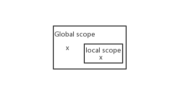
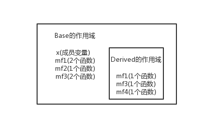

# 条款33：避免遮掩继承而来的名称

## 问题：C++的名称遮掩规则

```
int x;            //global变量
void someFunc() {
  double x;       //local变量
  std::cin >> x;  //此处为local变量x
}
```
上面例子的作用域形势如下：



C++内层作用域的名称会遮掩外层作用域的名称，C++的名称遮掩规则(name-hiding rules)所做的唯一事情就是：遮掩名称。至于类型是否相同并不重要，
本例中一个名为x的double遮掩了名为x的int

## 考虑：导入继承之后的名称遮掩规则

当某个derived class继承了声明于base class内的所有东西时，实际的运作方式是，derived class作用域被嵌套在base class作用域内，名称遮掩中唯一强调的就是名称，和其他无关

```
class Base {
private:
    int x;
public:
    virtual void mf1() = 0;
    virtual void mf1(int);
    virtual void mf2();
    void mf3();
    void mf3(double);
    ...
};
class Derived : public Base {
public:
    virtual void mf1();
    void mf3();
    void mf4();
    ...
};

```



上例中，base class内所有名为mf1和mf3的函数都被derived class内的mf1和mf3函数遮掩掉了。从名称查找观点来看，
Base::mf1(), Base::mf1(int), Base::mf3(), Base::mf3(double)都不再被Derived继承

```
Derived d;
int x;
...
d.mf1();    //没问题，调用Derived::mf1
d.mf1(x);   //错误，Derived::mf1遮掩了Base::mf1(int)
d.mf2();    //没问题，调用Base::mf2
d.mf3();    //没问题，调用Derived::mf3
d.mf3(x);   //错误，Derived::mf3遮掩了Base::mf3(double)
```

之所以要设计成这样，背后的理由是为了防止你在程序库或应用框架内建立新的Derived class时附带地从疏远的Base class继承重载函数。

### 两种方法继承被“命名遮掩规则”遮掩掉的Base class的函数
- using 声明式
  ```
  class Base {
  private:
      int x;
  public:
      virtual void mf1() = 0;
      virtual void mf1(int);
      virtual void mf2();
      void mf3();
      void mf3(double);
      ...
  };
  class Derived : public Base {
  public:
      using Base::mf1;  //让Base class内名为mf1和mf3的所有东西
      using Base::mf3;  //在Derived作用域内都可见(并且public)
      virtual void mf1();
      void mf3();
      void mf4();
      ...
  };
  ```

  

  ```
  Derived d;
  int x;
  ...
  d.mf1();  //没问题，Derived::mf1()
  d.mf1(x); //没问题，Base::mf1(x)
  d.mf2();  //没问题，Base::mf2()
  d.mf3(x); //没问题，Derived::mf3(x)
  d.mf3();  //没问题，Base::mf3()
  ```
- 转交函数

  using声明式会令继承而来的某给定名称之所有同名函数在Derived class中都可见。如果仅需要同名函数中某个版本在Derived class中可见，则需要使用转交函数。

  ```
  class Base {
  public:
      virtual void mf1() = 0;
      virtual void mf1(int);
      ...
  };
  class Derived : private Base {
  public:
      virtual void mf1()  //转交函数
      {   Base::mf1();  }
  };
  ```

  ```
  Derived d;
  int x;
  d.mf1();  //good,Derived::mf1()
  d.mf1(x); //error,Base::mf1()被遮掩
  ```

