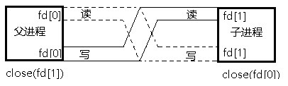

# Linux服务器开发

## 基础知识

<details>
<summary>cheatsheet</summary>

| 函数 | 功能 | 备注 |
| --- | --- | --- |
| `int open(const char* pathname, int flags)` | 打开或创建文件 |  |
| `int open(const char* pathname, int flags, mode_t mode)` |  |  |
| `ssize_t read(int fd, void* buf, size_t count)` |  |  |
| `ssize_t write(int fd, void* buf, size_t count)` |  |  |
| `off_t lseek(int fd, off_t offset, int whence)` | 移动文件fd的当前读写位置 |  |
| `int fcntl(int fd, int cmd)` | 改变一个已经打开文件的属性 | |
| `int fcntl(int fd, int cmd, long arg)` | | |
| `int fcntl(int fd, int cmd, struct flock* lock)` | | |
| `int ioctl(int d, int request, ...)` | 用于向设备发控制和配置命令 | |
| `int stat(const char* path, struct stat* buf)` | 获取文件Inode里主要信息 | |
| `int fstat(int fd, struct stat* buf)` |  | |
| `int lstat(const char* path, struct stat* buf)` | 相比stat，不跟踪符号链接 | |
| `int access(const char* pathname, int mode)` | | |
| `int chmod(const char* path, mode_t mode)` | | |
| `int fchmod(int fd, mode_t mode)` | | |
| `int chown(const char* path, uid_t owner, gid_t group)` | | |
| `int fchown(int fd, uid_t owner, gid_t group)` | | |
| `int lchown(const char* path, uid_t owner, gid_t group)` | | |
| `int truncate(const char* path, off_t length)` | | |
| `int ftruncate(int fd, off_t length)` | | |
| `int link(const char* oldpath, const char* newpath)` | 创建一个硬链接 | |
| `int symlink(const char* oldpath, const char* newpath)` | 创建一个软链接 | |
| `ssize_t readlink(const char* path, char* buf, size_t bufsiz)` | | |
| `int unlink(const char* pathname)` | 删除符号链接、硬链接数减1、创建临时文件 | |
| `int rename(const char* oldpath, const char* newpath)` | | |
| `int chdir(const char* path)` | 改变当前进程的工作目录 | |
| `int fchdir(int fd)` | | |
| `char* getcwd(char* buf, size_t size)` | 获取当前进程的工作目录 | |
| `long fpathconf(int fd, int name)` | | |
| `long pathconf(char* path, int name)` | | |
| `int mkdir(const char* pathname, mode_t mode)` | 创建目录 | |
| `int rmdir(const char* pathname)` | 删除目录 | |
| `DIR* opendir(const char* name)` | | |
| `DIR* fdopendir(int fd)` | | |
| `struct dirent* readdir(DIR* dirp)` | | |
| `void rewinddir(DIR* dirp)` | | |
| `long telldir(DIR* dirp)` | | |
| `void seekdir(DIR* dirp, long offset)` | | |
| `int closedir(DIR* dirp)` | | |
| `int dup(int oldfd)` | | |
| `int dup2(int oldfd, int newfd)` | | |
| `char* getenv(const char* name)` | | |
| `int setenv(const char* name, const char* value, int rewrite)` | | |
| `void unsetenv(const char* name)` | | |
| `int getrlimit(int resource, struct rlimit* rlim)` | | |
| `int setrlimit(int resource, const struct rlimit* rlim)` | | |
| `pid_t fork(void)` | | |
| `pid_t getpid(void)` | 返回调用进程的PID | |
| `pid_t getppid(void)` |返回调用进程父进程的PID | |
| `uid_t getuid(void)` | 返回实际用户ID | |
| `uid_t geteuid(void)` | 返回有效用户ID | |
| `gid_t getgid(void)` | 返回实际用户组ID | |
| `git_t getegid(void)` | 返回有效用户组ID | |
| `int execl(const char* path, const char* arg, ...)` | | |
| `int execlp(const char* file, const char* arg, ...)` | | |
| `int execle(const char* path, const char* arg, ..., char* const envp[])` | | |
| `int execv(const char* path, char* const argv[])` | | |
| `int execvp(const char* file, char* const argv[])` | | |
| `int execve(const char* path, char* const argv[], char* const envp[])` | | |
| `pid_t wait(int* status)` | | |
| `pid_t waitpid(pid_t pid, int* status, int options)` | | |
| `int pipe(int filedes[2])` | | |
| `int mkfifo(const char* pathname, mode_t mode)` | | |
| `void* mmap(void* addr, size_t length, int prot, int flags, int fd, off_t offset)` | | |
| `int munmap(void* addr, size_t length)` | | |
| `int kill(pid_t pid, int sig)` | | |
| `int raise(int sig)` | | |
| `void abort(void)` | | |
| `unsigned int alarm(unsigned int seconds)` | | |
| `int sigemptyset(sigset_t* set)` | | |
| `int sigfillset(sigset_t* set)` | | |
| `int sigaddset(sigset_t* set, int signo)` | | |
| `int sigdelset(sigset_t* set, int signo)` | | |
| `int sigismember(const sigset_t* set, int signo)` | | |
| `int sigprocmask(int how, const sigset_t* set, sigset_t* oset)` | 读取或更改进程的信号屏蔽字 | |
| `int sigpending(sigset_t* set)` | 读取当前进程的未决信号集 | |
| `int sigaction(int signum, const struct sigaction* act, struct sigaction* oldact)` | | |
| `int pause(void)` | 调用进程挂起，直到有信号抵达，如果抵达信号被忽略，则继续挂起 | | 
| `int sigsuspend(const sigset_t* mask)` | 制定mask函数执行期间临时解除对某个信号的屏蔽 | |
| `pid_t waitpid(pid_t pid, int* status, int options)` | | |
| `int sigqueue(pid_t pid, int sig, const union sigval value)` | | |
| `void (*sa_sigaction)(int, siginfo_t*, void*)` | | |
| `pid_t getpgid(pid_t pid)` | | |
| `pid_t getpgrp(void)` | | |
| `int setpgid(pid_t pid, pid_t pgid)` | | |
| `pid_t setsid(void)` | | |
| `pid_t getsid(pid_t pid)` | | |
| `int pthread_create(pthread_t* thread, const pthread_attr_t* attr, void* (*start_routine), void* arg)` | | | 
| `pthread_t pthread_self(void)` | | |
| `pthread_exit(void* retval)` | | |
| `pthread_join(pthread_t thread, void** retval)` | | |
| `pthread_cancel(pthread_t thread)` | | |
| `int pthread_detach(pthread_t tid)` | | |
| `int pthread_equal(pthread_t t1, pthread_t t2)` | | |
| `int pthread_attr_init(pthread_attr_t* attr)` | | |
| `int pthread_attr_destroy(pthread_attr_t* attr)` | | |
| `int pthread_attr_setdetachstate(pthread_attr_t* attr, int detachstate)` | | |
| `int pthread_attr_getdetachstate(pthread_attr_t* attr, int* detachstate)` | | |
| `int pthread_attr_setstackaddr(pthread_attr_t* attr, void* stackaddr)` | | |
| `int pthread_attr_getstackaddr(pthread_attr_t* attr, void** stackaddr)` | | |
| `int pthread_attr_setstacksize(pthread_attr_t* attr, size_t stacksize)` | | |
| `int pthread_attr_getstacksize(pthread_attr_t* attr, size_t* stacksize)` | | |
| `int pthread_attr_setstack(pthread_attr_t* attr, void* stackaddr, size_t stacksize)` | | |
| `int pthread_attr_getstack(pthread_attr_t* attr, void** stackaddr, size_t* stacksize)` | | |
| `int pthread_mutex_destroy(pthread_mutex_t* mutex)` | | |
| `int pthread_mutex_init(pthread_mutex_t* restrict mutex, const pthread_mutexattr_t* restrict attr)` | | | 
| `int pthread_mutex_lock(pthread_mutex_t* mutex)` | | |
| `int pthread_mutex_trylock(pthread_mutex_t* mutex)` | | |
| `int pthread_mutex_unlock(pthread_mutex_t* mutex)` | | |
| `pthread_rwlock_init` | | |
| `pthread_rwlock_destroy` | | |
| `pthread_rwlock_rdlock` | | |
| `pthread_rwlock_wrlock` | | |
| `pthread_rwlock_tryrdlock` | | |
| `pthread_rwlock_trywrlock` | | |
| `pthread_rwlock_unlock` | | |
| `pthread_cond_init` | | |
| `pthread_cond_destroy` | | |
| `pthread_cond_wait` | | |
| `pthread_cond_timedwait` | | |
| `pthread_cond_signal` | | |
| `pthread_cond_broadcast` | | |
| `sem_init` | | |
| `sem_wait` | | |
| `sem_trywait` | | |
| `sem_trywait` | | |
| `sem_timedwait` | | |
| `sem_post` | | |
| `sem_destroy` | | |
| `int pthread_mutexattr_init(pthread_mutexattr_t* attr)` | | |
| `int pthread_mutexattr_setpshared(pthread_mutexattr_t* attr, int pshared)` | | |
| `int pthread_mutexattr_destroy(pthread_mutexattr_t* attr)` | | |
| `uint32_t htonl(uint32_t hostlong)` | | |
| `uint16_t htons(uint16_t hostshort)` | | |
| `uint32_t ntohl(uint32_t netlong)` | | |
| `uint16_t ntohs(uint16_t netshort)` | | |
| `int inet_aton(const char* cp, struct in_addr* inp)` | | |
| `in_addr_t inet_addr(const char* cp)` | | |
| `char* inet_ntoa(struct in_addr in)` | | |
| `int inet_pton(int af, const char* stc, void* dst)` | | |
| `const char* inet_ntop(int af, const void* src, char* dst, socklen_t size)` | | |
| `int socket(int domain, int type, int protocol)` | | |
| `int bind(int sockfd, const struct sockaddr* addr, socklen_t addrlen)` | | |
| `int listen(int sockfd, int backlog)` | | |
| `int accept(int sockfd, struct sockaddr* addr, socklen_t* addrlen)` | | |
| `int connect(int sockfd, const struct sockaddr* addr, socklen_t addrlen)` | | |
| `int select(int nfds, fd_set* readfds, fd_set* writefds)` | | |
| `int poll(struct pollfd* fds, nfds_t nfds, int timeout)` | | |
| `int epoll_create(int size)` | | |
| `int epoll_ctl(int epfd, int op, int fd, struct epoll_event* event)` | | |
| `int epoll_wait(int epfd, struct epoll_event* events, int maxevents, int timeout)` | | |
| `void perror(const char* s)` | | |
| `char* strerror(int errnum)` | | |
| `int utime(const char* name, const struct utimebuf* t)` | 获取文件访问时间 | |
| `int getrusage(int who, struct rusage* usage)` | 获取CPU使用时间 | |

</details>

### Linux网络基础API

<details>
<summary>主机字节序和网络字节序——htonl、htons、ntohl、ntohs</summary>

# 主机字节序和网络字节序

主机字节序 <==> 小端字节序

网络字节序 <==> 大端字节序

以十六进制数0x1234为例：

小端字节序：00000001 00000010 00000011 00000100（高地址存高字节）

大端字节序：00000100 00000011 00000010 00000001（高地址存低字节）

主机字节序和网络字节序转换API：

```
#include <netinet/in.h>

unsigned long htonl( unsigned long hostlong );
unsigned short htons( unsigned short hostshort );
unsigned long ntohl( unsigned long netlong );
unsigned short ntohs( unsigned short netshor
```

</details>

<details>
<summary>sock地址结构体——sockaddr、sockaddr_un、sockaddr_in、sockaddr_in6</summary>

# socket地址结构体

## 通用socket地址：

```
#include <bits/socket.h>
struct sockaddr
{
    sa_family_t sa_family;
    char sa_data[14];
};
```

sa_family指明地址类型，地址类型可取值：

- AF_UNIX / PF_UNIX：Unix本地域协议族
- AF_INET / PF_INET：TCP/IPv4协议族
- AF_INET6 / PF_INET6：TCP/IPv6协议族

sa_data用于存放socket地址值，sa_family取不同协议值时，sa_data具有不同的含义和长度，当sa_family=

- AF_UNIX时：sa_data表示文件的路径名，长度可达108字节
- AF_INET：sa_data表示16bit端口号和32bit IPv4地址，共6字节
- AF_INET6：16bit端口号，32bit流标识，128bit IPv6地址，32bit范围ID，共26字节


14字节的sa_data根本无法容纳多数协议族的地址值，因此Linux还定义了下面这个新的通用socket地址结构体

```
struct sockaddr_storage
{
    sa_family_t sa_family;
    unsigned long int __ss_align;
    char __ss_padding[128-sizeof(__ss_align)];
};
```


## 专用socket地址：

UNIX本地域协议族sockaddr_un专用地址结构体：

```
#include <sys/un.h>
struct sockaddr_un
{
    sa_family_t sin_family;    //地址族：AF_UNIX
    char sun_path[108];    //文件路径名
};
```

Linux下IPv4专用socket地址结构体:

```
struct sockaddr_in
{
    sa_family_t sin_family;    //地址族：AF_INET
    u_int16_t sin_port;    //端口号：要用网络字节序表示
    struct in_addr sin_addr;    //IPv4地址结构体，见下
};
struct in_addr
{
    u_int32_t s_addr;    //IPv4地址，要用网络字节序表示
};
```

Linux下IPv6专用socket地址结构体:

```
struct sockaddr_in6
{
    sa_family_t sin6_family;    //地址族：AF_INET6
    u_int16_t sin6_port;    //端口号
    u_int32_t sin6_flowinfo;    //流信息，应设置为0
    struct in6_addr sin6_addr;    //IPv6地址
    u_int32_t sin6_scope_id;    //scope ID，尚在实验
};
struct in6_addr
{
    unsigned char sa_addr[16];  //IPv6地址，要用网络字节序表示
};
```

上述socket地址类型在使用过程中都要转化为sockaddr类型，因为所有的socket编程接口使用的地址参数的类型都是sockaddr

</details>

<details>
<summary>ip地址转换函数——inet_addr、inet_aton、inet_ntoa、inet_pton、inet_ntop</summary>

# IP地址转换函数

```
#include <arpa/inet.h>

in_addr_t inet_addr( const char *strptr );
int inet_aton( const char *cp, struct in_addr *inp );
```

**inet_addr** 函数将用点分十进制字符串表示的IPv4地址转化为用网络字节序整数表示的IPv4地址。失败返回INADDR_NONE

**inet_aton** 和inet_addr函数功能相同，但是将转化结果存储于参数inp指向的地址结构中。成功返回1，失败返回0

```
char *inet_ntoa( struct in_addr in );   //内部使用静态变量存储结果，不可重入
```

**inet_ntoa** 函数将用网络字节序整数表示的IPv4地址转化为用点分十进制字符串表示的IPv4地址，需要注意的是该函数内部使用静态变量存储结果，所以不可重入


**inet_pton** 和 **inet_ntop** 同时适用于IPv4和IPv6地址转化：

```
int inet_pton( int af, const char *src, void *dst );
const char *inet_ntop( int af, const void *src, char *dst, socklen_t cnt );
```

af参数指定地址族：可取`AF_INET`和`AF_INET6`

inet_pton函数将用字符串表示的IP地址src(IPv4或者IPv6)转化为网络字节序整数表示的IP地址。成功返回1，失败返回0并设置errno

inet_ntop函数将网络字节序整数src转化为字符串表示的IP地址，参数cnt指定dst字符串的长度

cnt参数可取的值为：
```
#include <netinet/in.h>
#define INET_ADDRSTRLEN 16
#define INET6_ADDRSTRLEN 46
```

inet_ntop成功时返回目标存储单元的地址，失败返回NULL并设置errno

</details>

<details>
<summary>创建socket——socket</summary>

# 创建socket

```
#include <sys/types.h>
#include <sys/socket.h>
int socket( int domain, int type, int protocol );
```

## 参数

- **domain** 指定协议族，可取值：
  - AF_INET
  - AF_INET6
  - AF_UNIX

- **type** 指定服务类型，可取值：

  - SOCK_STREAM：对TCP/IP协议族而言传输层使用TCP
  - SOCK_UGRAM：对TCP/IP协议族而言传输层使用UDP

  新版本Linux下，type可以接受与下面两个值相与的结果：

  - SOCK_NONBLOCK：设新创建的socket为非阻塞
  - SOCK_CLOEXEC：fork之后子进程中关闭该socket

- **protocol** ：0

## 返回值

socket成功返回socket文件描述符，失败返回-1并设置errno

## 示例


例：创建IPv4和TCP传输时使用的非阻塞socket：

```
#include <sys/types.h>
#include <sys/socket.h>

int sockfd;

if ( ( sockfd = socket(AF_INET, SOCK_STREAM & SOCK_NONBLOCK, 0) ) == -1)
{
    printf("create socket error: %s(errno: %d)\n", strerror(errno), errno);
    exit(0);
}
```

</details>

<details>
<summary>命名socket——bind</summary>

# 命令socket

`bind`函数用于将socket文件描述符与socket地址绑定，一般用在服务器代码中

```
#include <sys/types.h>
#include <sys/socket.h>
int bind( int sockfd, const struct sockaddr* my_addr, socklen_t addrlen );
```

## 1. 参数

- **sockfd**： socket的文件描述符
- **my_addr**：socket地址
- **addrlen**：socket地址的长度

## 2. 返回值

`bind`成功返回0，失败返回-1并设置errno， 常见的两种errno:
- 1. EACCES：被绑定的地址是受保护的地址，仅超级用户可以访问。比如普通用户将socket绑定到知名服务端口(0~1023)
- 2. EADDRINUSE：被绑定的地址正在使用中。比如将socket绑定到一个处于TIME_WAIT状态的socket地址

## 3. 示例

```
#include <sys/types.h>
#include <sys/socket.h>
#include <netinet/in.h>

int main()
{
    struct sockaddr_in bindaddr;
    bindaddr.sin_family = AF_INET;
    bindaddr.sin_addr.s_addr = htonl(INADDR_ANY);
    bindaddr.sin_port = htons(3000);
    int listenfd = socket(AF_INET, SOCK_STREAM & SOCK_NONBLOCK, 0);
    if ( bind(listenfd,  (struct sockaddr*)&bindaddr, sizeof(bindaddr) == -1 ) {
        perror("bind failed\n");
        exit(1);
    }
    return 0;
}
```
 
</details>

<details>
<summary>监听socket——listen</summary>

# 监听socket

服务器程序中，socket被bind之后，还需要使用listen创建一个监听队列以存放待处理的客户连接

```
#include <sys/socket.h>
int listen( int sockfd, int backlog );
```

## 1. 参数

- **sockfd**：指定被监听的socket

- **backlog**：内核监听队列的最大长度。 
  表示处于完全连接状态(`ESTABLISHED`)的socket的上限，处于半连接状态(`SYN_RCVD`)的sock上限则由/proc/sys/net/ipv4/tcp_max_syn_backlog内核参数定义。典型值为5（实际监听队列中完整连接的上限通常比backlog值略大）

## 2. 返回值

listen成功时返回0，失败返回-1并设置errno

## 3. 示例

```
#include <sys/socket.h>
#include <netinet/in.h>
#include <arpa/inet.h>
#include <signal.h>
#include <unistd.h>
#include <stdlib.h>
#include <assert.h>
#include <stdio.h>
#include <string.h>

static bool stop = false;

//SIGTERM信号的处理函数，触发时结束主程序的循环
static void handle_term(int sig)
{
    stop = true;
}

int main( int argc, char* argv[] )
{
    signal(SIGTERM, handle_term);

    if (argc <= 3)
    {
        printf("usage: %s ip_address port_number backlog\n", 
            basename(argv[0]));
        return 1;
    }
    const char* ip = argv[1];
    int port = atoi(argv[2]);
    int backlog = atoi(argv[3]);
    int sock = socket(PF_INET, SOCK_STREAM, 0);
    assert(sock >= 0);

    //创建一个IPv4 socket地址
    struct sockaddr_in address;
    bzero(&address, sizeof(address));
    address.sin_family = AF_INET;
    inet_pton(AF_INET, ip, &address.sin_addr);
    address.sin_port = htons(port);

    int ret = bind(sock, (struct sockaddr*)&address, sizeof(address));
    assert(ret != -1);
    
    ret = listen(sock, backlog);
    assert(ret != -1);

    //循环等待连接，直到SIGTERM信号将它中断
    while (!stop)
    {
        sleep(1);
    }

    //关闭socket
    close(sock);
    return 0;
}
```

可以在服务器上运行该代码，然后在本地多次执行命令连接服务器程序，使用netstat命令查看服务器的连接状态

```
# 服务器上运行上面程序，监听6677端口，设置监听队列大小为5
# serve_ip可以使用服务器公网IP，也可以使用0.0.0.0
./testlisten 0.0.0.0 6677 5

# 在本地多次执行和服务器建立连接
telnet server_ip 6677

# 本地每执行一次telnet，服务器执行下命令查看连接状态
netstat -nt | grep 6677
```

一般来说，服务器监听队列中，处于`ESTABLISHED`状态的连接只有6个(backlog+1)，其他都处于`SYN_RCVD`状态，改变服务器程序第3个参数并重新运行能发现该规律

</details>

<details>
<summary>接受连接——accept</summary>

# 接受连接accept

服务器程序使用`accept`函数从listen监听队列中接受一个连接

```
#include <sys/types.h>
#include <sys/socket.h>
int accept(int sockfd, struct sockaddr *addr, socklen_t *addrlen);
```

## 1. 参数

- **sockfd**：执行过listen系统调用的监听socket
- **addr**：获取的被接受连接的远端socket地址
- **addrlen**：addr的长度，传入传出参数，传入时指定addr的类型大小，返回获取到的远端地址的实际长度

## 2. 返回值

accept成功时返回一个新连接socket，该socket唯一的标识了被接受的连接，服务器可以通过读写该socket来与被接受连接对应的客户端通信

accept失败时返回-1并设置errno

## 3. 示例

```
#include <sys/socket.h>
#include <netinet/in.h>
#include <arpa/inet.h>
#include <assert.h>
#include <stdio.h>
#include <unistd.h>
#include <stdlib.h>
#include <errno.h>
#include <string.h>

int main(int argc, char* argv[]) {
    if (argc <= 2) {
        printf("usage: %s ip_address port_number\n", basename(argv[0]));
        return 1;
    }
    const char* ip = argv[1];
    int port = atoi(argv[2]);

    struct sockaddr_in address;
    bzero(&address, sizeof(address));
    address.sin_family = AF_INET;
    inet_pton(AF_INET, ip, &address.sin_addr);
    address.sin_port = htons(port);

    int sock = socket(PF_INET, SOCK_STREAM, 0);
    assert(sock >= 0);

    int ret = bind(sock, (struct sockaddr*)&address, sizeof(address));
    assert(ret != -1);

    ret = listen(sock, 5);
    assert(ret != -1);

    struct sockaddr_in client;
    socklen_t client_addrlength = sizeof(client);
    int connfd = accept(sock, (struct sockaddr*)&client, &client_addrlength);
    if (connfd < 0) {
        printf("errno is : %d\n", errno);
    }
    else {
        char remote[INET_ADDRSTRLEN];
        printf("connected with ip: %s and port: %d\n", 
            inet_ntop(AF_INET, &client.sin_addr, remote, INET_ADDRSTRLEN), 
            ntohs(client.sin_port));
        close(connfd);
    }
    close(sock);
    return 0;
}

```

在远端服务器运行该代码，然后在本地执行telnet命令来连接服务器程序，查看服务器输出

```
# 服务器
./testaccept 0.0.0.0 1234

# 客户端
telnet server_ip 1234
```

accept函数只是从监听队列中取出连接，而不论连接处于何种状态，更不关心任何网络状况的变化
> 如果监听队列中处于ESTABLISHED状态的连接对应的客户端出现网络异常（掉线）或者提前退出，那么服务器对这个连接执行的accept调用还是会成功，也即是accept返回的连接并不总是处于ESTABLISHED状态，accept函数对连接加入监听队列到取出监听队列这一阶段的连接状态改变一无所知

</details>

<details>
<summary>发起连接——connect</summary>

# 发起连接connect

客户端通过`connect`系统调用来主动和服务器建立连接

```
#include <sys/types.h>
#include <sys/socket.h>
int connect(int sockfd, const struct sockaddr* serv_addr, socklen_t addrlen);
```

## 1. 参数

- **sockfd**：客户端socket
- **serv_addr**：服务器socket
- **addrlen**：serv_addr长度

## 2. 返回值

connect成功返回0，成功建立连接后，客户端就可以通过sockfd与服务器通信

connect失败返回-1并设置errno，两种常见的errno：
- ECONNREFUSED：目标端口不存在，连接被拒绝
- ETIMEDOUT：连接超时

## 3. 示例

### 3.1 对阻塞socket进行connect

```
#include <sys/types.h>
#include <sys/socket.h>
#include <stdlib.h>
#include <errno.h>
#include <string.h>
#include <unistd.h>
#include <stdio.h>
#include <arpa/inet.h>
#include <assert.h>
#include <netinet/in.h>

int main(int argc, char* argv[]) {
    if (argc <= 2) {
        printf("usage: %s ip_address port\n", basename(argv[0]));
        return 1;
    }
    const char* ip = argv[1];
    int port = atoi(argv[2]);

    struct sockaddr_in serv_addr;
    bzero(&serv_addr, sizeof(serv_addr));
    serv_addr.sin_family = AF_INET;
    inet_pton(AF_INET, ip, &serv_addr.sin_addr);
    serv_addr.sin_port = htons(port);

    int serv_len = sizeof(serv_addr);

    int sockfd = socket(AF_INET, SOCK_STREAM, 0);
    assert(sockfd >= 0);

    int ret = connect(sockfd, (struct sockaddr*)&serv_addr, serv_len); 
    if (ret == -1) {
        printf("connect error with errno: %d\n", ret);
        return 1;
    }

    close(sockfd);
    return 0;
}
```

### 3.2 对非阻塞socket进行connect

```
#include <sys/types.h>
#include <sys/socket.h>
#include <stdlib.h>
#include <errno.h>
#include <string.h>
#include <unistd.h>
#include <stdio.h>
#include <arpa/inet.h>
#include <assert.h>
#include <netinet/in.h>
#include <fcntl.h>

int main(int argc, char* argv[]) {
    if (argc <= 2) {
        printf("usage: %s ip_address port\n", basename(argv[0]));
        return 1;
    }
    const char* ip = argv[1];
    int port = atoi(argv[2]);

    struct sockaddr_in serv_addr;
    bzero(&serv_addr, sizeof(serv_addr));
    serv_addr.sin_family = AF_INET;
    inet_pton(AF_INET, ip, &serv_addr.sin_addr);
    serv_addr.sin_port = htons(port);

    int serv_len = sizeof(serv_addr);

    int sockfd = socket(AF_INET, SOCK_STREAM, 0);
    assert(sockfd >= 0);

    //设置sockfd为非阻塞
    int flag = fcntl(sockfd, F_GETFL, 0);
    fcntl(sockfd, F_SETFL, flag | O_NONBLOCK);

    while (true) {
        int ret = connect(sockfd, (struct sockaddr*)&serv_addr, serv_len); 
        if (ret == 0) {
            printf("connect success!\n");
            break;
        } else {
            if (errno != EINPROGRESS) {
                printf("connect error with errno: %d\n", ret);
                break;
            } else {
                //errno为EINPROGRESS时表示正在连接
                printf("connection is being established\n");
                sleep(1);
                continue;
            }
        }
    }

    close(sockfd);
    return 0;
}

```

</details>

<details>
<summary>关闭连接——close、shutdown</summary>

# 关闭连接

关闭一个连接实际上就是关闭连接对应的socket，所以可以使用关闭普通文件描述符的系统调用来完成

## 1. close

close系统调用并非总是立即关闭一个连接，而是将fd的引用计数减1。只有当fd的引用计数为0时，才真正关闭连接
> 如果在多进程程序中，一次fork调用默认将使父进程中打开的socket的引用计数加1，因此必须在父进程和子进程都调用close才能将连接真正关闭


```
#include <unistd.h>
int close(int fd);
```

### 1.1. 参数

- **fd**：要关闭的socket

### 1.2. 返回值

成功返回0，失败返回-1并设置errno

## 2. shutdown

shutdown系统调用专为网络编程设计，可以立即终止连接(与close不同)

```
#include <sys/socket.h>
int shutdown(int sockfd, int howto);
```

### 1.1. 参数

- **sockfd**：要关闭的socket
- **howto**：决定了shutdown的行为，可取以下值：

  - SHUT_RD：关闭读端，并且socket接收缓冲区中的数据被丢弃
  - SHUT_WR：关闭写段，关闭之前将socket发送缓冲区内容发送出去
  - SHUT_RDWR：同时关闭读端和写端

### 1.2. 返回值

shutdown成功返回0，失败返回-1并设置errno

</details>

<details>
<summary>数据读写——recv、send、recvfrom、sendto、recvmsg、sendmsg</summary>

# 数据读写

## 1. TCP数据读写

对文件的读写操作`read`和`write`同样适用于socket，但是socket编程接口中提供了专门用于socket数据读写的系统调用，它们增加了对数据读写的控制，用于TCP流数据读写的系统调用是：

```
#include <sys/types.h>
#include <sys/socket.h>
ssize_t recv(int sockfd, void* buf, size_t len, int flags);
ssize_t send(int sockfd, const void* buf, size_t len, int flags);
```

### 1.2. 主要参数和返回值

- **recv**：
  - len --> buf空间的大小(sizeof)
  - 返回值 --> 读取到的数据的长度

- **send**：
  - len --> 发送数据的长度(strlen) 
  - 返回值 --> 实际发送的数据的长度

- **flags**：只对此次调用有效，只列举部分选项，更多查看man page

  - MSG_OOB：发送或接受紧急数据（both）
  - MSG_PEEK：窥探读缓存中的数据，此次读不会导致这些数据清除（recv）
  - MSG_DONTWAIT：对socket的此次操作是非阻塞的（both）
  - MSG_WAITALL：读操作仅在读取到指定数量的字节才返回（recv）
  - MSG_MORE：防止TCP发送过多小的数据报文（send）
  - MSG_NOSIGNAL：读端关闭不引起SIGPIPE信号（send）

### 1.3. 使用

发送带外数据：

```
#include <sys/socket.h>
#include <netinet/in.h>
#include <arpa/inet.h>
#include <assert.h>
#include <stdio.h>
#include <unistd.h>
#include <string.h>
#include <stdlib.h>

int main(int argc, char* argv[]) {
    if (argc <= 2) {
        printf("usage: %s ip port\n", basename(argv[0]));
        return 1;
    }

    const char* ip = argv[1];
    short port = atoi(argv[2]);

    int sockfd = socket(AF_INET, SOCK_STREAM, 0);
    assert(sockfd >= 0);

    struct sockaddr_in serv_addr;
    bzero(&serv_addr, sizeof(serv_addr));
    serv_addr.sin_family = AF_INET;
    inet_pton(AF_INET, ip, &serv_addr.sin_addr);
    serv_addr.sin_port = htons(port);

    if ( connect(sockfd, (struct sockaddr*)&serv_addr, sizeof(serv_addr)) < 0 ) {
        printf("connect failed\n");
    } else {
        const char* oob_data = "abc";
        const char* normal_data = "123";
        int ret = send(sockfd, normal_data, strlen(normal_data), 0);
        printf("send %d bytes data\n", ret);
        ret = send(sockfd, oob_data, strlen(oob_data), MSG_OOB);
        printf("send %d bytes data\n", ret);
        ret = send(sockfd, normal_data, strlen(normal_data), 0);
        printf("send %d bytes data\n", ret);
    }

    close(sockfd);
    return 0;
}
```

接收带外数据：

```
#include <sys/socket.h>
#include <netinet/in.h>
#include <arpa/inet.h>
#include <assert.h>
#include <stdio.h>
#include <unistd.h>
#include <string.h>
#include <stdlib.h>
#include <errno.h>

#define BUF_SIZE 1024

int main(int argc, char* argv[]) {
    if (argc <= 2) {
        printf("usage: %s ip port\n", basename(argv[0]));
        return 1;
    }

    const char* ip = argv[1];
    short port = atoi(argv[2]);

    struct sockaddr_in serv_addr;
    bzero(&serv_addr, sizeof(serv_addr));
    inet_pton(AF_INET, ip, &serv_addr.sin_addr);
    serv_addr.sin_port = htons(port);

    int sockfd = socket(AF_INET, SOCK_STREAM, 0);
    assert(sockfd >= 0);

    int ret = bind(sockfd, (struct sockaddr*)&serv_addr, sizeof(serv_addr));
    assert(ret != -1);

    ret = listen(sockfd, 5);
    assert(ret != -1);

    struct sockaddr_in cli_addr;
    bzero(&cli_addr, sizeof(cli_addr));

    socklen_t cli_addrlen = sizeof(cli_addr);

    int connfd = accept(sockfd, (struct sockaddr*)&cli_addr, &cli_addrlen);
    if (connfd < 0) {
        printf("errno: %d\n", errno);
    } else {
        char buffer[BUF_SIZE];
        memset(buffer, '\0', BUF_SIZE);
        ret = recv(connfd, buffer, BUF_SIZE-1, 0);
        printf("got %d bytes of normal data '%s'\n", ret, buffer);

        memset(buffer, '\0', BUF_SIZE);
        ret = recv(connfd, buffer, BUF_SIZE-1, MSG_OOB);
        printf("got %d bytes of oob data '%s'\n", ret, buffer);

        memset(buffer, '\0', BUF_SIZE);
        ret = recv(connfd, buffer, BUF_SIZE-1, 0);
        printf("got %d bytes of normal data '%s'\n", ret, buffer);

        close(connfd);
    }

    close(sockfd);
    return 0;
}
```

可以使用`tcpdump`来抓取发送数据的过程：
```
sudo tcpdump -ntx -i eth0 port 1234
```

## 2. UDP数据读写

socket编程接口中用于UDP数据报读写的系统调用是：

```
#include <sys/types.h>
#include <sys/socket.h>

ssize_t recvfrom( int sockfd, void *buf, size_t len, 
                  int flags, struct sockaddr* src_addr, socklen_t* addrlen );

ssize_t sendto( int sockfd, const void *buf, size_t len, 
                  int flags, const struct sockaddr *dest_addr, socklen_t addrlen );
```

recvfrom/sendto和recv/send的前四个参数意义相同，当recvfrom/sendto的后两个参数为NULL时等价于recv/send。

## 3. 通用数据读写

socket编程接口提供的`recvmsg`和`sendmsg`通用数据读写系统调用，既可以用于TCP流数据，也可以用于UDP数据报

```
#include <sys/socket.h>
ssize_t recvmsg( int sockfd, struct msghdr* msg, int flags );
ssize_t sendmsg( int sockfd, struct msghdr* msg, int flags );
```

### 3.1 参数和返回值

- **sockfd**：被操作的目标socket
- **msg**：msghdr结构体类型的指针

  ```
  struct msghdr
  {
      void* msg_name;    //socket地址
      socklen_t msg_namelen;    //socket地址的长度
      struct iovec* msg_iov;    //分散的内存块
      int msg_iovlen;    //分散内存块的数量
      void* msg_control;    //指向辅助数据的起始位置
      socklen_t msg_controllen;    //辅助数据的大小
      int msg_flags;    //复制函数中的flags参数，并在调用过程中更新
  };
  ```

  - msg_name:指向socket结构 体变量，指定通信对方的socket地址，对于面向连接的tcp协议，该值设为NULL
  - msg_iov：iovec结构体类型的指针
  ```
  struct iovec* msg_iov:
  struct iovec
  {
      void *iov_base;    //内存起始位置
      size_t iov_len;    //该内存的长度
  }
  ```
  - msg_iovlen：iovec块的个数

- **flags**：recv/send的flag参数相同

- **返回值**：recvmsg/sendmsg的返回值和recv/send的返回值相同

### 3.2 使用

recvmsg/sendmsg读写数据的形式分别为`分散读`和`集中写`：

- **分散读(scatter read)：**
  recvmsg将数据读取并存放在msg_iovlen块分散的内存中，这些内存的位置和长度由msg_iov指向的数据指定

- **集中写(gather write)：**
  sendmsg将msg_iovlen块分散内存中的数据一并发送

例：
```

```

</details>

<details>
<summary>带外标记——sockatmark</summary>

# 带外标记

内核通知应用程序带外数据到达的两种常见方式：**I/O复用产生的异常事件**和**SIGURG信号**

当内核通知带外数据到达时，可以通过sockatmark判断sockfd是否处于带外标记，即下一个被读取到的数据是否是带外数据，如果是，sockatmakr返回1，此时可以通过带MSG_OOB标志的recv调用来接收带外数据。如果不是，则sockatmark返回0

```
#include <sys/socket.h>
int sockatmark(int sockfd);
```

sockatmark函数的一个常见实现：
```
int sockatmark(int fd) {
    int flag;
    if (ioctl(fd, SIOCATMARK, &flag) < 0)
        return -1;
    return (flag != 0);
}
```

[参考文章](https://blog.csdn.net/ctthuangcheng/article/details/9569011)

</details>

<details>
<summary>地址信息函数——getsockname、getpeername</summary>

# 地址信息函数

有时，我们想知道一个连接socket的本端socket地址和远端socket地址，可以使用`getsockname`和`getpeername`

```
#include <sys/socket.h>
int getsockname(int sockfd, struct sockaddr* address, socklen_t* address_len);
int getpeername(int sockfd, struct sockaddr* address, socklen_t* address_len);
```

getsockname获取sockfd对应的本端的socket地址，成功返回0，失败返回-1并设置errno

getpeername获取sockfd对应的远端的socket地址


## 使用：
```
#include <sys/types.h>
#include <sys/socket.h>
#include <stdlib.h>
#include <errno.h>
#include <string.h>
#include <unistd.h>
#include <stdio.h>
#include <assert.h>
#include <netinet/in.h>
#include <arpa/inet.h>


int main(int argc, char* argv[]) {
    if (argc <= 2) {
        printf("usage: %s ip_address port\n", basename(argv[0]));
        return 1;
    }

    const char* ip = argv[1];
    int port = atoi(argv[2]);

    struct sockaddr_in serv_addr;
    bzero(&serv_addr, sizeof(serv_addr));
    serv_addr.sin_family = AF_INET;
    inet_pton(AF_INET, ip, &serv_addr.sin_addr);
    serv_addr.sin_port = htons(port);

    int sockfd = socket(AF_INET, SOCK_STREAM, 0);      
    assert(sockfd >= 0);

    int ret = bind(sockfd, (struct sockaddr*)&serv_addr, sizeof(serv_addr));
    assert(ret != -1);

    ret = listen(sockfd, 5);
    assert(ret != -1);

    struct sockaddr_in cli_addr;
    bzero(&cli_addr, sizeof(cli_addr));

    while (true) {

        socklen_t cli_addrlen = sizeof(cli_addr);
        int connfd = accept(sockfd, (struct sockaddr*)&cli_addr, &cli_addrlen);

        if (connfd < 0) {
            printf("errno: %d\n", errno);
        } else {
            struct sockaddr_in sock_name;
            bzero(&sock_name, sizeof(sock_name));
            socklen_t sockname_len = sizeof(sock_name);
            int ret = getsockname(sockfd, (struct sockaddr*)&sock_name, &sockname_len);
            char sockname_addr[1024];
            inet_ntop(AF_INET, &sock_name.sin_addr.s_addr, sockname_addr, sizeof(sockname_addr));
            struct sockaddr_in peer_name;
            bzero(&peer_name, sizeof(peer_name));
            socklen_t peername_len = sizeof(peer_name);
            ret = getpeername(sockfd, (struct sockaddr*)&peer_name, &peername_len);
            char peername_addr[1024];
            inet_ntop(AF_INET, &peer_name.sin_addr.s_addr, peername_addr, sizeof(peername_addr));

            printf("sockname : ip: %s, port: %d\n", sockname_addr, ntohs(sock_name.sin_port));
            printf("peername : ip: %s, port: %d\n", peername_addr, ntohs(peer_name.sin_port));

            close(connfd);
        }
    }

    close(sockfd);
    return 0;
}
```

</details>

<details>
<summary>socket选项——getsockopt、setsockopt</summary>

# socket选项

fcntl系统调用是控制文件描述符属性的通用POSIX方法，而getsockopt和setsockopt则是专门用来读取和设置socket文件描述符属性的方法：

```
#include <sys/socket.h>
int getsockopt(int sockfd, int level, int option_name, 
               void *option_value, socklen_t *restrict option_len);
int setsockopt(int sockfd, int level, int option_name, 
               const void *option_value, socklen_t option_len);
```

## 1. 参数

- **sockfd**：被操作的目标socket
- **level**：指定要操作那个协议的选项，例如IPv4、IPv6、TCP等
- **option_name**：指定选项名字
- **option_vlaue和option_len**：分别指定被操作选项的值和长度

## 2. 返回值

两个函数成功时都返回1，失败时返回-1并设置errno

对服务器而言：
> 有部分socket选项只能在调用listen前针对监听socket设置才有效，因为连接socket只能由accept调用返回，而accept从listen监听队列中接收的连接至少已经完成了tcp三次握手的前两个步骤（监听队列中的连接至少已经进入SYN_RCVD状态），这说明服务器已经往被接收连接上发送除了tcp同步报文段。但有的socket选项却应该在tcp同步报文段中设置，比如tcp最大报文段选项，对这种情况解决方案：对监听socket设置这些socket选项，那么accept返回的连接socket将自动继承这些选项，这些socket选项包括：SO_DEBUG、SO_DONTROUTE、SO_KEEPALIVE、SO_LINGER、SO_OOBINLINE、SO_RCVBUF、SO_RCVLOWAT、SO_SNDBUF、SO_SNDLOWAT、TCP_MAXSEG和TCP_NODELAY

对客户端而言：
> 这些socket选项应该在调用connect函数之前设置，因为connect调用成功返回之后，tcp三次握手已经完成

## 3. socket选项

- **SO_REUSEADDR**

  设置socket选项SO_REUSEADDR来强制使用被处于TIME_WAIT状态的连接的占用的socket地址。

  具体实现方法如下：

  ```
  int sockfd = socket(AF_INET, SOCK_STREAM, 0);
  assert(sockfd >= 0);

  //设置SO_REUSEADDR
  int reuse = 1;
  setsockopt(sock, SOL_SOCKET, SO_REUSEADDR, &reuse, sizeof(reuse));

  struct sockaddr_in address;
  bzero(&address, sizeof(address));
  address.sin_family = AF_INET;
  inet_pton(AF_INET, ip, &address.sin_addr);
  address.sin_port = htons(port);
  int ret = bind(sock, (struct sockaddr*)&address, sizeof(address));
  ```

  此外还可以通过修改内核参数`/proc/sys/net/ipv4/tcp_tw_recycle`来快速回收被关闭的socket，使得tcp连接根本就不会进入TIME_WAIT状态，进而允许应用程序立即重用本地的socket地址

- **SO_RCVBUF和SO_SNDBUF**

  SO_RCVBUF：设置TCP接收缓冲区大小

  SO_SNDBUF：设置TCP发送缓冲区大小

  > 使用setsockopt设置TCP缓冲区大小时，系统一般都会将设置值加倍，并且不得小于某个值，一般TCP接收缓冲区最小值为256字节，而发送缓冲区的最小值是2048字节，这种机制的目的是确保一个TCP连接拥有足够的空闲缓冲区处理拥塞，可以通过修改内核参数`/proc/sys/net/ipv4/tcp_rmem`和`/proc/sys/net/ipv4/tcp_wmem`来强制TCP接收和发送缓冲区的大小没有最小值限制

  ```
  int sendbuf = 4096;
  int sendlen = sizeof(sendbuf);
  setsockopt(sock, SOL_SOCKET, SO_SNDBUF, &sendbuf, sizeof(sendbuf));
  getsockopt(sock, SOL_SOCKET, SO_SNDBUF, &sendbuf, (socklen_t *)&sendlen);

  int recvbuf = 1024;
  int recvlen = sizeof(recvbuf);
  setsockopt(sock, SOL_SOCKET, SO_RCVBUF, &recvbuf, sizeof(recvbuf));
  getsockopt(sock, SOL_SOCKET, SO_RCVBUF, &recvbuf, (socklen_t *)&recvlen);
  ```

- **SO_RCVLOWAT和SO_SNDLOWAT**

  SO_RCVLOWAT：表示TCP接收缓冲区的低水位标记，当TCP接收缓冲区中可读数据的总数大于其低水位标记时，I/O复用系统调用将通知应用程序可以从对应的socket读取数据

  SO_SNDLOWAT：表示TCP发送缓冲区的低水位标记，当TCP发送缓冲区中的空闲空间大于其低水位标记时，I/O复用系统调用将通知应用程序可以往对应的socket上写入数据

  这两个标记一般被I/O复用系统调用用来判断socket是否可读或可写，默认情况这两个低水位标记均为1字节

- **SO_LINGER**

  SO_LINGER：用于控制close系统调用在关闭TCP连接时的行为(默认情况下使用close关闭一个socket时，close将立即返回，TCP模块负责将socket对应的TCP发送缓冲区中残留的数据发送给对方)

  设置SO_LINGER需要给setsockopt和setsockopt系统调用传递一个linger类型结构体

  ```
  #include <sys/socket.h>
  struct linger
  {
      int l_onoff;    //开启(非0)还是关闭(0)该选项
      int l_linger;   //滞留时间
  };
  ```

  - 1. l_onoff=0：

    SO_LINGER设置无效，close()保持默认行为

  - 2. l_onoff!=0：

    l_linger=0：close()立即返回，丢弃被关闭socket发送缓冲区残留的数据，同时向对方发送一个复位报文段

  - 3. l_onoff!=0， l_linger>0：
    如果socket是阻塞的，close将等待l_linger的时间再返回，如果close返回时TCP模块中还没有发送完残留数据并得到对方的确认，close系统调用将返回-1并设置errno为EWOULDBLOCK；如果socket非阻塞，close立即返回，然后根据返回值和errno判断残留数据是否发送完毕

</details>

<details>
<summary>网络信息API——gethostbyname、gethostbyaddr、getservbyname、getservbyport、getaddrinfo、getnameinfo</summary>

# 网络信息API

## 1. gethostbyname和gethostbyaddr

gethostbyname：根据主机名称获取主机完整信息，会先在/etc/hosts查找主机，找不到再访问DNS服务器查找

gethostbyaddr：根据IP地址获取主机完整信息 

```
#include <netdb.h>
struct hostent* gethostbyname(const char* name);
struct hostent* gethostbyaddr(const void* addr, size_t len, int type);
```

- name：目标主机主机名
- addr：指定目标主机的IP地址
- len：addr所指IP地址的长度
- type：addr所指的IP地址类型，可取AF_INET和AF_INET6

返回值类型：

```
struct hostent
{
    char* h_name;          //主机名
    char** h_aliases;      //主机别名列表
    int h_addrtype;        //地址类型
    int h_length;            //地址长度
    char** h_addr_list;  //按网络字节序列出的主机IP地址列表
};
```

使用：
```
char *host = "www.baidu.com";
struct hostent* hostinfo = gethostbyname(host);
assert(hostinfo);
```

这两个函数都是不可重入函数，对应的可重入函数为原函数名+_r

## 2. getservbyname和getservbyport

getservbyname：根据名称获取某个服务的完整信息

getservbyport：根据端口号获取某个服务的完整信息

```
#include <netdb.h>
struct servent* getservbyname(const char* name, const char* proto);
struct servent* getservbyport(int port, const char* proto);
```

- name：目标服务的名字
- port：目标服务对应端口号
- proto：指定服务类型，"tcp"表示流服务，"udp"表示数据报服务

返回值类型：
```
struct servent
{
    char* s_name;       //服务名称
    char** s_aliases;   //服务别名列表
    int s_port;             //端口号
    char* s_proto;      //服务类型tcp or udp
};
```

使用：
```
struct servent* servinfo = getservbyname("daytime", "tcp");
assert(servinfo);
```

这两个函数都是不可重入函数，对应的重入版本为原函数名+_r

## 3. getaddrinfo

getaddrinfo即能通过主机名获得IP地址(内部使用gethostbyname)，也能通过服务名获得端口号(内部使用getservbyname)，它是否可重入取决于内部调用的gethostbyname和getservbyname是否是可重入版本

```
#include <netdb.h>
int getaddrinfo(const char* hostname, const char* service, 
                      const struct addrinfo* hints, struct addrinfo** result)
```

- hostname：字符串形式的主机名或IP地址
- service：字符串形式服务名或十进制端口号
- result：结果链表
- hints：对getaddrinfo的输出进行精确控制

  ```
  struct addrinfo
  {
      int ai_flags;                      //后文
      int ai_family;                    //地址族
      int ai_socktype;               //SOCKET_STREAM or SOCKET_DGRAM
      int ai_protocol;                //后文
      socklen_t ai_addrlen;      //socket地址ai_addr的长度
      char* ai_canonname;      //主机别名
      struct sockaddr* ai_addr; //指向socket地址
      struct addrinfo* ai_next;  //下一个addrinfo地址
  };
  ```
  - ai_protocol：具体的网络协议，含义与socket系统调用第三个参数相同，通常为0
  - ai_flags(主要选项):
    - AI_CANONONAME：hists参数设置，告诉getaddrinfo函数返回主机别名
    - AI_NUMERICHOST：hists参数设置，hostname必须是用字符串表示的IP地址，避免DNS查询
    - AI_NUMERICSERV：hists参数设置，service强制使用十进制端口号的字符串形式,不能是服务名

使用：
```
struct addrinfo hints;
struct addrinfo* res;

bzero(&hints, sizeof(hints));
hints.ai_socktype = SOCKET_STREAM;
getaddrinfo("ernest-laptop", "daytime", &hints, &res);
```

getaddrinfo中为res指针隐式分配堆内存，所以函数调用完毕后，使用如下配对函数释放这块内存：

```
void freeaddrinfo(struct addrinfo* res);
```

## 4. getnameinfo

getnameinfo函数通过socket地址获得字符串形式的主机名和服务名(内部由gethostbyaddr和getservbyport实现)，它是否可重入由内部调用gethostbyaddr和getservbyport的可重入版本

```
#inlcude <netdb.h>
int getnameinfo(const struct sockaddr* sockaddr, socklen_t addrlen, char* host, 
                socklen_t hostlen, char* serv, socklen_t servlen, int flags);
```

- host：返回的主机名
- serv：返回的服务名
- flags(主要选项)：
  - NI_NAMEREQD：通过socket地址不能得到主机名则返回错误
  - NI_NUMERICHOST：返回字符串表示的IP地址，而非主机名
  - NI_NUMERICSERV：返回字符串表示的十进制端口号，而非服务名

</details>

### 高级IO函数

<details>
<summary>pipe函数——pipe、socketpair</summary>

# pipe函数

## 1. pipe

```
#include <unistd.h>
int pipe(int fd[2]);
```

巧记fd读写端：
- fd[1]：写端(1形似笔杆，代表写)
- fd[0]：读端(0形似张开的嘴，代表读)

一个管道只能单向通信，要实现双向数据传输需要使用两个管道

fd[0],fd[1]默认阻塞,阻塞行为：

- 如果有指向管道写端的文件描述符没关闭(管道写端的引用计数等于0)，而管道写端也没有数据被写入，这时有进程从管道读端读取数据，那么管道中的剩余数据被读取完后，再次read会阻塞，直到管道中有数据可读了才读取数据返回

- 如果有指向管道读端的文件描述符没关闭(管道读端的引用计数等于0)，而持有管道读端的进程也没有从管道中读数据，这时有进程向管道写端写数据，那么在管道被写满时再次write会阻塞，直到管道中有空闲空间才写入数据并返回

fd[0],fd[1]非阻塞时的行为：

- 如果所有指向管道写端的文件描述符都关闭了(管道写端的引用计数等于0)，而仍然有进程从管道的读端读数据，那么管道中剩余的数据都被读取后，再次read会返回0，表示读到了文件结束标记(EOF)

- 如果所有指向管道读端的文件描述符都关闭了(管道读端的引用计数等于0)，这时如果有进程向管道的写端write，那么进程将会收到SIGPIPE信号，SIGPIPE信号的行为默认会导致进程异常终止

管道本身有容量限制，默认65535字节，可以使用fcntl函数修改管道容量和设置非阻塞(O_NONBLOCK)

## 2. socketpair

pipe只能创建单向管道，socketpair可以创建双向管道，创建的fd中的两个文件描述既可读又可写

```
#include <sys/types.h>
#include <sys/socket.h>
int socketpair(int domain, int type, int protocol, int fd[2]);
```

- domain，type，protocol参数和socket系统调用前三个参数相同
- domain：只能使用UNIX本地域AF_UNIX
- fd[2]：和pipe第二个参数相同

socketpair成功时返回0，失败返回-1并设置errno

管道pipe和socketpair的区别示意图：

管道：


socketpair：



</details>

<details>
<summary>dup和dup2——dup、dup2</summary>

# dup和dup2

```
#include <unistd.h>
int dup(int file_descriptor);
int dup2(int file_descriptor_one, file_descriptor_two);
```

## 说明

**dup** ：创建一个新的文件描述符，新文件描述符与原有文件描述符file_descriptor指向相同的文件、管道或网络连接，dup总是返回系统当前可用的最小文件描述符

**dup2** ：返回第一个不小于file_descriptor_two的新文件描述符，新文件描述符与文件描述符file_descriptor_one有相同指向

> 通过dup和dup2创建的文件描述符并不继承原文件描述符的文件描述符属性，比如`close-on-exec`和`non-blocking` (note：注意区分文件描述符属性和文件属性)

dup和dup2调用失败时返回-1并设置errno

## 使用

使用dup函数实现一个基本的CGI服务器

```
#include <sys/socket.h>
#include <netinet/in.h>
#include <arpa/inet.h>
#include <assert.h>
#include <stdio.h>
#include <unistd.h>
#include <stdlib.h>
#include <errno.h>
#include <string.h>

int main(int argc, char* argv[]) {
    if (argc <= 2) {
        printf("usage: %s ip port\n", basename(argv[0]));
        return 1;
    }
    const char* ip = argv[1];
    int port = atoi(argv[2]);

    struct sockaddr_in address;
    bzero(&address, sizeof(address));
    address.sin_family = AF_INET;
    inet_pton(AF_INET, ip, &address.sin_addr.s_addr);
    address.sin_port = htons(port);

    int sockfd = socket(AF_INET, SOCK_STREAM, 0);
    assert(sockfd >= 0);

    int ret = bind(sockfd, (struct sockaddr*)&address, sizeof(address));
    assert(ret != -1);

    ret = listen(sockfd, 5);
    assert(ret != -1);

    struct sockaddr_in client;
    socklen_t client_addrlen = sizeof(client);
    int connfd = accept(sockfd, (struct sockaddr*)&client, &client_addrlen);
    if (connfd < 0) {
        printf("errno is: %d\n", errno);
    } else {
        close(STDOUT_FILENO);
        dup(connfd);
        printf("abcd\n");
        close(connfd);
    }
    close(sockfd);
    return 0;
}
```

</details>

<details>
<summary>readv和writev——readv、writev</summary>

# readv和writev

readv：将数据从文件描述符读到分散的内存块中，即分散读

writev：将数据从多块分散的内存数据一并写入文件描述符中，即集中写

```
#include <sys/uio.h>
ssize_t readv(int fd, const struct iovec* vector, int count);
ssize_t writev(int fd, const struct iovec* vector, int count);
```
- fd：被操作的目标文件描述符
- vector：iovec描述一块内存区
    ```
    struct iovec
    {
        void *iov_base;    //内存起始地址
        size_t iov_len;     //这块内存的长度
    };
    ```
- count：表示vector数组的长度

readv和writev在成功时返回读入/写入fd的字节数，失败返回-1并设置errno


## 使用：

在Web服务器上集中写：

```
#include <sys/socket.h>
#include <netinet/in.h>
#include <arpa/inet.h>
#include <assert.h>
#include <stdio.h>
#include <unistd.h>
#include <stdlib.h>
#include <errno.h>
#include <string.h>
#include <sys/stat.h>
#include <sys/types.h>
#include <fcntl.h>
#include <sys/uio.h>

#define BUFFER_SIZE 1024

//定义两种HTTP状态码和状态信息
static const char* status_line[2] = {"200 OK", "500 Internal server error"};

int main(int argc, char* argv[]) {
    if (argc <= 3) {
        printf("usage: %s ip_address port_number filename\n", basename(argv[0]));
        return 1;
    }

    const char* ip = argv[1];
    int port = atoi(argv[2]);

    //将目标文件作为程序的第三个参数传入
    const char* file_name = argv[3];

    struct sockaddr_in address;
    bzero(&address, sizeof(address));
    address.sin_family = AF_INET;
    inet_pton(AF_INET, ip, &address.sin_addr);
    address.sin_port = htons(port);

    int sockfd = socket(PF_INET, SOCK_STREAM, 0);
    assert(sockfd >= 0);

    int ret = bind(sockfd, (struct sockaddr*)&address, sizeof(address));
    assert(sockfd != -1);

    ret = listen(sockfd, 5);
    assert(ret != -1);
    
    struct sockaddr_in client;
    socklen_t client_addrlength = sizeof(client);
    
    int connfd = accept(sockfd, (struct sockaddr*)&client, &client_addrlength);
    if (connfd < 0) {
        printf("errno is : %d\n", errno);
    } else {
        //用于保存HTTP应答的状态行、头部字段和一个空行的缓存区
        char header_buf[BUFFER_SIZE];
        memset(header_buf, '\0', BUFFER_SIZE);
        //用于存放目标文件内容的应用程序缓存
        char* file_buf;
        //用于获取目标文件的属性，比如是否为目录，文件大小等
        struct stat file_stat;
        //记录目标文件是否为有效文件
        bool valid = true;
        //缓存区header_buf目前已经使用了多少字节的空间
        int len = 0;
        if (stat(file_name, &file_stat) < 0) {
            //目标文件不存在
            valid = false;
        } else {
            if (S_ISDIR(file_stat.st_mode)) {
                //目标文件是一个目录
                valid = false;
            } 
            else if (file_stat.st_mode & S_IROTH) {
                //当前用户有读取目标文件的权限

                //动态分配缓存区file_buf，并指定其大小为目标文件的大小file_stat.st_size加1，然后将目标文件读入缓存区file_buf中
                int fd = open(file_name, O_RDONLY);
                file_buf = new char[file_stat.st_size+1];
                memset(file_buf, '\0', file_stat.st_size+1);
                if (read(fd, file_buf, file_stat.st_size) < 0) {
                    valid = false;
                }
            }
            else {
                valid = false;
            }
        }

        //如果目标文件有效，则发送正常的HTTP应答
        if (valid) {
            //下面这部分内容将HTTP应答的状态行、"Content-Length"头部字段和一个空行依次加入header_buf中
            ret = snprintf(header_buf, BUFFER_SIZE-1, "%s %s\r\n", "HTTP/1.1", status_line[0]);
            len += ret;
            ret = snprintf(header_buf+len, BUFFER_SIZE-1-len, "Content-Length: %d\r\n", file_stat.st_size);
            len += ret;
            ret = snprintf(header_buf+len, BUFFER_SIZE-1-len, "%s", "\r\n");
            //利用writev将header_buf和file_buf的内容一并写出
            struct iovec iv[2];
            iv[0].iov_base = header_buf;
            iv[0].iov_len = strlen(header_buf);
            iv[0].iov_base = file_buf;
            iv[0].iov_len = file_stat.st_size;
            ret = writev(connfd, iv, 2);
        }
        else {
            //如果目标文件无效，则通知客户端服务器发生了“内部错误”
            ret = snprintf(header_buf, BUFFER_SIZE-1, "%s %s\r\n", "HTTP/1.1", status_line[1]);
            len += ret;
            ret = snprintf(header_buf+len, BUFFER_SIZE-1-len, "%s", "\r\n");
            send(connfd, header_buf, strlen(header_buf), 0);
        }
        close(connfd);
        delete [] file_buf;
    }
    close(sockfd);
    return 0;
}
```

```
g++ test_writev_serv.c -o test_writev_serv.o

# 同一台机器上可以这样测试
./test_writev_serv.o 127.0.0.1 1234 test_write_serv.c

telnet 127.0.0.1 1234
```

</details>

<details>
<summary>sendfile函数——sendfile</summary>

# sendfile函数

sendfile函数在两个文件描述符之间直接传递数据(完全在内核中操作),从而避免了内核缓冲区和用户缓冲区之间的数据拷贝，效率很高，被称为零拷贝。

```
#include <sys/sendfile.h>
ssize_t sendfile(int out_fd, int in_fd, off_t* offset, size_t count);
```

- out_fd：等待写入内容的fd，可理解为发送给网络上的socket，out_fd则必须为socket
- in_fd：待读出内容的fd，可理解为本地需要发送的文件，in_fd必须为支持mmap函数的文件描述符，必须指向真实的文件，不能是socket或者管道
- offset：指定读入文件的读取偏移量，如果为空，则从默认读取位置读取
- count：指定传输字节数

函数成功返回传输的字节数，失败返回-1并设置errno

由此可见，sendfile是专门为在网络上传输文件设计的

## 用法

用sendfile函数传输文件

```
#include <sys/socket.h>
#include <netinet/in.h>
#include <arpa/inet.h>
#include <assert.h>
#include <stdio.h>
#include <unistd.h>
#include <stdlib.h>
#include <errno.h>
#include <string.h>
#include <sys/types.h>
#include <sys/stat.h>
#include <fcntl.h>
#include <sys/sendfile.h>

int main( int argc, char* argv[]) {
    if (argc <= 3) {
        printf("usage: %s ip_address port_number filename\n", basename(argv[0]));
    }

    const char* ip = argv[1];
    int port = atoi(argv[2]);
    const char* file_name = argv[3];

    int filefd = open(file_name, O_RDONLY);
    assert(filefd > 0);
    struct stat stat_buf;
    fstat(filefd, &stat_buf);

    struct sockaddr_in address;
    bzero(&address, sizeof(address));
    address.sin_family = AF_INET;
    inet_pton(AF_INET, ip, &address.sin_addr);
    address.sin_port = htons(port);

    int sock = socket(PF_INET, SOCK_STREAM, 0);
    assert(sock >= 0);

    int ret = bind(sock, (struct sockaddr*)&address, sizeof(address));
    assert(ret != -1);

    ret = listen(sock, 5);
    assert(ret != -1);

    struct sockaddr_in client;
    socklen_t client_addrlength = sizeof(client);
    int connfd = accept(sock, (struct sockaddr*)&client, &client_addrlength);
    if (connfd < 0) {
        printf("errno is : %d\n", errno);
    } else {
        sendfile(connfd, filefd, NULL, stat_buf.st_size);
        close(connfd);
    }
    close(sock);
    return 0;
}
```

测试：
```
g++ -o test_sendfile.o test_sendfile.cpp

./test_senfile.o 127.0.0.1 1234 test_sendfile.cpp

telnet 127.0.0.1 1234
```

</details>

<details>
<summary>mmap和munmap——mmap、munmap</summary>

# mmap和munmap

mmap函数用于申请一段内存空间。可以将这段内存作为进程间通信的共享内存，也可以将文件直接映射到其中

munmap函数用于释放mmap创建的内存空间

```
#include <sys/mman.h>
void *mmap(void *start, size_t length, int prot, int flags, int fd, off_t offset);
int munmap(void *start, size_t length);
```

## 参数

- start：用户指定某个特定地址作为这段内存的起始地址，如果为NULL，系统自动分配一个地址
- length：内存段的长度
- prot：内存段的访问权限：PROT_READ(可读),PROT_WRITE(可写),PROT_EXEC(可执行),PROT_NONE(不能被访问)
- flags：控制内存段内容被修改后程序的行为

  | 常用值 | 含义 |
  | --- | --- |
  | MAP_SHARED | 内存段的修改同步到文件 |
  | MAP_PRIVATE | 内存段为进程私有，修改不会同步到文件 |
  | MAP_ANONYMOUS | 内存段并非文件映射而来，内容初始化为0，mmap函数后两个参数被忽略 |
  | MAP_FIXED | 内存段必须位于start参数指定的地址处，start必须是内存页面大小(4096字节)的整数倍 |
  | MAP_HUGETLB | “大内存页面”分配内存空间，“大内存页面”大小通过/proc/meminfo查看 |
- fd：要映射的文件
- offset：从文件的偏移量offset开始映射

## 返回值

mmap函数成功返回指向目标内存区域的指针，失败返回MAP_FAILED((void*)-1)并设置errno

munmap函数成功返回0，失败返回-1并设置errno

## 使用

TODO: 利用mmap函数实现进程间共享内存

可以利用mmap函数实现进程间共享内存：
```

```

</details>

<details>
<summary>splice函数——splice</summary>

# splice函数

splice函数用于在两个文件描述符之间移动数据，也是零拷贝操作(数据完全在内核中操作)

```
#inlcude <fcntl.h>
ssize_t splice(int fd_in, loff_t* off_in, int fd_out, loff_t* off_out, 
            size_t len, unsigned int flags);
```

## 参数

- fd_in：待输入数据的文件描述符

  如果fd_in是管道文件描述符，off_in必须为NULL
  
  如果fd_in不是管道文件描述符，off_in表示读取数据的位置，off_in为NULL表示从当前位置读取
  
- fd_out：含义与fd_in相同，不过用于输出数据
- len：指定移动数据的长度
- flags：控制数据如何移动，可以是以下值的按位或：
  
  | 常用值 | 含义 |
  | --- | --- |
  | SPLICE_F_MOVE | 按整页移动数据(只是给内核的提示) |
  | SPLICE_F_NONBLOCK | 非阻塞splice，实际效果受文件描述符本身阻塞状态的影响 |
  | SPLICE_F_MORE | 后续的splice调用将读取更多数据(给内核提示) |
  | SPLICE_F_GIFT | 对splice无效果 |
  
使用splice函数时，fd_in和fd_out必须至少有一个是管道文件描述符。

## 返回值

splice函数成功返回移动字节个数，返回0表示没有数据移动(从管道读取数据，而管道无数据写入时发生)

失败返回-1并设置errno，常见错误表如下：

| errno | 含义 |
| --- | --- |
| EBADF | 参数所指fd有误 |
| EINVAL | 目标系统不支持splice，或目标文件以追加方式打开，或两个文件描述符都不是管道文件描述符，或某个offset参数被用于不支持随机访问的设备(如字符设备) |
| ENOMEM | 内存不够 |
| ESPIPE | fd_in(off_in)为管道文件描述符，但off_in(off_out)不为NULL |

## 用法

使用splice函数实现一个零拷贝的回射服务器

```
#include <sys/socket.h>
#include <netinet/in.h>
#include <arpa/inet.h>
#include <assert.h>
#include <stdio.h>
#include <unistd.h>
#include <stdlib.h>
#include <errno.h>
#include <string.h>
#include <fcntl.h>
#include <string.h>

int main(int argc, char* argv[])
{
    if (argc <= 2)
    {
        printf("usage: %s ip_address port_number\n", basename(argv[0]));
        return 1;
    }

    const char* ip = argv[1];
    int port = atoi(argv[2]);

    struct sockaddr_in address;
    bzero(&address, sizeof(address));
    address.sin_family = AF_INET;
    inet_pton(AF_INET, ip, &address.sin_addr);
    address.sin_port = htons(port);

    int sock = socket(PF_INET, SOCK_STREAM, 0);
    assert(sock >= 0);

    int ret = bind(sock, (struct sockaddr*)&address, sizeof(address));
    assert(ret != -1);

    ret = listen(sock, 5);
    assert(ret != -1);

    struct sockaddr_in client;
    socklen_t client_addrlength = sizeof(client);
    int connfd = accept(sock, (struct sockaddr*)&client, &client_addrlength);
    if (connfd < 0)
    {
        printf("errno is : %s\n", strerror(errno));
    }
    else
    {
        int pipefd[2];
        assert(ret != -1);
        ret = pipe(pipefd);  //创建管道
        //将connfd上流入的客户数据定向到管道中
        ret = splice(connfd, NULL, pipefd[1], NULL, 32768, SPLICE_F_MORE | SPLICE_F_MOVE);
        assert(ret != -1);
        //将管道的输出定向到connfd客户连接文件描述符
        ret = splice(pipefd[0], NULL, connfd, NULL, 32768, SPLICE_F_MORE | SPLICE_F_MOVE);
        assert(ret != -1);
        close(connfd);
    }
    close(sock);
    return 0;
}
```

测试：

```
g++ -o test_splice.o test_splice.cpp
./test_splice.o 127.0.0.1 1234

telnet 127.0.0.1 1234
# 输入字符服务器会返回相同字符
```

</details>

<details>
<summary>tee函数——tee</summary>

# tee函数

tee函数用于在两个管道文件描述符之间复制数据，也是零拷贝操作。它不消耗数据，因此源文件描述符上的数据仍然可以用于后续的读操作

```
#include <fcntl.h>
ssize_t tee(int fd_in, int fd_out, size_t len, unsigned int flags);
```

## 参数

fd_in和fd_out必须都是管道文件描述符

len,flags参数含义和splice函数相同

## 返回值

tee函数成功返回两个文件描述符之间复制的字节数，0表示没有复制任何数据

失败返回-1并设置errno

## 用法

利用tee函数和splice函数，实现Linux下tee程序(同时输出数据到终端和文件的程序)

```
#include <assert.h>
#include <stdio.h>
#include <unistd.h>
#include <errno.h>
#include <string.h>
#include <fcntl.h>

int main(int argc, char* argv[])
{
    if (argc != 2)
    {
        printf("usage: %s <file>\n", argv[0]);
        return 1;
    }
    int filefd = open(argv[1], O_CREAT | O_WRONLY | O_TRUNC, 0666);
    assert(filefd > 0);

    int pipefd_stdout[2];
    int ret = pipe(pipefd_stdout);
    assert(ret != -1);

    int pipefd_file[2];
    ret = pipe(pipefd_file);
    assert(ret != -1);

    //将标准输入内容输入管道pipefd_stdout输入端
    ret = splice(STDIN_FILENO, NULL, pipefd_stdout[1], NULL, 32768, SPLICE_F_MORE | SPLICE_F_MOVE);
    assert(ret != -1);

    //将管道pipefd_stdout的输出复制到管道pipefd_file的输入端
    ret = tee(pipefd_stdout[0], pipefd_file[1], 32768, SPLICE_F_NONBLOCK);
    assert(ret != -1);

    //将管道pipefd_file的输出定向到文件描述符filefd上，从而将标准输入的内容写入文件
    ret = splice(pipefd_file[0], NULL, filefd, NULL, 32768, SPLICE_F_MOVE | SPLICE_F_MORE);
    assert(ret != -1);

    close(filefd);
    close(pipefd_stdout[0]);
    close(pipefd_stdout[1]);
    close(pipefd_file[0]);
    close(pipefd_file[1]);
    return 0;
}
```

测试：

```
g++ -o test_tee.o test_tee.cpp

./test_tee.o test_tee.txt
```

</details>

<details>
<summary>fcntl函数——fcntl</summary>

# fcntl函数

fcntl函数(file control)提供了对文件描述符的各种控制操作

```
#include <fcntl.h>
int fcntl(int fd, int cmd, ...);
```

## 参数

- fd：要操作的文件描述符
- cmd：执行的操作类型，根据不同的操作类型，该函数可能需要第三个可选参数arg

| 操作分类 | 操作 | 含义 | 第三个参数的类型 | 成功时的返回值 |
| --- | --- | --- | --- | --- |
| 复制文件描述符 | F_DUPFD | 创建一个值大于或等于arg的新文件描述符 | long | 新创建的文件描述符 |
| | F_DUPFD_CLOEXEC | 与F_DUPFD类似，不过新的文件描述符被设置了close-on-exec标志 | long | 新创建的文件描述符 |
| 获取和设置文件描述符标志 | F_GETFD | 获取fd的标志(比如close-on-exec) | 无 | fd标志 |
| | F_SETFD | 设置fd的标志 | long | 0 |
| 获取和设置文件描述符的状态标志 | F_GETFL | 状态标志包括:O_APPEND,O_CREAT,O_RDONLY,O_WRONLY,O_RDWR | void | fd的状态标志 |
| | F_SETFL | 设置状态标志，但部分标志不能被修改(如访问模式标志) | long | 0 |
| 管理信号 | F_GETOWN | 获得SIGIO和SIGURG的宿主进程PID或进程组的组ID | 无 | 进程ID或者组ID |
| | F_SETOWN | 设置SIGIO和SIGURG的宿主进程PID或进程组的组ID | long | 0 |
| | F_GETSIG | 获取应用程序被通知fd可读或可写的是哪个信号 | 无 | 信号值，0表示SIGIO |
| | F_SETSIG | 设置通知应用程序fd可读或可写的是哪个信号 | long | 0 |
| 操作管道容量 | F_SETPIPE_SZ | 设置由fd指定的管道的容量。/proc/sys/fs/pipe-size-max内核参数指定了fcntl能设置的管道容量的上限 | long | 0 |
| | F_GETPIPE_SZ | 获取由fd指定的管道的容量 | 无 | 管道容量 |


SIGIO和SIGURG这两个信号必须与某个文件描述符相关联才能使用:

- SIGIO：异步IO，当被关联的文件描述符可读或可写时，系统将触发SIGIO信号
- SIGURG：带外数据到达信号，当被关联的文件描述符(必须为socket)有带外数据到达时，该信号被触发

使用fcntl函数为目标文件描述符指定宿主进程或进程组，被指定的宿主进程或者进程组将捕获这两个信号

## 返回值

fcntl函数成功时返回值如表所示，失败则返回-1并设置errno

## 用法

例：使用fcnt函数将一个文件描述符设置为非阻塞的
```
int setnonblocking(int fd)
{
    int old_option = fcntl(fd, F_GETFL); //获取文件描述符旧的状态标志
    int new_option = old_option | O_NONBLOCK; //设置非阻塞状态
    fcntl(fd, F_SETFL, new_option);
    return old_option; //返回旧的状态标志，以便日后恢复
}
```

</details>

### Linux服务器程序规范

<details>
<summary>日志——syslog、openlog、setlogmask、closelog</summary>

# 日志

## Linux系统日志体系图


linux系统日志由守护进程syslogd(最新Linux系统一般是rsyslogd)处理，rsyslogd守护进程既能接受用户进程输出的日志，又能接受内核日志。

- 用户进程通过调用syslog函数生成系统日志，该函数将日志输出到/dev/log中，rsyslogd监听此文件以获取用户进程的日志输出
- 内核日志由printk等函数打印至内核的环状缓存(ring buffer)中，环状缓存去的内容直接映射到/proc/kmsg文件中，rsyslogd通过读取该文件获得内核日志

rsyslogd守护进程接收到用户进程或内核输入的日志后，会将它们输出至特定的日志文件。默认情况下，调试信息保存到/var/log/debug文件，普通信息保存到/var/log/messages中，内核消息则保存到/var/log/kern.log中，rsyslogd的主配置文件是/etc/rsyslog.conf

## 日志相关函数：

### syslog

```
#include <syslog.h>
void syslog(int priority, const char* message, ...);
```
- priority：设施值与日志级别的按位或,设施的默认值为LOG_USER，设施值在大多数情况下都为这一种，日志级别有如下几种情况：

  ```
  #include <syslog.h>
  #define LOG_EMERG       0 //系统不可用
  #define LOG_ALERT       1 //报警，需要立即采取动作
  #define LOG_CRIT        2 //非常严重的情况
  #define LOG_ERR         3 //错误
  #define LOG_WARNING     4 //警告
  #define LOG_NOTICE      5 //通知
  #define LOG_INFO        6 //信息
  #define LOG_DEBUG       7 //调试
  ```
- message和...参数用于格式化输出，和printf类似

### openlog

openlog函数可以改变syslog的默认输出方式，进一步结构化日志内容：

```
#include <syslog.h>
void openlog(const char* ident, int logopt, int facility);
```

- ident：参数指定的字符串将被添加到日志消息的日期和时间之后，通常设置为程序的名字
- logopt：为后续syslog调用的行为进行配置，可取为下列值得按位或：
  ```
  #define LOG_PID         0x01    //日志消息中包含程序PID
  #define LOG_CONS        0x02    //如果消息不能记录到日志文件，则打印至终端
  #define LOG_ODELAY      0x04    //延迟打开日志功能直到第一次调用syslog
  #define LOG_NDELAY      0x08    //不延迟打开日志功能
  ```
- facility：可以用来修改syslog函数中的默认设施值

### setlogmask

setlogmask函数用来设置日志掩码，日志级别大于日志掩码的日志信息会被系统忽略

程序在开发阶段可能需要输出很多调试信息，而发布之后我们又需要将这些调试信息关闭，这时候就需要日志过滤功能

```
#include <syslog.h>
int setlogmask(int maskpri);
```
- maskpri：指定日志掩码值，返回调用进程先前的日志掩码值，该函数始终会成功

### closelog

closelog函数用来关闭日志功能：

```
#include <syslog.h>
void closelog();
```

</details>

<details>
<summary>用户信息——getuid、geteuid、getgid、getegid、setuid、seteuid、setgid、setegid</summary>

# 用户信息

## UID、EUID、GID、EGID

- 真实用户ID(UID):启动程序的用户ID
- 有效用户ID(EUID):运行程序的用户拥有该程序的有效用户的权限(设置set-user-id标志后为可执行文件所有者ID)
- 真实组ID(GID):启动程序的用户组ID
- 有效组ID(EGID):给运行目标程序的组用户提供有效组的权限(设置set-user-id标志后为可执行文件所属组ID)

**对真实用户UID和有效用户EUID的理解**:
> 一般来说，一个进程拥有两个用户ID：UID和EUID。EUID存在的目的是方便资源访问：它使得运行程序的用户拥有该程序的有效用户的权限。比如su程序，任何用户都可以使用它来修改自己的账户信息，但修改账户时su程序不得不访问/etc/passwd文件，而访问该文件是需要root权限的。而能以普通用户身份启动的su程序能够访问/etc/passwd文件的关键就在于EUID，用ls命令可以查看到，su程序的所有者是root，并且它被设置了`set-user-id`标志。这个标志表示，任何普通用户运行su程序时，其有效用户就是该程序的所有者root。那么，根据有效用户的含义，任何运行su程序的普通用户都能访问/etc/passwd文件。有效用户为root的进程为特权进程(privileged processes)。EGID的含义与EUID的类似：给运行目标程序的组用户提供有效组的权限

```
#include <sys/types.h>
#include <unistd.h>
uid_t getuid();
uid_t geteuid();
gid_t getgid();
gid_t getegid();
int setuid(uid_t uid);
int seteuid(uid_t uid);
int setgid(gid_t gid);
int setegid(gid_t gid);
```

测试进程的UID和EUID：

```
#include <unistd.h>
#include <stdio.h>

int main()
{
    uid_t uid = getuid();
    uid_t euid = geteuid();
    printf("userid is %d, effective userid is %d\n", uid, euid);
    return 0;
}
```

编译文件，将得到的可执行文件test_uid的所有者设置为root，并设置该文件的set-user-id标志，然后运行程序：

```
$ sudo chown root:root test_uid
$ sudo chmod +s test_uid
$ ./test_uid
userid is 1000, effective userid is 0
```

从测试来看，进程的UID是启动程序的用户ID，而EUID则是文件所有者(root)的ID

## 用法

许多服务器程序要求以root用户启动，但是却以普通用户身份后台运行，所以需要进行切换用户的动作，例：

```
static bool switch_to_user(uid_t user_id, gid_t gp_id)
{
    //先确保目标用户不是root
    if ( (user_id == 0)&&(gp_id == 0) )
        return false;
    gid_t gid = getgid();
    uid_t uid = getuid();
    if ( (gid != 0 || uid != 0) && (gid != gp_id || uid != user_id) )
        return false;
    if (uid != 0)
        return true;
    if ( (setgid(gp_id) < 0) || (setuid(user_id) < 0) ) 
        return false;
    return true;
}
```

</details>

<details>
<summary>进程间关系——getpgid、setpgid、setsid、getsid</summary>

# 进程间关系

## 进程间关系——进程组

### getpgid

Linux下每个进程都隶属于一个进程组，每个进程除了PID外，还有进程组ID(PGID)

```
#include <unistd.h>
pid_t getpgid(pid_t pid);
```

getpgid成功时返回进程pid所属进程组的PGID，失败返回-1并设置errno

首领进程：每个进程组中其PGID和PID相同的进程。进程组将一直存在，直到其中所有进程都退出或者加入到其他进程组

### setpgid

```
#include <unistd.h>
int setpgid(pid_t pid, pid_t pgid);
```

setpgid将PID为pid的进程的PGID设置为pgid
- 如果pid和pgid相同，则由pid指定的进程将被设置为进程组首领；
- 如果pid为0，则表示设置当前进程的PGID为pgid；
- 如果pgid为0，则使用pid作为目标PGID

setpgid函数成功时返回0，失败则返回-1并设置errno

一个进程只能设置自己或者其子进程的PGID，并且当子进程调用exec系列函数后，就不能再在父进程中对它设置PGID

## 进程间关系——会话

一些由关联的进程组将形成一个会话(session)，setsid函数用于创建一个会话：

```
#include <unistd.h>
pid_t setsid(void);
```

该函数不能由进程组的首领进程调用，否则将产生一个错误，对于非组首领的进程，调用该函数不仅创建新会话，而且有以下额外效果：
- 调用进程成为会话的首领，此时该进程是新会话的唯一成员
- 新建一个进程组，其PGID就是调用进程的PID，调用进程成为该组的首领
- 调用进程将甩开终端(如果有的话)

setsid函数成功返回新的进程组的PGID，失败返回-1并设置errno

Linux进程并未提供会话ID(SID)的概念，但Linux系统认为它等于会话首领所在的进程组的PGID，并提供了getsid函数获取SID：

```
#include <unistd.h>
pid_t getsid(pid_t pid);
```

## 进程间关系——用ps查看进程间关系

在bash下执行ps命令查看进程、进程组和会话之间的关系：

```
$ ps -o pid, ppid, pgid, sid, comm | less
PID     PPID    PGID    SID     COMMAND
1943    1942    1943    1943    bash
2298    1943    2298    1943    ps
2299    1943    2298    1943    less
```

这条命令由3个子命令组成(bash, ps, less)，这3个子命令创建了1个会话(SID=1943)，2个进程组(PGID分别为1943和2298).三条命令的关系如下图：


</details>

<details>
<summary>系统资源限制——getrlimit、setrlimit</summary>

# 系统资源限制

Linux上运行的程序都会受到资源限制的影响，比如物理设备限制(CPU数量、内存数量的)、系统策略限制(CPU时间)以及具体实现的限制(比如文件名的最大长度)

Linux系统资源限制通过getrlimit函数和setrlimit函数来读取和设置：

```
#include <sys/resource.h>
int getrlimit(int resource, struct rlimit* rlim);
int setrlimit(int resource, const struct rlimit* rlim);
struct rlimit
{
    rlim_t rlim_cur;    //资源软限制
    rlim_t rlim_max;    //资源硬限制
};
```

- 软限制：建议性的、最好不要超越的限制，如果超越的话，系统可能向进程发送信号终止其运行，例：

  当进程CPU时间超过其软限制时，系统将向进程发送SIGXCPU信号；
    
  当文件尺寸超过其软限制时，系统将向进程发送SIGXFSZ信号
    
- 硬限制：一般为软限制上限，普通程序可以减小硬限制，只有root用户可以增加硬限制

可以使用`ulimit`命令修改当前shell环境下的资源限制，这种改变只对当前shell启动的后续程序有效

也可以通过修改配置文件来改变资源限制，这种修改是永久的

resource参数指定资源限制类型，下表列举比较重要的资源限制类型：

| 资源限制类型 | 含义 |
| --- | --- |
| RLIMIT_AS | 进程虚拟内存总量限制，超过该限制将导致某些函数(如mmap)产生ENOMEM错误 |
| RLIMIT_CORE | 进程核心转储文件(core dump)的大小限制，值为0表示不产生该文件 |
| RLIMIT_CPU | 进程CPU时间限制(unit:s) |
| RLIMIT_DATA | 进程数据段(初始化数据data段，未初始化数据bss段和堆)限制(unit:B) |
| RLIMIT_FSIZE | 文件大小限制(unit:字节),超过该限制将导致某些函数(如write)产生EFBIG错误 |
| RLIMIT_NOFILE | 文件描述符数量限制，超过该限制将导致某些函数(如pipe)产生EMFILE错误 |
| RLIMIT_NPROC | 用户能创建的进程数限制，超过该限制将导致某些函数(如fork)产生EAGAIN错误 |
| RLIMIT_SIGPENDING | 用户能够挂起的信号数量限制 |
| RLIMIT_STACK | 进程栈内存限制，超过该限制将引起SIGSEGV信号 |

setrlimit和getrlimit成功时返回0，失败时返回-1并设置errno

</details>

<details>
<summary>改变工作目录和根目录——getcwd、chdir、chroot</summary>

# 改变工作目录和根目录

使用getcwd获取进程当前工作目录，使用chdir改变进程工作目录

```
#include <unistd.h>
char* getcwd(char* buf, size_t size);
int chdir(const char* path);
```

buf指向的内存用于存储进程当前工作目录的绝对路径名，大小由size参数指定

- 如果strlen(buf)+1大于size，则getcwd返回NULL，并设置errno
- 如果buf为NULL并且size非0，则getcwd可能在内部使用malloc动态分配内存，如果是这种情况，必须手动释放buf指向的内存空间

getcwd成功返回指向目标存储区的指针，失败返回NULL并设置errno

chdir函数的path指定要切换的目标目录，成功返回0，失败返回-1并设置errno

使用chroot改变进程的根目录：

```
#include <unistd.h>
int chroot(const char* path);
```

path指定目标目录，成功返回0，失败返回-1并设置errno

chroot并不改变进程的当前工作目录，所以调用chroot之后，仍然要使用chdir("/")将工作目录切换至新的根目录

> 改变程序的根目录之后，程序可能无法访问类似/dev的文件或目录，因为这些文件或目录并非处于新的根目录之下，不过好在调用chroot之后，进程原先打开的文件描述符仍然有效，所以我们可以利用这些早先打开的文件描述符来访问调用chroot之后不能直接访问的文件，尤其是一些日志文件
此外，只有特权进程才能改变根目录

</details>

<details>
<summary>服务器程序后台化——daemon</summary>

# 服务程序后台化

让进程以守护进程的方式运行步骤如下：

```
bool daemonize()
{
    //创建子进程，关闭父进程，这样可以使程序在后台运行
    pid_t pid = fork();
    if ( pid < 0 )
        return false;
    else if ( pid > 0 )
        exit( 0 );
        
    //设置文件权限掩码，当进程创建新文件，文件的权限将是mode & 0777
    umask( 0 );
    
    //创建新会话，设置本进程为进程组的首领
    pid_t sid = setsid();
    if ( sid < 0 )
        return false;
    
    //切换工作目录
    if ( ( chdir("/") ) < 0 )
        return false;
        
    //关闭标准输入设备、标准输出设备和标准错误输出设备
    close( STDIN_FILENO );
    close( STDOUT_FILENO );
    close( STDERR_FILENO );
    
    //关闭其他已经打开的文件描述符
    //...
    
    //将标准输入、标准输出和标准错误输出都重定向到/dev/null文件
    open( "/dev/null", O_RDONLY );
    open( "/dev/null", O_RDWR );
    open( "/dev/null", O_RDWR );
        
    return true;
}
```

Linux提供了daemon函数来完成同样的功能：

```
#include <unistd.h>
int daemon(int nochdir, int noclose);
```

- nochdir:用于指定是否改变工作目录，如果传递0，则工作目录将设置为"/"(根目录)，否则继续使用当前工作目录
- noclose：为0时，标准输入、标准输出和标准错误输出都被重定向到/dev/null文件，否则依然使用原来的设备

daemon成功返回0，失败返回-1并设置errno

</details>

### 高性能服务器程序框架

<details>
<summary>服务器模型——CS模型、P2P模型</summary>

# 服务器模型

服务器的两种模型：

## C/S模型

C/S模型的图示：


C/S模型的工作流程：


优点：非常适合资源相对集中的场合，而且实现非常简单

缺点：服务器是通信的中心，当访问量过大时，可能所有客户都得到很慢的响应

## P2P模型

P2P模型图示：


优点：每台机器在消耗服务的同时也给别人提供服务，这样资源能够充分、自由地共享

缺点：用户之间传输的请求过多时，网络负载将加重；同时主机之间很难发现，所以实用的P2P模型通常带有一个专门的发现服务器

</details>

<details>
<summary>服务器编程框架——IO处理单元、逻辑单元、网络存储单元、请求队列</summary>

# 服务器编程框架

不同种类的服务器其基本框架都一样，基本框架如下图：


上图既能描述一台服务器，也能用来描述一个服务器集群，下表描述服务器基本模块的功能描述：

| 模块 | 单个服务器程序 | 服务器集群 |
| --- | --- | --- |
| I/O处理单元 | 处理客户连接，读写网络数据 | 作为接入服务器，实现负载均衡 |
| 逻辑单元 | 业务进程或线程 | 逻辑服务器 |
| 网络存储单元 | 本地数据库、文件和缓存 | 数据库服务器 |
| 请求队列 | 各单元之间的通信方式 | 各服务器之间的永久TCP连接 |

- I/O处理单元：

    服务器管理客户连接的模块。它通常完成的工作是：等待并接受新的客户连接，接收客户数据，将服务器响应数据返回给客户端。但是数据的收发不一定在I/O处理单元中执行，也有可能在逻辑单元中执行，具体在何处执行取决于事件处理模式

    对于一个服务器集群来说，I/O处理单元是一个专门的接入服务器。它实现负载均衡，从所有逻辑服务器中选取负荷最小的一台来为新客户服务

- 逻辑单元：

    通常是一个进程或者线程。它分析并处理客户数据，然后将结果传递给I/O处理单元或者直接发送给客户端

    对服务器集群来说，一个逻辑单元就是一台逻辑服务器。服务器通常拥有多个逻辑单元，以实现对多个客户任务的并行处理

- 网络存储单元：

    网络存储单元可以是数据库、缓存和文件，甚至是一台独立的服务器。但它不是必须的，比如ssh、telnet等登录服务就不需要这个单元

- 请求队列：

    各单元之间的通信方式的抽象。I/O处理单元接收到客户请求时，需要以某种方式通知一个逻辑单元来处理请求。同样，多个逻辑单元同时访问一个存储单元时，也需要采用某种机制来协调处理竞态条件。请求队列通常被视为池的一部分

    对服务器集群来说，请求队列是各台服务器之间预先建立起来的、静态的、永久的TCP连接。这种TCP连接能提高服务器之间交换数据的效率，因为它避免了动态建立TCP连接导致的额外的系统开销

</details>

<details>
<summary>I/O模型——同步IO、异步IO、阻塞IO、非阻塞IO</summary>

# IO模型

- 同步I/O：从理论上讲，阻塞I/O、I/O复用和信号驱动I/O都是同步I/O模型。因为这三种I/O模型中，I/O的读写操作都是在I/O事件发生之后，由应用程序来完成的
    
  - 阻塞I/O：
  
    阻塞的文件描述符为阻塞I/O，socket创建时默认阻塞

    针对阻塞I/O所执行的系统调用可能会因为无法立即完成而被操作系统挂起，直到等待的事件发生为止。例如：客户端通过connect向服务器发起连接时，connect将首先发送同步报文段给服务器，然后等待服务器返回确认报文段。如果服务器的确认报文段没有立即到达客户端，则connect调用将被挂起，直到客户端收到确认报文段并唤醒connect调用。socket的基础API中，可能被阻塞的系统调用包括accept、send、recv和connect

  - 非阻塞I/O：

    非阻塞的文件描述符为非阻塞I/O，通过socket系统调用的第二个参数设为SOCK_NONBLOCK或者通过fcntl系统调用的F_SETFL命令来设置非阻塞

    针对非阻塞I/O所执行的系统调用则总是立即返回，而不管事件是否已经发生。如果事件没有立即发生，这些系统调用就返回-1，和出错的情况一样。此时我们必须根据errno来区分这两种情况。对accpet、send和recv而言，事件未发生时errno通常被设置成EAGAIN（“再来一次”）或者EWOULDBLOCK（“期望阻塞”）；对connect而言，errno则被设置成EINPROGRESS（“在处理中”）

    显然，我们只有在事件已经发生的情况下操作非阻塞I/O（读、写等），才能提高程序的效率。因此，非阻塞I/O通常要和其他I/O通知机制一起使用，比如I/O复用和SIGIO信号

    - 非阻塞I/O + I/O复用：
    
        I/O复用指应用程序通过I/O复用函数向内核注册一组事件，内核通过I/O复用函数把其中就绪的事件通知给应用程序。Linux上常用的I/O复用函数是select、poll、和epoll_wait。I/O复用函数本身是阻塞的，它们能提高程序效率的原因在于它们具有同时监听多个I/O事件的能力

    - 非阻塞I/O + SIGIO信号：

        SIGIO信号可以报告I/O事件。使用fcntl函数为一个目标文件描述符制定宿主进程，被制定的宿主进程将捕获到SIGIO信号。这样，当目标文件描述符上有事件发生时，SIGIO信号的信号处理函数将被触发，我们就可以在该信号处理函数中对目标文件描述符执行非阻塞I/O操作了

- 异步I/O：

    真正的异步I/O，用户可以直接对I/O执行读写操作，这些操作告诉内核用户读写缓冲区的位置，以及I/O操作完成之后内核通知应用程序的方式。异步I/O的读写操作总是立即返回，而不论I/O是否是阻塞的，因为真正的读写操作已经由内核接管。可以这样理解：

    > 同步I/O模型向应用程序通知I/O就绪事件，应用程序根据用户编写代码执行I/O操作（将数据从内核缓冲区读入用户缓冲区，或将数据从用户缓冲区写入内核缓冲区），而异步I/O模型则由内核来执行I/O操作（数据在内核缓冲区和用户缓冲区之间的移动是由内核在“后台完成的”）

    Linux中，aio.h头文件中定义的函数提供了对异步I/O的支持

下表展示了几种I/O模型的差异对比：

| I/O模型 | 读写操作和阻塞阶段 |
| --- | --- |
| 阻塞I/O | 程序阻塞于读写函数 |
| I/O复用 | 程序阻塞于I/O复用系统调用，但可同时监听多个I/O事件，对I/O本身的读写操作时非阻塞的 |
| SIGIO信号 | 信号触发读写就绪事件，用户程序执行读写操作，程序没有阻塞阶段 |
| 异步I/O | 内核执行读写操作并触发读写完成事件，程序没有阻塞阶段 |

</details>

<details>
<summary>两种高效的事件处理模式——Reactor模式和Proactor模式</summary>

# 两种高效的事件处理模式——Reactor模式和Proactor模式

服务器程序通常需要处理三类事件：I/O事件、信号和定时事件，后续将依次具体讨论这3种类型的事件，从整体上来说有两种高效的事件处理模式：Reactor和Proactor

一般来说，同步I/O模型常用于实现Reactor模式，异步I/O模型用于实现Proactor模式，不过我们可以通过使用同步I/O方式模拟出Proactor模式

## Reactor模式

Reactor：要求主线程(I/O处理单元)只负责监听文件描述符上是否有事件发生，有的话立即通知工作线程(逻辑单元)处理，除此之外，主线程不做任何其他实质性工作，读写数据，接收新连接，以及处理客户请求均在工作线程中完成

使用同步I/O模型(epoll_wait为例)实现Reactor模式的工作流程如下：

- 1. 主线程往epoll内核事件表中注册socket上的读就绪事件
- 2. 主线程调用epoll_wait等待socket上有数据可读
- 3. 当socket上有数据可读时，epoll_wait通知主线程，主线程则将socket可读事件放入请求队列
- 4. 睡眠在请求队列上的某个工作线程被唤醒，它从socket读取数据，并处理客户请求，然后往epoll内核事件表中注册该socket上的写就绪事件
- 5. 主线程调用epoll_wait等待socket可写
- 6. 当socket可写时，epoll_wait通知主线程，主线程将socket可写事件放入请求队列
- 7. 睡眠在请求队列上的某个工作线程被唤醒，它往socket上写入服务器处理客户请求的结果

Reactor的工作流程如下图：


上图中，工作线程从请求队列中取出事件后，将根据事件的类型来决定如果处理它：

- 对于可读事件，执行读数据和处理请求的操作
- 对于可写事件，执行写数据操作

因此，在图示的Reactor模式中，没有必要区分“读工作线程”和“写工作线程”

## Proactor模式

与Reactor模式不同，Proactor模式将所有I/O操作都交给主线程和内核来处理，工作线程仅仅负责业务逻辑

使用异步I/O模型(aio_read和aio_write为例)实现的Proactor模式的工作流程是：

- 1. 主线程调用aio_read函数向内核注册socket上的读完成事件，并告诉内核用户读缓冲区的位置，以及读操作完成时如何通知应用程序(以信号为例，sigevent)
- 2. 主线程继续处理其他逻辑
- 3. 当socket上的数据被读入用户缓冲区后，内核将向应用程序发送一个信号，以通知应用程序数据已经可用
- 4. 应用程序预先定义好的信号处理函数选择一个工作线程来处理客户请求。工作线程处理完客户请求之后，调用aio_write函数向内核注册socket上的写完成事件，并告诉内核用户写缓冲区的位置，以及写操作完成时如何通知应用程序(信号为例)
- 5. 主线程继续处理其他逻辑
- 6. 当用户缓冲区的数据被写入socket之后，内核将向应用程序发送一个信号，以通知应用程序已经发送完毕
- 7. 应用程序预先定义好的信号处理函数选择一个工作线程来做善后处理，比如决定是否关闭socket

Proactor模式的工作流程如下图：


连接socket上的读写事件是通过aio_read/aio_write向内核注册的，因此内核将通过信号来向应用程序报告连接socket上的读写事件。所以主线程中的epoll_wait调用仅能用来检测监听socket上的连接请求事件，而不能用来检测连接socket上的读写事件

## 模拟Proactor模式

可以使用同步I/O方式模拟出Proactor模式。其原理是：主线程执行数据读写操作，读写完成之后，主线程向工作线程通知这一“完成事件”。那么从工作线程的角度来看，它们就直接获得了数据读写的结果，接下来要做的只是对读写的结果进行逻辑处理。

使用同步I/O模型(epoll_wait为例)模拟出的Proactor模式的工作流程如下：

- 1. 主线程往epoll内核事件表中注册socket上的读就绪事件
- 2. 主线程调用epoll_wait等待socket上有数据可读
- 3. 当socket有数据可读时，epoll_wait通知主线程。主线程从socket循环读取数据，直到没有更多数据可读，然后将读取到的数据封装成一个请求对象并插入到请求队列
- 4. 睡眠在请求队列上的某个工作线程被唤醒，它获得请求对象并处理客户请求，然后往epoll内核事件表中注册该socket上的写就绪事件
- 5. 主线程调用epoll_wait等待socket可写
- 6. 当socket可写时，epoll_wait通知主线程，主线程往socket上写入服务器处理客户请求的结果

同步I/O模型模拟出的Proactor模式工作流程如下图：


</details>

<details>
<summary>两种高效的并发模式——半同步半异步模式、领导者追随者模式</summary>

# 两种高效的并发模式

两种高效的并发模式：

- 计算密集型程序：并发编程没有优势，反而由于任务的切换使效率降低
- I/O密集型程序：在CPU阻塞于I/O操作时转移到其他线程使得CPU利用率显著提高

服务器的两种主要并发编程模式： `半同步半异步(half-sync/half-async)模式` 和 `领导者/追随者(Leader/Follower)模式`

## 半同步/半异步模式

在I/O模型中，“同步”和“异步”区分的是内核向应用程序通知的是何种I/O事件(就绪或完成事件)，以及该由谁来完成I/O读写(应用程序或内核)

并发模式中，“同步”是指程序完全按照代码序列的顺序执行，“异步”指的是程序的执行需要由系统事件来驱动,例如终端、信号等

下图分别展示了同步读操作和异步读操作


按照同步方式运行的线程成为同步线程，按照异步方式运行的线程称为异步线程。

- 异步线程：执行效率高，实时性强，编写相对复杂，难于调试和拓展
- 同步线程：效率较低，实时性较差，但逻辑简单易编写
- 半同步半异步：既拥有较好的实时性，又能同时处理多个客户请求

在半同步半异步模型中，同步线程用于处理客户逻辑，相当于逻辑单元；异步线程用于处理IO事件，相当于IO处理单元

过程：

> 异步线程监听到客户请求后，就将其封装成请求对象并插入请求队列中，请求队列将通知某个工作在同步模式的工作线程来读取并处理该请求对象。具体选择哪个工作线程来为新的客户请求服务取决于请求队列的设计(比如最简单的轮流选取工作线程的Round Robin算法，或条件变量，或信号量来随机选择)

下图展示了半同步半异步的工作流程：


### 半同步/半反应堆(half-sync/half-reactive)模式

半同步半反应堆模式是半同步半异步模式的一种变形，主要过程如下：


过程：

> 异步线程只有一个，由主线程来充当。它负责监听所有socket上的事件。如果监听socket上有可读事件发生，即有新的连接请求到来，主线程就接受之以得到新的连接socket，然后往epoll内核时间表中注册该socket上的读写事件。如果连接socket上有读写事件发生，即有新的客户请求到来或有数据要发送至客户端，主线程就将该连接socket插入请求队列中，所有工作线程都睡眠在请求队列上，当有任务到来时，它们将通过竞争(比如申请互斥锁)获得任务的接管权，这种竞争机制使得只有空闲的工作线程才有机会处理新任务，这是很合理的。

上图中，主线程插入请求队列中的任务是就绪的连接socket。这说明该图所示的半同步/半反应堆模式采用的事件处理模式是Reactor模式：他要求工作线程自己从socket上读取客户请求和往socket写入服务器应答。这就是该模式的名称中"half-reactive"的含义。

实际上，半同步/半反应堆模式也可以使用模拟的Proactor事件处理模式，即由主线程来完成数据的读写。在这种情况下，主线程一般会将应用程序数据、任务类型等信息封装为一个任务对象，然后将其插入请求队列。工作流程从请求队列中取得任务对象之后，即可直接处理之，而无需执行读写操作。

半同步/半反应堆模式有如下缺点：

- 1. 主线程和工作线程共享请求队列。主线程往请求队列中添加任务，或者工作线程从请求队列中取出任务，都需要对请求队列加锁保护，从而白白耗费CPU时间

- 2. 每个工作线程在同一时间只能处理一个客户请求。如果客户数量较多，而工作线程较少，则请求队列中将堆积很多任务对象，客户端的响应速度将会越来越慢，如果通过增加工作线程来解决这一问题，则工作线程的切换也将耗费大量CPU事件。

### 高效的半同步半异步模式

下面有一种相对高效的半同步/半异步模式，它的每个工作线程都能同时处理多个客户连接：

下图展示了其工作流程：


过程：

> 主线程只管理监听socket，连接socket由工作线程来管理。当有新的连接到来时，主线程就接受之并将新返回的连接socket派发给某个工作线程，此后该新socket上的任何I/O操作都由被选中的工作流程来处理，知道客户关闭连接。主线程向工作线程派发socket的最简单的方式，是往它和工作线程之间的管道里写数据。工作线程检测到管道上有数据可读时，就分析是否是一个新的客户连接请求到来。如果是，则把该新socket上的读写事件注册到自己的epoll内核事件表中。

> 由此可见，每个线程(主线程和工作线程)都维持自己的事件循环，它们各自独立地监听不同的事件，因此在这种高效的半同步/半异步模式中，每个线程都工作在异步模式，所以他们并非严格意义上的半同步/半异步模式。

## 领导者/追随者模式

领导者/追随者模式是多个工作线程轮流获得事件源集合，轮流监听、分发并处理事件的一种模式。在任意时间点，程序都仅有一个领导者线程，它负责监听I/O事件。而其他线程则都是追随者，他们休眠在线程池中等待成为新的领导者。当前的领导者如果检测到I/O事件，首先要从线程池中推选出来新的领导者线程，然后处理I/O事件。此时，新的领导者等待新的I/O事件，而原来的领导者则处理I/O事件，二者实现了并发。

领导者/追随者模式包含一下几个组件：`句柄集(HandleSet)`、`线程集(ThreadSet)`、`事件处理器(EventHandler)`和`具体的事件处理器(ConcreteEventHandler)`。他们的关系如下图所示:


### 句柄集：

句柄表示I/O资源，Linux下为文件描述符。句柄集管理众多文件描述符，并将就绪的事件通知到领导者线程。领导者则调用绑定到句柄Handle上的事件处理器来处理事件。通过句柄集中的register_handler方法为Handler绑定事件处理器

### 线程集:

所有工作线程(领导者线程和追随者线程)的管理者，负责各线程间的同步，以及新领导者线程的推选。线程集中的线程有三种状态：

- 1. Leader:领导者身份，负责等待句柄集上的I/O事件
- 2. Processing:正在处理事件，领导者检测到I/O事件后，将转移到Processing状态来处理该事件，并调用promote_new_leader方法推选新的领导者；也可以制定其他追随者来处理事件(Event Handoff),此时领导者的地位不变。当处于Processing状态的线程处理完事件之后，如果当前线程集中没有领导这，则它将成为新的领导者，否则它就直接转变为追随者
- 3. Follower:线程当前处于追随者身份，通过调用线程集的join方法等待成为新的领导者，也可能被当前的领导者指定来处理新的任务

下图展示这三种状态之间的转换关系:


需要注意的是，领导者线程推选新的领导者和追随者等待成为新领导者这两个操作都将修改进程集，因此线程集提供一个成员Synchronizer来同步这两个操作，以避免竞态条件

### 事件处理器和具体的事件处理器：

事件处理器通常包含一个或多个回调函数handle_event。事件处理器与句柄绑定，领导者处理句柄上到达的事件时调用该事件处理器，一系列事件处理器通常继承于一个事件处理器基类，他们通过实现基类的handle_event方法来处理特定任务

领导者/追随者模式的工作流程如下图：


优点：领导者线程自己监听I/O事件并处理客户请求，所有不需要线程间进行通信，无需像半同步半异步那样在线程之间同步对请求队列的访问

缺点：仅支持一个事件源集合，因此无法实现像高效的半同步半异步模式那样每个工作线程管理多个客户连接

</details>

<details>
<summary>有限状态机</summary>

# 有限状态机

逻辑单元内部通常会使用到一种高效的编程方式：有限状态机(finite state machine)，有限状态机分成两种：`状态独立的有限状态机` 和 `带状态转移的有限状态机`

```
//状态独立的有限状态机
STATE_MACHINE( Package _pack )
{
    PackageType _type = _pack.GetType();
    switch( _type )
    {
        case Type _A:
            process_package_A( _pack );
            break;
        case Type _B:
            process_package_B( _pack );
            break;
    }
}
```

```
//带状态转移的有限状态机
STATE_MACHINE()
{
    State cur_State = type_A;
    while ( cur_State != type_C )
    {
        Package _pack = getNewPackage();
        switch( cur_State )
        {
            case type_A:
                process_package_state_A( _pack );
                cur_State = type_B;
                break;
            case type_B:
                process_package_state_B( _pack );
                cur_State = type_C;
                break;
        }
    }
}
```

## 应用实例

状态机经常被用来解析HTTP请求

> HTTP请求的读取和分析。很多网络协议，包括TCP协议和IP协议，都在其头部中提供头部长度字段。程序根据该字段的值就可以知道是否接收到一个完整的协议头部。但HTTP协议并未提供这样的头部长度字段，导致其头部长度变化很大。根据协议规定，我们判断HTTP头部结束的依据是遇到一个空行，该空行仅包含一对回车换行符(`<CR><LF>`)。如果一次读操作没有读入HTTP请求的整个头部，即没有遇到空行，那么我们必须等待客户继续写数据并再次读入。因此，我们每完成一个读操作，就要分析新读入的数据中是否有空行。不过在寻找空行的过程中，我们可以同时完成对整个HTTP请求头部的分析，以提高解析HTTP请求的效率

下面示例代码使用主从两个有限状态机实现了最简单的HTTP请求的读取和分析
```
#include <sys/socket.h>
#include <netinet/in.h>
#include <arpa/inet.h>
#include <assert.h>
#include <stdio.h>
#include <stdlib.h>
#include <unistd.h>
#include <errno.h>
#include <string.h>
#include <fcntl.h>

#define BUFFER_SIZE 4096  //读缓冲区大小

//主状态机的两种可能状态，分别表示：当前正在分析请求行，当前正在分析头部字段
enum CHECK_STATE { 
    CHECK_STATE_REQUESTLINE = 0, 
    CHECK_STATE_HEADER 
};

//从状态机的三种可能状态，即行的读取状态，分别表示：读取到一个完整的行、行出错和行数据尚且不完整
enum LINE_STATUS {
    LINE_OK = 0,
    LINE_BAD,
    LINE_OPEN
};

/*
服务器处理HTTP请求的结果：
    NO_REQUEST 表示请求不完整，需要继续读取客户数据；
    GET_REQUEST 表示获得了一个完整的客户请求；
    BAD_REQUEST 表示客户请求有语法错误；
    FORBIDDEN_REQUEST 表示客户对资源没有足够的访问权限；
    INTERNAL_ERROR 表示服务器内部错误；
    CLOSED_CONNECTION 表示客户端已经关闭连接了
*/
enum HTTP_CODE {
    NO_REQUEST,
    GET_REQUEST,
    BAD_REQUEST,
    FORBIDDEN_REQUEST,
    INTERNAL_ERROR,
    CLOSED_CONNECTION
};

//为了简化问题，我们没有给客户端发送一个完整的HTTP应答报文，而只是根据服务器的处理结果发送如下成功或失败信息
static const char* szret[] = {"I get a correct result\n", "Something wrong\n"};

//从状态机，用于解析出一行内容
LINE_STATUS parse_line(char* buffer, int& checked_index, int& read_index)
{
    char temp;
    //checked_index指向buffer(应用程序的读缓冲区)中当前正在分析的字节，
    //read_index指向buffer中客户数据的尾部的下一字节。
    //buffer中第0~checked_index字节都已分析完毕，第checked_index-(read_index-1)字节由下面的循环挨个分析
    for (; checked_index < read_index; ++checked_index)
    {
        //获得当前要分析的字节
        temp = buffer[checked_index];
        //如果当前的字节是"\r"，即回车符，则说明可能读取到一个完整的行
        if (temp == '\r')
        {
            //如果"\r"字符碰巧是目前buffer中的最后一个已经被读入的客户数据，
            //那么这次分析没有读取到一个完整的行，返回LINE_OPEN以表示还需要继续读取客户数据才能进一步分析
            if ((checked_index+1) == read_index)
            {
                return LINE_OPEN;
            }
            //如果下一个字符是"\n"，则说明我们成功读取到一个完整的行
            else if (buffer[checked_index-1] == '\n')
            {
                buffer[checked_index++] = '\0';
                buffer[checked_index++] = '\0';
                return LINE_OK;
            }
            //否则的话，说明客户发送的HTTP请求存在语法问题
            return LINE_BAD;
        }
        //如果当前的字节是"\n"，即换行符，则也说明可能读取到一个完整的行
        else if (temp == '\n')
        {
            if ((checked_index > 1) && buffer[checked_index-1] == '\r')
            {
                buffer[checked_index-1] = '\0';
                buffer[checked_index++] = '\0';
                return LINE_OK;
            }
            return LINE_BAD;
        }
    }
    //如果所有内容都分析完毕也没有遇到"\r"字符，则返回LINE_OPEN，表示还需要继续读取客户数据才能进一步分析
    return LINE_OPEN;
}

//分析请求行
HTTP_CODE parse_requestline(char* temp, CHECK_STATE& checkstate)
{
    char* url = strpbrk(temp, " \t");
    //如果请求行中没有空白字符或"\t"字符，则HTTP请求必有问题
    if (!url)
    {
        return BAD_REQUEST;
    }
    *url++ = '\0';

    char* method = temp;
    if (strcasecmp(method, "GET") == 0)  //仅支持GET方法
    {
        printf("The reque method is GET\n");
    }
    else 
    {
        return BAD_REQUEST;
    }

    url += strspn(url, " \t");
    char* version = strpbrk(url, " \t");
    if (!version)
    {
        return BAD_REQUEST;
    }
    *version++ = '\0';
    version += strspn(version, " \t");
    //仅支持HTTP/1.1
    if (strcasecmp(version, "HTTP/1.1") != 0)
    {
        return BAD_REQUEST;
    }
    //检查URL是否合法
    if (strncasecmp(url, "http://", 7) == 0)
    {
        url += 7;
        url = strchr(url, '/');
    }
    if (!url || url[0] != '/')
    {
        return BAD_REQUEST;
    }
    printf("The request URL is: %s\n", url);
    //HTTP请求行处理完毕，状态转移到头部字段的分析
    checkstate = CHECK_STATE_HEADER;
    return NO_REQUEST;
}

//分析头部字段
HTTP_CODE parse_header(char* temp)
{
    //遇到一个空行，说明我们得到了一个正确的HTTP请求
    if (temp[0] == '\0')
    {
        return GET_REQUEST;
    }
    else if (strncasecmp(temp, "Host:", 5) == 0) //处理"HOST"头部字段
    {
        temp += 5;
        temp += strspn(temp, " \t");
        printf("the request host is: %s\n", temp);
    }
    else //其他头部字段都不处理
    {
        printf("I can not handle this header\n");
    }
    return NO_REQUEST;
}

//分析HTTP请求的入口函数
HTTP_CODE parse_content(char* buffer, int& checked_index, CHECK_STATE& checkstate, 
                        int& read_index, int& start_line)
{
    LINE_STATUS linestatus = LINE_OK; //记录当前行的读取状态
    HTTP_CODE retcode = NO_REQUEST;     //记录HTTP请求的处理结果
    //主状态机，用于从buffer中取出完整的行
    while ((linestatus = parse_line(buffer, checked_index, read_index)) == LINE_OK)
    {
        char* temp = buffer + start_line;   //start_line是行在buffer中的起始位置
        start_line = checked_index;
        //checkstate记录主状态机当前的状态
        switch (checkstate)
        {
            case CHECK_STATE_REQUESTLINE:   //第一个状态，分析请求行
            {
                retcode = parse_requestline(temp, checkstate);
                if (retcode == BAD_REQUEST)
                {
                    return BAD_REQUEST;
                }
                break;
            }
            case CHECK_STATE_HEADER:        //第二个状态，分析头部字段
            {
                retcode = parse_header(temp);
                if (retcode == BAD_REQUEST)
                {
                    return BAD_REQUEST;
                }
                else if (retcode == GET_REQUEST)
                {
                    return GET_REQUEST;
                }
                break;
            }
            default:
            {
                return INTERNAL_ERROR;
            }
        }
    }
    //若没有读取到一个完整的行，则表示还需要继续读取客户数据才能进一步分析
    if (linestatus == LINE_OPEN)
    {
        return NO_REQUEST;
    }
    else 
    {
        return BAD_REQUEST;
    }
}

int main(int argc, char* argv[])
{
    if (argc <= 2)
    {
        printf("usage: %s ip_address port_number\n", basename(argv[0]));
        return 1;
    }
    const char* ip = argv[1];
    int port = atoi(argv[2]);

    struct sockaddr_in address;
    bzero(&address, sizeof(address));
    address.sin_family = AF_INET;
    inet_pton(AF_INET, ip, &address.sin_addr);
    address.sin_port = htons(port);

    int listenfd = socket(PF_INET, SOCK_STREAM, 0);
    assert(listenfd >= 0);
    int ret = bind(listenfd, (struct  sockaddr*)&address, sizeof(address));
    assert(ret != -1);
    ret = listen(listenfd, 5);
    assert(ret != -1);
    struct sockaddr_in client_address;
    socklen_t client_addrlength = sizeof(client_address);
    int fd = accept(listenfd, (struct sockaddr*)&client_address, &client_addrlength);

    if (fd < 0)
    {
        printf("errno is: %d\n", errno);
    }
    else
    {
        char buffer[BUFFER_SIZE];  //读缓冲区
        memset(buffer, '\0', BUFFER_SIZE);
        int data_read = 0;
        int read_index = 0;     //当前已经读取了多少字节的客户数据
        int checked_index = 0;  //当前已经分析完了多少字节的客户数据
        int start_line = 0;     //行在buffer中的起始位置
        //设置主状态机的初始状态
        CHECK_STATE checkstate = CHECK_STATE_REQUESTLINE;
        while (1)       //循环读取客户数据并分析之
        {
            data_read = recv(fd, buffer + read_index, BUFFER_SIZE-read_index, 0);
            if (data_read == -1)
            {
                printf("reading failed\n");
                break;
            }
            else if (data_read == 0)
            {
                printf("remote client has closed the connection\n");
                break;
            }
            read_index += data_read;
            //分析目前已经获得的所有客户数据
            HTTP_CODE result = parse_content(buffer, checked_index, checkstate,
                                                read_index, start_line);
            if (result == NO_REQUEST)   //尚未得到一个完整的HTTP请求
            {
                continue;
            }
            else if (result == GET_REQUEST) //得到一个完整的、正确的HTTP请求
            {
                send(fd, szret[0], strlen(szret[0]), 0);
                break;
            }
            else
            {
                send(fd, szret[1], strlen(szret[1]), 0);
                break;
            }
        }
        close(fd);
    }
    close(listenfd);
    return 0;
}
```

</details>

<details>
<summary>提高服务器性能的其他建议——池、数据复制、上下文切换和锁</summary>

# 提高服务器性能的其他建议

## 池：

- 内存池：例：socket的接受和发送缓冲

- 进程池和线程池：并发编程

- 连接池：服务器或者集群的内部永久连接

    以数据库连接为例：

    通常的做法是逻辑单元每次需要访问数据库的时候，就向数据库程序发起连接，而访问完毕后释放连接；

    使用连接池的做法是服务器预先和数据库程序建立的一组连接的集合。当某个逻辑单元需要访问数据库时，它可以直接从连接池中取得一个连接的实体并使用之，待完成数据库的访问之后，逻辑单元再次将该连接返还给连接池.

## 数据复制

高性能服务器应该避免不必要的数据复制，可以使用的方法有：

- 零拷贝函数代替普通函数：如零拷贝场景适用下尽量sendfile替代send
- 使用共享内存代替管道或消息队列在两个进程间传递大量数据
- 尽可能使用缓冲区指针传递代替传递整个缓冲区内容

## 上下文切换和锁

并发程序必须考虑上下文切换(context switch)问题，即进程切换或线程切换导致的系统开销，过多的进程数将导致上下文切换的开销增大，所以要协调进程数和服务器性能之间的关系

并发程序需要引入锁来对共享资源进行访问保护，锁同时会引起性能底下的问题，所以尽可能避免使用锁，或者保证锁的粒度尽可能的小

</details>

### IO复用

<details>
<summary>selete系统调用——select</summary>

# select

```
#include <sys/select.h>
int select( int nfds, fd_set* readfds, fd_set* writefds, fd_set* exceptfds, struct tiemval* timeout );
```

## 参数

- nfds：指定被监听的文件描述符的总数。

    它通常被设置为select监听的所有文件描述符的最大值加1，因为文件描述符是从0开始计数的

- readfds、writefds和exceptfds：分别为可读、可写和异常事件对应的文件描述符集合。

    应用程序通过这3个参数传入分别需要监控的文件描述符，select调用返回时，内核将修改它们来通知应用程序哪些文件描述符已经就绪

    fd_set结构体仅包含一个整型数组，该数组的每个元素的每一位(bit)标记一个文件描述符.fd_set能容纳的文件描述符数量由FD_SETSIZE指定，这限制了select能同时处理的文件描述符的总量是有限的

    通过下列宏来对fd_set结构进行操作:

    ```
    #include <sys/select.h>
    FD_ZERO( fd_set *fdset );   //清除fdset所有位
    FD_SET( int fd, fd_set *fdset );    //设置fdset的位fd
    FD_CLR( int fd, fd_set *fdset );    //清除fdset的位fd
    int FD_ISSET( int fd, fd_set *fdset );  //测试fdset的位fd是否被设置
    ```

- timeout：设置select函数的超时返回时间，为timeval类型的指针，函数返回会修改timeout为程序select的等待时间，不过并不能完全信任timeout返回的时间，如果调用失败timeout的值将是不确定的

    timeval结构体定义如下：
    ```
    struct timeval
    {
        long tv_sec;    //秒数
        long tv_usec;   //微秒数
    };
    ```
    如果timeout传入select的值为0，则select将立即返回，如果timeout为NULL，则select将一直阻塞直到某个文件描述符就绪

## 返回值：

select成功时返回就绪的文件描述符个数

如果超时时间内没有任何文件描述符就绪，select返回0

select失败时返回-1并设置errno

如果在select等待期间，程序收到信号，则select立即返回-1并设置errno为EINTR

## 文件描述符就绪条件

socket可读：

- socket内核接收缓冲区中的字节数大于或等于其低水位标记SO_RCVLOWAT
- socket通信的对方关闭连接，此时对该socket的读操作将返回0
- 监听socket上有新连接请求
- socket上有未处理的错误。此时可以使用getsockopt来读取和清除该错误(带外数据)

socket可写：

- socket内核发送缓冲区中的可用字节数大于等于其低水位标记SO_SNDLOWAT
- socket的写操作被关闭，对写操作被关闭的socket执行写操作将触发SIGPIPE信号
- socket使用非阻塞connect连接成功或者失败(超时)之后
- socket上有未处理的错误，此时可以使用getsockopt来读取和清除该错误

网络程序中，select能处理的异常情况只有一种：socket上接收到带外数据

## 处理带外数据

socket上接收到普通数据和带外数据都将使select返回，但socket处于不同的就绪状态：前者处于可读状态，后者处于异常状态

### 实例：同时接收普通数据和带外数据

```
#include <sys/types.h>
#include <sys/socket.h>
#include <netinet/in.h>
#include <arpa/inet.h>
#include <assert.h>
#include <stdio.h>
#include <unistd.h>
#include <errno.h>
#include <string.h>
#include <fcntl.h>
#include <stdlib.h>

int main(int argc, char* argv[])
{
    if (argc <= 2)
    {
        printf("usage: %s ip_address port_number\n", basename(argv[0]));
        return 1;
    }
    const char* ip = argv[1];
    int port = atoi(argv[2]);

    int ret = 0;
    struct sockaddr_in address;
    bzero(&address, sizeof(address));
    address.sin_family = AF_INET;
    inet_pton(AF_INET, ip, &address.sin_addr);
    address.sin_port = htons(port);

    int listenfd = socket(PF_INET, SOCK_STREAM, 0);
    assert(listenfd >= 0);
    ret = bind(listenfd, (struct sockaddr*)&address, sizeof(address));
    assert(ret != -1);
    ret = listen(listenfd, 5);
    assert(ret != -1);

    struct sockaddr_in client_address;
    socklen_t client_addrlength = sizeof(client_address) ;
    int connfd = accept(listenfd, (struct sockaddr*)&client_address, &client_addrlength);
    if (connfd < 0)
    {
        printf("errno is: %d\n", errno);
        close(listenfd);
    }

    char buf[1024];
    fd_set read_fds;
    fd_set exception_fds;
    FD_ZERO(&read_fds);
    FD_ZERO(&exception_fds);

    while (1)
    {
        memset(buf, '\0', sizeof(buf));
        //每次调用select前都要重新在read_fds和exception_fds中设置文件描述符connfd，
        //因为事件发生之后，文件描述符集合将被内核修改
        FD_SET(connfd, &read_fds);
        FD_SET(connfd, &exception_fds);
        ret = select(connfd+1, &read_fds, NULL, &exception_fds, NULL);
        if (ret < 0)
        {
            printf("selection failure\n");
            break;
        }
        //对于可读时间，采用普通的recv函数读取数据
        if (FD_ISSET(connfd, &read_fds))
        {
            ret = recv(connfd, buf, sizeof(buf)-1, 0);
            if (ret <= 0)
            {
                break;
            }
            printf("get %d bytes of normal data: %s\n", ret, buf);
        }
        //对于异常事件，采用带MSG_OOB标志的recv函数读取带外数据
        else if (FD_ISSET(connfd, &exception_fds))
        {
            ret = recv(connfd, buf, sizeof(buf)-1, MSG_OOB);
            if (ret <= 0)
            {
                break;
            }
            printf("get %d bytes of oob data: %s\n", ret, buf);
        }
    }
    close(connfd);
    close(listenfd);
    return 0;
}
```

</details>

<details>
<summary>poll系统调用——poll</summary>

# poll

```
#include <poll.h>
int poll( struct pollfd* fds, nfds_t nfds, int timeout );
```

## 参数

- fds：pollfd结构体数组，指定所有我们监控的文件描述符上发生的可读、可写和异常事件。

    pollfd结构体定义如下：
    ```
    struct pollfd
    {
        int fd;     //文件描述符
        short events;   //注册的事件
        short revents;  //实际发生的事件，又内核填充
    };
    ```
    - fd：指定文件描述符
    - events：指定poll监听fd上的哪些事件，是一系列事件的按位或
    - revents：函数返回时由内核修改，通知fd上实际发生的事件

    poll支持的事件类型如下表：
    | 事件 | 描述 | 是否可作为输入 | 是否可作为输出 |
    | --- | --- | --- | --- |
    | POLLIN | 数据可读(包括普通数据和带外数据) | 是 | 是 |
    | POLLRDNORM | 普通数据可读 | 是 | 是 |
    | POLLPRI | 高优先级数据可读(如TCP带外数据) | 是 | 是 |
    | POLLOUT | 数据可写(包括普通数据和带外数据) | 是 | 是 |
    | POLLWRNORM | 普通数据可写 | 是 | 是 |
    | POLLWRBAND | 优先级数据可写 | 是 | 是 |
    | POLLRDHUP | TCP连接被对方关闭或者对方关闭写操作，由GNU引入，代码开始处需定义_GNU_SOURCE | 是 | 是 |
    | POLLERR | 错误 | 否 | 是 |
    | POLLHUP | 挂起。比如管道的写端被关闭后，读端描述符将收到POLLHUP事件 | 否 | 是 |
    | POLLNVAL | 文件描述符没有打开 | 否 | 是 |

- nfds：指定被监听事件集合fds的大小，定义如下：

    ```
    typedef unsigned long int nfds_t
    ```

- timeout指定poll的超时返回值

    如果timeout为-1，poll永远阻塞直到某个事件发生

    如果timeout为0，poll将立即返回

## 返回值

返回值与select相同

</details>

<details>
<summary>epoll系统调用——epoll_create、epoll_ctl、epoll_wait</summary>

# epoll

## 1. 内核事件表：epoll_create函数

epoll为Linux独有的I/O复用函数，epoll通过内核事件表记录用户关心的文件描述符的事件，内核外通过一个额外的文件描述符来唯一识别内核中的事件表

```
#include <sys/epoll.h>
int epoll_create( int size )   //创建内核事件表，返回内核事件表的文件描述符
```

- size：现在不起作用，只是给内核一个提示，告诉它事件表需要多大

## 2. epoll_ctl函数

epoll_ctl函数用来操作epoll中的内核事件表

```
int epoll_ctl( int epfd, int op, int fd, struct epoll_event *event );
```

### 参数

- epfd：指向内核事件表的文件描述符
- fd：要操作的文件描述符
- op：操作类型

  - EPOLL_CTL_ADD：往事件表中注册fd上的事件
  - EPOLL_CTL_MOD：修改fd上的注册事件
  - EPOLL_CTL_DEL：删除fd上的注册事件
  
- event：指定事件类型，为epoll_event结构，其定义如下：
  
  ```
  struct epoll_event
  {
      __uint32_t events;  
      
      epoll_data_t data   //用户数据
  };
  ```

  - events：

      epoll事件，支持的事件类型和poll基本相同，表示epoll事件类型的宏是在poll对应的宏前加上E

      但是epoll有额外的两个事件类型EPOLLET和EPOLLONESHOT，epoll的高效运作需要这两个宏

  - data：存储用户数据，epoll_data_t定义如下：

    ```
    typedef union epoll_data
    {
        void* ptr;
        int fd;
        uint32_t u32;
        uint64_t u64;
    }epoll_data_t;
    ```

    epoll_data_t为联合体，最常使用的为fd，还可以使用ptr指向事件处理器或者用户数据
  
### 返回值

epoll_ctl成功时返回0，失败返回-1并设置errno

## 3. epoll_wait函数

epoll_wait函数如果检测到事件，就将所有就绪的事件从内核事件表(epfd指向)中复制到它的第二个参数events数组中，这个数据只用于输出epoll_wait检测到的就绪事件，而不像select和poll的数组参数那样既用于传入用户注册的事件，又用于输出内核检测到的就绪事件，极大的提到了应用程序索引就绪文件描述符的效率

```
int epoll_wait( int epfd, struct epoll_event* events, int maxevents, int timeout ); 
```

### 参数

- maxevents：指定最多监听的事件个数，必须大于0
- timeout：和poll的timeout参数相同

返回值：成功返回就绪的文件描述个数，失败返回-1并设置errno


### poll和epoll在使用的不同

- 索引poll返回的就绪文件描述符：

  ```
  int ret = poll( fds, MAX_EVENT_NUMBER, -1 );
  //必须遍历所有已注册文件描述符并找到其中的就绪者
  for ( int i = 0; i < MAX_EVENT_NUMBER; ++i )
  {
      if ( fds[i].revents & POLLIN )
      {
          int sockfd = fds[i].fd;
      }
  }
  ```

- 索引epoll返回的就绪文件描述符：

  ```
  int ret = epoll_wait( epollfd, events, MAX_EVENT_NUMBER, -1 );
  //仅遍历秀徐的ret个文件描述符
  for ( int i = 0; i < ret; i++ )
  {
      int sockfd = event[i].data.fd;
  }
  ```

## 4. epoll的两种工作模式：LT和ET模式

- LT(Level Trigger，电平触发)模式：默认的工作模式，相当于一个高效的poll。
  
  当epoll_wait检测到其上有事件发生并将此事件通知应用程序后，应用程序可以不立即处理事件，这样当应用程序下次调用epoll_wait时，epoll_wait还会再次向应用程序通告此事件，知道该事件被处理

- ET(Edge Trigger，边沿触发)模式：epoll的更高效工作模式。
  
  当epoll_wait检测到其上有事件发生并将此事件通知应用程序后，应用程序必须立即处理该事件，因为后续的epoll_wait调用将不再向应用程序通知这一事件，ET模式很大程度降低了同一个epoll事件被重复触发的次数，所以效率比LT模式高。
  
  使用ET模式的文件描述符都应该是非阻塞的，如果文件描述符是阻塞的，那么读或写操作将会因为没有后续的事件而一直处于阻塞状态

### LT和ET工作方式差异

```
#include <sys/types.h>
#include <sys/socket.h>
#include <netinet/in.h>
#include <arpa/inet.h>
#include <assert.h>
#include <stdio.h>
#include <unistd.h>
#include <errno.h>
#include <string.h>
#include <fcntl.h>
#include <stdlib.h>
#include <sys/epoll.h>
#include <pthread.h>

#define MAX_EVENT_NUMBER 1024
#define BUFFER_SIZE 10

//将文件描述符设置成非阻塞的
int setnonblocking(int fd)
{
    int old_option = fcntl(fd, F_GETFL);
    int new_option = old_option | O_NONBLOCK;
    fcntl(fd, F_SETFL, new_option);
    return old_option;
}

//将文件描述符fd上的EPOLLIN注册到epollfd指示的epoll内核事件表中，参数enable_et指定是否对fd启用ET模式
void addfd(int epollfd, int fd, bool enable_et)
{
    epoll_event event;
    event.data.fd = fd;
    event.events = EPOLLIN;
    if (enable_et)
    {
        event.events |= EPOLLET;
    }
    epoll_ctl(epollfd, EPOLL_CTL_ADD, fd, &event);
    setnonblocking(fd);
}

//LT模式的工作流程
void lt(epoll_event* events, int number, int epollfd, int listenfd)
{
    char buf[BUFFER_SIZE];
    for (int i = 0; i < number; i++)
    {
        int sockfd = events[i].data.fd;
        if (sockfd == listenfd)
        {
            struct sockaddr_in client_address;
            socklen_t client_addrlength = sizeof(client_address);
            int connfd = accept(listenfd, (struct sockaddr*)&client_address, &client_addrlength);
            addfd(epollfd, connfd, false);  //对connfd禁用ET模式
        }
        else if (events[i].events & EPOLLIN)
        {
            //只要socket读缓存中还有未读出的数据，这段代码就被触发
            printf("event trigger once\n");
            memset(buf, '\0', BUFFER_SIZE);
            int ret = recv(sockfd, buf, BUFFER_SIZE-1, 0);
            if (ret <= 0)
            {
                close(sockfd);
                continue;
            }
            printf("get %d bytes of content: %s\n", ret, buf);
        }
        else 
        {
            printf("something else happened \n");
        }
    }
}

//ET模式的工作流程
void et(epoll_event* events, int number, int epollfd, int listenfd)
{
    char buf[BUFFER_SIZE];
    for (int i = 0; i < number; i++)
    {
        int sockfd = events[i].data.fd;
        if (sockfd == listenfd)
        {
            struct sockaddr_in client_address;
            socklen_t client_addrlength = sizeof(client_address);
            int connfd = accept(listenfd, (struct sockaddr*)&client_address, &client_addrlength);
            addfd(epollfd, connfd, true);
        }
        else if (events[i].events & EPOLLIN)
        {
            //这段代码不会被重复触发，所以我们循环读取数据，以确保把socket读缓存中的所有数据读出
            printf("event trigger once\n");
            while (1)
            {
                memset(buf, '\0', BUFFER_SIZE);
                int ret = recv(sockfd, buf, BUFFER_SIZE-1, 0);
                if (ret < 0)
                {
                    //对于非阻塞IO，下面的条件成立表示数据已经全部读取完毕
                    //此后，epoll就能再次触发sockfd上的EPOLLIN事件，以驱动下一次读操作
                    if ((errno == EAGAIN) || (errno == EWOULDBLOCK))
                    {
                        printf("read later\n");
                        break;
                    }
                    close(sockfd);
                    break;
                }
                else if (ret == 0)
                {
                    close(sockfd);
                }
                else
                {
                    printf("get %d bytes of content: %s\n", ret, buf);
                }
            }
        }
        else
        {
            printf("something else happened \n");
        }
    }
}

int main(int argc, char* argv[])
{
    if (argc <= 2)
    {
        printf("usage: %s ip_address port_number\n", basename(argv[0]));
        return 1;
    }
    const char* ip = argv[1];
    int port = atoi(argv[2]);

    int ret = 0;
    struct sockaddr_in address;
    bzero(&address, sizeof(address));
    address.sin_family = AF_INET;
    inet_pton(AF_INET, ip, &address.sin_addr);
    address.sin_port = htons(port);

    int listenfd = socket(PF_INET, SOCK_STREAM, 0);
    assert(listenfd >= 0);

    ret = bind(listenfd, (struct sockaddr*)&address, sizeof(address));
    assert(ret != -1);

    epoll_event events[MAX_EVENT_NUMBER];
    int epollfd = epoll_create(5);
    assert(epollfd != -1);
    addfd(epollfd, listenfd, true);

    while (1)
    {
        int ret = epoll_wait(epollfd, events, MAX_EVENT_NUMBER, -1);
        if (ret < 0)
        {
            printf("epoll failure\n");
            break;
        }
        lt(events, ret, epollfd, listenfd); //使用LT模式
        // et(events, ret, epollfd, listenfd);  //使用ET模式
    }
    close(listenfd);
    return 0;
}
```

测试：

可以使用telnet连接到这个服务器程序上并一次传输超过10字节(BUFFER_SIZE大小)的数据，然后比较LT模式和ET模式的异同

注意：

> 每个使用ET模式的文件描述符都应该是非阻塞的。如果文件描述符是阻塞的，那么读或写操作将会因为没有后续的事件而一直处于阻塞状态(饥渴状态)

## 5. EPOLLONESHOT事件

**如果使用ET模式，一个socket上的某个事件还是可能被触发多次**：

在并发程序中，如果一个线程(或进程)在读取完某个socket上的数据后开始处理这些数据，而在数据处理过程中该socket上又有新数据可读(EPOLLIN再次被触发)，此时另一个线程被唤醒来读取这些新数据，于是就出现了两个线程同时操作一个socket的局面。这当然不是我们期望的，我们期望一个socket连接在任一时刻只被一个线程处理，这一点可以使用epoll的EPOLLONESHOT事件实现

注册了EPOLLONESHOT事件的文件描述符，**操作系统最多触发其上注册的一个可读、可写或异常事件，且只触发一次**，除非使用epoll_ctl函数重置该文件描述符注册的EPOLLONESHOT事件，这样当一个线程在处理某个socket时，其他线程是不可能有机会操作该socket的，但是，反过来，注册了EPOLLONESHOT事件的socket一旦被某个线程处理完毕，该线程就应该立即重置这个socket上的EPOLLONESHOT事件，以确保这个socket下次可读时，其EPOLLIN事件能被触发，进而让其他工作线程有机会继续处理这个socket

下面代码展示了EPOLLONESHOT事件的使用：

```
#include <sys/types.h>
#include <sys/socket.h>
#include <netinet/in.h>
#include <arpa/inet.h>
#include <assert.h>
#include <stdio.h>
#include <unistd.h>
#include <errno.h>
#include <string.h>
#include <fcntl.h>
#include <stdlib.h>
#include <sys/epoll.h>
#include <pthread.h>

#define MAX_EVENT_NUMBER 1024
#define BUFFER_SIZE 1024

struct fds
{
    int epollfd;
    int sockfd;
};

int setnonblocking(int fd)
{
    int old_option = fcntl(fd, F_GETFL);
    int new_option = old_option | O_NONBLOCK;
    fcntl(fd, F_SETFL, new_option);
    return old_option;
}

//将fd上的EPOLLIN和EPOLLET事件注册到epollfd指示的epoll内核事件表中
//参数oneshot指定是否注册fd上的EPOLLONESHOT事件
void addfd(int epollfd, int fd, bool oneshot)
{
    epoll_event event;
    event.data.fd = fd;
    event.events = EPOLLIN | EPOLLET;
    if (oneshot)
    {
        event.events |= EPOLLONESHOT;
    }
    epoll_ctl(epollfd, EPOLL_CTL_ADD, fd, &event);
    setnonblocking(fd);
}

//重置fd上的事件，这样操作之后，尽管fd上的EPOLLONESHOT事件被注册，
//但是操作系统仍然会触发fd上的EPOLLIN事件，且只触发一次
void reset_oneshot(int epollfd, int fd)
{
    epoll_event event;
    event.data.fd = fd;
    event.events = EPOLLIN | EPOLLET | EPOLLONESHOT;
    epoll_ctl(epollfd, EPOLL_CTL_MOD, fd, &event);
}

//工作线程
void* worker(void* arg)
{
    int sockfd = ((fds*)arg)->sockfd;
    int epollfd = ((fds*)arg)->epollfd;
    printf("start new thread to receive data on fd: %d\n", sockfd);
    char buf[BUFFER_SIZE];
    memset(buf, '\0', BUFFER_SIZE);
    //循环读取sockfd上的数据，直到遇见EAGAIN错误
    while (1)
    {
        int ret = recv(sockfd, buf, BUFFER_SIZE-1, 0);
        if (ret == 0)
        {
            close(sockfd);
            printf("foreiner closed the connection\n");
            break;
        }
        else if (ret < 0)
        {
            if (errno == EAGAIN)
            {
                reset_oneshot(epollfd, sockfd);
                printf("read later\n");
                break;
            }
        }
        else
        {
            printf("get content: %s\n", buf);
            //休眠5s，模拟数据处理过程
            sleep(5);
        }
    }
    printf("end thread receiving data on fd: %d\n", sockfd);
}

int main(int argc, char* argv[])
{
    if (argc <= 2)
    {
        printf("usage: %s ip_address port_number\n", basename(argv[0]));
        return 1;
    }
    const char* ip = argv[1];
    int port = atoi(argv[2]);

    int ret = 0;
    struct sockaddr_in address;
    bzero(&address, sizeof(address));
    address.sin_family = AF_INET;
    inet_pton(AF_INET, ip, &address.sin_addr);
    address.sin_port = htons(port);

    int listenfd = socket(PF_INET, SOCK_STREAM, 0);
    assert(listenfd >= 0);

    ret = bind(listenfd, (struct sockaddr*)&address, sizeof(address));
    assert(ret != -1);

    ret = listen(listenfd, 5);
    assert(ret != -1);

    epoll_event events[MAX_EVENT_NUMBER];
    int epollfd = epoll_create(5);
    assert(epollfd != -1);
    //注意，监听socket listenfd上是不能注册EPOLLONESHOT事件的，否则应用程序只能处理一个客户连接！
    //因为后续的客户连接请求将不再触发listenfd上的EPOLLIN事件
    addfd(epollfd, listenfd, false);

    while (1)
    {
        int ret = epoll_wait(epollfd, events, MAX_EVENT_NUMBER, -1);
        if (ret < 0)
        {
            printf("epoll failure\n");
            break;
        }
        for (int i = 0; i < ret; i++)
        {
            int sockfd = events[i].data.fd;
            if (sockfd == listenfd)
            {
                struct sockaddr_in client_address;
                socklen_t client_addrlength = sizeof(client_address);
                int connfd = accept(listenfd, (struct sockaddr*)&client_address, &client_addrlength);
                //对每个非监听文件描述符都注册EPOLLONESHOT事件
                addfd(epollfd, connfd, true);
            }
            else if (events[i].events & EPOLLIN)
            {
                pthread_t thread;
                fds fds_for_new_worker;
                fds_for_new_worker.epollfd = epollfd;
                fds_for_new_worker.sockfd = sockfd;
                //新启动一个工作线程为sockfd服务
                pthread_create(&thread, NULL, worker, (void*)&fds_for_new_worker);
            }
            else
            {
                printf("something else happened \n");
            }
        }
    }
    close(listenfd);
    return 0;
}
```

</details>

<details>
<summary>三组IO复用函数对比——select、poll、epoll对比</summary>

| 系统调用 | select | poll | epoll |
| --- | --- | --- | --- |
| 事件集合 | 用户通过3个参数分别传入感兴趣的可读、可写及异常等事件，内核通过对这些参数的在线修改来反馈其中的就绪事件。这使得用户每次调用select都要重置这3个参数 | 统一处理所有事件类型，因此只需一个事件集参数。用户通过pollfd.events传入感兴趣的事件，内核通过修改pollfd.revents反馈其中就绪的事件 | 内核通过一个事件表直接管理用户感兴趣的所有事件。因此每次调用epoll_wait时，无须反复传入用户感兴趣的事件，epoll_wait系统调用的参数events仅用来反馈就绪的事件 |
| 应用程序索引就绪文件描述符的时间复杂度 | O(n) | O(n) | O(1) |
| 最大支持文件描述符 | 一般有最大值限制 | 65535 | 65535 |
| 工作模式 | LT | LT | 额外支持ET高效模式 |
| 内核实现和工作效率 | 采用轮询方式来检测就绪事件，算法时间复杂度为O(n) | 采用轮询方式来检测就绪事件，算法时间复杂度为O(n) | 采用回调方式来检测就绪事件，算法事件复杂度为O(1) |

</details>

<details>
<summary>IO复用高级应用一：非阻塞connect</summary>

# 非阻塞connect

当我们对非阻塞的socket调用connect，而连接又没有立即建立时，connect会返回出错，errno为EINPROGRESS，这种情况下，我们可以调用select、poll等函数来监听这个连接失败的socket上的可写事件。当select、poll等函数返回后，再利用getsockopt来读取错误码并清除该socket上的错误，如果错误码是0，表示连接成功建立，否则连接失败

```
#include <sys/types.h>
#include <sys/socket.h>
#include <netinet/in.h>
#include <arpa/inet.h>
#include <stdlib.h>
#include <assert.h>
#include <stdio.h>
#include <time.h>
#include <errno.h>
#include <fcntl.h>
#include <sys/ioctl.h>
#include <unistd.h>
#include <string.h>

#define BUFFER_SIZE 1023

int setnonblocking(int fd)
{
    int old_option = fcntl(fd, F_GETFL);
    int new_option = old_option | O_NONBLOCK;
    fcntl(fd, F_SETFL, new_option);
    return old_option;
}

//超时连接函数，参数分别是服务器IP地址、端口号和超时时间（毫秒）
//函数成功时返回已经处于连接状态的socket，失败则返回-1
int unblock_connect(const char* ip, int port, int time)
{
    int ret = 0;
    struct  sockaddr_in address;
    address.sin_family = AF_INET;
    inet_pton(AF_INET, ip, &address.sin_addr);
    address.sin_port = htons(port);

    int sockfd = socket(PF_INET, SOCK_STREAM, 0);
    int fdopt = setnonblocking(sockfd);
    ret = connect(sockfd, (struct sockaddr*)&address, sizeof(address));
    if (ret == 0)
    {
        //如果连接成功，则恢复sockfd的属性，并立即返回之
        printf("connect with server immediatele\n");
        fcntl(sockfd, F_SETFL, fdopt);
        return sockfd;
    }
    else if (errno != EINPROGRESS)
    {
        //如果连接没有立即建立，那么只有当errno是EINPROGRESS时才表示连接还在进行，否则出错返回
        printf("unblock connect not support\n");
        return -1;
    }

    fd_set readfds;
    fd_set writefds;
    struct timeval timeout;

    FD_ZERO(&readfds);
    FD_SET(sockfd, &writefds);

    timeout.tv_sec = time;
    timeout.tv_usec = 0;

    ret = select(sockfd+1, NULL, &writefds, NULL, &timeout);
    if (ret <= 0)
    {
        //select超时或者出错，立即返回
        printf("connection time out\n");
        close(sockfd);
        return -1;
    }
    if (!FD_ISSET(sockfd, &writefds))
    {
        printf("no events on sockfd found\n");
        close(sockfd);
        return -1;
    }

    int error = 0;
    socklen_t length = sizeof(error);
    //调用getsockopt来获取并清除sockfd上的错误
    if (getsockopt(sockfd, SOL_SOCKET, SO_ERROR, &error, &length) < 0)
    {
        printf("get socket option failed\n");
        close(sockfd);
        return -1;
    }
    //错误号不为0表示连接出错
    if (error != 0)
    {
        printf("connectino failed after select with the error: %d \n", error);
        close(sockfd);
        return -1;
    }
    //连接成功
    printf("connection ready after select with the socket: %d \n", sockfd);
    fcntl(sockfd, F_SETFL, fdopt);
    return sockfd;
}

int main(int argc, char* argv[])
{
    if (argc < 2)
    {
        printf("usage: %s ip_address port_number\n", basename(argv[0]));
        return 1;
    }
    const char* ip = argv[1];
    int port = atoi(argv[2]);

    int sockfd = unblock_connect(ip, port, 10);
    if (sockfd < 0)
    {
        return 1;
    }
    close(sockfd);
    return 0;
}
```

<details>
<summary>IO复用高级应用二：聊天室程序</summary>

# 聊天室程序

使用IO复用实现简单聊天室程序。该聊天室程序能让所有用户同时在线群聊，它分为客户端和服务器两个部分，其中客户端程序有两个功能：
- 一是从标准输入终端读入用户数据，并将用户数据发送至服务器；
- 二是往标准输出终端打印服务器发送给它的数据。服务器的功能是接受客户数据，并把客户数据发送给每一个登录到该服务器上的客户端

## 客户端

客户端程序使用poll同时监听用户输入和网络连接，并利用splice函数将用户输入内容直接定向到网络连接上以发送之，从而实现数据零拷贝，提高了程序执行效率。

```

```

## 服务器

服务器程序使用poll同时管理监听socket和连接socket，并且使用牺牲空间换取时间的策略来提高服务器性能

```

```


</details>

<details>
<summary>IO复用高级应用三：同时处理TCP和UDP服务(缺)</summary>

TODO：同时处理TCP和UDP服务

</details>

<details>
<summary>超级服务xinetd(缺)</summary>

TODO：超级服务xinetd

</details>

### 信号

<details>
<summary>linux信号概述——kill、信号处理方式、信号集</summary>

信号是由用户、系统或者进程发送给目标的信息，以通知目标进程某个状态的改变或系统异常。Linux信号可由如下条件产生：

- 对于前台进程，用户可以通过输入特殊的终端字符来为其发送信号，比如输入Ctrl+C发送中断信号
- 系统异常。比如浮点异常或非法内存段访问
- 系统状态变化。比如alarm定时器到期引起的SIGALRM信号
- 运行kill命令或调用kil函数

服务器程序必须处理(或至少忽略)一些常见信号，以免异常终止

## 发送信号

```
#include <sys/types.h>
#include <signal.h>
int kill( pid_t pid, int sig );
```

### 参数

pid参数及含义：

| pid参数 | 含义 |
| --- | --- |
| pid > 0 | 发给PID为pid的进程 |
| pid = 0 | 发给本进程组内的其他进程 |
| pid = -1 | 发送给除init进程外的所有进程，但发送者需要拥有对目标进程发送信号的权限 |
| pid < -1 | 发送给组ID为-pid的进程组的所有成员 |

Linux定义的信号值都大于0，将sig取0，kill并不发送任何信号但是可以以此来检测目标进程或进程组是否存在，因为kill函数会在信号发送之前进行检查工作，不过这种检测方式并不可靠:
- PID回绕导致被检测的PID并不是我们期望的进程的PID
- 这种检测并非原子操作

### 返回值

kill函数成功返回0，失败返回-1并设置errno

| errno | 含义 |
| --- | --- |
| EINVAL | 无效的信号 |
| EPERM | 该进程没有权限发送信号给任何一个目标进程 |
| ESRCH | 目标进程或进程组不存在 |

## 信号处理方式

信号处理函数原型如下：

```
#include <signal.h>
typedef void (*__sighandler_t) ( int );
```

信号处理函数只带有一个整形参数，该参数用来指示类型。信号处理函数应该是可重入的，否则很容易引发一些竞态条件。所以在信号处理函数中严禁调用一些不安全的函数

bits/signum.h头文件中定义了信号的两种其他处理方式—— `SIG_IGN` 和 `SIG_DEL` :

```
#include <bits/signum.h>
#define SIG_DFL ((__sighandle_t) 0)
#define SIG_IGN ((__sighandle_t) 1)
```
- SIG_IGN：忽略目标信号
- SIG_DFL：使用信号的默认处理方式，默认处理方式有：结束进程(Term)、忽略信号(Ign)、结束进程并生成核心转储文件(Core)、暂停进程(Stop)、继续进程(Cont)

## Linux信号

Linux的可用信号都定义在bits/signum.h头文件中，其中包括标准信号和POSIX实时信号。

标准信号见下表：

| 信号 | 起源 | 默认行为 | 含义 |
| --- | --- | --- | --- |
| SIGHUP | POSIX | Term | 控制终端挂起 |
| SIGINT | ANSI | Term | 键盘输入以中断进程(Ctrl+C) |
| SIGQUIT | POSIX | Core | 键盘输入使进程退出(Ctrl+\\) |
| SIGILL | ANSI | Core | 非法指令 |
| SIGTRAP | POSI | Core | 断点陷阱，用于调试 |
| SIGABRT | ANSI | Core | 进程调用abort函数时生成该信号 |
| SIGIOT | 4.2BSD | Core | 和SIGABRT相同 |
| SIGBUS | 4.2BSD | Core | 总线错误，错误内存访问 |
| SIGFPE | ANSI | Core | 浮点异常 |
| SIGKILL | POSIX | Term | 终止一个进程(不可被捕获或忽略) |
| SIGUSR1 | POSIX | Term | 用户自定义信号之一 |
| SIGSEGV | ANSI | Core | 非法内存段引用 |
| SIGUSR2 | POSIX | Term | 用户自定义信号之二 |
| SIGPIPE | POSIX | Term | 往读端被关闭的管道或者socket连接中写数据 |
| SIGALRM | POSIX | Term | 由alarm或setitimer设置的实时闹钟超时引起 |
| SIGTERM | ANSI | Term | 终止进程，kill命令默认发送该信号 |
| SIGSTKFLT | Linux | Term | 早期的Linux使用该信号来报告数学协处理器栈错误 |
| SIGCLD | System V | Ign | 和SIGCHLD相同 |
| SIGCHLD | POSIX | Ign | 子进程状态发生变化(退出或暂停) |
| SIGCONT | POSIX | Cont | 启动被暂停的进程(Ctrl+Q),如果目标进程未处于暂停状态，则信号被忽略 |
| SIGSTOP | POSIX | Stop | 暂停进程(Ctrl+S)(不可被捕获或忽略) |
| SIGTSTP | POSIX | Stop | 挂起进程(Ctrl+Z) |
| SIGTTIN | POSIX | Stop | 后台进程试图从终端读取输入 |
| SIGTTOU | POSIX | Stop | 后台进程试图往终端输出内容 |
| SIGURG | 4.2BSD | Ign | socket连接上接收到紧急数据 |
| SIGXCPU | 4.2BSD | Core | 进程的CPU使用时间超过其软限制 |
| SIGXFSZ | 4.2BSD | Core | 文件尺寸超过其软限制 |
| SIGVTALRM | 4.2BSD | Term | 与SIGALRM类似，不过它只统计本进程用户空间代码的运行时间 |
| SIGPROF | 4.2BSD | Term | 与SIGALRM类似，它同时统计用户代码和内核的运行时间 |
| SIGWINCH | 4.3BSD | Ign | 终端窗口大小发生变化 |
| SIGPOLL | System V | Term | 与SIGIO类似 |
| SIGIO | 4.2BSD | Term | IO就绪，比如socket上发生可读事件、可写事件。因为TCP服务器可触发SIGIO的条件很多，故而SIGIO无法在TCP服务器中使用。SIGIO信号可用在UDP服务器中，不过也非常少见 |
| SIGPWR | System V | Term | 对于使用UPS(Uninterruptable Power Supply)的系统，当电池电量过低时，SIGPWR信号将被触发 |
| SIGSYS | POSIX | Core | 非法系统调用 |
| SIGUNUSED | | Core | 保留，通常和SIGSYS效果相同 |

与网络编程密切相关的几个信号：SIGHUP、SIGPIPE、SIGURG

## 中断系统调用

如果程序在执行处于阻塞状态的系统调用时接收到信号，并且我们为该信号设置了信号处理函数，则默认情况下系统调用将被中断，并且errno被设置为EINTR。可以使用sigaction函数为信号设置SA_RESTART标志以自动重启被该信号中断的系统调用

对于默认行为是暂停进程的信号(如SIGSTOP、SIGTTIN)，如果没有为它们设置信号处理函数，则他们也可以中断某些系统调用(ex:connect、epoll_wait)。POSIX没有规定这种行为，这是Linux独有的

</details>

<details>
<summary>信号函数</summary>

# 信号函数

## signal系统调用

为一个信号设置处理函数：

```
#include <signal.h>
_sighandler_t signal( int sig, _sighandler_t _handler );
```

### 参数

- sig：要捕获的信号类型
- _handler：_sighandler_t类型的函数指针，用于指定信号sig的处理函数

### 返回值

返回前一次调用signal函数时传入的函数指针，或者是信号sig对应的默认处理函数指针SIG_DEF

signal函数出错时返回SIG_ERR并设置errno

## sigaction系统调用

设置信号处理函数更健壮的接口：

```
#include <signal.h>
int sigaction( int sig, const struct sigaction* act, struct sigaction* oact );
```

- sig：指定要捕获的信号类型
- act：新的信号处理方式
- oact：先前的信号处理方式

    sigaction结构体类型如下：

    ```
    struct sigaction
    {
    #ifndef __USE_POSIX199309
        union
        {
            _sighandler_t sa_handler;
            void (*sa_sigaction)(int, siginfo_t*, void*);
        }__sigaction_handler;
    #define sa_handler  __sigaction_handler.sa_handler
    #define sa_sigaction __sigaction_handler.sa_sigaction
    #else
        _sighandler_t sa_handler;
    #endif
        _sigset_t sa_mask;
        int sa_flags;
        void (*sa_restorer) (void);
    };
    ```

    - sa_handler：指定信号处理函数
    - sa_mask：设置进程的信号掩码(在进程原有信号掩码的基础上增加信号掩码)，这些信号不会发送给进程
    - sa_flags：设置程序收到信号时的行为，可取值见下表：

        | 选项 | 含义 |
        | SA_NOCLDSTOP | 如果sig参数为SIGCHLD，则该标志表示子进程暂时不生成SIGCHLD信号 |
        | SA_NOCLDWAIT | 如果sig参数为SIGCHLD，则该标志表示子进程结束不产生僵尸进程 |
        | SA_SIGINFO | 使用sa_sigaction作为信号处理函数(而不是sa_handler) |
        | SA_ONSTACK | 调用由sigaltstack函数设置的可选信号栈上的信号处理函数 |
        | SA_RESTART | 重新调用被该信号终止的系统调用 |
        | SA_NODEFER | 当接收到信号并进入其信号处理函数时，不屏蔽该信号。默认情况下，我们期望进程在处理一个信号时不再接收到同种信号，否则将引起一些竞态条件 |
        | SA_RESETHAND | 信号处理函数执行完以后，恢复信号的默认处理方式 |
        | SA_INTERRUPT | 中断系统调用 |
        | SA_NOMASK | 同SA_NODEFER |
        | SA_ONESHOT | 同SA_RESETHAND |
        | SA_STACK | 同SA_ONSTACK |
        | sa_restorer | 过时不再使用 |

## 返回值

sigaction成功返回0，失败返回-1并设置errno

</details>

<details>
<summary>信号集——信号集操作函数、sigprocmask、sigpending</summary>

# 信号集

## 信号集函数

Linux使用数据结构sigset_t表示一组信号

```
#include <bits/sigset.h>
#define _SIGSET_NWORDS (1024/(8*sizeof(unsigned long int)))
typedef struct
{
    unsigned long int __val[_SIGSET_NWORDS];
}__sigset_t;
```

sigset_t实际上是一个长整型数组，数组的每个元素的每个位表示一个信号，这种定义方式和文件描述符fd_set类似

信号集操作函数集：

```
#include <signal.h>
int sigemptyset(sigset_t* _set);    //清空信号集
int sigfillset(sigset_t* _set);     //设置信号集所有信号
int sigaddset(sigset_t* _set, int _signo);  //将信号_signo添加至信号集中
int sigdelset(sigset_t* _set, int _signo);  //将信号_signo从信号集中删除
int sigismember(sigset_t* _set, int _signo);    //测试_signo是否在信号集中
```

## 进程信号掩码

设置进程信号掩码的两种方式：

- 利用sigaction结构体的sa_mask成员
- sigprocmask函数来设置和查看进程掩码

```
#include <signal.h>
int sigprocmask(int _how, _const sigset_t* _set, sigset_t* _oset);
```

### 参数

- _set：指定新的信号掩码
- _oset：输出原来的信号掩码(如果不为NULL)
- _how：指定设置进程信号掩码的方式，_how的可能取值如下表：

| _how参数 | 含义 |
| SIG_BLOCK | 新信号掩码是当前值和_set的并集 |
| SIG_UNBLOCK | _set指定的信号集将不被屏蔽 |
| SIG_SETMASK | 设置进程信号掩码为_set |

如果_set为NULL，则进程信号掩码不变，此时我们仍然可以利用_oset参数获得进程当前的信号掩码

### 返回值

sigprocmask：成功返回0，失败返回-1并设置errno

## 被挂起的信号

设置进程信号掩码后，被屏蔽的信号将不能被进程接收。如果给进程发送一个被屏蔽信号，则操作系统将该信号设置为进程的一个被挂起信号。如果我们取消对被挂起信号的屏蔽，则它能立即被进程接收到

sigpending函数可以获得进程当前被挂起的信号集：

```
#include <signal.h>
int sigpending(sigset_t* set);
```

- set：保存返回的被挂起的信号集，进程即使多次接收到同一个被挂起的信号，sigpending函数也只能反映一次，所以当我们再次使用sigprocmask函数使能接收该挂起的信号时，该信号的处理函数也只能触发一次

### 返回值

sigpending成功返回0，失败返回-1并设置errno

编程过程中，要始终清楚的直到进程在每个运行时刻的信号掩码

多进程、多线程编程环境中，要以进程、线程为单位来处理信号和信号掩码。不能设想新创建的进程、线程具有和父进程、主线程完全相同的信号特征。比如，fork调用产生的子进程将继承父进程的信号掩码，但具有一个空的挂起信号集

</details>

<details>
<summary>统一事件源</summary>

# 统一事件源

信号是一种异步事件：信号处理函数和程序的主循环是两条不同的执行路线。信号处理函数需要尽可能快的执行完毕，以确保信号不被屏蔽太久。

一种典型的解决方案是：

> 把信号的主要处理逻辑放到程序的主循环中，当信号处理函数被触发时，它只是简单的通知主循环程序接收信号，并把信号值传递给主循环，主循环根据接收到的信号值执行目标信号对应的逻辑代码。信号处理函数通常使用管道来讲信号传递给主循环：信号处理函数往管道的写端写入信号值，主循环通过IO复用系统调用来监听管道的读端文件描述符上的可读事件，然后从管道读端读出该信号值，此即统一事件源

很多优秀的IO框架库和后台服务器程序都统一处理信号和IO事件，比如Libevent IO框架库和xinetd超级服务

TODO: 统一事件源示例
```

```

</details>

<details>
<summary>网络编程相关信号——SIGHUP、SIGPIPE、SIGURG</summary>

# 网络编程相关信号

## SIGHUP

当挂起进程的控制终端时，SIGHUP信号将被触发。对于没有控制终端的网络后台程序而言，通常利用SIGHUP信号来强制服务器重新读取配置文件

以xinetd超级服务程序为例：

xinetd程序接收到SIGHUP信号之后将调用hard_reconfig函数，它循环读取/etc/xinetd.d/目录下的每个子配置文件，并检测其变化。如果某个正在运行的子服务的配置文件被修改以停止服务，则xinetd主进程将给该子服务进程发送SIGTERM信号以结束它。如果某个子服务的配置文件被修改以开启服务，则xinetd将创建新socket并将其绑定到该服务对应的端口上。

## SIGPIPE

默认情况下，往一个读端关闭的管道或者socket连接中写数据将引发SIGPIPE信号，我们需要在代码中捕获并处理该信号，或者至少忽略它，因为程序接收到SIGPIPE信号的默认行为是结束进程，而我们很少希望因为错误的写操作而导致进程退出。

引起SIGPIPE信号的写操作将设置errno为EPIPE

我们可以通过设置send函数的MSG_NOSIGNAL标志来禁止写操作触发SIGPIPE信号，这时应该使用send函数设置的errno来判断管道或socket连接的读端是否关闭

还可以利用IO复用系统调用来检测管道和socket连接的读端是否已经关闭。以poll为例，当管道的读端关闭时，写端文件描述符上的POLLHUP事件将被触发；当socket连接被对方关闭时，socket上的POLLRDHUP事件将被触发

## SIGURG

Linux下，内核通知应用程序带外数据到达的两种方法：

- select等IO复用系统调用在接收到带外数据时返回socket上的异常事件
- 使用SIGURG信号

```
//为信号设置处理函数
void addsig(int sig, void (*sig_handler)(int))
{
    struct sigaction sa;
    memset(&sa, '\0', sizeof(sa));
    sa.sa_handler = sig_handler;
    sa.sa_flags |= SA_RESTART;
    sigfillset(&sa.sa_mask);
    assert(sigaction(sig, &sa, NULL) != -1);
}
//SIGURG信号处理函数
void sig_urg(int sig)
{
    int save_errno = errno;
    char buffer[BUF_SIZE];
    memset(buffer, '\0', BUF_SIZE);
    int ret = recv(connfd, buffer, BUF_SIZE-1, MSG_OOB);    //接收带外数据
    printf("got %d bytes of oob data '%s'\n", ret, buffer);
    errno = save_errno;
}
//为SIGURG信号设置处理函数
addsig(SIGURG, sig_urg);
```

</details>

### 定时器

<details>
<summary>socket选项——so_rcvtimeo、so_sndtimeo</summary>

# socket选项的SO_RCVTIMEO和SO_SNDTIMEO

socket选项SO_RCVTIMEO和SO_SNDTIMEO分别用来设置socket接收数据超时时间和发送数据超时时间

这两个选项仅对数据接收和发送相关的socket专用系统调用有效，如send, sendmsg, recv, recvmsg, accpet和connect等API

这两个选项对上述系统调用的影响总结如下表：

| 系统调用 | 有效选项 | 系统调用超时后的行为 |
| --- | --- | --- |
| send | SO_SNDTIMEO | 返回-1，设置errno为EAGAIN或EWOULDBLOCK |
| sendmsg | SO_SNDTIMEO | 返回-1，设置errno为EAGAIN或EWOULDBLOCK |
| recv | SO_RCVTIMEO | 返回-1，设置errno为EAGAIN或EWOULDBLOCK |
| recvmsg | SO_RCVTIMEO | 返回-1，设置errno为EAGAIN或EWOULDBLOCK |
| accept | SO_RCVTIMEO | 返回-1，设置errno为EAGAIN或EWOULDBLOCK |
| connect | SO_SNDTIMEO | 返回-1，设置errno为EINPROGRESS |

我们可以通过系统调用的返回值及errno来判断超时时间是否已到，进而决定是否开始处理定时任务

```
int sockfd = socket(PF_INET, SOCK_STREAM, 0);
struct timeval timeout;
timeout.tv_sec = time;
timeout.tv_usec = 0;
socklen_t len = sizeof(timeout);
ret = setsockopt(sockfd, SOL_SOCKET, SO_SNDTIMEO, &timeout, len);
assert(ret != -1);
ret = connect(sockfd, (struct sockaddr *)&address, sizeof(address));
```

</details>

<details>
<summary>sigalrm信号</summary>

# SIGALRM信号

由alarm和setitimer函数设置的实时闹钟一旦超时，将触发SIGALRM信号，因此我们可以利用该信号处理函数来处理定时任务。但是，如果要处理多个定时任务，我们就需要不断地触发SIGALRM信号，并在其信号处理函数中执行到期的任务。一般而言，SIGALRM信号按照固定的频率生成，即由alarm或setitimer函数设置的定时周期T不变，如果某个定时任务的超时时间不是T的整数倍，那么它实际被执行的时间和预期的时间将有偏差，因此定时周期T反映了定时的精度

</details>

<details>
<summary>IO复用系统调用的超时参数</summary>

# IO复用系统调用的超时参数

Linux下的3组IO复用系统调用都带有超时参数，因此它们不仅能统一处理信号和IO事件，也能统一处理定时事件。但是由于IO复用系统调用可能在超时时间到期之前就返回(有IO事件发生)，所以如果要利用它们来定时，就需要不断更新定时参数以反映剩余的事件

例：利用IO复用系统调用定时

```
#define TIMEOUT 5000

int timeout = TIMEOUT
time_t start = time(NULL);
time_t end = time(NULL);
while (1)
{
    printf("the timeout is now %d mil-seconds\n", timeout);
    start = time(NULL);
    int number = epoll_wait(epollfd, events, MAX_EVENT_NUMBER, timeout);
    if ( (number < 0) && (errno != EINTR) )
    {
        printf("epoll failure\n");
        break;
    }
    //如果epoll_wait成功返回0，说明超时时间到，此时便可处理定时任务，并重置定时时间
    if (number == 0)
    {
        timeout = TIMEOUT;
        continue;
    }
    //如果number大于0，说明epoll_wait此次返回是因为有IO事件到达，则本次epoll_wait调用持续的时间是(end-start)*1000ms
    //将定时时间timeout减去已经等待的时间，以此来获得下次epoll_wait调用的超时参数
    end = time(NULL);
    timeout -= (end - start) * 1000;
    //重新计算之后的timeout有可能等于0，说明本次epoll_wait调用返回时，不仅有文件描述符就绪，而且其超时时间也刚好到达，此时我们要处理定时任务并重置定时时间
    if (timeout <= 0)
        timeout = TIMEOUT;
       
    //....
}
```

</details>

<details>
<summary>高性能定时器——时间轮、时间堆</summary>

# 高性能定时器

## 时间轮

基于排序链表的定时器存在一个问题：添加定时器的效率偏低。采用事件轮将解决这个问题

TODO: 时间轮示意图

上图所示的时间轮内，实线指针指向轮子上的一个槽(slot)，它以恒定的速度顺时针转动，每转动一步就指向下一个槽(虚线指针指向的槽)，每次转动称为一个滴答(tick)。一个滴答的时间称为时间轮的槽间隔si(slot interval)，它实际上就是心博时间。该时间轮共有N个槽，因此它运转一周的时间是N*si。每个槽指向一条定时器链表，每条链表上的定时器具有相同的特征：它们的定时时间相差N*si的整数倍。时间轮正是利用这个关系将定时器散列到不同的链表中。假如现在指针指向槽cs，我们要添加一个定时时间为ti的定时器，则该定时器将被插入槽ts(time slot)对应的链表中:ts = (cs + (ti/si)) % N

基于排序链表的定时器使用唯一的一条链表来管理所有定时器，所以插入操作的效率随着定时器数目的增多而降低。而时间轮使用哈希表的思想，将定时器散列到不同的链表上。这样每条链表上的定时器数目都将明显少于原来的排序链表上的定时器数目，插入操作的效率基本不受定时器数目的影响

对时间轮而言，要提高定时精度，就要使si值足够小；要提高执行效率，则要求N值足够大

上图描述的是一种简单的时间轮，因为只有一个轮子，而复杂的时间轮可能有多个轮子，不同的轮子拥有不同的粒度。相邻的两个轮子，精度高的转一圈，精度低的仅往前移动一槽，就像水表一样

时间轮中添加一个定时器的时间复杂度为O(1)，删除一个定时器的事件复杂度也是O(1)，执行一个定时器的时间复杂度是O(n)，但实际的执行效率要比O(n)好


## 时间堆

定时器的两种设计思路：

- 以固定的频率调用心博函数tick，并在其中依次检测到期的定时器，然后执行到期定时器上的回调函数
- 将所有定时器中超时时间最小的定时器的超时值作为心博间隔，这样，当心博函数tick被调用时，超时时间最小的定时器必然到期，就可以在tick函数中处理该定时器，然后再次从剩余定时器中找出超时时间最小的一个，并将这段最小时间设置为下一次心博间隔。

时间堆使用第二种设计思路，采用最小堆为定时器的底层数据结构，最小堆是指每个节点值都小于或等于其子节点的值的完全二叉树，可以使���数组来存储该最小堆

对时间堆而言，添加一个定时器的时间复杂度为O(lgn)，删除一个定时器的时间复杂度为O(1)，执行一个定时器的时间复杂度是O(1)

</details>

### 高性能IO框架Libevent

<details>
<summary>IO框架库概述</summary>

</details>

<details>
<summary>libevent源码分析</summary>
</details>

### 多进程编程

<details>
<summary>fork系统调用——fork</summary>

# fork系统调用

fork：Linux下创建新进程

```
#include <sys/types.h>
#include <unistd.h>
pid_t fork( void );
```

- fork每次调用返回两次，父进程中返回子进程PID，子进程中返回0，fork调用失败返回-1并设置errno
- fork函数复制当前进程，在内核进程表中创建了一个新的进程表项。新的进程表项有很多属性和原进程相同，比如堆指针、栈指针和标志寄存器的值。但也有许多属性被赋予了新的值，比如该进程的PPID被设置成原进程的PID，信号位图被清除(原进程设置的信号处理函数不再对新进程有效)
- 子进程的代码和父进程的代码相同，同时它还会复制父进程的数据(堆数据、栈数据和静态数据)。数据的复制采用的写时复制(copy on write)，即只有在任一进程(父或子进程)对数据执行了写操作，复制才会发生(先是缺页中断，然后操作系统给子进程分配内存并复制父进程的数据)
- 父进程中打开的文件描述符默认在子进程中也是打开的，且文件描述符的引用计数加1.不仅如此，父进程的用户根目录、当前工作目录等变量的引用计数均会加1

</details>

<details>
<summary>exec系列系统调用——execl、execlp、execle、execv、execvp、execve</summary>

# exec系列系统调用

exec系列函数：在子进程中执行其他程序，即替换当前进程映像
```
#include <unistd.h>
extern char** environ;

int execl( const char* path, const char* arg, ... );
int execlp( const char* file, const char* arg, ... );
int execle( const char* path, const char* arg, ..., char* const envp[] );
int execv( const char* path, char* const argv[] );
int execvp( const char* file, char* const argv[] );
int execve( const char* path, char* const argv[], char* const envp[] );
```

## 参数

- path：可执行文件的完整路径
- file：可执行文件的文件名，具体路径从PATH环境变量中查找
- arg：可变长参数
- argv：参数数组
- envp：新程序的环境变量，如果未设置则采用全局变量environ指定的环境变量

## 返回值

exec函数如果成功执行，exec调用之后的代码将不会执行，因为此时原程序已经被exec的参数指定的程序完全替换(包括代码和数据)

exec函数出错返回-1并设置errno

exec函数不会关闭原程序打开的文件描述符，除非该文件描述符被设置了SOCK_CLOEXEC属性

</details>

<details>
<summary>处理僵尸进程——wait、waitpid</summary>

# 处理僵尸进程

多进程程序中，当子进程结束运行时，内核不会立即释放该进程的进程表表项，以满足父进程后续对该子进程退出信息的查询

子进程进入僵尸态的两种情况：

- 在子进程结束运行之后，父进程读取其退出状态之前，称该子进程处于僵尸态
- 父进程结束或者异常终止，而子进程继续运行。此时子进程的PPID将被操作系统设置为1，即init进程。init进程接管了该子进程并等待它结束。在父进程退出之后，子进程退出之前，该子进程处于僵尸态

僵尸态的子进程将一直占据着内核资源导致资源浪费，所以应该父进程结束前调用wait或者waitpid函数来等待子进程结束并获取子进程的返回信息来避免僵尸进程的产生或者使处于僵尸态的子进程立即结束

## wait

wait函数将阻塞进程直到该进程的某个子进程结束运行为止

```
#include <sys/types.h>
#include <sys/wait.h>
pid_t wait( int* stat_loc );
```

- stat_loc：子进程退出状态信息保存到stat_loc所指的内存空间

    sys/wait.h中定义了几个宏来帮助解释子进程的退出状态信息：

    | 宏 | 含义 |
    | --- | --- |
    | WIFEXITED(stat_val) | 如果子进程正常结束，返回非0值 |
    | WEXITSTATUS(stat_val) | 如果WIFEXITED非0，返回子进程退出码 |
    | WIFSIGNALED(stat_val) | 如果子进程因为一个未捕获的信号而终止，返回非0值 |
    | WTERMSIG(stat_val) | 如果WIFSIGNALED非0，返回一个信号值 |
    | WIFSTOPPED(stat_val) | 如果子进程意外终止，返回非0值 |
    | WSTOPSIG(stat_val) | 如果WIFSTOPPED非0，返回一个信号值 |

返回值：结束运行的子进程的PID

## waitpid

```
pid_t waitpid( pid_t pid, int* stat_loc, int options );
```

- pid参数：
    - 如果pid > 0，waitpid函数等待pid参数指定的子进程结束
    - 如果pid == -1，waitpid等价于wait函数，等待任意一个子进程结束

- stat_loc：和wait相同
- options参数：

  如果options取值WNOHANG，waitpid将是非阻塞的：
  - 如果pid指定的目标子进程没有结束，则waitpid立即返回0；
  - 如果目标子进程正常退出，则返回该子进程PID

返回值：waitpid失败返回-1并设置errno

当一个子进程结束时，会给父进程发送SIGCHLD信号，可以在父进程中捕获SIGCHLD信号并在其信号处理函数中调用waitpid以彻底结束一个子进程来提高代码效率

一个SIGCHLD信号的处理函数典型例子：

```
static void handle_child( int sig )
{
    pid_t pid;
    int stat;
    while ( (pid = waitpid(-1, &stat, WNOHANG)) > 0 )
    {
        //....  //对结束的子进程的善后处理
    }
}
```

</details>

<details>
<summary>管道——pipe、socketpair、FIFO命令管道</summary>

# 管道

父子进程间管道通信：

## pipe管道：

管道在父子进程间传递数据利用的是fork之后父子进程中两个管道文件描述符fd[0]和fd[1]都保持打开，父进程和子进程中一个关闭fd[o]，另一个关闭fd[1]，实现父子进程间的单方向数据传输

实际用法参考高级IO函数——pipe函数

## socketpair：

socketpair为父子进程之间创建了一个双向数据传输通道，所创建的管道是全双工管道

具体用法参考高级IO函数——socketpair

## FIFO命名管道：

普通进程间通信管道：FIFO(First In First Out，先进先出)

</details>

<details>
<summary>信号量——semget、setop、semctl</summary>

# 信号量

## 信号量原语

当多个进程同时访问系统上的某个资源的时候，比如同时写一个数据库的某条记录，或者同时修改某个文件，就需要考虑进程的同步问题，以确保任一时刻只有一个进程可以拥有对资源的独占式访问，通常，程序对共享资源的访问的代码只是很短的一段，但就是这一段代码引发了进程之间的竞态条件，我们称这段代码为关键代码段，或者临界区。对进程同步，也就是确保任一时刻只有一个进程能进入关键代码段

信号量是一种特殊的变量，仅支持P、V操作，假设有信号量SV，则对它的P、V操作含义如下：

- P(SV)，如果SV的值大于0，就将它减1；如果SV的值为0，则挂其进程的执行
- V(SV)，如果有其他进程因为等待SV而挂起，则唤醒之；如果没有，则将SV加1

信号量中最常用、最简单的是二进制信号量，它只能取0和1两个值，下图是一个使用二进制信号量同步两个进程，以确保关键代码段独占式访问的例子：


上图中，当关键代码段可用时，二进制信号量SV的值为1，进程A和B都有机会进入关键代码段。如果此时进程A执行了P(SV)操作将SV减1，则进程B若再执行P(SV)操作就会被挂起。知道进程A离开关键代码段，并执行V(SV)操作将SV加1，关键代码段才重新变得可用。如果此时进程B因为等待SV而处于挂起状态，则它将被唤醒，并进入关键代码段。同样这时进程A如果再执行P(SV)操作，则也只能被操作系统挂起以等待进程B退出关键代码段

Note:

使用一个普通变量来模拟二进制信号量是行不通的，因为所有高级语言都没有一个原子操作可以同时完成如下两步操作：检测变量是否为true/false，如果是则再将它设置为false/true

Linux信号量的API都定义在sys/sem.h头文件中，主要包含3个系统调用：semget、semop和semctl

## semget系统调用

semget：创建一个新的信号量集或者获取一个已经存在的信号量集

```
#include <sys/sem.h>
int semget( key_t key, int num_sems, int sem_flags );
```

### 参数

- key：一个键值，用来标识一个全局唯一的信号量集，就像文件名全局唯一地标识一个文件一样。要通过信号量通信的进程需要使用相同的键值来创建/获取该信号量
- num_sems：指定要创建/获取的信号量集中信号量的数目，如果是创建信号量，则该值必须被指定；如果是获取已经存在的信号量，则可以把它设置为0
- sem_flags：
    指定一组标志，它低端的9个比特是该信号量的权限，其格式和含义都与系统调用open的mode参数相同

    还可以和IPC_CREAT标志做按位"或"运算以创建新的信号量集，即使此时信号量已经存在，semget也不会产生错误

    还可以联合使用IPC_CREAT和IPC_EXCL标志来确保创建一组新的、唯一的信号量集，这种情况下，如果信号量集已经存在，则semget返回错误并设置errno为EEXIST，这种创建信号量的行为与用O_CREAT和O_EXCL标志调用open来排他式的打开一个文件相似

### 返回值

semget成功时返回一个正整数值，它是信号量集的标识符；semget失败时返回-1并设置errno

如果semget用于创建信号量，则与之关联的内核数据结构体semid_ds将被创建并初始化。semid_ds结构体的定义如下：

```
#include <sys/sem.h>
struct ipc_perm
{
    key_t key;      //键值
    uid_t uid;      //所有者的有效用户ID
    gid_t gid;      //所有者的有效组ID
    uid_t cuid;     //创建者的有效用户ID
    gid_t cgid;     //创建者的有效组ID
    mode_t mode;    //访问权限
                    //省略其他填充字段
};
struct semid_ds
{
    struct ipc_perm sem_perm;       //信号量的操作权限
    unsigned long int sem_nsems;    //该信号量集中的信号量数目
    time_t sem_otime;               //最后一次调用semop的时间
    time_t sem_ctime;               //最后一次调用semctl的时间
                                    //省略其他填充字段
};
```

semget对semid_ds结构体的初始化包括：

- 将sem_perm.cuid和sem_perm.uid设置为调用进程的有效用户ID
- 将sem_perm.cgid和sem_perm.gid设置为调用进程的有效组ID
- 将sem_perm.mode的最低9位设置为sem_flags参数的最低9位
- 将sem_nsems设置为num_sems
- 将sem_otime设置为0
- 将sem_ctime设置为系统的当前时间


## semop系统调用

semop系统调用改变信号量的值，即执行P、V操作。semop在进行操作时，会操作一下与信号量关联的重要的内核变量：

```
unsigned short semval;      //信号量的值
unsigned short semzcnt;     //等待信号量值变为0的进程数量
unsigned short semncnt;     //等待信号量值增加的进程数量
pid_t sempid;               //最后一次执行semop操作的进程ID
```

semop对信号量的操作实际上就是对这些内核变量的操作。semop定义如下：

```
#include <sys/sem.h>
int semop( int sem_id, struct sembuf* sem_ops, size_t num_sem_ops );
```

### 参数

- sem_id：由semget调用返回的信号量集标识符，用以指定被操作的目标信号量集
- sem_ops：指向一个sembuf结构体类型的数组，sembuf结构体定义如下：

    ```
    struct sembuf
    {
        unsigned short int sem_num;
        short int sem_op;
        short int sem_flg;
    };
    ```
  - sem_num：信号量集中信号量的编号，0表示信号量集中的第一个信号量
  - sem_op：指定操作类型，其可选值为正整数、0和负整数，每种类型的操作的行为受到sem_flg成员的影响
  - sem_flg：可选值为IPC_NOWAIT和SEM_UNDO
      
      - IPC_NOWAIT：无论信号量操作是否成功，semop调用都将立即返回，类似于非阻塞IO操作
      - SEM_UNDO：当进程退出时取消正在进行的semop操作
      具体而言，sem_op和sem_flg将按照如下方式来影响semop的行为：
      - 如果sem_op大于0，则semop将被操作的信号量的值semval增加sem_op。该操作要求调用进程对被操作信号量集拥有写权限。若此时sem_flg设置了SEM_UNDO标志，则系统将更新进程的semadj变量(用以跟踪进程对信号量的修改情况)
      - 如果sem_op等于0，表示这是一个"等待0"(wait-for-zero)操作。该操作要求调用进程对被操作信号量集拥有读权限。如果此时信号量的值为0，则调用立即成功返回。如果信号量的值不是0，则semop失败返回或者阻塞进程以等待信号量变为0。这种情况下:
          - 当IPC_NOWAIT标志被指定时，semop立即返回一个错误，并设置errno为EAGAIN
          - 如果未指定IPC_NOWAIT标志，则信号量的semzcnt值加1，进程进入睡眠直到下列3个条件之一发生：
              - 信号量的值semval变为0，此时系统将该信号量的semzcnt的值减1；
              - 被操作信号量所在的信号量集被进程移除，此时semop调用失败返回，errno被设置为EIDRM；
              - 调用被信号中断，此时semop调用失败返回，errno被设置为EINTR，同事系统将该信号量的semzcnt值减1.
      - 如果sem_op小于0，则表示对信号量值进行减操作，即期望获得信号量。该操作要求调用进程对被操作信号量集拥有写权限：
          - 如果信号量的值semval大于或等于sem_op的绝对值，则semop操作成功，调用进程立即获得信号量，并且系统将该信号量的semval值减去sem_op的绝对值，如果此时设置了SEM_UNDO标志，则系统将更新进程的semadj变量
          - 如果信号量的值semval小于sem_op的绝对值，则semop失败返回或者阻塞进程以等待信号量可用。这种情况下：
              - 当IPC_NOWAIT标志被指定时，semop立即返回一个错误并设置errno为EAGIN；
              - 如果未指定IPC_NOWAIT标志，则信号量的semncnt值加1，进程进入睡眠直到以下3个条件之一发生：
                  - 信号量的值semval变得大于或等于sem_op的绝对值，此时系统将信号量的semncnt的值减1，并将semval减去sem_op的绝对值，同时吐过SEM_UNDO标志被设置，则系统更新semadj变量；
                  - 被操作信号量所在的信号量集被进程移除，此时semop调用失败返回，errno被设置为EIDRM；
                  - 调用被信号中断，此时semop调用失败返回，errno被设置为EINTR，同时系统将该信号量的semncnt的值减1

- num_sem_ops：指定要指定的操作个数，即sem_ops数组中元素的个数。semop对数组sem_ops中的每个成员按照数组顺序依次执行操作，并且该过程是原子操作，以避免别的进程在同一时刻按照不同的顺序对该信号集中的信号量执行semop操作导致的竞态条件

### 返回值

semop成功时返回0，失败返回-1并设置errno。失败时sem_ops数组中指定的所有操作都不被执行


## semctl系统调用

semctl系统调用允许调用者对信号量进行直接控制：

```
#include <sys/sem.h>
int semctl( int sem_id, int sem_num, int command, ... );
```

### 参数

- sem_id：由semget调用返回的信号量集标识符，用以指定被操作的信号量集
- sem_num：指定被操作的信号量在信号量集中的编号
- command：指定要执行的命令，有的命令需要调用者传递第4个参数，第4个参数的类型由用户自己定义，但sys/sem.h头文件给出了它的推荐格式：

  ```
  union semun
  {
      int val;        //用于SETVAL命令
      struct semid_ds* buf;   //用于IPC_STAT和IPC_SET命令
      unsigned short* array;  //用于GETALL和SETALL命令
      struct seminfo* __buf;  //用于IPC_INFO命令
  };
  struct seminfo
  {
      int semmap;     //Linux内核没有使用
      int semmni;     //系统最多可拥有的信号量集数目
      int semmns;     //系统最多可拥有的信号量数目
      int semmnu;     //Linux内核没有使用
      int semmsl;     //一个信号量集最多允许包含的信号量数目
      int semopm;     //semop一次最多能执行的sem_op操作数目
      int semume;     //Linux内核没有使用
      int semusz;     //sem_undo结构体大小
      int semvmx;     //最大允许的信号量值
      int semaem;     //最多允许的UNDO次数(带SEM_UNDO标志的semop操作的次数)
  };
  ```

  semctl支持的所有命令如下表：

| 命令 | 含义 | semctl成功时的返回值 |
| --- | --- | --- |
| IPC_STAT | 将信号量集关联的内核数据结构复制到semun.buf中 | 0 |
| IPC_SET | 将semun.buf中的部分成员复制到信号量集关联的内核数据结构中，同时内核数据中的semid_ds.sem_ctime被更新 | 0 |
| IPC_RMID | 立即移除信号量集，唤醒所有等待该信号量集的进程(semop返回错误，并设置errno为EIDRM) | 0 |
| IPC_INFO | 获取系统信号量资源配置信息，将结果存储在semun.__buf中。这些信息的含义见结构体seminfo的注释部分	内核信号量集数组中已经被使用的项的最大索引值 |
| SEM_INFO | 与IPC_INFO类似，不过semun.__buf.semusz被设置为系统目前拥有的信号量集数目，而semnu.__buf.semaem被设置为系统目前拥有的信号量数目 | 同IPC_INFO |
| SEM_STAT | 与IPC_STAT类似，不过此时sem_id参数不是用来表示信号量集标识符，而是内核中信号量集数组的索引(系统的所有信号量集都是该数组中的一项)	内核信号量集数组中索引值为sem_id的信号量集的标识符 |
| GETALL | 将由sem_id标识的信号量集中的所有信号量的semval值导出到semun.array中 | 0 |
| GETNCNT | 获取信号量的semncnt值 | 信号量的semncnt值 |
| GETPID | 获取信号量的sempid值 | 信号量的sempid值 |
| GETVAL | 获取信号量的semval值 | 信号量的semval值 |
| GETZCNT | 获得信号量的semzcnt值 | 信号量的semzcnt值 |
| SETALL | 用semum.array中的数据填充由sem_id标识的信号量集中的所有信号量的semval值，同时内核数据中的semid_ds.sem_ctime被更新 | 0 |
| SETVAL | 将信号量的semval值设置为semun.val，同时内核数据中的semid_ds.sem_ctime被更新 | 0 |

  这些操作中，GETNCNT、GETPID、GETVAL、GETZCNT和SETVAL操作的是单个信号量，它是由标识符sem_id指定的信号量集中的第sem_num个信号量；

  而其他操作针对的是整个信号量集，此时semctl的参数sem_num被忽略

### 返回值

semctl成功时的返回值取决于command参数，失败时返回-1并设置errno

## 特殊键值ipc_private

给semget的key参数传递一个特殊键值IPC_PRIVATE(其值为0)，这样无论该信号量是否已经存在，semget都将创建一个新的信号量

使用该键值创建的信号量并非像它的名字声称的那样是进程私有的，其他进程，尤其是子进程也有方法来访问这个信号量，使用IPC_PRIVATE有些误导(历史原因)，应该称为IPC_NEW

下面有一个父子进程之间使用IPC_PRIVATE信号量同步的例子：

```
#include <sys/sem.h>
#include <stdio.h>
#include <stdlib.h>
#include <unistd.h>
#include <sys/wait.h>

union semun
{
    int val;
    struct semid_ds* buf;
    unsigned short int* array;
    struct seminfo* __buf;
};
//op为-1时执行P操作，op为1时执行V操作
{
    struct sembuf sem_b;
    sem_b.sem_num = 0;
    sem_b.sem_op = op;
    sem_b.sem_flg = SEM_UNDO;
    semop( sem_id, &sem_b, 1 );
}

int main(int argc, char* argv[])
{
    int sem_id = semget( IPC_PRIVATE, 1, 0666 );
    
    union semun sem_un;
    sem_un.val = 1;
    semctl( sem_id, 0, SETVAL, sem_un );
    
    pid_t id = fork();
    if ( id < 0 )
    {
        return 1;
    }
    else if ( id == 0 )
    {
        printf( "child try to get binary sem\n" );
        //在父子进程间共享IPC_PRIVATE信号量的关键就在于二者都可以操作该信号量的标识符sem_id
        pv( sem_id, -1 );
        printf( "child get the sem and would release it after 5 seconds\n" );
        sleep( 5 );
        pv( sem_id, 1 );
        exit( 0 );
    }
    else
    {
        printf( "parent try to get binary sem\n" );
        pv( sem_id, -1 );
        printf( "parent get the sem and would release it after 5 seconds\n" );
        sleep( 5 );
        pv( sem_id, 1 );
    }
    
    waitpid( id, NULL, 0 );
    semctl( sem_id, 0, IPC_RMID, sem_un );  //删除信号量
    return 0;
}
```

</details>

<details>
<summary>共享内存—shmget、shmat、shmdt、shmct、shmopen、shm_unlink</summary>

# 共享内存

共享内存是最高效的IPC(进程间通信)机制，因为它不涉及进程之间的任何数据传输。这种高效率带来的问题是，我们必须用其他辅助手段来同步进程对共享内存的访问，否则会产生竞态条件。因此共享内存通常和其他进程间通信方式一起使用。

Linux共享内存的API都定义在sys/shm.h头文件中，包括4个系统调用：shmget、shmat、shmdt和shmctl

## shmget系统调用

shmget：创建一段新的共享内存，或者获取一段已经存在的共享内存

```
#include <sys/shm.h>
int shmget( key_t key, size_t size, int shmflg );
```

### 参数

- key：一个键值，用来标识一段全局唯一的共享内存
- size：指定共享内存的大小，单位是字节。如果是创建新的共享内存，则size值必须被指定；如果是获取已经存在的共享内存，则可以把size设置为0
- shmflg：和semget系统调用的sem_flags参数相同，不过shmget支持两个额外的标志——SHM_HUGETLB和SHM_NORESERVE，具体含义如下：
    - SHM_HUGETLB：类似于mmap的MAP_HUGETLB标志，系统将使用"大页面"来为共享内存分配空间
    - SHM_NORESERVE：类似于mmap的MAP_NORESERVE标志，不为共享内存保留交换分区(swap空间)，这样，当物理内存不足的时候，对该共享内存执行写操作将触发SIGSEGV信号

### 返回值

shmget成功时返回一个正整数值，它是共享内存的标识符。shmget失败时返回-1并设置errno

如果shmget用于创建共享内存，则这段共享内存的所有字节都被初始化为0，与之关联的内核数据结构shmid_ds将被创建并初始化。shmid_ds结构体定义如下：

```
struct shmid_ds
{
    struct ipc_perm shm_perm;       //共享内存的操作权限
    size_t shm_segsz;               //共享内存大小，单位是字节
    __time_t shm_atime;             //对这段内存最后一次调用shmat的时间
    __time_t shm_dtime;             //对这段内存最后一次调用shmdt的时间
    __time_t shm_ctime;             //对这段内存最后一次调用shmctl的时间
    __pid_t shm_cpid;               //创建者的PID
    __pid_t shm_lpid;               //最后一次执行shmat或shmdt操作的进程的PID
    shmatt_t shm_nattach;           //目前关联到此共享内存的进程数量
    //省略一些填充字段
};
```
shmget对shmid_ds结构体的初始化包括：

- 将shm_perm.cuid和shm_perm.uid设置为调用进程的有效用户ID
- 将shm_perm.cgid和shm_perm.gid设置为调用进程的有效组ID
- 将shm_perm.mode的最低9位设置为shmflg参数的最低9位
- 将shm_segsz设置为size
- 将shm_lpid、shm_nattach、shm_atime、shm_dtime设置为0
- 将shm_ctime设置为当前的时间


## shmat和shmdt系统调用

共享内存被创建/获取之后，我们不能立即访问它，而是需要先将它关联到进程的地址空间中。使用完共享内存后，我们也需要将它从进程地址空间分离。这两项任务分别由如下两个系统调用实现：

```
#include <sys/shm.h>
void* shmat( int shm_id, const void* shm_addr, int shmflg );
```

### 参数

- shm_id：由shmget调用返回的共享内存标识符
- shm_addr：指定将共享内存关联到进程的哪块地址空间

  最终的效果要受到shmflg参数的可选标志SHM_RND的影响：

  - 如果shm_addr为NULL，则被关联的地址由操作系统选择，这是推荐的做法，以确保代码的可移植性
  - 如果shm_addr非空，并且SHM_RND标志未被设置，则共享内存被关联到addr指定的地址处
  - 如果shm_addr非空，并且设置了SHM_RND标志，则被关联的地址是[shm_addr-(shm_addr%SHMLBA)]。SHMLBA的含义是"段低端边界地址倍数"(Segment Low Boundary Address Multiple)，它必须是内存页面大小(PAGE_SIZE)的整数倍。现在的Linux内核中，它等于一个内存页大小。SHM_RND的含义是圆整(round)，即将共享内存被关联的地址向下圆整到离shm_addr最近的SHMLBA的整数倍地址处

  除了SHM_RND标志外，shmflg参数还支持如下标志：
  - SHM_RDONLY：进程仅能读取共享内存中的内容，若没有指定该标志，则进程可同时对共享内存进行读写操作(前提是在创建共享内存的时候指定其读写权限)
  - SHM_REMAP：如果地址shmaddr已经被关联到一段共享内存上，则重新关联
  - SHM_EXEC：指定对共享内存段的执行权限。对共享内存而言，执行权限实际上和读权限一样

### 返回值

shmat成功时返回共享内存被关联到的地址，失败则返回(void*)-1并设置errno。shmat成功时，将修改内核数据结构shmid_ds的部分字段，如下：
- 将shm_nattach加1
- 将shm_lpid设置为调用进程的PID
- 将shm_atime设置为当前时间

### shmdt

```
int shmdt( const void* shm_addr );
```

shmdt函数将关联到shm_addr处的共享内存从进程中分离。

shmdt成功时返回0，失败则返回-1并设置errno。shmdt在成功调用时将修改内核数据结构shmid_ds的部分字段，如下：

- 将shm_nattach减1
- 将shm_lpid设置为调用进程的PID
- 将shm_dtime设置为当前时间


## shmctl系统调用

shmctl系统调用控制共享内存的某些属性，定义如下：
```
#include <sys/shm.h>
int shmctl( int shm_id, int command, struct shmid_ds* buf );
```

### 参数

- shm_id：由shmget调用返回的共享内存标识符
- command：指定要执行的命令，shmctl支持的所有命令如下表所示：

| 命令 | 含义 | shmctl成功时的返回值 |
| --- | --- | --- |
| IPC_STAT | 将共享内存相关的内核数据结构复制到buf中 | 0 |
| IPC_SET | 将buf中的部分成员复制到共享内存相关的内核数据结构中，同时内核数据结构中的shmid_ds.shm_ctime被更新 | 0 |
| IPC_RMID | 将共享内容加上删除的标记。这样当最后一个使用它的进程调用shmdt将它从进程中分离时，该共享内存就被删除了 | 0 |
| IPC_INFO | 获取系统共享内存资源配置信息，将结果存储在buf中。应用程序需要将buf转换成shminfo结构体类型来读取这些系统信息。shminfo结构体与seminfo类似 | 内核共享内存信息数组中已经被使用的项的最大索引数 |
| SHM_INFO | 与IPC_INFO类似，不过返回的是已经分配的共享内存占用的资源信息。应用程序需要将buf转换成shm_info结构体类型来读取这些信息。shminfo结构体与seminfo类似 | 同IPC_INFO |
| SHM_STAT | 与IPC_STAT类似，不过此时shm_id参数不是用来表示共享内存标识符，而是内核中共享内存信息数组的索引(每个共享内存的信息都是该数组中的一项)	内核共享内存信息数组中索引值为shm_id的共享内存的标识符 |
| SHM_LOCK | 禁止共享内存被移动至交换分区 | 0 |
| SHM_UNLOCK | 允许共享内存被移动至交换分区 | 0 |

### 返回值

shmctl成功时的返回值取决于command参数，shmctl失败时返回-1并设置errno


## 共享内存的posix方法

利用mmap实现进程间内存共享的3种方法：

- 利用mmap函数的MAP_ANONYMOUS标志可以实现父子进程之间的匿名内存共享
- 通过打开同一个文件，mmap可以实现无关进程之间的内存共享
- Linux提供了另外一种利用mmap在无关进程之间共享内存的方式。这种方式无须任何文件的支持，但它需要先使用shm_open函数来创建或打开一个POSIX共享内存对象：

```
#include <sys/mman.h>
#include <sys/stat.h>
#include <fcntl.h>
int shm_open( const char* name, int oflag, mode_t mode );
```

shm_open的使用方法和open系统调用完全相同

- name：指定要创建/打开的共享内存对象。从可移植的角度考虑，该参数应该使用"/somename"的格式：以"/"开始，后接多个字符，且这些字符都不是"/"：以"\0"结尾，长度不超过NAME_MAX(通常是255).

- oflag：指定创建方式，可以是下列标志的多个按位或：
  - O_RDONLY：以只读方式打开共享内存对象
  - O_RDWR：以可读、可写方式打开共享内存对象
  - O_CREAT：如果共享内存对象不存在，则创建之，此时mode参数的最低9位将指定该共享内存对象的访问权限。共享内存对象被创建的时候，其初始长度为0
  - O_EXCL：(exclusively:排他地)和O_CREAT一起使用，如果由name指定的共享内存对象已经存在，则shm_open调用返回错误，否则就创建一个新的共享内存对象
  - O_TRUNC：(truncate:截断的)如果共享内存已经存在，则把它截断，使其长度为0

### 返回值

shm_open调用成功时返回一个文件描述符，该文件描述符用于后续的mmap调用，从而将共享内存关联到调用进程。

shm_open失败时返回-1并设置errno

### shm_unlink

和打开的文件最后需要关闭一样，由shm_open创建的共享内存对象使用完之后也需要被删除：

```
#include <sys/mman.h>
#include <sys/stat.h>
#include <fcntl.h>
int shm_unlink( const char *name );
```

shm_unlink函数将name参数指定的共享内存对象标记为等待删除。当所有使用该共享内存对象的进程都使用ummap将它从进程中分离之后，系统将销毁这个共享内存对象所占据的资源

在代码中使用上述POSIX共享内存函数，编译时需要指定链接选项-lrt


## 共享内存实例

TODO: 共享内容示例

</details>

<details>
<summary>消息队列—msgget、msgsnd、msgrcv、msgctl</summary>

# 消息队列

消息队列是两个进程之间传递二进制块数据的一种简单有效的方式。每个数据块都有一个特定的类型，接收方可以根据类型来有选择的接收数据，而不一定像管道和命名管道那样必须以先进先出的方式接收数据

Linux消息队列的API都定义在sys/msg.h头文件中，包括4个系统调用：msgget、msgsnd、msgrcv、msgctl

## msgget系统调用

msgget创建一个消息队列，或者获取一个已有的消息队列

```
#include <sys/msg.h>
int msgget( key_t key, int msgflg );
```

### 参数

- key：是一个键值，用来标识一个全局唯一的消息队列，和semget一样
- msgflg：使用和含义与semget函数的sem_flags参数相同

### 返回值

msgget成功时返回一个正整数值，它是消息队列的标识符。msgget失败时返回-1并设置errno

如果msgget用于创建消息队列，则与之关联的内核数据结构msqid_ds将被创建并初始化，msqid_ds结构体定义如下：
struct msqid_ds
{
    struct ipc_perm msg_perm;       //消息队列的操作权限
    time_t msg_stime;               //最后一次调用msgsnd的时间
    time_t msg_rtime;               //最后一次调用msgrcv的时间
    time_t msg_ctime;               //最后一次被修改的时间
    unsigned long __msg_cbytes;     //消息队列中已有的字节数
    msgqnum_t msg_qnum;             //消息队列中已有的消息数
    msglen_t msg_qbytes;            //消息队列允许的最大字节数
    pid_t msg_lspid;                //最后执行msgsnd的进程的PID
    pid_t msg_lrpid;                //最后执行msgrcv的进程的PID
};

## msgsnd系统调用

msgsnd把一条消息添加到消息队列中，定义如下：

```
#include <sys/msg.h>
int msgsnd( int msqid, const void* msg_ptr, size_t msg_sz, int msgflg );
```

### 参数

- msqid：由msgget调用返回的消息队列标识符
- msg_ptr：指向一个准备发送的消息，消息必须被定义为如下类型：
  ```
  struct msgbuf
  {
      long mtype;         //消息类型
      char mtext[512];    //消息数据
  };
  ```
- mtype：指定消息类型，必须为一个正整数
- mtext：消息数据
- msg_sz：消息的数据部分长度，长度可以为0，表示没有消息数据
- msgflg：控制msgsnd的行为，通常仅支持IPC_NOWAIT标志，表示以非阻塞方式发送消息。默认情况下，发送消息时如果消息队列满了则msgsnd将阻塞，若IPC_NOWAIT标志被指定，则msgsnd将立即返回并设置errno为EAGAIN

处于阻塞状态的msgsnd调用可能被如下两种异常情况所中断：
- 消息队列被移除：此时msgsnd调用将立即返回并设置errno为EIDRM
- 程序接收到信号：此时msgsnd将立即返回并设置errno为EINTR

### 返回值

msgsnd成功时返回0，失败返回-1并设置errno

msgsnd成功时将修改内核数据结构msqid_ds的部分字段，修改如下：
- 将msg_qnum加1
- 将msg_lspid设置为调用进程的PID
- 将msg_stime设置为当前时间


## msgrcv系统调用

msgrcv从消息队列中获取消息，定义如下：

```
#include <sys/msg.h>
int msgrcv( int msqid, void* msg_ptr, size_t msg_sz, long int msgtype, int msgflg );
```

### 参数

- msqid：由msgget调用返回的消息队列标识符
- msg_ptr：用于存储接收的消息
- msg_sz：消息数据部分的长度
- msgtype：指定接收何种类型的消息，取值有以下几种情况：
  - msgtype等于0：读取消息队列中的第一个消息
  - msgtype大于0：读取消息队列中的第一个类型为msgtype的消息(除非指定标志MSG_EXCEPT)
  - msgtype小于0：读取消息队列中第一个类型值比msgtype的绝对值小的消息
- msgflg：控制msgrcv函数的一些行为，可以是以下标志的按位或：
  - IPC_NOWAIT：如果消息队列中没有消息，则msgrcv调用立即返回并设置errno为ENOMSG
  - MSG_EXCEPT：如果msgtype大于0，则接收消息队列中第一个非msgtype类型的消息
  - MSG_NOERROR：如果消息数据部分的长度超过了msg_sz，就将它截断

处于阻塞状态的msgrcv调用可能会被如下两种异常情况中断：
- 消息队列被移除：此时msgrcv调用将立即返回并设置errno为EIDRM
- 程序接收到信号：此时msgrcv调用将立即返回并设置errno为EINTR

### 返回值

msgrcv成功时返回0，失败则返回-1并设置errno

msgrcv成功时将修改内核数据结构msqid_ds的部分字段，如下：
- 将msg_qnum减1
- 将msg_lrpid设置为调用进程的PID
- 将msg_rtime设置为当前的时间


## msgctl系统调用

msgctl：控制消息队列的某些属性，定义如下：

```
#include <sys/msg.h>
int msgctl( int msqid, int command, struct msqid_ds* buf );
```

- msqid：由msgget调用返回的消息队列标识符
- command：指定要执行的命令，msgctl支持的所有命令如下表：
| 命令 | 含义 | msgctl成功时的返回值 |
| IPC_STAT | 将消息队列关联的内核数据结构复制到buf中 | 0 |
| IPC_SET | 将buf中的部分成员复制到消息队列关联的内核数据结构中，同时内核数据中的msqid_ds.msg_ctime被更新 | 0 |
| IPC_RMID | 立即移除消息队列，唤醒所有等待读消息和写消息的进程(这些调用立即返回并设置errno为EIDRM) | 0 |
| IPC_INFO | 获取系统消息队列资源配置信息，将结果存储在buf中。应用程序需要将buf转换成msginfo结构体类型来读取这些系统信息，msginfo结构体与seminfo类似 | 内核消息队列信息数组中已经被使用的项的最大索引值 |
| MSG_INFO | 与IPC_INFO类似，不过返回的是已经分配的消息队列占用的资源信息 | 同IPC_INFO |
| MSG_STAT | 与IPC_STAT类似，不过此时msqid参数不是用来表示消息队列标识符，而是内核消息队列信息数组的索引(每个消息队列的信息都是该数组的一项)	内核消息队列信息数组中索引值为msqid的消息队列的标识符 |

### 返回值

msgctl成功时返回值取决于command参数，如上表所示。msgctl失败时返回-1并设置errno

</details>

<details>
<summary>ipc命令—查看当前系统的共享资源实例</summary>

# ipc命令

信号量、共享内存、消息队列等进程间通信方式都使用一个全局唯一的键值(key)来描述一个共享资源，当程序调用semget、shmget或msgget时，就创建了这些共享资源的一个实例

Linux上提供了ipcs命令，以观察当前系统上拥有哪些共享资源实例

下图是在一个测试机器上使用ipcs命令查看共享资源的例子：


输出结构分段显示了系统拥有的共享内存、信号量和消息队列资源：
- 系统当前尚未使用任何共享内存和消息队列
- 系统分配了一组键值为0(IPC_PRIVATE)的信号量，这些信号量的拥有者是apache，因此他们是由httpd服务器程序创建的
还可以使用ipcrm命令来删除遗留在系统中的共享资源

</details>

<details>
<summary>在进程间传递文件描述符</summary>

# 在进程间传递文件描述符

传递一个文件描述符并不是传递一个文件描述符的值，而是要在接收进程中创建一个新的文件描述符(dup)，并且该文件描述符和发送进程中被传递的文件描述符指向内核中相同的文件表项

父子进程之间：fork调用之后，父进程中打开的文件描述符将在子进程中仍然保持打开。所以文件描述符可以很方便地从父进程传递到子进程

两个不相干的进程之间：Linux下，可以利用UNIX域socket在进程间传递特殊的辅助数据，以实现文件描述符的传递
下例展示了在子进程中打开一个文件描述符，然后将它传递给父进程，父进程通过读取该文件描述符来获得文件内容

```
#include <sys/socket.h>
#include <fcntl.h>
#include <stdio.h>
#include <unistd.h>
#include <stdlib.h>
#include <assert.h>
#include <string.h>

static const int CONTROL_LEN = CMSG_LEN( sizeof(int) );
//发送文件描述符，fd参数是用来传递信息的UNIX域socket，fd_to_send参数是待发送的文件描述符
void send_fd( int fd, int fd_to_send )
{
    struct iovec iov[1];
    struct msghdr msg;
    char buf[0];

    iov[0].iov_base = buf;
    iov[0].iov_len = 1;
    msg.msg_name = NULL;
    msg.msg_namelen = 0;
    msg.msg_iov = iov;
    msg.msg_iovlen = 1;     //数据缓冲区至少要有1字节的内容

    cmsghdr cm;
    cm.cmsg_len = CONTROL_LEN;
    cm.cmsg_level = SOL_SOCKET;
    cm.cmsg_type = SCM_RIGHTS;
    *(int *)CMSG_DATA(&cm) = fd_to_send;
    msg.msg_control = &cm;  //设置辅助数据
    msg.msg_controllen = CONTROL_LEN;

    sendmsg( fd, &msg, 0 );
}

//接收目标文件描述符
int recv_fd( int fd )
{
    struct iovec iov[1];
    struct msghdr msg;
    char buf[0];

    iov[0].iov_base = buf;
    iov[0].iov_len = 1;
    msg.msg_name = NULL;
    msg.msg_namele = 0;
    msg.msg_iov = iov;
    msg.msg_iovlen = 1;

    cmsghdr cm;
    msg.msg_control = &cm;
    msg.msg_controllen = CONTROL_LEN;
    
    recvmsg( fd, &msg, 0 );

    int fd_to_read = *(int *)CMSG_DATA( &cm );
    return fd_to_read;
}

int main()
{
    int pipefd[2];
    int fd_to_pass = 0;
    //创建父子进程间的管道，文件描述符pipefd[0]和pipefd[1]都是UNIX域socket
    int ret = socketpair( PF_UNIX, SOCK_DGRAM, 0, pipefd );
    assert( ret != -1 );

    pid_t pid = fork();
    assert( pid >= 0 );

    if ( pid == 0 )
    {
        close( pipefd[0] );
        fd_to_pass = open( "test.txt", O_RDWR, 0666 );
        //子进程通过管道将文件描述符发送到父进程，如果文件test.txt打开失败，则子进程将标准输入文件描述符发送到父进程
        send_fd( pipefd[1], ( fd_to_pass > 0 ) ? fd_to_pass : 0 );
        close( fd_to_pass );
        exit( 0 );
    }

    close( pipefd[1] );
    fd_to_pass = recv_fd( pipefd[0] );  //父进程从管道接收目标文件描述符
    char buf[1024];
    memset( buf, '\0', 1024 );
    read( fd_to_pass, buf, 1024 );  //读目标文件描述符，以验证其有效性
    printf( "I got fd %d and data %s\n", fd_to_pass, buf );
    close( fd_to_pass );
}
```

</details>

### 多线程编程

<details>
<summary>linux线程概述</summary>

# Linux线程概述

多线程编程主要包括：
- 创建线程和结束线程
- 读取和设置线程属性
- POSIX线程同步方式：POSIX信号量、互斥锁和条件变量

</details>

<details>
<summary>创建线程和结束线程—pthread_create、pthread_exit、pthread_join、pthread_cancel</summary>

# 创建线程和结束线程

## 创建线程：pthread_create

```
#include <pthread.h>
int pthread_create( pthread_t* thread, const pthread_attr_t* attr, void* (*start_routine)(void *), void* arg );
```

### 参数

- thread：新线程的标识符，后续pthread_*函数通过它来引用新线程，类型pthread_t定义如下：
  ```
  #inclue <bits/pthreadtypes.h>
  typedef unsigned long int pthread_t;
  ```
- pthread_t是一个整数类型，实际上Linux几乎所有的资源标识符都是一个整型数，比如socket、各种System V IPV标识符等
- attr：设置新线程的属性，传递NULL表示使用默认线程属性。
- start_routine和arg：分别指定新线程将运行的函数及其参数

### 返回值

pthread_create成功时返回0，失败时返回错误码

一个用户可以打开的线程数量不能炒作RLIMIT_NPROC软资源限制，此外系统上所有用户能创建的线程总数也不能超过/proc/sys/kernel/threads-max内核参数所定义的值

## 退出线程：pthread_exit

线程创建好之后，内核就调度内核线程执行start_routine函数指针所指向的函数，在线程函数结束时调用pthread_exit函数来保证线程安全退出：

```
#include <pthread.h>
void pthread_exit( void* retval );
```

- retval：线程的退出信息

pthread_exit执行完之后不会返回到调用者，而且永远不会失败

## 线程回收：pthread_join

一个进程中的所有线程都可以调用pthread_join函数来回收其他线程(前提是目标线程是可回收的)，即等待其他线程结束，类似与回收进程的wait和waitpid系统调用

```
#include <pthread.h>
int pthread_join( pthread_t thread, void** retval );
```

- thread：目标线程的标识符
- retval：目标线程返回的退出信息

pthread_join将一直阻塞直到被回收的线程结束为止，成功返回0，失败返回错误码

## 取消线程：pthread_cancel

pthread_cancel异常终止一个线程，即取消线程：

```
#include <pthread.h>
int pthread_cancel( pthread_t thread );
```

- thread：目标线程的标识符

pthread_cancel成功时返回0，失败时返回错误码

不过，接收到取消请求的目标线程可以决定是否允许被取消以及如何取消，这分别由如下两个函数完成：

```
#include <pthread.h>
int pthread_setcancelstate( int state, int *oldstate );
int pthread_setcanceltype( int type, int *oldtype );
```

这两个函数的第一个参数分别用于设置线程的取消状态(是否允许取消)和取消类型(如何取消)

第二个参数分别记录线程原来的取消状态和取消类型

state参数的两个可选值：
- PTHREAD_CANCEL_ENABLE：允许线程被取消，是线程被创建时的默认取消状态
- PTHREAD_CANCEL_DISABLE：禁止线程被取消，这种情况下，如果一个线程收到取消请求，则它会将请求挂起直到该进程允许被取消

type参数的两个可选值：
- PTHREAD_CANCEL_ASYNCHRONOUS：线程随时都可以被取消，接收到取消请求的目标线程将立即采取行动
- PTHREAD_CANCEL_DEFERRED：允许目标线程的取消动作推迟到下个取消点被调用，取消点包括：pthread_join、pthread_testcancel、pthread_cond_wait、pthread_cond_timedwait、sem_wait和sigwait，其他可能阻塞的系统调用，如read、write也可以成为取消点，不过为了安全起见，我们最好在可能会被取消的代码中调用pthread_testcancel函数以设置取消点

pthread_setcancelstate和pthread_setcanceltype成功时返回0，失败时返回错误码

</details>

<details>
<summary>线程属性</summary>

# 线程属性

pthread_attr_t结构体定义了一套完整的线程属性，如下所示：

```
#include <bits/pthreadtypes.h>
#define __SIZEOF_PTHREAD_ATTR_T 36
typedef union
{
    char __size[__SIZEOF_PTHREAD_ATTR_T];
    long int __align;
}pthread_attr_t;
```

线程各种属性都包含在一个字符数组中，线程库定义了一系列函数来操作pthread_attr_t类型的变量，以方便我们获取和设置线程属性：

```
#include <pthread.h>
//初始化线程属性对象
int pthread_attr_init( pthread_attr_t* attr );
//销毁线程属性对象，被销毁的线程属性对象只有再次初始化之后才能继续使用
int pthread_attr_destroy( pthread_attr_t* attr );
//下面这些函数用于获取和设置线程属性对象的某个属性
int pthread_attr_getdetachstate( const pthread_attr_t* attr, int *detachstate );
int pthread_attr_setdetachstate( pthread_attr_t* attr, int detachstate );

int pthread_attr_getstackaddr( const pthread_attr_t* attr, void** stackaddr  );
int pthread_attr_setstackaddr( pthread_attr_t* attr, void* stackaddr );

int pthread_attr_getstacksize( const pthread_attr_t* attr, size_t* stacksize );
int pthread_attr_setstacksize( pthread_attr_t* attr, size_t stacksize );

int pthread_attr_getstack( const pthread_attr_t* attr, void** stackaddr, size_t* stacksize );
int pthread_attr_setstack( pthread_attr_t* attr, void* stackaddr, size_t stacksize );

int pthread_attr_getguardsize( const pthread_attr_t* __attr, size_t* guardsize );
int pthread_attr_setguardsize( pthread_attr_t* attr, size_t guardsize );

int pthread_attr_getschedparam( const pthread_addr_t* attr, struct sched_param* param );
int pthread_attr_setschedparm( pthread_attr_t* attr, const struct sched_param* param );

int pthread_attr_getschedpolicy( const pthread_attr_t* attr, int *policy );
int pthread_attr_setschedpolicy( pthread_attr_t* attr, int policy );

int pthread_attr_getinheritsched( const pthread_attr_t* attr, int* inherit );
int pthread_attr_setinheritsched( pthread_attr_t* attr, int inherit );

int pthread_attr_getscope( const pthread_attr_t* attr, int* scope );
int pthread_attr_setscope( pthread_attr_t* attr, int scope );
```

下面将详细介绍每个线程属性的含义：
- detachstate：
  线程的脱离状态，有PTHREAD_CREATE_JOINABLE和PTHREAD_CREATE_DETACH两个可选值，前者指定线程可以被回收，后者使调用线程脱离与进程中其他线程的同步。脱离了与其他线程同步的线程称为"脱离线程"。脱离线程在退出时将自行释放其占用的系统资源，线程创建时该属性的默认值是PTHREAD_CREATE_JOINABLE。此外也可以使用pthread_detach函数直接将线程设置为脱离线程
- stackaddr和stacksize：
  线程堆栈的起始地址和大小，一般来说，不需要自己来管理线程堆栈，因为Linux默认为每个线程分配了足够的堆栈空间(一般为8M)。我们可以使用ulimt -s命令开查看或修改这个默认值
- guardsize：保护区域大小
  - 如果guardsize大于0，则系统创建线程的时候会在其堆栈的尾部额外分配guardsize字节的空间，作为保护堆栈不被错误地覆盖的区域
  - 如果guardsize等于0，则系统不为新创建的线程设置堆栈保护区。如果使用者通过pthread_attr_setstackaddr或pthread_attr_setstack函数手动设置线程的堆栈，则guardsize属性将被忽略
- schedparam：
  线程调度参数，其类型是sched_param结构体。该结构体目前还只有一个整型类型的成员——sched_priority，该成员表示线程的运行优先级

- schedpolicy：线程调度策略，该属性有三个可选值：
    - SCHED_OTHER：默认值
    - SCHED_RR：表示采用轮转算法调度
    - SCHED_FIFO：表示使用先进先出的方法调度

    SCHED_RR和SCHED_FIFO这两种调度方式都具备实时调度功能，但只能用于以超级用户身份运行的进程

- inheritsche：是否继承调用线程的调度属性，该属性有两个可选值：
    - PTHREAD_INHERIT_SCHED：表示新线程沿用其创建者的线程调度参数，这种情况下再设置新线程的调度参数属性将没有任何效果
    - PTHREAD_EXPLICIT_SCHED：表示调用者要明确地指定新线程的调度参数

- scope：线程间竞争CPU的范围，即线程优先级的有效范围。该属性有两个可选值：
    - PTHREAD_SCOPE_SYSTEM：表示目标线程与系统中所有线程一起竞争CPU的使用
    - PTHREAD_SCOPE_PROCESS：表示目标线程仅与其他隶属于同一进程的线程竞争CPU的使用

    目前Linux只支持PTHREAD_SCOPE_SYSTEM这一种取值

</details>

<details>
<summary>posix信号量—sem_init、sem_destroy、sem_wait、sem_trywait、sem_post</summary>

# posix信号量

POSIX信号量函数的名字都以sem_开头，并不像大多数线程函数那样以pthread_开头

常用的POSIX信号量函数：

```
#include <semaphore.h>
int sem_init( sem_t* sem, int pshared, unsigned int value );
int sem_destroy( sem_t* sem );
int sem_wait( sem_t* sem );
int sem_trywait( sem_t* sem );
int sem_post( sem_t* sem );
```

第一个参数sem指向被操作的信号量

sem_init函数用于初始化一个未命名的信号量：
- pshared：指定信号量的类型，如果其值为0，就表示这个信号量是当前进程的局部信号量，否则该信号量就可以在多个进程之间共享
- value：指定信号量的初始值

初始化一个已经被初始化的信号量将导致不可预期的结果

sem_destroy：用于销毁信号量，以释放其占用的内核资源，如果销毁一个正被其他线程等待的信号量，将导致不可预期的结果

sem_wait：以原子操作的方式将信号量的值减1.如果信号量的值为0，则sem_wait将被阻塞，直到这个信号量具有非0值

sem_trywait：与sem_wait函数相似，不过它始终立即返回，而不论被操作的信号量是否具有非0值，相当于sem_wait的非阻塞版本。
- 当信号量的值非0时，sem_trywait对信号量执行减1操作
- 当信号量的值为0时，它将返回-1并设置errno为EAGAIN

sem_post：以原子操作的方式将信号量的值加1，当信号量的值大于0时，其他正在调用sem_wait等待信号量的线程将被唤醒

上面这些函数成功时返回0，失败时返回-1并设置errno

</details>

<details>
<summary>互斥锁—基本API、互斥锁属性、死锁</summary>

# 互斥锁

互斥锁(互斥量)可以用于保护关键代码段，以确保其独占式的访问，这有点像一个二进制信号量：
- 当进入关键代码段时，我们需要获得互斥锁并将其加锁，这等价于二进制信号量的P操作；
- 当离开关键代码段时，我们需要对互斥锁解锁，以唤醒其它等待该互斥锁的线程，这等价于二进制信号量的V操作

## 互斥锁基础API

POSIX互斥锁相关函数：

```
#include <pthread.h>
int pthread_mutex_init( pthread_mutex_t* mutex, const pthread_mutexattr_t* mutexattr );
int pthread_mutex_destroy( pthread_mutex_t* mutex );
int pthread_mutex_lock( pthread_mutext_t* mutex );
int pthread_mutex_trylock( pthread_mutex_t* mutex );
int pthread_mutex_unlock( pthread_mutex_t* mutex );
```

mutex参数指向要操作的目标互斥锁，互斥锁的类型是pthread_mutex_t结构体

pthread_mutex_init：初始化互斥锁
- mutexattr：指定互斥锁的属性，如果设置为NULL则表示使用默认属性，使用pthread_mutex_t mutex = PTHREAD_MUTEX_INITIALIZER将互斥锁的各个字段都初始化为0

pthread_mutex_lock：以原子操作的方式给一个互斥锁加锁，如果目标互斥锁已经被锁，则pthread_mutex_lock调用将阻塞，直到该互斥锁的占有者将其解锁

pthread_mutex_trylock：与pthread_mutex_lock类似，不过它始终立即返回，而不论被操作的互斥锁是否已经被加锁，相当于pthread_mutex_lock的非阻塞版本
- 当目标互斥锁未被加锁时，pthread_mutex_trylock对互斥锁执行加锁操作
- 当互斥锁已经被加锁时，pthread_mutex_trylock将返回错误码EBUSY

上面的行为是针对普通锁而言，对于其他类型的锁而言，这两个加锁函数会有不同的行为

pthread_mutex_unlock：以原子操作的方式给一个互斥锁解锁。如果此时有其他进程正在等待这个互斥锁，则这些线程中的某一个将获得它

上面这些函数成功时返回0，失败则返回错误码

## 线程同步——互斥锁属性

pthread_mutexattr_t结构体定义了一套完整的互斥锁属性。线程库提供了一系列函数来操作pthread_mutexattr_t类型的变量来获取和设置互斥锁属性：

```
#include <pthread.h>
//初始化互斥锁属性对象
int pthread_mutexattr_init( pthread_mutexattr_t* attr );
//销毁互斥锁属性对象
int pthread_mutexattr_destroy( pthread_mutexattr_t* attr );
//获取和设置互斥锁的pshared属性
int pthread_mutexattr_getpshared( const pthread_mutexattr_t* attr, int* pshared );
int pthread_mutexattr_setpshared( pthread_mutexattr_t* attr, int pshared );
//获取和设置互斥锁的type属性
int pthread_mutexattr_gettypes( const pthread_mutexattr_t* attr, int* type );
int pthread_mutexattr_settype( pthread_mutexattr_t* attr, int type );
```

互斥锁的两种常用属性：pshared和type：

- 互斥锁属性pshared指定是否允许跨进程共享互斥锁，可选值有两个：
    - PTHREAD_PROCESS_SHARED：互斥锁可以被跨进程共享
    - PTHREAD_PROCESS_PRIVATE：互斥锁只能被和锁的初始化进程隶属于同一个进程的线程共享
- 互斥锁属性type指定互斥锁的类型，Linux支持如下4中类型：
    - PTHREAD_MUTEX_NORMAL：普通锁

        互斥锁的默认类型，当一个线程对一个普通锁加锁后，其余请求该锁的线程将形成一个等待队列，并在该锁解锁后按优先级获得它

        这种锁类型保证了资源分配的公平性，但这种锁也容易引发问题：
            - 一个线程如果对一个已经加锁的普通锁再次加锁，将引发死锁；
            - 对一个已经被其他线程加锁的普通锁解锁，或者对一个已经解锁的普通锁再次解锁，将导致不可预期的后果
    - PTHREAD_MUTEX_ERRORCHECK：检错锁
        - 一个线程如果对一个已经加锁的检错锁再次加锁，则加锁操作返回EDEADLK
        - 对一个已经被其他线程加锁的检错锁解锁，或者对一个已经解锁的检错锁再次解锁，则解锁操作返回EPERM
    - PTHREAD_MUTEX_RECURSIVE：嵌套锁

        这种锁允许一个线程在释放锁之前多次对它加锁而不发生死锁，不过其他线程如果要获得这个锁，则当前锁的拥有者必须执行相应次数的解锁操作

        对一个已经被其他线程加锁的嵌套锁解锁，或者对一个已经解锁的嵌套锁再次解锁，则解锁操作返回EPERM
    - PTHREAD_MUTEX_DEFAUTL：默认锁

        一个线程如果对一个已经加锁的默认锁再次加锁，或者对一个已经被其他线程加锁的默认锁解锁，或者对一个已经解锁的默认锁再次解锁，将导致不可预期的后果，这种锁在实现上可能被映射为上面三种锁之一

## 死锁

使用互斥锁容易引发死锁问题：死锁使得一个或多个线程被挂起而无法继续执行，而且这种情况不容易被发现

在一个线程中对一个已经加锁的普通锁再次加锁将导致死锁

另外，如果两个线程按照不同的顺序申请同时拥有两个互斥锁也容易产生死锁

```
#include <pthread.h>
#include <unistd.h>
#include <stdio.h>

int a = 0;
int b = 0;
pthread_mutex_t mutex_a;
pthread_mutex_t mutex_b;

void *another( void* arg )
{
    pthread_mutex_lock( &mutex_b );
    printf( "in child thread, got mutex b, waiting for mutex a\n" );
    sleep( 5 );
    ++b;
    pthread_mutex_lock( &mutex_a );
    b += a++;
    pthread_mutex_unlock( &mutex_a );
    pthread_mutex_unlock( &mutex_b );
    pthread_exit( NULL );
}

int main(  )
{
    pthread_t id;

    pthread_mutex_init( &mutex_a, NULL );
    pthread_mutex_init( &mutex_b, NULL );
    pthread_create( &id, NULL, another, NULL );

    pthread_mutex_lock( &mutex_a );
    printf( "in parent thread, got mutex a, waiting for mutex b\n" );
    sleep( 5 );     //两个线程都必须有sleep函数，保证两个线程都能拿到一个锁
    ++a;
    pthread_mutex_lock( &mutex_b );
    a += b++;
    pthread_mutex_unlock( &mutex_b );
    pthread_mutex_unlock( &mutex_a );

    pthread_join( id, NULL );
    pthread_mutex_destroy( &mutex_a );
    pthread_mutex_destroy( &mutex_b );

    return 0;
}
```

</details>

<details>
<summary>条件变量—pthread_cond_init、pthread_cond_destroy、pthread_cond_broadcast、pthread_cond_signal、pthread_cond_wait</summary>

# 条件变量

互斥锁是用于同步线程对共享数据的访问，条件变量则是用于在线程之间同步共享数据的值

条件变量提供了一种线程间的通知机制：当某个共享数据达到某个值的时候，唤醒等待这个共享数据的线程

条件变量的相关函数：

```
#include <pthread.h>
int pthread_cond_init( pthread_cond_t* cond, const pthread_condaddr_t* cond_attr );
int pthread_cond_destroy( pthread_cond_t* cond );
int pthread_cond_broadcast( pthread_cond_t* cond );
int pthread_cond_signal( pthread_cond_t* cond );
int pthread_cond_wait( pthread_cond_t* cond, pthread_mutex_t* mutex );
```

- cond：指向要操作的目标条件变量，条件变量类型是pthread_cond_t结构体

- pthread_cond_init：初始化条件变量
    - cond_attr：指定条件变量的属性。设置为NULL表示使用默认属性，条件变量属性不多并且和互斥锁属性类似
    - 使用pthread_cond_t cond = PTHREAD_COND_INITIALIZER初始化条件变量，将条件变量各个字段初始化为0

- pthread_cond_destroy：销毁条件变量，以释放其占用的内核资源。销毁一个正在被等待的条件变量将失败并返回EBUSY

- pthread_cond_broadcase：以广播的方式唤醒所有等待目标条件变量的线程

- pthread_cond_signal：唤醒一个等待目标条件变量的线程，至于哪个线程将被唤醒则取决于线程的优先级和调度策略

  唤醒一个指定线程的方法：定义一个能够唯一表示目标线程的全局变量，在唤醒等待条件变量的线程前先设置该变量为目标线程，然后采用广播方式唤醒所有等待条件变量的线程，这些线程被唤醒后都检查该变量以判断被唤醒的是否是自己，如果是自己就开始执行后续代码，如果不是则返回继续等待

- pthread_cond_wait：等待目标条件变量。

  mutex参数用于保护条件变量的互斥锁，以确保pthread_cond_wait操作的原子性。在调用pthread_cond_wait前，必须确保互斥锁mutex已经加锁，否则将导致不可预期的结果。pthread_cond_wait函数执行时，首先把调用线程放入条件变量的等待队列中，然后将互斥锁mutex解锁，可见，从pthread_cond_wait开始执行到其调用线程被放入条件变量的等待队列之间的这段时间内，pthread_cond_signal和pthread_cond_broadcast等函数不会修改条件变量。换言之，pthread_cond_wait函数不会错过目标条件变量的任何变化。当pthread_cond_wait函数成功返回时，互斥锁mutex将再次被锁上


以上函数成功时返回0，失败时返回错误码

</details>

<details>
<summary>线程同步机制包装类</summary>

# 线程同步机制包装类

将信号量、互斥锁、条件变量这3中线程同步机制分别封装成3个类，实现在locker.h有助于代码复用:

```
//locker.h文件
#ifndef LOCKER_H
#define LOCKER_H

#include <exception>
#include <pthread.h>
#include <semaphore.h>
//封装信号量的类
class sem
{
public:
    //创建并初始化信号量
    sem()
    {
        if ( sem_init( &m_sem, 0, 0 ) != 0 )
        {
            //构造函数没有返回值，可以通过抛出异常来报告错误
            throw std::exception();
        }
    }
    
    //销毁信号量
    ~sem()
    {
        sem_destroy( &m_sem );
    }
    
    //等待信号量
    bool wait()
    {
        return sem_wait( &m_sem ) == 0;
    }
    
    //增加信号量
    bool post()
    {
        return sem_post( &m_sem ) == 0;
    }
    
private:
    sem_t m_sem;
};

//封装互斥锁的类
class locker
{
public:
    //创建并初始化互斥锁
    locker()
    {
        if ( pthread_mutex_init( &m_mutex, NULL ) != 0 )
        {
            throw std::exception();
        }
    }
    //销毁互斥锁
    ~locker()
    {
        pthread_mutex_destroy( &m_mutex );
    }
    //获取互斥锁
    bool lock()
    {
        return pthread_mutex_lock( &m_mutex ) == 0;
    }
    //释放互斥锁
    bool unlock()
    {
        return pthread_mutex_unlock( &m_mutex ) == 0;
    }
private:
    pthread_mutex_t m_mutex;
};
```

```
//封装条件变量的类
class cond
{
public:
    //创建并初始化条件变量
    cond()
    {
        if ( pthread_mutex_init( &m_mutex, NULL ) != 0 )
        {
            throw std::exception();
        }
        if ( pthread_cond_init( &m_cond, NULL ) != 0 )
        {
            //构造函数中一旦出现问题，就应该立即释放已经成功分配了的资源
            pthread_mutex_destroy( &m_mutex );
            throw std::exception();
        }
    }
    //销毁条件变量
    ~cond()
    {
        pthread_mutex_destroy( &m_mutex );
        pthread_cond_destroy( &m_cond );
    }
    //等待条件变量
    bool wait()
    {
        int ret = 0;
        pthread_mutex_lock( &m_mutex );
        ret = pthread_cond_wait( &m_cond, &m_mutex );
        pthread_mutex_unlock( &m_mutex );
        return ret == 0;
    }
    //唤醒等待条件变量的线程
    bool signal()
    {
        return pthread_cond_signal( &m_cond ) == 0;
    }
    
private:
    pthread_mutex_t m_mutex;
    pthread_cond_t m_cond;
};
```

</details>

<details>
<summary>多线程环境</summary>

# 多线程环境

## 可重入函数

可重入函数：如果一个函数能被多个线程同时调用且不发生竞态条件，则我们称它是线程安全的，或者说它是可重入函数

许多库函数因为内部使用了静态变量导致不可重入，Linux对这些不可重入的函数提供了对应的重入版本，可重入版本的函数是在原函数名尾部加上_r

在多线程程序中调用库函数，一定要调用其可重入版本

## 线程和进程

提出：fork之后，子进程将自动继承父进程中互斥锁(条件变量类似)的状态，也就是说，父进程中已经被加锁的互斥锁在子进程中也是被锁住的，这引起一个死锁问题：

    子进程可能不清楚从父进程继承而来的互斥锁的具体状态(加锁状态或解锁状态)，这个互斥锁可能被加锁了，但并不是由调用fork函数的那个线程锁住的，而是由其他线程锁住的，如果是这种情况，则子进程若再次对该互斥锁执行加锁操作就会导致死锁

代码如下：
```
#include <pthread.h>
#include <unistd.h>
#include <stdio.h>
#include <stdlib.h>
#include <wait.h>

pthread_mutex_t mutex;
//子线程运行的函数，它首先获得互斥锁mutex，然后暂停5s再释放该互斥锁
void* another(void* arg)
{
    printf("in child thread, lock the mutex\n");
    pthread_mutex_lock( &mutex );
    sleep( 5 );
    pthread_mutex_unlock( &mutex );
}
int main()
{
    pthread_mutex_init( &mutex, NULL );
    pthread_t id;
    pthread_create( &id, NULL, another, NULL );
    //父进程中的主线程暂停1s，以确保在执行fork操作之前，子线程已经开始运行并获得了互斥变量mutex
    sleep(1);
    int pid = fork();
    if ( pid < 0 )
    {
        pthread_join( id, NULL );
        pthread_mutex_destroy( &mutex );
        return 1;
    }
    else if ( pid == 0 )
    {
        printf( "I am in the child, want to get the lock\n" );
        //子进程从父进程继承了互斥锁mutex的状态，该互斥锁处于锁住的状态，这是由父进程中的子进程执行pthread_mutex_lock引起的
        //因此下面这句加锁操作会一直阻塞，尽管从逻辑上来说它是不应该阻塞的
        pthread_mutex_lock( &mutex );
        printf( "I can not run to here, cop...\n" );
        pthread_mutex_lock( &mutex );
        exit(0);
    }
    else 
    {
        wait( NULL );
    }
    pthread_join( id, NULL );
    pthread_mutex_destroy( &mutex );
    return 0;
}
```

为应对这种情况，pthread提供了一个专门的函数pthread_atfork，以确保fork调用后父进程和子进程都拥有一个清楚的锁状态：
```
#include <pthread.h>
int pthread_atfork( void (*prepare)(void), void (*parent)(void), void (*child)(void) );
```

该函数将建立3个fork句柄来帮助我们清理互斥锁的状态：
- prepare句柄将在fork调用创建出子进程之前被执行，它可以用来锁住所有父进程中的互斥锁
- parent句柄则是fork调用创建出子进程之后，而fork返回之前，在父进程中被执行，作用是释放所有在prepare句柄中被锁住的互斥锁
- child句柄是fork返回之前，在子进程中被执行，和parent句柄一样，child句柄也是用于释放所有在prepare句柄中被锁住的互斥锁

该函数成功时返回0，失败时返回错误码

pthread_atfork函数应该在fork调用前执行：

```
void prepare()
{
    pthread_mutex_lock( &mutex );
}
void infork()
{
    pthread_mutex_unlock( &mutex );
}
pthread_atfork( prepare, infork, infork );
```

## 线程和信号

每个线程都可以独立设置信号掩码，在多线程环境下应该使用pthread版本的sigprocmask函数来设置线程信号掩码：
```
#include <pthread.h>
#include <signal.h>
int pthread_sigmask( int how, const sigset_t* newmask, sigset_t* oldmask );
```

该函数参数的含义和sigprocmask的参数完全相同

pthread_sigmask成功时返回0，失败时返回错误码

进程中线程处理信号的特点：
- 进程中的所有线程共享该进程的信号，所以线程库将根据线程掩码决定把信号发送给哪个具体����程。因此，如果我们在每个子线程中都单独设置信号掩码，就很容易导致逻辑错误
- 所有线程共享信号处理函数，也就是说：当我们在一个线程中设置了某个信号的信号处理函数后，它将覆盖其他线程为同一个信号设置的信号处理函数
上面两点都说明了我们应该定义一个专门的线程用来处理所有信号，这通过如下两个步骤实现：
- 在主线程创建出其他子线程之前就调用pthread_sigmask来设置好信号掩码，所有新创建的子线程都将自动继承这个信号掩码，这样做之后，实际上所有线程都不会响应被屏蔽的信号了
- 在某个线程中调用如下函数来等待信号并处理之：
```
#include <signal.h>
int sigwait( const sigset_t* set, int* sig );
```
- set：指定需要等待的信号的集合，可以简单的将其指定为在第一步中创建的信号掩码，表示在该线程中等待所有被屏蔽的信号
- sig：用于存储该函数返回的信号值

sigwait成功时返回0，失败时返回错误码

sigwait正确返回之后，我们就可以对接收到的信号做处理了，显然，如果我们使用了sigwait，就不应该再为信号设置信号处理函数了，因为当程序接收到信号时，二者中只能有一个起作用

用一个线程处理所有信号的例子：

```
#include <pthread.h>
#include <stdio.h>
#include <stdlib.h>
#include <unistd.h>
#include <signal.h>
#include <errno.h>

#define handle_error_en(en, msg) \
    do { errno = en; perror(msg); exit(EXIT_FAILURE); } while(0)

static void *sig_thread( void* arg )
{
    sigset_t *set = (sigset_t *)arg;
    int s, sig;
    for ( ; ; )
    {
        //第二个步骤，调用sigwait等待信号
        s = sigwait( set, &sig );
        if ( s != 0 )
            handle_error_en( s, "sigwait" );
        printf( "Signal handling thread got signal %d\n", sig );
    }
}
int main( int argc, char* argv[] )
{
    pthread_t thread;
    sigset_t set;
    int s;
    
    //第一个步骤，在主线程中设置信号掩码
    sigemptyset( &set );
    sigaddset( &set, SIGQUIT );
    sigaddset( &set, SIGUSR1 );
    s = pthread_sigmask( SIG_BLOCK, &set, NULL );
    if ( s != 0 )
        handle_error_en( s, "pthread_sigmask" );
        
    s = pthread_create( &thread, NULL, &sig_thread, (void *)&set );
    if ( s != 0 )
        handle_error_en( s, "pthread_create" );
        
    pause();
}
```

pthread还提供了下面的方法，使得可以明确的将一个信号发送给指定的线程

```
#include <signal.h>
int pthread_kill( pthread_t thread, int sig );
```
- thread：指定目标线程
- sig：指定待发送的信号，如果sig为0，则pthread_kill不发送信号，但它仍然会执行错误检查，我们可以使用这种方式来检测目标线程是否存在

pthread_kill成功时返回0，失败时返回错误码

</details>

### 进程池和线程池

<details>
<summary>进程池和线程池概述</summary>

# 进程池和线程池

普通通过动态创建子进程(或子线程)实现并发服务器的缺点：

- 动态创建进程(或线程)比较耗费事件，将导致较慢的客户响应
- 动态创建的子进程(子线程)通常只用来为一个客户服务，这将导致系统上产生大量的细微进程(或线程)。进程(或线程)间的切换将消耗大量CPU时间
- 动态创建的子进程是当前进程的完整映像。当前进程必须谨慎地管理其分配的文件描述符和堆内存等系统资源，否则子进程可能复制这些资源，从而使系统的可用资源急剧下降，进而影响服务器的性能

使用进程池和线程池可以避免上述缺点

## 进程池和线程池概述

进程池中所有子进程运行着相同的代码，并具有相同的属性，比如优先级、PGID等。因为进程池在服务器启动之初就创建好了，所以每个子进程都相对干净：即它们没有打开不必要的文件描述符(从父进程继承而来)，也不会错误地使用大块的堆内存(从父进程复制得到)

进程池的一般模型：


进程池模型分为两部分：

- 主进程选择哪个子进程来为新任务服务，有两种方式：
    - 主进程使用某种算法来主动选择子进程。最简单、最常用的算法是随机算法和Round Robin(轮流选取)算法，但更优秀更智能的算法将使任务在各个工作进程中更均匀地分配，从而减轻服务器的整体压力
    - 主进程和所有子进程通过一个共享的工作队列来同步，子进程都睡眠在该工作队列上。当有新的任务到来时，主进程将任务添加到工作队列中。这将唤醒正在等待任务的子进程，不过只有一个子进程将获得新任务的接管权，它可以从工作队列中取处任务并执行之，而其他子进程将继续睡眠在工作队列上
- 选择好子进程后，主进程还需要使用某种通知机制来告诉目标子进程有新任务需要处理，并传递必要的数据
    - 最简单的办法是：在父进程和子进程之间预先建立好一条管道，然后通过该管道来实现所有的进程间通信，在父线程和子线程之间传递数据更加简单，因为我们可以把这些数据定义为全局的，那么他们本身就是被所有线程共享的


## 处理多客户

由之前学习的两类并发模式：
- 半同步/半反应堆：主线程接收新的连接以得到连接socket，然后它将该socket传递给子进程管理，主线程管理监听socket和连接socket
- 半同步/半异步模式：主线程管理所有监听socket，各个子进程分别管理属于自己的连接socket

设计进程池时要考虑：
- 一个客户连接上的所有任务是否始终由一个子进程来处理。如果客户任务是无状态的，那么可以考虑使用不同的子进程来为该客户的不同请求服务，如下图：


- 但如果客户任务是存在上下文关系，最好一直用同一个子进程来为之服务，否则实现起来将比较麻烦，因为不得不在各子进程之间传递上下文数据

</details>

<details>
<summary>半同步/半异步进程池实现</summary>

</details>

<details>
<summary>用进程池实现的简单cgi服务器</summary>

</details>

<details>
<summary>半同步/半反应堆线程池实现</summary>

</details>

<details>
<summary>用线程池实现的简单web服务器</summary>

</details>

### 服务器调制、调试和测试

<details>
<summary>最大文件描述符数</summary>

# 最大文件描述符数

系统分配给应用程序的文件描述符数量是有限制的，所以我们必须总是关闭那些已经不再使用的文件描述符，以释放它们占用的资源

例如作为守护进程运行的服务器程序就应该总是关闭标准输入、标准输出和标准错误这3个文件描述符

Linux对应用程序能打开的最大文件描述符数量有两个层次的限制：
- 用户级限制：目标用户运行的所有进程总共能打开的文件描述符数量
- 系统级限制：所有用户总共能打开的文件描述符数量

查看用户级文件描述符数限制：
```
ulimit -n
```

临时改变用户级文件描述符数限制:
```
ulimit -SHn max-file-number
```

永久修改用户级文件描述符数限制：
```
在/etc/security/limit.conf文件中加入如下两项：
* hard nofile max-file-number
* soft nofile max-file-number
```

临时修改系统级文件描述符数限制：
```
sysctl -w fs.file-max=max-file-number
```

永久修改系统级文件描述符数限制：
```
在/etc/sysctl.conf文件中添加如下一项：
fs.file-max=max-file-number
```
然后执行sysctl -p命令使更改生效

</details>

<details>
<summary>调整内核参数</summary>

# 调整内核参数

几乎所有的内核模块，包括内核核心模块和驱动程序，都在/proc/sys文件系统下提供了某些配置文件以供用户调整模块的属性和行为。通常一个配置文件对应一个内核参数，文件名就是参数的名字，文件的内容使参数的值，可以通过sysctl -a查看所有这些内核参数


/proc/sys/fs目录下的部分文件：

/proc/sys/fs目录下的内核参数都与文件系统相关，对于服务器程序来说，最重要的是如下两个参数：

- /proc/sys/fs/file-max：系统级文件描述符限制。直接修改这个参数可以临时修改系统级文件描述符限制，一般修改完/proc/sys/fs/file-max后，应用程序需要把/proc/sys/fs/inode-max设置为新/proc/sys/fs/file-max的3~4倍，否则可能导致i节点不够用

- /proc/sys/fs/epoll/max_user_watches：用户能够往epoll内核事件表中注册的时间的总量。它是指该用户打开的所有epoll实例总共能监听的事件数目，而不是单个epoll实例能监听的事件数目。往epoll内核事件表中注册一个事件，在32位系统上大概消耗90字节内核空间，在64位系统上则消耗160字节的内核空间，所以这个内核参数限制了epoll使用的内核内存总量

/proc/sys/net目录下的部分文件：

内核中网络模块的相关参数都位于/proc/sys/net目录下，与服务器性能相关的参数有：

- /proc/sys/net/core/somaxconn：指定listen监听队列里，能够建立完整连接从而进入ESTABLISHED状态的socket的最大数目

- /proc/sys/net/ipv4/tcp_max_syn_backlog：指定listen监听队列里，能够转移至ESTABLISHED或者SYN_RCVD状态的socket的最大数目

- /proc/sys/net/ipv4/tcp_wmen：包含3个值，分别指定socket的TCP写缓冲区的最小值、默认值和最大值

- /proc/sys/net/ipv4/tcp_rmen：包含3个值，分别指定socket的TCP读缓冲区的最小值、默认值和最大值，通过这个参数来改变接收通告窗口大小

- /proc/sys/net/ipv4/tcp_syncookies：指定是否打开TCP同步标签。同步标签通过启动cookie来防止一个监听socket因不停地重复接收来自同一个地址的连接请求(同步报文段)，而导致listen监听队列溢出(SYN风暴)

除了直接修改文件来修改这些系统参数，还可以使用sysctl命令来修改它们，这两种修改方式都是临时的

永久的修改方法是在/etc/sysctl.conf文件中加入相应网络参数及数值，并执行sysctl -p使之生效

</details>

<details>
<summary>压力测试</summary>

</details>

## 开源项目剖析

<details>
<summary>handy</summary>
</details>

<details>
<summary>Tinyhttpd</summary>

[Tinyhttpd](https://github.com/EZLippi/Tinyhttpd)

</details>
